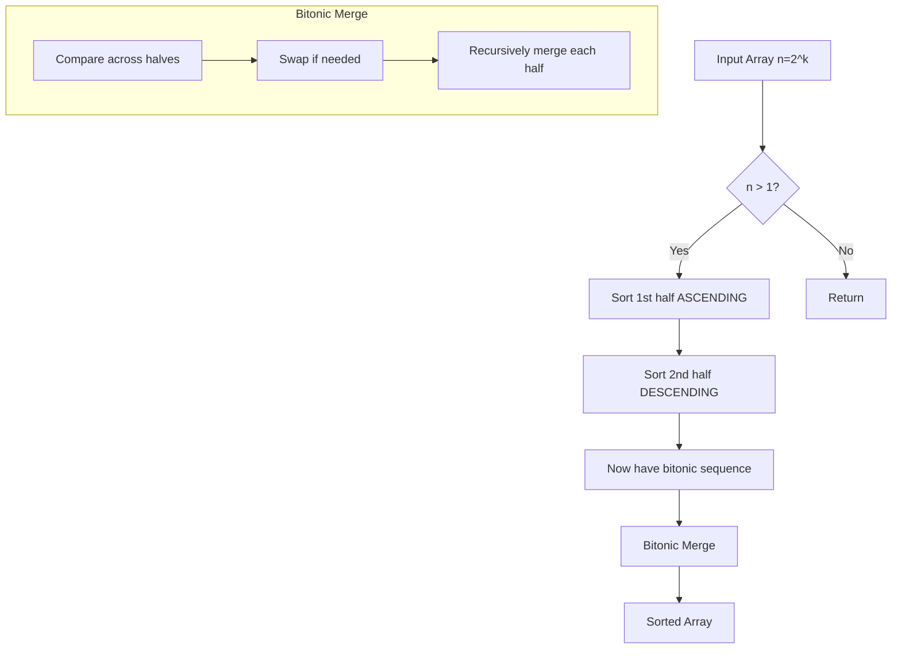

# Bitonic Sort

## Overview

| Property | Value |
|----------|-------|
| **Category** | Sorting Algorithm |
| **Type** | Comparison-Based (Sorting Network) |
| **Data Structure** | Array |
| **Space Complexity** | O(n log² n) or O(1) with in-place |
| **Stable** | No |
| **In-Place** | Yes |
| **Parallel** | Yes (highly parallelizable) |

**Constraint**: Input size must be a power of 2

---

## Mathematical Foundation

### Definition

Bitonic Sort is a **parallel comparison-based sorting algorithm** based on the concept of a bitonic sequence. It was designed by **Ken Batcher** in 1968 for use in sorting networks.

### Bitonic Sequence

A **bitonic sequence** is a sequence that:
1. First monotonically increases, then monotonically decreases, OR
2. Can be circularly shifted to satisfy condition 1

**Formal Definition:**
A sequence $a_0, a_1, ..., a_{n-1}$ is bitonic if there exists an index $i$ such that:
$$a_0 \leq a_1 \leq ... \leq a_i \geq a_{i+1} \geq ... \geq a_{n-1}$$

**Examples of Bitonic Sequences:**
- $[1, 3, 5, 7, 6, 4, 2]$ - increases then decreases
- $[5, 4, 2, 1, 3, 6, 8]$ - circular shift of bitonic
- $[1, 2, 3, 4]$ - monotonic increasing (trivially bitonic)
- $[4, 3, 2, 1]$ - monotonic decreasing (trivially bitonic)

### Bitonic Merge Property

**Key Theorem**: If we split a bitonic sequence into two halves and compare elements at corresponding positions, the result is:
1. Two smaller bitonic sequences
2. Each element in one half is smaller than or equal to all elements in the other half

Given bitonic sequence $B = [b_0, ..., b_{n-1}]$:
- Compare $b_i$ with $b_{i+n/2}$ for all $i < n/2$
- Swap if necessary to ensure $b_i \leq b_{i+n/2}$
- Result: Two bitonic sequences, with all elements in first half ≤ all in second half

### Sorting Network Representation

Bitonic Sort can be represented as a sorting network with:
- **Depth**: $O(\log^2 n)$
- **Comparators**: $O(n \log^2 n)$

The network is **data-oblivious** - the same comparisons are made regardless of input values.

### Recurrence Relation

$$T(n) = 2T(n/2) + O(n \log n)$$

Solving: $T(n) = O(n \log^2 n)$

For parallel execution with $n$ processors:
$$T_{parallel}(n) = O(\log^2 n)$$

---

## Pseudocode

### Main Algorithm

```
BITONIC-SORT(A, low, length, direction):
    // direction: 1 for ascending, 0 for descending
    Input: Array A, starting index low, length, sort direction
    Output: Sorted segment A[low:low+length]
    
    if length > 1:
        mid ← length / 2
        
        // Sort first half in ascending order
        BITONIC-SORT(A, low, mid, 1)
        
        // Sort second half in descending order
        BITONIC-SORT(A, low + mid, mid, 0)
        
        // Merge entire sequence in given direction
        BITONIC-MERGE(A, low, length, direction)


BITONIC-MERGE(A, low, length, direction):
    // Merge a bitonic sequence in the given direction
    
    if length > 1:
        mid ← length / 2
        
        // Compare and swap elements
        for i ← low to low + mid - 1:
            COMPARE-AND-SWAP(A, i, i + mid, direction)
        
        // Recursively merge the two halves
        BITONIC-MERGE(A, low, mid, direction)
        BITONIC-MERGE(A, low + mid, mid, direction)


COMPARE-AND-SWAP(A, i, j, direction):
    // Swap if elements are in wrong order for given direction
    
    if direction == 1:  // Ascending
        if A[i] > A[j]:
            swap(A[i], A[j])
    else:  // Descending
        if A[i] < A[j]:
            swap(A[i], A[j])
```

---

## Complexity Analysis

### Time Complexity

| Case | Complexity | Notes |
|------|------------|-------|
| **Best** | $O(n \log^2 n)$ | Always same |
| **Average** | $O(n \log^2 n)$ | Always same |
| **Worst** | $O(n \log^2 n)$ | Always same |

### Parallel Time Complexity

With $n$ processors:
$$T_{parallel}(n) = O(\log^2 n)$$

This makes Bitonic Sort excellent for parallel architectures.

### Space Complexity

| Implementation | Space |
|----------------|-------|
| Recursive | $O(\log^2 n)$ (call stack) |
| Iterative | $O(1)$ |

### Comparison with Other Sorts

| Algorithm | Sequential | Parallel (n proc) | Space |
|-----------|------------|-------------------|-------|
| Bitonic Sort | $O(n \log^2 n)$ | $O(\log^2 n)$ | $O(1)$ |
| Merge Sort | $O(n \log n)$ | $O(\log n)$ | $O(n)$ |
| Quick Sort | $O(n \log n)$ | $O(\log^2 n)$ | $O(\log n)$ |
| Odd-Even Sort | $O(n \log n)$ | $O(\log n)$ | $O(n)$ |

---

## Visual Representation

### Sorting Network Diagram

```
n = 8 elements: A[0] through A[7]

Stage 1: Create bitonic sequences of length 2
         ┌──┐   ┌──┐   ┌──┐   ┌──┐
A[0] ────┤↑ ├───┤  ├───┤  ├───┤  ├─── sorted
A[1] ────┤  ├───┤  ├───┤  ├───┤  ├─── sorted
         └──┘   │  │   │  │   │  │
         ┌──┐   │  │   │  │   │  │
A[2] ────┤↓ ├───┤↑ ├───┤  ├───┤  ├─── sorted
A[3] ────┤  ├───┤  ├───┤  ├───┤  ├─── sorted
         └──┘   └──┘   │  │   │  │
         ┌──┐   ┌──┐   │  │   │  │
A[4] ────┤↑ ├───┤↓ ├───┤↑ ├───┤  ├─── sorted
A[5] ────┤  ├───┤  ├───┤  ├───┤  ├─── sorted
         └──┘   │  │   └──┘   │  │
         ┌──┐   │  │   ┌──┐   │  │
A[6] ────┤↓ ├───┤  ├───┤  ├───┤↑ ├─── sorted
A[7] ────┤  ├───┤  ├───┤  ├───┤  ├─── sorted
         └──┘   └──┘   └──┘   └──┘

↑ = sort ascending, ↓ = sort descending
```

### Step-by-Step Example

```
Input: [3, 7, 4, 8, 6, 2, 1, 5]
n = 8 (power of 2 ✓)

Step 1: Create bitonic pairs
  [3,7] ↑ → [3,7]    [4,8] ↓ → [8,4]
  [6,2] ↑ → [2,6]    [1,5] ↓ → [5,1]
  
  Array: [3, 7, 8, 4, 2, 6, 5, 1]
              ↑↑↓↓    ↑↑↓↓

Step 2: Create bitonic sequences of length 4
  Merge [3,7] and [8,4]:
    Compare: (3,8)→[3,8], (7,4)→[4,7]
    → [3, 4, 8, 7] (bitonic!)
    Merge: [3,4] ↑, [8,7] → [7,8] ↑
    → [3, 4, 7, 8]
    
  Merge [2,6] and [5,1] in descending:
    Compare: (2,5)→[5,2], (6,1)→[6,1]
    → [5, 6, 2, 1] (bitonic!)
    Merge: [6,5] ↓, [2,1] ↓
    → [6, 5, 2, 1]

  Array: [3, 4, 7, 8, 6, 5, 2, 1]
              ↑↑↑↑    ↓↓↓↓

Step 3: Create bitonic sequence of length 8
  Array is now bitonic: [3,4,7,8,6,5,2,1]
                         ↑ ↑ ↑ ↑ ↓ ↓ ↓ ↓
  
  Compare across halves (gap=4):
    (3,6)→[3,6], (4,5)→[4,5], (7,2)→[2,7], (8,1)→[1,8]
    → [3, 4, 2, 1, 6, 5, 7, 8]
    
  Bitonic merge (gap=2):
    → [2, 1, 3, 4, 6, 5, 7, 8]
    
  Bitonic merge (gap=1):
    → [1, 2, 3, 4, 5, 6, 7, 8]

Final: [1, 2, 3, 4, 5, 6, 7, 8] ✓
```

### Algorithm Flow



---

## Implementation Details

### Python Implementation

```python
def comp_and_swap(array: list[int], index1: int, index2: int, direction: int) -> None:
    """
    Compare and swap elements based on sorting direction.
    direction: 1 for ascending, 0 for descending
    
    >>> arr = [12, 42, -21, 1]
    >>> comp_and_swap(arr, 1, 2, 1)
    >>> arr
    [12, -21, 42, 1]
    """
    if (direction == 1 and array[index1] > array[index2]) or \
       (direction == 0 and array[index1] < array[index2]):
        array[index1], array[index2] = array[index2], array[index1]


def bitonic_merge(array: list[int], low: int, length: int, direction: int) -> None:
    """
    Recursively sort a bitonic sequence.
    
    >>> arr = [12, 42, -21, 1]
    >>> bitonic_merge(arr, 0, 4, 1)
    >>> arr
    [-21, 1, 12, 42]
    """
    if length > 1:
        middle = length // 2
        for i in range(low, low + middle):
            comp_and_swap(array, i, i + middle, direction)
        bitonic_merge(array, low, middle, direction)
        bitonic_merge(array, low + middle, middle, direction)


def bitonic_sort(array: list[int], low: int, length: int, direction: int) -> None:
    """
    Sort array using Bitonic Sort algorithm.
    
    >>> arr = [12, 34, 92, -23, 0, -121, -167, 145]
    >>> bitonic_sort(arr, 0, 8, 1)
    >>> arr
    [-167, -121, -23, 0, 12, 34, 92, 145]
    """
    if length > 1:
        middle = length // 2
        bitonic_sort(array, low, middle, 1)  # Sort ascending
        bitonic_sort(array, low + middle, middle, 0)  # Sort descending
        bitonic_merge(array, low, length, direction)
```

### Iterative Implementation (For GPU)

```python
def bitonic_sort_iterative(array: list[int]) -> list[int]:
    """
    Iterative bitonic sort - better for GPU implementation.
    """
    n = len(array)
    
    # k is the size of bitonic sequences being merged
    k = 2
    while k <= n:
        # j is the stride for comparing elements
        j = k // 2
        while j >= 1:
            for i in range(n):
                # l is the XOR of i and j
                l = i ^ j
                if l > i:
                    # Determine direction based on bit pattern
                    if (i & k) == 0:
                        # Ascending
                        if array[i] > array[l]:
                            array[i], array[l] = array[l], array[i]
                    else:
                        # Descending
                        if array[i] < array[l]:
                            array[i], array[l] = array[l], array[i]
            j //= 2
        k *= 2
    
    return array
```

### Edge Cases

| Case | Handling |
|------|----------|
| Empty array | Return empty |
| Single element | Return as-is |
| Non-power of 2 | Pad with infinity or use different algorithm |
| Already sorted | Same operations (non-adaptive) |

---

## Real-World Applications

### 1. **GPU Computing (CUDA)**

**Use Case**: Sorting on graphics processors where parallelism is massive.

```python
# Conceptual CUDA-style implementation
class GPUBitonicSort:
    """
    Bitonic sort is ideal for GPUs because:
    - Data-oblivious (same operations regardless of data)
    - Highly parallel
    - Simple control flow (no branching)
    - Coalesced memory access patterns
    """
    
    def __init__(self, device):
        self.device = device
    
    def sort(self, data):
        """
        Each CUDA thread handles one comparison.
        Parallel stages are synchronized with barriers.
        """
        n = len(data)
        
        # Ensure power of 2
        if n & (n - 1) != 0:
            next_pow2 = 1 << (n - 1).bit_length()
            data = list(data) + [float('inf')] * (next_pow2 - n)
        
        # Each 'stage' can run in parallel
        k = 2
        while k <= len(data):
            j = k // 2
            while j >= 1:
                # ALL comparisons in this step run in parallel
                self._parallel_compare_step(data, k, j)
                j //= 2
            k *= 2
        
        return data[:n]  # Remove padding
```

### 2. **FPGA Implementation**

**Use Case**: Hardware sorting for real-time systems.

```python
class FPGABitonicNetwork:
    """
    Bitonic sort maps directly to hardware:
    - Fixed number of comparators
    - Known latency (log²n stages)
    - No dynamic memory allocation
    """
    
    def __init__(self, n_elements):
        self.n = n_elements
        self.comparators = self._generate_network()
    
    def _generate_network(self):
        """Generate comparator network at compile time."""
        comparators = []
        k = 2
        while k <= self.n:
            j = k // 2
            while j >= 1:
                stage_comparators = []
                for i in range(self.n):
                    l = i ^ j
                    if l > i:
                        direction = (i & k) == 0
                        stage_comparators.append((i, l, direction))
                comparators.append(stage_comparators)
                j //= 2
            k *= 2
        return comparators
```

### 3. **Network Packet Sorting**

**Use Case**: High-speed network switches sorting packets by priority.

```python
class PacketSorter:
    """
    Sort network packets by priority using bitonic sort.
    Fixed latency is important for real-time networking.
    """
    
    def __init__(self, buffer_size=16):  # Power of 2
        self.buffer_size = buffer_size
        self.buffer = []
    
    def sort_batch(self, packets):
        """
        Sort packets with guaranteed latency.
        Bitonic sort's fixed execution time is ideal.
        """
        # Pad to power of 2
        n = len(packets)
        padded = packets + [None] * (self.buffer_size - n)
        
        # Sort using bitonic sort
        k = 2
        while k <= self.buffer_size:
            j = k // 2
            while j >= 1:
                for i in range(self.buffer_size):
                    l = i ^ j
                    if l > i and padded[i] and padded[l]:
                        direction = (i & k) == 0
                        if direction:
                            if padded[i].priority > padded[l].priority:
                                padded[i], padded[l] = padded[l], padded[i]
                        else:
                            if padded[i].priority < padded[l].priority:
                                padded[i], padded[l] = padded[l], padded[i]
                j //= 2
            k *= 2
        
        return [p for p in padded if p is not None]
```

### 4. **Database Parallel Query Processing**

**Use Case**: Sorting large datasets in parallel database systems.

```python
class ParallelDatabaseSort:
    """
    Sort database records across multiple processing units.
    Bitonic sort enables efficient parallel sorting.
    """
    
    def __init__(self, num_processors):
        self.processors = num_processors
    
    def parallel_sort(self, records):
        """
        Distribute sorting across processors.
        Each processor handles a subset of comparisons.
        """
        n = len(records)
        
        # Each processor handles n/p comparisons per stage
        comparisons_per_proc = n // self.processors
        
        k = 2
        while k <= n:
            j = k // 2
            while j >= 1:
                # Distribute comparisons to processors
                all_comparisons = []
                for i in range(n):
                    l = i ^ j
                    if l > i:
                        direction = (i & k) == 0
                        all_comparisons.append((i, l, direction))
                
                # Each processor executes its share in parallel
                self._parallel_execute(records, all_comparisons)
                
                j //= 2
            k *= 2
        
        return records
```

---

## When to Use Bitonic Sort

### ✅ Ideal Scenarios

1. **GPU sorting** - Massively parallel execution
2. **FPGA/ASIC** - Hardware implementation
3. **Sorting networks** - Fixed comparison patterns
4. **Real-time systems** - Predictable latency
5. **Power-of-2 sized data** - No padding needed

### ❌ Avoid When

1. **Sequential execution** - $O(n \log^2 n)$ is slower than $O(n \log n)$
2. **Non-power of 2 sizes** - Requires padding
3. **Stability required** - Bitonic sort is not stable
4. **Cache-sensitive** - Access patterns may cause cache misses

---

## Parallelization Details

### Parallel Complexity

| Metric | Value |
|--------|-------|
| **Work** | $O(n \log^2 n)$ |
| **Depth** | $O(\log^2 n)$ |
| **Processors** | $O(n)$ |
| **Cost Optimal** | No (work > $n \log n$) |

### GPU Kernel Design

```
Stages: log₂(n) × (log₂(n) + 1) / 2

For n = 1024:
  Stages = 10 × 11 / 2 = 55 kernel launches
  Each stage: 512 parallel comparisons
  
Threads per block: 256-512 (hardware dependent)
Blocks: n / (2 × threads_per_block)
```

---

## References

1. Batcher, K. (1968). "Sorting Networks and Their Applications"
2. NVIDIA CUDA Samples - Bitonic Sort
3. [Wikipedia: Bitonic Sorter](https://en.wikipedia.org/wiki/Bitonic_sorter)
4. Cormen, T.H. et al. "Introduction to Algorithms" - Sorting Networks

---

## See Also

- [Odd-Even Merge Sort](odd_even_merge_sort.md) - Another sorting network
- [Merge Sort](merge_sort.md) - Better for sequential execution
- [Parallel Quick Sort](parallel_quick_sort.md) - Alternative parallel sort

