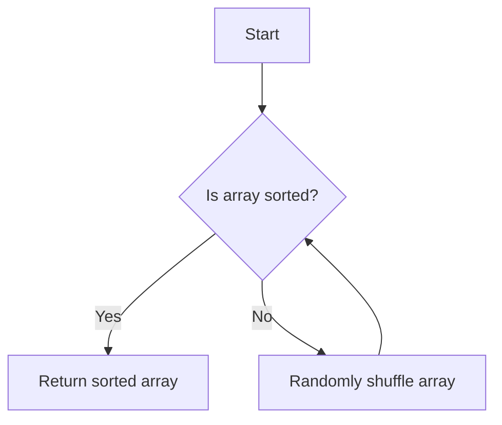

# Bogo Sort

## Overview

| Property | Value |
|----------|-------|
| **Category** | Sorting Algorithm |
| **Type** | Randomized (Non-Comparison Based) |
| **Data Structure** | Array |
| **Space Complexity** | O(1) or O(n) |
| **Stable** | No |
| **In-Place** | Yes (shuffles) |
| **Adaptive** | No |

**Also Known As**: Permutation Sort, Stupid Sort, Slowsort, Shotgun Sort, Monkey Sort

---

## Mathematical Foundation

### Definition

Bogo Sort is a highly ineffective sorting algorithm based on the "generate and test" paradigm. It works by randomly shuffling the elements and checking if the result is sorted. This process repeats until the array happens to be in sorted order.

### Algorithm Principle

1. Check if the array is sorted
2. If not sorted, randomly shuffle all elements
3. Repeat until sorted

This is analogous to:
- Throwing a deck of cards in the air and picking them up randomly until sorted
- A monkey randomly typing until it produces a sorted sequence

### Probability Analysis

For an array of $n$ distinct elements:

**Probability of being sorted after one shuffle:**
$$P(\text{sorted}) = \frac{1}{n!}$$

**Expected number of shuffles:**
$$E[\text{shuffles}] = n!$$

### Expected Time Complexity

Each shuffle takes $O(n)$ time, and each check takes $O(n)$ time.

**Expected total time:**
$$E[T(n)] = O(n \cdot n!) + O(n \cdot n!) = O(n \cdot n!)$$

### Variance Analysis

The number of trials follows a geometric distribution with $p = \frac{1}{n!}$:

**Variance:**
$$\text{Var}[\text{shuffles}] = \frac{1 - p}{p^2} = \frac{1 - \frac{1}{n!}}{(\frac{1}{n!})^2} \approx (n!)^2$$

**Standard deviation:**
$$\sigma \approx n!$$

This means the actual running time can vary enormously!

### Comparison with Factorial

| n | n! | Time at 1M shuffles/sec |
|---|----|-----------------------|
| 5 | 120 | 0.12 ms |
| 10 | 3,628,800 | 3.6 sec |
| 12 | 479,001,600 | 8 min |
| 15 | 1.3 × 10¹² | 15 days |
| 20 | 2.4 × 10¹⁸ | 77,000 years |

### Best and Worst Case

**Best Case:**
- Array is already sorted
- Single check: $O(n)$

**Worst Case:**
- Never terminates (theoretically)
- With bounded randomness: Could take arbitrarily long

**Average Case:**
- $O(n \cdot n!)$ as derived above

---

## Pseudocode

```
BOGO-SORT(A):
    Input: Array A of n elements
    Output: Sorted array A
    
    while not IS-SORTED(A):
        SHUFFLE(A)
    
    return A


IS-SORTED(A):
    // Check if array is sorted in ascending order
    for i ← 0 to n - 2:
        if A[i] > A[i + 1]:
            return false
    return true


SHUFFLE(A):
    // Fisher-Yates shuffle (Knuth shuffle)
    for i ← n - 1 downto 1:
        j ← random(0, i)  // Random integer in [0, i]
        swap(A[i], A[j])
```

---

## Complexity Analysis

### Time Complexity

| Case | Complexity | Probability |
|------|------------|-------------|
| **Best** | $O(n)$ | $\frac{1}{n!}$ |
| **Average** | $O(n \cdot n!)$ | - |
| **Worst** | $\infty$ (unbounded) | - |

### Space Complexity

| Implementation | Space |
|----------------|-------|
| In-place shuffle | $O(1)$ |
| With copy | $O(n)$ |

### Growth Rate Comparison

| Algorithm | Average Time |
|-----------|--------------|
| Bogo Sort | $O(n \cdot n!)$ |
| Bubble Sort | $O(n^2)$ |
| Quick Sort | $O(n \log n)$ |
| Merge Sort | $O(n \log n)$ |

**For n = 10:**
- Bogo Sort: ~36,000,000 operations
- Bubble Sort: ~100 operations
- Quick Sort: ~33 operations

---

## Visual Representation

### Algorithm Flow



### Probability Tree

```
                    Start
                      │
            ┌─────────┼─────────┐
            │         │         │
        Shuffle 1  Shuffle 2  ...  Shuffle k
            │         │              │
       P = 1/n!   P = 1/n!      P = 1/n!
            │         │              │
        Sorted?   Sorted?        Sorted?
```

### Example Execution

```
Input: [3, 2, 1]  (n = 3, n! = 6)

Check 1: [3, 2, 1] - Not sorted
Shuffle: [2, 1, 3]

Check 2: [2, 1, 3] - Not sorted
Shuffle: [1, 3, 2]

Check 3: [1, 3, 2] - Not sorted
Shuffle: [3, 1, 2]

Check 4: [3, 1, 2] - Not sorted
Shuffle: [1, 2, 3]

Check 5: [1, 2, 3] - SORTED! ✓

Result: [1, 2, 3]
(Took 5 attempts, expected: 6)
```

---

## Implementation Details

### Python Implementation

```python
import random

def bogo_sort(collection):
    """
    Pure implementation of the bogosort algorithm in Python.
    
    :param collection: mutable ordered collection with comparable items
    :return: the same collection ordered by ascending
    
    Examples:
    >>> bogo_sort([0, 5, 3, 2, 2])
    [0, 2, 2, 3, 5]
    >>> bogo_sort([])
    []
    >>> bogo_sort([-2, -5, -45])
    [-45, -5, -2]
    """
    
    def is_sorted(collection):
        for i in range(len(collection) - 1):
            if collection[i] > collection[i + 1]:
                return False
        return True
    
    while not is_sorted(collection):
        random.shuffle(collection)
    
    return collection
```

### Variations

#### Bogo Bogo Sort (Even Worse!)

```python
def bogo_bogo_sort(collection):
    """
    Recursively bogo sort increasingly larger prefixes.
    Even slower than regular bogo sort!
    """
    def is_sorted(arr):
        return all(arr[i] <= arr[i+1] for i in range(len(arr)-1))
    
    n = len(collection)
    if n <= 1:
        return collection
    
    # First, bogo-bogo sort the first n-1 elements
    while not is_sorted(collection[:n-1]):
        collection[:n-1] = bogo_bogo_sort(collection[:n-1])
    
    # Then shuffle until entire array is sorted
    while not is_sorted(collection):
        random.shuffle(collection)
    
    return collection
```

#### Bozo Sort (Single Swap Variant)

```python
def bozo_sort(collection):
    """
    Instead of shuffling, swap two random elements.
    Slightly different probability distribution.
    """
    def is_sorted(arr):
        return all(arr[i] <= arr[i+1] for i in range(len(arr)-1))
    
    while not is_sorted(collection):
        i, j = random.sample(range(len(collection)), 2)
        collection[i], collection[j] = collection[j], collection[i]
    
    return collection
```

#### Quantum Bogo Sort (Theoretical)

```python
def quantum_bogo_sort(collection):
    """
    Theoretical quantum version:
    1. Quantumly superpose all permutations
    2. Observe only the sorted permutation
    3. Destroy all other universes
    
    Time: O(1) in the surviving universe!
    (Note: This is humorous, not implementable)
    """
    # In theory, O(1) time complexity
    # In practice, requires many-worlds interpretation
    pass
```

---

## Real-World Applications

### ⚠️ Important Note

**Bogo Sort should NEVER be used in production code.** It exists purely for:
1. Educational purposes
2. Demonstrating bad algorithm design
3. Humor in computer science

### 1. **Educational Tool**

**Use Case**: Teaching algorithm analysis and probability.

```python
class BogoSortEducator:
    """
    Use Bogo Sort to teach:
    - Expected value and probability
    - Big-O notation for unbounded algorithms
    - Why algorithm efficiency matters
    """
    
    def __init__(self):
        self.attempts = 0
    
    def demonstrate(self, data):
        """Show how Bogo Sort illustrates probability."""
        import random
        import math
        
        n = len(data)
        expected = math.factorial(n)
        
        print(f"Array size: {n}")
        print(f"Expected shuffles: {expected}")
        
        self.attempts = 0
        while not self._is_sorted(data):
            random.shuffle(data)
            self.attempts += 1
            
            if self.attempts % 1000 == 0:
                print(f"  Attempt {self.attempts}...")
        
        print(f"Actual shuffles: {self.attempts}")
        print(f"Ratio: {self.attempts / expected:.2f}x expected")
        
        return data
    
    def _is_sorted(self, data):
        return all(data[i] <= data[i+1] for i in range(len(data)-1))
```

### 2. **Randomness Testing**

**Use Case**: Testing random number generator quality.

```python
class RNGTester:
    """
    Use Bogo Sort behavior to test RNG quality.
    A good RNG should produce expected distribution of attempts.
    """
    
    def test_rng_uniformity(self, rng, array_size=4, trials=1000):
        """
        Test if RNG produces uniform distribution of permutations.
        """
        import math
        
        expected = math.factorial(array_size)
        attempt_counts = []
        
        for _ in range(trials):
            data = list(range(array_size))
            attempts = 0
            
            while not self._is_sorted(data):
                self._shuffle(data, rng)
                attempts += 1
            
            attempt_counts.append(attempts)
        
        avg_attempts = sum(attempt_counts) / len(attempt_counts)
        
        # Should be close to factorial(array_size)
        error = abs(avg_attempts - expected) / expected
        
        return {
            'expected': expected,
            'observed_avg': avg_attempts,
            'relative_error': error,
            'pass': error < 0.1  # Within 10%
        }
```

### 3. **Algorithm Comparison Teaching**

**Use Case**: Demonstrating the importance of algorithm selection.

```python
import time
import random

def compare_sorting_algorithms():
    """
    Compare Bogo Sort with real algorithms to show
    the importance of algorithm selection.
    """
    # Small array for Bogo Sort (it would take too long otherwise)
    small_array = [5, 2, 4, 1, 3]
    
    # Test Bogo Sort
    test_array = small_array.copy()
    start = time.time()
    bogo_sort(test_array)
    bogo_time = time.time() - start
    
    # Test built-in sort (Tim Sort)
    test_array = small_array.copy()
    start = time.time()
    sorted(test_array)
    tim_time = time.time() - start
    
    print(f"Array size: {len(small_array)}")
    print(f"Bogo Sort: {bogo_time:.6f}s")
    print(f"Tim Sort:  {tim_time:.9f}s")
    print(f"Ratio: Bogo is {bogo_time/tim_time:.0f}x slower")
    
    # Extrapolate
    print("\nExtrapolated for n=10:")
    print(f"Tim Sort: ~0.000001s")
    print(f"Bogo Sort: ~{3628800 * bogo_time / 120:.0f}s")
```

---

## Theoretical Interest

### Connection to Infinite Monkey Theorem

Bogo Sort is related to the infinite monkey theorem:

> A monkey hitting keys at random on a typewriter for an infinite amount of time will almost surely type any given text.

Similarly, Bogo Sort will almost surely sort any array given infinite time.

**Probability of NOT sorting after k attempts:**
$$P(\text{not sorted after k}) = \left(1 - \frac{1}{n!}\right)^k$$

**Limit as k → ∞:**
$$\lim_{k \to \infty} \left(1 - \frac{1}{n!}\right)^k = 0$$

### Las Vegas Algorithm Classification

Bogo Sort is a **Las Vegas algorithm**:
- Always produces correct result (when it terminates)
- Running time is random
- Expected time is bounded (but high)

Contrast with **Monte Carlo algorithms**:
- May produce incorrect result
- Running time is bounded
- Probability of correctness is bounded

---

## When to Use Bogo Sort

### ✅ Acceptable Uses

1. **Teaching** - Illustrating algorithm analysis
2. **Humor** - Computer science jokes
3. **Thought experiments** - Discussing algorithmic bounds
4. **Testing** - Randomness quality testing

### ❌ Never Use For

1. **Any production code** - Ever
2. **Any data larger than ~5 elements**
3. **Any time-sensitive application**
4. **Any situation where you need results**

---

## Fun Facts

1. **Worst Sort Ever?** - Bogo Sort is often cited as the worst practical sorting algorithm
2. **Guaranteed to Terminate** - With a true random number generator, it will eventually terminate (with probability 1)
3. **Memory Efficient** - Ironically, it's O(1) space!
4. **Quantum Version** - The quantum bogo sort joke suggests O(n) time by destroying "wrong" universes

---

## Complexity Comparison

| Algorithm | Average Time | For n=10 |
|-----------|--------------|----------|
| Bogo Sort | $O(n \cdot n!)$ | ~36M ops |
| Stooge Sort | $O(n^{2.7})$ | ~500 ops |
| Bubble Sort | $O(n^2)$ | ~100 ops |
| Insertion Sort | $O(n^2)$ | ~100 ops |
| Quick Sort | $O(n \log n)$ | ~33 ops |
| Radix Sort | $O(n \cdot k)$ | ~20 ops |

---

## References

1. [Wikipedia: Bogosort](https://en.wikipedia.org/wiki/Bogosort)
2. Gruber, H. et al. (2007). "The Complexity of Bogosort"
3. [Sorting Algorithm Animations](https://www.toptal.com/developers/sorting-algorithms)

---

## See Also

- [Stooge Sort](stooge_sort.md) - Another inefficient but deterministic sort
- [Quick Sort](quick_sort.md) - An efficient randomized sort
- [Sleep Sort](sleep_sort.md) - Another humorous sorting algorithm

