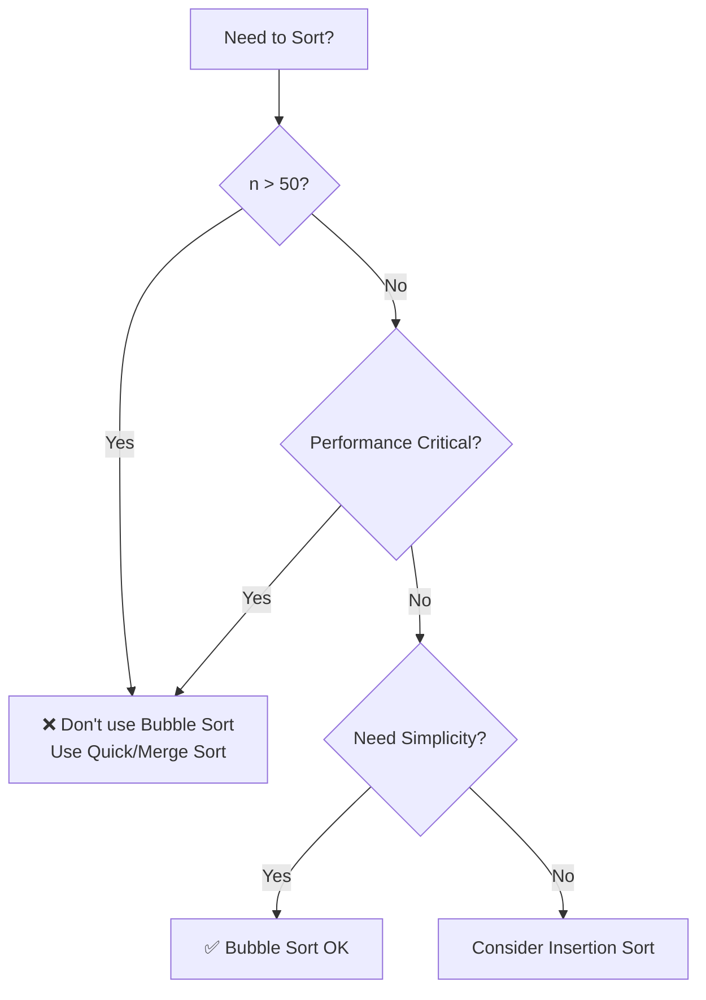

# Bubble Sort

## Overview

| Property | Value |
|----------|-------|
| **Category** | Sorting Algorithm (Comparison-Based) |
| **Time Complexity (Best)** | O(n) |
| **Time Complexity (Average)** | O(n²) |
| **Time Complexity (Worst)** | O(n²) |
| **Space Complexity** | O(1) |
| **Stability** | Yes |
| **In-place** | Yes |
| **Adaptive** | Yes (with optimization) |
| **Source File** | [`sorts/bubble_sort.py`](../../../sorts/bubble_sort.py) |

---

## 1. Mathematical Foundation

### 1.1 Problem Definition

**Sorting Problem:**

$$
\text{Given: } A = \{a_1, a_2, \ldots, a_n\} \text{ (unordered sequence)}
$$

$$
\text{Find: } A' = \{a'_1, a'_2, \ldots, a'_n\} \text{ such that } a'_1 \leq a'_2 \leq \ldots \leq a'_n
$$

$$
\text{where } A' \text{ is a permutation of } A
$$

### 1.2 Core Mathematical Concepts

**Inversion Count:**
An inversion is a pair $(i, j)$ where $i < j$ but $a_i > a_j$.

$$
\text{Inversions}(A) = |\{(i,j) : i < j \text{ and } a_i > a_j\}|
$$

Bubble Sort works by repeatedly eliminating adjacent inversions. Each swap removes exactly one inversion.

**Maximum Inversions:**
For a completely reversed array of size $n$:

$$
\text{Max Inversions} = \frac{n(n-1)}{2} = \binom{n}{2}
$$

### 1.3 Key Formulas

**Number of Comparisons (Worst Case):**

$$
C(n) = \sum_{i=1}^{n-1} (n-i) = \sum_{i=1}^{n-1} i = \frac{n(n-1)}{2} = O(n^2)
$$

**Number of Swaps (Worst Case):**

$$
S(n) = \frac{n(n-1)}{2} = O(n^2)
$$

**Number of Passes:**

$$
P(n) \leq n - 1
$$

### 1.4 Proof of Correctness

**Loop Invariant:** After pass $i$, the largest $i$ elements are in their final sorted positions at the end of the array.

**Proof by Induction:**

**Base Case (i = 1):**
After the first pass, the largest element has "bubbled up" to the last position. This is because it wins every comparison and is swapped right until it reaches the end.

**Inductive Step:**
Assume after pass $k$, the largest $k$ elements are correctly positioned. In pass $k+1$, we iterate through elements $a_1$ to $a_{n-k}$. The $(k+1)$th largest element will bubble up to position $n-k$, placing $k+1$ elements correctly.

**Termination:**
After at most $n-1$ passes, all elements are in their correct positions. The algorithm terminates because:
1. Each pass places at least one element in its final position
2. The algorithm stops when no swaps occur (optimization) or after $n-1$ passes

---

## 2. Algorithm Description

### 2.1 Intuition

Bubble Sort gets its name from the way larger elements "bubble up" to the end of the array, like bubbles rising to the surface of water.

The algorithm repeatedly steps through the list, compares adjacent elements, and swaps them if they are in the wrong order. This process is repeated until no swaps are needed, indicating the list is sorted.

### 2.2 Key Insights

1. **Locality of Comparison:** Only adjacent elements are compared, making it simple but inefficient for large datasets
2. **Adaptive Nature:** With the "swapped" flag optimization, the algorithm can detect a sorted array in O(n) time
3. **Reduction of Problem Size:** After each pass, the rightmost unsorted position moves left, reducing the search space

### 2.3 Step-by-Step Process

1. **Initialize:** Set up a variable to track if any swaps occurred
2. **Outer Loop:** Repeat for n-1 passes (or until no swaps occur)
3. **Inner Loop:** Compare adjacent pairs from start to unsorted boundary
4. **Swap:** If left element > right element, swap them
5. **Early Termination:** If no swaps in a pass, array is sorted

---

## 3. Pseudocode

### 3.1 Iterative Version (Optimized)

```
ALGORITHM BubbleSort(A[0..n-1])
────────────────────────────────────────
INPUT:  A - array of n comparable elements
OUTPUT: A - sorted in ascending order

1.  n ← length(A)
2.  
3.  FOR i ← n-1 DOWNTO 1 DO
4.      swapped ← FALSE
5.      
6.      FOR j ← 0 TO i-1 DO
7.          IF A[j] > A[j+1] THEN
8.              SWAP(A[j], A[j+1])
9.              swapped ← TRUE
10.         END IF
11.     END FOR
12.     
13.     IF NOT swapped THEN
14.         BREAK    // Array is sorted
15.     END IF
16. END FOR
17. 
18. RETURN A
────────────────────────────────────────
```

### 3.2 Recursive Version

```
ALGORITHM BubbleSortRecursive(A[0..n-1], n)
────────────────────────────────────────
INPUT:  A - array of comparable elements
        n - number of elements to consider
OUTPUT: A - sorted in ascending order

1.  IF n ≤ 1 THEN
2.      RETURN A
3.  END IF
4.  
5.  swapped ← FALSE
6.  FOR i ← 0 TO n-2 DO
7.      IF A[i] > A[i+1] THEN
8.          SWAP(A[i], A[i+1])
9.          swapped ← TRUE
10.     END IF
11. END FOR
12. 
13. IF NOT swapped THEN
14.     RETURN A
15. END IF
16. 
17. RETURN BubbleSortRecursive(A, n-1)
────────────────────────────────────────
```

---

## 4. Complexity Analysis

### 4.1 Time Complexity

| Case | Complexity | Condition |
|------|------------|-----------|
| **Best** | O(n) | Array is already sorted (with optimization) |
| **Average** | O(n²) | Random arrangement |
| **Worst** | O(n²) | Array is sorted in reverse order |

**Detailed Analysis:**

```
Best Case: Already Sorted
- First pass: n-1 comparisons, 0 swaps
- swapped = FALSE → algorithm terminates
- Total: O(n)

Worst Case: Reverse Sorted
- Pass 1: n-1 comparisons and swaps
- Pass 2: n-2 comparisons and swaps
- ...
- Pass n-1: 1 comparison and swap

Total comparisons = (n-1) + (n-2) + ... + 1
                  = n(n-1)/2
                  = O(n²)

Average Case:
- Expected inversions ≈ n(n-1)/4
- Still requires O(n²) comparisons
- Total: O(n²)
```

### 4.2 Space Complexity

| Type | Complexity | Description |
|------|------------|-------------|
| **Auxiliary Space** | O(1) | Only uses constant extra variables |
| **Input Space** | O(n) | Original array storage |
| **Total Space** | O(n) | Dominated by input |

**Memory Breakdown:**
- Loop counters: O(1) - 2-3 integer variables
- Swap flag: O(1) - single boolean
- Temp for swap: O(1) - single element
- Recursion stack (recursive version): O(n) in worst case

### 4.3 Comparison Count Formula

For an array with $k$ inversions:

$$
\text{Comparisons} = \sum_{i=0}^{p-1} (n - 1 - i)
$$

where $p$ is the number of passes needed.

---

## 5. Implementation Details

### 5.1 Key Data Structures

| Data Structure | Purpose | Operations Used |
|----------------|---------|-----------------|
| Array/List | Store elements | Index access O(1), Swap O(1) |
| Boolean flag | Track swaps | Set/Check O(1) |

### 5.2 Important Variables

| Variable | Type | Purpose |
|----------|------|---------|
| `collection` | list | The array to be sorted |
| `length` | int | Size of the array |
| `i` | int | Outer loop counter (boundary) |
| `j` | int | Inner loop counter (comparison index) |
| `swapped` | bool | Optimization flag |

### 5.3 Edge Cases

| Edge Case | Expected Behavior | Handling |
|-----------|-------------------|----------|
| Empty array | Return empty | Length check: `if n ≤ 1` |
| Single element | Return as-is | Same as above |
| All duplicates | Return same array | No swaps needed after first pass |
| Already sorted | O(n) completion | `swapped` flag terminates early |
| Reverse sorted | O(n²) with n-1 passes | Maximum comparisons and swaps |
| Two elements | Single comparison | Works correctly |

---

## 6. Visual Representation

### 6.1 Algorithm Flow

```mermaid
flowchart TD
    A[Start] --> B[Initialize: i = n-1]
    B --> C{i ≥ 1?}
    C -->|No| K[Return sorted array]
    C -->|Yes| D[Set swapped = false]
    D --> E[Initialize: j = 0]
    E --> F{j < i?}
    F -->|No| I{swapped?}
    F -->|Yes| G{A[j] > A[j+1]?}
    G -->|Yes| H[Swap A[j], A[j+1]<br>swapped = true]
    G -->|No| J[j = j + 1]
    H --> J
    J --> F
    I -->|No| K
    I -->|Yes| L[i = i - 1]
    L --> C
```

### 6.2 Step-by-Step Example

**Input:** `[5, 3, 8, 4, 2]`

| Pass | Comparisons | Array State | Swaps |
|------|-------------|-------------|-------|
| Initial | - | [5, 3, 8, 4, 2] | - |
| **Pass 1** | | | |
| | 5 > 3? ✓ | [**3, 5**, 8, 4, 2] | 1 |
| | 5 > 8? ✗ | [3, 5, 8, 4, 2] | - |
| | 8 > 4? ✓ | [3, 5, **4, 8**, 2] | 2 |
| | 8 > 2? ✓ | [3, 5, 4, **2, 8**] | 3 |
| **Pass 2** | | | |
| | 3 > 5? ✗ | [3, 5, 4, 2, 8] | - |
| | 5 > 4? ✓ | [3, **4, 5**, 2, 8] | 4 |
| | 5 > 2? ✓ | [3, 4, **2, 5**, 8] | 5 |
| **Pass 3** | | | |
| | 3 > 4? ✗ | [3, 4, 2, 5, 8] | - |
| | 4 > 2? ✓ | [3, **2, 4**, 5, 8] | 6 |
| **Pass 4** | | | |
| | 3 > 2? ✓ | [**2, 3**, 4, 5, 8] | 7 |

**Output:** `[2, 3, 4, 5, 8]`

### 6.3 Visualization of "Bubbling"

```
Initial:  [5] [3] [8] [4] [2]
           ↓   ↓
          Swap
          [3] [5] [8] [4] [2]
                   ↓   ↓
                  Swap
          [3] [5] [4] [8] [2]
                       ↓   ↓
                      Swap
Pass 1:   [3] [5] [4] [2] [8]  ← 8 bubbled to end
                            ✓
```

---

## 7. Comparison with Related Algorithms

| Algorithm | Time (Avg) | Time (Worst) | Space | Stable | In-Place | Best Use Case |
|-----------|------------|--------------|-------|--------|----------|---------------|
| **Bubble Sort** | O(n²) | O(n²) | O(1) | ✅ | ✅ | Educational, tiny arrays |
| Selection Sort | O(n²) | O(n²) | O(1) | ❌ | ✅ | Minimum writes needed |
| Insertion Sort | O(n²) | O(n²) | O(1) | ✅ | ✅ | Nearly sorted, small n |
| Merge Sort | O(n log n) | O(n log n) | O(n) | ✅ | ❌ | Large datasets, stability |
| Quick Sort | O(n log n) | O(n²) | O(log n) | ❌ | ✅ | General purpose |

### When to Choose Bubble Sort

- ✅ **Educational purposes** - Simple to understand and implement
- ✅ **Tiny datasets** (n < 10) - Overhead of complex algorithms not justified
- ✅ **Nearly sorted data** - Adaptive version runs in O(n)
- ✅ **Memory constraints** - Only O(1) extra space needed
- ❌ **Large datasets** - O(n²) is prohibitively slow
- ❌ **Performance-critical applications** - Use O(n log n) algorithms instead

---

## 8. Real-World Applications in Software Engineering

### 8.1 Industry Use Cases

| Industry | Application | Why Bubble Sort |
|----------|-------------|-----------------|
| **Education** | Teaching sorting concepts | Simplest algorithm to understand |
| **Embedded Systems** | Sorting small fixed-size buffers | Minimal memory footprint |
| **Graphics** | Sorting small vertex lists | When n is guaranteed small |
| **Networking** | Packet ordering (small batches) | Simple implementation in hardware |

### 8.2 Practical Examples

#### Example 1: Leaderboard Top 5

**Problem:** Display top 5 scores from a small local leaderboard

**Solution:** For very small lists, bubble sort's simplicity wins

```python
def get_top_scores(scores: list[int], top_n: int = 5) -> list[int]:
    """
    Get top N scores from a small leaderboard.
    For small lists, bubble sort is acceptable.
    
    >>> get_top_scores([85, 92, 78, 95, 88, 91, 73], 5)
    [95, 92, 91, 88, 85]
    """
    # Copy to avoid mutation
    sorted_scores = scores.copy()
    n = len(sorted_scores)
    
    # Only need top_n passes for top_n elements
    for i in range(min(top_n, n - 1)):
        for j in range(n - 1 - i):
            if sorted_scores[j] > sorted_scores[j + 1]:
                sorted_scores[j], sorted_scores[j + 1] = (
                    sorted_scores[j + 1], sorted_scores[j]
                )
    
    return sorted_scores[-(top_n):][::-1]
```

#### Example 2: Detecting Nearly Sorted Data

**Problem:** Check if data is almost sorted (few inversions)

**Solution:** Use bubble sort's swap count as a measure

```python
def count_inversions_bubble(arr: list) -> int:
    """
    Count inversions using bubble sort.
    Useful for measuring "sortedness" of data.
    
    >>> count_inversions_bubble([1, 2, 3, 4])
    0
    >>> count_inversions_bubble([4, 3, 2, 1])
    6
    """
    data = arr.copy()
    inversions = 0
    n = len(data)
    
    for i in range(n - 1):
        for j in range(n - 1 - i):
            if data[j] > data[j + 1]:
                data[j], data[j + 1] = data[j + 1], data[j]
                inversions += 1
    
    return inversions
```

### 8.3 Libraries and Frameworks

| Library/Framework | Language | Usage |
|-------------------|----------|-------|
| Educational Platforms | Various | Primary teaching algorithm |
| Arduino Libraries | C++ | Sorting small sensor readings |
| FPGA Implementations | VHDL/Verilog | Parallel sorting networks |

### 8.4 When NOT to Use Bubble Sort



---

## 9. Optimizations and Variants

### 9.1 Common Optimizations

| Optimization | Benefit | Trade-off |
|--------------|---------|-----------|
| **Swapped flag** | Early termination for sorted input | Minor overhead per pass |
| **Shrinking boundary** | Fewer comparisons each pass | Already standard |
| **Cocktail Shaker** | Bidirectional passes | More complex logic |

### 9.2 Popular Variants

1. **Cocktail Shaker Sort (Bidirectional Bubble Sort)**
   - Alternates direction each pass
   - Better for "turtle" elements (small values at end)
   - Still O(n²) but fewer passes in practice

2. **Comb Sort**
   - Uses gaps larger than 1
   - Reduces to bubble sort as gap becomes 1
   - Average case closer to O(n log n)

3. **Odd-Even Sort**
   - Parallel-friendly variant
   - Compares odd-even then even-odd pairs
   - Used in parallel computing

---

## 10. References

### Academic Sources
- Knuth, D. E. (1998). *The Art of Computer Programming, Vol. 3: Sorting and Searching*. Addison-Wesley.
- Cormen, T. H., et al. (2009). *Introduction to Algorithms* (3rd ed.). MIT Press.

### Online Resources
- [Wikipedia: Bubble Sort](https://en.wikipedia.org/wiki/Bubble_sort)
- [VisuAlgo: Sorting Visualization](https://visualgo.net/en/sorting)
- [GeeksforGeeks: Bubble Sort](https://www.geeksforgeeks.org/bubble-sort/)

### Historical Note
Bubble Sort was analyzed as early as 1956. Despite its inefficiency, it remains valuable for education due to its intuitive nature. The name "Bubble Sort" became popular in the 1960s.

---

*Last Updated: December 2024*
*Implementation: [sorts/bubble_sort.py](../../../sorts/bubble_sort.py)*
