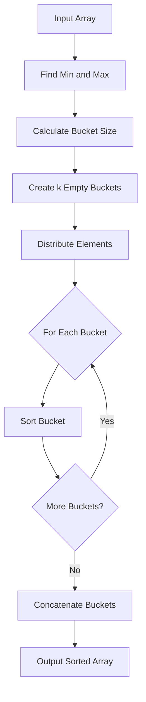

# Bucket Sort

## Overview

| Property | Value |
|----------|-------|
| **Category** | Sorting Algorithm |
| **Type** | Distribution Sort (Non-Comparison-Based) |
| **Data Structure** | Array, Buckets (Lists) |
| **Space Complexity** | O(n + k) |
| **Stable** | Yes (depends on bucket sort method) |
| **In-Place** | No |
| **Adaptive** | Yes |

---

## Mathematical Foundation

### Definition

Bucket Sort is a **distribution sorting algorithm** that works by distributing elements into a number of buckets. Each bucket is then sorted individually, either using a different sorting algorithm or by recursively applying bucket sort.

### Formal Description

Given an array $A = [a_1, a_2, ..., a_n]$ with elements in range $[min, max]$:

**Step 1: Create Buckets**
- Number of buckets: $k$
- Bucket size: $s = \frac{max - min}{k}$

**Step 2: Distribution Function**
For each element $a_i$, the bucket index is:

$$bucket\_index(a_i) = \min\left(\left\lfloor \frac{a_i - min}{s} \right\rfloor, k-1\right)$$

**Step 3: Sort Each Bucket**
Sort each bucket $B_j$ individually using any sorting algorithm.

**Step 4: Concatenation**
The final sorted array is the concatenation of all sorted buckets:

$$sorted(A) = B_0 \oplus B_1 \oplus ... \oplus B_{k-1}$$

### Expected Running Time Analysis

**Average Case Analysis:**

Assuming uniform distribution of $n$ elements into $k$ buckets:
- Expected elements per bucket: $\frac{n}{k}$
- Time to sort each bucket using comparison sort: $O\left(\left(\frac{n}{k}\right)^2\right)$ or $O\left(\frac{n}{k} \log \frac{n}{k}\right)$

Total expected time:

$$T(n) = O(n) + k \cdot O\left(\frac{n}{k} \log \frac{n}{k}\right) = O(n + n \log \frac{n}{k})$$

When $k = \Theta(n)$:

$$T(n) = O(n + n \log 1) = O(n)$$

### Probability Analysis

Let $n_i$ be the number of elements in bucket $i$. For uniformly distributed input:

$$E[n_i] = \frac{n}{k}$$

$$E[n_i^2] = \frac{n}{k} + \frac{n(n-1)}{k^2} = 2 - \frac{1}{n}$$

Using insertion sort on each bucket:

$$E[T(n)] = \Theta(n) + \sum_{i=0}^{k-1} E[O(n_i^2)] = \Theta(n) + n \cdot O(2 - \frac{1}{n}) = \Theta(n)$$

---

## Pseudocode

```
BUCKET-SORT(A, k):
    Input: Array A of n elements, k = number of buckets
    Output: Sorted array
    
    if length(A) == 0 or k <= 0:
        return []
    
    // Step 1: Find range
    min_val ← minimum(A)
    max_val ← maximum(A)
    
    if min_val == max_val:
        return A  // All elements are equal
    
    // Step 2: Calculate bucket size
    bucket_size ← (max_val - min_val) / k
    
    // Step 3: Create empty buckets
    buckets ← array of k empty lists
    
    // Step 4: Distribute elements into buckets
    for each element val in A:
        index ← min(floor((val - min_val) / bucket_size), k - 1)
        append val to buckets[index]
    
    // Step 5: Sort individual buckets and concatenate
    result ← empty list
    for i ← 0 to k - 1:
        sort(buckets[i])  // Using any stable sort
        append buckets[i] to result
    
    return result
```

---

## Complexity Analysis

### Time Complexity

| Case | Complexity | Condition |
|------|------------|-----------|
| **Best** | $O(n + k)$ | Uniform distribution, $k = n$ |
| **Average** | $O(n + \frac{n^2}{k} + k)$ | Random distribution |
| **Worst** | $O(n^2)$ | All elements in one bucket |

**Breakdown:**
- Distribution: $O(n)$
- Sorting buckets: Depends on sub-sort algorithm
- Concatenation: $O(k)$

### Space Complexity

| Component | Space |
|-----------|-------|
| Buckets | $O(n)$ |
| Auxiliary | $O(k)$ |
| **Total** | $O(n + k)$ |

### Comparison with Other Sorts

| Algorithm | Average | Worst | Space | Stable |
|-----------|---------|-------|-------|--------|
| Bucket Sort | $O(n)$* | $O(n^2)$ | $O(n+k)$ | Yes |
| Counting Sort | $O(n+k)$ | $O(n+k)$ | $O(k)$ | Yes |
| Radix Sort | $O(d \cdot n)$ | $O(d \cdot n)$ | $O(n+k)$ | Yes |
| Quick Sort | $O(n \log n)$ | $O(n^2)$ | $O(\log n)$ | No |

*When input is uniformly distributed and $k = \Theta(n)$

---

## Visual Representation

### Algorithm Flow



### Distribution Example

```
Input: [0.42, 0.32, 0.33, 0.52, 0.37, 0.47, 0.51]
Bucket Count: 5

Bucket Ranges (0-1 input):
├── Bucket 0 [0.0-0.2): []
├── Bucket 1 [0.2-0.4): [0.32, 0.33, 0.37]
├── Bucket 2 [0.4-0.6): [0.42, 0.52, 0.47, 0.51]
├── Bucket 3 [0.6-0.8): []
└── Bucket 4 [0.8-1.0): []

After sorting each bucket:
├── Bucket 0: []
├── Bucket 1: [0.32, 0.33, 0.37]
├── Bucket 2: [0.42, 0.47, 0.51, 0.52]
├── Bucket 3: []
└── Bucket 4: []

Concatenated: [0.32, 0.33, 0.37, 0.42, 0.47, 0.51, 0.52]
```

---

## Implementation Details

### Key Optimizations

1. **Bucket Count Selection**: Choose $k \approx n$ for optimal performance
2. **Adaptive Bucket Sizing**: Handle negative numbers by shifting range
3. **Efficient Sub-Sort**: Use insertion sort for small buckets, merge sort for larger

### Edge Cases

| Case | Handling |
|------|----------|
| Empty array | Return empty array |
| Single element | Return as-is |
| All equal elements | Return original array |
| Negative numbers | Shift by minimum value |
| Floating point | Works naturally |

### Python Implementation Key Points

```python
def bucket_sort(my_list: list, bucket_count: int = 10) -> list:
    # Handle edge cases
    if len(my_list) == 0 or bucket_count <= 0:
        return []
    
    min_value, max_value = min(my_list), max(my_list)
    if min_value == max_value:
        return my_list
    
    # Calculate bucket size
    bucket_size = (max_value - min_value) / bucket_count
    
    # Distribute into buckets
    buckets = [[] for _ in range(bucket_count)]
    for val in my_list:
        index = min(int((val - min_value) / bucket_size), bucket_count - 1)
        buckets[index].append(val)
    
    # Sort and concatenate
    return [val for bucket in buckets for val in sorted(bucket)]
```

---

## Real-World Applications

### 1. **Database Query Optimization**

**Use Case**: Sorting query results by uniformly distributed keys (timestamps, sequential IDs).

```python
# Example: Sorting database records by timestamp
def sort_records_by_timestamp(records, num_buckets=100):
    """
    Sort database records efficiently when timestamps
    are uniformly distributed over time.
    """
    if not records:
        return []
    
    timestamps = [r['timestamp'] for r in records]
    min_ts, max_ts = min(timestamps), max(timestamps)
    bucket_size = (max_ts - min_ts) / num_buckets
    
    buckets = [[] for _ in range(num_buckets)]
    for record in records:
        idx = min(int((record['timestamp'] - min_ts) / bucket_size), num_buckets - 1)
        buckets[idx].append(record)
    
    result = []
    for bucket in buckets:
        bucket.sort(key=lambda r: r['timestamp'])
        result.extend(bucket)
    return result
```

### 2. **Geographic Data Processing**

**Use Case**: Sorting locations by latitude/longitude for spatial indexing.

```python
# Sorting points by latitude for spatial queries
def sort_by_latitude(points, num_buckets=180):
    """
    Efficiently sort geographic points by latitude.
    Latitude ranges from -90 to +90 degrees.
    """
    buckets = [[] for _ in range(num_buckets)]
    for point in points:
        # Normalize latitude to bucket index
        idx = int((point.latitude + 90) / 180 * num_buckets)
        idx = min(idx, num_buckets - 1)
        buckets[idx].append(point)
    
    return [p for bucket in buckets for p in sorted(bucket, key=lambda x: x.latitude)]
```

### 3. **Color Histogram Processing**

**Use Case**: Image processing applications sorting pixels by intensity.

```python
# Sorting pixel intensities for histogram equalization
def sort_pixel_intensities(pixels, num_buckets=256):
    """
    Sort pixel intensities for image processing.
    Pixel values typically range from 0-255.
    """
    buckets = [[] for _ in range(num_buckets)]
    for pixel in pixels:
        buckets[pixel.intensity].append(pixel)
    
    return [p for bucket in buckets for p in bucket]
```

### 4. **Financial Data Analysis**

**Use Case**: Sorting transaction amounts that follow uniform distribution.

```python
# Sorting financial transactions by amount
def sort_transactions(transactions, max_amount=10000, num_buckets=100):
    """
    Sort transactions by amount for financial analysis.
    Assumes amounts are uniformly distributed.
    """
    bucket_size = max_amount / num_buckets
    buckets = [[] for _ in range(num_buckets)]
    
    for tx in transactions:
        idx = min(int(tx.amount / bucket_size), num_buckets - 1)
        buckets[idx].append(tx)
    
    result = []
    for bucket in buckets:
        bucket.sort(key=lambda t: t.amount)
        result.extend(bucket)
    return result
```

### 5. **Load Balancing in Distributed Systems**

**Use Case**: Partitioning data across servers based on hash values.

```python
# Distributing requests across servers
def distribute_requests(requests, num_servers):
    """
    Distribute requests across servers using bucket-like partitioning.
    Hash values provide uniform distribution.
    """
    server_queues = [[] for _ in range(num_servers)]
    
    for request in requests:
        hash_val = hash(request.key) % num_servers
        server_queues[hash_val].append(request)
    
    # Each server processes its queue
    return server_queues
```

---

## When to Use Bucket Sort

### ✅ Ideal Scenarios

1. **Uniformly distributed data** - Achieves $O(n)$ time
2. **Floating-point numbers** - Works naturally unlike counting sort
3. **Known range of input** - Enables efficient bucket sizing
4. **External sorting** - Each bucket can be processed independently
5. **Parallel processing** - Buckets can be sorted concurrently

### ❌ Avoid When

1. **Highly skewed data** - Leads to $O(n^2)$ worst case
2. **Memory constraints** - Requires $O(n + k)$ extra space
3. **Unknown data range** - Requires extra pass to find min/max
4. **Small datasets** - Overhead not justified

---

## References

1. Cormen, T.H., et al. *Introduction to Algorithms*, 4th Edition, Chapter 8.4
2. [Wikipedia: Bucket Sort](https://en.wikipedia.org/wiki/Bucket_sort)
3. Knuth, D.E. *The Art of Computer Programming*, Volume 3: Sorting and Searching
4. Sedgewick, R. *Algorithms*, 4th Edition

---

## See Also

- [Counting Sort](counting_sort.md) - For integer data with limited range
- [Radix Sort](radix_sort.md) - For fixed-length integer/string keys
- [Pigeonhole Sort](pigeonhole_sort.md) - Special case with n ≈ range

