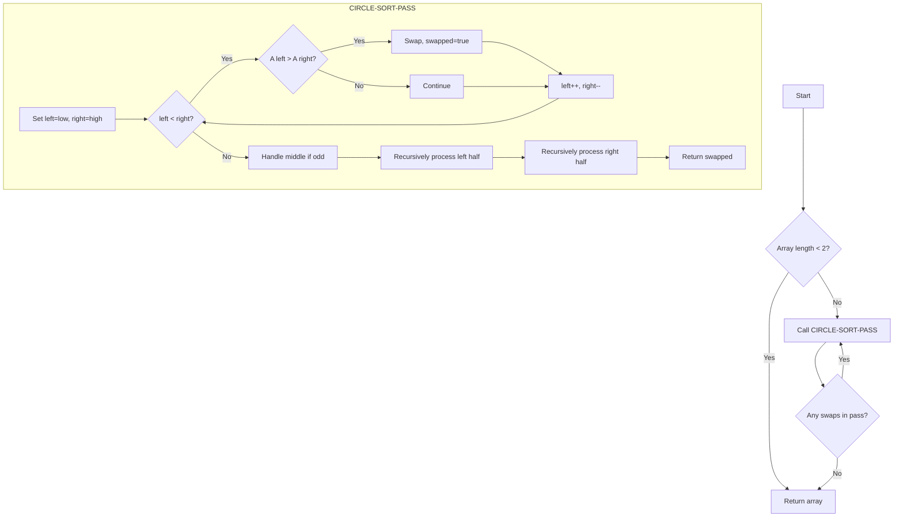

# Circle Sort

## Overview

| Property | Value |
|----------|-------|
| **Category** | Sorting Algorithm |
| **Type** | Comparison-Based (Recursive) |
| **Data Structure** | Array |
| **Space Complexity** | O(log n) (recursion) |
| **Stable** | No |
| **In-Place** | Yes |
| **Parallel-Friendly** | Yes |

---

## Mathematical Foundation

### Definition

**Circle Sort** is a comparison-based sorting algorithm that works by recursively comparing elements at opposite ends of a range and swapping them if they are in the wrong order. The name comes from visualizing the array as a circle where elements at positions $i$ and $n-1-i$ are compared.

### Algorithm Principle

The algorithm works in rounds:

1. **Compare opposites**: For a range $[low, high]$, compare elements at positions moving inward from both ends
2. **Recursive split**: After comparing, split the range into two halves and recursively sort each half
3. **Repeat**: Continue until no swaps occur in a complete pass

### Mathematical Description

For an array $A[0 \ldots n-1]$:

**Circle Comparison Phase:**
$$\text{For } i \in [0, \lfloor n/2 \rfloor):$$
$$\text{If } A[low + i] > A[high - i]: \text{ swap}$$

**Recursive Phase:**
$$\text{CircleSort}(A, low, mid)$$
$$\text{CircleSort}(A, mid+1, high)$$

### Key Insight

Unlike most sorting algorithms that focus on adjacent elements (Bubble) or partitioning (Quick), Circle Sort compares elements that are "far apart" initially, which can move elements to their correct positions more quickly.

### Visual: Circle Metaphor

```
Array: [5, 2, 8, 1, 9, 3]
Indices: 0  1  2  3  4  5

Visualize as circle:
        [5]
    [3]     [2]
        
    [9]     [8]
        [1]

Compare pairs:
  5 ↔ 3 (indices 0, 5)
  2 ↔ 9 (indices 1, 4)
  8 ↔ 1 (indices 2, 3)
```

---

## Pseudocode

```
CIRCLE-SORT(A):
    Input: Array A of n elements
    Output: Sorted array A
    
    if length(A) < 2:
        return A
    
    repeat:
        swapped ← CIRCLE-SORT-PASS(A, 0, length(A) - 1)
    until not swapped
    
    return A


CIRCLE-SORT-PASS(A, low, high):
    Input: Array A, indices low and high
    Output: True if any swap occurred
    
    swapped ← false
    
    if low = high:
        return swapped
    
    left ← low
    right ← high
    
    // Compare elements from opposite ends
    while left < right:
        if A[left] > A[right]:
            swap A[left] and A[right]
            swapped ← true
        left ← left + 1
        right ← right - 1
    
    // Handle middle element (odd length)
    if left = right:
        if A[left] > A[left + 1]:
            swap A[left] and A[left + 1]
            swapped ← true
    
    // Recursively process halves
    mid ← low + (high - low) / 2
    left_swapped ← CIRCLE-SORT-PASS(A, low, mid)
    right_swapped ← CIRCLE-SORT-PASS(A, mid + 1, high)
    
    return swapped or left_swapped or right_swapped
```

---

## Complexity Analysis

### Time Complexity

| Case | Complexity | Notes |
|------|------------|-------|
| **Best** | $O(n \log n)$ | Few passes needed |
| **Average** | $O(n \log n \cdot k)$ | k = number of rounds |
| **Worst** | $O(n \log n \cdot k)$ | More rounds for bad inputs |

**Analysis:**
- Each pass: $O(n \log n)$ — $n$ comparisons across $\log n$ recursive depth
- Number of passes: empirically $O(\log n)$ for random data
- Total: $O(n \log^2 n)$ in practice

### Space Complexity

| Component | Space |
|-----------|-------|
| Recursion Stack | $O(\log n)$ |
| In-place swaps | $O(1)$ |
| **Total** | $O(\log n)$ |

### Comparison with Other Algorithms

| Algorithm | Time (Avg) | Space | Parallel-Friendly |
|-----------|------------|-------|-------------------|
| Circle Sort | O(n log² n) | O(log n) | Yes |
| Merge Sort | O(n log n) | O(n) | Yes |
| Quick Sort | O(n log n) | O(log n) | Partially |
| Bitonic Sort | O(n log² n) | O(1) | Yes |

---

## Visual Representation

### Algorithm Flow



### Step-by-Step Example

```
Input: [5, 3, 8, 1]
n = 4

=== ROUND 1 ===

Pass on [5, 3, 8, 1], range [0, 3]:

Step 1: Compare opposites
  left=0, right=3: 5 vs 1 → swap → [1, 3, 8, 5]
  left=1, right=2: 3 vs 8 → no swap

Step 2: Recursively process halves
  Left half [1, 3], range [0, 1]:
    left=0, right=1: 1 vs 3 → no swap
    (no further recursion, range size 1)
    
  Right half [8, 5], range [2, 3]:
    left=2, right=3: 8 vs 5 → swap → [1, 3, 5, 8]
    (no further recursion)

After Round 1: [1, 3, 5, 8]
Swapped: Yes

=== ROUND 2 ===

Pass on [1, 3, 5, 8], range [0, 3]:

Step 1: Compare opposites
  left=0, right=3: 1 vs 8 → no swap
  left=1, right=2: 3 vs 5 → no swap

Step 2: Recursively process halves
  Left half [1, 3]: no swap
  Right half [5, 8]: no swap

After Round 2: [1, 3, 5, 8]
Swapped: No → DONE!

Final: [1, 3, 5, 8]
```

### Circle Comparison Pattern

```
Array: [7, 2, 9, 4, 6, 1]

Round 1, Level 0 (full array):
  Compare: 7↔1, 2↔6, 9↔4
  
          7 ←────────→ 1   (swap)
            2 ←────→ 6     (swap)
              9 ↔ 4        (swap)
  
  Result: [1, 6, 4, 9, 2, 7]

Round 1, Level 1 (halves):
  Left [1, 6, 4]:
    1↔4, 6↔? (middle)
  Right [9, 2, 7]:
    9↔7, 2↔? (middle)
```

---

## Implementation Details

### Python Implementation

```python
def circle_sort(collection: list) -> list:
    """A pure Python implementation of circle sort algorithm

    :param collection: a mutable collection of comparable items in any order
    :return: the same collection in ascending order

    Examples:
    >>> circle_sort([0, 5, 3, 2, 2])
    [0, 2, 2, 3, 5]
    >>> circle_sort([])
    []
    >>> circle_sort([-2, 5, 0, -45])
    [-45, -2, 0, 5]
    """

    if len(collection) < 2:
        return collection

    def circle_sort_util(collection: list, low: int, high: int) -> bool:
        """
        Perform one pass of circle sort on range [low, high].
        Returns True if any swap occurred.
        """
        swapped = False

        if low == high:
            return swapped

        left = low
        right = high

        # Compare elements from opposite ends
        while left < right:
            if collection[left] > collection[right]:
                collection[left], collection[right] = (
                    collection[right],
                    collection[left],
                )
                swapped = True

            left += 1
            right -= 1

        # Handle middle element for odd-length ranges
        if left == right and collection[left] > collection[right + 1]:
            collection[left], collection[right + 1] = (
                collection[right + 1],
                collection[left],
            )
            swapped = True

        # Recursively process halves
        mid = low + int((high - low) / 2)
        left_swap = circle_sort_util(collection, low, mid)
        right_swap = circle_sort_util(collection, mid + 1, high)

        return swapped or left_swap or right_swap

    # Repeat until no swaps occur
    is_not_sorted = True
    while is_not_sorted is True:
        is_not_sorted = circle_sort_util(collection, 0, len(collection) - 1)

    return collection
```

### Iterative Version

```python
def circle_sort_iterative(arr: list) -> list:
    """
    Iterative version of circle sort using explicit stack.
    
    >>> circle_sort_iterative([5, 2, 8, 1, 9])
    [1, 2, 5, 8, 9]
    >>> circle_sort_iterative([])
    []
    """
    if len(arr) < 2:
        return arr
    
    while True:
        swapped = False
        stack = [(0, len(arr) - 1)]
        
        while stack:
            low, high = stack.pop()
            
            if low >= high:
                continue
            
            # Compare opposites
            left, right = low, high
            while left < right:
                if arr[left] > arr[right]:
                    arr[left], arr[right] = arr[right], arr[left]
                    swapped = True
                left += 1
                right -= 1
            
            # Middle element check
            if left == right and left + 1 <= high:
                if arr[left] > arr[left + 1]:
                    arr[left], arr[left + 1] = arr[left + 1], arr[left]
                    swapped = True
            
            # Add halves to stack
            mid = low + (high - low) // 2
            stack.append((low, mid))
            stack.append((mid + 1, high))
        
        if not swapped:
            break
    
    return arr
```

### Parallel-Friendly Version

```python
from concurrent.futures import ThreadPoolExecutor, as_completed


def circle_sort_parallel(arr: list, max_workers: int = 4) -> list:
    """
    Circle sort with parallel processing for large arrays.
    
    >>> circle_sort_parallel([5, 2, 8, 1, 9, 3, 7, 4])
    [1, 2, 3, 4, 5, 7, 8, 9]
    """
    if len(arr) < 100:  # Fall back to sequential for small arrays
        return circle_sort(arr)
    
    def compare_and_swap(start: int, end: int) -> bool:
        swapped = False
        left, right = start, end
        while left < right:
            if arr[left] > arr[right]:
                arr[left], arr[right] = arr[right], arr[left]
                swapped = True
            left += 1
            right -= 1
        return swapped
    
    while True:
        swapped = False
        
        # Parallel comparison at top level
        n = len(arr)
        chunk_size = n // max_workers
        
        with ThreadPoolExecutor(max_workers=max_workers) as executor:
            futures = []
            for i in range(max_workers):
                start = i * chunk_size
                end = (i + 1) * chunk_size - 1 if i < max_workers - 1 else n - 1
                futures.append(executor.submit(compare_and_swap, start, end))
            
            for future in as_completed(futures):
                if future.result():
                    swapped = True
        
        # Sequential recursion (can be parallelized further)
        def recurse(low: int, high: int) -> bool:
            if low >= high:
                return False
            s = False
            l, r = low, high
            while l < r:
                if arr[l] > arr[r]:
                    arr[l], arr[r] = arr[r], arr[l]
                    s = True
                l += 1
                r -= 1
            mid = low + (high - low) // 2
            return s or recurse(low, mid) or recurse(mid + 1, high)
        
        if recurse(0, n - 1):
            swapped = True
        
        if not swapped:
            break
    
    return arr
```

---

## Real-World Applications

### 1. **Parallel Sorting on GPUs**

**Use Case**: Circle sort's structure makes it amenable to parallel implementation.

```python
def gpu_circle_sort_simulation(arr: list, block_size: int = 64) -> list:
    """
    Simulate GPU-style parallel circle sort.
    In real implementation, this would use CUDA/OpenCL.
    
    >>> gpu_circle_sort_simulation([8, 3, 7, 1, 5, 2, 6, 4])
    [1, 2, 3, 4, 5, 6, 7, 8]
    """
    n = len(arr)
    if n < 2:
        return arr
    
    # Simulate parallel blocks
    while True:
        swapped = False
        
        # Each "block" handles a range of comparisons
        for block in range(0, n // 2, block_size):
            for i in range(block, min(block + block_size, n // 2)):
                j = n - 1 - i
                if arr[i] > arr[j]:
                    arr[i], arr[j] = arr[j], arr[i]
                    swapped = True
        
        # Recursive passes
        def recursive_pass(lo: int, hi: int) -> bool:
            if lo >= hi:
                return False
            s = False
            l, r = lo, hi
            while l < r:
                if arr[l] > arr[r]:
                    arr[l], arr[r] = arr[r], arr[l]
                    s = True
                l += 1
                r -= 1
            mid = lo + (hi - lo) // 2
            return s or recursive_pass(lo, mid) or recursive_pass(mid + 1, hi)
        
        if recursive_pass(0, n - 1):
            swapped = True
        
        if not swapped:
            break
    
    return arr
```

### 2. **Network Sorting**

**Use Case**: Sorting data across distributed nodes.

```python
class DistributedCircleSort:
    """
    Circle sort adapted for distributed systems.
    Nodes compare and exchange data with their "opposite" nodes.
    """
    
    def __init__(self, node_id: int, total_nodes: int):
        self.node_id = node_id
        self.total_nodes = total_nodes
        self.data = None
    
    def set_data(self, value):
        """Set this node's data."""
        self.data = value
    
    def get_partner_id(self, level: int) -> int:
        """
        Get the partner node ID for comparison at given level.
        
        >>> ds = DistributedCircleSort(0, 8)
        >>> ds.get_partner_id(0)
        7
        >>> ds.get_partner_id(1)
        3
        """
        mask = self.total_nodes >> (level + 1)
        if mask == 0:
            return self.node_id
        return self.node_id ^ ((self.total_nodes - 1) >> level)
    
    def should_keep_min(self, level: int) -> bool:
        """
        Determine if this node should keep the minimum value.
        
        >>> ds = DistributedCircleSort(0, 8)
        >>> ds.should_keep_min(0)
        True
        """
        return self.node_id < self.get_partner_id(level)
```

### 3. **Hardware Sorting Networks**

**Use Case**: Implementing sorting in hardware (FPGAs).

```python
def generate_circle_sort_network(n: int) -> list[tuple[int, int]]:
    """
    Generate comparator network for circle sort.
    Each tuple (i, j) means: compare and swap if arr[i] > arr[j].
    
    >>> network = generate_circle_sort_network(4)
    >>> len(network) > 0
    True
    """
    comparators = []
    
    def add_comparators(low: int, high: int):
        if low >= high:
            return
        
        left, right = low, high
        while left < right:
            comparators.append((left, right))
            left += 1
            right -= 1
        
        mid = low + (high - low) // 2
        add_comparators(low, mid)
        add_comparators(mid + 1, high)
    
    add_comparators(0, n - 1)
    return comparators
```

### 4. **Memory-Efficient Large File Sorting**

**Use Case**: External sorting with pattern-based comparisons.

```python
def external_circle_sort(filename: str, key_func=lambda x: x) -> str:
    """
    Apply circle sort pattern to external file sorting.
    Minimizes random access by comparing distant elements.
    
    Returns path to sorted file.
    """
    import mmap
    import os
    
    # Read file into memory-mapped structure
    # This is a simplified simulation
    with open(filename, 'r') as f:
        lines = f.readlines()
    
    # Apply circle sort
    arr = [(key_func(line), line) for line in lines]
    
    while True:
        swapped = False
        
        def pass_range(low: int, high: int) -> bool:
            nonlocal swapped
            s = False
            l, r = low, high
            while l < r:
                if arr[l][0] > arr[r][0]:
                    arr[l], arr[r] = arr[r], arr[l]
                    s = True
                l += 1
                r -= 1
            if l == r and l + 1 <= high:
                if arr[l][0] > arr[l + 1][0]:
                    arr[l], arr[l + 1] = arr[l + 1], arr[l]
                    s = True
            mid = low + (high - low) // 2
            if low < mid:
                s = pass_range(low, mid) or s
            if mid + 1 < high:
                s = pass_range(mid + 1, high) or s
            return s
        
        swapped = pass_range(0, len(arr) - 1)
        if not swapped:
            break
    
    # Write sorted output
    output = filename + '.sorted'
    with open(output, 'w') as f:
        for _, line in arr:
            f.write(line)
    
    return output
```

---

## Advantages and Disadvantages

### ✅ Advantages

1. **Parallel-friendly** - comparisons can be done in parallel
2. **In-place** - O(1) extra space (excluding recursion)
3. **Simple concept** - compare opposites, recurse
4. **Good cache behavior** - accesses both ends of array

### ❌ Disadvantages

1. **Multiple passes** - may need many rounds
2. **Not stable** - doesn't preserve relative order
3. **Not adaptive** - doesn't benefit from partial sorting
4. **Unpredictable rounds** - hard to estimate passes needed

---

## Comparison with Similar Algorithms

| Algorithm | Parallel | In-Place | Passes | Best For |
|-----------|----------|----------|--------|----------|
| Circle Sort | Yes | Yes | O(log n) | Parallel systems |
| Bitonic Sort | Yes | Yes | O(log² n) | Fixed networks |
| Odd-Even Sort | Yes | Yes | O(n) | Simple parallel |
| Quick Sort | Partial | Yes | O(1) | General purpose |

---

## References

1. [Wikipedia: Circle Sort](https://en.wikipedia.org/wiki/Circle_sort)
2. [Sorting Networks](https://en.wikipedia.org/wiki/Sorting_network)
3. [Parallel Sorting Algorithms](https://en.wikipedia.org/wiki/Sorting_algorithm#Parallel_algorithms)

---

## See Also

- [Bitonic Sort](bitonic_sort.md) - Another parallel-friendly sort
- [Odd-Even Sort](odd_even_sort.md) - Simple parallel sort
- [Merge Sort](merge_sort.md) - Classic divide and conquer

