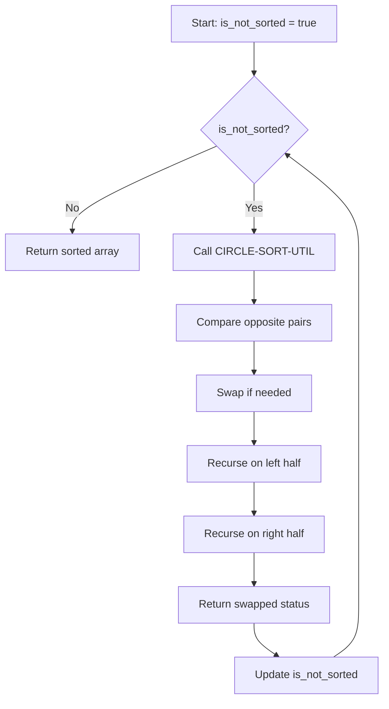

# Circle Sort

## Overview

| Property | Value |
|----------|-------|
| **Category** | Sorting Algorithm |
| **Type** | Comparison-Based (Divide and Conquer) |
| **Data Structure** | Array |
| **Space Complexity** | O(log n) recursion |
| **Stable** | No |
| **In-Place** | Yes |
| **Adaptive** | Partially |

---

## Mathematical Foundation

### Definition

**Circle Sort** is a comparison-based sorting algorithm that recursively compares elements at opposite ends of a range, swapping them if out of order, then divides the range in half and recurses. The process repeats until no swaps occur.

### Algorithm Principle

The algorithm works by visualizing elements arranged in a circle:

1. Compare first element with last, second with second-to-last, etc.
2. Swap if left element > right element
3. Recursively apply to left half and right half
4. Repeat entire process until no swaps occur

### Mathematical Description

For an array $A[low..high]$:

**Comparison Pattern:**
$$\text{Compare: } A[low + i] \text{ with } A[high - i] \text{ for } i = 0, 1, ..., \lfloor(high-low)/2\rfloor$$

**Recursive Division:**
$$\text{mid} = low + \lfloor(high - low) / 2\rfloor$$
$$\text{Recurse on: } A[low..mid] \text{ and } A[mid+1..high]$$

### Why "Circle"?

If elements are arranged in a circle:
```
    A[0]
   /    \
A[n-1]  A[1]
  |      |
A[n-2]  A[2]
   \    /
    ...
```

The algorithm compares diametrically opposite elements.

### Convergence

The algorithm guarantees termination because:
- Each pass reduces inversions
- Eventually, no inversions remain
- Maximum passes: $O(\log n \cdot \log n)$ for most inputs

---

## Pseudocode

```
CIRCLE-SORT(A):
    Input: Array A of n elements
    Output: Sorted array A
    
    if length(A) < 2:
        return A
    
    is_not_sorted ← true
    
    while is_not_sorted:
        is_not_sorted ← CIRCLE-SORT-UTIL(A, 0, n-1)
    
    return A


CIRCLE-SORT-UTIL(A, low, high):
    // Returns true if any swap occurred
    
    if low = high:
        return false
    
    swapped ← false
    left ← low
    right ← high
    
    // Compare opposite elements
    while left < right:
        if A[left] > A[right]:
            swap A[left] and A[right]
            swapped ← true
        left ← left + 1
        right ← right - 1
    
    // Handle middle element (odd length)
    if left = right:
        if A[left] > A[right + 1]:
            swap A[left] and A[right + 1]
            swapped ← true
    
    // Recurse on halves
    mid ← low + (high - low) / 2
    left_swap ← CIRCLE-SORT-UTIL(A, low, mid)
    right_swap ← CIRCLE-SORT-UTIL(A, mid + 1, high)
    
    return swapped OR left_swap OR right_swap
```

---

## Complexity Analysis

### Time Complexity

| Case | Complexity | Notes |
|------|------------|-------|
| **Best** | $O(n \log n)$ | Few passes needed |
| **Average** | $O(n \log n \cdot \log n)$ | Multiple passes |
| **Worst** | $O(n \log n \cdot \log n)$ | Many passes required |

**Analysis:**
- Each pass: $O(n \log n)$ comparisons (divide and conquer)
- Number of passes: $O(\log n)$ average, $O(n)$ worst
- Total: $O(n \log^2 n)$ average

### Space Complexity

| Component | Space |
|-----------|-------|
| Recursion depth | $O(\log n)$ |
| Swaps (in-place) | $O(1)$ |
| **Total** | $O(\log n)$ |

---

## Visual Representation

### Circle Visualization

```
Array: [5, 3, 8, 1, 4]

Arranged in circle:
        5
      /   \
     4     3
     |     |
     1-----8

Compare opposites:
  5 ↔ 4: 5 > 4? Yes, swap → [4, 3, 8, 1, 5]
  3 ↔ 1: 3 > 1? Yes, swap → [4, 1, 8, 3, 5]
  8: middle element, compare with next
```

### Algorithm Flow



### Step-by-Step Example

```
Input: [5, 3, 8, 1, 4]

Pass 1:
  Compare 5↔4: swap → [4, 3, 8, 1, 5]
  Compare 3↔1: swap → [4, 1, 8, 3, 5]
  Middle 8↔3: swap → [4, 1, 3, 8, 5]
  
  Left half [4, 1]:
    Compare 4↔1: swap → [1, 4, 3, 8, 5]
  
  Right half [3, 8, 5]:
    Compare 3↔5: no swap
    Compare 8↔?: middle, compare 8↔5: swap → [1, 4, 3, 5, 8]
    
Pass 2:
  Compare 1↔8: no swap
  Compare 4↔5: no swap
  Middle 3: 3<5: no swap
  
  Left half [1, 4]:
    Compare 1↔4: no swap
  
  Right half [3, 5, 8]:
    Compare 3↔8: no swap
    5: middle, 5<8: no swap
    
  Recurse more... (continues until no swaps)

Final: [1, 3, 4, 5, 8]
```

---

## Implementation Details

### Python Implementation

```python
def circle_sort(collection: list) -> list:
    """
    A pure Python implementation of circle sort algorithm
    
    :param collection: a mutable collection of comparable items
    :return: the same collection in ascending order

    >>> circle_sort([0, 5, 3, 2, 2])
    [0, 2, 2, 3, 5]
    >>> circle_sort([])
    []
    >>> circle_sort([-2, 5, 0, -45])
    [-45, -2, 0, 5]
    """
    if len(collection) < 2:
        return collection

    def circle_sort_util(collection: list, low: int, high: int) -> bool:
        """Helper that returns True if any swap occurred."""
        swapped = False

        if low == high:
            return swapped

        left = low
        right = high

        while left < right:
            if collection[left] > collection[right]:
                collection[left], collection[right] = (
                    collection[right],
                    collection[left],
                )
                swapped = True

            left += 1
            right -= 1

        # Handle middle element for odd length
        if left == right and collection[left] > collection[right + 1]:
            collection[left], collection[right + 1] = (
                collection[right + 1],
                collection[left],
            )
            swapped = True

        mid = low + int((high - low) / 2)
        left_swap = circle_sort_util(collection, low, mid)
        right_swap = circle_sort_util(collection, mid + 1, high)

        return swapped or left_swap or right_swap

    is_not_sorted = True

    while is_not_sorted is True:
        is_not_sorted = circle_sort_util(collection, 0, len(collection) - 1)

    return collection
```

### Iterative Version

```python
def circle_sort_iterative(arr: list) -> list:
    """
    Iterative circle sort using explicit stack.
    
    >>> circle_sort_iterative([5, 3, 8, 1, 4])
    [1, 3, 4, 5, 8]
    """
    if len(arr) < 2:
        return arr
    
    while True:
        swapped = False
        stack = [(0, len(arr) - 1)]
        
        while stack:
            low, high = stack.pop()
            
            if low >= high:
                continue
            
            left, right = low, high
            
            while left < right:
                if arr[left] > arr[right]:
                    arr[left], arr[right] = arr[right], arr[left]
                    swapped = True
                left += 1
                right -= 1
            
            if left == right and left + 1 <= high:
                if arr[left] > arr[left + 1]:
                    arr[left], arr[left + 1] = arr[left + 1], arr[left]
                    swapped = True
            
            mid = low + (high - low) // 2
            stack.append((low, mid))
            stack.append((mid + 1, high))
        
        if not swapped:
            break
    
    return arr
```

---

## Real-World Applications

### 1. **Network Sorting (Sorting Networks)**

**Use Case**: Hardware-friendly sorting with predictable comparison pattern.

```python
def generate_circle_sort_network(n: int) -> list[tuple[int, int]]:
    """
    Generate comparison pairs for a circle sort network.
    
    >>> pairs = generate_circle_sort_network(4)
    >>> len(pairs) > 0
    True
    """
    comparisons = []
    
    def add_comparisons(low: int, high: int):
        if low >= high:
            return
        
        left, right = low, high
        while left < right:
            comparisons.append((left, right))
            left += 1
            right -= 1
        
        mid = low + (high - low) // 2
        add_comparisons(low, mid)
        add_comparisons(mid + 1, high)
    
    add_comparisons(0, n - 1)
    return comparisons
```

### 2. **Parallel Sorting Preparation**

**Use Case**: The comparison pattern is amenable to parallelization.

```python
def circle_sort_parallel_groups(n: int) -> list[list[tuple]]:
    """
    Group comparisons that can be done in parallel.
    
    >>> groups = circle_sort_parallel_groups(8)
    >>> len(groups) > 0
    True
    """
    # Comparisons at same "level" can be parallelized
    all_comps = []
    
    def collect(low, high, level):
        if low >= high:
            return
        
        while len(all_comps) <= level:
            all_comps.append([])
        
        left, right = low, high
        while left < right:
            all_comps[level].append((left, right))
            left += 1
            right -= 1
        
        mid = low + (high - low) // 2
        collect(low, mid, level + 1)
        collect(mid + 1, high, level + 1)
    
    collect(0, n - 1, 0)
    return all_comps
```

### 3. **Educational Visualization**

**Use Case**: Teaching divide-and-conquer with visual circle concept.

```python
def visualize_circle_sort(arr: list, step_by_step: bool = True):
    """
    Visualize circle sort with step tracking.
    
    >>> visualize_circle_sort([4, 2, 3, 1], step_by_step=False)
    [1, 2, 3, 4]
    """
    result = arr.copy()
    steps = []
    
    def util(low, high, depth):
        if low >= high:
            return False
        
        swapped = False
        left, right = low, high
        
        while left < right:
            if result[left] > result[right]:
                result[left], result[right] = result[right], result[left]
                if step_by_step:
                    steps.append({
                        'swap': (left, right),
                        'array': result.copy(),
                        'depth': depth
                    })
                swapped = True
            left += 1
            right -= 1
        
        mid = low + (high - low) // 2
        left_swap = util(low, mid, depth + 1)
        right_swap = util(mid + 1, high, depth + 1)
        
        return swapped or left_swap or right_swap
    
    while util(0, len(result) - 1, 0):
        pass
    
    if step_by_step:
        for step in steps:
            print(f"Swap {step['swap']}: {step['array']}")
    
    return result
```

---

## Advantages and Disadvantages

### ✅ Advantages

1. **In-place sorting** - O(1) extra space
2. **Simple pattern** - easy to understand
3. **Parallelizable** - non-overlapping comparisons
4. **Good for nearly sorted** - few passes needed

### ❌ Disadvantages

1. **Not stable** - relative order not preserved
2. **Variable passes** - number of passes not predictable
3. **Slower than optimal** - $O(n \log^2 n)$ vs $O(n \log n)$
4. **Recursive overhead**

---

## References

1. [Wikipedia: Circle Sort](https://sourceforge.net/p/cppcms/wiki/circle_sort/)
2. [Sorting Networks](https://en.wikipedia.org/wiki/Sorting_network)
3. Knuth, D. "The Art of Computer Programming, Vol. 3"

---

## See Also

- [Quick Sort](quick_sort.md) - Another divide-and-conquer sort
- [Merge Sort](merge_sort.md) - Guaranteed O(n log n)
- [Bitonic Sort](bitonic_sort.md) - Another network-friendly sort

