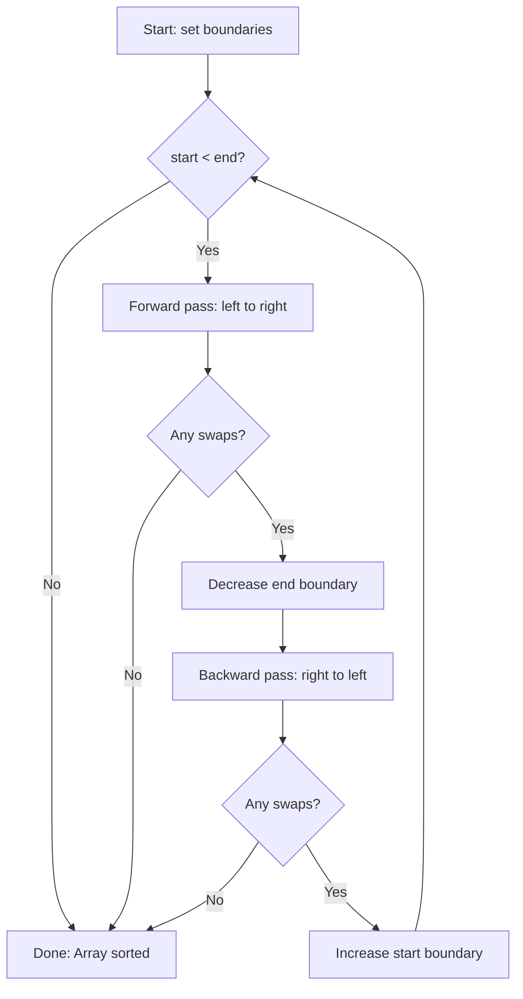

# Cocktail Shaker Sort

## Overview

| Property | Value |
|----------|-------|
| **Category** | Sorting Algorithm |
| **Type** | Comparison-Based (Exchange Sort) |
| **Data Structure** | Array |
| **Space Complexity** | O(1) |
| **Stable** | Yes |
| **In-Place** | Yes |
| **Adaptive** | Yes |

---

## Mathematical Foundation

### Definition

Cocktail Shaker Sort (also known as **Bidirectional Bubble Sort**, **Shaker Sort**, or **Ripple Sort**) is a variation of Bubble Sort that sorts in both directions on each pass through the list.

### Algorithm Principle

Unlike Bubble Sort which always traverses left-to-right, Cocktail Shaker Sort alternates directions:
- **Forward pass**: Large elements "bubble up" to the right
- **Backward pass**: Small elements "bubble down" to the left

### Formal Description

Given an array $A = [a_0, a_1, ..., a_{n-1}]$:

**Forward Pass** (left to right):
$$\text{For } i = start \text{ to } end-1: \text{ if } a_i > a_{i+1} \text{ then swap}(a_i, a_{i+1})$$

**Backward Pass** (right to left):
$$\text{For } i = end \text{ downto } start+1: \text{ if } a_i < a_{i-1} \text{ then swap}(a_i, a_{i-1})$$

### Boundary Updates

After each complete cycle:
- $end \leftarrow end - 1$ (largest unsorted element is in place)
- $start \leftarrow start + 1$ (smallest unsorted element is in place)

### Inversion Analysis

An **inversion** is a pair $(i, j)$ where $i < j$ but $a_i > a_j$.

**Key Property**: Each swap removes exactly one inversion.

For Cocktail Shaker Sort:
- Forward pass moves largest element to its position, removing $O(n)$ inversions
- Backward pass moves smallest element to its position, removing $O(n)$ inversions

**Total inversions** in worst case: $\frac{n(n-1)}{2}$

### Comparison with Bubble Sort

**Problem with Bubble Sort (Turtle Problem)**:
Small elements at the end ("turtles") move slowly because Bubble Sort only moves elements one position per pass.

**Solution in Cocktail Shaker Sort**:
Backward passes efficiently move small elements toward the beginning.

$$\text{Turtles move } n \text{ positions per cycle instead of } 1$$

---

## Pseudocode

```
COCKTAIL-SHAKER-SORT(A):
    Input: Array A of n elements
    Output: Sorted array A (in-place)
    
    start ← 0
    end ← n - 1
    
    while start < end:
        swapped ← false
        
        // Forward pass (left to right)
        for i ← start to end - 1:
            if A[i] > A[i + 1]:
                swap(A[i], A[i + 1])
                swapped ← true
        
        // Early termination if no swaps
        if not swapped:
            break
        
        end ← end - 1  // Largest element is in place
        
        // Backward pass (right to left)
        for i ← end downto start + 1:
            if A[i] < A[i - 1]:
                swap(A[i], A[i - 1])
                swapped ← true
        
        // Early termination if no swaps
        if not swapped:
            break
        
        start ← start + 1  // Smallest element is in place
    
    return A
```

---

## Complexity Analysis

### Time Complexity

| Case | Complexity | Condition |
|------|------------|-----------|
| **Best** | $O(n)$ | Already sorted |
| **Average** | $O(n^2)$ | Random arrangement |
| **Worst** | $O(n^2)$ | Reverse sorted |

### Detailed Analysis

**Best Case $O(n)$:**
- Array is already sorted
- Single forward pass with no swaps
- Early termination activates

**Average Case $O(n^2)$:**
- Expected comparisons: $\frac{n^2}{4}$
- Expected swaps: $\frac{n^2}{8}$

**Worst Case $O(n^2)$:**
- Maximum inversions: $\frac{n(n-1)}{2}$
- Approximately $\frac{n}{2}$ complete cycles needed

### Space Complexity

| Type | Complexity |
|------|------------|
| Auxiliary | $O(1)$ |
| Total | $O(n)$ (input only) |

### Comparison: Cocktail Shaker vs Bubble Sort

| Metric | Bubble Sort | Cocktail Shaker |
|--------|-------------|-----------------|
| Passes for turtles | $n$ per turtle | 1 per turtle |
| Best case | $O(n)$ | $O(n)$ |
| Average case | $O(n^2)$ | $O(n^2)$ (but faster) |
| Constant factor | Higher | Lower |

---

## Visual Representation

### Algorithm Flow



### Visual Example

```
Initial: [5, 1, 4, 2, 8, 0, 2]
         start↑           ↑end

Pass 1 Forward (→):
[5, 1, 4, 2, 8, 0, 2]
 ↓
[1, 5, 4, 2, 8, 0, 2]  (5,1 swap)
    ↓
[1, 4, 5, 2, 8, 0, 2]  (5,4 swap)
       ↓
[1, 4, 2, 5, 8, 0, 2]  (5,2 swap)
             ↓
[1, 4, 2, 5, 0, 8, 2]  (8,0 swap)
                ↓
[1, 4, 2, 5, 0, 2, 8]  (8,2 swap) ← 8 is now in place

Pass 1 Backward (←):
[1, 4, 2, 5, 0, 2, 8]
                ↑
[1, 4, 2, 5, 0, 2, 8]  (2,8 ok)
             ↑
[1, 4, 2, 0, 5, 2, 8]  (5,0 swap)
          ↑
[1, 4, 0, 2, 5, 2, 8]  (2,0 swap)
       ↑
[1, 0, 4, 2, 5, 2, 8]  (4,0 swap)
    ↑
[0, 1, 4, 2, 5, 2, 8]  (1,0 swap) ← 0 is now in place

After 1 complete cycle: [0, 1, 4, 2, 5, 2, 8]
                         ↑start          ↑end

Continue until sorted: [0, 1, 2, 2, 4, 5, 8]
```

### Turtle vs Rabbit Problem

```
Bubble Sort "Turtle" Problem:
[2, 3, 4, 5, 1]  ← 1 is a "turtle" (small element at end)

Pass 1: [2, 3, 4, 1, 5]  ← 1 moves left by 1
Pass 2: [2, 3, 1, 4, 5]  ← 1 moves left by 1
Pass 3: [2, 1, 3, 4, 5]  ← 1 moves left by 1
Pass 4: [1, 2, 3, 4, 5]  ← 1 finally in place

Cocktail Shaker:
[2, 3, 4, 5, 1]
Pass 1→: [2, 3, 4, 1, 5]
Pass 1←: [1, 2, 3, 4, 5]  ← Done in one backward pass!
```

---

## Implementation Details

### Key Optimizations

1. **Early termination**: Stop if no swaps in a pass
2. **Boundary tracking**: Reduce range after each half-pass
3. **Last swap position**: Only scan up to last swap point

### Enhanced Implementation

```python
def cocktail_shaker_sort_optimized(arr: list) -> list:
    """
    Optimized Cocktail Shaker Sort with last swap tracking.
    """
    start, end = 0, len(arr) - 1
    
    while start < end:
        # Track last swap position
        new_end = start
        new_start = end
        
        # Forward pass
        for i in range(start, end):
            if arr[i] > arr[i + 1]:
                arr[i], arr[i + 1] = arr[i + 1], arr[i]
                new_end = i  # Update last swap position
        
        end = new_end
        
        if start >= end:
            break
        
        # Backward pass
        for i in range(end, start, -1):
            if arr[i] < arr[i - 1]:
                arr[i], arr[i - 1] = arr[i - 1], arr[i]
                new_start = i  # Update last swap position
        
        start = new_start
    
    return arr
```

### Edge Cases

| Case | Handling |
|------|----------|
| Empty array | Return empty |
| Single element | Return as-is |
| Two elements | At most one swap |
| Already sorted | One pass, early exit |
| Reverse sorted | $\frac{n}{2}$ cycles |
| All equal | One pass, no swaps |

---

## Real-World Applications

### 1. **Small Dataset Sorting in Embedded Systems**

**Use Case**: Sorting small arrays in resource-constrained environments.

```python
# Embedded sensor data sorting
class SensorDataProcessor:
    """
    Process small batches of sensor readings.
    Cocktail Shaker is simple and efficient for small n.
    """
    
    def __init__(self, buffer_size=10):
        self.buffer_size = buffer_size
        self.readings = []
    
    def add_reading(self, value):
        self.readings.append(value)
        if len(self.readings) >= self.buffer_size:
            self.process_batch()
    
    def process_batch(self):
        """Sort small batch using Cocktail Shaker."""
        # For small arrays, simple sorts are competitive
        self._cocktail_sort(self.readings)
        median = self.readings[len(self.readings) // 2]
        self.readings = []
        return median
    
    def _cocktail_sort(self, arr):
        start, end = 0, len(arr) - 1
        while start < end:
            swapped = False
            for i in range(start, end):
                if arr[i] > arr[i + 1]:
                    arr[i], arr[i + 1] = arr[i + 1], arr[i]
                    swapped = True
            if not swapped:
                break
            end -= 1
            for i in range(end, start, -1):
                if arr[i] < arr[i - 1]:
                    arr[i], arr[i - 1] = arr[i - 1], arr[i]
            start += 1
```

### 2. **Animation and Visualization**

**Use Case**: Educational tools showing sorting algorithms with visual feedback.

```python
# Sorting visualization
class SortVisualizer:
    """
    Cocktail Shaker is excellent for visualization because:
    - Bidirectional movement is visually interesting
    - Simple to understand
    - Shows clear progress from both ends
    """
    
    def __init__(self, canvas, data):
        self.canvas = canvas
        self.data = data.copy()
    
    def visualize_sort(self, delay_ms=100):
        """Animate Cocktail Shaker sort step by step."""
        start, end = 0, len(self.data) - 1
        
        while start < end:
            # Forward pass with animation
            for i in range(start, end):
                self.highlight(i, i + 1, 'comparing')
                if self.data[i] > self.data[i + 1]:
                    self.data[i], self.data[i + 1] = self.data[i + 1], self.data[i]
                    self.highlight(i, i + 1, 'swapped')
                self.wait(delay_ms)
            
            self.mark_sorted(end)
            end -= 1
            
            # Backward pass with animation
            for i in range(end, start, -1):
                self.highlight(i, i - 1, 'comparing')
                if self.data[i] < self.data[i - 1]:
                    self.data[i], self.data[i - 1] = self.data[i - 1], self.data[i]
                    self.highlight(i, i - 1, 'swapped')
                self.wait(delay_ms)
            
            self.mark_sorted(start)
            start += 1
```

### 3. **Nearly Sorted Data Processing**

**Use Case**: Re-sorting data after minor updates.

```python
# Incremental data sorting
class IncrementalSorter:
    """
    When data is already mostly sorted with few out-of-place elements,
    Cocktail Shaker efficiently fixes the order.
    """
    
    def __init__(self, sorted_data):
        self.data = sorted_data
    
    def insert_and_resort(self, new_element):
        """
        Add element and re-sort.
        Efficient when list is nearly sorted.
        """
        self.data.append(new_element)
        
        # Cocktail Shaker quickly fixes nearly-sorted arrays
        n = len(self.data)
        start, end = 0, n - 1
        
        while start < end:
            swapped = False
            
            for i in range(start, end):
                if self.data[i] > self.data[i + 1]:
                    self.data[i], self.data[i + 1] = self.data[i + 1], self.data[i]
                    swapped = True
            
            if not swapped:
                break
            
            end -= 1
            
            for i in range(end, start, -1):
                if self.data[i] < self.data[i - 1]:
                    self.data[i], self.data[i - 1] = self.data[i - 1], self.data[i]
                    swapped = True
            
            if not swapped:
                break
            
            start += 1
        
        return self.data
```

### 4. **Card Game Sorting**

**Use Case**: Sorting a hand of cards (small n, human-relatable).

```python
# Card game hand sorting
class CardHand:
    """
    Sort a hand of cards - small n makes simple sorts practical.
    Cocktail Shaker mimics how humans might sort cards.
    """
    
    RANK_ORDER = {'2': 2, '3': 3, '4': 4, '5': 5, '6': 6, '7': 7, 
                  '8': 8, '9': 9, '10': 10, 'J': 11, 'Q': 12, 'K': 13, 'A': 14}
    SUIT_ORDER = {'♣': 1, '♦': 2, '♥': 3, '♠': 4}
    
    def __init__(self, cards):
        self.cards = cards  # List of (rank, suit) tuples
    
    def sort_hand(self):
        """Sort cards by suit then rank."""
        start, end = 0, len(self.cards) - 1
        
        while start < end:
            swapped = False
            
            for i in range(start, end):
                if self._compare(self.cards[i], self.cards[i + 1]) > 0:
                    self.cards[i], self.cards[i + 1] = self.cards[i + 1], self.cards[i]
                    swapped = True
            
            if not swapped:
                break
            end -= 1
            
            for i in range(end, start, -1):
                if self._compare(self.cards[i], self.cards[i - 1]) < 0:
                    self.cards[i], self.cards[i - 1] = self.cards[i - 1], self.cards[i]
                    swapped = True
            
            if not swapped:
                break
            start += 1
        
        return self.cards
    
    def _compare(self, card1, card2):
        """Compare two cards: suit first, then rank."""
        suit_diff = self.SUIT_ORDER[card1[1]] - self.SUIT_ORDER[card2[1]]
        if suit_diff != 0:
            return suit_diff
        return self.RANK_ORDER[card1[0]] - self.RANK_ORDER[card2[0]]
```

---

## When to Use Cocktail Shaker Sort

### ✅ Ideal Scenarios

1. **Small arrays** ($n < 50$) - Simple implementation, low overhead
2. **Nearly sorted data** - Best case $O(n)$
3. **Educational purposes** - Easy to understand and visualize
4. **Memory-constrained** - Only $O(1)$ extra space
5. **Stability required** - Preserves order of equal elements

### ❌ Avoid When

1. **Large datasets** - $O(n^2)$ is prohibitive
2. **Performance-critical applications** - Use Quick/Merge/Tim Sort
3. **Random data** - No advantage over other quadratic sorts

---

## Comparison with Related Algorithms

| Algorithm | Best | Average | Worst | Space | Stable | Notes |
|-----------|------|---------|-------|-------|--------|-------|
| Cocktail Shaker | $O(n)$ | $O(n^2)$ | $O(n^2)$ | $O(1)$ | Yes | Bidirectional |
| Bubble Sort | $O(n)$ | $O(n^2)$ | $O(n^2)$ | $O(1)$ | Yes | Turtle problem |
| Insertion Sort | $O(n)$ | $O(n^2)$ | $O(n^2)$ | $O(1)$ | Yes | Better for nearly sorted |
| Gnome Sort | $O(n)$ | $O(n^2)$ | $O(n^2)$ | $O(1)$ | Yes | Simpler but slower |

---

## References

1. [Wikipedia: Cocktail Shaker Sort](https://en.wikipedia.org/wiki/Cocktail_shaker_sort)
2. Knuth, D.E. *The Art of Computer Programming*, Volume 3
3. Sedgewick, R. *Algorithms*, 4th Edition

---

## See Also

- [Bubble Sort](bubble_sort.md) - Original unidirectional version
- [Insertion Sort](insertion_sort.md) - Better for nearly sorted data
- [Gnome Sort](gnome_sort.md) - Another simple exchange sort

