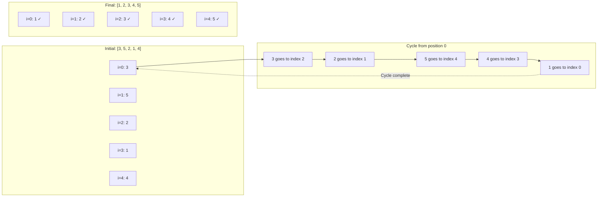

# Cyclic Sort

## Overview

| Property | Value |
|----------|-------|
| **Category** | In-Place Sorting |
| **Complexity (Time)** | O(n) |
| **Complexity (Space)** | O(1) |
| **Stability** | No |
| **In-place** | Yes |
| **Comparison-based** | No |

## Description

Cyclic Sort is an elegant, in-place sorting algorithm specifically designed for arrays containing integers from 1 to n (or 0 to n-1). The algorithm achieves O(n) time complexity by exploiting the fact that each element has exactly one "correct" position: element with value k should be at index k-1 (for 1 to n) or index k (for 0 to n-1).

The algorithm is particularly useful for solving problems involving finding missing numbers, duplicates, or arranging elements in their natural positions.

## Mathematical Foundation

### Position Mapping

For an array $A$ containing distinct integers from $1$ to $n$:

The correct position for element $a_i$ is:

$$\text{correct\_index}(a_i) = a_i - 1$$

### Cycle Detection

When element $a_i \neq i + 1$, a cycle exists. The cycle involves:

$$a_i \rightarrow a_{a_i-1} \rightarrow a_{a_{a_i-1}-1} \rightarrow \cdots \rightarrow a_i$$

### Number of Swaps

For $n$ elements, the maximum number of swaps is:

$$\text{max\_swaps} = n - c$$

Where $c$ is the number of elements already in their correct positions.

### Cycle Structure

In permutation theory, any permutation can be decomposed into disjoint cycles. For Cyclic Sort:

$$\sigma = C_1 \circ C_2 \circ \cdots \circ C_k$$

Each cycle $C_i$ of length $\ell_i$ requires $\ell_i - 1$ swaps to sort.

### Total Swaps

The total number of swaps is:

$$\text{total\_swaps} = \sum_{i=1}^{k} (\ell_i - 1) = n - k$$

Where $k$ is the number of cycles and $\sum \ell_i = n$.

## Algorithm

### Pseudocode

```
CYCLIC-SORT(A):
    n ← length(A)
    i ← 0
    
    while i < n:
        // Calculate correct position for A[i]
        correct_index ← A[i] - 1
        
        if i ≠ correct_index:
            // Swap A[i] with element at its correct position
            SWAP(A[i], A[correct_index])
        else:
            // Element is in correct position, move to next
            i ← i + 1
    
    return A
```

### Step-by-Step Execution

```
Input: [3, 5, 2, 1, 4]
Expected: [1, 2, 3, 4, 5]

i=0: A[0]=3, correct_index=2
     3≠0, swap A[0]↔A[2]: [2, 5, 3, 1, 4]
     
i=0: A[0]=2, correct_index=1
     2≠0, swap A[0]↔A[1]: [5, 2, 3, 1, 4]
     
i=0: A[0]=5, correct_index=4
     5≠0, swap A[0]↔A[4]: [4, 2, 3, 1, 5]
     
i=0: A[0]=4, correct_index=3
     4≠0, swap A[0]↔A[3]: [1, 2, 3, 4, 5]
     
i=0: A[0]=1, correct_index=0
     0=0, move to i=1
     
i=1: A[1]=2, correct_index=1
     1=1, move to i=2
     
i=2: A[2]=3, correct_index=2
     2=2, move to i=3
     
i=3: A[3]=4, correct_index=3
     3=3, move to i=4
     
i=4: A[4]=5, correct_index=4
     4=4, move to i=5

Output: [1, 2, 3, 4, 5]
```

## Complexity Analysis

### Time Complexity

| Case | Complexity | Explanation |
|------|------------|-------------|
| Best | O(n) | Array already sorted |
| Average | O(n) | Each element moved at most once |
| Worst | O(n) | All elements need repositioning |

**Why O(n)?** Each element is swapped at most once to its correct position. Once an element reaches its correct position, it never moves again. Therefore, total swaps ≤ n-1.

### Space Complexity

| Aspect | Complexity |
|--------|------------|
| Auxiliary Space | O(1) |
| Total Space | O(n) |

### Comparison with Other O(n) Sorts

| Algorithm | Constraints | Space | Use Case |
|-----------|-------------|-------|----------|
| Cyclic Sort | 1 to n integers | O(1) | Position-based sorting |
| Counting Sort | Known range | O(k) | General integers |
| Radix Sort | Fixed digits | O(n+k) | Large integers |
| Bucket Sort | Uniform dist. | O(n) | Floating point |

## Visual Representation

```mermaid
flowchart TD
    A[Start with i=0] --> B{i < n?}
    B -->|Yes| C[Calculate correct_index = A[i] - 1]
    C --> D{i ≠ correct_index?}
    D -->|Yes| E[Swap A[i] with A[correct_index]]
    E --> B
    D -->|No| F[i++]
    F --> B
    B -->|No| G[Return sorted array]
    G --> H[End]
```

### Cycle Following Visualization



## Implementation

### Python Implementation

```python
def cyclic_sort(nums: list[int]) -> list[int]:
    """
    Sorts the input list of n integers from 1 to n in-place
    using the Cyclic Sort algorithm.
    
    :param nums: List of n integers from 1 to n to be sorted.
    :return: The same list sorted in ascending order.
    
    Time complexity: O(n)
    
    >>> cyclic_sort([])
    []
    >>> cyclic_sort([3, 5, 2, 1, 4])
    [1, 2, 3, 4, 5]
    >>> cyclic_sort([1, 2, 3, 4, 5])
    [1, 2, 3, 4, 5]
    """
    index = 0
    while index < len(nums):
        correct_index = nums[index] - 1
        if index != correct_index:
            nums[index], nums[correct_index] = nums[correct_index], nums[index]
        else:
            index += 1
    
    return nums
```

### 0-Indexed Version

```python
def cyclic_sort_zero_indexed(nums: list[int]) -> list[int]:
    """
    Sort array containing 0 to n-1.
    
    >>> cyclic_sort_zero_indexed([2, 4, 1, 0, 3])
    [0, 1, 2, 3, 4]
    """
    i = 0
    while i < len(nums):
        correct_idx = nums[i]
        if nums[i] != nums[correct_idx]:
            nums[i], nums[correct_idx] = nums[correct_idx], nums[i]
        else:
            i += 1
    return nums
```

### Version with Duplicate Detection

```python
def cyclic_sort_with_duplicates(nums: list[int]) -> tuple[list[int], list[int]]:
    """
    Sort and detect duplicates.
    
    >>> cyclic_sort_with_duplicates([3, 1, 2, 3, 4])
    ([1, 2, 3, 3, 4], [3])
    """
    duplicates = []
    i = 0
    
    while i < len(nums):
        correct_idx = nums[i] - 1
        
        if nums[i] != nums[correct_idx]:
            nums[i], nums[correct_idx] = nums[correct_idx], nums[i]
        else:
            if i != correct_idx:
                duplicates.append(nums[i])
            i += 1
    
    return nums, duplicates
```

## Real-World Applications

### 1. Finding Missing Numbers

```python
def find_missing_numbers(nums: list[int]) -> list[int]:
    """
    Find all missing numbers in array containing 1 to n.
    Uses cyclic sort to place elements in correct positions.
    
    >>> find_missing_numbers([4, 3, 2, 7, 8, 2, 3, 1])
    [5, 6]
    >>> find_missing_numbers([1, 1])
    [2]
    """
    n = len(nums)
    i = 0
    
    # Cyclic sort (handle duplicates by skipping)
    while i < n:
        correct_idx = nums[i] - 1
        if 0 <= correct_idx < n and nums[i] != nums[correct_idx]:
            nums[i], nums[correct_idx] = nums[correct_idx], nums[i]
        else:
            i += 1
    
    # Find positions where element != index + 1
    missing = []
    for i in range(n):
        if nums[i] != i + 1:
            missing.append(i + 1)
    
    return missing


def find_single_missing(nums: list[int]) -> int:
    """
    Find the one missing number from 1 to n+1.
    
    >>> find_single_missing([1, 2, 4, 5])
    3
    """
    n = len(nums)
    i = 0
    
    while i < n:
        correct_idx = nums[i] - 1
        if correct_idx < n and nums[i] != nums[correct_idx]:
            nums[i], nums[correct_idx] = nums[correct_idx], nums[i]
        else:
            i += 1
    
    for i in range(n):
        if nums[i] != i + 1:
            return i + 1
    
    return n + 1
```

### 2. Finding Duplicate Numbers

```python
def find_duplicate(nums: list[int]) -> int:
    """
    Find the duplicate number (only one duplicate exists).
    Array has n+1 integers in range [1, n].
    
    >>> find_duplicate([1, 3, 4, 2, 2])
    2
    >>> find_duplicate([3, 1, 3, 4, 2])
    3
    """
    i = 0
    while i < len(nums):
        if nums[i] != i + 1:
            correct_idx = nums[i] - 1
            if nums[i] != nums[correct_idx]:
                nums[i], nums[correct_idx] = nums[correct_idx], nums[i]
            else:
                return nums[i]
        else:
            i += 1
    
    return -1


def find_all_duplicates(nums: list[int]) -> list[int]:
    """
    Find all duplicates in array with elements in [1, n].
    Some elements appear twice, others once.
    
    >>> find_all_duplicates([4, 3, 2, 7, 8, 2, 3, 1])
    [2, 3]
    """
    duplicates = []
    i = 0
    
    while i < len(nums):
        correct_idx = nums[i] - 1
        if nums[i] != nums[correct_idx]:
            nums[i], nums[correct_idx] = nums[correct_idx], nums[i]
        else:
            if i != correct_idx:
                duplicates.append(nums[i])
            i += 1
    
    return duplicates
```

### 3. First Missing Positive

```python
def first_missing_positive(nums: list[int]) -> int:
    """
    Find the smallest positive integer missing from array.
    This is a classic interview problem (LeetCode #41).
    
    >>> first_missing_positive([1, 2, 0])
    3
    >>> first_missing_positive([3, 4, -1, 1])
    2
    >>> first_missing_positive([7, 8, 9, 11, 12])
    1
    """
    n = len(nums)
    i = 0
    
    # Cyclic sort for valid positive integers
    while i < n:
        correct_idx = nums[i] - 1
        if 0 < nums[i] <= n and nums[i] != nums[correct_idx]:
            nums[i], nums[correct_idx] = nums[correct_idx], nums[i]
        else:
            i += 1
    
    # Find first position where nums[i] != i + 1
    for i in range(n):
        if nums[i] != i + 1:
            return i + 1
    
    return n + 1
```

### 4. Set Mismatch

```python
def find_error_nums(nums: list[int]) -> list[int]:
    """
    Find the number that appears twice and the missing number.
    Array should contain 1 to n, but one is duplicated.
    
    >>> find_error_nums([1, 2, 2, 4])
    [2, 3]
    >>> find_error_nums([1, 1])
    [1, 2]
    """
    n = len(nums)
    i = 0
    
    # Cyclic sort
    while i < n:
        correct_idx = nums[i] - 1
        if nums[i] != nums[correct_idx]:
            nums[i], nums[correct_idx] = nums[correct_idx], nums[i]
        else:
            i += 1
    
    # Find duplicate and missing
    for i in range(n):
        if nums[i] != i + 1:
            return [nums[i], i + 1]
    
    return []
```

### 5. Corrupt Pair Finder

```python
def find_corrupt_pair(nums: list[int]) -> tuple[int, int]:
    """
    In a 1-to-n array, find the corrupted pair:
    - One number is duplicated
    - One number is missing
    
    >>> find_corrupt_pair([3, 1, 2, 5, 2])
    (2, 4)
    >>> find_corrupt_pair([3, 1, 2, 3, 4, 5])
    (3, 6)
    """
    n = len(nums)
    i = 0
    
    while i < n:
        correct_idx = nums[i] - 1
        if nums[i] != nums[correct_idx]:
            nums[i], nums[correct_idx] = nums[correct_idx], nums[i]
        else:
            i += 1
    
    for i in range(n):
        if nums[i] != i + 1:
            return (nums[i], i + 1)
    
    return (-1, -1)


class DataIntegrityChecker:
    """
    Check data integrity using cyclic sort principles.
    Useful for verifying sequential ID assignments.
    """
    
    @staticmethod
    def verify_sequence(ids: list[int], start: int = 1) -> dict:
        """
        Verify a sequence of IDs for integrity.
        
        >>> checker = DataIntegrityChecker()
        >>> checker.verify_sequence([1, 2, 4, 4, 5])
        {'valid': False, 'missing': [3], 'duplicates': [4]}
        """
        if not ids:
            return {'valid': True, 'missing': [], 'duplicates': []}
        
        n = len(ids)
        nums = [x - start + 1 for x in ids]  # Normalize to 1-n
        
        missing = []
        duplicates = []
        i = 0
        
        while i < n:
            correct_idx = nums[i] - 1
            if 0 <= correct_idx < n and nums[i] != nums[correct_idx]:
                nums[i], nums[correct_idx] = nums[correct_idx], nums[i]
            else:
                if 0 <= correct_idx < n and i != correct_idx:
                    duplicates.append(nums[i] + start - 1)
                i += 1
        
        for i in range(n):
            if nums[i] != i + 1:
                missing.append(i + start)
        
        return {
            'valid': len(missing) == 0 and len(duplicates) == 0,
            'missing': missing,
            'duplicates': duplicates
        }
```

## Variants and Extensions

### K-Missing Positive Numbers

```python
def find_kth_missing_positive(arr: list[int], k: int) -> int:
    """
    Find the kth missing positive number.
    
    >>> find_kth_missing_positive([2, 3, 4, 7, 11], 5)
    9
    >>> find_kth_missing_positive([1, 2, 3, 4], 2)
    6
    """
    # Use modified cyclic sort idea
    missing_count = 0
    current = 1
    arr_set = set(arr)
    
    while missing_count < k:
        if current not in arr_set:
            missing_count += 1
            if missing_count == k:
                return current
        current += 1
    
    return current
```

### Range-Based Cyclic Sort

```python
def cyclic_sort_range(nums: list[int], low: int, high: int) -> list[int]:
    """
    Cyclic sort for range [low, high].
    
    >>> cyclic_sort_range([7, 5, 8, 6, 9], 5, 9)
    [5, 6, 7, 8, 9]
    """
    n = len(nums)
    i = 0
    
    while i < n:
        correct_idx = nums[i] - low
        if 0 <= correct_idx < n and nums[i] != nums[correct_idx]:
            nums[i], nums[correct_idx] = nums[correct_idx], nums[i]
        else:
            i += 1
    
    return nums
```

## Performance Characteristics

| Scenario | Swaps | Comparisons |
|----------|-------|-------------|
| Already sorted | 0 | n |
| Reverse sorted | n-1 | 2n-1 |
| Single cycle | n-1 | 2n-1 |
| All elements displaced | ≤ n-1 | ≤ 2n |

## References

1. [Cyclic Sort Pattern - LeetCode](https://leetcode.com/discuss/general-discussion/1073221/cyclic-sort-pattern)
2. [Permutation Cycles](https://en.wikipedia.org/wiki/Permutation#Cycle_notation)
3. [In-Place Algorithms](https://en.wikipedia.org/wiki/In-place_algorithm)
4. Sedgewick, R. "Algorithms" - Chapter on Sorting

## See Also

- [Counting Sort](counting_sort.md) - Another O(n) sort for bounded integers
- [Radix Sort](radix_sort.md) - O(nk) sort for integers
- [Bucket Sort](bucket_sort.md) - Distribution-based O(n) sort
