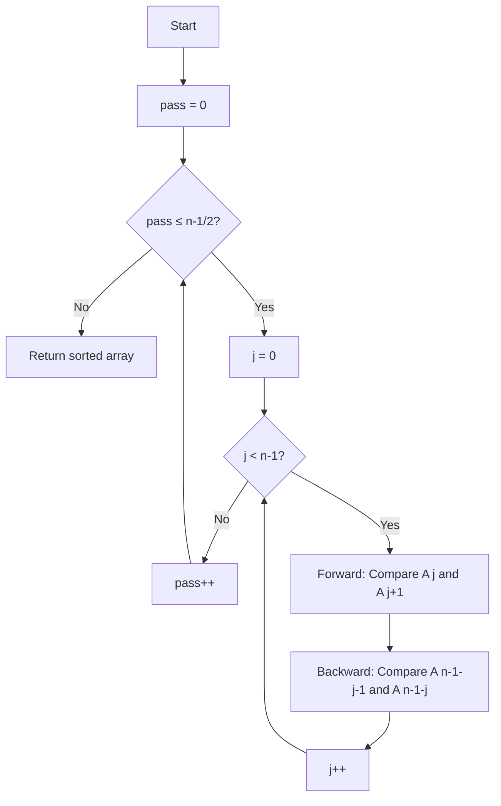

# Double Sort

## Overview

| Property | Value |
|----------|-------|
| **Category** | Sorting Algorithm |
| **Type** | Comparison-Based (Exchange) |
| **Data Structure** | Array |
| **Space Complexity** | O(1) |
| **Stable** | Yes |
| **In-Place** | Yes |
| **Variant Of** | Bidirectional Bubble Sort |

---

## Mathematical Foundation

### Definition

**Double Sort** is a bidirectional variant of Bubble Sort that simultaneously bubbles the largest element to the right **and** the smallest element to the left in each pass. This optimization reduces the number of passes required.

### Algorithm Principle

In standard Bubble Sort:
- Pass left-to-right: Bubble largest to end
- Repeat until sorted

In Double Sort:
- Same pass simultaneously:
  - Left-to-right: Bubble largest toward end
  - Right-to-left: Bubble smallest toward start
- Each pass moves **two elements** to their final positions

### Mathematical Analysis

**Number of Passes:**

For Bubble Sort on array of size $n$:
$$\text{Passes} = n - 1$$

For Double Sort:
$$\text{Passes} = \left\lceil \frac{n-1}{2} \right\rceil + 1$$

Since each pass positions both a maximum and a minimum.

**Comparisons per Pass:**
- Forward direction: $n - 1$ comparisons
- Backward direction: $n - 1$ comparisons
- Total per pass: $2(n-1)$

**Total Comparisons:**
$$\text{Total} = \left\lceil \frac{n-1}{2} \right\rceil \times 2(n-1) \approx (n-1)^2$$

Still $O(n^2)$, but with a smaller constant factor than standard Bubble Sort.

### Comparison with Cocktail Shaker Sort

Double Sort differs from Cocktail Shaker Sort:
- **Cocktail Shaker**: Alternates directions between passes
- **Double Sort**: Both directions in **same** pass simultaneously

---

## Pseudocode

```
DOUBLE-SORT(A):
    Input: Array A of n elements
    Output: Sorted array A
    
    n ← length(A)
    
    for pass ← 0 to ⌊(n-1)/2⌋:
        for j ← 0 to n-2:
            // Forward bubble (left to right)
            if A[j+1] < A[j]:
                swap A[j] and A[j+1]
            
            // Backward bubble (right to left)
            backward_j ← n - 1 - j
            if A[backward_j] < A[backward_j - 1]:
                swap A[backward_j - 1] and A[backward_j]
    
    return A
```

---

## Complexity Analysis

### Time Complexity

| Case | Complexity | Notes |
|------|------------|-------|
| **Best** | $O(n^2)$ | No early termination |
| **Average** | $O(n^2)$ | Quadratic |
| **Worst** | $O(n^2)$ | Reverse sorted |

### Space Complexity

| Component | Space |
|-----------|-------|
| Loop variables | $O(1)$ |
| Swaps (in-place) | $O(1)$ |
| **Total** | $O(1)$ |

---

## Visual Representation

### Algorithm Flow



### Step-by-Step Example

```
Input: [4, 3, 2, 1]

Pass 0:
  j=0: Forward A[0,1]: 4>3 → swap → [3, 4, 2, 1]
       Backward A[2,3]: 2>1 → swap → [3, 4, 1, 2]
  j=1: Forward A[1,2]: 4>1 → swap → [3, 1, 4, 2]
       Backward A[1,2]: 1<4 → no swap
  j=2: Forward A[2,3]: 4>2 → swap → [3, 1, 2, 4]
       Backward A[0,1]: 3>1 → swap → [1, 3, 2, 4]

Pass 1:
  j=0: Forward: 1<3 → no swap
       Backward: 2<4 → no swap
  j=1: Forward: 3>2 → swap → [1, 2, 3, 4]
  ...

Final: [1, 2, 3, 4]
```

---

## Implementation Details

### Python Implementation

```python
from typing import Any


def double_sort(collection: list[Any]) -> list[Any]:
    """
    Sorting using bidirectional bubble sort.
    
    >>> double_sort([-1, -2, -3, -4, -5, -6, -7])
    [-7, -6, -5, -4, -3, -2, -1]
    >>> double_sort([])
    []
    >>> double_sort([-3, 10, 16, -42, 29]) == sorted([-3, 10, 16, -42, 29])
    True
    """
    no_of_elements = len(collection)
    
    for _ in range(int(((no_of_elements - 1) / 2) + 1)):
        for j in range(no_of_elements - 1):
            # Forward bubble
            if collection[j + 1] < collection[j]:
                collection[j], collection[j + 1] = collection[j + 1], collection[j]
            
            # Backward bubble
            if collection[no_of_elements - 1 - j] < collection[no_of_elements - 2 - j]:
                (
                    collection[no_of_elements - 1 - j],
                    collection[no_of_elements - 2 - j],
                ) = (
                    collection[no_of_elements - 2 - j],
                    collection[no_of_elements - 1 - j],
                )
    
    return collection
```

---

## Real-World Applications

### 1. **Small Dataset Sorting**

**Use Case**: When simplicity matters more than efficiency for small lists.

```python
def sort_small_list(items: list) -> list:
    """Sort small lists where O(n²) is acceptable."""
    if len(items) <= 10:
        return double_sort(items.copy())
    return sorted(items)
```

### 2. **Educational Demonstration**

**Use Case**: Teaching bidirectional algorithms.

```python
def demo_bidirectional(arr: list) -> list:
    """Demonstrate simultaneous processing from both ends."""
    n = len(arr)
    for _ in range(n // 2 + 1):
        for j in range(n - 1):
            # Both operations can conceptually run in parallel
            if arr[j] > arr[j + 1]:
                arr[j], arr[j + 1] = arr[j + 1], arr[j]
            back = n - 1 - j
            if back > 0 and arr[back - 1] > arr[back]:
                arr[back - 1], arr[back] = arr[back], arr[back - 1]
    return arr
```

### 3. **Embedded Systems**

**Use Case**: In-place sorting with minimal memory overhead.

```python
def sort_sensor_data(readings: list[float]) -> list[float]:
    """Sort readings in-place with O(1) extra space."""
    return double_sort(readings)
```

---

## Advantages and Disadvantages

### ✅ Advantages

1. **In-place** - O(1) extra space
2. **Stable** - preserves relative order
3. **Fewer passes** than standard Bubble Sort
4. **Simple implementation**

### ❌ Disadvantages

1. **O(n²) complexity** - not efficient for large datasets
2. **No early termination** in basic version
3. **Not adaptive**

---

## References

1. [Wikipedia: Bubble Sort](https://en.wikipedia.org/wiki/Bubble_sort)
2. [Wikipedia: Cocktail Shaker Sort](https://en.wikipedia.org/wiki/Cocktail_shaker_sort)

---

## See Also

- [Bubble Sort](bubble_sort.md) - Basic exchange sort
- [Cocktail Shaker Sort](cocktail_shaker_sort.md) - Alternating bidirectional
- [Gnome Sort](gnome_sort.md) - Another simple exchange sort

