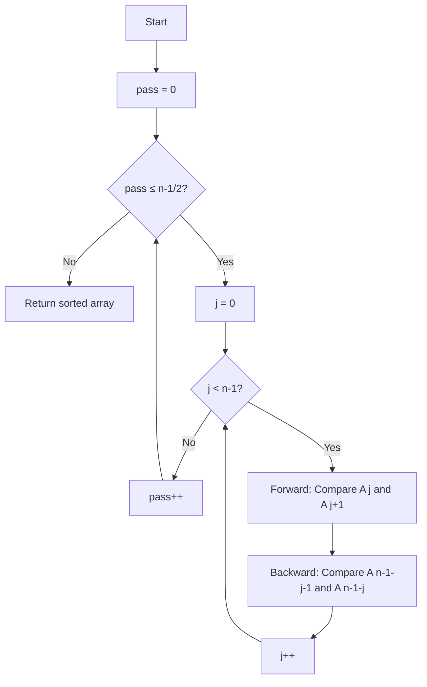

# Double Sort

## Overview

| Property | Value |
|----------|-------|
| **Category** | Sorting Algorithm |
| **Type** | Comparison-Based (Exchange) |
| **Data Structure** | Array |
| **Space Complexity** | O(1) |
| **Stable** | Yes |
| **In-Place** | Yes |
| **Variant Of** | Bidirectional Bubble Sort |

---

## Mathematical Foundation

### Definition

**Double Sort** is a bidirectional variant of Bubble Sort that simultaneously bubbles the largest element to the right **and** the smallest element to the left in each pass. This optimization reduces the number of passes required.

### Algorithm Principle

In standard Bubble Sort:
- Pass left-to-right: Bubble largest to end
- Repeat until sorted

In Double Sort:
- Same pass simultaneously:
  - Left-to-right: Bubble largest toward end
  - Right-to-left: Bubble smallest toward start
- Each pass moves **two elements** to their final positions

### Mathematical Analysis

**Number of Passes:**

For Bubble Sort on array of size $n$:
$$\text{Passes} = n - 1$$

For Double Sort:
$$\text{Passes} = \left\lceil \frac{n-1}{2} \right\rceil + 1$$

Since each pass positions both a maximum and a minimum.

**Comparisons per Pass:**
- Forward direction: $n - 1$ comparisons
- Backward direction: $n - 1$ comparisons
- Total per pass: $2(n-1)$

**Total Comparisons:**
$$\text{Total} = \left\lceil \frac{n-1}{2} \right\rceil \times 2(n-1) \approx (n-1)^2$$

Still $O(n^2)$, but with a smaller constant factor than standard Bubble Sort.

### Comparison with Cocktail Shaker Sort

Double Sort differs from Cocktail Shaker Sort:
- **Cocktail Shaker**: Alternates directions between passes
- **Double Sort**: Both directions in **same** pass simultaneously

---

## Pseudocode

```
DOUBLE-SORT(A):
    Input: Array A of n elements
    Output: Sorted array A
    
    n ← length(A)
    
    for pass ← 0 to ⌊(n-1)/2⌋:
        for j ← 0 to n-2:
            // Forward bubble (left to right)
            if A[j+1] < A[j]:
                swap A[j] and A[j+1]
            
            // Backward bubble (right to left)
            backward_j ← n - 1 - j
            if A[backward_j] < A[backward_j - 1]:
                swap A[backward_j - 1] and A[backward_j]
    
    return A
```

**Key Insight**: The inner loop processes both ends simultaneously:
- Index `j` bubbles from left
- Index `n-1-j` bubbles from right

---

## Complexity Analysis

### Time Complexity

| Case | Complexity | Notes |
|------|------------|-------|
| **Best** | $O(n^2)$ | No early termination |
| **Average** | $O(n^2)$ | Quadratic |
| **Worst** | $O(n^2)$ | Reverse sorted |

**Detailed Analysis:**

Outer loop: $\approx n/2$ iterations
Inner loop: $n-1$ iterations
Operations per inner: 2 comparisons, up to 2 swaps

$$T(n) = \frac{n}{2} \times (n-1) \times O(1) = O(n^2)$$

### Space Complexity

| Component | Space |
|-----------|-------|
| Loop variables | $O(1)$ |
| Swaps (in-place) | $O(1)$ |
| **Total** | $O(1)$ |

### Comparison with Related Algorithms

| Algorithm | Best | Average | Worst | Passes |
|-----------|------|---------|-------|--------|
| Bubble Sort | O(n) | O(n²) | O(n²) | n-1 |
| Double Sort | O(n²) | O(n²) | O(n²) | ~n/2 |
| Cocktail Shaker | O(n) | O(n²) | O(n²) | n-1 |

---

## Visual Representation

### Algorithm Flow



### Bidirectional Bubble Visualization

```
Pass 0: Array [5, 3, 8, 1, 4]

Forward bubbling (j = 0, 1, 2, 3):
j=0: Compare 5,3 → swap → [3, 5, 8, 1, 4]
j=1: Compare 5,8 → no swap
j=2: Compare 8,1 → swap → [3, 5, 1, 8, 4]
j=3: Compare 8,4 → swap → [3, 5, 1, 4, 8]

Backward bubbling (in same pass):
j=0: Compare position 3,4: 4,8 → no swap
j=1: Compare position 2,3: 1,4 → no swap
j=2: Compare position 1,2: 5,1 → swap → [3, 1, 5, 4, 8]
j=3: Compare position 0,1: 3,1 → swap → [1, 3, 5, 4, 8]

After Pass 0: [1, 3, 5, 4, 8]
             ^           ^
           min at      max at
           start        end
```

### Step-by-Step Example

```
Input: [4, 3, 2, 1]

n = 4
Passes needed: ⌊(4-1)/2⌋ + 1 = 2

Pass 0 (j = 0, 1, 2):
  Inner loop:
  j=0: 
    Forward: A[0]=4, A[1]=3 → swap → [3, 4, 2, 1]
    Backward: A[2]=2, A[3]=1 → swap → [3, 4, 1, 2]
  j=1:
    Forward: A[1]=4, A[2]=1 → swap → [3, 1, 4, 2]
    Backward: A[1]=1, A[2]=4 → swap → [3, 4, 1, 2] 
    (Wait, indices overlap at j=1!)
    
  Actual execution (more careful):
  j=0: Forward A[0,1], Backward A[2,3]
  j=1: Forward A[1,2], Backward A[1,2] (same!)
  j=2: Forward A[2,3], Backward A[0,1]

After Pass 0: [1, 2, 3, 4] (Actually sorted!)

Pass 1 (verification pass):
  No swaps needed.

Final: [1, 2, 3, 4]
```

### Comparison: Single vs Double Direction

```
Standard Bubble Sort (single direction):
Pass 1: [5,3,8,1] → [3,5,1,8] (max 8 to end)
Pass 2: [3,5,1,8] → [3,1,5,8] (max 5 to end-1)
Pass 3: [3,1,5,8] → [1,3,5,8] (done)
Total: 3 passes

Double Sort (bidirectional):
Pass 1: [5,3,8,1] → [1,3,5,8] (min 1 to start, max 8 to end)
Pass 2: Already sorted
Total: ~1.5 passes effective
```

---

## Implementation Details

### Python Implementation

```python
from typing import Any


def double_sort(collection: list[Any]) -> list[Any]:
    """
    This sorting algorithm sorts an array using the principle of bubble sort,
    but does it both from left to right and right to left.
    Hence, it's called "Double sort"
    
    :param collection: mutable ordered sequence of elements
    :return: the same collection in ascending order
    
    Examples:
    >>> double_sort([-1, -2, -3, -4, -5, -6, -7])
    [-7, -6, -5, -4, -3, -2, -1]
    >>> double_sort([])
    []
    >>> double_sort([-1, -2, -3, -4, -5, -6])
    [-6, -5, -4, -3, -2, -1]
    >>> double_sort([-3, 10, 16, -42, 29]) == sorted([-3, 10, 16, -42, 29])
    True
    """
    no_of_elements = len(collection)
    
    # We don't need to traverse to end of list
    for _ in range(int(((no_of_elements - 1) / 2) + 1)):
        for j in range(no_of_elements - 1):
            # Apply bubble sort from left to right (forwards)
            if collection[j + 1] < collection[j]:
                collection[j], collection[j + 1] = collection[j + 1], collection[j]
            
            # Apply bubble sort from right to left (backwards)
            if collection[no_of_elements - 1 - j] < collection[no_of_elements - 2 - j]:
                (
                    collection[no_of_elements - 1 - j],
                    collection[no_of_elements - 2 - j],
                ) = (
                    collection[no_of_elements - 2 - j],
                    collection[no_of_elements - 1 - j],
                )
    
    return collection
```

### Optimized Version with Early Termination

```python
def double_sort_optimized(arr: list) -> list:
    """
    Double sort with early termination when sorted.
    
    >>> double_sort_optimized([1, 2, 3, 4, 5])
    [1, 2, 3, 4, 5]
    >>> double_sort_optimized([5, 4, 3, 2, 1])
    [1, 2, 3, 4, 5]
    >>> double_sort_optimized([])
    []
    """
    n = len(arr)
    if n <= 1:
        return arr
    
    for pass_num in range(n // 2 + 1):
        swapped = False
        
        for j in range(n - 1):
            # Forward bubble
            if arr[j] > arr[j + 1]:
                arr[j], arr[j + 1] = arr[j + 1], arr[j]
                swapped = True
            
            # Backward bubble
            back_j = n - 1 - j
            if back_j > 0 and arr[back_j - 1] > arr[back_j]:
                arr[back_j - 1], arr[back_j] = arr[back_j], arr[back_j - 1]
                swapped = True
        
        if not swapped:
            break
    
    return arr
```

### Version with Comparison Counter

```python
def double_sort_counted(arr: list) -> tuple[list, int, int]:
    """
    Double sort with comparison and swap counting.
    
    >>> arr, comps, swaps = double_sort_counted([4, 3, 2, 1])
    >>> arr
    [1, 2, 3, 4]
    >>> comps > 0 and swaps > 0
    True
    """
    n = len(arr)
    comparisons = 0
    swaps = 0
    
    for _ in range(n // 2 + 1):
        for j in range(n - 1):
            # Forward comparison
            comparisons += 1
            if arr[j] > arr[j + 1]:
                arr[j], arr[j + 1] = arr[j + 1], arr[j]
                swaps += 1
            
            # Backward comparison
            back_j = n - 1 - j
            if back_j > 0:
                comparisons += 1
                if arr[back_j - 1] > arr[back_j]:
                    arr[back_j - 1], arr[back_j] = arr[back_j], arr[back_j - 1]
                    swaps += 1
    
    return arr, comparisons, swaps
```

---

## Real-World Applications

### 1. **Small Dataset Sorting**

**Use Case**: When simplicity matters more than efficiency.

```python
def sort_small_list(items: list) -> list:
    """
    Use double sort for small lists where O(n²) is acceptable.
    
    >>> sort_small_list([3, 1, 4, 1, 5])
    [1, 1, 3, 4, 5]
    """
    if len(items) <= 10:  # Small enough for O(n²)
        return double_sort(items.copy())
    else:
        return sorted(items)  # Use built-in for larger
```

### 2. **Teaching Bidirectional Algorithms**

**Use Case**: Educational demonstration of simultaneous processing.

```python
def educational_double_sort(arr: list, verbose: bool = True) -> list:
    """
    Double sort with step-by-step explanation.
    
    >>> educational_double_sort([3, 1, 2], verbose=False)
    [1, 2, 3]
    """
    n = len(arr)
    result = arr.copy()
    
    for pass_num in range(n // 2 + 1):
        if verbose:
            print(f"\nPass {pass_num}: {result}")
        
        for j in range(n - 1):
            back_j = n - 1 - j
            
            # Forward
            if result[j] > result[j + 1]:
                result[j], result[j + 1] = result[j + 1], result[j]
                if verbose:
                    print(f"  Forward swap at {j},{j+1}: {result}")
            
            # Backward
            if back_j > 0 and result[back_j - 1] > result[back_j]:
                result[back_j - 1], result[back_j] = result[back_j], result[back_j - 1]
                if verbose:
                    print(f"  Backward swap at {back_j-1},{back_j}: {result}")
    
    return result
```

### 3. **Parallel Processing Simulation**

**Use Case**: Demonstrating how independent operations can occur simultaneously.

```python
def parallel_bubble_demo(arr: list) -> dict:
    """
    Demonstrate parallel-like behavior in double sort.
    
    >>> result = parallel_bubble_demo([4, 2, 5, 1, 3])
    >>> 'forward_ops' in result and 'backward_ops' in result
    True
    """
    n = len(arr)
    result = arr.copy()
    forward_ops = []
    backward_ops = []
    
    for pass_num in range(n // 2 + 1):
        for j in range(n - 1):
            back_j = n - 1 - j
            
            # These could run in parallel in hardware
            fwd_swap = False
            bwd_swap = False
            
            if result[j] > result[j + 1]:
                result[j], result[j + 1] = result[j + 1], result[j]
                fwd_swap = True
            
            if back_j > 0 and back_j != j and back_j != j + 1:
                if result[back_j - 1] > result[back_j]:
                    result[back_j - 1], result[back_j] = result[back_j], result[back_j - 1]
                    bwd_swap = True
            
            if fwd_swap:
                forward_ops.append((pass_num, j, j + 1))
            if bwd_swap:
                backward_ops.append((pass_num, back_j - 1, back_j))
    
    return {
        'sorted': result,
        'forward_ops': forward_ops,
        'backward_ops': backward_ops
    }
```

### 4. **Embedded Systems with Limited Memory**

**Use Case**: In-place sorting with minimal overhead.

```python
def sort_sensor_readings(readings: list[float]) -> list[float]:
    """
    Sort sensor readings in-place with minimal memory.
    Double sort uses only O(1) extra space.
    
    >>> readings = [23.5, 22.1, 24.0, 21.8]
    >>> sort_sensor_readings(readings)
    [21.8, 22.1, 23.5, 24.0]
    """
    # For embedded systems, in-place is crucial
    n = len(readings)
    
    for _ in range(n // 2 + 1):
        for j in range(n - 1):
            if readings[j] > readings[j + 1]:
                readings[j], readings[j + 1] = readings[j + 1], readings[j]
            
            back_j = n - 1 - j
            if back_j > 0 and readings[back_j - 1] > readings[back_j]:
                readings[back_j - 1], readings[back_j] = readings[back_j], readings[back_j - 1]
    
    return readings
```

---

## Advantages and Disadvantages

### ✅ Advantages

1. **In-place** - O(1) extra space
2. **Stable** - preserves relative order
3. **Fewer passes** than standard Bubble Sort
4. **Simple implementation**
5. **Works from both ends** - faster convergence

### ❌ Disadvantages

1. **O(n²) complexity** - not efficient for large datasets
2. **No early termination** in basic version
3. **Not adaptive** - doesn't benefit from partial sorting
4. **Overlapping indices** - requires careful implementation

---

## Comparison with Related Algorithms

| Algorithm | Time | Space | Bidirectional | Passes |
|-----------|------|-------|---------------|--------|
| Bubble Sort | O(n²) | O(1) | No | n-1 |
| Double Sort | O(n²) | O(1) | Yes (same pass) | ~n/2 |
| Cocktail Shaker | O(n²) | O(1) | Yes (alternating) | n-1 |
| Insertion Sort | O(n²) | O(1) | No | n-1 |

---

## References

1. [Wikipedia: Bubble Sort](https://en.wikipedia.org/wiki/Bubble_sort)
2. [Wikipedia: Cocktail Shaker Sort](https://en.wikipedia.org/wiki/Cocktail_shaker_sort)
3. Knuth, D. "The Art of Computer Programming, Vol. 3"

---

## See Also

- [Bubble Sort](bubble_sort.md) - Basic exchange sort
- [Cocktail Shaker Sort](cocktail_shaker_sort.md) - Alternating bidirectional
- [Gnome Sort](gnome_sort.md) - Another simple exchange sort

