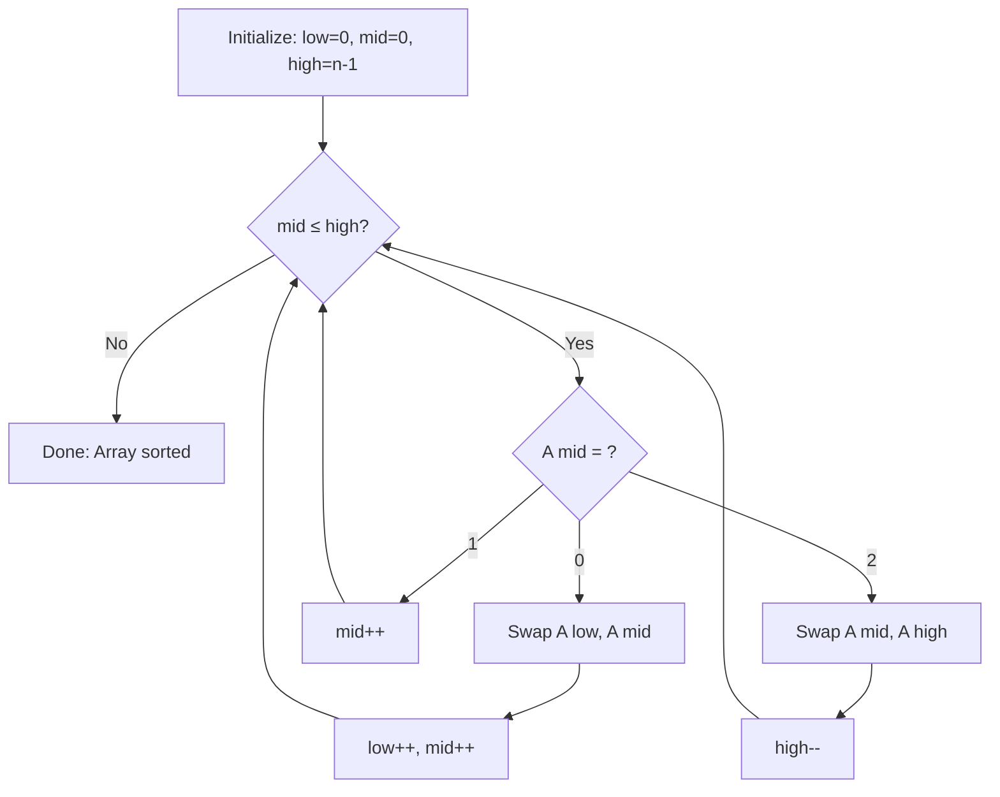

# Dutch National Flag Sort

## Overview

| Property | Value |
|----------|-------|
| **Category** | Sorting Algorithm |
| **Type** | Partitioning Algorithm |
| **Data Structure** | Array |
| **Space Complexity** | O(1) |
| **Stable** | No |
| **In-Place** | Yes |
| **Restriction** | Only 3 unique values |

---

## Mathematical Foundation

### Definition

The **Dutch National Flag (DNF) problem** was designed by **Edsger Dijkstra** as a programming exercise. Given an array containing only three distinct values (conventionally 0, 1, and 2), the goal is to sort the array in a single pass with O(1) extra space.

The name comes from the Netherlands flag, which has three horizontal stripes: **red** (bottom), **white** (middle), and **blue** (top).

### Problem Statement

Given an array $A$ of $n$ elements where each element $A[i] \in \{0, 1, 2\}$:

**Goal**: Rearrange $A$ such that all 0s come first, then all 1s, then all 2s.

$$A = [a_0, a_1, ..., a_{n-1}] \Rightarrow A' = [\underbrace{0, ..., 0}_{k_0}, \underbrace{1, ..., 1}_{k_1}, \underbrace{2, ..., 2}_{k_2}]$$

Where $k_0 + k_1 + k_2 = n$.

### Three-Way Partitioning

The algorithm maintains three regions using three pointers:

$$A[0 \ldots \text{low}-1] = \text{all 0s (red)}$$
$$A[\text{low} \ldots \text{mid}-1] = \text{all 1s (white)}$$
$$A[\text{mid} \ldots \text{high}] = \text{unknown}$$
$$A[\text{high}+1 \ldots n-1] = \text{all 2s (blue)}$$

### Invariants

At each iteration:
1. All elements before `low` are 0
2. All elements from `low` to `mid-1` are 1
3. All elements from `mid` to `high` are unprocessed
4. All elements after `high` are 2

---

## Pseudocode

```
DUTCH-NATIONAL-FLAG-SORT(A):
    Input: Array A with elements ∈ {0, 1, 2}
    Output: Array A sorted as [0s, 1s, 2s]
    
    low ← 0          // Boundary for 0s
    mid ← 0          // Current element
    high ← n - 1     // Boundary for 2s
    
    while mid ≤ high:
        if A[mid] = 0:
            // Move to 0s region
            swap A[low] and A[mid]
            low ← low + 1
            mid ← mid + 1
            
        else if A[mid] = 1:
            // Already in correct position
            mid ← mid + 1
            
        else if A[mid] = 2:
            // Move to 2s region
            swap A[mid] and A[high]
            high ← high - 1
            // Note: Don't increment mid!
            
    return A
```

**Key Insight**: When swapping with `high`, we don't increment `mid` because we haven't examined the swapped element yet.

---

## Complexity Analysis

### Time Complexity

| Case | Complexity | Notes |
|------|------------|-------|
| **Best** | $O(n)$ | Single pass |
| **Average** | $O(n)$ | Single pass |
| **Worst** | $O(n)$ | Single pass |

**Analysis:**
- Each element is visited at most twice
- Each pointer moves in one direction only
- Total iterations: $O(n)$

### Space Complexity

| Component | Space |
|-----------|-------|
| Pointers (low, mid, high) | $O(1)$ |
| Swaps (in-place) | $O(1)$ |
| **Total** | $O(1)$ |

### Comparison with Other Approaches

| Approach | Time | Space | Passes |
|----------|------|-------|--------|
| DNF Sort | O(n) | O(1) | 1 |
| Counting Sort | O(n) | O(1) | 2 |
| Generic Sort | O(n log n) | varies | varies |

---

## Visual Representation

### Algorithm Flow



### Step-by-Step Example

```
Input: [2, 0, 2, 1, 1, 0]

Initial: low=0, mid=0, high=5
Array:   [2, 0, 2, 1, 1, 0]
          ^              ^
         mid           high

Step 1: A[mid]=2 → swap with A[high], high--
Array:   [0, 0, 2, 1, 1, 2]
          ^           ^
         mid        high
         
Step 2: A[mid]=0 → swap with A[low], low++, mid++
Array:   [0, 0, 2, 1, 1, 2]
             ^        ^
            low      high
            mid

Step 3: A[mid]=0 → swap with A[low], low++, mid++
Array:   [0, 0, 2, 1, 1, 2]
                ^     ^
               low   high
               mid

Step 4: A[mid]=2 → swap with A[high], high--
Array:   [0, 0, 1, 1, 2, 2]
                ^  ^
               mid high

Step 5: A[mid]=1 → mid++
Array:   [0, 0, 1, 1, 2, 2]
                   ^  ^
                  mid high

Step 6: A[mid]=1 → mid++
Array:   [0, 0, 1, 1, 2, 2]
                      ^^
                   mid=high+1

mid > high → Done!
Result: [0, 0, 1, 1, 2, 2]
```

### Pointer Regions

```
At any point:

    [  0s region  |  1s region  |  unknown  |  2s region  ]
    0            low           mid        high            n-1
                  
Legend:
- [0, low-1]: Contains only 0s ✓
- [low, mid-1]: Contains only 1s ✓
- [mid, high]: Not yet processed
- [high+1, n-1]: Contains only 2s ✓
```

---

## Implementation Details

### Python Implementation

```python
# Color constants
red = 0    # First color of the flag
white = 1  # Second color of the flag
blue = 2   # Third color of the flag
colors = (red, white, blue)


def dutch_national_flag_sort(sequence: list) -> list:
    """
    A pure Python implementation of Dutch National Flag sort algorithm.
    
    :param sequence: List with elements ∈ {0, 1, 2}
    :return: The same collection in ascending order

    >>> dutch_national_flag_sort([])
    []
    >>> dutch_national_flag_sort([0])
    [0]
    >>> dutch_national_flag_sort([2, 1, 0, 0, 1, 2])
    [0, 0, 1, 1, 2, 2]
    >>> dutch_national_flag_sort([0, 1, 1, 0, 1, 2, 1, 2, 0, 0, 0, 1])
    [0, 0, 0, 0, 0, 1, 1, 1, 1, 1, 2, 2]
    """
    if not sequence:
        return []
    if len(sequence) == 1:
        return list(sequence)
    
    low = 0
    high = len(sequence) - 1
    mid = 0
    
    while mid <= high:
        if sequence[mid] == colors[0]:  # Red (0)
            sequence[low], sequence[mid] = sequence[mid], sequence[low]
            low += 1
            mid += 1
        elif sequence[mid] == colors[1]:  # White (1)
            mid += 1
        elif sequence[mid] == colors[2]:  # Blue (2)
            sequence[mid], sequence[high] = sequence[high], sequence[mid]
            high -= 1
        else:
            msg = f"Elements must be in {colors}"
            raise ValueError(msg)
    
    return sequence
```

### Generic Three-Way Partition

```python
def three_way_partition(arr: list, pivot) -> list:
    """
    Generic three-way partition around a pivot.
    Places elements < pivot, == pivot, > pivot.
    
    >>> three_way_partition([3, 1, 4, 1, 5, 9, 2, 6], 4)
    [1, 1, 2, 3, 4, 5, 9, 6]
    >>> three_way_partition([2, 2, 2, 2], 2)
    [2, 2, 2, 2]
    """
    low = 0
    mid = 0
    high = len(arr) - 1
    
    while mid <= high:
        if arr[mid] < pivot:
            arr[low], arr[mid] = arr[mid], arr[low]
            low += 1
            mid += 1
        elif arr[mid] == pivot:
            mid += 1
        else:  # arr[mid] > pivot
            arr[mid], arr[high] = arr[high], arr[mid]
            high -= 1
    
    return arr
```

### K-Way Partition Generalization

```python
def k_way_partition(arr: list, values: list) -> list:
    """
    Partition array into k groups based on k distinct values.
    This generalizes DNF from 3 to k values.
    
    >>> k_way_partition([3, 1, 2, 1, 3, 2], [1, 2, 3])
    [1, 1, 2, 2, 3, 3]
    """
    if len(values) <= 3:
        # Use DNF variant for efficiency
        return _three_way(arr, values)
    
    # General case: stable sort approach
    from collections import Counter
    counts = Counter(arr)
    result = []
    for v in values:
        result.extend([v] * counts.get(v, 0))
    return result


def _three_way(arr: list, values: list) -> list:
    """DNF for up to 3 values."""
    if not arr or not values:
        return arr
    
    # Map to 0, 1, 2
    value_map = {v: i for i, v in enumerate(values)}
    mapped = [value_map.get(x, 1) for x in arr]
    
    # Apply DNF
    low = mid = 0
    high = len(mapped) - 1
    
    while mid <= high:
        if mapped[mid] == 0:
            arr[low], arr[mid] = arr[mid], arr[low]
            mapped[low], mapped[mid] = mapped[mid], mapped[low]
            low += 1
            mid += 1
        elif mapped[mid] == 1:
            mid += 1
        else:
            arr[mid], arr[high] = arr[high], arr[mid]
            mapped[mid], mapped[high] = mapped[high], mapped[mid]
            high -= 1
    
    return arr
```

---

## Real-World Applications

### 1. **QuickSort Optimization (3-Way Partition)**

**Use Case**: Handling arrays with many duplicate elements.

```python
def quicksort_3way(arr: list, lo: int = 0, hi: int = None) -> list:
    """
    QuickSort with 3-way partitioning (Dutch National Flag).
    Handles duplicates efficiently.
    
    >>> quicksort_3way([3, 1, 4, 1, 5, 9, 2, 6, 5, 3, 5])
    [1, 1, 2, 3, 3, 4, 5, 5, 5, 6, 9]
    """
    if hi is None:
        hi = len(arr) - 1
    
    if lo >= hi:
        return arr
    
    # 3-way partition
    pivot = arr[lo]
    lt = lo      # arr[lo..lt-1] < pivot
    gt = hi      # arr[gt+1..hi] > pivot
    i = lo + 1   # arr[lt..i-1] == pivot
    
    while i <= gt:
        if arr[i] < pivot:
            arr[lt], arr[i] = arr[i], arr[lt]
            lt += 1
            i += 1
        elif arr[i] > pivot:
            arr[i], arr[gt] = arr[gt], arr[i]
            gt -= 1
        else:
            i += 1
    
    # Recurse on < and > partitions
    quicksort_3way(arr, lo, lt - 1)
    quicksort_3way(arr, gt + 1, hi)
    
    return arr
```

### 2. **Image Segmentation by Color**

**Use Case**: Separating pixels into RGB components.

```python
def segment_rgb_image(pixels: list[tuple]) -> dict:
    """
    Segment image pixels into dominant color categories.
    
    >>> pixels = [(255, 0, 0), (0, 255, 0), (0, 0, 255), (200, 0, 0)]
    >>> result = segment_rgb_image(pixels)
    >>> len(result['red'])
    2
    """
    def dominant_color(rgb: tuple) -> int:
        r, g, b = rgb
        if r > g and r > b:
            return 0  # Red dominant
        elif g > r and g > b:
            return 1  # Green dominant
        else:
            return 2  # Blue dominant
    
    # Convert to DNF format
    colors = [dominant_color(p) for p in pixels]
    indices = list(range(len(pixels)))
    
    # Sort indices using DNF
    low = mid = 0
    high = len(indices) - 1
    
    while mid <= high:
        if colors[indices[mid]] == 0:
            indices[low], indices[mid] = indices[mid], indices[low]
            low += 1
            mid += 1
        elif colors[indices[mid]] == 1:
            mid += 1
        else:
            indices[mid], indices[high] = indices[high], indices[mid]
            high -= 1
    
    return {
        'red': [pixels[i] for i in indices[:low]],
        'green': [pixels[i] for i in indices[low:high+1]],
        'blue': [pixels[i] for i in indices[high+1:]]
    }
```

### 3. **Task Priority Sorting**

**Use Case**: Organizing tasks by priority level.

```python
from dataclasses import dataclass
from enum import IntEnum


class Priority(IntEnum):
    HIGH = 0
    MEDIUM = 1
    LOW = 2


@dataclass
class Task:
    name: str
    priority: Priority


def sort_tasks_by_priority(tasks: list[Task]) -> list[Task]:
    """
    Sort tasks using DNF: HIGH → MEDIUM → LOW.
    O(n) time, O(1) space.
    
    >>> tasks = [Task("C", Priority.LOW), Task("A", Priority.HIGH), Task("B", Priority.MEDIUM)]
    >>> sorted_tasks = sort_tasks_by_priority(tasks)
    >>> [t.priority for t in sorted_tasks]
    [<Priority.HIGH: 0>, <Priority.MEDIUM: 1>, <Priority.LOW: 2>]
    """
    if len(tasks) <= 1:
        return tasks
    
    low = mid = 0
    high = len(tasks) - 1
    
    while mid <= high:
        if tasks[mid].priority == Priority.HIGH:
            tasks[low], tasks[mid] = tasks[mid], tasks[low]
            low += 1
            mid += 1
        elif tasks[mid].priority == Priority.MEDIUM:
            mid += 1
        else:  # Priority.LOW
            tasks[mid], tasks[high] = tasks[high], tasks[mid]
            high -= 1
    
    return tasks
```

### 4. **Network Packet Classification**

**Use Case**: Classifying packets by urgency.

```python
def classify_packets(packets: list[dict]) -> dict:
    """
    Classify network packets into urgent/normal/low priority.
    Uses DNF for O(n) single-pass classification.
    
    >>> packets = [
    ...     {'type': 'control', 'data': 'A'},
    ...     {'type': 'data', 'data': 'B'},
    ...     {'type': 'ack', 'data': 'C'}
    ... ]
    >>> result = classify_packets(packets)
    >>> list(result.keys())
    ['urgent', 'normal', 'low']
    """
    def get_priority(packet: dict) -> int:
        packet_type = packet.get('type', 'data')
        priorities = {'control': 0, 'data': 1, 'ack': 2}
        return priorities.get(packet_type, 1)
    
    indices = list(range(len(packets)))
    priorities = [get_priority(p) for p in packets]
    
    low = mid = 0
    high = len(indices) - 1
    
    while mid <= high:
        if priorities[indices[mid]] == 0:
            indices[low], indices[mid] = indices[mid], indices[low]
            priorities[indices[low]], priorities[indices[mid]] = (
                priorities[indices[mid]], priorities[indices[low]]
            )
            low += 1
            mid += 1
        elif priorities[indices[mid]] == 1:
            mid += 1
        else:
            indices[mid], indices[high] = indices[high], indices[mid]
            priorities[indices[mid]], priorities[indices[high]] = (
                priorities[indices[high]], priorities[indices[mid]]
            )
            high -= 1
    
    return {
        'urgent': [packets[i] for i in indices[:low]],
        'normal': [packets[i] for i in indices[low:high+1]],
        'low': [packets[i] for i in indices[high+1:]]
    }
```

---

## Advantages and Disadvantages

### ✅ Advantages

1. **O(n) time complexity** - guaranteed linear
2. **O(1) space** - truly in-place
3. **Single pass** - only one traversal
4. **Simple implementation**
5. **Foundation for 3-way QuickSort**

### ❌ Disadvantages

1. **Limited to 3 values** - not a general sort
2. **Not stable** - relative order not preserved
3. **Specific use case** - not always applicable

---

## Comparison with Related Algorithms

| Algorithm | Values | Time | Space | Stable |
|-----------|--------|------|-------|--------|
| DNF Sort | 3 | O(n) | O(1) | No |
| Counting Sort | k (small) | O(n+k) | O(k) | Yes |
| Radix Sort | any | O(d×n) | O(n) | Yes |
| Bucket Sort | range | O(n+k) | O(n) | Yes |

---

## References

1. [Wikipedia: Dutch National Flag Problem](https://en.wikipedia.org/wiki/Dutch_national_flag_problem)
2. Dijkstra, E. W. "A Discipline of Programming" (1976)
3. [Sedgewick's 3-Way QuickSort](https://algs4.cs.princeton.edu/23quicksort/)

---

## See Also

- [Quick Sort](quick_sort.md) - Uses partitioning
- [Counting Sort](counting_sort.md) - Another linear-time sort
- [Bucket Sort](bucket_sort.md) - Distribution-based sorting

