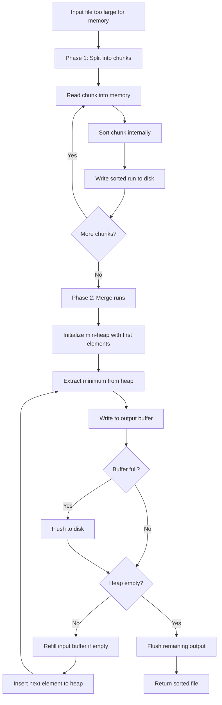

# External Sort

## Overview

| Property | Value |
|----------|-------|
| **Category** | Sorting Algorithm |
| **Type** | External Memory Algorithm |
| **Data Structure** | Files / External Storage |
| **Time Complexity** | O(n log n) |
| **Space Complexity** | O(memory_limit) |
| **Stable** | Yes (if implemented carefully) |
| **Paradigm** | Divide and Conquer / K-Way Merge |

---

## Mathematical Foundation

### Definition

**External Sort** is a class of algorithms designed to sort data that is too large to fit in main memory (RAM). It processes data in chunks that fit in memory, writes sorted chunks to external storage (disk), then merges them.

### The External Memory Model

**Parameters:**
- $N$ = Total number of elements
- $M$ = Memory size (in elements)
- $B$ = Block size (elements transferred per I/O operation)

**I/O Complexity:**
$$I/O = O\left(\frac{N}{B} \log_{M/B} \frac{N}{M}\right)$$

### Two-Phase External Sort

**Phase 1 - Run Formation:**
- Read $M$ elements into memory
- Sort them internally (any O(n log n) algorithm)
- Write sorted "run" to disk
- Repeat until all data processed

Number of runs: $\lceil N/M \rceil$

**Phase 2 - Merging:**
- Merge $k$ runs at a time, where $k = \lfloor M/B \rfloor - 1$
- Number of merge passes: $\lceil \log_k (N/M) \rceil$

### K-Way Merge Mathematics

For $k$ sorted runs, the merge uses a min-heap:

**Heap Operations:**
- Initial build: $O(k)$
- Extract-min: $O(\log k)$
- Insert: $O(\log k)$

**Total comparisons per element:** $O(\log k)$

### Optimal Block Size

To minimize I/O:
$$B_{optimal} \approx \sqrt{M \cdot \text{disk\_latency} / \text{transfer\_rate}}$$

---

## Pseudocode

```
EXTERNAL-SORT(input_file, memory_limit):
    Input: File with N elements, available memory M
    Output: Sorted file
    
    // Phase 1: Create sorted runs
    runs ← CREATE-SORTED-RUNS(input_file, memory_limit)
    
    // Phase 2: Merge runs
    while |runs| > 1:
        new_runs ← []
        
        // Merge groups of k runs
        k ← calculate_merge_factor(memory_limit, |runs|)
        
        for i ← 0 to |runs| - 1 step k:
            merged ← K-WAY-MERGE(runs[i:i+k], memory_limit)
            new_runs.append(merged)
        
        runs ← new_runs
    
    return runs[0]


CREATE-SORTED-RUNS(input_file, memory_limit):
    runs ← []
    
    while not EOF(input_file):
        // Read chunk into memory
        chunk ← READ(input_file, memory_limit)
        
        // Sort in memory
        SORT(chunk)  // Any efficient sort
        
        // Write to temporary file
        run_file ← CREATE-TEMP-FILE()
        WRITE(run_file, chunk)
        runs.append(run_file)
    
    return runs


K-WAY-MERGE(run_files, memory_limit):
    // Calculate buffer sizes
    k ← |run_files|
    buffer_size ← memory_limit / (k + 1)  // k input + 1 output
    
    // Initialize heap with first element from each run
    heap ← MIN-HEAP()
    buffers ← array of k input buffers
    output_buffer ← empty buffer
    
    for i ← 0 to k-1:
        buffers[i] ← READ(run_files[i], buffer_size)
        if buffers[i] not empty:
            heap.insert((buffers[i][0], i))
            buffers[i].remove_first()
    
    output_file ← CREATE-TEMP-FILE()
    
    while heap not empty:
        (value, run_index) ← heap.extract_min()
        output_buffer.append(value)
        
        // Flush output buffer if full
        if |output_buffer| = buffer_size:
            WRITE(output_file, output_buffer)
            output_buffer ← empty
        
        // Refill input buffer if empty
        if buffers[run_index] empty:
            buffers[run_index] ← READ(run_files[run_index], buffer_size)
        
        // Insert next element from same run
        if buffers[run_index] not empty:
            heap.insert((buffers[run_index][0], run_index))
            buffers[run_index].remove_first()
    
    // Flush remaining output
    if output_buffer not empty:
        WRITE(output_file, output_buffer)
    
    return output_file
```

---

## Complexity Analysis

### Time Complexity

| Phase | Complexity | Notes |
|-------|------------|-------|
| Run Creation | $O(N \log M)$ | Sort M elements, N/M times |
| Merging | $O(N \log_k (N/M))$ | K-way merge passes |
| **Total** | $O(N \log N)$ | Same as internal sort |

### I/O Complexity

| Phase | I/O Operations |
|-------|----------------|
| Run Creation | $O(N/B)$ reads + $O(N/B)$ writes |
| Each Merge Pass | $O(N/B)$ reads + $O(N/B)$ writes |
| **Total** | $O((N/B) \log_{M/B} (N/M))$ |

### Space Complexity

| Component | Space |
|-----------|-------|
| Memory buffers | O(M) |
| Heap | O(k) |
| Temp files | O(N) on disk |

### Example Calculation

```
N = 10^9 elements (1 billion)
M = 10^6 elements (1 million in memory)
B = 10^4 elements (block size)
k = M/B - 1 = 99 (merge factor)

Runs created: N/M = 1000 runs
Merge passes: ⌈log_99(1000)⌉ = 2 passes
Total I/O: 2 × 2 × N/B = 400,000 block transfers
```

---

## Visual Representation

### Two-Phase Process

```
Phase 1: Run Creation
┌─────────────────────────────────────────────────────────────┐
│ Input File: [5,2,8,1,9,3,7,4,6,0,...]  (too large for RAM)  │
└─────────────────────────────────────────────────────────────┘
                              │
        ┌─────────────────────┼─────────────────────┐
        ↓                     ↓                     ↓
   Read Chunk 1          Read Chunk 2          Read Chunk 3
   [5,2,8,1]            [9,3,7,4]             [6,0,...]
        │                     │                     │
   Sort in RAM           Sort in RAM           Sort in RAM
        │                     │                     │
   [1,2,5,8]            [3,4,7,9]             [0,6,...]
        ↓                     ↓                     ↓
   ┌─────────┐          ┌─────────┐          ┌─────────┐
   │  Run 1  │          │  Run 2  │          │  Run 3  │
   │ (disk)  │          │ (disk)  │          │ (disk)  │
   └─────────┘          └─────────┘          └─────────┘


Phase 2: K-Way Merge
┌─────────┐     ┌─────────┐     ┌─────────┐
│  Run 1  │     │  Run 2  │     │  Run 3  │
│[1,2,5,8]│     │[3,4,7,9]│     │[0,6,...│
└────┬────┘     └────┬────┘     └────┬────┘
     │               │               │
     └───────────────┼───────────────┘
                     │
              ┌──────┴──────┐
              │  Min-Heap   │
              │    Merge    │
              └──────┬──────┘
                     │
                     ↓
         [0,1,2,3,4,5,6,7,8,9,...]
                     │
              ┌──────┴──────┐
              │Output (disk)│
              └─────────────┘
```

### K-Way Merge with Buffers

```
Memory Layout:

┌────────────────────────────────────────────────────────┐
│                    Available Memory (M)                 │
├──────────┬──────────┬──────────┬──────────┬───────────┤
│ Buffer 1 │ Buffer 2 │ Buffer 3 │ Buffer 4 │  Output   │
│ (Run 1)  │ (Run 2)  │ (Run 3)  │ (Run 4)  │  Buffer   │
│  B/5     │   B/5    │   B/5    │   B/5    │    B/5    │
└────┬─────┴────┬─────┴────┬─────┴────┬─────┴─────┬─────┘
     │          │          │          │           │
     └──────────┴──────────┴──────────┘           │
                     │                            │
              ┌──────┴──────┐                     │
              │  Min-Heap   │                     │
              │   (size k)  │                     │
              └──────┬──────┘                     │
                     │                            │
                     └────────────────────────────┘
                              Minimum extracted,
                              added to output buffer
```

### Algorithm Flow



---

## Implementation Details

### Python Implementation

```python
#!/usr/bin/env python

import argparse
import os


class FileSplitter:
    """Splits large file into sorted chunks."""
    
    BLOCK_FILENAME_FORMAT = "block_{0}.dat"

    def __init__(self, filename):
        self.filename = filename
        self.block_filenames = []

    def write_block(self, data, block_number):
        filename = self.BLOCK_FILENAME_FORMAT.format(block_number)
        with open(filename, "w") as file:
            file.write(data)
        self.block_filenames.append(filename)

    def get_block_filenames(self):
        return self.block_filenames

    def split(self, block_size, sort_key=None):
        """Split file into sorted blocks."""
        i = 0
        with open(self.filename) as file:
            while True:
                lines = file.readlines(block_size)
                if not lines:
                    break
                
                if sort_key is None:
                    lines.sort()
                else:
                    lines.sort(key=sort_key)
                
                self.write_block("".join(lines), i)
                i += 1

    def cleanup(self):
        """Remove temporary block files."""
        for filename in self.block_filenames:
            os.remove(filename)


class NWayMerge:
    """Strategy for selecting minimum from multiple runs."""
    
    def select(self, choices):
        min_index = -1
        min_str = None
        
        for i, value in choices.items():
            if min_str is None or value < min_str:
                min_index = i
                min_str = value
        
        return min_index


class FilesArray:
    """Manages buffered reading from multiple files."""
    
    def __init__(self, files):
        self.files = files
        self.empty = set()
        self.num_buffers = len(files)
        self.buffers = dict.fromkeys(range(self.num_buffers))

    def get_dict(self):
        return {i: self.buffers[i] 
                for i in range(self.num_buffers) 
                if i not in self.empty}

    def refresh(self):
        """Refill empty buffers."""
        for i in range(self.num_buffers):
            if self.buffers[i] is None and i not in self.empty:
                self.buffers[i] = self.files[i].readline()
                
                if self.buffers[i] == "":
                    self.empty.add(i)
                    self.files[i].close()
        
        return len(self.empty) != self.num_buffers

    def unshift(self, index):
        """Get and clear buffer at index."""
        value = self.buffers[index]
        self.buffers[index] = None
        return value


class FileMerger:
    """Merges multiple sorted files."""
    
    def __init__(self, merge_strategy):
        self.merge_strategy = merge_strategy

    def merge(self, filenames, outfilename, buffer_size):
        buffers = FilesArray(self.get_file_handles(filenames, buffer_size))
        
        with open(outfilename, "w", buffer_size) as outfile:
            while buffers.refresh():
                min_index = self.merge_strategy.select(buffers.get_dict())
                outfile.write(buffers.unshift(min_index))

    def get_file_handles(self, filenames, buffer_size):
        return {i: open(filenames[i], "r", buffer_size) 
                for i in range(len(filenames))}


class ExternalSort:
    """External merge sort for large files."""
    
    def __init__(self, block_size):
        self.block_size = block_size

    def sort(self, filename, sort_key=None):
        """
        Sort a file that doesn't fit in memory.
        
        >>> # Example usage (conceptual)
        >>> sorter = ExternalSort(1024 * 1024)  # 1MB blocks
        >>> sorter.sort("large_file.txt")
        """
        num_blocks = self.get_number_blocks(filename, self.block_size)
        
        # Phase 1: Create sorted runs
        splitter = FileSplitter(filename)
        splitter.split(self.block_size, sort_key)
        
        # Phase 2: Merge runs
        merger = FileMerger(NWayMerge())
        buffer_size = self.block_size // (num_blocks + 1)
        merger.merge(
            splitter.get_block_filenames(), 
            filename + ".out", 
            buffer_size
        )
        
        # Cleanup
        splitter.cleanup()

    def get_number_blocks(self, filename, block_size):
        return (os.stat(filename).st_size // block_size) + 1


def parse_memory(string):
    """Parse memory size string (e.g., '100M', '1G')."""
    multipliers = {'k': 1024, 'm': 1024**2, 'g': 1024**3}
    if string[-1].lower() in multipliers:
        return int(string[:-1]) * multipliers[string[-1].lower()]
    return int(string)
```

### Heap-Based K-Way Merge

```python
import heapq
from typing import Iterator, TextIO


def heap_based_merge(files: list[TextIO]) -> Iterator[str]:
    """
    K-way merge using a min-heap.
    
    >>> # Simulated merge of sorted files
    >>> from io import StringIO
    >>> f1 = StringIO("1\\n3\\n5\\n")
    >>> f2 = StringIO("2\\n4\\n6\\n")
    >>> list(heap_based_merge([f1, f2]))
    ['1\\n', '2\\n', '3\\n', '4\\n', '5\\n', '6\\n']
    """
    # Initialize heap: (value, file_index)
    heap = []
    
    for i, f in enumerate(files):
        line = f.readline()
        if line:
            heapq.heappush(heap, (line, i))
    
    while heap:
        value, file_index = heapq.heappop(heap)
        yield value
        
        # Read next line from same file
        next_line = files[file_index].readline()
        if next_line:
            heapq.heappush(heap, (next_line, file_index))


def external_sort_with_heap(
    input_file: str,
    output_file: str,
    memory_limit: int
) -> None:
    """
    External sort using heap-based merge.
    
    >>> # Example: Sort 1GB file with 100MB memory
    >>> external_sort_with_heap('big.txt', 'sorted.txt', 100_000_000)
    """
    # Phase 1: Create sorted runs
    runs = []
    run_number = 0
    
    with open(input_file, 'r') as f:
        while True:
            # Read chunk
            lines = []
            size = 0
            
            while size < memory_limit:
                line = f.readline()
                if not line:
                    break
                lines.append(line)
                size += len(line)
            
            if not lines:
                break
            
            # Sort and write run
            lines.sort()
            run_file = f"run_{run_number}.tmp"
            with open(run_file, 'w') as rf:
                rf.writelines(lines)
            runs.append(run_file)
            run_number += 1
    
    # Phase 2: Merge runs
    file_handles = [open(run, 'r') for run in runs]
    
    with open(output_file, 'w') as out:
        for line in heap_based_merge(file_handles):
            out.write(line)
    
    # Cleanup
    for f in file_handles:
        f.close()
    for run in runs:
        os.remove(run)
```

---

## Real-World Applications

### 1. **Database Sorting**

**Use Case**: Sorting large database tables.

```python
import sqlite3
import csv


class DatabaseExternalSort:
    """
    External sort for database query results.
    """
    
    def __init__(self, db_path: str, memory_mb: int = 100):
        self.db_path = db_path
        self.memory_limit = memory_mb * 1024 * 1024
        self.temp_tables = []
    
    def sort_table(
        self,
        table: str,
        order_by: str,
        output_table: str
    ) -> None:
        """
        Sort a large table using external sort technique.
        
        >>> sorter = DatabaseExternalSort('data.db')
        >>> sorter.sort_table('events', 'timestamp', 'sorted_events')
        """
        conn = sqlite3.connect(self.db_path)
        cursor = conn.cursor()
        
        # Get row count
        cursor.execute(f"SELECT COUNT(*) FROM {table}")
        total_rows = cursor.fetchone()[0]
        
        # Calculate chunk size
        cursor.execute(f"SELECT * FROM {table} LIMIT 1")
        row_size = len(str(cursor.fetchone())) * 2  # Estimate
        chunk_size = self.memory_limit // row_size
        
        # Phase 1: Create sorted temp tables
        offset = 0
        temp_id = 0
        
        while offset < total_rows:
            temp_table = f"_sort_temp_{temp_id}"
            cursor.execute(f"""
                CREATE TEMP TABLE {temp_table} AS
                SELECT * FROM {table}
                ORDER BY {order_by}
                LIMIT {chunk_size} OFFSET {offset}
            """)
            self.temp_tables.append(temp_table)
            offset += chunk_size
            temp_id += 1
        
        # Phase 2: Merge (using SQL UNION ALL + ORDER BY for small number of chunks)
        if len(self.temp_tables) <= 10:
            union_query = " UNION ALL ".join(
                f"SELECT * FROM {t}" for t in self.temp_tables
            )
            cursor.execute(f"""
                CREATE TABLE {output_table} AS
                SELECT * FROM ({union_query})
                ORDER BY {order_by}
            """)
        
        conn.commit()
        conn.close()
```

### 2. **Log File Processing**

**Use Case**: Sorting and merging distributed log files.

```python
from datetime import datetime
import gzip


class LogFileSorter:
    """
    Sort large log files chronologically.
    """
    
    def __init__(self, memory_mb: int = 256):
        self.memory_limit = memory_mb * 1024 * 1024
    
    def sort_logs(
        self,
        log_files: list[str],
        output_file: str,
        timestamp_format: str = "%Y-%m-%d %H:%M:%S"
    ) -> None:
        """
        Sort and merge multiple log files by timestamp.
        
        >>> sorter = LogFileSorter()
        >>> sorter.sort_logs(
        ...     ['server1.log', 'server2.log'],
        ...     'merged.log'
        ... )
        """
        def extract_timestamp(line: str) -> datetime:
            # Extract timestamp from log line
            try:
                ts_str = line[:19]  # Assume ISO format at start
                return datetime.strptime(ts_str, timestamp_format)
            except ValueError:
                return datetime.min
        
        # Sort each file individually first
        sorted_files = []
        for log_file in log_files:
            sorted_file = self._sort_single_file(
                log_file, 
                extract_timestamp
            )
            sorted_files.append(sorted_file)
        
        # Merge sorted files
        self._merge_sorted_files(sorted_files, output_file, extract_timestamp)
    
    def _sort_single_file(self, filename, key_func):
        """Sort a single log file."""
        sorter = ExternalSort(self.memory_limit)
        sorter.sort(filename, sort_key=key_func)
        return filename + ".out"
    
    def _merge_sorted_files(self, files, output, key_func):
        """Merge multiple sorted files."""
        handles = [open(f, 'r') for f in files]
        
        with open(output, 'w') as out:
            for line in heap_based_merge(handles):
                out.write(line)
```

### 3. **Big Data ETL Pipeline**

**Use Case**: Sorting large datasets in data pipelines.

```python
class ETLSorter:
    """
    External sort for ETL data processing.
    """
    
    def __init__(self, scratch_dir: str, memory_gb: float = 4):
        self.scratch_dir = scratch_dir
        self.memory_limit = int(memory_gb * 1024 * 1024 * 1024)
    
    def sort_csv(
        self,
        input_csv: str,
        output_csv: str,
        sort_columns: list[str]
    ) -> None:
        """
        Sort a large CSV file by specified columns.
        
        >>> sorter = ETLSorter('/tmp/scratch')
        >>> sorter.sort_csv(
        ...     'sales.csv', 
        ...     'sorted_sales.csv',
        ...     ['date', 'customer_id']
        ... )
        """
        import pandas as pd
        
        # Read header
        header = pd.read_csv(input_csv, nrows=0).columns.tolist()
        sort_indices = [header.index(col) for col in sort_columns]
        
        # Phase 1: Create sorted chunks
        chunks = []
        chunk_id = 0
        
        for chunk in pd.read_csv(input_csv, chunksize=100000):
            # Sort chunk
            chunk = chunk.sort_values(by=sort_columns)
            
            # Write to temp file
            chunk_file = f"{self.scratch_dir}/chunk_{chunk_id}.csv"
            chunk.to_csv(chunk_file, index=False)
            chunks.append(chunk_file)
            chunk_id += 1
        
        # Phase 2: K-way merge chunks
        self._merge_csv_chunks(chunks, output_csv, sort_columns)
    
    def _merge_csv_chunks(self, chunks, output, sort_columns):
        """Merge sorted CSV chunks."""
        import pandas as pd
        
        # Use pandas merge_sorted for small number of chunks
        dfs = [pd.read_csv(c) for c in chunks]
        merged = pd.concat(dfs).sort_values(by=sort_columns)
        merged.to_csv(output, index=False)
```

---

## Advantages and Disadvantages

### ✅ Advantages

1. **Handles unlimited data** - only limited by disk space
2. **O(n log n) guarantee** - optimal comparison sort
3. **I/O efficient** - sequential access patterns
4. **Parallelizable** - runs can be sorted concurrently
5. **Stable** - can maintain relative order

### ❌ Disadvantages

1. **Disk I/O overhead** - slower than in-memory
2. **Temp space required** - needs 2x data size on disk
3. **Complex implementation** - buffer management
4. **Sensitive to disk speed** - SSD vs HDD matters

---

## References

1. [Wikipedia: External Sorting](https://en.wikipedia.org/wiki/External_sorting)
2. Vitter, J.S. - "Algorithms and Data Structures for External Memory"
3. Knuth, "The Art of Computer Programming, Vol. 3"

---

## See Also

- [Merge Sort](merge_sort.md) - Internal merge sort
- [K-Way Merge](k_way_merge.md) - Core merge operation
- [Polyphase Merge](polyphase_merge.md) - Advanced external sort
