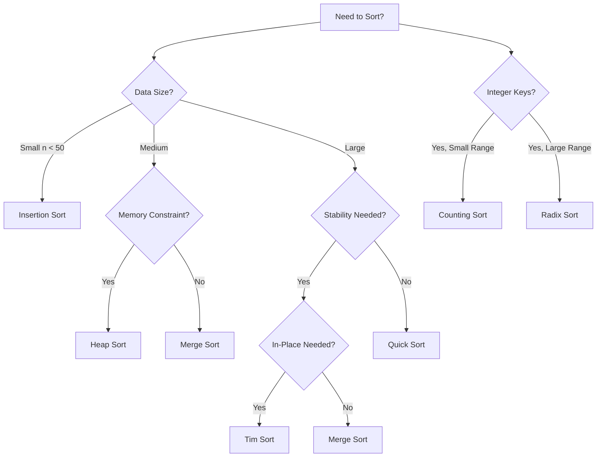

# Sorting Algorithms

## Overview

Sorting algorithms arrange elements of a list in a specific order (typically ascending or descending). This category covers comparison-based and non-comparison-based sorting algorithms with varying time complexities from O(n log n) to O(n²).

---

## Algorithm Index

### Comparison-Based Sorting

| Algorithm | Time (Best) | Time (Avg) | Time (Worst) | Space | Stable | Report |
|-----------|-------------|------------|--------------|-------|--------|--------|
| [Bubble Sort](./bubble_sort.md) | O(n) | O(n²) | O(n²) | O(1) | ✅ | ✅ |
| [Selection Sort](./selection_sort.md) | O(n²) | O(n²) | O(n²) | O(1) | ❌ | ✅ |
| [Insertion Sort](./insertion_sort.md) | O(n) | O(n²) | O(n²) | O(1) | ✅ | ✅ |
| [Merge Sort](./merge_sort.md) | O(n log n) | O(n log n) | O(n log n) | O(n) | ✅ | ✅ |
| [Quick Sort](./quick_sort.md) | O(n log n) | O(n log n) | O(n²) | O(log n) | ❌ | ✅ |
| [Heap Sort](./heap_sort.md) | O(n log n) | O(n log n) | O(n log n) | O(1) | ❌ | ✅ |
| [Shell Sort](./shell_sort.md) | O(n log n) | O(n^1.25) | O(n²) | O(1) | ❌ | ✅ |
| [Tim Sort](./tim_sort.md) | O(n) | O(n log n) | O(n log n) | O(n) | ✅ | ✅ |
| [Cocktail Shaker Sort](./cocktail_shaker_sort.md) | O(n) | O(n²) | O(n²) | O(1) | ✅ | ✅ |
| [Comb Sort](./comb_sort.md) | O(n log n) | O(n²) | O(n²) | O(1) | ❌ | ✅ |
| [Gnome Sort](./gnome_sort.md) | O(n) | O(n²) | O(n²) | O(1) | ✅ | ✅ |
| [Odd-Even Sort](./odd_even_sort.md) | O(n) | O(n²) | O(n²) | O(1) | ✅ | ✅ |
| [Pancake Sort](./pancake_sort.md) | O(n) | O(n²) | O(n²) | O(1) | ❌ | ✅ |
| [Cycle Sort](./cycle_sort.md) | O(n²) | O(n²) | O(n²) | O(1) | ❌ | ✅ |
| [Stooge Sort](./stooge_sort.md) | O(n^2.7) | O(n^2.7) | O(n^2.7) | O(n) | ❌ | ✅ |
| [Slowsort](./slowsort.md) | O(n^(log n)) | O(n^(log n)) | O(n^(log n)) | O(n) | ❌ | ✅ |
| [Bogo Sort](./bogo_sort.md) | O(n) | O((n+1)!) | O(∞) | O(1) | ❌ | ✅ |

### Non-Comparison-Based Sorting

| Algorithm | Time (Best) | Time (Avg) | Time (Worst) | Space | Stable | Report |
|-----------|-------------|------------|--------------|-------|--------|--------|
| [Counting Sort](./counting_sort.md) | O(n+k) | O(n+k) | O(n+k) | O(k) | ✅ | ✅ |
| [Radix Sort](./radix_sort.md) | O(nk) | O(nk) | O(nk) | O(n+k) | ✅ | ✅ |
| [Bucket Sort](./bucket_sort.md) | O(n+k) | O(n+k) | O(n²) | O(n) | ✅ | ✅ |
| [Pigeonhole Sort](./pigeonhole_sort.md) | O(n+k) | O(n+k) | O(n+k) | O(k) | ✅ | ✅ |

### Hybrid and Specialized Sorts

| Algorithm | Time (Best) | Time (Avg) | Time (Worst) | Space | Stable | Report |
|-----------|-------------|------------|--------------|-------|--------|--------|
| [Intro Sort](./intro_sort.md) | O(n log n) | O(n log n) | O(n log n) | O(log n) | ❌ | ✅ |
| [Tree Sort](./tree_sort.md) | O(n log n) | O(n log n) | O(n²) | O(n) | ✅ | ✅ |
| [Patience Sort](./patience_sort.md) | O(n log n) | O(n log n) | O(n log n) | O(n) | ❌ | ✅ |
| [Strand Sort](./strand_sort.md) | O(n) | O(n²) | O(n²) | O(n) | ✅ | ✅ |
| [Bitonic Sort](./bitonic_sort.md) | O(log² n) | O(log² n) | O(log² n) | O(n log² n) | ❌ | ✅ |

### Parallel and External Sorts

| Algorithm | Time (Best) | Time (Avg) | Time (Worst) | Space | Report |
|-----------|-------------|------------|--------------|-------|--------|
| [External Sort](./external_sort.md) | O(n log n) | O(n log n) | O(n log n) | O(M) | ✅ |
| [Odd-Even Transposition](./odd_even_transposition.md) | O(n) | O(n) | O(n) | O(1) | ✅ |

---

## Classification

### By Time Complexity

```
O(n log n) - Optimal comparison-based
├── Merge Sort (stable, not in-place)
├── Heap Sort (in-place, not stable)
├── Quick Sort (average case, in-place)
└── Tim Sort (stable, hybrid)

O(n²) - Simple algorithms
├── Bubble Sort
├── Selection Sort
└── Insertion Sort

O(n+k) - Linear time (non-comparison)
├── Counting Sort
├── Radix Sort
└── Bucket Sort
```

### By Space Usage

| In-Place (O(1)) | Not In-Place |
|-----------------|--------------|
| Bubble Sort | Merge Sort O(n) |
| Selection Sort | Counting Sort O(k) |
| Insertion Sort | Radix Sort O(n+k) |
| Heap Sort | Bucket Sort O(n) |
| Quick Sort* | Tree Sort O(n) |

*Quick Sort uses O(log n) stack space

### By Stability

| Stable | Unstable |
|--------|----------|
| Bubble Sort | Selection Sort |
| Insertion Sort | Heap Sort |
| Merge Sort | Quick Sort |
| Counting Sort | Shell Sort |
| Radix Sort | Comb Sort |
| Tim Sort | Intro Sort |

---

## Decision Guide



---

## Comparison Summary

### Performance on Different Input Types

| Algorithm | Random | Nearly Sorted | Reversed | Few Unique |
|-----------|--------|---------------|----------|------------|
| Quick Sort | ⭐⭐⭐ | ⭐⭐ | ⭐ | ⭐⭐ |
| Merge Sort | ⭐⭐⭐ | ⭐⭐⭐ | ⭐⭐⭐ | ⭐⭐⭐ |
| Heap Sort | ⭐⭐⭐ | ⭐⭐ | ⭐⭐ | ⭐⭐ |
| Insertion Sort | ⭐ | ⭐⭐⭐ | ⭐ | ⭐⭐ |
| Tim Sort | ⭐⭐⭐ | ⭐⭐⭐ | ⭐⭐⭐ | ⭐⭐⭐ |

---

## Source Files

All implementations are located in [`sorts/`](../../../sorts/):

```
sorts/
├── bubble_sort.py
├── selection_sort.py
├── insertion_sort.py
├── merge_sort.py
├── quick_sort.py
├── heap_sort.py
├── counting_sort.py
├── radix_sort.py
├── bucket_sort.py
├── shell_sort.py
├── tim_sort.py
└── ... (50+ files)
```

---

*Category: Sorting | Algorithms: 52 | Last Updated: December 2024*
