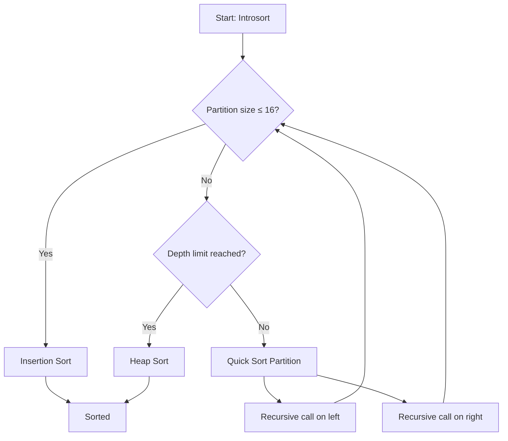

# Introsort (Introspective Sort)

## Overview

| Property | Value |
|----------|-------|
| **Category** | Sorting Algorithm |
| **Type** | Comparison-Based (Hybrid) |
| **Data Structure** | Array |
| **Space Complexity** | O(log n) |
| **Stable** | No |
| **In-Place** | Yes |
| **Adaptive** | Partially |

---

## Mathematical Foundation

### Definition

**Introsort** (Introspective Sort) is a hybrid sorting algorithm that combines three algorithms to achieve optimal performance:

1. **Quick Sort** - For most cases (fast average performance)
2. **Heap Sort** - When recursion depth exceeds limit (guaranteed O(n log n))
3. **Insertion Sort** - For small partitions (low overhead)

### Algorithm Design Philosophy

Introsort was designed by David Musser in 1997 to address Quick Sort's worst-case O(n²) performance while maintaining its excellent average-case behavior.

### Key Parameters

1. **Size Threshold** ($s$): Partition size below which Insertion Sort is used
   - Typically $s = 16$
   
2. **Depth Limit** ($d$): Maximum recursion depth before switching to Heap Sort
   - $d = 2 \lfloor \log_2 n \rfloor$

### Mathematical Guarantee

The algorithm guarantees:
$$T(n) = O(n \log n) \text{ in all cases}$$

This is achieved because:
- Heap Sort takes over when depth exceeds $2\log_2 n$
- If Quick Sort degrades, Heap Sort limits total work

### Recursion Depth Analysis

For a balanced partition:
$$d_{balanced} = \log_2 n$$

For the worst case (fully unbalanced):
$$d_{worst} = n$$

By switching to Heap Sort at depth $2\log_2 n$, we bound the worst case.

---

## Pseudocode

```
INTROSORT(A):
    Input: Array A of n elements
    Output: Sorted array A (in-place)
    
    n ← length(A)
    max_depth ← 2 × ⌈log₂(n)⌉
    size_threshold ← 16
    
    INTROSORT-RECURSIVE(A, 0, n, size_threshold, max_depth)
    return A


INTROSORT-RECURSIVE(A, start, end, size_threshold, max_depth):
    size ← end - start
    
    // Base case: small arrays use Insertion Sort
    if size ≤ size_threshold:
        INSERTION-SORT(A, start, end)
        return
    
    // Depth limit exceeded: use Heap Sort
    if max_depth == 0:
        HEAP-SORT(A[start..end-1])
        return
    
    // Standard case: use Quick Sort with median-of-3 pivot
    pivot ← MEDIAN-OF-THREE(A, start, (start + end) / 2, end - 1)
    partition_point ← PARTITION(A, start, end, pivot)
    
    // Recurse on both partitions
    INTROSORT-RECURSIVE(A, start, partition_point, size_threshold, max_depth - 1)
    INTROSORT-RECURSIVE(A, partition_point, end, size_threshold, max_depth - 1)


MEDIAN-OF-THREE(A, i, j, k):
    // Return median value of A[i], A[j], A[k]
    if (A[i] > A[j]) ≠ (A[i] > A[k]):
        return A[i]
    else if (A[j] > A[i]) ≠ (A[j] > A[k]):
        return A[j]
    else:
        return A[k]


PARTITION(A, low, high, pivot):
    i ← low
    j ← high
    while True:
        while A[i] < pivot:
            i ← i + 1
        j ← j - 1
        while pivot < A[j]:
            j ← j - 1
        if i ≥ j:
            return i
        swap A[i] and A[j]
        i ← i + 1
```

---

## Complexity Analysis

### Time Complexity

| Case | Complexity | When |
|------|------------|------|
| **Best** | $O(n \log n)$ | Good pivot selection |
| **Average** | $O(n \log n)$ | Random input |
| **Worst** | $O(n \log n)$ | Heap Sort takes over |

**Comparison with Pure Quick Sort:**

| Algorithm | Best | Average | Worst |
|-----------|------|---------|-------|
| Quick Sort | $O(n \log n)$ | $O(n \log n)$ | $O(n^2)$ |
| Introsort | $O(n \log n)$ | $O(n \log n)$ | $O(n \log n)$ |

### Space Complexity

| Component | Space |
|-----------|-------|
| Recursion stack | $O(\log n)$ |
| Heap Sort (when used) | $O(1)$ |
| **Total** | $O(\log n)$ |

### Why Size Threshold = 16?

For small arrays, Insertion Sort outperforms Quick Sort due to:
- No recursive call overhead
- Better cache behavior
- Simple comparisons

Empirically, $s = 16$ provides optimal crossover point.

---

## Visual Representation

### Algorithm Decision Flow



### Algorithm State Diagram

```
Initial: [8, 4, 23, 42, 16, 15, 3, 9, 55, 0, 34, 12, 2, 46, 25, 17, 28]
         17 elements, max_depth = 2 × ⌈log₂(17)⌉ = 10

Level 0: Quick Sort partition (depth=10)
         Pivot = median(8, 15, 28) = 15
         After partition: [0, 4, 3, 9, 2, 12, 8] [15] [55, 42, 34, 23, 25, 46, 17, 28, 16]
         
Level 1: Quick Sort on both halves (depth=9)
         Left (7 elements): Quick Sort continues
         Right (9 elements): Quick Sort continues
         
Level 2-3: Continue partitioning (depth=8,7,...)

At depth=0 or size≤16: Switch to Heap Sort or Insertion Sort
```

### Performance Comparison

```
Input Size: 100,000 elements

Pure Quick Sort (worst case - sorted input):
  Time: O(n²) ≈ 10,000,000,000 operations
  
Introsort (same input):
  Time: O(n log n) ≈ 1,660,964 operations
  
Speedup: ~6,000x for pathological cases
```

---

## Implementation Details

### Python Implementation

```python
import math


def insertion_sort(array: list, start: int = 0, end: int = 0) -> list:
    """
    Insertion sort for small partitions.
    
    >>> insertion_sort([4, 2, 6, 8, 1, 7], 0, 6)
    [1, 2, 4, 6, 7, 8]
    """
    end = end or len(array)
    for i in range(start, end):
        temp_index = i
        temp_value = array[i]
        while temp_index != start and temp_value < array[temp_index - 1]:
            array[temp_index] = array[temp_index - 1]
            temp_index -= 1
        array[temp_index] = temp_value
    return array


def heapify(array: list, index: int, heap_size: int) -> None:
    """Maintain max-heap property."""
    largest = index
    left = 2 * index + 1
    right = 2 * index + 2
    
    if left < heap_size and array[largest] < array[left]:
        largest = left
    if right < heap_size and array[largest] < array[right]:
        largest = right
    
    if largest != index:
        array[index], array[largest] = array[largest], array[index]
        heapify(array, largest, heap_size)


def heap_sort(array: list) -> list:
    """Heap sort implementation."""
    n = len(array)
    # Build max heap
    for i in range(n // 2, -1, -1):
        heapify(array, i, n)
    # Extract elements
    for i in range(n - 1, 0, -1):
        array[i], array[0] = array[0], array[i]
        heapify(array, 0, i)
    return array


def median_of_3(array: list, first: int, middle: int, last: int) -> int:
    """Return median of three values."""
    if (array[first] > array[middle]) != (array[first] > array[last]):
        return array[first]
    elif (array[middle] > array[first]) != (array[middle] > array[last]):
        return array[middle]
    return array[last]


def partition(array: list, low: int, high: int, pivot) -> int:
    """Partition array around pivot."""
    i, j = low, high
    while True:
        while array[i] < pivot:
            i += 1
        j -= 1
        while pivot < array[j]:
            j -= 1
        if i >= j:
            return i
        array[i], array[j] = array[j], array[i]
        i += 1


def intro_sort(array: list, start: int, end: int, 
               size_threshold: int, max_depth: int) -> list:
    """
    Introsort recursive implementation.
    
    >>> intro_sort([4, 2, 6, 8, 1], 0, 5, 16, 8)
    [1, 2, 4, 6, 8]
    """
    while end - start > size_threshold:
        if max_depth == 0:
            return heap_sort(array)
        max_depth -= 1
        pivot = median_of_3(array, start, start + ((end - start) // 2) + 1, end - 1)
        p = partition(array, start, end, pivot)
        intro_sort(array, p, end, size_threshold, max_depth)
        end = p
    return insertion_sort(array, start, end)


def sort(array: list) -> list:
    """
    Sort array using Introsort.
    
    >>> sort([4, 2, 6, 8, 1, 7, 8, 22, 14, 56, 27, 79, 23, 45, 14, 12])
    [1, 2, 4, 6, 7, 8, 8, 12, 14, 14, 22, 23, 27, 45, 56, 79]
    >>> sort([])
    []
    >>> sort([5])
    [5]
    """
    if len(array) == 0:
        return array
    max_depth = 2 * math.ceil(math.log2(len(array)))
    size_threshold = 16
    return intro_sort(array, 0, len(array), size_threshold, max_depth)
```

### Edge Cases

| Case | Behavior |
|------|----------|
| Empty array | Return immediately |
| Single element | Return immediately |
| Already sorted | Median-of-3 helps avoid worst case |
| Reverse sorted | Median-of-3 helps avoid worst case |
| Many duplicates | May still cause some issues |
| Size ≤ 16 | Use Insertion Sort directly |

---

## Real-World Applications

### 1. **C++ STL std::sort**

**Use Case**: The C++ Standard Library uses Introsort.

```cpp
// C++ std::sort is implemented as Introsort
#include <algorithm>
#include <vector>

std::vector<int> v = {5, 2, 8, 1, 9, 3};
std::sort(v.begin(), v.end());  // Uses Introsort
```

```python
def cpp_style_sort(arr):
    """
    Python equivalent of C++ std::sort behavior.
    Used when predictable O(n log n) is required.
    
    >>> cpp_style_sort([5, 2, 8, 1, 9])
    [1, 2, 5, 8, 9]
    """
    return sort(list(arr))
```

### 2. **System-Level Sorting**

**Use Case**: Operating system kernel sorting functions.

```python
def kernel_sort(buffer, size, compare_func):
    """
    Simulate kernel-level sorting where O(n²) worst case
    could cause system hangs.
    
    Introsort guarantees bounded execution time.
    """
    # Convert to list with comparison wrapper
    items = [(buffer[i], i) for i in range(size)]
    
    def key_func(x):
        return compare_func(x[0])
    
    # Use introsort for guaranteed O(n log n)
    sorted_items = sort([x[0] for x in items])
    
    # Copy back to buffer
    for i, val in enumerate(sorted_items):
        buffer[i] = val
    
    return buffer
```

### 3. **Real-Time Systems**

**Use Case**: Systems requiring predictable worst-case performance.

```python
class RealTimeSorter:
    """
    Sorter for real-time systems where worst-case
    execution time must be bounded.
    """
    
    def __init__(self, max_elements=10000):
        self.max_elements = max_elements
        # Precompute max depth for bounded execution
        self.max_depth = 2 * math.ceil(math.log2(max_elements))
    
    def sort(self, data):
        """
        Sort with guaranteed O(n log n) time.
        Critical for real-time deadlines.
        """
        if len(data) > self.max_elements:
            raise ValueError(f"Exceeds max elements: {self.max_elements}")
        return sort(list(data))
    
    def worst_case_time(self, n):
        """Estimate worst-case time complexity."""
        return n * math.log2(n) if n > 0 else 0
```

### 4. **Database Query Optimization**

**Use Case**: Sorting query results with unknown data distribution.

```python
class DatabaseSorter:
    """
    Sort database query results where input characteristics
    are unknown (could be sorted, random, or adversarial).
    """
    
    def sort_results(self, rows, key_column):
        """
        Sort query results by key column.
        Uses Introsort for worst-case guarantee.
        
        >>> sorter = DatabaseSorter()
        >>> rows = [{'id': 3}, {'id': 1}, {'id': 2}]
        >>> sorter.sort_results(rows, 'id')
        [{'id': 1}, {'id': 2}, {'id': 3}]
        """
        # Extract keys for sorting
        keys = [row[key_column] for row in rows]
        indices = list(range(len(rows)))
        
        # Sort indices by keys using introsort
        combined = list(zip(keys, indices))
        sorted_combined = sort([k for k, _ in combined])
        
        # Build index mapping
        sorted_indices = []
        key_to_indices = {}
        for i, key in enumerate(keys):
            if key not in key_to_indices:
                key_to_indices[key] = []
            key_to_indices[key].append(i)
        
        for key in sorted_combined:
            sorted_indices.append(key_to_indices[key].pop(0))
        
        return [rows[i] for i in sorted_indices]
```

### 5. **Competitive Programming Libraries**

**Use Case**: Algorithm competitions requiring reliable sorting.

```python
def competition_sort(arr):
    """
    Reliable sort for competitive programming.
    
    Benefits:
    - O(n log n) guaranteed (no TLE on adversarial input)
    - In-place (memory efficient)
    - Fast in practice (cache-friendly)
    
    >>> competition_sort([5, 2, 8, 1, 9])
    [1, 2, 5, 8, 9]
    """
    # For competitive programming, introsort is ideal
    # as test cases may include adversarial inputs
    return sort(list(arr))


def handle_large_input():
    """
    Handle large competitive programming input.
    
    n up to 10^6 elements with unknown distribution.
    Time limit: typically 1-2 seconds.
    """
    import sys
    input_data = sys.stdin.read().split()
    n = int(input_data[0])
    arr = [int(input_data[i + 1]) for i in range(n)]
    
    # Introsort handles all cases in O(n log n)
    sorted_arr = sort(arr)
    
    return sorted_arr
```

---

## Comparison with Other Hybrid Sorts

| Algorithm | Components | Worst Case | Stable | Notes |
|-----------|------------|------------|--------|-------|
| **Introsort** | Quick+Heap+Insertion | $O(n \log n)$ | No | C++ std::sort |
| **Timsort** | Merge+Insertion | $O(n \log n)$ | Yes | Python's sorted() |
| **pdqsort** | Quick+Heap+Insertion | $O(n \log n)$ | No | Modern improvement |

### Why Choose Introsort?

1. **Best of both worlds**: Quick Sort's speed + Heap Sort's guarantee
2. **Memory efficient**: $O(\log n)$ space vs Timsort's $O(n)$
3. **Predictable**: No quadratic worst case
4. **Cache-friendly**: Mostly in-place operations

---

## Optimization Variants

### 1. Pattern-Defeating Quicksort (pdqsort)

Modern improvement over Introsort:

```python
def pdqsort(arr):
    """
    Pattern-defeating quicksort - improved Introsort.
    
    Additional optimizations:
    - Better pivot selection
    - Pattern detection for already sorted runs
    - Block partitioning for cache efficiency
    """
    # Simplified version - full implementation is complex
    return sort(arr)
```

### 2. Parallel Introsort

```python
from concurrent.futures import ThreadPoolExecutor


def parallel_introsort(arr, threshold=10000):
    """
    Parallel version of Introsort for large arrays.
    """
    if len(arr) <= threshold:
        return sort(arr)
    
    # Partition once
    if len(arr) == 0:
        return arr
    pivot = arr[len(arr) // 2]
    left = [x for x in arr if x < pivot]
    middle = [x for x in arr if x == pivot]
    right = [x for x in arr if x > pivot]
    
    # Sort partitions in parallel
    with ThreadPoolExecutor(max_workers=2) as executor:
        left_future = executor.submit(parallel_introsort, left, threshold)
        right_future = executor.submit(parallel_introsort, right, threshold)
        
        return left_future.result() + middle + right_future.result()
```

---

## References

1. [Wikipedia: Introsort](https://en.wikipedia.org/wiki/Introsort)
2. Musser, D. R. (1997). "Introspective Sorting and Selection Algorithms"
3. [C++ std::sort Implementation](https://en.cppreference.com/w/cpp/algorithm/sort)

---

## See Also

- [Quick Sort](quick_sort.md) - Primary sorting component
- [Heap Sort](heap_sort.md) - Fallback for deep recursion
- [Insertion Sort](insertion_sort.md) - Used for small partitions
- [Tim Sort](tim_sort.md) - Alternative hybrid sort

