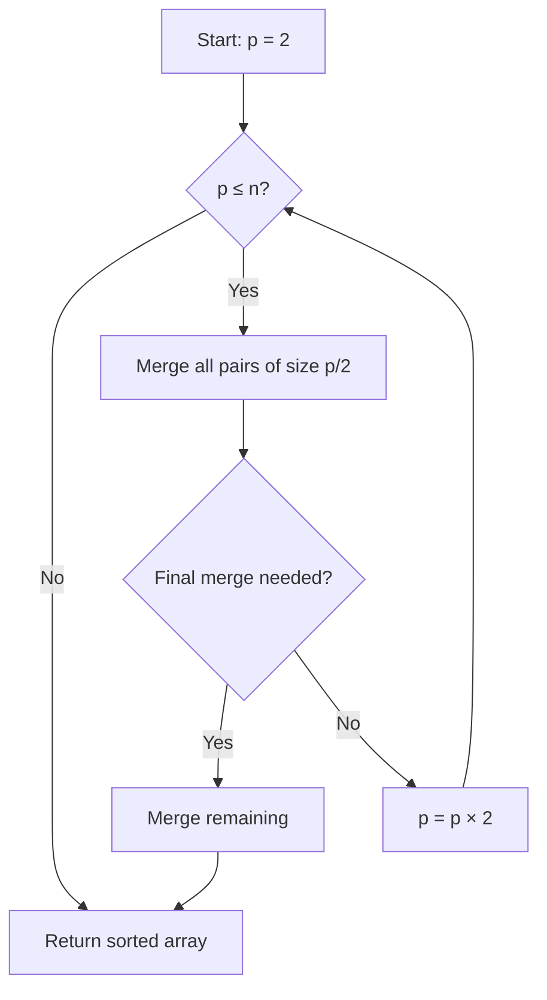

# Iterative Merge Sort

## Overview

| Property | Value |
|----------|-------|
| **Category** | Sorting Algorithm |
| **Type** | Comparison-Based (Divide and Conquer) |
| **Data Structure** | Array |
| **Space Complexity** | O(n) |
| **Stable** | Yes |
| **In-Place** | No |
| **Paradigm** | Bottom-Up / Iterative |

---

## Mathematical Foundation

### Definition

**Iterative Merge Sort** (also called **Bottom-Up Merge Sort**) is a non-recursive implementation of merge sort. Instead of recursively dividing the array, it iteratively merges subarrays of increasing sizes.

### Algorithm Principle

**Recursive Merge Sort (Top-Down):**
1. Divide array in half
2. Recursively sort each half
3. Merge sorted halves

**Iterative Merge Sort (Bottom-Up):**
1. Start with subarrays of size 1 (trivially sorted)
2. Merge adjacent pairs into subarrays of size 2
3. Merge pairs into subarrays of size 4
4. Continue doubling until entire array is sorted

### Mathematical Description

**Merge Window Sizes:**
$$p = 1, 2, 4, 8, ..., 2^k \text{ where } 2^k \geq n$$

**Number of Passes:**
$$\text{passes} = \lceil \log_2 n \rceil$$

**Merges per Pass:**
At window size $p$: $\lfloor n / (2p) \rfloor$ full merges + possibly 1 partial

### Merge Operation

For subarrays $A[low..mid]$ and $A[mid+1..high]$:
$$\text{merge}(A, low, mid, high) \rightarrow A[low..high] \text{ sorted}$$

---

## Pseudocode

```
ITERATIVE-MERGE-SORT(A):
    Input: Array A of n elements
    Output: Sorted array A
    
    n ← length(A)
    if n ≤ 1:
        return A
    
    // Start with subarrays of size 1, double each pass
    p ← 2  // Current window size (merging pairs)
    
    while p ≤ n:
        // Merge all pairs of subarrays of size p/2
        for i ← 0 to n-1 step p:
            low ← i
            high ← min(i + p - 1, n - 1)
            mid ← (low + high + 1) / 2
            
            MERGE(A, low, mid, high)
        
        // Handle final merge if needed
        if p * 2 ≥ n:
            MERGE(A, 0, i, n - 1)
            break
        
        p ← p * 2
    
    return A


MERGE(A, low, mid, high):
    // Merge A[low..mid-1] and A[mid..high]
    result ← []
    left ← A[low..mid-1]
    right ← A[mid..high]
    
    while left not empty AND right not empty:
        if left[0] ≤ right[0]:
            result.append(left.pop(0))
        else:
            result.append(right.pop(0))
    
    result ← result + left + right
    A[low..high] ← result
```

---

## Complexity Analysis

### Time Complexity

| Case | Complexity | Notes |
|------|------------|-------|
| **Best** | $O(n \log n)$ | Always same |
| **Average** | $O(n \log n)$ | Always same |
| **Worst** | $O(n \log n)$ | Guaranteed |

**Analysis:**
- $\log n$ passes (window size doubles each time)
- Each pass processes all $n$ elements
- Total: $O(n \log n)$

### Space Complexity

| Component | Space |
|-----------|-------|
| Temporary arrays | $O(n)$ |
| Loop variables | $O(1)$ |
| **Total** | $O(n)$ |

### Comparison with Recursive Version

| Aspect | Iterative | Recursive |
|--------|-----------|-----------|
| Time | O(n log n) | O(n log n) |
| Space | O(n) | O(n + log n) |
| Stack | No stack | O(log n) stack |
| Cache | Better locality | Worse locality |

---

## Visual Representation

### Bottom-Up Merge Process

```
Input: [5, 2, 8, 1, 9, 3, 7, 4]

Pass 1 (p=2): Merge pairs of size 1
[5,2] → [2,5]  [8,1] → [1,8]  [9,3] → [3,9]  [7,4] → [4,7]
Result: [2, 5, 1, 8, 3, 9, 4, 7]

Pass 2 (p=4): Merge pairs of size 2
[2,5,1,8] → [1,2,5,8]  [3,9,4,7] → [3,4,7,9]
Result: [1, 2, 5, 8, 3, 4, 7, 9]

Pass 3 (p=8): Merge pairs of size 4
[1,2,5,8,3,4,7,9] → [1,2,3,4,5,7,8,9]
Result: [1, 2, 3, 4, 5, 7, 8, 9]
```

### Algorithm Flow



### Comparison: Top-Down vs Bottom-Up

```
Top-Down (Recursive):        Bottom-Up (Iterative):
                            
    [5,2,8,1,9,3,7,4]           [5,2,8,1,9,3,7,4]
         /      \                     ↓ p=2
   [5,2,8,1]  [9,3,7,4]         [2,5,1,8,3,9,4,7]
    /    \      /    \               ↓ p=4
 [5,2] [8,1] [9,3] [7,4]        [1,2,5,8,3,4,7,9]
   ↓     ↓     ↓     ↓               ↓ p=8
 [2,5] [1,8] [3,9] [4,7]        [1,2,3,4,5,7,8,9]
    \   /      \   /
 [1,2,5,8]  [3,4,7,9]
      \        /
 [1,2,3,4,5,7,8,9]
```

---

## Implementation Details

### Python Implementation

```python
from __future__ import annotations


def merge(input_list: list, low: int, mid: int, high: int) -> list:
    """
    Merge two sorted subarrays into one.
    """
    result = []
    left, right = input_list[low:mid], input_list[mid:high + 1]
    
    while left and right:
        result.append((left if left[0] <= right[0] else right).pop(0))
    
    input_list[low:high + 1] = result + left + right
    return input_list


def iter_merge_sort(input_list: list) -> list:
    """
    Return a sorted copy of the input list using iterative merge sort.

    >>> iter_merge_sort([5, 9, 8, 7, 1, 2, 7])
    [1, 2, 5, 7, 7, 8, 9]
    >>> iter_merge_sort([1])
    [1]
    >>> iter_merge_sort([2, 1])
    [1, 2]
    >>> iter_merge_sort([4, 3, 2, 1])
    [1, 2, 3, 4]
    >>> iter_merge_sort([])
    []
    >>> iter_merge_sort([-2, -9, -1, -4])
    [-9, -4, -2, -1]
    """
    if len(input_list) <= 1:
        return input_list
    
    input_list = list(input_list)

    # Iteration for two-way merging
    p = 2
    while p <= len(input_list):
        for i in range(0, len(input_list), p):
            low = i
            high = i + p - 1
            mid = (low + high + 1) // 2
            input_list = merge(input_list, low, mid, high)
        
        # Final merge of last two parts
        if p * 2 >= len(input_list):
            mid = i
            input_list = merge(input_list, 0, mid, len(input_list) - 1)
            break
        p *= 2

    return input_list
```

### Optimized Implementation

```python
def iterative_merge_sort_optimized(arr: list) -> list:
    """
    Optimized bottom-up merge sort.
    
    >>> iterative_merge_sort_optimized([5, 3, 8, 1, 9, 2])
    [1, 2, 3, 5, 8, 9]
    """
    n = len(arr)
    if n <= 1:
        return arr
    
    # Work array for merging
    work = arr.copy()
    
    width = 1
    while width < n:
        for i in range(0, n, 2 * width):
            left = i
            mid = min(i + width, n)
            right = min(i + 2 * width, n)
            
            _merge_optimized(arr, work, left, mid, right)
        
        # Swap arrays
        arr, work = work, arr
        width *= 2
    
    return arr


def _merge_optimized(arr, work, left, mid, right):
    """Merge arr[left:mid] and arr[mid:right] into work."""
    i, j, k = left, mid, left
    
    while i < mid and j < right:
        if arr[i] <= arr[j]:
            work[k] = arr[i]
            i += 1
        else:
            work[k] = arr[j]
            j += 1
        k += 1
    
    while i < mid:
        work[k] = arr[i]
        i += 1
        k += 1
    
    while j < right:
        work[k] = arr[j]
        j += 1
        k += 1
```

### Natural Merge Sort Variant

```python
def natural_merge_sort(arr: list) -> list:
    """
    Natural merge sort: exploits existing sorted runs.
    
    >>> natural_merge_sort([1, 2, 5, 3, 4, 8, 6, 7])
    [1, 2, 3, 4, 5, 6, 7, 8]
    """
    n = len(arr)
    if n <= 1:
        return arr
    
    result = arr.copy()
    
    while True:
        # Find natural runs
        runs = []
        i = 0
        while i < n:
            start = i
            while i < n - 1 and result[i] <= result[i + 1]:
                i += 1
            runs.append((start, i))
            i += 1
        
        # If only one run, array is sorted
        if len(runs) == 1:
            break
        
        # Merge adjacent runs
        new_result = []
        i = 0
        while i < len(runs):
            if i + 1 < len(runs):
                # Merge two runs
                start1, end1 = runs[i]
                start2, end2 = runs[i + 1]
                merged = _merge_runs(result, start1, end1, start2, end2)
                new_result.extend(merged)
                i += 2
            else:
                # Odd run, keep as is
                start, end = runs[i]
                new_result.extend(result[start:end + 1])
                i += 1
        
        result = new_result
    
    return result


def _merge_runs(arr, s1, e1, s2, e2):
    """Merge two runs."""
    result = []
    i, j = s1, s2
    while i <= e1 and j <= e2:
        if arr[i] <= arr[j]:
            result.append(arr[i])
            i += 1
        else:
            result.append(arr[j])
            j += 1
    result.extend(arr[i:e1 + 1])
    result.extend(arr[j:e2 + 1])
    return result
```

---

## Real-World Applications

### 1. **External Sorting**

**Use Case**: Sorting data too large for memory.

```python
def external_merge_sort(file_path: str, chunk_size: int = 1000):
    """
    External merge sort for large files.
    Uses iterative merge pattern.
    
    Conceptual implementation (simplified).
    """
    import tempfile
    import heapq
    
    # Phase 1: Create sorted chunks
    chunks = []
    with open(file_path, 'r') as f:
        while True:
            lines = []
            for _ in range(chunk_size):
                line = f.readline()
                if not line:
                    break
                lines.append(int(line.strip()))
            
            if not lines:
                break
            
            # Sort chunk using iterative merge sort
            sorted_chunk = iter_merge_sort(lines)
            
            # Write to temp file
            chunk_file = tempfile.NamedTemporaryFile(mode='w', delete=False)
            for num in sorted_chunk:
                chunk_file.write(f"{num}\n")
            chunk_file.close()
            chunks.append(chunk_file.name)
    
    # Phase 2: Merge chunks (k-way merge)
    # Uses heap for efficiency
    return chunks  # Would continue with merge phase
```

### 2. **Linked List Sorting**

**Use Case**: Bottom-up merge sort is ideal for linked lists.

```python
class ListNode:
    def __init__(self, val=0, next=None):
        self.val = val
        self.next = next


def sort_linked_list(head: ListNode) -> ListNode:
    """
    Sort linked list using bottom-up merge sort.
    O(n log n) time, O(1) space.
    """
    if not head or not head.next:
        return head
    
    # Get length
    length = 0
    node = head
    while node:
        length += 1
        node = node.next
    
    dummy = ListNode(0, head)
    
    # Bottom-up merge
    size = 1
    while size < length:
        prev = dummy
        curr = dummy.next
        
        while curr:
            # Get left half
            left = curr
            right = split(left, size)
            curr = split(right, size)
            
            # Merge and attach
            prev.next, prev = merge_lists(left, right)
        
        size *= 2
    
    return dummy.next


def split(head, size):
    """Split list at size, return head of remainder."""
    for _ in range(size - 1):
        if not head:
            break
        head = head.next
    
    if not head:
        return None
    
    remainder = head.next
    head.next = None
    return remainder


def merge_lists(l1, l2):
    """Merge two sorted lists, return (head, tail)."""
    dummy = ListNode()
    tail = dummy
    
    while l1 and l2:
        if l1.val <= l2.val:
            tail.next = l1
            l1 = l1.next
        else:
            tail.next = l2
            l2 = l2.next
        tail = tail.next
    
    tail.next = l1 or l2
    while tail.next:
        tail = tail.next
    
    return dummy.next, tail
```

### 3. **Parallel Merge Sort**

**Use Case**: Iterative structure maps well to parallel execution.

```python
from concurrent.futures import ThreadPoolExecutor


def parallel_merge_sort(arr: list, num_threads: int = 4) -> list:
    """
    Parallel bottom-up merge sort.
    
    >>> parallel_merge_sort([5, 3, 8, 1, 9, 2])
    [1, 2, 3, 5, 8, 9]
    """
    n = len(arr)
    if n <= 1:
        return arr
    
    result = arr.copy()
    
    with ThreadPoolExecutor(max_workers=num_threads) as executor:
        width = 1
        while width < n:
            # Collect merge tasks
            futures = []
            for i in range(0, n, 2 * width):
                left = i
                mid = min(i + width, n)
                right = min(i + 2 * width, n)
                
                # Submit merge task
                future = executor.submit(
                    _merge_range, result.copy(), left, mid, right
                )
                futures.append((i, right, future))
            
            # Collect results
            for i, right, future in futures:
                merged = future.result()
                result[i:right] = merged[i:right]
            
            width *= 2
    
    return result


def _merge_range(arr, left, mid, right):
    """Merge and return modified array."""
    merged = []
    i, j = left, mid
    
    while i < mid and j < right:
        if arr[i] <= arr[j]:
            merged.append(arr[i])
            i += 1
        else:
            merged.append(arr[j])
            j += 1
    
    merged.extend(arr[i:mid])
    merged.extend(arr[j:right])
    
    arr[left:right] = merged
    return arr
```

---

## Advantages and Disadvantages

### ✅ Advantages

1. **No recursion overhead** - no stack usage
2. **Better cache performance** - predictable memory access
3. **O(n log n) guaranteed**
4. **Stable** - maintains relative order
5. **Good for linked lists** - O(1) space possible

### ❌ Disadvantages

1. **O(n) extra space** - for merge buffer
2. **Not in-place** (unlike quicksort)
3. **Slightly slower** than recursive for arrays
4. **More complex** implementation

---

## References

1. [Wikipedia: Merge Sort](https://en.wikipedia.org/wiki/Merge_sort)
2. Sedgewick, R. "Algorithms in C++"
3. CLRS "Introduction to Algorithms"

---

## See Also

- [Merge Sort](merge_sort.md) - Recursive version
- [Tim Sort](tim_sort.md) - Hybrid using merge sort
- [Quick Sort](quick_sort.md) - Alternative O(n log n) sort

