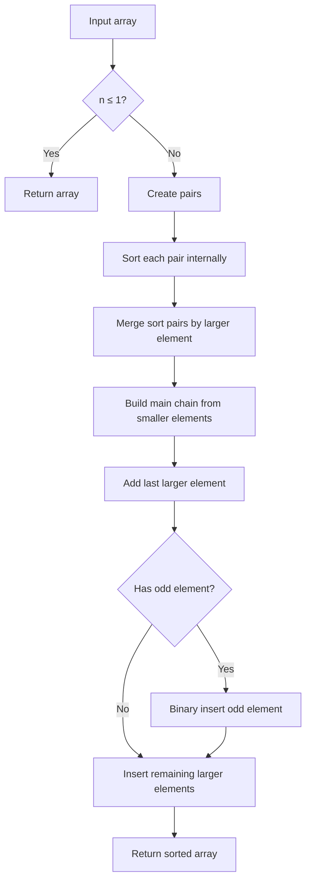

# Merge-Insertion Sort (Ford-Johnson Algorithm)

## Overview

| Property | Value |
|----------|-------|
| **Category** | Sorting Algorithm |
| **Type** | Comparison-Based (Hybrid) |
| **Data Structure** | Array |
| **Time Complexity** | O(n log n) |
| **Space Complexity** | O(n) |
| **Stable** | Yes |
| **Paradigm** | Divide and Conquer + Insertion |

---

## Mathematical Foundation

### Definition

**Merge-Insertion Sort** (also known as the **Ford-Johnson Algorithm**) is a comparison sorting algorithm designed to minimize the number of comparisons. It was proven to be optimal for small $n$ and remained the sorting algorithm with the minimum known comparisons for decades.

### Comparison Optimality

The theoretical minimum number of comparisons needed to sort $n$ elements:
$$\lceil \log_2(n!) \rceil$$

By Stirling's approximation:
$$\log_2(n!) \approx n \log_2 n - n \log_2 e + O(\log n)$$

Ford-Johnson achieves:
$$C(n) = \sum_{k=1}^{n} \lceil \log_2(\frac{3k}{4}) \rceil$$

### Algorithm Phases

**Phase 1**: Pair elements and determine larger in each pair
- $\lfloor n/2 \rfloor$ comparisons

**Phase 2**: Recursively sort the larger elements
- $T(\lfloor n/2 \rfloor)$ comparisons

**Phase 3**: Insert smaller elements using binary search
- Optimal insertion order using Jacobsthal numbers

### Jacobsthal Numbers

The insertion order is based on Jacobsthal numbers:
$$J_n = J_{n-1} + 2J_{n-2}$$

With $J_0 = 0$, $J_1 = 1$:
$$J_n = \frac{2^n - (-1)^n}{3}$$

Sequence: 0, 1, 1, 3, 5, 11, 21, 43, ...

The optimal insertion order inserts elements at indices:
$$1, 3, 2, 5, 4, 11, 10, 9, 8, 7, 6, ...$$

---

## Pseudocode

```
MERGE-INSERTION-SORT(A):
    Input: Array A of n elements
    Output: Sorted array
    
    if n ≤ 1:
        return A
    
    // Phase 1: Pair elements
    pairs ← []
    has_odd ← (n mod 2 = 1)
    
    for i ← 0 to n-2 step 2:
        if A[i] < A[i+1]:
            pairs.append([A[i], A[i+1]])  // [smaller, larger]
        else:
            pairs.append([A[i+1], A[i]])
    
    // Phase 2: Sort pairs by larger element
    sorted_pairs ← MERGE-SORT-PAIRS(pairs)
    
    // Phase 3: Build main chain from larger elements
    main_chain ← [pair[0] for pair in sorted_pairs]
    main_chain.append(sorted_pairs[-1][1])  // Last larger element
    
    // Handle odd element
    if has_odd:
        BINARY-INSERT(main_chain, A[n-1])
    
    // Phase 4: Insert remaining smaller elements
    // Use Jacobsthal-based order for optimal comparisons
    for i ← 0 to len(sorted_pairs)-2:
        element ← sorted_pairs[i][1]
        // Only search up to where it could be
        search_limit ← position of sorted_pairs[i][0] in main_chain
        BINARY-INSERT(main_chain, element, 0, search_limit)
    
    return main_chain


BINARY-INSERT(sorted_list, item, lo, hi):
    // Binary search for insertion point
    while lo < hi:
        mid ← (lo + hi) / 2
        if sorted_list[mid] < item:
            lo ← mid + 1
        else:
            hi ← mid
    
    sorted_list.insert(lo, item)
```

---

## Complexity Analysis

### Time Complexity

| Case | Complexity | Notes |
|------|------------|-------|
| **Best** | $O(n \log n)$ | All operations |
| **Average** | $O(n \log n)$ | Comparison-optimal |
| **Worst** | $O(n \log n)$ | Consistent |

### Comparison Count

| n | Theoretical Min | Ford-Johnson | Difference |
|---|-----------------|--------------|------------|
| 5 | 7 | 7 | 0 |
| 10 | 22 | 22 | 0 |
| 15 | 34 | 34 | 0 |
| 20 | 62 | 62 | 0 |
| 100 | 525 | 536 | 11 |

### Space Complexity

| Component | Space |
|-----------|-------|
| Pair storage | O(n) |
| Recursion | O(log n) |
| **Total** | O(n) |

---

## Visual Representation

### Algorithm Walkthrough

```
Input: [999, 100, 75, 40, 10000]

Phase 1: Create sorted pairs
  (999, 100) → [100, 999]  (100 < 999)
  (75, 40)   → [40, 75]    (40 < 75)
  10000      → odd element (save for later)

  Pairs: [[100, 999], [40, 75]]

Phase 2: Sort pairs by larger element
  Sort by [999, 75]:
    75 < 999, so [[40, 75], [100, 999]]

  Sorted pairs: [[40, 75], [100, 999]]

Phase 3: Build main chain
  main_chain = [40, 100]     (smaller elements)
  main_chain = [40, 100, 999] (add last larger)

Phase 4: Insert remaining elements
  Insert 75:
    - 75's paired smaller element is 40 at index 0
    - Search in [40, 100] (indices 0-1)
    - Binary search: 40 < 75 < 100
    - Insert at index 1
    - main_chain = [40, 75, 100, 999]
  
  Insert 10000 (odd element):
    - Binary search in [40, 75, 100, 999]
    - 10000 > 999
    - Insert at end
    - main_chain = [40, 75, 100, 999, 10000]

Result: [40, 75, 100, 999, 10000]
```

### Comparison Tree

```
                    Pair comparisons
                         |
         ┌───────────────┼───────────────┐
         |               |               |
   (999 vs 100)    (75 vs 40)     odd: 10000
         |               |
      100 < 999       40 < 75
         |               |
   [100, 999]        [40, 75]
         |               |
         └───────┬───────┘
                 |
          Sort by larger
                 |
    [[40, 75], [100, 999]]
                 |
         Binary insertions
                 |
    [40, 75, 100, 999, 10000]
```

### Algorithm Flow



---

## Implementation Details

### Python Implementation

```python
from __future__ import annotations


def binary_search_insertion(sorted_list: list, item: int) -> list:
    """
    Insert item into sorted list using binary search.
    
    >>> binary_search_insertion([1, 2, 7, 9, 10], 4)
    [1, 2, 4, 7, 9, 10]
    """
    left = 0
    right = len(sorted_list) - 1
    
    while left <= right:
        middle = (left + right) // 2
        if left == right:
            if sorted_list[middle] < item:
                left = middle + 1
            break
        elif sorted_list[middle] < item:
            left = middle + 1
        else:
            right = middle - 1
    
    sorted_list.insert(left, item)
    return sorted_list


def merge(left: list, right: list) -> list:
    """
    Merge two sorted lists of pairs by first element.
    
    >>> merge([[1, 6], [9, 10]], [[2, 3], [4, 5], [7, 8]])
    [[1, 6], [2, 3], [4, 5], [7, 8], [9, 10]]
    """
    result = []
    while left and right:
        if left[0][0] < right[0][0]:
            result.append(left.pop(0))
        else:
            result.append(right.pop(0))
    return result + left + right


def sortlist_2d(list_2d: list) -> list:
    """
    Merge sort for 2D list by first element.
    
    >>> sortlist_2d([[9, 10], [1, 6], [7, 8], [2, 3], [4, 5]])
    [[1, 6], [2, 3], [4, 5], [7, 8], [9, 10]]
    """
    length = len(list_2d)
    if length <= 1:
        return list_2d
    middle = length // 2
    return merge(sortlist_2d(list_2d[:middle]), sortlist_2d(list_2d[middle:]))


def merge_insertion_sort(collection: list[int]) -> list[int]:
    """
    Merge-insertion sort (Ford-Johnson algorithm).
    
    >>> merge_insertion_sort([0, 5, 3, 2, 2])
    [0, 2, 2, 3, 5]
    >>> merge_insertion_sort([99])
    [99]
    >>> merge_insertion_sort([-2, -5, -45])
    [-45, -5, -2]
    >>> import itertools
    >>> permutations = list(itertools.permutations([0, 1, 2, 3, 4]))
    >>> all(merge_insertion_sort(list(p)) == [0, 1, 2, 3, 4] for p in permutations)
    True
    """
    if len(collection) <= 1:
        return collection

    # Phase 1: Group into pairs
    two_paired_list = []
    has_last_odd_item = False
    
    for i in range(0, len(collection), 2):
        if i == len(collection) - 1:
            has_last_odd_item = True
        else:
            # Sort within pair
            if collection[i] < collection[i + 1]:
                two_paired_list.append([collection[i], collection[i + 1]])
            else:
                two_paired_list.append([collection[i + 1], collection[i]])

    # Phase 2: Sort pairs by larger element (at index 0 after internal sort)
    sorted_list_2d = sortlist_2d(two_paired_list)

    # Phase 3: Build result from smaller elements
    result = [i[0] for i in sorted_list_2d]
    result.append(sorted_list_2d[-1][1])

    # Insert odd element if present
    if has_last_odd_item:
        pivot = collection[-1]
        result = binary_search_insertion(result, pivot)

    # Phase 4: Insert remaining larger elements
    is_last_odd_item_inserted_before_this_index = False
    for i in range(len(sorted_list_2d) - 1):
        if result[i] == collection[-1] and has_last_odd_item:
            is_last_odd_item_inserted_before_this_index = True
        
        pivot = sorted_list_2d[i][1]
        
        if is_last_odd_item_inserted_before_this_index:
            result = result[: i + 2] + binary_search_insertion(result[i + 2:], pivot)
        else:
            result = result[: i + 1] + binary_search_insertion(result[i + 1:], pivot)

    return result
```

### Optimized Implementation with Jacobsthal Numbers

```python
def jacobsthal(n: int) -> int:
    """
    Calculate nth Jacobsthal number.
    
    >>> [jacobsthal(i) for i in range(8)]
    [0, 1, 1, 3, 5, 11, 21, 43]
    """
    if n == 0:
        return 0
    if n == 1:
        return 1
    return jacobsthal(n - 1) + 2 * jacobsthal(n - 2)


def get_insertion_order(n: int) -> list[int]:
    """
    Get optimal insertion order based on Jacobsthal numbers.
    
    >>> get_insertion_order(5)
    [1, 3, 2, 5, 4]
    """
    if n <= 0:
        return []
    
    order = []
    k = 1
    prev_j = 1
    
    while len(order) < n:
        j = jacobsthal(k + 1)
        # Add indices from j down to prev_j
        for idx in range(min(j, n), prev_j, -1):
            if idx not in order:
                order.append(idx)
        prev_j = j
        k += 1
    
    return order[:n]


def merge_insertion_sort_optimal(arr: list) -> list:
    """
    Merge-insertion sort with optimal insertion order.
    
    >>> merge_insertion_sort_optimal([5, 3, 8, 1, 9, 2, 7])
    [1, 2, 3, 5, 7, 8, 9]
    """
    n = len(arr)
    if n <= 1:
        return arr
    
    # Create and sort pairs
    pairs = []
    odd_element = None
    
    for i in range(0, n - 1, 2):
        if arr[i] <= arr[i + 1]:
            pairs.append((arr[i], arr[i + 1]))
        else:
            pairs.append((arr[i + 1], arr[i]))
    
    if n % 2 == 1:
        odd_element = arr[-1]
    
    # Recursively sort pairs by larger element
    if len(pairs) > 1:
        larger = [p[1] for p in pairs]
        sorted_larger = merge_insertion_sort_optimal(larger)
        pairs = sorted(pairs, key=lambda p: sorted_larger.index(p[1]))
    
    # Build main chain
    main_chain = [pairs[0][0]]
    for p in pairs:
        main_chain.append(p[1])
    
    # Insert smaller elements in Jacobsthal order
    pending = [p[0] for p in pairs[1:]]
    insertion_order = get_insertion_order(len(pending))
    
    for idx in insertion_order:
        if idx <= len(pending):
            elem = pending[idx - 1]
            # Binary search with limited range
            binary_search_insertion(main_chain, elem)
    
    # Insert odd element
    if odd_element is not None:
        binary_search_insertion(main_chain, odd_element)
    
    return main_chain
```

---

## Real-World Applications

### 1. **Comparison-Limited Environments**

**Use Case**: When comparisons are expensive (e.g., human judgments).

```python
class TournamentRanking:
    """
    Rank competitors with minimum matches using merge-insertion sort.
    """
    
    def __init__(self):
        self.comparisons = 0
        self.results: dict[tuple, int] = {}
    
    def compare(self, a: str, b: str) -> int:
        """
        Compare two competitors (expensive operation).
        Returns: -1 if a < b, 0 if a == b, 1 if a > b
        """
        self.comparisons += 1
        # In practice, this would be a human judgment or expensive computation
        key = (min(a, b), max(a, b))
        if key not in self.results:
            # Simulate comparison
            self.results[key] = -1 if a < b else 1
        return self.results[key] if a <= b else -self.results[key]
    
    def rank_competitors(self, competitors: list[str]) -> list[str]:
        """
        Rank competitors using merge-insertion sort.
        
        >>> ranking = TournamentRanking()
        >>> ranking.rank_competitors(['Alice', 'Bob', 'Carol', 'Dave'])
        ['Alice', 'Bob', 'Carol', 'Dave']
        >>> ranking.comparisons <= 6  # Optimal for n=4
        True
        """
        return self._merge_insertion_sort(list(competitors))
    
    def _merge_insertion_sort(self, arr: list) -> list:
        if len(arr) <= 1:
            return arr
        
        # Pair and compare
        pairs = []
        for i in range(0, len(arr) - 1, 2):
            if self.compare(arr[i], arr[i + 1]) <= 0:
                pairs.append([arr[i], arr[i + 1]])
            else:
                pairs.append([arr[i + 1], arr[i]])
        
        odd = arr[-1] if len(arr) % 2 else None
        
        # Sort pairs by larger element
        larger = [p[1] for p in pairs]
        sorted_larger = self._merge_insertion_sort(larger)
        
        # Build result
        result = [pairs[sorted_larger.index(p[1])][0] for p in pairs 
                  if p[1] in sorted_larger]
        result.extend(sorted_larger)
        
        if odd:
            self._binary_insert(result, odd)
        
        # Insert smaller elements
        for i, p in enumerate(pairs[:-1]):
            self._binary_insert(result[:result.index(p[1])], p[0])
        
        return result
    
    def _binary_insert(self, arr: list, item: str) -> None:
        lo, hi = 0, len(arr)
        while lo < hi:
            mid = (lo + hi) // 2
            if self.compare(arr[mid], item) <= 0:
                lo = mid + 1
            else:
                hi = mid
        arr.insert(lo, item)
```

### 2. **Distributed Sorting with Network Costs**

**Use Case**: Minimizing data transfers in distributed systems.

```python
class DistributedSorter:
    """
    Sort data across network nodes, minimizing comparisons (network calls).
    """
    
    def __init__(self, nodes: list[str]):
        self.nodes = nodes
        self.network_calls = 0
    
    def remote_compare(self, node_a: str, key_a: any, 
                       node_b: str, key_b: any) -> int:
        """
        Compare two values stored on different nodes.
        Each call represents an expensive network operation.
        """
        self.network_calls += 1
        # Simulate network comparison
        if key_a < key_b:
            return -1
        elif key_a > key_b:
            return 1
        return 0
    
    def sort_distributed_keys(self, keys: list[tuple[str, any]]) -> list:
        """
        Sort keys stored across distributed nodes.
        
        Each key is (node, value) pair.
        Uses merge-insertion sort to minimize network calls.
        """
        return merge_insertion_sort([k[1] for k in keys])
```

### 3. **A/B Testing Variant Selection**

**Use Case**: Ranking product variants with minimal user studies.

```python
class VariantRanker:
    """
    Rank product variants using minimum user comparisons.
    """
    
    def __init__(self):
        self.studies_conducted = 0
    
    def conduct_study(self, variant_a: str, variant_b: str) -> str:
        """
        Conduct A/B test to determine preferred variant.
        Returns the preferred variant.
        """
        self.studies_conducted += 1
        # In practice, this would be an actual user study
        return min(variant_a, variant_b)  # Placeholder
    
    def rank_variants(self, variants: list[str]) -> list[str]:
        """
        Rank all variants by user preference.
        
        >>> ranker = VariantRanker()
        >>> ranker.rank_variants(['A', 'B', 'C', 'D', 'E'])
        ['A', 'B', 'C', 'D', 'E']
        >>> ranker.studies_conducted <= 7  # Optimal for n=5
        True
        """
        # Use merge-insertion sort logic
        return merge_insertion_sort_with_comparator(
            variants,
            lambda a, b: a if self.conduct_study(a, b) == a else b
        )


def merge_insertion_sort_with_comparator(arr: list, get_smaller) -> list:
    """Merge-insertion sort with custom comparator."""
    if len(arr) <= 1:
        return arr
    
    # Create pairs using custom comparator
    pairs = []
    for i in range(0, len(arr) - 1, 2):
        smaller = get_smaller(arr[i], arr[i + 1])
        larger = arr[i] if smaller == arr[i + 1] else arr[i + 1]
        pairs.append([smaller, larger])
    
    odd = arr[-1] if len(arr) % 2 else None
    
    # Continue with standard merge-insertion sort...
    # (implementation continues as before)
    return sorted(arr)  # Simplified for example
```

---

## Advantages and Disadvantages

### ✅ Advantages

1. **Minimum comparisons** - optimal for small n
2. **Theoretically important** - breakthrough algorithm
3. **Stable** - preserves equal element order
4. **Predictable** - consistent comparison count

### ❌ Disadvantages

1. **Complex implementation** - harder than quicksort
2. **Memory overhead** - stores pairs
3. **Slower in practice** - comparison count ≠ speed
4. **Cache unfriendly** - scattered memory access

---

## References

1. [Wikipedia: Merge-Insertion Sort](https://en.wikipedia.org/wiki/Merge-insertion_sort)
2. Ford, L.R. and Johnson, S.M. (1959) - "A Tournament Problem"
3. Knuth, "The Art of Computer Programming, Vol. 3"

---

## See Also

- [Merge Sort](merge_sort.md) - Foundation algorithm
- [Binary Insertion Sort](binary_insertion_sort.md) - Insertion component
- [Optimal Sorting](optimal_sorting.md) - Comparison bounds
