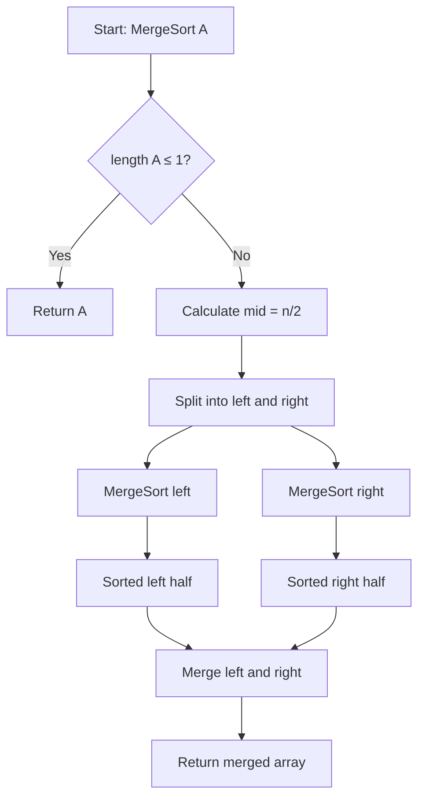
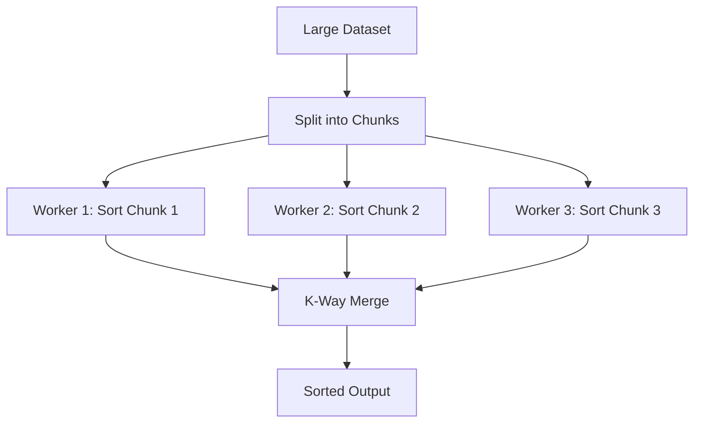

# Merge Sort

## Overview

| Property | Value |
|----------|-------|
| **Category** | Sorting Algorithm (Comparison-Based, Divide and Conquer) |
| **Time Complexity (Best)** | O(n log n) |
| **Time Complexity (Average)** | O(n log n) |
| **Time Complexity (Worst)** | O(n log n) |
| **Space Complexity** | O(n) |
| **Stability** | Yes |
| **In-place** | No |
| **Adaptive** | No |
| **Source File** | [`sorts/merge_sort.py`](../../../sorts/merge_sort.py), [`sorts/iterative_merge_sort.py`](../../../sorts/iterative_merge_sort.py) |

---

## 1. Mathematical Foundation

### 1.1 Problem Definition

**Sorting Problem:**

$$
\text{Given: } A = \{a_1, a_2, \ldots, a_n\}
$$

$$
\text{Find: Permutation } \pi \text{ such that } a_{\pi(1)} \leq a_{\pi(2)} \leq \ldots \leq a_{\pi(n)}
$$

### 1.2 Core Mathematical Concepts

**Divide and Conquer Recurrence:**

Merge Sort follows the classic divide-and-conquer paradigm:

$$
T(n) = \underbrace{2T(n/2)}_{\text{two subproblems}} + \underbrace{\Theta(n)}_{\text{merge step}}
$$

**Merge Operation Invariant:**

Given two sorted sequences $L = (l_1, l_2, \ldots, l_m)$ and $R = (r_1, r_2, \ldots, r_k)$:

$$
\text{Merge}(L, R) = S \text{ where } S \text{ is sorted and } |S| = m + k
$$

The merge operation maintains:
$$
\forall i < j: S[i] \leq S[j]
$$

### 1.3 Key Formulas

**Recurrence Relation:**

$$
T(n) = \begin{cases}
\Theta(1) & \text{if } n = 1 \\
2T(n/2) + \Theta(n) & \text{if } n > 1
\end{cases}
$$

**Solution via Master Theorem:**

For $T(n) = aT(n/b) + f(n)$ where $a = 2$, $b = 2$, $f(n) = \Theta(n)$:

$$
n^{\log_b a} = n^{\log_2 2} = n^1 = n
$$

Since $f(n) = \Theta(n^{\log_b a})$, we're in **Case 2**:

$$
T(n) = \Theta(n^{\log_b a} \log n) = \Theta(n \log n)
$$

**Number of Comparisons:**

$$
C(n) = n \lceil \log_2 n \rceil - 2^{\lceil \log_2 n \rceil} + 1 \approx n \log_2 n - n + 1
$$

**Minimum comparisons (merge of two lists):**

$$
C_{\min}(m, k) = \min(m, k)
$$

**Maximum comparisons (merge of two lists):**

$$
C_{\max}(m, k) = m + k - 1
$$

### 1.4 Proof of Correctness

**Theorem:** Merge Sort correctly sorts any array of comparable elements.

**Proof by Strong Induction on array size n:**

**Base Case (n ≤ 1):**
An array of 0 or 1 elements is trivially sorted. ✓

**Inductive Hypothesis:**
Assume Merge Sort correctly sorts all arrays of size < n.

**Inductive Step (size n > 1):**
1. The array is split into two halves of sizes $\lfloor n/2 \rfloor$ and $\lceil n/2 \rceil$
2. By the inductive hypothesis, both halves are correctly sorted after recursive calls
3. The merge procedure combines two sorted arrays into one sorted array

**Merge Correctness:**

*Loop Invariant:* At each step, the output array contains the smallest elements from both input arrays in sorted order.

*Proof:*
- We always pick the smaller of the two front elements
- Since inputs are sorted, the smaller front element is the smallest remaining element
- Thus, elements are added in sorted order

Therefore, Merge Sort correctly sorts the array. ∎

---

## 2. Algorithm Description

### 2.1 Intuition

Merge Sort is based on a simple observation: it's easy to merge two already-sorted lists into one sorted list. The algorithm:
1. Splits the array in half repeatedly until we have single elements (trivially sorted)
2. Merges pairs of sorted subarrays back together
3. Continues merging until the entire array is sorted

Think of sorting a deck of cards: split it in half, sort each half, then merge by repeatedly taking the smaller top card.

### 2.2 Key Insights

1. **Guaranteed O(n log n):** Unlike Quick Sort, performance doesn't depend on input distribution
2. **Stable Sort:** Equal elements maintain their relative order
3. **Predictable Performance:** Same number of operations regardless of input
4. **Parallelizable:** The two recursive calls are independent

### 2.3 Step-by-Step Process

1. **Divide:** Split the array into two halves at the midpoint
2. **Conquer:** Recursively sort each half
3. **Combine:** Merge the two sorted halves into one sorted array

---

## 3. Pseudocode

### 3.1 Recursive Merge Sort

```
ALGORITHM MergeSort(A)
────────────────────────────────────────
INPUT:  A - array of n comparable elements
OUTPUT: Sorted array

1.  IF length(A) ≤ 1 THEN
2.      RETURN A
3.  END IF
4.  
5.  mid ← length(A) / 2
6.  left ← MergeSort(A[0..mid-1])
7.  right ← MergeSort(A[mid..n-1])
8.  
9.  RETURN Merge(left, right)
────────────────────────────────────────
```

### 3.2 Merge Procedure

```
ALGORITHM Merge(L, R)
────────────────────────────────────────
INPUT:  L - sorted left array
        R - sorted right array
OUTPUT: Merged sorted array

1.  result ← empty array
2.  i ← 0, j ← 0
3.  
4.  WHILE i < length(L) AND j < length(R) DO
5.      IF L[i] ≤ R[j] THEN
6.          APPEND L[i] to result
7.          i ← i + 1
8.      ELSE
9.          APPEND R[j] to result
10.         j ← j + 1
11.     END IF
12. END WHILE
13. 
14. // Append remaining elements
15. WHILE i < length(L) DO
16.     APPEND L[i] to result
17.     i ← i + 1
18. END WHILE
19. 
20. WHILE j < length(R) DO
21.     APPEND R[j] to result
22.     j ← j + 1
23. END WHILE
24. 
25. RETURN result
────────────────────────────────────────
```

### 3.3 Iterative (Bottom-Up) Merge Sort

```
ALGORITHM MergeSortIterative(A)
────────────────────────────────────────
INPUT:  A - array of n elements
OUTPUT: A sorted in-place

1.  n ← length(A)
2.  width ← 1
3.  
4.  WHILE width < n DO
5.      i ← 0
6.      WHILE i < n DO
7.          left ← i
8.          mid ← min(i + width, n)
9.          right ← min(i + 2*width, n)
10.         MergeInPlace(A, left, mid, right)
11.         i ← i + 2*width
12.     END WHILE
13.     width ← width * 2
14. END WHILE
15. 
16. RETURN A
────────────────────────────────────────
```

---

## 4. Complexity Analysis

### 4.1 Time Complexity

| Case | Complexity | Condition |
|------|------------|-----------|
| **Best** | O(n log n) | All cases |
| **Average** | O(n log n) | All cases |
| **Worst** | O(n log n) | All cases |

**Detailed Analysis:**

```
Recursion Tree Analysis:

Level 0:           n                    (1 problem of size n)
Level 1:      n/2     n/2               (2 problems of size n/2)
Level 2:    n/4 n/4  n/4 n/4            (4 problems of size n/4)
...
Level k:    1 1 1 ... 1 1 1             (n problems of size 1)

Total levels: log₂(n)
Work per level: O(n) for merging
Total work: O(n) × O(log n) = O(n log n)
```

**Substitution Method:**

Let $T(n) = 2T(n/2) + n$

Guess: $T(n) = cn \log n$

$$
T(n) = 2 \cdot c(n/2) \log(n/2) + n
$$
$$
= cn(\log n - 1) + n
$$
$$
= cn \log n - cn + n
$$
$$
\leq cn \log n \quad \text{for } c \geq 1
$$

### 4.2 Space Complexity

| Type | Complexity | Description |
|------|------------|-------------|
| **Auxiliary Space** | O(n) | Temporary arrays for merging |
| **Recursion Stack** | O(log n) | Maximum recursion depth |
| **Total Space** | O(n) | Dominated by merge arrays |

**Memory Usage Breakdown:**
- Each merge operation needs O(n) temporary space
- Can reuse same temporary array across merges
- Total auxiliary space: O(n) with careful implementation

### 4.3 Comparison with Other Sorts

| Metric | Merge Sort | Quick Sort | Heap Sort |
|--------|------------|------------|-----------|
| **Comparisons (avg)** | n log n | 1.39n log n | 2n log n |
| **Comparisons (worst)** | n log n | n²/2 | 2n log n |
| **Moves** | 2n log n | n log n | n log n |

---

## 5. Implementation Details

### 5.1 Key Data Structures

| Data Structure | Purpose | Operations Used |
|----------------|---------|-----------------|
| Array/List | Store elements | Slice O(n), Index O(1) |
| Temporary Array | Merge storage | Append O(1) amortized |

### 5.2 Important Variables

| Variable | Type | Purpose |
|----------|------|---------|
| `collection` | list | Array to be sorted |
| `mid_index` | int | Midpoint for splitting |
| `left` | list | Left half |
| `right` | list | Right half |
| `result` | list | Merged output |

### 5.3 Edge Cases

| Edge Case | Expected Behavior | Handling |
|-----------|-------------------|----------|
| Empty array | Return empty | Base case: `len <= 1` |
| Single element | Return as-is | Base case: `len <= 1` |
| Two elements | Compare and order | Works via recursion |
| All equal | Maintain order (stable) | ≤ comparison preserves stability |
| Already sorted | Still O(n log n) | Not adaptive |

---

## 6. Visual Representation

### 6.1 Algorithm Flow



### 6.2 Step-by-Step Example

**Input:** `[38, 27, 43, 3, 9, 82, 10]`

```
                    [38, 27, 43, 3, 9, 82, 10]
                              |
                   ┌──────────┴──────────┐
            [38, 27, 43, 3]         [9, 82, 10]
                   |                      |
             ┌─────┴─────┐          ┌─────┴─────┐
         [38, 27]    [43, 3]     [9, 82]     [10]
            |           |           |          |
          ┌─┴─┐       ┌─┴─┐       ┌─┴─┐        |
        [38] [27]   [43] [3]    [9] [82]     [10]
          |           |           |            |
          └─┬─┘       └─┬─┘       └─┬─┘        |
         [27,38]     [3,43]     [9,82]       [10]
            |           |           |          |
            └─────┬─────┘           └─────┬────┘
           [3,27,38,43]              [9,10,82]
                   |                      |
                   └──────────┬───────────┘
                    [3,9,10,27,38,43,82]
```

### 6.3 Merge Process Detail

**Merging `[3, 27, 38, 43]` and `[9, 10, 82]`:**

| Step | L pointer | R pointer | Compare | Result |
|------|-----------|-----------|---------|--------|
| 1 | 3 | 9 | 3 < 9 | [3] |
| 2 | 27 | 9 | 27 > 9 | [3, 9] |
| 3 | 27 | 10 | 27 > 10 | [3, 9, 10] |
| 4 | 27 | 82 | 27 < 82 | [3, 9, 10, 27] |
| 5 | 38 | 82 | 38 < 82 | [3, 9, 10, 27, 38] |
| 6 | 43 | 82 | 43 < 82 | [3, 9, 10, 27, 38, 43] |
| 7 | - | 82 | append | [3, 9, 10, 27, 38, 43, 82] |

---

## 7. Comparison with Related Algorithms

| Algorithm | Time (Avg) | Time (Worst) | Space | Stable | In-Place |
|-----------|------------|--------------|-------|--------|----------|
| **Merge Sort** | O(n log n) | O(n log n) | O(n) | ✅ | ❌ |
| Quick Sort | O(n log n) | O(n²) | O(log n) | ❌ | ✅ |
| Heap Sort | O(n log n) | O(n log n) | O(1) | ❌ | ✅ |
| Tim Sort | O(n log n) | O(n log n) | O(n) | ✅ | ❌ |

### When to Choose Merge Sort

- ✅ **Guaranteed O(n log n)** - When worst-case matters
- ✅ **Stability required** - Database operations, multi-key sorting
- ✅ **Linked lists** - No random access needed, O(1) merge
- ✅ **External sorting** - Sorting data larger than memory
- ✅ **Parallelization** - Independent subproblems
- ❌ **Memory constrained** - O(n) extra space required
- ❌ **Cache-sensitive** - Not as cache-friendly as Quick Sort
- ❌ **Small arrays** - Overhead not justified

---

## 8. Real-World Applications in Software Engineering

### 8.1 Industry Use Cases

| Industry | Application | Why Merge Sort |
|----------|-------------|----------------|
| **Databases** | External sorting, joins | Predictable I/O patterns |
| **Big Data** | Hadoop/MapReduce | Parallelizable, handles large files |
| **Version Control** | Git diff, merge | Stable merge of changes |
| **Finance** | Transaction ordering | Stability preserves insertion order |
| **Operating Systems** | Process scheduling logs | Stable sort by timestamp |

### 8.2 Practical Examples

#### Example 1: External Sorting (Large Files)

**Problem:** Sort a 100GB file that doesn't fit in memory

```python
def external_merge_sort(input_file: str, output_file: str, 
                        memory_limit: int = 100_000_000) -> None:
    """
    Sort a file larger than available memory.
    Uses merge sort's natural affinity for sequential access.
    
    1. Split into chunks that fit in memory
    2. Sort each chunk in memory (using any algorithm)
    3. Merge sorted chunks using k-way merge
    """
    import heapq
    import tempfile
    
    # Phase 1: Create sorted runs
    temp_files = []
    with open(input_file, 'r') as f:
        chunk = []
        chunk_size = 0
        for line in f:
            chunk.append(line.strip())
            chunk_size += len(line)
            if chunk_size >= memory_limit:
                chunk.sort()  # In-memory sort
                temp = tempfile.NamedTemporaryFile(mode='w', delete=False)
                temp.writelines(line + '\n' for line in chunk)
                temp_files.append(temp.name)
                chunk = []
                chunk_size = 0
        if chunk:
            chunk.sort()
            temp = tempfile.NamedTemporaryFile(mode='w', delete=False)
            temp.writelines(line + '\n' for line in chunk)
            temp_files.append(temp.name)
    
    # Phase 2: K-way merge
    files = [open(f, 'r') for f in temp_files]
    with open(output_file, 'w') as out:
        heap = []
        for i, f in enumerate(files):
            line = f.readline().strip()
            if line:
                heapq.heappush(heap, (line, i))
        
        while heap:
            smallest, file_idx = heapq.heappop(heap)
            out.write(smallest + '\n')
            next_line = files[file_idx].readline().strip()
            if next_line:
                heapq.heappush(heap, (next_line, file_idx))
    
    # Cleanup
    for f in files:
        f.close()
```

#### Example 2: Stable Multi-Key Sort

**Problem:** Sort employees by department, then by salary within department

```python
def stable_multi_key_sort(employees: list[dict]) -> list[dict]:
    """
    Sort by multiple keys using merge sort's stability.
    
    >>> emps = [
    ...     {'name': 'Alice', 'dept': 'IT', 'salary': 70000},
    ...     {'name': 'Bob', 'dept': 'HR', 'salary': 60000},
    ...     {'name': 'Carol', 'dept': 'IT', 'salary': 65000},
    ... ]
    >>> sorted_emps = stable_multi_key_sort(emps)
    >>> [(e['name'], e['dept']) for e in sorted_emps]
    [('Bob', 'HR'), ('Carol', 'IT'), ('Alice', 'IT')]
    """
    def merge_sort_by_key(arr, key_func):
        if len(arr) <= 1:
            return arr
        mid = len(arr) // 2
        left = merge_sort_by_key(arr[:mid], key_func)
        right = merge_sort_by_key(arr[mid:], key_func)
        
        result = []
        i = j = 0
        while i < len(left) and j < len(right):
            # Use <= for stability
            if key_func(left[i]) <= key_func(right[j]):
                result.append(left[i])
                i += 1
            else:
                result.append(right[j])
                j += 1
        result.extend(left[i:])
        result.extend(right[j:])
        return result
    
    # Sort by secondary key first (salary), then primary (dept)
    # Stability preserves salary order within same department
    sorted_by_salary = merge_sort_by_key(employees, lambda e: e['salary'])
    sorted_by_dept = merge_sort_by_key(sorted_by_salary, lambda e: e['dept'])
    
    return sorted_by_dept
```

### 8.3 Libraries and Frameworks

| Library/Framework | Language | Usage |
|-------------------|----------|-------|
| **Python Timsort** | Python | Hybrid using merge sort's merge |
| **Java Collections.sort()** | Java | Merge sort for objects (pre-Java 7) |
| **PostgreSQL** | SQL | External sorting for large result sets |
| **Hadoop/Spark** | Distributed | MapReduce sorting phase |
| **Git** | VCS | Three-way merge algorithm |

### 8.4 System Design Integration



**MapReduce Pattern:**
1. **Map Phase:** Distribute data, local sorting
2. **Shuffle Phase:** Group by key
3. **Reduce Phase:** Merge sorted runs

---

## 9. Optimizations and Variants

### 9.1 Common Optimizations

| Optimization | Benefit | Trade-off |
|--------------|---------|-----------|
| **Insertion sort cutoff** | Faster for small n | Slightly more code |
| **Skip sorted runs** | O(n) for sorted input | Detection overhead |
| **In-place merge** | O(1) extra space | Complex, slower |
| **Natural merge sort** | Exploits existing order | Extra bookkeeping |

### 9.2 Popular Variants

1. **Tim Sort** (Python, Java)
   - Finds natural runs in data
   - Uses insertion sort for small runs
   - Sophisticated merge strategy
   - O(n) best case on sorted data

2. **Natural Merge Sort**
   - Identifies already-sorted sequences
   - Fewer merges needed
   - Better for partially sorted data

3. **In-Place Merge Sort**
   - Uses O(1) extra space
   - More complex merge procedure
   - Higher constant factor

4. **Parallel Merge Sort**
   - Fork-join parallelism
   - Near-linear speedup
   - Used in modern frameworks

---

## 10. References

### Academic Sources
- von Neumann, J. (1945). "First Draft of a Report on the EDVAC" - First merge sort
- Knuth, D. E. (1998). *The Art of Computer Programming, Vol. 3*
- Peters, T. (2002). "Timsort" - Adaptive merge sort variant

### Online Resources
- [Wikipedia: Merge Sort](https://en.wikipedia.org/wiki/Merge_sort)
- [VisuAlgo: Sorting](https://visualgo.net/en/sorting)
- [Python Timsort Description](https://bugs.python.org/file4451/timsort.txt)

### Books
- Cormen, T. H. et al. *Introduction to Algorithms*, Chapter 2.3
- Sedgewick, R. *Algorithms*, Chapter 2.2

---

*Last Updated: December 2024*
*Implementation: [sorts/merge_sort.py](../../../sorts/merge_sort.py)*
