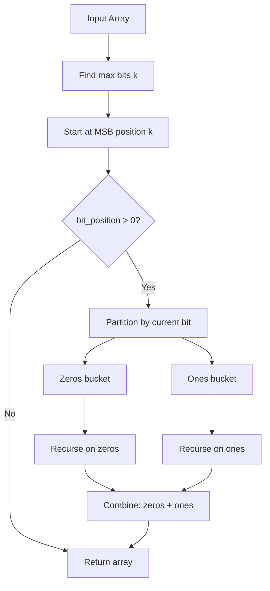

# MSD Radix Sort

## Overview

| Property | Value |
|----------|-------|
| **Category** | Sorting Algorithm |
| **Type** | Non-Comparison (Distribution) |
| **Data Structure** | Array |
| **Space Complexity** | O(n + k) or O(log n) |
| **Stable** | Yes (with care) |
| **In-Place** | Optional |
| **Restriction** | Non-negative integers |

---

## Mathematical Foundation

### Definition

**MSD (Most Significant Digit) Radix Sort** is a non-comparison sorting algorithm that sorts integers by processing digits from the most significant digit to the least significant digit. Unlike LSD radix sort, MSD recursively partitions the data.

### Algorithm Principle

1. Find the most significant bit/digit position
2. Partition elements into buckets based on that digit
3. Recursively sort each bucket on the next digit
4. Concatenate results

### Binary MSD Radix Sort

Using binary representation:
- Bit position $b$ from 0 (LSB) to $k-1$ (MSB) where $k = \lceil \log_2(\max(A)) \rceil$
- At each level, partition into:
  - Bucket 0: elements with bit $b$ = 0
  - Bucket 1: elements with bit $b$ = 1

### Mathematical Formulation

For a number $x$ and bit position $b$ (counting from right, 0-indexed):

$$\text{bit}(x, b) = \lfloor x / 2^b \rfloor \mod 2 = (x \gg b) \land 1$$

**Partitioning:**
$$B_0 = \{x \in A : \text{bit}(x, b) = 0\}$$
$$B_1 = \{x \in A : \text{bit}(x, b) = 1\}$$

**Result:**
$$\text{sorted}(A) = \text{MSD}(B_0, b-1) \circ \text{MSD}(B_1, b-1)$$

Where $\circ$ denotes concatenation.

### Comparison: MSD vs LSD Radix Sort

| Property | MSD Radix | LSD Radix |
|----------|-----------|-----------|
| Direction | MSB → LSB | LSB → MSB |
| Recursion | Yes | No |
| Short-circuit | Yes (can stop early) | No |
| Stability | Requires care | Naturally stable |
| Cache | Less friendly | More cache friendly |

---

## Pseudocode

```
MSD-RADIX-SORT(A):
    Input: Array A of non-negative integers
    Output: Sorted array A
    
    if A is empty:
        return A
    
    if min(A) < 0:
        raise ValueError("All numbers must be positive")
    
    // Find maximum number of bits
    max_bits ← max(bit_length(x) for x in A)
    
    return MSD-RADIX-SORT-HELPER(A, max_bits)


MSD-RADIX-SORT-HELPER(A, bit_position):
    // Base case
    if bit_position = 0 OR length(A) ≤ 1:
        return A
    
    zeros ← []  // Elements with 0 at current bit
    ones ← []   // Elements with 1 at current bit
    
    for each number in A:
        if (number >> (bit_position - 1)) AND 1:
            ones.append(number)
        else:
            zeros.append(number)
    
    // Recursively sort each partition
    zeros ← MSD-RADIX-SORT-HELPER(zeros, bit_position - 1)
    ones ← MSD-RADIX-SORT-HELPER(ones, bit_position - 1)
    
    // Combine: zeros come before ones
    return zeros + ones
```

### In-Place Version

```
MSD-RADIX-SORT-INPLACE(A, bit_pos, begin, end):
    if bit_pos = 0 OR end - begin ≤ 1:
        return
    
    bit_pos ← bit_pos - 1
    i ← begin
    j ← end - 1
    
    // Dutch National Flag style partition
    while i ≤ j:
        if NOT ((A[i] >> bit_pos) AND 1):
            // Found 0 at beginning - good
            i ← i + 1
        else if (A[j] >> bit_pos) AND 1:
            // Found 1 at end - good
            j ← j - 1
        else:
            // Swap: 1 at beginning, 0 at end
            swap A[i] and A[j]
            j ← j - 1
            if j ≠ i:
                i ← i + 1
    
    // Recurse on partitions
    MSD-RADIX-SORT-INPLACE(A, bit_pos, begin, i)
    MSD-RADIX-SORT-INPLACE(A, bit_pos, i, end)
```

---

## Complexity Analysis

### Time Complexity

| Case | Complexity | Notes |
|------|------------|-------|
| **Best** | $O(n)$ | All same prefix |
| **Average** | $O(n \cdot k)$ | k = max bits |
| **Worst** | $O(n \cdot k)$ | Full depth recursion |

Where $k = \lceil \log_2(\max(A)) \rceil$

**Analysis:**
- Each level processes n elements: O(n)
- Maximum levels: k (number of bits)
- Total: O(n × k)

For bounded integers (e.g., 32-bit): O(32n) = O(n)

### Space Complexity

| Version | Space |
|---------|-------|
| Non-in-place | $O(n + k)$ |
| In-place | $O(k)$ recursion stack |
| **Where** | $k$ = bit depth |

---

## Visual Representation

### Binary MSD Sort Example

```
Input: [6, 2, 5, 1, 4, 3] (3-bit numbers)

Binary representations:
6 = 110
2 = 010
5 = 101
1 = 001
4 = 100
3 = 011

Level 1 (bit 2 - MSB):
  Bit=0: [2, 1, 3] → 010, 001, 011
  Bit=1: [6, 5, 4] → 110, 101, 100

Level 2 (bit 1):
  From [2, 1, 3]:
    Bit=0: [1] → 001
    Bit=1: [2, 3] → 010, 011
  From [6, 5, 4]:
    Bit=0: [5, 4] → 101, 100
    Bit=1: [6] → 110

Level 3 (bit 0 - LSB):
  [2, 3] → Bit=0: [2], Bit=1: [3]
  [5, 4] → Bit=0: [4], Bit=1: [5]

Result: [1, 2, 3, 4, 5, 6]
```

### Algorithm Flow



### Recursion Tree

```
                    [6,2,5,1,4,3]
                    bit 2 (MSB)
                   /            \
            [2,1,3]            [6,5,4]
            bit 1              bit 1
           /     \            /     \
         [1]    [2,3]      [5,4]    [6]
         bit 0  bit 0      bit 0   (done)
                /   \      /   \
              [2]  [3]   [4]  [5]

Final: [1] + [2] + [3] + [4] + [5] + [6] = [1,2,3,4,5,6]
```

---

## Implementation Details

### Python Implementation (Non-in-place)

```python
from __future__ import annotations


def msd_radix_sort(list_of_ints: list[int]) -> list[int]:
    """
    Implementation of the MSD radix sort algorithm.
    Only works with positive integers.
    
    :param list_of_ints: A list of integers
    :return: Returns the sorted list
    
    >>> msd_radix_sort([40, 12, 1, 100, 4])
    [1, 4, 12, 40, 100]
    >>> msd_radix_sort([])
    []
    >>> msd_radix_sort([123, 345, 123, 80])
    [80, 123, 123, 345]
    >>> msd_radix_sort([-1, 34, 45])
    Traceback (most recent call last):
        ...
    ValueError: All numbers must be positive
    """
    if not list_of_ints:
        return []

    if min(list_of_ints) < 0:
        raise ValueError("All numbers must be positive")

    most_bits = max(len(bin(x)[2:]) for x in list_of_ints)
    return _msd_radix_sort(list_of_ints, most_bits)


def _msd_radix_sort(list_of_ints: list[int], bit_position: int) -> list[int]:
    """
    Sort based on bit at bit_position.
    Numbers with 0 at start, numbers with 1 at end.
    """
    if bit_position == 0 or len(list_of_ints) in [0, 1]:
        return list_of_ints

    zeros = []
    ones = []
    
    for number in list_of_ints:
        if (number >> (bit_position - 1)) & 1:
            ones.append(number)
        else:
            zeros.append(number)

    zeros = _msd_radix_sort(zeros, bit_position - 1)
    ones = _msd_radix_sort(ones, bit_position - 1)

    return zeros + ones
```

### Python Implementation (In-place)

```python
def msd_radix_sort_inplace(list_of_ints: list[int]) -> None:
    """
    Inplace implementation of MSD radix sort.
    
    >>> lst = [1, 345, 23, 89, 0, 3]
    >>> msd_radix_sort_inplace(lst)
    >>> lst == sorted(lst)
    True
    >>> lst = [-1, 34, 23]
    >>> msd_radix_sort_inplace(lst)
    Traceback (most recent call last):
        ...
    ValueError: All numbers must be positive
    """
    length = len(list_of_ints)
    if not list_of_ints or length == 1:
        return

    if min(list_of_ints) < 0:
        raise ValueError("All numbers must be positive")

    most_bits = max(len(bin(x)[2:]) for x in list_of_ints)
    _msd_radix_sort_inplace(list_of_ints, most_bits, 0, length)


def _msd_radix_sort_inplace(
    list_of_ints: list[int], 
    bit_position: int, 
    begin_index: int, 
    end_index: int
) -> None:
    """In-place helper using Dutch National Flag partition."""
    if bit_position == 0 or end_index - begin_index <= 1:
        return

    bit_position -= 1

    i = begin_index
    j = end_index - 1
    
    while i <= j:
        changed = False
        if not (list_of_ints[i] >> bit_position) & 1:
            i += 1
            changed = True
        if (list_of_ints[j] >> bit_position) & 1:
            j -= 1
            changed = True

        if changed:
            continue

        list_of_ints[i], list_of_ints[j] = list_of_ints[j], list_of_ints[i]
        j -= 1
        if j != i:
            i += 1

    _msd_radix_sort_inplace(list_of_ints, bit_position, begin_index, i)
    _msd_radix_sort_inplace(list_of_ints, bit_position, i, end_index)
```

---

## Real-World Applications

### 1. **String Sorting**

**Use Case**: MSD radix is ideal for variable-length strings.

```python
def msd_string_sort(strings: list[str]) -> list[str]:
    """
    Sort strings using MSD radix sort.
    
    >>> msd_string_sort(['abc', 'ab', 'a', 'abd'])
    ['a', 'ab', 'abc', 'abd']
    """
    def sort_helper(arr: list[str], pos: int) -> list[str]:
        if len(arr) <= 1 or pos >= max((len(s) for s in arr), default=0):
            return arr
        
        buckets = {}
        for s in arr:
            char = s[pos] if pos < len(s) else ''
            buckets.setdefault(char, []).append(s)
        
        result = []
        for char in sorted(buckets.keys()):
            result.extend(sort_helper(buckets[char], pos + 1))
        
        return result
    
    return sort_helper(strings, 0)
```

### 2. **IP Address Sorting**

**Use Case**: Sort IP addresses by octets.

```python
def sort_ip_addresses(ips: list[str]) -> list[str]:
    """
    Sort IP addresses using MSD radix sort.
    
    >>> sort_ip_addresses(['192.168.1.1', '10.0.0.1', '192.168.0.1'])
    ['10.0.0.1', '192.168.0.1', '192.168.1.1']
    """
    def ip_to_int(ip: str) -> int:
        parts = [int(p) for p in ip.split('.')]
        return (parts[0] << 24) + (parts[1] << 16) + (parts[2] << 8) + parts[3]
    
    int_ips = [(ip_to_int(ip), ip) for ip in ips]
    
    # Sort integers using MSD radix
    sorted_ints = msd_radix_sort([x[0] for x in int_ips])
    
    # Map back to original IPs
    int_to_ip = {ip_to_int(ip): ip for ip in ips}
    return [int_to_ip[i] for i in sorted_ints]
```

### 3. **Suffix Array Construction**

**Use Case**: Building suffix arrays for text processing.

```python
def build_suffix_array_msd(text: str) -> list[int]:
    """
    Build suffix array using MSD radix sort.
    
    >>> build_suffix_array_msd('banana')
    [5, 3, 1, 0, 4, 2]
    """
    n = len(text)
    suffixes = list(range(n))
    
    def sort_by_char(indices: list[int], pos: int) -> list[int]:
        if len(indices) <= 1:
            return indices
        
        buckets = {}
        for idx in indices:
            char = text[idx + pos] if idx + pos < n else ''
            buckets.setdefault(char, []).append(idx)
        
        result = []
        for char in sorted(buckets.keys()):
            if len(buckets[char]) > 1 and char != '':
                result.extend(sort_by_char(buckets[char], pos + 1))
            else:
                result.extend(buckets[char])
        
        return result
    
    return sort_by_char(suffixes, 0)
```

### 4. **Database Index Building**

**Use Case**: Creating indexes on fixed-width keys.

```python
class MSDRadixIndex:
    """Database-style index using MSD radix sort."""
    
    def __init__(self, records: list[tuple], key_func):
        self.records = records
        self.key_func = key_func
        self._build_index()
    
    def _build_index(self):
        """Build sorted index."""
        keys = [self.key_func(r) for r in self.records]
        self.sorted_indices = self._msd_sort_indices(
            list(range(len(keys))), 
            keys, 
            max(len(bin(max(keys))[2:]) if keys else 0, 1)
        )
    
    def _msd_sort_indices(self, indices, keys, bit_pos):
        if bit_pos == 0 or len(indices) <= 1:
            return indices
        
        zeros, ones = [], []
        for i in indices:
            if (keys[i] >> (bit_pos - 1)) & 1:
                ones.append(i)
            else:
                zeros.append(i)
        
        zeros = self._msd_sort_indices(zeros, keys, bit_pos - 1)
        ones = self._msd_sort_indices(ones, keys, bit_pos - 1)
        return zeros + ones
    
    def range_query(self, low: int, high: int) -> list:
        """Find records with keys in [low, high]."""
        results = []
        for idx in self.sorted_indices:
            key = self.key_func(self.records[idx])
            if low <= key <= high:
                results.append(self.records[idx])
            elif key > high:
                break
        return results
```

---

## Advantages and Disadvantages

### ✅ Advantages

1. **Linear time** for fixed-width integers
2. **Can short-circuit** early for equal prefixes
3. **Good for strings** with variable lengths
4. **In-place version** available

### ❌ Disadvantages

1. **Only non-negative** integers (without modification)
2. **Recursive overhead** 
3. **Cache unfriendly** compared to LSD
4. **Complex implementation** for stability

---

## Comparison with LSD Radix Sort

| Feature | MSD Radix | LSD Radix |
|---------|-----------|-----------|
| Direction | High → Low | Low → High |
| Variable length | Natural | Padding needed |
| Early termination | Yes | No |
| Implementation | Recursive | Iterative |
| Cache efficiency | Lower | Higher |
| Parallelization | Per bucket | Per pass |

---

## References

1. [Wikipedia: Radix Sort](https://en.wikipedia.org/wiki/Radix_sort)
2. Sedgewick, R. "Algorithms in C++"
3. McIlroy, P. "Engineering Radix Sort"

---

## See Also

- [Radix Sort (LSD)](radix_sort.md) - Least significant digit variant
- [Counting Sort](counting_sort.md) - Building block for radix
- [Bucket Sort](bucket_sort.md) - Distribution-based sorting

