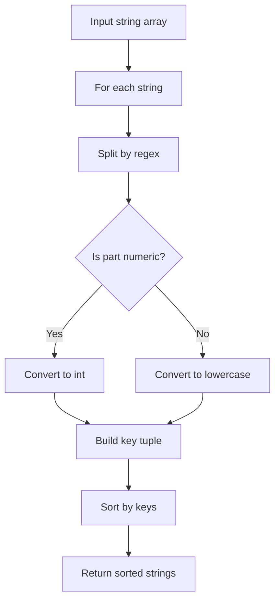

# Natural Sort

## Overview

| Property | Value |
|----------|-------|
| **Category** | Sorting Algorithm |
| **Type** | Hybrid (Lexicographic + Numeric) |
| **Data Structure** | Array of Strings |
| **Time Complexity** | O(n log n × k) |
| **Space Complexity** | O(n) |
| **Stable** | Yes (via Python's sort) |
| **Paradigm** | Key-Based Comparison |

---

## Mathematical Foundation

### Definition

**Natural Sort** (also called **Human Sort** or **Alphanum Sort**) orders strings the way humans would expect, treating embedded numbers as numeric values rather than character sequences.

### The Problem with Lexicographic Sort

Standard lexicographic sort compares strings character by character using Unicode code points:

```
Standard sort: ["item1", "item10", "item2", "item9"]
               (1 < 1, then 0 < 2, so "item10" < "item2")

Natural sort:  ["item1", "item2", "item9", "item10"]
               (1 < 2 < 9 < 10 as numbers)
```

### Key Transformation

Natural sort transforms strings into comparable tuples:

$$\text{key}(s) = [t_1, t_2, ..., t_k]$$

Where each $t_i$ is either:
- A lowercase string segment (for alphabetic parts)
- An integer (for numeric parts)

### Example Transformation

```
"Elm12" → ["elm", 12]
"elm2"  → ["elm", 2]
"Elm11" → ["elm", 11]

Comparison:
["elm", 2] < ["elm", 11] < ["elm", 12]
(strings equal, then 2 < 11 < 12)
```

### Formal Algorithm

For string $s$, split by regex pattern $([0-9]+)$:

$$\text{alphanum\_key}(s) = [\phi(p) : p \in \text{split}(s, \text{regex})]$$

Where:
$$\phi(p) = \begin{cases}
\text{int}(p) & \text{if } p \text{ is all digits} \\
\text{lower}(p) & \text{otherwise}
\end{cases}$$

---

## Pseudocode

```
NATURAL-SORT(strings):
    Input: Array of strings
    Output: Naturally sorted array
    
    define ALPHANUM-KEY(string):
        parts ← REGEX-SPLIT(string, "([0-9]+)")
        key ← []
        
        for each part in parts:
            if part is all digits:
                key.append(INTEGER(part))
            else:
                key.append(LOWERCASE(part))
        
        return key
    
    return SORT(strings, key=ALPHANUM-KEY)


REGEX-SPLIT(string, pattern):
    // Split string by pattern, keeping delimiters
    // "abc123def" with "([0-9]+)" → ["abc", "123", "def"]
    
    result ← []
    current ← ""
    
    for each char in string:
        if char matches [0-9] and current is alphabetic:
            result.append(current)
            current ← char
        else if char is alphabetic and current is numeric:
            result.append(current)
            current ← char
        else:
            current ← current + char
    
    if current not empty:
        result.append(current)
    
    return result
```

---

## Complexity Analysis

### Time Complexity

| Operation | Complexity |
|-----------|------------|
| Key generation per string | O(k) where k = string length |
| Sorting n strings | O(n log n) |
| **Total** | O(n log n × k) |

### Space Complexity

| Component | Space |
|-----------|-------|
| Key storage | O(n × k) |
| Sort auxiliary | O(n) |
| **Total** | O(n × k) |

### Comparison with Standard Sort

| Aspect | Standard Sort | Natural Sort |
|--------|---------------|--------------|
| Time | O(n log n × k) | O(n log n × k) |
| Space | O(n) | O(n × k) |
| Numeric handling | Character-by-character | As integers |
| Case handling | Case-sensitive | Case-insensitive |

---

## Visual Representation

### Sorting Comparison

```
Input: ['2 ft 7 in', '1 ft 5 in', '10 ft 2 in', '2 ft 11 in', '7 ft 6 in']

Standard sorted():
  '1 ft 5 in'   → ['1', ' ft ', '5', ' in']
  '10 ft 2 in'  → ['1', '0', ' ft ', '2', ' in']  (1,0 < 2)
  '2 ft 11 in'  → ['2', ' ft ', '1', '1', ' in']  (11 → '1','1')
  '2 ft 7 in'   → ['2', ' ft ', '7', ' in']
  '7 ft 6 in'   → ['7', ' ft ', '6', ' in']

Natural Sort:
  '1 ft 5 in'   → [1, ' ft ', 5, ' in']    (1 ft)
  '2 ft 7 in'   → [2, ' ft ', 7, ' in']    (2 ft 7 in)
  '2 ft 11 in'  → [2, ' ft ', 11, ' in']   (2 ft 11 in)
  '7 ft 6 in'   → [7, ' ft ', 6, ' in']    (7 ft)
  '10 ft 2 in'  → [10, ' ft ', 2, ' in']   (10 ft)
```

### Key Transformation Diagram

```
String: "Elm12"
         │
         ▼
   ┌─────────────┐
   │ Regex Split │
   │ "([0-9]+)"  │
   └─────────────┘
         │
         ▼
   ["Elm", "12"]
         │
         ▼
   ┌─────────────┐
   │  Transform  │
   │ each part   │
   └─────────────┘
         │
         ▼
   ["elm", 12]
     ↓      ↓
   lower   int
```

### Algorithm Flow



---

## Implementation Details

### Python Implementation

```python
from __future__ import annotations

import re


def natural_sort(input_list: list[str]) -> list[str]:
    """
    Sort the given list of strings in the way that humans expect.

    The normal Python sort algorithm sorts lexicographically,
    so you might not get the results that you expect...

    >>> example1 = ['2 ft 7 in', '1 ft 5 in', '10 ft 2 in', '2 ft 11 in', '7 ft 6 in']
    >>> sorted(example1)
    ['1 ft 5 in', '10 ft 2 in', '2 ft 11 in', '2 ft 7 in', '7 ft 6 in']
    >>> natural_sort(example1)
    ['1 ft 5 in', '2 ft 7 in', '2 ft 11 in', '7 ft 6 in', '10 ft 2 in']

    >>> example2 = ['Elm11', 'Elm12', 'Elm2', 'elm0', 'elm1', 'elm10', 'elm13', 'elm9']
    >>> sorted(example2)
    ['Elm11', 'Elm12', 'Elm2', 'elm0', 'elm1', 'elm10', 'elm13', 'elm9']
    >>> natural_sort(example2)
    ['elm0', 'elm1', 'Elm2', 'elm9', 'elm10', 'Elm11', 'Elm12', 'elm13']
    """

    def alphanum_key(key: str) -> list:
        return [int(s) if s.isdigit() else s.lower() 
                for s in re.split("([0-9]+)", key)]

    return sorted(input_list, key=alphanum_key)
```

### Extended Implementation with Options

```python
import re
from typing import Callable


def natural_sort_key(
    s: str,
    case_sensitive: bool = False,
    locale_aware: bool = False
) -> list:
    """
    Generate a natural sort key for a string.
    
    >>> natural_sort_key("file10.txt")
    ['file', 10, '.txt']
    >>> natural_sort_key("File10.TXT", case_sensitive=True)
    ['File', 10, '.TXT']
    """
    parts = re.split(r'(\d+)', s)
    
    def transform(part: str):
        if part.isdigit():
            return int(part)
        return part if case_sensitive else part.lower()
    
    return [transform(p) for p in parts if p]


def natural_sort_extended(
    items: list[str],
    key: Callable[[str], str] = None,
    reverse: bool = False,
    case_sensitive: bool = False
) -> list[str]:
    """
    Extended natural sort with custom options.
    
    >>> natural_sort_extended(['b2', 'a10', 'a2', 'b1'])
    ['a2', 'a10', 'b1', 'b2']
    >>> natural_sort_extended(['b2', 'a10', 'a2', 'b1'], reverse=True)
    ['b2', 'b1', 'a10', 'a2']
    """
    def sort_key(item):
        value = key(item) if key else item
        return natural_sort_key(value, case_sensitive=case_sensitive)
    
    return sorted(items, key=sort_key, reverse=reverse)
```

### Version Number Sorting

```python
def version_sort(versions: list[str]) -> list[str]:
    """
    Sort version numbers naturally.
    
    >>> version_sort(['1.2', '1.10', '1.1', '2.0', '1.2.3'])
    ['1.1', '1.2', '1.2.3', '1.10', '2.0']
    >>> version_sort(['v2.0.0', 'v1.10.0', 'v1.9.0', 'v10.0.0'])
    ['v1.9.0', 'v1.10.0', 'v2.0.0', 'v10.0.0']
    """
    def version_key(v: str) -> list:
        # Remove common prefixes
        v = v.lstrip('vV')
        # Split by dots and convert to integers where possible
        parts = []
        for part in re.split(r'[.\-_]', v):
            if part.isdigit():
                parts.append((0, int(part)))
            else:
                # Handle pre-release tags
                parts.append((1, part.lower()))
        return parts
    
    return sorted(versions, key=version_key)
```

---

## Real-World Applications

### 1. **File Explorer Sorting**

**Use Case**: Displaying files in human-friendly order.

```python
import os
from pathlib import Path


def list_directory_natural(path: str) -> list[str]:
    """
    List directory contents with natural sorting.
    
    >>> # Simulated file listing
    >>> files = ['img1.png', 'img10.png', 'img2.png', 'img20.png']
    >>> natural_sort(files)
    ['img1.png', 'img2.png', 'img10.png', 'img20.png']
    """
    files = os.listdir(path)
    return natural_sort(files)


def organize_photos(photos: list[str]) -> dict[str, list[str]]:
    """
    Organize photos by folder with natural ordering.
    
    >>> photos = ['vacation/IMG_1.jpg', 'vacation/IMG_10.jpg', 
    ...           'vacation/IMG_2.jpg', 'work/photo1.png']
    >>> result = organize_photos(photos)
    >>> result['vacation']
    ['vacation/IMG_1.jpg', 'vacation/IMG_2.jpg', 'vacation/IMG_10.jpg']
    """
    from collections import defaultdict
    
    organized = defaultdict(list)
    for photo in photos:
        folder = str(Path(photo).parent)
        organized[folder].append(photo)
    
    return {folder: natural_sort(files) 
            for folder, files in organized.items()}
```

### 2. **Chapter/Episode Ordering**

**Use Case**: Sorting media files or document chapters.

```python
def sort_media_files(files: list[str]) -> list[str]:
    """
    Sort media files (episodes, chapters) naturally.
    
    >>> episodes = ['Episode 1', 'Episode 10', 'Episode 2', 
    ...             'Episode 11', 'Episode 3']
    >>> sort_media_files(episodes)
    ['Episode 1', 'Episode 2', 'Episode 3', 'Episode 10', 'Episode 11']
    
    >>> chapters = ['Chapter 1 - Intro', 'Chapter 10 - End', 
    ...             'Chapter 2 - Setup']
    >>> sort_media_files(chapters)
    ['Chapter 1 - Intro', 'Chapter 2 - Setup', 'Chapter 10 - End']
    """
    return natural_sort(files)


def create_playlist(tracks: list[str]) -> list[str]:
    """
    Create a naturally ordered playlist.
    
    >>> tracks = ['01 - Intro.mp3', '10 - Finale.mp3', '02 - Main.mp3']
    >>> create_playlist(tracks)
    ['01 - Intro.mp3', '02 - Main.mp3', '10 - Finale.mp3']
    """
    return natural_sort(tracks)
```

### 3. **Software Version Management**

**Use Case**: Sorting software releases and packages.

```python
from dataclasses import dataclass


@dataclass
class Release:
    version: str
    date: str
    changelog: str


def sort_releases(releases: list[Release]) -> list[Release]:
    """
    Sort software releases by version number.
    
    >>> releases = [
    ...     Release('2.0.0', '2024-01-01', 'Major update'),
    ...     Release('1.10.0', '2023-12-01', 'Feature release'),
    ...     Release('1.9.1', '2023-11-15', 'Bugfix'),
    ... ]
    >>> sorted_rel = sort_releases(releases)
    >>> [r.version for r in sorted_rel]
    ['1.9.1', '1.10.0', '2.0.0']
    """
    def version_key(release: Release) -> list:
        return [int(s) if s.isdigit() else s 
                for s in re.split(r'(\d+)', release.version)]
    
    return sorted(releases, key=version_key)


def find_latest_compatible(
    available: list[str],
    constraint: str
) -> str | None:
    """
    Find latest version matching a constraint.
    
    >>> find_latest_compatible(['1.0', '1.5', '2.0', '1.10'], '^1')
    '1.10'
    >>> find_latest_compatible(['1.0', '1.5', '2.0'], '^2')
    '2.0'
    """
    # Parse constraint (simplified: ^X means major version X)
    major = int(constraint.lstrip('^'))
    
    matching = [v for v in available if v.startswith(f'{major}.')]
    if not matching:
        return None
    
    sorted_versions = version_sort(matching)
    return sorted_versions[-1]
```

### 4. **Scientific Data Organization**

**Use Case**: Sorting experimental data files.

```python
def sort_experiment_data(files: list[str]) -> dict[str, list[str]]:
    """
    Sort and group experimental data files.
    
    >>> files = [
    ...     'exp1_trial10.csv', 'exp1_trial2.csv', 
    ...     'exp2_trial1.csv', 'exp1_trial1.csv'
    ... ]
    >>> result = sort_experiment_data(files)
    >>> result['exp1']
    ['exp1_trial1.csv', 'exp1_trial2.csv', 'exp1_trial10.csv']
    """
    from collections import defaultdict
    
    groups = defaultdict(list)
    
    for f in files:
        # Extract experiment name (before first underscore with number)
        exp_name = re.match(r'([a-zA-Z]+\d+)', f)
        if exp_name:
            groups[exp_name.group(1)].append(f)
    
    return {exp: natural_sort(files) for exp, files in groups.items()}


def sort_measurement_labels(labels: list[str]) -> list[str]:
    """
    Sort measurement labels naturally.
    
    >>> labels = ['sensor10', 'sensor1', 'sensor2', 'sensor20']
    >>> sort_measurement_labels(labels)
    ['sensor1', 'sensor2', 'sensor10', 'sensor20']
    """
    return natural_sort(labels)
```

---

## Advantages and Disadvantages

### ✅ Advantages

1. **Human-friendly** - matches user expectations
2. **Case-insensitive** - treats 'A' and 'a' equally
3. **Simple implementation** - uses existing sort
4. **Stable** - maintains relative order
5. **Unicode support** - works with international text

### ❌ Disadvantages

1. **Slower** - key generation overhead
2. **Memory overhead** - stores transformed keys
3. **Locale issues** - doesn't handle all locales
4. **Edge cases** - leading zeros, negative numbers

---

## Edge Cases

### Handling Special Cases

```python
def robust_natural_sort(items: list[str]) -> list[str]:
    """
    Natural sort handling edge cases.
    
    >>> robust_natural_sort(['a-1', 'a-10', 'a-2', 'a-'])
    ['a-', 'a-1', 'a-2', 'a-10']
    >>> robust_natural_sort(['01', '1', '001'])
    ['001', '01', '1']
    >>> robust_natural_sort(['-5', '0', '5', '-10'])
    ['-10', '-5', '0', '5']
    """
    def robust_key(s: str) -> list:
        parts = re.split(r'(-?\d+)', s)
        result = []
        for part in parts:
            if part:
                try:
                    result.append((0, int(part)))
                except ValueError:
                    result.append((1, part.lower()))
        return result
    
    return sorted(items, key=robust_key)
```

---

## References

1. [Wikipedia: Natural Sort Order](https://en.wikipedia.org/wiki/Natural_sort_order)
2. [Martin Pool's natsort](https://github.com/sourcefrog/natsort)
3. Jeff Atwood - "Sorting for Humans: Natural Sort Order"

---

## See Also

- [Lexicographic Sort](lexicographic_sort.md) - Standard string sorting
- [Radix Sort](radix_sort.md) - Non-comparison string sort
- [Custom Key Sorting](custom_key_sorting.md) - Python's key functions
