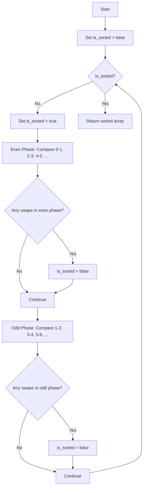

# Odd-Even Sort (Brick Sort)

## Overview

| Property | Value |
|----------|-------|
| **Category** | Sorting Algorithm |
| **Type** | Comparison-Based (Exchange Sort) |
| **Data Structure** | Array |
| **Space Complexity** | O(1) |
| **Stable** | Yes |
| **In-Place** | Yes |
| **Adaptive** | Yes |

---

## Mathematical Foundation

### Definition

**Odd-Even Sort** (also known as **Brick Sort** or **Odd-Even Transposition Sort**) is a comparison-based sorting algorithm that extends Bubble Sort by comparing and swapping elements in two alternating phases:

1. **Odd Phase**: Compare pairs at odd indices (1,2), (3,4), (5,6), ...
2. **Even Phase**: Compare pairs at even indices (0,1), (2,3), (4,5), ...

### Algorithm Principle

The algorithm alternates between:

**Even Phase**: For $i = 0, 2, 4, \ldots$
$$\text{if } a_i > a_{i+1}: \text{swap}(a_i, a_{i+1})$$

**Odd Phase**: For $i = 1, 3, 5, \ldots$
$$\text{if } a_i > a_{i+1}: \text{swap}(a_i, a_{i+1})$$

### Why Two Phases?

The key insight is that **both phases can be parallelized**:
- In the even phase, pairs (0,1), (2,3), (4,5), ... are independent
- In the odd phase, pairs (1,2), (3,4), (5,6), ... are independent

This makes Odd-Even Sort naturally suited for parallel processing.

### Correctness Proof

**Lemma**: After $n$ phases, the array is sorted.

**Proof Sketch**:
- Each element can move at most one position per phase
- An element at position $i$ needs at most $\max(i, n-1-i)$ phases to reach its final position
- Maximum phases needed: $n$

### Convergence Analysis

In Bubble Sort, elements "bubble up" one position per pass. In Odd-Even Sort:
- Elements can move in both directions simultaneously
- On average, convergence is similar to Bubble Sort

---

## Pseudocode

```
ODD-EVEN-SORT(A):
    Input: Array A of n elements
    Output: Sorted array A (in-place)
    
    n ← length(A)
    is_sorted ← false
    
    while not is_sorted:
        is_sorted ← true
        
        // Even phase: compare pairs (0,1), (2,3), (4,5), ...
        for i ← 0 to n - 2 step 2:
            if A[i] > A[i + 1]:
                swap A[i] and A[i + 1]
                is_sorted ← false
        
        // Odd phase: compare pairs (1,2), (3,4), (5,6), ...
        for i ← 1 to n - 2 step 2:
            if A[i] > A[i + 1]:
                swap A[i] and A[i + 1]
                is_sorted ← false
    
    return A
```

### Parallel Version

```
PARALLEL-ODD-EVEN-SORT(A, p processors):
    Input: Array A of n elements, p processors
    Output: Sorted array A
    
    for phase ← 1 to n:
        if phase is odd:
            // Odd phase
            parallel for each processor j handling index i = 2j + 1:
                if i < n - 1 and A[i] > A[i + 1]:
                    swap A[i] and A[i + 1]
        else:
            // Even phase
            parallel for each processor j handling index i = 2j:
                if i < n - 1 and A[i] > A[i + 1]:
                    swap A[i] and A[i + 1]
        
        synchronize all processors
    
    return A
```

---

## Complexity Analysis

### Time Complexity

| Case | Complexity | Notes |
|------|------------|-------|
| **Best** | $O(n)$ | Already sorted |
| **Average** | $O(n^2)$ | Random input |
| **Worst** | $O(n^2)$ | Reverse sorted |

**Sequential Analysis:**
- Number of phases: $O(n)$
- Comparisons per phase: $O(n)$
- Total: $O(n^2)$

**Parallel Analysis (with n/2 processors):**
- Number of phases: $O(n)$
- Comparisons per phase: $O(1)$ (parallel)
- Total: $O(n)$ parallel time

### Space Complexity

| Component | Space |
|-----------|-------|
| Auxiliary variables | $O(1)$ |
| **Total** | $O(1)$ |

### Comparisons with Bubble Sort

| Metric | Bubble Sort | Odd-Even Sort |
|--------|-------------|---------------|
| Sequential time | $O(n^2)$ | $O(n^2)$ |
| Parallel time | $O(n^2)$ | $O(n)$ |
| Best case | $O(n)$ | $O(n)$ |
| Parallelizable | No | Yes |

---

## Visual Representation

### Algorithm Flow



### Sorting Example

```
Input: [5, 4, 3, 2, 1]
n = 5

Phase 1 (Even):
  Compare (0,1): 5 > 4 → swap → [4, 5, 3, 2, 1]
  Compare (2,3): 3 > 2 → swap → [4, 5, 2, 3, 1]
  
Phase 1 (Odd):
  Compare (1,2): 5 > 2 → swap → [4, 2, 5, 3, 1]
  Compare (3,4): 3 > 1 → swap → [4, 2, 5, 1, 3]

Phase 2 (Even):
  Compare (0,1): 4 > 2 → swap → [2, 4, 5, 1, 3]
  Compare (2,3): 5 > 1 → swap → [2, 4, 1, 5, 3]

Phase 2 (Odd):
  Compare (1,2): 4 > 1 → swap → [2, 1, 4, 5, 3]
  Compare (3,4): 5 > 3 → swap → [2, 1, 4, 3, 5]

Phase 3 (Even):
  Compare (0,1): 2 > 1 → swap → [1, 2, 4, 3, 5]
  Compare (2,3): 4 > 3 → swap → [1, 2, 3, 4, 5]

Phase 3 (Odd):
  Compare (1,2): 2 < 3 → no swap
  Compare (3,4): 4 < 5 → no swap

Phase 4 (Even):
  No swaps needed

Phase 4 (Odd):
  No swaps needed
  
is_sorted = true → Done!

Output: [1, 2, 3, 4, 5]
```

### Parallel Execution Visualization

```
Array: [5, 4, 3, 2, 1]

Even Phase (parallel):
  P0: (0,1) → swap(5,4)  ─┐
  P1: (2,3) → swap(3,2)  ─┼─ All execute simultaneously
                         ─┘
Result: [4, 5, 2, 3, 1]

Odd Phase (parallel):
  P0: (1,2) → swap(5,2)  ─┐
  P1: (3,4) → swap(3,1)  ─┼─ All execute simultaneously
                         ─┘
Result: [4, 2, 5, 1, 3]

... continue until sorted
```

---

## Implementation Details

### Python Implementation

```python
def odd_even_sort(input_list: list) -> list:
    """
    Sort using Odd-Even Sort algorithm.
    
    This algorithm uses the same idea of bubblesort,
    but by first dividing in two phases (odd and even).
    Originally developed for use on parallel processors
    with local interconnections.
    
    >>> odd_even_sort([5, 4, 3, 2, 1])
    [1, 2, 3, 4, 5]
    >>> odd_even_sort([])
    []
    >>> odd_even_sort([-10, -1, 10, 2])
    [-10, -1, 2, 10]
    >>> odd_even_sort([1, 2, 3, 4])
    [1, 2, 3, 4]
    """
    is_sorted = False
    while not is_sorted:
        is_sorted = True
        
        # Even phase: compare pairs at even indices
        for i in range(0, len(input_list) - 1, 2):
            if input_list[i] > input_list[i + 1]:
                input_list[i], input_list[i + 1] = input_list[i + 1], input_list[i]
                is_sorted = False
        
        # Odd phase: compare pairs at odd indices
        for i in range(1, len(input_list) - 1, 2):
            if input_list[i] > input_list[i + 1]:
                input_list[i], input_list[i + 1] = input_list[i + 1], input_list[i]
                is_sorted = False
    
    return input_list
```

### Parallel Python Implementation

```python
from concurrent.futures import ThreadPoolExecutor
import threading


def parallel_odd_even_sort(arr):
    """
    Parallel Odd-Even Sort using threads.
    
    >>> parallel_odd_even_sort([5, 3, 1, 4, 2])
    [1, 2, 3, 4, 5]
    """
    n = len(arr)
    if n <= 1:
        return arr
    
    arr = list(arr)  # Make a copy
    
    def compare_and_swap(i):
        if arr[i] > arr[i + 1]:
            arr[i], arr[i + 1] = arr[i + 1], arr[i]
            return True
        return False
    
    for phase in range(n):
        swapped = False
        
        if phase % 2 == 0:
            # Even phase
            indices = range(0, n - 1, 2)
        else:
            # Odd phase
            indices = range(1, n - 1, 2)
        
        # Execute comparisons in parallel
        with ThreadPoolExecutor() as executor:
            results = list(executor.map(compare_and_swap, indices))
        
        if any(results):
            swapped = True
        
        # Early termination if no swaps in both phases
        if phase > 0 and not swapped:
            break
    
    return arr
```

### Counting Comparisons and Swaps

```python
def odd_even_sort_with_metrics(arr):
    """
    Odd-Even Sort with comparison and swap counts.
    
    >>> arr, comps, swaps = odd_even_sort_with_metrics([3, 1, 2])
    >>> arr
    [1, 2, 3]
    """
    arr = list(arr)
    n = len(arr)
    comparisons = 0
    swaps = 0
    
    is_sorted = False
    while not is_sorted:
        is_sorted = True
        
        # Even phase
        for i in range(0, n - 1, 2):
            comparisons += 1
            if arr[i] > arr[i + 1]:
                arr[i], arr[i + 1] = arr[i + 1], arr[i]
                swaps += 1
                is_sorted = False
        
        # Odd phase
        for i in range(1, n - 1, 2):
            comparisons += 1
            if arr[i] > arr[i + 1]:
                arr[i], arr[i + 1] = arr[i + 1], arr[i]
                swaps += 1
                is_sorted = False
    
    return arr, comparisons, swaps
```

---

## Real-World Applications

### 1. **Parallel Computing Systems**

**Use Case**: Sorting on SIMD architectures and GPU.

```python
class SIMDOddEvenSort:
    """
    Simulates SIMD-style parallel odd-even sort.
    In real SIMD, all comparisons happen in one instruction.
    """
    
    def __init__(self, vector_width=4):
        self.vector_width = vector_width
    
    def sort(self, arr):
        """
        Sort using simulated SIMD operations.
        """
        n = len(arr)
        arr = list(arr)
        
        for phase in range(n):
            if phase % 2 == 0:
                # Even phase - vectorized
                for v_start in range(0, n - 1, self.vector_width):
                    # Process vector_width pairs at once
                    pairs = []
                    for i in range(v_start, min(v_start + self.vector_width, n - 1), 2):
                        pairs.append(i)
                    
                    # Vectorized compare and swap
                    for i in pairs:
                        if arr[i] > arr[i + 1]:
                            arr[i], arr[i + 1] = arr[i + 1], arr[i]
            else:
                # Odd phase - vectorized
                for v_start in range(1, n - 1, self.vector_width):
                    pairs = []
                    for i in range(v_start, min(v_start + self.vector_width, n - 1), 2):
                        pairs.append(i)
                    
                    for i in pairs:
                        if arr[i] > arr[i + 1]:
                            arr[i], arr[i + 1] = arr[i + 1], arr[i]
        
        return arr
```

### 2. **Sorting Networks for Hardware**

**Use Case**: Designing hardware sorting circuits.

```python
class OddEvenSortingNetwork:
    """
    Generate odd-even sorting network for hardware implementation.
    
    Output is a list of (i, j) comparators.
    """
    
    def generate_network(self, n):
        """
        Generate comparator network for n elements.
        
        >>> network = OddEvenSortingNetwork()
        >>> comparators = network.generate_network(4)
        >>> len(comparators) > 0
        True
        """
        comparators = []
        
        for phase in range(n):
            if phase % 2 == 0:
                # Even phase
                for i in range(0, n - 1, 2):
                    comparators.append((i, i + 1))
            else:
                # Odd phase
                for i in range(1, n - 1, 2):
                    comparators.append((i, i + 1))
        
        return comparators
    
    def to_verilog(self, n):
        """
        Generate Verilog code for sorting network.
        """
        comparators = self.generate_network(n)
        
        code = f"// Odd-Even Sorting Network for {n} elements\n"
        code += f"module odd_even_sort_{n}(\n"
        code += f"    input [{n-1}:0] in,\n"
        code += f"    output [{n-1}:0] out\n"
        code += ");\n\n"
        
        for stage, (i, j) in enumerate(comparators):
            code += f"    // Stage {stage}: compare ({i}, {j})\n"
        
        code += "endmodule\n"
        return code
```

### 3. **Distributed Systems Sorting**

**Use Case**: Sorting across multiple nodes with local communication.

```python
class DistributedOddEvenSort:
    """
    Simulate distributed odd-even sort across nodes.
    Each node holds one element and can only communicate
    with immediate neighbors.
    """
    
    def __init__(self, data):
        self.nodes = data[:]
        self.n = len(data)
    
    def run(self, max_phases=None):
        """
        Run distributed sorting.
        
        >>> sorter = DistributedOddEvenSort([5, 3, 1, 4, 2])
        >>> sorter.run()
        >>> sorter.nodes
        [1, 2, 3, 4, 5]
        """
        max_phases = max_phases or self.n
        
        for phase in range(max_phases):
            # Determine which pairs communicate this phase
            if phase % 2 == 0:
                pairs = [(i, i + 1) for i in range(0, self.n - 1, 2)]
            else:
                pairs = [(i, i + 1) for i in range(1, self.n - 1, 2)]
            
            # Each pair exchanges and keeps min/max
            for i, j in pairs:
                if self.nodes[i] > self.nodes[j]:
                    self.nodes[i], self.nodes[j] = self.nodes[j], self.nodes[i]
        
        return self.nodes
```

### 4. **Educational Parallel Algorithm Demo**

**Use Case**: Teaching parallel computing concepts.

```python
def visualize_odd_even_sort(arr):
    """
    Educational visualization of odd-even sort.
    Shows parallelism at each phase.
    
    >>> visualize_odd_even_sort([3, 1, 4, 2])  # doctest: +SKIP
    """
    arr = list(arr)
    n = len(arr)
    phase = 0
    
    print(f"Initial: {arr}")
    print("-" * 40)
    
    is_sorted = False
    while not is_sorted:
        is_sorted = True
        phase += 1
        
        # Even phase
        even_swaps = []
        for i in range(0, n - 1, 2):
            if arr[i] > arr[i + 1]:
                arr[i], arr[i + 1] = arr[i + 1], arr[i]
                even_swaps.append((i, i + 1))
                is_sorted = False
        
        if even_swaps:
            print(f"Phase {phase} (Even): Parallel swaps at {even_swaps}")
            print(f"  Result: {arr}")
        
        # Odd phase
        odd_swaps = []
        for i in range(1, n - 1, 2):
            if arr[i] > arr[i + 1]:
                arr[i], arr[i + 1] = arr[i + 1], arr[i]
                odd_swaps.append((i, i + 1))
                is_sorted = False
        
        if odd_swaps:
            print(f"Phase {phase} (Odd): Parallel swaps at {odd_swaps}")
            print(f"  Result: {arr}")
        
        if not even_swaps and not odd_swaps:
            print(f"Phase {phase}: No swaps needed - sorted!")
    
    print("-" * 40)
    print(f"Final: {arr}")
    return arr
```

### 5. **Mesh Network Sorting**

**Use Case**: Sorting in 1D mesh processor arrays.

```python
class MeshNetworkSort:
    """
    Odd-even sort optimized for 1D mesh networks
    where each processor can only communicate with neighbors.
    """
    
    def __init__(self, processors):
        self.processors = processors
        self.data = [None] * processors
    
    def load_data(self, arr):
        """Load data into processors (one element each)."""
        for i, val in enumerate(arr):
            if i < self.processors:
                self.data[i] = val
    
    def sort(self):
        """
        Sort using odd-even transposition.
        Communication only between neighbors.
        """
        n = self.processors
        
        for phase in range(n):
            # Determine communication pattern
            if phase % 2 == 0:
                # Even processors communicate with right neighbor
                starts = list(range(0, n - 1, 2))
            else:
                # Odd processors communicate with right neighbor
                starts = list(range(1, n - 1, 2))
            
            # All selected pairs exchange simultaneously
            new_data = self.data[:]
            for i in starts:
                left, right = self.data[i], self.data[i + 1]
                new_data[i] = min(left, right)
                new_data[i + 1] = max(left, right)
            
            self.data = new_data
        
        return self.data
```

---

## Variants

### 1. Odd-Even Merge Sort

Combines odd-even sorting with merge operations:

```python
def odd_even_merge(arr, lo, n, r):
    """Odd-even merge for sorting networks."""
    step = r * 2
    if step < n:
        odd_even_merge(arr, lo, n, step)
        odd_even_merge(arr, lo + r, n, step)
        for i in range(lo + r, lo + n - r, step):
            if arr[i] > arr[i + r]:
                arr[i], arr[i + r] = arr[i + r], arr[i]
    else:
        if arr[lo] > arr[lo + r]:
            arr[lo], arr[lo + r] = arr[lo + r], arr[lo]
```

### 2. Batcher's Odd-Even Merge Sort

A more efficient variant with O(n log²n) comparators:

```python
def batcher_sort(arr):
    """Batcher's odd-even mergesort."""
    n = len(arr)
    if n <= 1:
        return arr
    
    arr = list(arr)
    t = 1
    while t < n:
        p = t
        while p > 0:
            q = t
            r = 0
            d = p
            while d > 0:
                for i in range(n - d):
                    if (i & p) == r and arr[i] > arr[i + d]:
                        arr[i], arr[i + d] = arr[i + d], arr[i]
                d = q - p
                q //= 2
                r = p
            p //= 2
        t *= 2
    return arr
```

---

## Comparison with Similar Algorithms

| Algorithm | Sequential | Parallel | Communication |
|-----------|------------|----------|---------------|
| Bubble Sort | $O(n^2)$ | $O(n^2)$ | N/A |
| Odd-Even Sort | $O(n^2)$ | $O(n)$ | Neighbor only |
| Bitonic Sort | $O(n \log^2 n)$ | $O(\log^2 n)$ | Non-local |
| Merge Sort | $O(n \log n)$ | $O(\log n)$ | Non-local |

---

## References

1. [Wikipedia: Odd-Even Sort](https://en.wikipedia.org/wiki/Odd%E2%80%93even_sort)
2. Knuth, D. E. "The Art of Computer Programming, Volume 3: Sorting and Searching"
3. Batcher, K. E. (1968). "Sorting Networks and Their Applications"

---

## See Also

- [Bubble Sort](bubble_sort.md) - Sequential predecessor
- [Bitonic Sort](bitonic_sort.md) - Another parallel sorting algorithm
- [Cocktail Shaker Sort](cocktail_shaker_sort.md) - Bidirectional bubble sort

