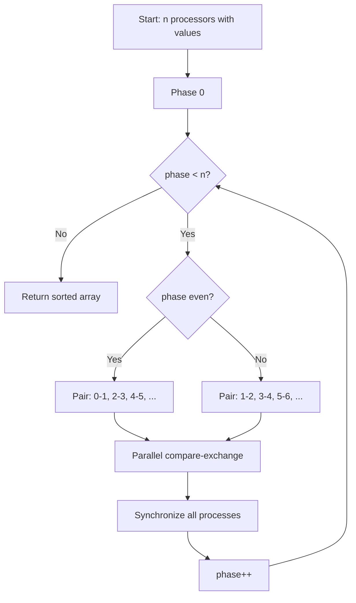

# Odd-Even Transposition Sort (Parallel)

## Overview

| Property | Value |
|----------|-------|
| **Category** | Sorting Algorithm |
| **Type** | Comparison-Based (Parallel) |
| **Data Structure** | Array |
| **Time Complexity** | O(n) parallel, O(n²) sequential |
| **Space Complexity** | O(n) for processes |
| **Stable** | Yes |
| **Paradigm** | Parallel / Distributed |

---

## Mathematical Foundation

### Definition

**Odd-Even Transposition Sort** is a parallel sorting algorithm based on odd-even sort. Each element is assigned to a processor, and adjacent processors exchange elements in alternating odd and even phases.

### Parallel Computing Model

In PRAM (Parallel Random Access Machine) model:
- $n$ processors $P_0, P_1, ..., P_{n-1}$
- Processor $P_i$ holds element at position $i$
- Neighboring processors can communicate

### Algorithm Phases

**Odd Phase**: Compare pairs $(1,2), (3,4), (5,6), ...$
**Even Phase**: Compare pairs $(0,1), (2,3), (4,5), ...$

Alternating for $n$ rounds guarantees sorting.

### Correctness Proof (0-1 Principle)

By the 0-1 principle, if the algorithm correctly sorts all sequences of 0s and 1s, it correctly sorts all sequences.

For 0-1 sequence:
- After at most $n$ phases, all 0s are before all 1s
- Each 0 can move at most one position left per phase
- Rightmost 0 moves to final position in $\leq n$ phases

### Comparison Network

The algorithm forms a comparison network:
$$\text{Depth} = n$$
$$\text{Comparators} = \frac{n(n-1)}{2}$$

### Parallel Speedup

| Metric | Sequential | Parallel |
|--------|------------|----------|
| Time | O(n²) | O(n) |
| Work | O(n²) | O(n²) |
| Speedup | - | O(n) |
| Efficiency | - | O(1) |

---

## Pseudocode

```
ODD-EVEN-TRANSPOSITION-SORT(A):
    Input: Array A of n elements
    Output: Sorted array A
    
    // Run for n phases
    for phase ← 0 to n-1:
        
        if phase is even:
            // Even phase: compare (0,1), (2,3), (4,5), ...
            parallel for i ← 0 to n-2 step 2:
                COMPARE-EXCHANGE(A, i, i+1)
        else:
            // Odd phase: compare (1,2), (3,4), (5,6), ...
            parallel for i ← 1 to n-2 step 2:
                COMPARE-EXCHANGE(A, i, i+1)
    
    return A


COMPARE-EXCHANGE(A, i, j):
    if A[i] > A[j]:
        swap(A[i], A[j])


// Distributed version: Each processor runs this
PROCESSOR-OE-SORT(position, value, neighbors):
    for phase ← 0 to n-1:
        
        partner ← GET-PARTNER(position, phase)
        
        if partner exists:
            // Exchange with neighbor
            SEND(value, partner)
            partner_value ← RECEIVE(partner)
            
            if position < partner:
                value ← MIN(value, partner_value)
            else:
                value ← MAX(value, partner_value)
    
    return value


GET-PARTNER(position, phase):
    if (phase + position) is even:
        return position + 1  // Right neighbor
    else:
        return position - 1  // Left neighbor
```

---

## Complexity Analysis

### Time Complexity

| Model | Complexity | Notes |
|-------|------------|-------|
| **Sequential** | O(n²) | n phases × n comparisons |
| **Parallel (n processors)** | O(n) | n phases, O(1) per phase |
| **Parallel (p processors)** | O(n²/p + n) | Communication overhead |

### Communication Complexity

| Phase | Messages | Data per Message |
|-------|----------|------------------|
| Each phase | n/2 pairs | 1 element |
| Total | O(n²) messages | O(n²) data |

### Space Complexity

| Component | Space |
|-----------|-------|
| Per processor | O(1) |
| Total processes | O(n) |
| Communication buffers | O(n) |

### Scalability Analysis

For $n$ elements on $p$ processors ($p < n$):
- Elements per processor: $n/p$
- Local sort time: $O((n/p) \log(n/p))$
- Communication rounds: $O(p)$
- Total: $O((n/p) \log(n/p) + n)$

---

## Visual Representation

### Parallel Phases

```
Initial: [10, 9, 8, 7, 6, 5, 4, 3, 2, 1]
         P0  P1 P2 P3 P4 P5 P6 P7 P8 P9

Phase 0 (Even): Compare (0,1), (2,3), (4,5), (6,7), (8,9)
         [9,10| 7, 8| 5, 6| 3, 4| 1, 2]

Phase 1 (Odd): Compare (1,2), (3,4), (5,6), (7,8)
         [9| 7,10| 5, 8| 3, 6| 1, 4| 2]

Phase 2 (Even): Compare (0,1), (2,3), (4,5), (6,7), (8,9)
         [7, 9| 5,10| 3, 8| 1, 6| 2, 4]

... continue for n phases ...

Final:   [1, 2, 3, 4, 5, 6, 7, 8, 9, 10]
```

### Process Communication Pattern

```
Phase 0 (Even):
P0 ←→ P1    P2 ←→ P3    P4 ←→ P5    P6 ←→ P7    P8 ←→ P9

Phase 1 (Odd):
P0    P1 ←→ P2    P3 ←→ P4    P5 ←→ P6    P7 ←→ P8    P9

Phase 2 (Even):
P0 ←→ P1    P2 ←→ P3    P4 ←→ P5    P6 ←→ P7    P8 ←→ P9

... alternating pattern continues ...
```

### Sorting Network Diagram

```
      Phase 0   Phase 1   Phase 2   Phase 3   ...
        │         │         │         │
P0 ─────┼─────────│─────────┼─────────│─────────
        ╲         │         ╲         │
P1 ─────┼╱────────┼─────────┼╱────────┼─────────
        │         ╲         │         ╲
P2 ─────┼─────────┼╱────────┼─────────┼╱────────
        ╲         │         ╲         │
P3 ─────┼╱────────┼─────────┼╱────────┼─────────
        │         ╲         │         ╲
P4 ─────┼─────────┼╱────────┼─────────┼╱────────
        ╲         │         ╲         │
P5 ─────┼╱────────│─────────┼╱────────│─────────

╲╱ = Comparator (swap if out of order)
```

### Algorithm Flow



---

## Implementation Details

### Python Implementation (Multiprocessing)

```python
"""
Odd-even transposition sort using multiprocessing.

Each variable is represented by a process that communicates
with neighbors using pipes and locks.
"""

import multiprocessing as mp


def oe_process(
    position,
    value,
    l_send,
    r_send,
    lr_cv,
    rr_cv,
    result_pipe,
    multiprocessing_context,
):
    """Process function that sorts by exchanging with neighbors."""
    process_lock = multiprocessing_context.Lock()

    # Perform n swaps
    for i in range(10):  # n phases
        if (i + position) % 2 == 0 and r_send is not None:
            # Exchange with right neighbor
            with process_lock:
                r_send[1].send(value)
            with process_lock:
                temp = rr_cv[0].recv()
            # Take lower value (we're on the left)
            value = min(value, temp)
            
        elif (i + position) % 2 != 0 and l_send is not None:
            # Exchange with left neighbor
            with process_lock:
                l_send[1].send(value)
            with process_lock:
                temp = lr_cv[0].recv()
            # Take higher value (we're on the right)
            value = max(value, temp)
    
    # Send final value back
    result_pipe[1].send(value)


def odd_even_transposition(arr):
    """
    Sort array using parallel odd-even transposition.
    
    >>> odd_even_transposition(list(range(10)[::-1])) == sorted(range(10))
    True
    >>> odd_even_transposition(["a", "x", "c"]) == sorted(["x", "a", "c"])
    True
    >>> odd_even_transposition([1.9, 42.0, 2.8]) == sorted([1.9, 42.0, 2.8])
    True
    """
    multiprocessing_context = mp.get_context("spawn")

    process_array_ = []
    result_pipe = []
    
    # Initialize result pipes
    for _ in arr:
        result_pipe.append(multiprocessing_context.Pipe())
    
    # Create first process (no left neighbor)
    temp_rs = multiprocessing_context.Pipe()
    temp_rr = multiprocessing_context.Pipe()
    process_array_.append(
        multiprocessing_context.Process(
            target=oe_process,
            args=(0, arr[0], None, temp_rs, None, temp_rr, 
                  result_pipe[0], multiprocessing_context),
        )
    )
    temp_lr = temp_rs
    temp_ls = temp_rr

    # Create middle processes
    for i in range(1, len(arr) - 1):
        temp_rs = multiprocessing_context.Pipe()
        temp_rr = multiprocessing_context.Pipe()
        process_array_.append(
            multiprocessing_context.Process(
                target=oe_process,
                args=(i, arr[i], temp_ls, temp_rs, temp_lr, temp_rr,
                      result_pipe[i], multiprocessing_context),
            )
        )
        temp_lr = temp_rs
        temp_ls = temp_rr

    # Create last process (no right neighbor)
    process_array_.append(
        multiprocessing_context.Process(
            target=oe_process,
            args=(len(arr) - 1, arr[len(arr) - 1], temp_ls, None,
                  temp_lr, None, result_pipe[len(arr) - 1], 
                  multiprocessing_context),
        )
    )

    # Start all processes
    for p in process_array_:
        p.start()

    # Collect results
    for p in range(len(result_pipe)):
        arr[p] = result_pipe[p][0].recv()
        process_array_[p].join()
    
    return arr
```

### Sequential Simulation

```python
def odd_even_sort_sequential(arr: list) -> list:
    """
    Sequential simulation of odd-even transposition sort.
    
    >>> odd_even_sort_sequential([5, 3, 8, 1, 9, 2])
    [1, 2, 3, 5, 8, 9]
    >>> odd_even_sort_sequential([1])
    [1]
    >>> odd_even_sort_sequential([])
    []
    """
    n = len(arr)
    result = arr.copy()
    
    for phase in range(n):
        # Even phase: pairs (0,1), (2,3), ...
        # Odd phase: pairs (1,2), (3,4), ...
        start = phase % 2
        
        for i in range(start, n - 1, 2):
            if result[i] > result[i + 1]:
                result[i], result[i + 1] = result[i + 1], result[i]
    
    return result
```

### MPI-Style Implementation

```python
def odd_even_sort_mpi_style(
    arr: list,
    comm_func=None
) -> list:
    """
    MPI-style odd-even sort simulation.
    
    >>> odd_even_sort_mpi_style([5, 3, 8, 1, 9, 2])
    [1, 2, 3, 5, 8, 9]
    """
    n = len(arr)
    local_values = arr.copy()
    
    for phase in range(n):
        # Determine communication partner
        for rank in range(n):
            if (phase + rank) % 2 == 0:
                partner = rank + 1
            else:
                partner = rank - 1
            
            if 0 <= partner < n:
                # Simulate exchange
                if rank < partner:
                    # Keep minimum
                    local_values[rank] = min(
                        local_values[rank], 
                        local_values[partner]
                    )
                else:
                    # Keep maximum
                    local_values[rank] = max(
                        local_values[rank], 
                        local_values[partner]
                    )
    
    return local_values
```

---

## Real-World Applications

### 1. **GPU Sorting**

**Use Case**: Parallel sorting on graphics hardware.

```python
def gpu_odd_even_sort_simulation(data: list) -> list:
    """
    Simulate GPU odd-even sort (CUDA-like pattern).
    
    In actual GPU implementation, each thread handles one element.
    
    >>> gpu_odd_even_sort_simulation([5, 3, 8, 1, 9])
    [1, 3, 5, 8, 9]
    """
    n = len(data)
    result = data.copy()
    
    for phase in range(n):
        # In GPU: Each thread executes this in parallel
        # Here we simulate with sequential loop
        next_result = result.copy()
        
        start = phase % 2
        for thread_id in range(start, n - 1, 2):
            left = result[thread_id]
            right = result[thread_id + 1]
            
            # Warp-synchronous in actual GPU
            next_result[thread_id] = min(left, right)
            next_result[thread_id + 1] = max(left, right)
        
        result = next_result
    
    return result


def cuda_kernel_simulation(shared_mem: list, phase: int) -> None:
    """
    Simulate CUDA kernel for one phase.
    
    In real CUDA:
    __global__ void oddEvenPhase(int* data, int n, int phase) {
        int idx = blockIdx.x * blockDim.x + threadIdx.x;
        int start = phase % 2;
        if (idx >= start && idx < n-1 && (idx - start) % 2 == 0) {
            if (data[idx] > data[idx+1]) {
                int temp = data[idx];
                data[idx] = data[idx+1];
                data[idx+1] = temp;
            }
        }
    }
    """
    n = len(shared_mem)
    start = phase % 2
    
    # Simulate parallel threads
    swaps = []
    for idx in range(start, n - 1, 2):
        if shared_mem[idx] > shared_mem[idx + 1]:
            swaps.append(idx)
    
    # Apply swaps (in GPU this is atomic)
    for idx in swaps:
        shared_mem[idx], shared_mem[idx + 1] = \
            shared_mem[idx + 1], shared_mem[idx]
```

### 2. **Distributed Database Sorting**

**Use Case**: Sorting across database shards.

```python
class DistributedSortNode:
    """
    A node in distributed odd-even sorting network.
    """
    
    def __init__(self, node_id: int, data: list):
        self.node_id = node_id
        self.data = sorted(data)  # Local sort
        self.left_neighbor = None
        self.right_neighbor = None
    
    def connect(self, left, right):
        self.left_neighbor = left
        self.right_neighbor = right
    
    def exchange_phase(self, phase: int) -> None:
        """
        Execute one phase of odd-even exchange.
        """
        partner = None
        if (phase + self.node_id) % 2 == 0:
            partner = self.right_neighbor
        else:
            partner = self.left_neighbor
        
        if partner is None:
            return
        
        # Exchange and merge
        combined = self.data + partner.data
        combined.sort()
        
        mid = len(combined) // 2
        if self.node_id < partner.node_id:
            self.data = combined[:mid]
        else:
            self.data = combined[mid:]


def distributed_odd_even_sort(shards: list[list]) -> list:
    """
    Sort data distributed across shards.
    
    >>> shards = [[5, 8, 3], [1, 9, 2], [7, 4, 6]]
    >>> result = distributed_odd_even_sort(shards)
    >>> all(result[i] <= result[i+1] for i in range(len(result)-1))
    True
    """
    n = len(shards)
    nodes = [DistributedSortNode(i, shards[i]) for i in range(n)]
    
    # Connect neighbors
    for i in range(n):
        left = nodes[i - 1] if i > 0 else None
        right = nodes[i + 1] if i < n - 1 else None
        nodes[i].connect(left, right)
    
    # Run odd-even phases
    for phase in range(n):
        for node in nodes:
            node.exchange_phase(phase)
    
    # Collect results
    result = []
    for node in nodes:
        result.extend(node.data)
    
    return result
```

### 3. **Network Packet Sorting**

**Use Case**: Sorting packets in network switches.

```python
class NetworkSwitch:
    """
    Network switch using odd-even sorting for packet ordering.
    """
    
    def __init__(self, num_ports: int):
        self.num_ports = num_ports
        self.buffers = [[] for _ in range(num_ports)]
    
    def sort_by_priority(self) -> list:
        """
        Sort packets across ports by priority using odd-even sort.
        
        In hardware, this would be implemented with comparators.
        """
        # Flatten and extract priorities
        packets = []
        for port_id, buffer in enumerate(self.buffers):
            for packet in buffer:
                packets.append((packet['priority'], port_id, packet))
        
        # Odd-even sort
        n = len(packets)
        for phase in range(n):
            start = phase % 2
            for i in range(start, n - 1, 2):
                if packets[i][0] > packets[i + 1][0]:
                    packets[i], packets[i + 1] = packets[i + 1], packets[i]
        
        return [p[2] for p in packets]
```

---

## Advantages and Disadvantages

### ✅ Advantages

1. **Highly parallelizable** - O(n) with n processors
2. **Simple implementation** - easy to parallelize
3. **Communication efficient** - only neighbor exchanges
4. **Hardware friendly** - maps to sorting networks
5. **Stable** - preserves equal element order

### ❌ Disadvantages

1. **O(n) processors needed** - for full parallelism
2. **O(n²) work** - not work-optimal
3. **n phases required** - even with parallelism
4. **Synchronization overhead** - barrier after each phase

### Comparison with Other Parallel Sorts

| Algorithm | Processors | Time | Work | Communication |
|-----------|------------|------|------|---------------|
| Odd-Even | n | O(n) | O(n²) | O(n²) |
| Bitonic | n | O(log² n) | O(n log² n) | O(n log² n) |
| Sample Sort | p | O(n/p log n) | O(n log n) | O(n) |

---

## References

1. [Wikipedia: Odd-Even Sort](https://en.wikipedia.org/wiki/Odd%E2%80%93even_sort)
2. Knuth, "The Art of Computer Programming, Vol. 3"
3. Quinn, "Parallel Computing: Theory and Practice"

---

## See Also

- [Odd-Even Sort](odd_even_sort.md) - Sequential version
- [Bitonic Sort](bitonic_sort.md) - Another parallel sort
- [Sorting Networks](sorting_networks.md) - Hardware sorting
