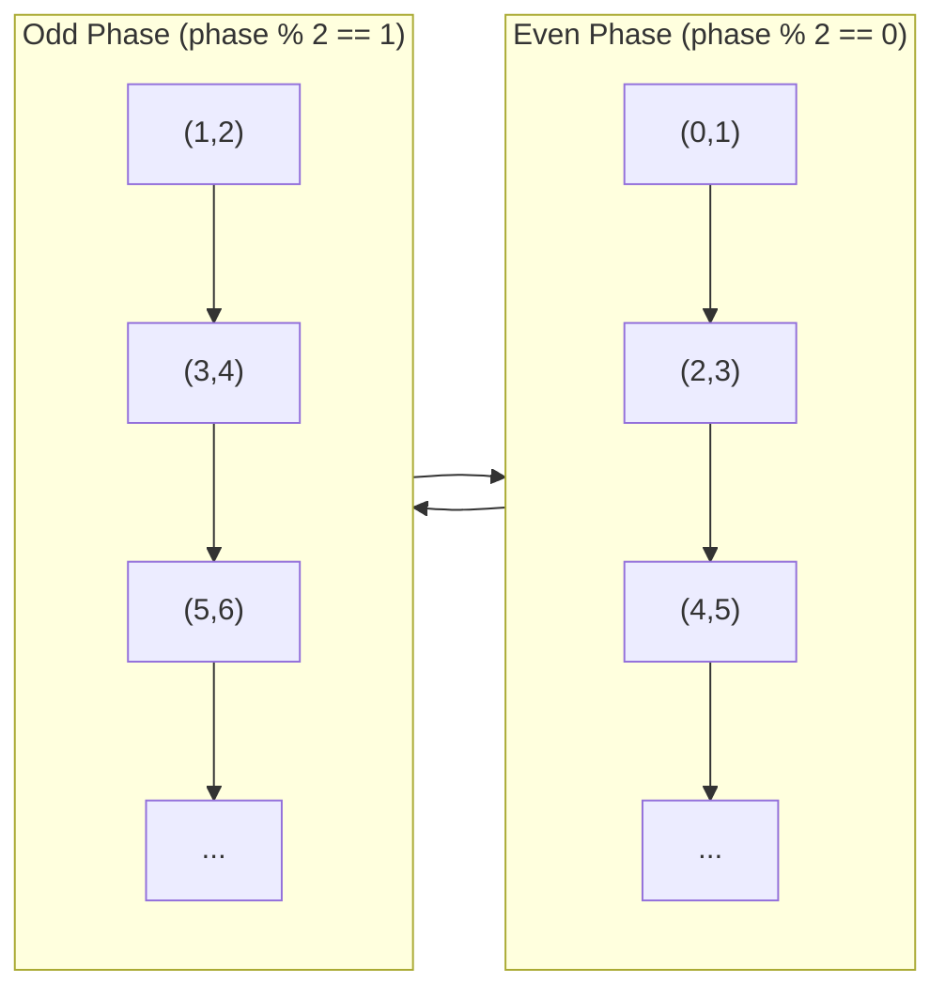

# Odd-Even Transposition Sort (Single-Threaded)

## Overview

| Property | Value |
|----------|-------|
| **Category** | Exchange Sort |
| **Complexity (Time)** | O(n²) |
| **Complexity (Space)** | O(1) |
| **Stability** | Yes |
| **In-place** | Yes |
| **Comparison-based** | Yes |

## Description

Odd-Even Transposition Sort (also known as Brick Sort or Odd-Even Sort) is a comparison-based sorting algorithm that alternates between comparing/swapping odd-indexed pairs and even-indexed pairs. This single-threaded implementation demonstrates the algorithm's logic, though it doesn't benefit from parallelization.

The algorithm is designed for parallel architectures where pairs can be compared simultaneously. In the sequential version shown here, it performs similarly to Bubble Sort, making at most n passes over the array.

## Mathematical Foundation

### Phase Definition

The algorithm operates in two alternating phases:

**Odd Phase:** Compare pairs at positions $(2k+1, 2k+2)$ for $k = 0, 1, 2, \ldots$
$$\text{Pairs: } (1,2), (3,4), (5,6), \ldots$$

**Even Phase:** Compare pairs at positions $(2k, 2k+1)$ for $k = 0, 1, 2, \ldots$
$$\text{Pairs: } (0,1), (2,3), (4,5), \ldots$$

### Number of Phases

The algorithm requires at most $n$ phases to sort $n$ elements, where each phase consists of one odd and one even pass.

### Correctness Proof (0-1 Sorting Lemma)

By the 0-1 Sorting Lemma, if an oblivious comparison network sorts all binary (0-1) sequences correctly, it sorts all sequences correctly.

For any 0-1 sequence:
- After $k$ phases, the rightmost $k$ zeros are in their final positions
- After $n$ phases, all elements are sorted

### Comparison Count

Total comparisons per phase:
$$C_{\text{phase}} = \lfloor\frac{n-1}{2}\rfloor + \lfloor\frac{n}{2}\rfloor = n - 1$$

Total comparisons:
$$C_{\text{total}} = n(n-1) = O(n^2)$$

### Parallel Speedup (Theoretical)

If all comparisons in a phase happen simultaneously:
$$T_{\text{parallel}} = O(n) \text{ phases} \times O(1) \text{ per phase} = O(n)$$

## Algorithm

### Pseudocode

```
ODD-EVEN-TRANSPOSITION-SORT(A):
    n ← length(A)
    
    for phase ← 0 to n - 1:
        // Determine starting index based on phase parity
        start ← phase mod 2
        
        // Compare and swap adjacent pairs
        for i ← start to n - 2 step 2:
            if A[i + 1] < A[i]:
                SWAP(A[i], A[i + 1])
    
    return A
```

### Step-by-Step Execution

```
Input: [5, 4, 3, 2, 1]

Phase 0 (even pairs: 0-1, 2-3):
  Compare (5,4): swap → [4, 5, 3, 2, 1]
  Compare (3,2): swap → [4, 5, 2, 3, 1]

Phase 1 (odd pairs: 1-2, 3-4):
  Compare (5,2): swap → [4, 2, 5, 3, 1]
  Compare (3,1): swap → [4, 2, 5, 1, 3]

Phase 2 (even pairs: 0-1, 2-3):
  Compare (4,2): swap → [2, 4, 5, 1, 3]
  Compare (5,1): swap → [2, 4, 1, 5, 3]

Phase 3 (odd pairs: 1-2, 3-4):
  Compare (4,1): swap → [2, 1, 4, 5, 3]
  Compare (5,3): swap → [2, 1, 4, 3, 5]

Phase 4 (even pairs: 0-1, 2-3):
  Compare (2,1): swap → [1, 2, 4, 3, 5]
  Compare (4,3): swap → [1, 2, 3, 4, 5]

Output: [1, 2, 3, 4, 5]
```

## Complexity Analysis

### Time Complexity

| Case | Complexity | Explanation |
|------|------------|-------------|
| Best | O(n) | Already sorted (with early termination) |
| Average | O(n²) | Random data |
| Worst | O(n²) | Reverse sorted |

### Space Complexity

| Aspect | Complexity |
|--------|------------|
| Auxiliary Space | O(1) |
| Total Space | O(n) |

### Comparison with Bubble Sort

| Aspect | Odd-Even | Bubble Sort |
|--------|----------|-------------|
| Sequential Time | O(n²) | O(n²) |
| Parallel Time | O(n) | O(n²) |
| Comparisons/Phase | n-1 | n-1 |
| Parallelizable | Yes | Limited |

## Visual Representation

```mermaid
flowchart TD
    A[Start] --> B[phase = 0]
    B --> C{phase < n?}
    C -->|Yes| D[start = phase mod 2]
    D --> E[i = start]
    E --> F{i < n - 1?}
    F -->|Yes| G{A[i+1] < A[i]?}
    G -->|Yes| H[Swap A[i] and A[i+1]]
    G -->|No| I[No swap]
    H --> J[i = i + 2]
    I --> J
    J --> F
    F -->|No| K[phase++]
    K --> C
    C -->|No| L[Return A]
    L --> M[End]
```

### Phase Visualization



### Sorting Network Representation

```
Index:  0     1     2     3     4
        │     │     │     │     │
Even:   ├──●──┤     ├──●──┤     │
        │     │     │     │     │
Odd:    │     ├──●──┤     ├──●──┤
        │     │     │     │     │
Even:   ├──●──┤     ├──●──┤     │
        │     │     │     │     │
        ↓     ↓     ↓     ↓     ↓
       (●──● indicates compare-swap)
```

## Implementation

### Python Implementation

```python
def odd_even_transposition(arr: list) -> list:
    """
    Odd-Even Transposition Sort (single-threaded).
    
    >>> odd_even_transposition([5, 4, 3, 2, 1])
    [1, 2, 3, 4, 5]
    >>> odd_even_transposition([13, 11, 18, 0, -1])
    [-1, 0, 11, 13, 18]
    >>> odd_even_transposition([-.1, 1.1, .1, -2.9])
    [-2.9, -0.1, 0.1, 1.1]
    """
    arr_size = len(arr)
    for phase in range(arr_size):
        # Even phase: pairs (0,1), (2,3), ...
        # Odd phase: pairs (1,2), (3,4), ...
        start = phase % 2
        for i in range(start, arr_size - 1, 2):
            if arr[i + 1] < arr[i]:
                arr[i], arr[i + 1] = arr[i + 1], arr[i]
    
    return arr
```

### Optimized with Early Termination

```python
def odd_even_transposition_optimized(arr: list) -> list:
    """
    Optimized version with early termination.
    
    >>> odd_even_transposition_optimized([1, 2, 3, 4, 5])
    [1, 2, 3, 4, 5]
    >>> odd_even_transposition_optimized([5, 4, 3, 2, 1])
    [1, 2, 3, 4, 5]
    """
    n = len(arr)
    sorted_flag = False
    
    while not sorted_flag:
        sorted_flag = True
        
        # Even phase
        for i in range(0, n - 1, 2):
            if arr[i] > arr[i + 1]:
                arr[i], arr[i + 1] = arr[i + 1], arr[i]
                sorted_flag = False
        
        # Odd phase
        for i in range(1, n - 1, 2):
            if arr[i] > arr[i + 1]:
                arr[i], arr[i + 1] = arr[i + 1], arr[i]
                sorted_flag = False
    
    return arr
```

### Generic Implementation

```python
from typing import TypeVar, Callable

T = TypeVar('T')

def odd_even_sort_generic(
    arr: list[T],
    key: Callable[[T], any] = lambda x: x,
    reverse: bool = False
) -> list[T]:
    """
    Generic odd-even transposition sort.
    
    >>> odd_even_sort_generic(['banana', 'apple', 'cherry'], key=len)
    ['apple', 'banana', 'cherry']
    >>> odd_even_sort_generic([3, 1, 4, 1, 5], reverse=True)
    [5, 4, 3, 1, 1]
    """
    n = len(arr)
    
    def should_swap(a: T, b: T) -> bool:
        if reverse:
            return key(a) < key(b)
        return key(a) > key(b)
    
    for phase in range(n):
        for i in range(phase % 2, n - 1, 2):
            if should_swap(arr[i], arr[i + 1]):
                arr[i], arr[i + 1] = arr[i + 1], arr[i]
    
    return arr
```

## Real-World Applications

### 1. Pipeline Data Processing

```python
class PipelineProcessor:
    """
    Process data in pipeline stages using odd-even pattern.
    Each stage processes adjacent elements.
    """
    
    def __init__(self, data: list):
        self.data = data.copy()
        self.stages_completed = 0
    
    def process_stage(self, even_phase: bool) -> int:
        """
        Process one stage of the pipeline.
        Returns number of operations performed.
        
        >>> proc = PipelineProcessor([5, 2, 8, 1, 9])
        >>> proc.process_stage(even_phase=True)
        2
        >>> proc.data[0] < proc.data[1]  # First pair processed
        True
        """
        operations = 0
        start = 0 if even_phase else 1
        
        for i in range(start, len(self.data) - 1, 2):
            # Each "operation" could be any pairwise processing
            if self.data[i] > self.data[i + 1]:
                self.data[i], self.data[i + 1] = self.data[i + 1], self.data[i]
                operations += 1
        
        self.stages_completed += 1
        return operations
    
    def process_until_sorted(self) -> int:
        """
        Process until fully sorted.
        
        >>> proc = PipelineProcessor([3, 1, 2])
        >>> proc.process_until_sorted()
        3
        >>> proc.data
        [1, 2, 3]
        """
        n = len(self.data)
        for phase in range(n):
            self.process_stage(even_phase=(phase % 2 == 0))
        return self.stages_completed
```

### 2. Network Packet Ordering

```python
from dataclasses import dataclass

@dataclass
class Packet:
    sequence_num: int
    data: bytes
    
    def __lt__(self, other):
        return self.sequence_num < other.sequence_num

class PacketReorderer:
    """
    Reorder network packets using odd-even sort.
    Simulates hardware-friendly sorting for network switches.
    """
    
    def __init__(self, buffer_size: int = 8):
        self.buffer: list[Packet | None] = [None] * buffer_size
        self.count = 0
    
    def insert_packet(self, packet: Packet) -> None:
        """Insert a packet into the buffer."""
        if self.count < len(self.buffer):
            self.buffer[self.count] = packet
            self.count += 1
    
    def sort_phase(self, even: bool) -> None:
        """Perform one sorting phase."""
        start = 0 if even else 1
        for i in range(start, self.count - 1, 2):
            if self.buffer[i].sequence_num > self.buffer[i + 1].sequence_num:
                self.buffer[i], self.buffer[i + 1] = (
                    self.buffer[i + 1], 
                    self.buffer[i]
                )
    
    def get_ordered_packets(self) -> list[Packet]:
        """
        Get packets in sequence order.
        
        >>> reorderer = PacketReorderer()
        >>> reorderer.insert_packet(Packet(3, b'c'))
        >>> reorderer.insert_packet(Packet(1, b'a'))
        >>> reorderer.insert_packet(Packet(2, b'b'))
        >>> packets = reorderer.get_ordered_packets()
        >>> [p.sequence_num for p in packets]
        [1, 2, 3]
        """
        for phase in range(self.count):
            self.sort_phase(phase % 2 == 0)
        
        return [p for p in self.buffer[:self.count] if p is not None]
```

### 3. Array-Based Hardware Simulation

```python
class ComparatorNetwork:
    """
    Simulate a hardware comparator network.
    Odd-even sort maps directly to hardware implementation.
    """
    
    def __init__(self, size: int):
        self.size = size
        self.comparators: list[tuple[int, int]] = []
        self._build_network()
    
    def _build_network(self) -> None:
        """Build the comparator network structure."""
        for phase in range(self.size):
            start = phase % 2
            for i in range(start, self.size - 1, 2):
                self.comparators.append((i, i + 1))
    
    def sort(self, data: list[int]) -> list[int]:
        """
        Sort using the comparator network.
        
        >>> network = ComparatorNetwork(5)
        >>> network.sort([4, 2, 5, 1, 3])
        [1, 2, 3, 4, 5]
        """
        result = data.copy()
        for i, j in self.comparators:
            if result[i] > result[j]:
                result[i], result[j] = result[j], result[i]
        return result
    
    def get_depth(self) -> int:
        """Get circuit depth (parallel time)."""
        return self.size
    
    def get_comparator_count(self) -> int:
        """Get total comparators (circuit size)."""
        return len(self.comparators)


def visualize_network(size: int) -> str:
    """
    Visualize the sorting network.
    
    >>> print(visualize_network(4))
    Phase 0: (0,1) (2,3)
    Phase 1: (1,2)
    Phase 2: (0,1) (2,3)
    Phase 3: (1,2)
    """
    lines = []
    for phase in range(size):
        start = phase % 2
        pairs = [(i, i+1) for i in range(start, size - 1, 2)]
        pairs_str = " ".join(f"({a},{b})" for a, b in pairs)
        lines.append(f"Phase {phase}: {pairs_str}")
    return "\n".join(lines)
```

### 4. Parallel Algorithm Prototyping

```python
class ParallelSortSimulator:
    """
    Simulate parallel sorting to analyze potential speedup.
    """
    
    def __init__(self, data: list[int], num_processors: int = 4):
        self.data = data.copy()
        self.num_processors = num_processors
        self.comparison_count = 0
        self.phase_count = 0
    
    def simulate_parallel_phase(self, even: bool) -> list[tuple[int, int]]:
        """
        Simulate a parallel phase where multiple comparisons happen.
        Returns list of swaps performed.
        """
        swaps = []
        start = 0 if even else 1
        
        # In parallel, all these comparisons happen simultaneously
        pairs = []
        for i in range(start, len(self.data) - 1, 2):
            pairs.append((i, self.data[i], self.data[i + 1]))
        
        # Simulate parallel comparison
        for i, val_i, val_j in pairs:
            self.comparison_count += 1
            if val_i > val_j:
                self.data[i], self.data[i + 1] = val_j, val_i
                swaps.append((i, i + 1))
        
        self.phase_count += 1
        return swaps
    
    def run_simulation(self) -> dict:
        """
        Run full simulation and return statistics.
        
        >>> sim = ParallelSortSimulator([5, 3, 8, 1, 9, 2])
        >>> stats = sim.run_simulation()
        >>> stats['sorted']
        True
        >>> stats['phases'] <= 6
        True
        """
        n = len(self.data)
        
        for phase in range(n):
            self.simulate_parallel_phase(phase % 2 == 0)
        
        return {
            'sorted': self.data == sorted(self.data),
            'phases': self.phase_count,
            'total_comparisons': self.comparison_count,
            'parallel_time': self.phase_count,  # O(1) per phase in parallel
            'sequential_time': self.comparison_count,
            'speedup': self.comparison_count / max(1, self.phase_count),
            'result': self.data
        }
```

### 5. Priority Queue with Bounded Updates

```python
class BoundedPriorityQueue:
    """
    Priority queue using odd-even sort for bounded updates.
    Efficient when only a few elements change between operations.
    """
    
    def __init__(self, capacity: int):
        self.capacity = capacity
        self.items: list[tuple[int, any]] = []
        self.dirty = False
    
    def insert(self, priority: int, item: any) -> bool:
        """
        Insert item with priority.
        
        >>> pq = BoundedPriorityQueue(5)
        >>> pq.insert(3, 'c')
        True
        >>> pq.insert(1, 'a')
        True
        >>> pq.insert(2, 'b')
        True
        """
        if len(self.items) >= self.capacity:
            return False
        
        self.items.append((priority, item))
        self.dirty = True
        return True
    
    def _partial_sort(self, passes: int = 2) -> None:
        """
        Do a few passes of odd-even sort.
        Good for nearly-sorted data after single insertion.
        """
        n = len(self.items)
        for phase in range(min(passes, n)):
            start = phase % 2
            for i in range(start, n - 1, 2):
                if self.items[i][0] > self.items[i + 1][0]:
                    self.items[i], self.items[i + 1] = (
                        self.items[i + 1], 
                        self.items[i]
                    )
    
    def get_min(self) -> tuple[int, any] | None:
        """
        Get item with minimum priority.
        
        >>> pq = BoundedPriorityQueue(5)
        >>> pq.insert(3, 'c')
        True
        >>> pq.insert(1, 'a')
        True
        >>> pq.get_min()
        (1, 'a')
        """
        if not self.items:
            return None
        
        if self.dirty:
            self._partial_sort()
            self.dirty = False
        
        return self.items[0]
    
    def extract_min(self) -> tuple[int, any] | None:
        """Remove and return minimum item."""
        if not self.items:
            return None
        
        if self.dirty:
            self._partial_sort(len(self.items))
            self.dirty = False
        
        return self.items.pop(0)
```

## Comparison with Related Algorithms

| Algorithm | Sequential | Parallel | Best Use |
|-----------|------------|----------|----------|
| Odd-Even Trans. | O(n²) | O(n) | Hardware sorting |
| Bubble Sort | O(n²) | O(n²) | Simple sequential |
| Bitonic Sort | O(n log²n) | O(log²n) | Parallel systems |
| Odd-Even Merge | O(n log²n) | O(log²n) | Parallel systems |

## References

1. [Odd-Even Sort - Wikipedia](https://en.wikipedia.org/wiki/Odd%E2%80%93even_sort)
2. Knuth, D. "The Art of Computer Programming" - Sorting Networks
3. [Sorting Networks](https://en.wikipedia.org/wiki/Sorting_network)
4. Habermann, A.N. "Parallel Neighbor Sort"

## See Also

- [Odd-Even Transposition Parallel](odd_even_transposition_parallel.md) - Parallel implementation
- [Bubble Sort](bubble_sort.md) - Simpler exchange sort
- [Bitonic Sort](bitonic_sort.md) - Another parallel-friendly sort
- [Odd-Even Sort](odd_even_sort.md) - Alternative implementation
