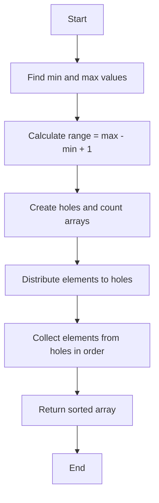
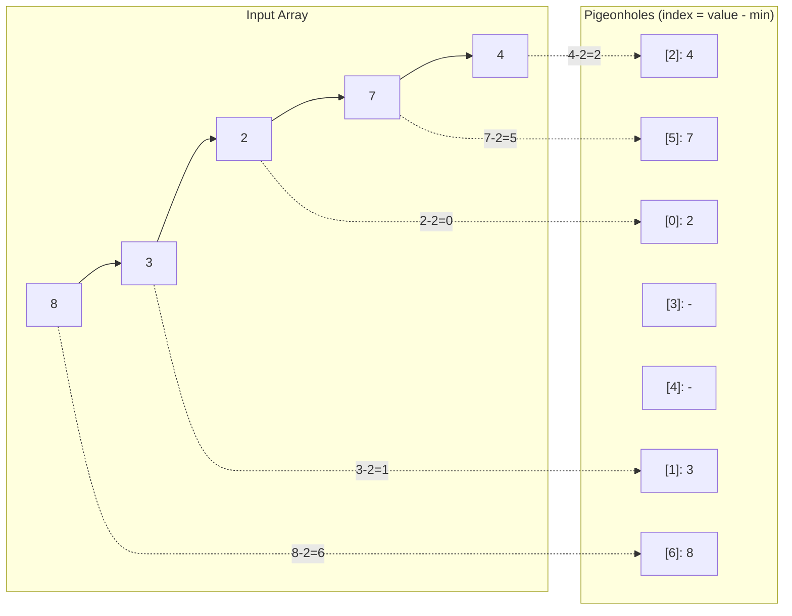

# Pigeon Sort (Pigeonhole Sort)

## Overview

| Property | Value |
|----------|-------|
| **Category** | Distribution/Non-Comparison Sort |
| **Complexity (Time)** | O(n + range) |
| **Complexity (Space)** | O(range) |
| **Stability** | Yes |
| **In-place** | No |
| **Comparison-based** | No |

## Description

Pigeon Sort (also known as Pigeonhole Sort) is a distribution-based sorting algorithm that works by placing elements into "pigeonholes" (buckets) corresponding to their values. The algorithm then extracts elements from the pigeonholes in order. It is particularly efficient when the range of values (max - min) is close to the number of elements being sorted.

The name comes from the pigeonhole principle in combinatorics, which states that if n items are put into m containers with n > m, at least one container must contain more than one item.

## Mathematical Foundation

### Pigeonhole Principle

For a set $A$ with $n$ elements being mapped to a set $B$ with $m$ elements where $n > m$:

$$\exists b \in B : |f^{-1}(b)| \geq \lceil \frac{n}{m} \rceil$$

### Range Calculation

Given input array $A = [a_1, a_2, \ldots, a_n]$:

$$\text{range} = \max(A) - \min(A) + 1$$

### Index Mapping Function

For each element $a_i$, its pigeonhole index is:

$$\text{index}(a_i) = a_i - \min(A)$$

### Inverse Mapping

To recover the original value from index $j$:

$$\text{value}(j) = j + \min(A)$$

### Complexity Condition

The algorithm is efficient when:

$$\text{range} = O(n)$$

If $\text{range} >> n$, other algorithms like counting sort optimizations or comparison sorts may be more suitable.

## Algorithm

### Pseudocode

```
PIGEON-SORT(A):
    if A is empty:
        return A
    
    min_val ← MIN(A)
    max_val ← MAX(A)
    range ← max_val - min_val + 1
    
    // Create pigeonholes
    holes ← array of size 'range', initialized to 0
    holes_count ← array of size 'range', initialized to 0
    
    // Distribute elements into holes
    for each element in A:
        index ← element - min_val
        holes[index] ← element
        holes_count[index] ← holes_count[index] + 1
    
    // Collect elements from holes
    output_index ← 0
    for i ← 0 to range - 1:
        while holes_count[i] > 0:
            A[output_index] ← holes[i]
            output_index ← output_index + 1
            holes_count[i] ← holes_count[i] - 1
    
    return A
```

### Step-by-Step Execution

```
Input: [8, 3, 2, 7, 4, 6, 8]

Step 1: Find range
  min = 2, max = 8
  range = 8 - 2 + 1 = 7

Step 2: Create pigeonholes (indices 0-6)
  Index:  0   1   2   3   4   5   6
  Maps:   2   3   4   5   6   7   8

Step 3: Distribute elements
  8 → index 6, count[6] = 1
  3 → index 1, count[1] = 1
  2 → index 0, count[0] = 1
  7 → index 5, count[5] = 1
  4 → index 2, count[2] = 1
  6 → index 4, count[4] = 1
  8 → index 6, count[6] = 2

  Holes:  [2, 3, 4, -, 6, 7, 8]
  Count:  [1, 1, 1, 0, 1, 1, 2]

Step 4: Collect from holes
  Index 0: output 2 (count=1)
  Index 1: output 3 (count=1)
  Index 2: output 4 (count=1)
  Index 3: skip (count=0)
  Index 4: output 6 (count=1)
  Index 5: output 7 (count=1)
  Index 6: output 8, 8 (count=2)

Output: [2, 3, 4, 6, 7, 8, 8]
```

## Complexity Analysis

### Time Complexity

| Case | Complexity | Explanation |
|------|------------|-------------|
| Best | O(n + range) | Single pass distribution and collection |
| Average | O(n + range) | Independent of input order |
| Worst | O(n + range) | Same for all inputs |

### Space Complexity

| Aspect | Complexity |
|--------|------------|
| Holes Array | O(range) |
| Count Array | O(range) |
| Total | O(range) |

### When Pigeonhole Sort is Optimal

The algorithm is optimal when:
- Range ≈ n (number of elements)
- $\text{range} = O(n)$

| Condition | Efficiency |
|-----------|------------|
| range ≤ n | O(n) - Excellent |
| range = O(n) | O(n) - Good |
| range = O(n²) | O(n²) - Poor |
| range >> n | Not recommended |

## Visual Representation



### Distribution Phase



## Implementation

### Python Implementation

```python
def pigeon_sort(array: list[int]) -> list[int]:
    """
    Implementation of pigeonhole sort algorithm.
    
    :param array: Collection of comparable items
    :return: Collection sorted in ascending order
    
    >>> pigeon_sort([0, 5, 3, 2, 2])
    [0, 2, 2, 3, 5]
    >>> pigeon_sort([])
    []
    >>> pigeon_sort([-2, -5, -45])
    [-45, -5, -2]
    """
    if len(array) == 0:
        return array
    
    _min, _max = min(array), max(array)
    
    # Compute the range
    holes_range = _max - _min + 1
    holes = [0] * holes_range
    holes_repeat = [0] * holes_range
    
    # Distribute elements to holes
    for i in array:
        index = i - _min
        holes[index] = i
        holes_repeat[index] += 1
    
    # Collect elements from holes
    index = 0
    for i in range(holes_range):
        while holes_repeat[i] > 0:
            array[index] = holes[i]
            index += 1
            holes_repeat[i] -= 1
    
    return array
```

### Optimized Implementation with Lists

```python
def pigeon_sort_stable(array: list[int]) -> list[int]:
    """
    Stable pigeonhole sort using lists for each hole.
    Preserves relative order of equal elements.
    
    >>> pigeon_sort_stable([3, 1, 3, 1, 2])
    [1, 1, 2, 3, 3]
    """
    if not array:
        return array
    
    min_val, max_val = min(array), max(array)
    holes_range = max_val - min_val + 1
    
    # Create list of lists for stability
    holes: list[list[int]] = [[] for _ in range(holes_range)]
    
    # Distribute
    for item in array:
        holes[item - min_val].append(item)
    
    # Collect
    result = []
    for hole in holes:
        result.extend(hole)
    
    return result
```

### Generic Implementation

```python
from typing import TypeVar
from collections.abc import Callable

T = TypeVar('T')

def pigeon_sort_generic(
    array: list[T],
    key: Callable[[T], int]
) -> list[T]:
    """
    Generic pigeonhole sort with custom key function.
    
    >>> data = [('a', 3), ('b', 1), ('c', 2)]
    >>> pigeon_sort_generic(data, key=lambda x: x[1])
    [('b', 1), ('c', 2), ('a', 3)]
    """
    if not array:
        return array
    
    keys = [key(item) for item in array]
    min_key, max_key = min(keys), max(keys)
    range_size = max_key - min_key + 1
    
    holes: list[list[T]] = [[] for _ in range(range_size)]
    
    for item in array:
        holes[key(item) - min_key].append(item)
    
    result = []
    for hole in holes:
        result.extend(hole)
    
    return result
```

## Real-World Applications

### 1. Grade Distribution System

```python
class GradeDistribution:
    """
    Efficiently sort and analyze student grades using pigeonhole sort.
    Grades are typically in range 0-100, making this ideal.
    """
    
    def __init__(self, max_grade: int = 100):
        self.max_grade = max_grade
        self.grade_buckets: list[list[str]] = [
            [] for _ in range(max_grade + 1)
        ]
    
    def add_grade(self, student: str, grade: int) -> None:
        """
        Add a student grade.
        
        >>> dist = GradeDistribution()
        >>> dist.add_grade('Alice', 85)
        >>> dist.add_grade('Bob', 92)
        """
        if 0 <= grade <= self.max_grade:
            self.grade_buckets[grade].append(student)
    
    def get_sorted_grades(self) -> list[tuple[str, int]]:
        """
        Get all grades sorted ascending.
        
        >>> dist = GradeDistribution()
        >>> dist.add_grade('Alice', 85)
        >>> dist.add_grade('Bob', 72)
        >>> dist.add_grade('Charlie', 85)
        >>> dist.get_sorted_grades()
        [('Bob', 72), ('Alice', 85), ('Charlie', 85)]
        """
        result = []
        for grade, students in enumerate(self.grade_buckets):
            for student in students:
                result.append((student, grade))
        return result
    
    def get_grade_histogram(self) -> dict[str, int]:
        """Get count per grade range."""
        ranges = {
            'A (90-100)': 0, 'B (80-89)': 0,
            'C (70-79)': 0, 'D (60-69)': 0, 'F (0-59)': 0
        }
        
        for grade in range(self.max_grade + 1):
            count = len(self.grade_buckets[grade])
            if grade >= 90:
                ranges['A (90-100)'] += count
            elif grade >= 80:
                ranges['B (80-89)'] += count
            elif grade >= 70:
                ranges['C (70-79)'] += count
            elif grade >= 60:
                ranges['D (60-69)'] += count
            else:
                ranges['F (0-59)'] += count
        
        return ranges
```

### 2. Age-Based Sorting for Census Data

```python
class CensusAgeAnalyzer:
    """
    Sort and analyze population by age.
    Age range 0-120 makes pigeonhole sort ideal.
    """
    
    def __init__(self, max_age: int = 120):
        self.age_buckets: list[list[dict]] = [
            [] for _ in range(max_age + 1)
        ]
        self.total_population = 0
    
    def add_person(
        self, 
        name: str, 
        age: int, 
        **attributes
    ) -> None:
        """Add a person to the census."""
        if 0 <= age <= len(self.age_buckets) - 1:
            self.age_buckets[age].append({
                'name': name, 
                'age': age, 
                **attributes
            })
            self.total_population += 1
    
    def get_population_by_age(self) -> list[dict]:
        """Get population sorted by age."""
        result = []
        for bucket in self.age_buckets:
            result.extend(bucket)
        return result
    
    def get_age_demographics(self) -> dict[str, int]:
        """
        Get demographic breakdown.
        
        >>> analyzer = CensusAgeAnalyzer()
        >>> analyzer.add_person('Alice', 25)
        >>> analyzer.add_person('Bob', 45)
        >>> analyzer.add_person('Charlie', 10)
        >>> demographics = analyzer.get_age_demographics()
        >>> demographics['Children (0-17)']
        1
        >>> demographics['Adults (18-64)']
        2
        """
        demographics = {
            'Children (0-17)': 0,
            'Adults (18-64)': 0,
            'Seniors (65+)': 0
        }
        
        for age, bucket in enumerate(self.age_buckets):
            count = len(bucket)
            if age < 18:
                demographics['Children (0-17)'] += count
            elif age < 65:
                demographics['Adults (18-64)'] += count
            else:
                demographics['Seniors (65+)'] += count
        
        return demographics
```

### 3. Event Scheduling by Hour

```python
from datetime import datetime, time

class HourlyEventScheduler:
    """
    Schedule and sort events by hour (0-23).
    Perfect for pigeonhole sort with range = 24.
    """
    
    def __init__(self):
        self.hourly_slots: list[list[dict]] = [
            [] for _ in range(24)
        ]
    
    def schedule_event(
        self, 
        name: str, 
        hour: int, 
        duration_minutes: int = 60
    ) -> bool:
        """
        Schedule an event at a specific hour.
        
        >>> scheduler = HourlyEventScheduler()
        >>> scheduler.schedule_event('Meeting', 9)
        True
        >>> scheduler.schedule_event('Lunch', 12, 60)
        True
        """
        if 0 <= hour < 24:
            self.hourly_slots[hour].append({
                'name': name,
                'hour': hour,
                'duration': duration_minutes
            })
            return True
        return False
    
    def get_daily_schedule(self) -> list[dict]:
        """
        Get all events sorted by hour.
        O(n + 24) = O(n) using pigeonhole principle.
        """
        schedule = []
        for hour, events in enumerate(self.hourly_slots):
            for event in events:
                schedule.append({
                    **event,
                    'time_str': f"{hour:02d}:00"
                })
        return schedule
    
    def get_busiest_hours(self, top_n: int = 3) -> list[tuple[int, int]]:
        """Find hours with most events."""
        hour_counts = [
            (hour, len(events)) 
            for hour, events in enumerate(self.hourly_slots)
        ]
        # Already partially sorted by hour, just need to sort by count
        return sorted(hour_counts, key=lambda x: -x[1])[:top_n]
```

### 4. Inventory Sorting by Stock Level

```python
class InventoryManager:
    """
    Sort products by stock level for reordering.
    Stock levels typically range 0-1000, suitable for pigeonhole.
    """
    
    def __init__(self, max_stock: int = 1000):
        self.max_stock = max_stock
        self.stock_levels: list[list[str]] = [
            [] for _ in range(max_stock + 1)
        ]
        self.products: dict[str, int] = {}
    
    def set_stock(self, product: str, quantity: int) -> None:
        """
        Set stock level for a product.
        
        >>> inv = InventoryManager(100)
        >>> inv.set_stock('Widget A', 5)
        >>> inv.set_stock('Widget B', 50)
        """
        quantity = max(0, min(quantity, self.max_stock))
        
        # Remove from old bucket if exists
        if product in self.products:
            old_qty = self.products[product]
            self.stock_levels[old_qty].remove(product)
        
        # Add to new bucket
        self.stock_levels[quantity].append(product)
        self.products[product] = quantity
    
    def get_reorder_list(
        self, 
        threshold: int = 10
    ) -> list[tuple[str, int]]:
        """
        Get products below threshold, sorted by stock (lowest first).
        
        >>> inv = InventoryManager(100)
        >>> inv.set_stock('A', 5)
        >>> inv.set_stock('B', 15)
        >>> inv.set_stock('C', 3)
        >>> inv.get_reorder_list(threshold=10)
        [('C', 3), ('A', 5)]
        """
        reorder = []
        for level in range(min(threshold, self.max_stock + 1)):
            for product in self.stock_levels[level]:
                reorder.append((product, level))
        return reorder
    
    def get_all_sorted_by_stock(self) -> list[tuple[str, int]]:
        """Get all products sorted by stock level."""
        result = []
        for level, products in enumerate(self.stock_levels):
            for product in products:
                result.append((product, level))
        return result
```

### 5. Character Frequency Counter

```python
def sort_string_by_frequency(s: str) -> str:
    """
    Sort characters by frequency using pigeonhole principle.
    Range = len(s), each frequency bucket holds characters.
    
    >>> sort_string_by_frequency('tree')
    'eert'
    >>> sort_string_by_frequency('aab')
    'aab'
    """
    from collections import Counter
    
    # Count frequencies
    freq = Counter(s)
    n = len(s)
    
    # Create buckets for each possible frequency (0 to n)
    buckets: list[list[str]] = [[] for _ in range(n + 1)]
    
    # Distribute characters to buckets
    for char, count in freq.items():
        buckets[count].append(char)
    
    # Collect from highest frequency to lowest
    result = []
    for count in range(n, 0, -1):
        for char in buckets[count]:
            result.append(char * count)
    
    return ''.join(result)


def group_anagrams_by_length(words: list[str]) -> dict[int, list[str]]:
    """
    Group words by length using pigeonhole sorting.
    
    >>> result = group_anagrams_by_length(['a', 'cat', 'an', 'bat', 'dog', 'i'])
    >>> result[1]
    ['a', 'i']
    >>> result[3]
    ['cat', 'bat', 'dog']
    """
    if not words:
        return {}
    
    max_len = max(len(w) for w in words)
    buckets: list[list[str]] = [[] for _ in range(max_len + 1)]
    
    for word in words:
        buckets[len(word)].append(word)
    
    return {
        length: bucket 
        for length, bucket in enumerate(buckets) 
        if bucket
    }
```

## Comparison with Similar Algorithms

| Algorithm | Time | Space | Best Use Case |
|-----------|------|-------|---------------|
| Pigeonhole Sort | O(n + range) | O(range) | Small range, any duplicates |
| Counting Sort | O(n + k) | O(k) | Non-negative integers |
| Bucket Sort | O(n + k) | O(n + k) | Uniform distribution |
| Radix Sort | O(d(n + k)) | O(n + k) | Fixed-length integers |

## References

1. [Pigeonhole Sort - Wikipedia](https://en.wikipedia.org/wiki/Pigeonhole_sort)
2. [Pigeonhole Principle](https://en.wikipedia.org/wiki/Pigeonhole_principle)
3. [Distribution Sort](https://en.wikipedia.org/wiki/Distribution_sort)
4. Cormen, T.H., et al. "Introduction to Algorithms" - Chapter on Sorting in Linear Time

## See Also

- [Counting Sort](counting_sort.md) - Similar distribution-based sort
- [Bucket Sort](bucket_sort.md) - Another distribution sort
- [Radix Sort](radix_sort.md) - Multi-pass distribution sort
