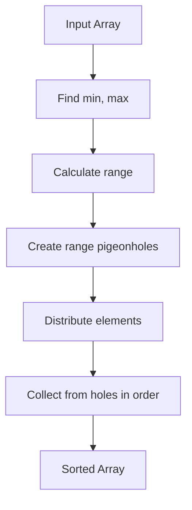

# Pigeonhole Sort

## Overview

| Property | Value |
|----------|-------|
| **Category** | Sorting Algorithm |
| **Type** | Non-Comparison-Based (Distribution Sort) |
| **Data Structure** | Array, Auxiliary Array |
| **Space Complexity** | O(n + range) |
| **Stable** | Yes |
| **In-Place** | No |
| **Adaptive** | No |

---

## Mathematical Foundation

### Definition

Pigeonhole Sort is a **distribution sorting algorithm** suitable for sorting lists of elements where the number of elements $n$ and the range of possible key values (range) are approximately the same. It works by creating "pigeonholes" (buckets) for each possible key value and distributing elements into them.

### Pigeonhole Principle

The algorithm is based on the **Pigeonhole Principle**:

> If $n$ items are put into $m$ containers with $n > m$, then at least one container must contain more than one item.

In Pigeonhole Sort, we use the inverse: we create enough pigeonholes to potentially hold each unique value.

### Algorithm Principle

Given an array with values in range $[min, max]$:

1. **Range calculation**: $range = max - min + 1$
2. **Create pigeonholes**: Array of $range$ empty lists
3. **Distribute**: Place each element $a_i$ into $hole[a_i - min]$
4. **Collect**: Iterate through holes, placing elements back

### Mathematical Constraint

Pigeonhole Sort is efficient when:
$$range = O(n)$$

If $range >> n$, too much memory is wasted on empty holes.
If $range << n$, counting sort or bucket sort may be more appropriate.

### Comparison with Counting Sort

| Feature | Pigeonhole Sort | Counting Sort |
|---------|-----------------|---------------|
| Handles duplicates | Via lists in holes | Via counts |
| Space for data | O(n) in holes | O(1) extra for data |
| Space for range | O(range) | O(range) |
| Stability | Natural | Requires extra work |

---

## Pseudocode

```
PIGEONHOLE-SORT(A):
    Input: Array A of n integers
    Output: Sorted array A (in-place modification)
    
    // Step 1: Find range
    min_val ← minimum(A)
    max_val ← maximum(A)
    range ← max_val - min_val + 1
    
    // Step 2: Create pigeonholes
    holes ← array of 'range' empty lists
    
    // Step 3: Distribute elements into holes
    for each element x in A:
        append x to holes[x - min_val]
    
    // Step 4: Collect elements back
    i ← 0
    for hole_index ← 0 to range - 1:
        while holes[hole_index] is not empty:
            A[i] ← remove first from holes[hole_index]
            i ← i + 1
    
    return A
```

### Alternative with Count Array

```
PIGEONHOLE-SORT-COUNTING(A):
    Input: Array A of n integers
    Output: Sorted array A
    
    min_val ← minimum(A)
    max_val ← maximum(A)
    size ← max_val - min_val + 1
    
    // Count occurrences
    holes ← array of size zeros
    for each x in A:
        holes[x - min_val] ← holes[x - min_val] + 1
    
    // Reconstruct sorted array
    i ← 0
    for count ← 0 to size - 1:
        while holes[count] > 0:
            holes[count] ← holes[count] - 1
            A[i] ← count + min_val
            i ← i + 1
    
    return A
```

---

## Complexity Analysis

### Time Complexity

| Case | Complexity | Notes |
|------|------------|-------|
| **Best** | $O(n + range)$ | Always same |
| **Average** | $O(n + range)$ | Always same |
| **Worst** | $O(n + range)$ | Always same |

**Breakdown:**
- Find min/max: $O(n)$
- Create holes: $O(range)$
- Distribute: $O(n)$
- Collect: $O(n + range)$

### Space Complexity

| Component | Space |
|-----------|-------|
| Hole array | $O(range)$ |
| Elements in holes | $O(n)$ |
| **Total** | $O(n + range)$ |

### When is it Efficient?

| Condition | Efficiency |
|-----------|------------|
| $range = O(n)$ | Very efficient $O(n)$ |
| $range = O(n^2)$ | $O(n^2)$ - not recommended |
| $range = O(1)$ | Very efficient $O(n)$ |

---

## Visual Representation

### Algorithm Flow



### Visual Example

```
Input: [8, 3, 2, 7, 4, 6, 8]
min = 2, max = 8
range = 8 - 2 + 1 = 7

Create 7 pigeonholes (indices 0-6):

Step 1: Distribute elements
  Value 8 → hole[8-2] = hole[6]
  Value 3 → hole[3-2] = hole[1]
  Value 2 → hole[2-2] = hole[0]
  Value 7 → hole[7-2] = hole[5]
  Value 4 → hole[4-2] = hole[2]
  Value 6 → hole[6-2] = hole[4]
  Value 8 → hole[8-2] = hole[6] (duplicate added to same hole)

Pigeonholes:
  hole[0] (val 2): [2]
  hole[1] (val 3): [3]
  hole[2] (val 4): [4]
  hole[3] (val 5): []
  hole[4] (val 6): [6]
  hole[5] (val 7): [7]
  hole[6] (val 8): [8, 8]

Step 2: Collect
  From hole[0]: 2
  From hole[1]: 3
  From hole[2]: 4
  From hole[3]: (empty)
  From hole[4]: 6
  From hole[5]: 7
  From hole[6]: 8, 8

Output: [2, 3, 4, 6, 7, 8, 8]
```

### Pigeonhole Diagram

```
Original: [8, 3, 2, 7, 4, 6, 8]

Pigeonholes (range 2-8):
     ┌───┬───┬───┬───┬───┬───┬───┐
     │ 2 │ 3 │ 4 │ 5 │ 6 │ 7 │ 8 │  ← Values
     ├───┼───┼───┼───┼───┼───┼───┤
     │ 2 │ 3 │ 4 │   │ 6 │ 7 │ 8 │  ← Elements
     │   │   │   │   │   │   │ 8 │
     └───┴───┴───┴───┴───┴───┴───┘
     
Collect left to right: [2, 3, 4, 6, 7, 8, 8]
```

---

## Implementation Details

### Python Implementation

```python
def pigeonhole_sort(a):
    """
    Sort array using Pigeonhole Sort algorithm.
    
    >>> a = [8, 3, 2, 7, 4, 6, 8]
    >>> b = sorted(a)  # a nondestructive sort
    >>> pigeonhole_sort(a)  # a destructive sort
    >>> a == b
    True
    """
    # Find range
    min_val = min(a)
    max_val = max(a)
    size = max_val - min_val + 1
    
    # Create pigeonholes
    holes = [0] * size
    
    # Populate the pigeonholes
    for x in a:
        assert isinstance(x, int), "integers only please"
        holes[x - min_val] += 1
    
    # Put elements back in order
    i = 0
    for count in range(size):
        while holes[count] > 0:
            holes[count] -= 1
            a[i] = count + min_val
            i += 1
```

### Stable Version (Preserving Original Objects)

```python
def pigeonhole_sort_stable(arr, key=lambda x: x):
    """
    Stable pigeonhole sort that preserves order of equal elements.
    Works with objects using a key function.
    """
    if not arr:
        return arr
    
    # Get keys
    keys = [key(x) for x in arr]
    min_key = min(keys)
    max_key = max(keys)
    size = max_key - min_key + 1
    
    # Create pigeonholes as lists (for stability)
    holes = [[] for _ in range(size)]
    
    # Distribute elements (preserving order)
    for x in arr:
        k = key(x)
        holes[k - min_key].append(x)
    
    # Collect elements
    result = []
    for hole in holes:
        result.extend(hole)
    
    # Copy back to original array
    for i, x in enumerate(result):
        arr[i] = x
    
    return arr
```

### Edge Cases

| Case | Handling |
|------|----------|
| Empty array | Return empty |
| Single element | Return as-is |
| All same | All in one hole |
| Large range, few elements | Works but inefficient |
| Negative numbers | Handled by min offset |

---

## Real-World Applications

### 1. **Sorting Small Integer Ranges**

**Use Case**: Sorting student grades (0-100).

```python
def sort_grades(grades: list[int]) -> list[int]:
    """
    Sort student grades using Pigeonhole Sort.
    Perfect for grade ranges 0-100.
    
    >>> grades = [85, 92, 78, 85, 90, 72, 85]
    >>> sort_grades(grades)
    [72, 78, 85, 85, 85, 90, 92]
    """
    if not grades:
        return grades
    
    min_grade = 0
    max_grade = 100
    size = max_grade - min_grade + 1
    
    # Count each grade
    holes = [0] * size
    for grade in grades:
        holes[grade] += 1
    
    # Reconstruct sorted grades
    result = []
    for grade in range(size):
        result.extend([grade] * holes[grade])
    
    return result
```

### 2. **Age-Based Sorting**

**Use Case**: Sorting people by age (typical range 0-120).

```python
class Person:
    def __init__(self, name, age):
        self.name = name
        self.age = age
    
    def __repr__(self):
        return f"{self.name}({self.age})"


def sort_by_age(people: list[Person]) -> list[Person]:
    """
    Sort people by age using Pigeonhole Sort.
    Age range is typically 0-120, making it efficient.
    """
    if not people:
        return people
    
    min_age = 0
    max_age = 120
    size = max_age - min_age + 1
    
    # Create holes for each age
    holes = [[] for _ in range(size)]
    
    # Distribute (stable - preserves name order within same age)
    for person in people:
        holes[person.age].append(person)
    
    # Collect
    result = []
    for hole in holes:
        result.extend(hole)
    
    return result

# Example
people = [Person("Alice", 30), Person("Bob", 25), Person("Charlie", 30)]
sorted_people = sort_by_age(people)
# [Bob(25), Alice(30), Charlie(30)]
```

### 3. **Character Sorting**

**Use Case**: Sorting characters in a string.

```python
def sort_characters(s: str) -> str:
    """
    Sort characters using Pigeonhole Sort.
    ASCII range is fixed (0-127 or 0-255).
    
    >>> sort_characters("hello")
    'ehllo'
    """
    if not s:
        return s
    
    # ASCII range
    holes = [0] * 256
    
    # Count characters
    for char in s:
        holes[ord(char)] += 1
    
    # Reconstruct
    result = []
    for i in range(256):
        result.extend([chr(i)] * holes[i])
    
    return ''.join(result)
```

### 4. **Date Sorting**

**Use Case**: Sorting events by day of year.

```python
def sort_by_day_of_year(events):
    """
    Sort events by day of year (1-366).
    Perfect use case for Pigeonhole Sort.
    """
    holes = [[] for _ in range(367)]  # 0-366
    
    for event in events:
        day = event.day_of_year
        holes[day].append(event)
    
    result = []
    for hole in holes:
        result.extend(hole)
    
    return result
```

### 5. **Priority Queue Implementation**

**Use Case**: Simple priority queue with bounded priorities.

```python
class BoundedPriorityQueue:
    """
    Priority queue using pigeonholes for O(1) insert.
    Best when priority range is small and known.
    """
    
    def __init__(self, min_priority=0, max_priority=10):
        self.min_p = min_priority
        self.max_p = max_priority
        self.holes = [[] for _ in range(max_priority - min_priority + 1)]
        self.size = 0
    
    def insert(self, item, priority):
        """O(1) insert."""
        if not (self.min_p <= priority <= self.max_p):
            raise ValueError(f"Priority must be in [{self.min_p}, {self.max_p}]")
        self.holes[priority - self.min_p].append(item)
        self.size += 1
    
    def extract_min(self):
        """O(range) extract in worst case."""
        for hole in self.holes:
            if hole:
                self.size -= 1
                return hole.pop(0)
        raise IndexError("Queue is empty")
    
    def get_all_sorted(self):
        """O(n + range) to get all items sorted by priority."""
        result = []
        for hole in self.holes:
            result.extend(hole)
        return result
```

---

## When to Use Pigeonhole Sort

### ✅ Ideal Scenarios

1. **Range ≈ n** - When range is close to number of elements
2. **Integer keys** - Works with discrete values
3. **Known bounded range** - Min and max are known
4. **Stability needed** - Naturally stable
5. **Simple implementation needed** - Very straightforward

### ❌ Avoid When

1. **Range >> n** - Wastes space on empty holes
2. **Floating point keys** - Requires discretization
3. **Unknown range** - Requires preprocessing
4. **Very large range** - Memory constraints

---

## Comparison with Similar Algorithms

| Algorithm | Time | Space | Best When |
|-----------|------|-------|-----------|
| Pigeonhole | $O(n + range)$ | $O(n + range)$ | range ≈ n |
| Counting | $O(n + k)$ | $O(k)$ | Small integer range |
| Bucket | $O(n + k)$ | $O(n + k)$ | Uniform distribution |
| Radix | $O(d(n + k))$ | $O(n + k)$ | Fixed-length keys |

---

## Optimization Tips

### 1. Sparse Range Handling

```python
def sparse_pigeonhole_sort(arr):
    """
    Use dict for sparse ranges to save memory.
    """
    from collections import defaultdict
    
    holes = defaultdict(list)
    
    for x in arr:
        holes[x].append(x)
    
    result = []
    for key in sorted(holes.keys()):
        result.extend(holes[key])
    
    return result
```

### 2. In-Place for Count-Based

```python
def pigeonhole_sort_inplace(arr):
    """
    In-place modification using counting approach.
    """
    if not arr:
        return
    
    min_val = min(arr)
    max_val = max(arr)
    size = max_val - min_val + 1
    
    holes = [0] * size
    for x in arr:
        holes[x - min_val] += 1
    
    i = 0
    for val_offset, count in enumerate(holes):
        for _ in range(count):
            arr[i] = val_offset + min_val
            i += 1
```

---

## References

1. [Wikipedia: Pigeonhole Sort](https://en.wikipedia.org/wiki/Pigeonhole_sort)
2. Cormen, T.H. et al. "Introduction to Algorithms" - Chapter 8
3. [Pigeonhole Principle](https://en.wikipedia.org/wiki/Pigeonhole_principle)

---

## See Also

- [Counting Sort](counting_sort.md) - Similar approach, different implementation
- [Bucket Sort](bucket_sort.md) - For continuous distributions
- [Radix Sort](radix_sort.md) - For multi-digit keys

