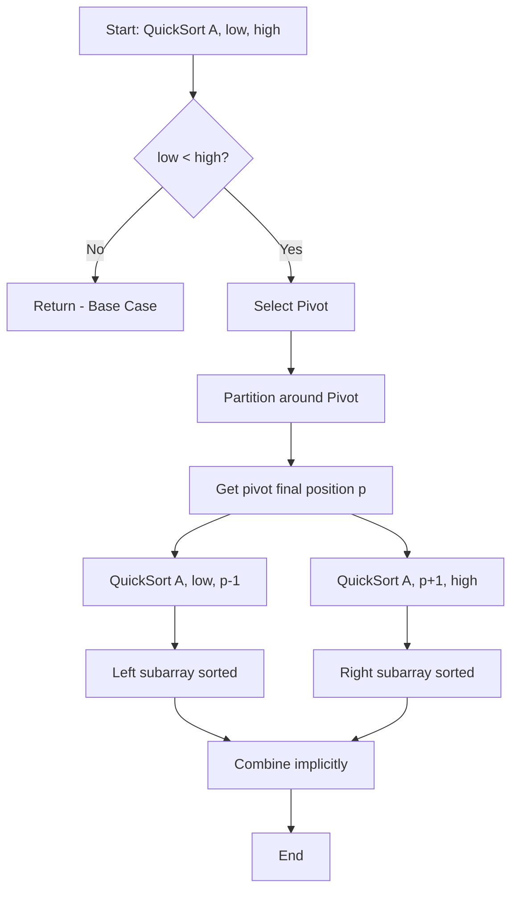
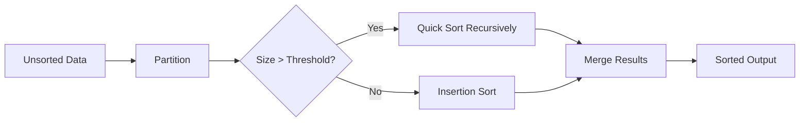

# Quick Sort

## Overview

| Property | Value |
|----------|-------|
| **Category** | Sorting Algorithm (Comparison-Based, Divide and Conquer) |
| **Time Complexity (Best)** | O(n log n) |
| **Time Complexity (Average)** | O(n log n) |
| **Time Complexity (Worst)** | O(n²) |
| **Space Complexity** | O(log n) average, O(n) worst |
| **Stability** | No |
| **In-place** | Yes (with Lomuto/Hoare partition) |
| **Source File** | [`sorts/quick_sort.py`](../../../sorts/quick_sort.py), [`sorts/quick_sort_3_partition.py`](../../../sorts/quick_sort_3_partition.py) |

---

## 1. Mathematical Foundation

### 1.1 Problem Definition

**Sorting Problem:**

$$
\text{Given: } A = \{a_1, a_2, \ldots, a_n\}
$$

$$
\text{Find: } A' = \{a'_1, a'_2, \ldots, a'_n\} \text{ such that } a'_1 \leq a'_2 \leq \ldots \leq a'_n
$$

### 1.2 Core Mathematical Concepts

**Divide and Conquer Paradigm:**

Quick Sort exemplifies the divide-and-conquer strategy:
1. **Divide:** Partition array around a pivot element
2. **Conquer:** Recursively sort sub-arrays
3. **Combine:** No work needed (partitioning does the work)

**Partition Property:**

After partitioning around pivot $p$:

$$
\forall i < k: A[i] \leq p \quad \text{and} \quad \forall i > k: A[i] > p
$$

where $k$ is the final position of the pivot.

### 1.3 Key Formulas

**Average Case Recurrence:**

$$
T(n) = T(k) + T(n - k - 1) + \Theta(n)
$$

where $k$ is the number of elements smaller than the pivot.

**Expected Case (Random Pivot):**

Assuming equally likely pivot positions:

$$
T(n) = \frac{1}{n} \sum_{k=0}^{n-1} [T(k) + T(n-1-k)] + \Theta(n)
$$

$$
T(n) = \frac{2}{n} \sum_{k=0}^{n-1} T(k) + \Theta(n)
$$

**Solution:** $T(n) = O(n \log n)$

**Best Case (Perfect Partition):**

$$
T(n) = 2T(n/2) + \Theta(n)
$$

By Master Theorem (Case 2): $T(n) = \Theta(n \log n)$

**Worst Case (Unbalanced Partition):**

$$
T(n) = T(n-1) + T(0) + \Theta(n) = T(n-1) + \Theta(n)
$$

$$
T(n) = \sum_{i=1}^{n} \Theta(i) = \Theta\left(\frac{n(n+1)}{2}\right) = O(n^2)
$$

### 1.4 Proof of Correctness

**Loop Invariant for Lomuto Partition:**

At the start of each iteration of the main loop:
1. All elements in $A[left..i-1]$ are $\leq$ pivot
2. All elements in $A[i..j-1]$ are $>$ pivot
3. $A[right]$ is the pivot

**Proof by Induction:**

**Initialization:** Before the first iteration, $i = left$ and $j = left$. Both subarrays are empty, so the invariant holds trivially.

**Maintenance:** 
- If $A[j] > pivot$: only $j$ increments, maintaining the invariant
- If $A[j] \leq pivot$: swap $A[i]$ with $A[j]$, increment $i$ and $j$. The element $\leq$ pivot moves to the lower partition.

**Termination:** When $j = right$, all elements are partitioned. The final swap places the pivot in position $i$, and we return $i$ as the pivot's final position.

---

## 2. Algorithm Description

### 2.1 Intuition

Quick Sort works by selecting a "pivot" element and partitioning the array so that:
- Elements smaller than the pivot go to the left
- Elements larger than the pivot go to the right
- The pivot is in its final sorted position

This process is then applied recursively to the sub-arrays.

### 2.2 Key Insights

1. **Pivot Selection is Critical:** Poor pivot choices lead to unbalanced partitions and O(n²) performance
2. **In-Place Partitioning:** Hoare and Lomuto schemes sort without extra arrays
3. **Cache Efficiency:** Good locality of reference makes Quick Sort fast in practice
4. **Tail Recursion:** Can be optimized to reduce stack space

### 2.3 Step-by-Step Process

1. **Base Case:** If array has 0 or 1 elements, it's sorted
2. **Choose Pivot:** Select an element as the pivot
3. **Partition:** Rearrange so elements < pivot are left, > pivot are right
4. **Recurse:** Apply quick sort to left and right partitions
5. **Combine:** Array is now sorted (no explicit combination needed)

---

## 3. Pseudocode

### 3.1 Basic Quick Sort (Not In-Place)

```
ALGORITHM QuickSort(A)
────────────────────────────────────────
INPUT:  A - array of comparable elements
OUTPUT: Sorted array

1.  IF length(A) < 2 THEN
2.      RETURN A
3.  END IF
4.  
5.  pivot ← SELECT_PIVOT(A)
6.  
7.  lesser ← [x for x in A if x < pivot]
8.  equal ← [x for x in A if x = pivot]
9.  greater ← [x for x in A if x > pivot]
10. 
11. RETURN QuickSort(lesser) + equal + QuickSort(greater)
────────────────────────────────────────
```

### 3.2 Lomuto Partition Scheme (In-Place)

```
ALGORITHM QuickSortLomuto(A, low, high)
────────────────────────────────────────
INPUT:  A - array to sort
        low - starting index
        high - ending index
OUTPUT: A sorted in-place

1.  IF low < high THEN
2.      pivotIndex ← Partition(A, low, high)
3.      QuickSortLomuto(A, low, pivotIndex - 1)
4.      QuickSortLomuto(A, pivotIndex + 1, high)
5.  END IF
────────────────────────────────────────

ALGORITHM Partition(A, low, high)
────────────────────────────────────────
1.  pivot ← A[high]
2.  i ← low - 1
3.  
4.  FOR j ← low TO high - 1 DO
5.      IF A[j] ≤ pivot THEN
6.          i ← i + 1
7.          SWAP(A[i], A[j])
8.      END IF
9.  END FOR
10. 
11. SWAP(A[i + 1], A[high])
12. RETURN i + 1
────────────────────────────────────────
```

### 3.3 Three-Way Partition (Dutch National Flag)

```
ALGORITHM QuickSort3Way(A, low, high)
────────────────────────────────────────
INPUT:  A - array with possible duplicates
        low, high - bounds
OUTPUT: A sorted in-place

1.  IF high ≤ low THEN
2.      RETURN
3.  END IF
4.  
5.  lt ← low      // Less than pivot
6.  i ← low       // Current element
7.  gt ← high     // Greater than pivot
8.  pivot ← A[low]
9.  
10. WHILE i ≤ gt DO
11.     IF A[i] < pivot THEN
12.         SWAP(A[lt], A[i])
13.         lt ← lt + 1
14.         i ← i + 1
15.     ELSE IF A[i] > pivot THEN
16.         SWAP(A[gt], A[i])
17.         gt ← gt - 1
18.     ELSE
19.         i ← i + 1
20.     END IF
21. END WHILE
22. 
23. QuickSort3Way(A, low, lt - 1)
24. QuickSort3Way(A, gt + 1, high)
────────────────────────────────────────
```

---

## 4. Complexity Analysis

### 4.1 Time Complexity

| Case | Complexity | Condition |
|------|------------|-----------|
| **Best** | O(n log n) | Pivot always divides array in half |
| **Average** | O(n log n) | Random pivot selection |
| **Worst** | O(n²) | Pivot is always min or max element |

**Detailed Analysis:**

```
Best Case: Perfect Partitions
- Each partition divides array exactly in half
- Recursion depth: log₂(n)
- Work per level: O(n)
- Total: O(n log n)

Worst Case: Maximum Imbalance
- Pivot is always smallest (or largest) element
- Partitions are (0, n-1), (0, n-2), ...
- Forms a chain of n recursive calls
- Work: n + (n-1) + (n-2) + ... + 1 = O(n²)

Average Case:
- Expected partition ratio is good
- Using indicator random variables:
  E[comparisons] = 2n ln n ≈ 1.39n log₂ n
- Total: O(n log n)
```

### 4.2 Space Complexity

| Type | Complexity | Description |
|------|------------|-------------|
| **In-Place (Average)** | O(log n) | Recursion stack depth |
| **In-Place (Worst)** | O(n) | Unbalanced partitions |
| **Not In-Place** | O(n) | Creates new arrays |

**Optimization for Stack Space:**
```python
# Tail-call optimization: always recurse on smaller partition first
if pivot_index - low < high - pivot_index:
    quick_sort(arr, low, pivot_index - 1)
    low = pivot_index + 1  # Tail call elimination
else:
    quick_sort(arr, pivot_index + 1, high)
    high = pivot_index - 1
```

### 4.3 Comparison Counts

**Expected Comparisons:**

$$
C(n) = 2(n+1)H_n - 4n \approx 1.386n\log_2 n
$$

where $H_n = \sum_{i=1}^{n} \frac{1}{i}$ is the $n$-th harmonic number.

---

## 5. Implementation Details

### 5.1 Pivot Selection Strategies

| Strategy | Pros | Cons | Complexity |
|----------|------|------|------------|
| First/Last element | Simple | O(n²) on sorted input | O(1) |
| Random element | Good average case | Requires random gen | O(1) |
| Median of three | Avoids worst case | More comparisons | O(1) |
| Median of medians | Guaranteed O(n log n) | High constant factor | O(n) |

### 5.2 Important Variables

| Variable | Type | Purpose |
|----------|------|---------|
| `pivot` | element | Partitioning reference |
| `low/left` | int | Start of current range |
| `high/right` | int | End of current range |
| `i` | int | Boundary of smaller elements |
| `j` | int | Current element being examined |

### 5.3 Edge Cases

| Edge Case | Expected Behavior | Handling |
|-----------|-------------------|----------|
| Empty array | Return empty | Base case check |
| Single element | Return as-is | Base case check |
| All equal elements | O(n²) with basic, O(n) with 3-way | Use 3-way partition |
| Already sorted | O(n²) with first pivot | Use random/median pivot |
| Reverse sorted | O(n²) with last pivot | Use random/median pivot |

---

## 6. Visual Representation

### 6.1 Algorithm Flow



### 6.2 Partition Process Example

**Array:** `[8, 3, 7, 4, 9, 2, 6, 5]` (pivot = 5, last element)

```
Initial:  [8, 3, 7, 4, 9, 2, 6, 5]
          i=-1                   p=5
          
Step 1: A[0]=8 > 5, no swap
        [8, 3, 7, 4, 9, 2, 6, 5]
         j
         
Step 2: A[1]=3 ≤ 5, i++, swap A[i],A[j]
        [3, 8, 7, 4, 9, 2, 6, 5]
         i  j
         
Step 3: A[2]=7 > 5, no swap
        [3, 8, 7, 4, 9, 2, 6, 5]
         i     j
         
Step 4: A[3]=4 ≤ 5, i++, swap A[i],A[j]
        [3, 4, 7, 8, 9, 2, 6, 5]
            i     j
            
Step 5: A[4]=9 > 5, no swap
Step 6: A[5]=2 ≤ 5, i++, swap A[i],A[j]
        [3, 4, 2, 8, 9, 7, 6, 5]
               i           j
               
Step 7: A[6]=6 > 5, no swap
Final:  swap A[i+1] with pivot
        [3, 4, 2, 5, 9, 7, 6, 8]
                  ^pivot in place

Result: [3, 4, 2] | 5 | [9, 7, 6, 8]
        < pivot    =    > pivot
```

### 6.3 Recursion Tree (Best Case)

```
                    [entire array]
                         |
            ┌────────────┴────────────┐
         [left half]            [right half]
            |                        |
      ┌─────┴─────┐            ┌─────┴─────┐
    [1/4]       [1/4]        [1/4]       [1/4]
      |           |            |           |
     ...         ...          ...         ...
     
Depth: O(log n)
Work per level: O(n)
Total: O(n log n)
```

---

## 7. Comparison with Related Algorithms

| Algorithm | Time (Avg) | Time (Worst) | Space | Stable | In-Place | Cache |
|-----------|------------|--------------|-------|--------|----------|-------|
| **Quick Sort** | O(n log n) | O(n²) | O(log n) | ❌ | ✅ | ⭐⭐⭐ |
| Merge Sort | O(n log n) | O(n log n) | O(n) | ✅ | ❌ | ⭐⭐ |
| Heap Sort | O(n log n) | O(n log n) | O(1) | ❌ | ✅ | ⭐ |
| Intro Sort | O(n log n) | O(n log n) | O(log n) | ❌ | ✅ | ⭐⭐⭐ |

### When to Choose Quick Sort

- ✅ **Average case performance** - Fastest O(n log n) in practice
- ✅ **In-place sorting** - Low memory overhead
- ✅ **Cache efficiency** - Sequential memory access
- ✅ **General purpose** - Works well on diverse inputs
- ❌ **Guaranteed O(n log n)** - Use Merge Sort or Heap Sort
- ❌ **Stability required** - Use Merge Sort
- ❌ **Real-time systems** - Worst case O(n²) unacceptable

---

## 8. Real-World Applications in Software Engineering

### 8.1 Industry Use Cases

| Industry | Application | Why Quick Sort |
|----------|-------------|----------------|
| **Standard Libraries** | C qsort(), Java Arrays.sort() | Fast average case |
| **Databases** | Query result ordering | In-place efficiency |
| **Operating Systems** | Process scheduling | Low memory usage |
| **Graphics** | Z-ordering, depth sorting | Cache-friendly |
| **Competitive Programming** | General sorting | Fast implementation |

### 8.2 Practical Examples

#### Example 1: Database Query Optimization

**Problem:** Sort large result sets efficiently

```python
def sort_query_results(results: list[dict], key: str) -> list[dict]:
    """
    Sort database query results using quick sort.
    In-place sorting saves memory for large result sets.
    
    >>> results = [{'id': 3, 'name': 'C'}, {'id': 1, 'name': 'A'}]
    >>> sort_query_results(results, 'id')
    [{'id': 1, 'name': 'A'}, {'id': 3, 'name': 'C'}]
    """
    def partition(arr, low, high):
        pivot = arr[high][key]
        i = low - 1
        for j in range(low, high):
            if arr[j][key] <= pivot:
                i += 1
                arr[i], arr[j] = arr[j], arr[i]
        arr[i + 1], arr[high] = arr[high], arr[i + 1]
        return i + 1
    
    def quicksort(arr, low, high):
        if low < high:
            pi = partition(arr, low, high)
            quicksort(arr, low, pi - 1)
            quicksort(arr, pi + 1, high)
    
    quicksort(results, 0, len(results) - 1)
    return results
```

#### Example 2: Finding K-th Largest Element (QuickSelect)

**Problem:** Find k-th largest without full sort

```python
import random

def quickselect(arr: list[int], k: int) -> int:
    """
    Find k-th smallest element using partition logic.
    Average O(n), much faster than sorting for this purpose.
    
    >>> quickselect([3, 1, 4, 1, 5, 9, 2, 6], 3)
    2
    """
    def partition(left, right, pivot_idx):
        pivot = arr[pivot_idx]
        arr[pivot_idx], arr[right] = arr[right], arr[pivot_idx]
        store_idx = left
        for i in range(left, right):
            if arr[i] < pivot:
                arr[store_idx], arr[i] = arr[i], arr[store_idx]
                store_idx += 1
        arr[right], arr[store_idx] = arr[store_idx], arr[right]
        return store_idx
    
    left, right = 0, len(arr) - 1
    while True:
        pivot_idx = random.randint(left, right)
        pivot_idx = partition(left, right, pivot_idx)
        if pivot_idx == k - 1:
            return arr[pivot_idx]
        elif pivot_idx < k - 1:
            left = pivot_idx + 1
        else:
            right = pivot_idx - 1
```

### 8.3 Libraries and Frameworks

| Library/Framework | Language | Implementation Details |
|-------------------|----------|----------------------|
| **C stdlib qsort()** | C | Uses Quick Sort variant |
| **Java Arrays.sort()** | Java | Dual-pivot Quick Sort for primitives |
| **Python sorted()** | Python | Tim Sort (not Quick Sort) |
| **C++ std::sort** | C++ | Intro Sort (Quick Sort + Heap Sort) |
| **Go sort.Sort()** | Go | Pattern-defeating Quick Sort |

### 8.4 System Design Integration



**Hybrid Approach (Intro Sort):**
- Use Quick Sort for initial partitioning
- Switch to Heap Sort if recursion depth exceeds $2 \log n$
- Use Insertion Sort for small subarrays (n < 16)

---

## 9. Optimizations and Variants

### 9.1 Common Optimizations

| Optimization | Benefit | Implementation |
|--------------|---------|----------------|
| **Random pivot** | Avoids worst case | `pivot = arr[random.randint(low, high)]` |
| **Median of three** | Better pivot choice | `pivot = median(arr[low], arr[mid], arr[high])` |
| **Insertion sort cutoff** | Faster for small n | `if high - low < 10: insertion_sort()` |
| **Tail recursion** | Reduce stack space | Iterate on larger partition |
| **Three-way partition** | Handle duplicates | Dutch National Flag algorithm |

### 9.2 Popular Variants

1. **Dual-Pivot Quick Sort** (Java 7+)
   - Uses two pivots, creating three partitions
   - Fewer comparisons on average
   - Better cache performance

2. **Intro Sort** (C++ STL)
   - Quick Sort with depth limit
   - Falls back to Heap Sort
   - Guaranteed O(n log n)

3. **Pattern-Defeating Quick Sort** (pdqsort)
   - Detects and handles patterns
   - Used in Rust's standard library
   - Near-linear on many real-world inputs

4. **Block Quick Sort**
   - Reduces branch mispredictions
   - Better for modern CPUs

---

## 10. References

### Academic Sources
- Hoare, C.A.R. (1962). "Quicksort". *Computer Journal*, 5(1), 10-16.
- Sedgewick, R. (1978). "Implementing Quicksort Programs". *Communications of the ACM*, 21(10).
- Bentley, J. & McIlroy, D. (1993). "Engineering a Sort Function". *Software: Practice and Experience*, 23(11).
- Yaroslavskiy, V. (2009). "Dual-Pivot Quicksort Algorithm".

### Online Resources
- [Wikipedia: Quicksort](https://en.wikipedia.org/wiki/Quicksort)
- [VisuAlgo: Sorting](https://visualgo.net/en/sorting)
- [Brilliant: Quick Sort](https://brilliant.org/wiki/quick-sort/)

### Books
- Cormen, T. H. et al. *Introduction to Algorithms*, Chapter 7.
- Sedgewick, R. *Algorithms*, Chapter 2.3.

---

*Last Updated: December 2024*
*Implementation: [sorts/quick_sort.py](../../../sorts/quick_sort.py)*
