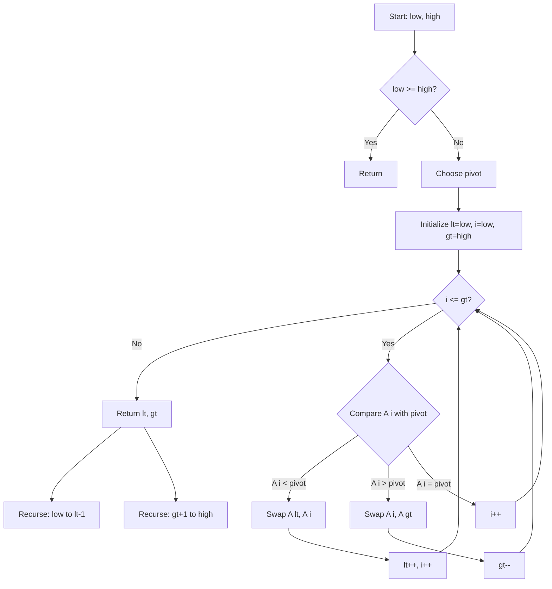

# Quick Sort 3-Way Partition

## Overview

| Property | Value |
|----------|-------|
| **Category** | Sorting Algorithm |
| **Type** | Comparison-Based (Divide and Conquer) |
| **Data Structure** | Array |
| **Space Complexity** | O(log n) |
| **Stable** | No |
| **In-Place** | Yes |
| **Variants** | 3-Way Partition, Lomuto, Radix QuickSort |

---

## Mathematical Foundation

### Standard QuickSort Problem

Standard 2-way partition quicksort has poor performance when:
- Array contains many duplicate elements
- All elements are equal: $O(n^2)$

### 3-Way Partition Solution

**Dutch National Flag** partitioning divides array into three regions:
- **Less than pivot**: Elements < pivot
- **Equal to pivot**: Elements = pivot
- **Greater than pivot**: Elements > pivot

### Formal Definition

For array $A[l..r]$ with pivot $p$:
$$\text{Partition}(A, l, r, p) \rightarrow (lt, gt)$$

Where:
- $A[l..lt-1] < p$ (all elements less than pivot)
- $A[lt..gt] = p$ (all elements equal to pivot)
- $A[gt+1..r] > p$ (all elements greater than pivot)

### Entropy-Optimal Partitioning

For array with $k$ distinct values, each appearing $n_i$ times:
$$H = -\sum_{i=1}^{k} \frac{n_i}{n} \log_2 \frac{n_i}{n}$$

3-way partitioning achieves:
$$T(n) = O(n \cdot H)$$

For many duplicates ($H \ll \log n$), this is significantly better than $O(n \log n)$.

---

## Pseudocode

### 3-Way Partition (Dutch National Flag)

```
QUICK-SORT-3-WAY(A, low, high):
    Input: Array A, indices low and high
    Output: Sorted subarray A[low..high]
    
    if low >= high:
        return
    
    // 3-way partition
    lt, gt ← PARTITION-3-WAY(A, low, high)
    
    // Recursively sort elements less than pivot
    QUICK-SORT-3-WAY(A, low, lt - 1)
    
    // Elements equal to pivot are already in place
    
    // Recursively sort elements greater than pivot
    QUICK-SORT-3-WAY(A, gt + 1, high)


PARTITION-3-WAY(A, low, high):
    // Choose pivot (e.g., first element)
    pivot ← A[low]
    
    lt ← low      // A[low..lt-1] < pivot
    i ← low       // A[lt..i-1] = pivot
    gt ← high     // A[gt+1..high] > pivot
    
    while i ≤ gt:
        if A[i] < pivot:
            swap(A[lt], A[i])
            lt ← lt + 1
            i ← i + 1
        else if A[i] > pivot:
            swap(A[i], A[gt])
            gt ← gt - 1
        else:  // A[i] == pivot
            i ← i + 1
    
    return lt, gt
```

### Lomuto Partition Scheme

```
PARTITION-LOMUTO(A, low, high):
    Input: Array A, indices low and high
    Output: Index of pivot in final position
    
    pivot ← A[high]  // Last element as pivot
    i ← low - 1      // Index of smaller element
    
    for j ← low to high - 1:
        if A[j] ≤ pivot:
            i ← i + 1
            swap(A[i], A[j])
    
    swap(A[i + 1], A[high])
    return i + 1
```

### 3-Way Radix QuickSort

```
THREE-WAY-RADIX-QUICKSORT(strings, low, high, depth):
    Input: Array of strings, indices, character depth
    Output: Sorted strings
    
    if low >= high:
        return
    
    // Partition by character at position depth
    lt, gt ← PARTITION-BY-CHAR(strings, low, high, depth)
    
    // Sort strings with smaller character
    THREE-WAY-RADIX-QUICKSORT(strings, low, lt - 1, depth)
    
    // Sort strings with equal character at next depth
    if char_at(strings[lt], depth) ≠ -1:  // Not end of string
        THREE-WAY-RADIX-QUICKSORT(strings, lt, gt, depth + 1)
    
    // Sort strings with larger character
    THREE-WAY-RADIX-QUICKSORT(strings, gt + 1, high, depth)
```

---

## Complexity Analysis

### Time Complexity

| Case | 3-Way Partition | Standard QuickSort |
|------|-----------------|-------------------|
| **Best** | $O(n)$ | $O(n \log n)$ |
| **Average** | $O(n \log n)$ | $O(n \log n)$ |
| **Worst** | $O(n \log n)$* | $O(n^2)$ |
| **All Equal** | $O(n)$ | $O(n^2)$ |

*With randomization or median-of-three pivot selection

### Space Complexity

| Component | Space |
|-----------|-------|
| Recursion stack | O(log n) average |
| Variables | O(1) |
| **Total** | O(log n) |

### Comparison: Partition Schemes

| Scheme | Swaps | Comparisons | Duplicates |
|--------|-------|-------------|------------|
| Hoare | Fewer | More | O(n log n) |
| Lomuto | More | n-1 | O(n²) |
| 3-Way | Moderate | n-1 | O(n) |

---

## Visual Representation

### 3-Way Partition Process

```
Input: [4, 9, 4, 4, 1, 9, 4, 4, 9, 4]
Pivot: 4

Initial:
  lt=0    i=0                   gt=9
   ↓      ↓                      ↓
  [4, 9, 4, 4, 1, 9, 4, 4, 9, 4]
   
Step 1: A[i]=4 = pivot → i++
  lt=0       i=1                gt=9
   ↓         ↓                   ↓
  [4, 9, 4, 4, 1, 9, 4, 4, 9, 4]

Step 2: A[i]=9 > pivot → swap(A[i], A[gt]), gt--
  lt=0       i=1             gt=8
   ↓         ↓                ↓
  [4, 4, 4, 4, 1, 9, 4, 4, 9, 9]

... (continue partitioning)

Final:
  [1] [4, 4, 4, 4, 4, 4] [9, 9, 9]
   <        =               >
  lt=1    i=7              gt=6
```

### Algorithm Flow



### Partition Regions

```
Array after 3-way partition:

┌─────────────────┬─────────────────┬─────────────────┐
│    < pivot      │    = pivot      │    > pivot      │
│   (unsorted)    │   (done!)       │   (unsorted)    │
└─────────────────┴─────────────────┴─────────────────┘
 low           lt-1 lt           gt gt+1          high

Only the < and > regions need further sorting!
```

---

## Implementation Details

### Python Implementation (3-Way Partition)

```python
from __future__ import annotations


def quick_sort_3partition(
    sorting: list, left: int = 0, right: int = -1
) -> list:
    """
    3-way partition quicksort for arrays with duplicates.
    
    >>> quick_sort_3partition([])
    []
    >>> quick_sort_3partition([1])
    [1]
    >>> quick_sort_3partition([2, 1, 3])
    [1, 2, 3]
    >>> quick_sort_3partition([4, 1, 4, 4, 2, 4, 3])
    [1, 2, 3, 4, 4, 4, 4]
    >>> quick_sort_3partition([1, 1, 1, 1])
    [1, 1, 1, 1]
    """
    if right == -1:
        right = len(sorting) - 1
    
    if right <= left:
        return sorting
    
    # 3-way partition
    a = left
    b = right
    pivot = sorting[left]
    i = left
    
    while i <= b:
        if sorting[i] < pivot:
            sorting[a], sorting[i] = sorting[i], sorting[a]
            a += 1
            i += 1
        elif sorting[i] > pivot:
            sorting[b], sorting[i] = sorting[i], sorting[b]
            b -= 1
        else:
            i += 1
    
    # Recursively sort partitions
    quick_sort_3partition(sorting, left, a - 1)
    quick_sort_3partition(sorting, b + 1, right)
    
    return sorting
```

### Lomuto Partition Implementation

```python
def quick_sort_lomuto_partition(
    sorting: list, left: int = 0, right: int = -1
) -> list:
    """
    Quick sort using Lomuto partition scheme.
    
    >>> quick_sort_lomuto_partition([])
    []
    >>> quick_sort_lomuto_partition([1])
    [1]
    >>> quick_sort_lomuto_partition([5, 3, 8, 1, 9, 2])
    [1, 2, 3, 5, 8, 9]
    >>> quick_sort_lomuto_partition([3, 3, 3, 3])
    [3, 3, 3, 3]
    """
    if right == -1:
        right = len(sorting) - 1
    
    if left < right:
        pivot_index = lomuto_partition(sorting, left, right)
        quick_sort_lomuto_partition(sorting, left, pivot_index - 1)
        quick_sort_lomuto_partition(sorting, pivot_index + 1, right)
    
    return sorting


def lomuto_partition(sorting: list, left: int, right: int) -> int:
    """
    Lomuto partition: use last element as pivot.
    """
    pivot = sorting[right]
    i = left - 1
    
    for j in range(left, right):
        if sorting[j] <= pivot:
            i += 1
            sorting[i], sorting[j] = sorting[j], sorting[i]
    
    sorting[i + 1], sorting[right] = sorting[right], sorting[i + 1]
    return i + 1
```

### 3-Way Radix QuickSort for Strings

```python
def three_way_radix_quicksort(strings: list[str]) -> list[str]:
    """
    3-way radix quicksort optimized for strings.
    
    >>> three_way_radix_quicksort(['dog', 'cat', 'car', 'cab'])
    ['cab', 'car', 'cat', 'dog']
    >>> three_way_radix_quicksort(['a', 'ab', 'abc', 'b'])
    ['a', 'ab', 'abc', 'b']
    >>> three_way_radix_quicksort([])
    []
    """
    if len(strings) <= 1:
        return strings
    
    result = strings.copy()
    _radix_quicksort(result, 0, len(result) - 1, 0)
    return result


def _radix_quicksort(strings: list[str], low: int, high: int, depth: int) -> None:
    """Recursive 3-way radix quicksort."""
    if low >= high:
        return
    
    # Get character at depth (or -1 if past end)
    def char_at(s: str, d: int) -> int:
        return ord(s[d]) if d < len(s) else -1
    
    lt = low
    gt = high
    pivot = char_at(strings[low], depth)
    i = low + 1
    
    while i <= gt:
        c = char_at(strings[i], depth)
        if c < pivot:
            strings[lt], strings[i] = strings[i], strings[lt]
            lt += 1
            i += 1
        elif c > pivot:
            strings[gt], strings[i] = strings[i], strings[gt]
            gt -= 1
        else:
            i += 1
    
    # Recursively sort three partitions
    _radix_quicksort(strings, low, lt - 1, depth)
    if pivot >= 0:  # Not at end of strings
        _radix_quicksort(strings, lt, gt, depth + 1)
    _radix_quicksort(strings, gt + 1, high, depth)
```

---

## Real-World Applications

### 1. **Sorting Data with Many Duplicates**

**Use Case**: Database columns with limited distinct values.

```python
def sort_enum_column(records: list[dict], column: str) -> list[dict]:
    """
    Sort records by an enum column with few distinct values.
    
    3-way quicksort excels when values repeat frequently.
    """
    n = len(records)
    if n <= 1:
        return records
    
    # Use 3-way partition for efficient duplicate handling
    return _sort_by_column(records.copy(), column, 0, n - 1)


def _sort_by_column(records: list, column: str, low: int, high: int) -> list:
    if low >= high:
        return records
    
    # 3-way partition
    lt = low
    gt = high
    pivot = records[low][column]
    i = low
    
    while i <= gt:
        val = records[i][column]
        if val < pivot:
            records[lt], records[i] = records[i], records[lt]
            lt += 1
            i += 1
        elif val > pivot:
            records[gt], records[i] = records[i], records[gt]
            gt -= 1
        else:
            i += 1
    
    _sort_by_column(records, column, low, lt - 1)
    _sort_by_column(records, column, gt + 1, high)
    
    return records


# Example: Sorting user statuses
users = [
    {"name": "Alice", "status": "active"},
    {"name": "Bob", "status": "inactive"},
    {"name": "Carol", "status": "active"},
    {"name": "David", "status": "pending"},
    {"name": "Eve", "status": "active"},
]
```

### 2. **Color/Category Sorting**

**Use Case**: Sorting items by limited categories.

```python
def sort_inventory_by_category(items: list[dict]) -> list[dict]:
    """
    Sort inventory items by category using 3-way partition.
    
    Efficient when categories are limited (e.g., Electronics, Clothing, Food).
    
    >>> items = [
    ...     {"name": "TV", "category": "Electronics"},
    ...     {"name": "Shirt", "category": "Clothing"},
    ...     {"name": "Laptop", "category": "Electronics"},
    ...     {"name": "Apple", "category": "Food"},
    ... ]
    >>> sorted_items = sort_inventory_by_category(items)
    >>> [item["category"] for item in sorted_items]
    ['Clothing', 'Electronics', 'Electronics', 'Food']
    """
    if len(items) <= 1:
        return items
    
    result = items.copy()
    _partition_by_category(result, 0, len(result) - 1)
    return result


def _partition_by_category(items, low, high):
    if low >= high:
        return
    
    lt, gt = low, high
    pivot = items[low]["category"]
    i = low
    
    while i <= gt:
        cat = items[i]["category"]
        if cat < pivot:
            items[lt], items[i] = items[i], items[lt]
            lt += 1
            i += 1
        elif cat > pivot:
            items[gt], items[i] = items[i], items[gt]
            gt -= 1
        else:
            i += 1
    
    _partition_by_category(items, low, lt - 1)
    _partition_by_category(items, gt + 1, high)
```

### 3. **String Sorting in Bioinformatics**

**Use Case**: Sorting DNA sequences with limited alphabet.

```python
def sort_dna_sequences(sequences: list[str]) -> list[str]:
    """
    Sort DNA sequences using 3-way radix quicksort.
    
    DNA has only 4 characters (A, C, G, T), making
    3-way partition extremely efficient.
    
    >>> sort_dna_sequences(['ACGT', 'AACG', 'GCTA', 'ACGA'])
    ['AACG', 'ACGA', 'ACGT', 'GCTA']
    """
    return three_way_radix_quicksort(sequences)


def find_similar_sequences(sequences: list[str], threshold: int) -> list[tuple]:
    """
    Find similar DNA sequences after sorting.
    
    Sorting brings similar sequences together for efficient comparison.
    """
    sorted_seqs = sort_dna_sequences(sequences)
    similar_pairs = []
    
    for i in range(len(sorted_seqs) - 1):
        # Compare adjacent sequences (likely similar after sorting)
        if hamming_distance(sorted_seqs[i], sorted_seqs[i + 1]) <= threshold:
            similar_pairs.append((sorted_seqs[i], sorted_seqs[i + 1]))
    
    return similar_pairs


def hamming_distance(s1: str, s2: str) -> int:
    """Count positions where characters differ."""
    if len(s1) != len(s2):
        return max(len(s1), len(s2))
    return sum(c1 != c2 for c1, c2 in zip(s1, s2))
```

### 4. **Priority Queue Preprocessing**

**Use Case**: Grouping items by priority level.

```python
class PriorityProcessor:
    """
    Process items grouped by priority using 3-way partition.
    """
    
    PRIORITIES = {"critical": 0, "high": 1, "medium": 2, "low": 3}
    
    def __init__(self, items: list[dict]):
        self.items = items
    
    def partition_by_priority(self) -> dict[str, list]:
        """
        Partition items by priority level.
        
        Returns dict mapping priority to items.
        """
        result = self.items.copy()
        
        # Multi-level 3-way partition
        groups = {p: [] for p in self.PRIORITIES}
        self._partition(result, 0, len(result) - 1, groups)
        
        return groups
    
    def _partition(self, items, low, high, groups):
        if low > high:
            return
        
        lt, gt = low, high
        pivot_priority = self.PRIORITIES[items[low]["priority"]]
        i = low
        
        while i <= gt:
            item_priority = self.PRIORITIES[items[i]["priority"]]
            if item_priority < pivot_priority:
                items[lt], items[i] = items[i], items[lt]
                lt += 1
                i += 1
            elif item_priority > pivot_priority:
                items[gt], items[i] = items[i], items[gt]
                gt -= 1
            else:
                groups[items[i]["priority"]].append(items[i])
                i += 1
        
        self._partition(items, low, lt - 1, groups)
        self._partition(items, gt + 1, high, groups)


# Example usage
tasks = [
    {"name": "Fix bug", "priority": "critical"},
    {"name": "Write docs", "priority": "low"},
    {"name": "Code review", "priority": "high"},
    {"name": "Deploy", "priority": "critical"},
]
```

---

## Advantages and Disadvantages

### ✅ Advantages of 3-Way Partition

1. **Handles duplicates efficiently** - O(n) for all equal
2. **In-place** - O(log n) extra space
3. **Cache efficient** - good locality
4. **Optimal for low entropy** - adapts to data
5. **Practical speedup** - 20-30% faster on real data

### ❌ Disadvantages

1. **Slightly more complex** - than standard partition
2. **Not stable** - order of equal elements may change
3. **Still O(n²) worst case** - without randomization
4. **Extra bookkeeping** - three pointers vs two

### Lomuto vs Hoare vs 3-Way

| Aspect | Lomuto | Hoare | 3-Way |
|--------|--------|-------|-------|
| Simplicity | Simple | Moderate | Moderate |
| Swaps | More | Fewer | Moderate |
| Duplicates | Poor | Fair | Excellent |
| Cache | Good | Good | Good |

---

## References

1. [Wikipedia: Quicksort](https://en.wikipedia.org/wiki/Quicksort)
2. Bentley, McIlroy - "Engineering a Sort Function"
3. Sedgewick - "Algorithms" (3-way partitioning)

---

## See Also

- [Quick Sort](quick_sort.md) - Standard quicksort
- [Dutch National Flag Sort](dutch_national_flag_sort.md) - Related partition
- [Merge Sort](merge_sort.md) - Stable alternative
