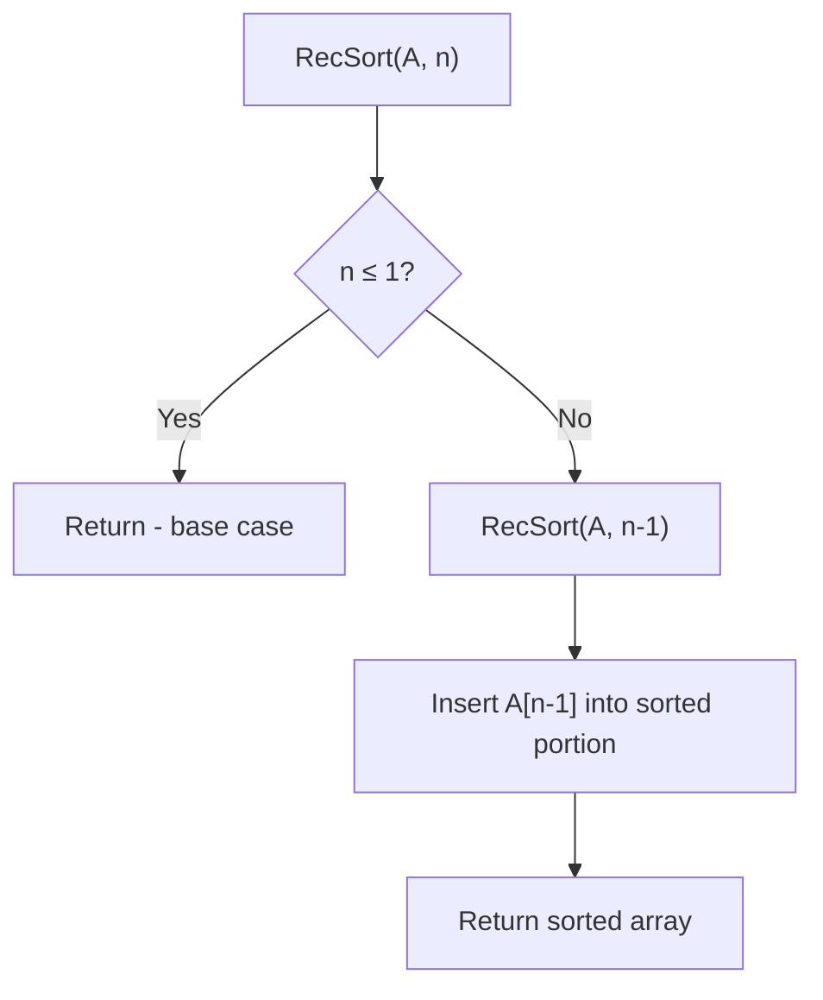

# Recursive Insertion Sort

## Overview

| Property | Value |
|----------|-------|
| **Category** | Sorting Algorithm |
| **Type** | Comparison-Based (Insertion) |
| **Data Structure** | Array |
| **Space Complexity** | O(n) recursion stack |
| **Stable** | Yes |
| **In-Place** | Yes |
| **Paradigm** | Recursion |

---

## Mathematical Foundation

### Definition

**Recursive Insertion Sort** is a recursive implementation of the insertion sort algorithm. Instead of using iteration, it uses recursion to sort progressively larger portions of the array.

### Algorithm Principle

**Iterative Insertion Sort:**
```
for i = 1 to n-1:
    insert A[i] into sorted portion A[0..i-1]
```

**Recursive Insertion Sort:**
```
RecSort(A, n):
    if n ≤ 1: return
    RecSort(A, n-1)          // Sort first n-1 elements
    Insert A[n-1] into sorted A[0..n-2]
```

### Mathematical Recurrence

**Time Recurrence:**
$$T(n) = T(n-1) + O(n)$$

Solving: $T(n) = T(n-1) + cn$
- $T(n) = T(n-2) + c(n-1) + cn$
- $T(n) = c(1 + 2 + ... + n) = c \cdot \frac{n(n+1)}{2}$
- $T(n) = O(n^2)$

**Space Recurrence:**
$$S(n) = S(n-1) + O(1) = O(n)$$

### Induction Proof

**Claim:** After `RecSort(A, k)`, the first k elements are sorted.

**Base case:** k = 1 — single element is trivially sorted ✓

**Inductive step:** Assume first k-1 elements are sorted after `RecSort(A, k-1)`.
- We insert A[k-1] into its correct position in A[0..k-2]
- Result: A[0..k-1] is sorted ✓

By induction, `RecSort(A, n)` sorts the entire array.

---

## Pseudocode

```
RECURSIVE-INSERTION-SORT(A, n):
    Input: Array A, length n
    Output: A sorted in ascending order
    
    // Base case
    if n ≤ 1:
        return
    
    // Recursive case: sort first n-1 elements
    RECURSIVE-INSERTION-SORT(A, n - 1)
    
    // Insert last element into sorted portion
    INSERT-NEXT(A, n - 1)


INSERT-NEXT(A, index):
    // Insert element at 'index' into sorted A[0..index-1]
    
    // Base case: at beginning or in correct position
    if index = 0 OR A[index - 1] ≤ A[index]:
        return
    
    // Swap with previous element
    swap A[index - 1] and A[index]
    
    // Continue inserting recursively
    INSERT-NEXT(A, index + 1)
```

### Alternative: Tail-Recursive Version

```
REC-INSERT-SORT-TAIL(A, i, n):
    if i ≥ n:
        return
    
    INSERT(A, i)
    REC-INSERT-SORT-TAIL(A, i + 1, n)


INSERT(A, i):
    key ← A[i]
    j ← i - 1
    
    while j ≥ 0 AND A[j] > key:
        A[j + 1] ← A[j]
        j ← j - 1
    
    A[j + 1] ← key
```

---

## Complexity Analysis

### Time Complexity

| Case | Complexity | Notes |
|------|------------|-------|
| **Best** | $O(n)$ | Already sorted |
| **Average** | $O(n^2)$ | Random order |
| **Worst** | $O(n^2)$ | Reverse sorted |

Same as iterative version.

### Space Complexity

| Version | Space |
|---------|-------|
| Recursive | $O(n)$ - recursion stack |
| Iterative | $O(1)$ |

**Key difference:** Recursive version uses O(n) stack space.

### Comparison

| Aspect | Recursive | Iterative |
|--------|-----------|-----------|
| Time | $O(n^2)$ | $O(n^2)$ |
| Space | $O(n)$ | $O(1)$ |
| Clarity | More elegant | More practical |
| Performance | Slower (overhead) | Faster |

---

## Visual Representation

### Recursion Tree

```
RecSort([4, 3, 2, 1], 4)
│
├── RecSort([4, 3, 2, 1], 3)
│   │
│   ├── RecSort([4, 3, 2, 1], 2)
│   │   │
│   │   ├── RecSort([4, 3, 2, 1], 1) → return (base case)
│   │   │
│   │   └── Insert A[1]=3 into [4]
│   │       Result: [3, 4, 2, 1]
│   │
│   └── Insert A[2]=2 into [3, 4]
│       Result: [2, 3, 4, 1]
│
└── Insert A[3]=1 into [2, 3, 4]
    Result: [1, 2, 3, 4]
```

### Algorithm Flow



### Step-by-Step Example

```
Input: [4, 3, 2, 1]

Call Stack (going down):
RecSort([4,3,2,1], 4) → calls RecSort(3)
  RecSort([4,3,2,1], 3) → calls RecSort(2)
    RecSort([4,3,2,1], 2) → calls RecSort(1)
      RecSort([4,3,2,1], 1) → return (base)
    Insert A[1]=3: [4,3] → [3,4,2,1]
  Insert A[2]=2: [3,4,2] → [2,3,4,1]
Insert A[3]=1: [2,3,4,1] → [1,2,3,4]

Result: [1, 2, 3, 4]
```

---

## Implementation Details

### Python Implementation

```python
from __future__ import annotations


def rec_insertion_sort(collection: list, n: int) -> None:
    """
    Given a collection and its length, sorts in ascending order.

    :param collection: A mutable collection of comparable elements
    :param n: The length of collection

    >>> col = [1, 2, 1]
    >>> rec_insertion_sort(col, len(col))
    >>> col
    [1, 1, 2]

    >>> col = [2, 1, 0, -1, -2]
    >>> rec_insertion_sort(col, len(col))
    >>> col
    [-2, -1, 0, 1, 2]

    >>> col = [1]
    >>> rec_insertion_sort(col, len(col))
    >>> col
    [1]
    """
    # Base case
    if len(collection) <= 1 or n <= 1:
        return

    # Recursive call to sort first n-1 elements
    insert_next(collection, n - 1)
    rec_insertion_sort(collection, n - 1)


def insert_next(collection: list, index: int) -> None:
    """
    Inserts the element at 'index' into its correct position.

    >>> col = [3, 2, 4, 2]
    >>> insert_next(col, 1)
    >>> col
    [2, 3, 4, 2]
    """
    # Base case: at beginning or already in place
    if index >= len(collection) or collection[index - 1] <= collection[index]:
        return

    # Swap and continue
    collection[index - 1], collection[index] = (
        collection[index],
        collection[index - 1],
    )

    insert_next(collection, index + 1)
```

### Alternative Implementation

```python
def recursive_insertion_sort_v2(arr: list, n: int = None) -> list:
    """
    Alternative recursive insertion sort.
    
    >>> recursive_insertion_sort_v2([5, 3, 8, 1])
    [1, 3, 5, 8]
    >>> recursive_insertion_sort_v2([])
    []
    """
    if n is None:
        n = len(arr)
    
    # Base case
    if n <= 1:
        return arr
    
    # Sort first n-1 elements
    recursive_insertion_sort_v2(arr, n - 1)
    
    # Insert last element into sorted portion
    key = arr[n - 1]
    j = n - 2
    
    while j >= 0 and arr[j] > key:
        arr[j + 1] = arr[j]
        j -= 1
    
    arr[j + 1] = key
    
    return arr
```

### Fully Recursive Insert

```python
def full_recursive_sort(arr: list, n: int = None) -> list:
    """
    Fully recursive version (both sort and insert are recursive).
    
    >>> full_recursive_sort([4, 2, 5, 1, 3])
    [1, 2, 3, 4, 5]
    """
    if n is None:
        n = len(arr)
    
    if n <= 1:
        return arr
    
    # Sort first n-1
    full_recursive_sort(arr, n - 1)
    
    # Recursively insert arr[n-1]
    _recursive_insert(arr, n - 1)
    
    return arr


def _recursive_insert(arr: list, i: int) -> None:
    """Recursively insert arr[i] into sorted arr[0..i-1]."""
    if i == 0 or arr[i - 1] <= arr[i]:
        return
    
    arr[i - 1], arr[i] = arr[i], arr[i - 1]
    _recursive_insert(arr, i - 1)
```

---

## Real-World Applications

### 1. **Educational Tool**

**Use Case**: Teaching recursion and sorting concepts.

```python
def educational_recursive_sort(arr: list, n: int = None, depth: int = 0) -> list:
    """
    Educational version that shows recursion depth.
    
    >>> educational_recursive_sort([3, 1, 2])
    Depth 0: Sorting first 3 elements
    Depth 1: Sorting first 2 elements
    Depth 2: Sorting first 1 elements
    Depth 2: Base case reached
    Depth 1: Inserting element at position 1
    Depth 0: Inserting element at position 2
    [1, 2, 3]
    """
    if n is None:
        n = len(arr)
    
    indent = "  " * depth
    print(f"{indent}Depth {depth}: Sorting first {n} elements")
    
    if n <= 1:
        print(f"{indent}Depth {depth}: Base case reached")
        return arr
    
    educational_recursive_sort(arr, n - 1, depth + 1)
    
    print(f"{indent}Depth {depth}: Inserting element at position {n-1}")
    
    key = arr[n - 1]
    j = n - 2
    while j >= 0 and arr[j] > key:
        arr[j + 1] = arr[j]
        j -= 1
    arr[j + 1] = key
    
    return arr
```

### 2. **Functional Programming Style**

**Use Case**: Demonstrating functional patterns.

```python
def functional_insertion_sort(arr: list) -> list:
    """
    Pure functional style recursive insertion sort.
    Returns new sorted list.
    
    >>> functional_insertion_sort([4, 2, 5, 1])
    [1, 2, 4, 5]
    """
    def insert(elem, sorted_list):
        """Insert elem into sorted_list maintaining order."""
        if not sorted_list or elem <= sorted_list[0]:
            return [elem] + sorted_list
        return [sorted_list[0]] + insert(elem, sorted_list[1:])
    
    def sort(lst):
        """Recursively sort the list."""
        if len(lst) <= 1:
            return lst
        return insert(lst[-1], sort(lst[:-1]))
    
    return sort(arr)
```

### 3. **Small Dataset Sorting in Recursive Algorithms**

**Use Case**: Base case in divide-and-conquer algorithms.

```python
def hybrid_sort(arr: list, threshold: int = 10) -> list:
    """
    Hybrid sort using recursive insertion for small subarrays.
    
    >>> hybrid_sort([5, 2, 8, 1, 9, 3, 7, 4, 6])
    [1, 2, 3, 4, 5, 6, 7, 8, 9]
    """
    def merge_sort(arr, left, right):
        if right - left <= threshold:
            # Use recursive insertion sort for small arrays
            subarr = arr[left:right+1]
            recursive_insertion_sort_v2(subarr)
            arr[left:right+1] = subarr
            return
        
        mid = (left + right) // 2
        merge_sort(arr, left, mid)
        merge_sort(arr, mid + 1, right)
        merge(arr, left, mid, right)
    
    def merge(arr, left, mid, right):
        # Standard merge operation
        L = arr[left:mid+1]
        R = arr[mid+1:right+1]
        i = j = 0
        k = left
        while i < len(L) and j < len(R):
            if L[i] <= R[j]:
                arr[k] = L[i]
                i += 1
            else:
                arr[k] = R[j]
                j += 1
            k += 1
        while i < len(L):
            arr[k] = L[i]
            i += 1
            k += 1
        while j < len(R):
            arr[k] = R[j]
            j += 1
            k += 1
    
    result = arr.copy()
    merge_sort(result, 0, len(result) - 1)
    return result
```

---

## Advantages and Disadvantages

### ✅ Advantages

1. **Elegant and clear** - demonstrates recursion beautifully
2. **Stable** - maintains relative order
3. **Educational value** - excellent for teaching
4. **Natural recursive structure**

### ❌ Disadvantages

1. **O(n) stack space** - can cause stack overflow
2. **Function call overhead** - slower than iterative
3. **Not tail-recursive** - can't be optimized by compiler
4. **Impractical** for large arrays

---

## Comparison

| Aspect | Recursive | Iterative |
|--------|-----------|-----------|
| **Time** | O(n²) | O(n²) |
| **Space** | O(n) | O(1) |
| **Speed** | Slower | Faster |
| **Clarity** | Higher | Lower |
| **Stack Risk** | Yes | No |

---

## References

1. [Wikipedia: Insertion Sort](https://en.wikipedia.org/wiki/Insertion_sort)
2. CLRS "Introduction to Algorithms"
3. [Recursive Algorithms](https://en.wikipedia.org/wiki/Recursion_(computer_science))

---

## See Also

- [Insertion Sort](insertion_sort.md) - Iterative version
- [Binary Insertion Sort](binary_insertion_sort.md) - Optimized version
- [Merge Sort](merge_sort.md) - Another recursive sort

