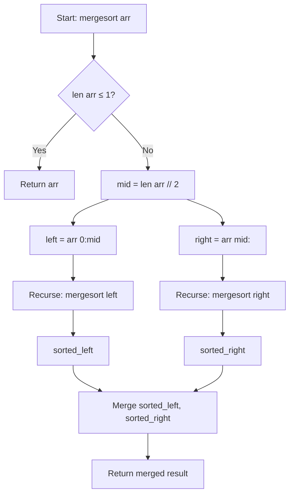

# Recursive Merge Sort (Array)

## Overview

| Property | Value |
|----------|-------|
| **Category** | Sorting Algorithm |
| **Type** | Comparison-Based (Divide and Conquer) |
| **Data Structure** | Array |
| **Space Complexity** | O(n) |
| **Stable** | Yes |
| **In-Place** | No |
| **Paradigm** | Top-Down / Recursive |

---

## Mathematical Foundation

### Definition

**Recursive Merge Sort** is the classic top-down implementation of merge sort. It recursively divides the array into halves until reaching single elements, then merges sorted subarrays back together.

### Divide and Conquer Paradigm

1. **Divide**: Split array into two halves
2. **Conquer**: Recursively sort each half
3. **Combine**: Merge two sorted halves

### Recurrence Relation

$$T(n) = 2T\left(\frac{n}{2}\right) + O(n)$$

Where:
- $2T(n/2)$: Two recursive calls on halves
- $O(n)$: Linear time to merge

### Master Theorem Solution

For $T(n) = aT(n/b) + f(n)$:
- $a = 2$, $b = 2$, $f(n) = O(n)$
- $n^{\log_b a} = n^{\log_2 2} = n^1 = n$
- Since $f(n) = \Theta(n^{\log_b a})$, Case 2 applies:

$$T(n) = \Theta(n \log n)$$

### Merge Operation Mathematics

Given sorted arrays $L[1..n_1]$ and $R[1..n_2]$:

$$\text{Merge}(L, R) = \begin{cases}
[] & \text{if } L = [] \land R = [] \\
L & \text{if } R = [] \\
R & \text{if } L = [] \\
[L[1]] + \text{Merge}(L[2..], R) & \text{if } L[1] \leq R[1] \\
[R[1]] + \text{Merge}(L, R[2..]) & \text{otherwise}
\end{cases}$$

---

## Pseudocode

```
MERGE-SORT(A, left, right):
    Input: Array A, indices left and right
    Output: Sorted subarray A[left..right]
    
    // Base case
    if left ≥ right:
        return
    
    // Divide
    mid ← (left + right) / 2
    
    // Conquer
    MERGE-SORT(A, left, mid)
    MERGE-SORT(A, mid + 1, right)
    
    // Combine
    MERGE(A, left, mid, right)


MERGE(A, left, mid, right):
    // Create copies of subarrays
    L ← A[left..mid]
    R ← A[mid+1..right]
    
    i ← 0, j ← 0, k ← left
    
    // Merge while both have elements
    while i < len(L) AND j < len(R):
        if L[i] ≤ R[j]:
            A[k] ← L[i]
            i ← i + 1
        else:
            A[k] ← R[j]
            j ← j + 1
        k ← k + 1
    
    // Copy remaining elements
    while i < len(L):
        A[k] ← L[i]
        i ← i + 1
        k ← k + 1
    
    while j < len(R):
        A[k] ← R[j]
        j ← j + 1
        k ← k + 1
```

---

## Complexity Analysis

### Time Complexity

| Case | Complexity | Explanation |
|------|------------|-------------|
| **Best** | $O(n \log n)$ | Even sorted arrays require full process |
| **Average** | $O(n \log n)$ | Consistent performance |
| **Worst** | $O(n \log n)$ | Guaranteed, unlike quicksort |

**Derivation:**
- Tree depth: $\log_2 n$
- Work at each level: $O(n)$
- Total: $O(n \log n)$

### Space Complexity

| Component | Space |
|-----------|-------|
| Temporary arrays | O(n) |
| Recursion stack | O(log n) |
| **Total** | O(n) |

### Comparison with Other O(n log n) Sorts

| Algorithm | Best | Average | Worst | Space | Stable |
|-----------|------|---------|-------|-------|--------|
| Merge Sort | O(n log n) | O(n log n) | O(n log n) | O(n) | Yes |
| Quick Sort | O(n log n) | O(n log n) | O(n²) | O(log n) | No |
| Heap Sort | O(n log n) | O(n log n) | O(n log n) | O(1) | No |

---

## Visual Representation

### Recursive Division Tree

```
                    [5, 2, 8, 1, 9, 3, 7, 4]
                           /           \
               [5, 2, 8, 1]           [9, 3, 7, 4]
                /       \               /       \
           [5, 2]     [8, 1]       [9, 3]     [7, 4]
            / \         / \         / \         / \
          [5] [2]     [8] [1]     [9] [3]     [7] [4]
            \ /         \ /         \ /         \ /
           [2, 5]     [1, 8]       [3, 9]     [4, 7]
              \         /             \         /
           [1, 2, 5, 8]             [3, 4, 7, 9]
                    \                   /
               [1, 2, 3, 4, 5, 7, 8, 9]
```

### Merge Operation Visualization

```
Merging [1, 2, 5, 8] and [3, 4, 7, 9]:

Step 1: Compare 1 and 3 → Take 1
        Result: [1]
        Left: [2, 5, 8], Right: [3, 4, 7, 9]

Step 2: Compare 2 and 3 → Take 2
        Result: [1, 2]
        Left: [5, 8], Right: [3, 4, 7, 9]

Step 3: Compare 5 and 3 → Take 3
        Result: [1, 2, 3]
        Left: [5, 8], Right: [4, 7, 9]

Step 4: Compare 5 and 4 → Take 4
        Result: [1, 2, 3, 4]
        Left: [5, 8], Right: [7, 9]

Step 5: Compare 5 and 7 → Take 5
        Result: [1, 2, 3, 4, 5]
        Left: [8], Right: [7, 9]

Step 6: Compare 8 and 7 → Take 7
        Result: [1, 2, 3, 4, 5, 7]
        Left: [8], Right: [9]

Step 7: Compare 8 and 9 → Take 8
        Result: [1, 2, 3, 4, 5, 7, 8]
        Left: [], Right: [9]

Step 8: Left empty → Take remaining
        Result: [1, 2, 3, 4, 5, 7, 8, 9]
```

### Algorithm Flow



---

## Implementation Details

### Python Implementation

```python
from __future__ import annotations


def merge(left: list, right: list) -> list:
    """
    Merge two sorted lists into one sorted list.

    >>> merge([1, 3, 5], [2, 4, 6])
    [1, 2, 3, 4, 5, 6]
    >>> merge([1, 2, 3], [])
    [1, 2, 3]
    >>> merge([], [1, 2, 3])
    [1, 2, 3]
    """

    def _merge() -> list:
        while left and right:
            yield (left if left[0] <= right[0] else right).pop(0)
        yield from left
        yield from right

    return list(_merge())


def merge_sort(collection: list) -> list:
    """
    Sorts a list using recursive merge sort algorithm.

    >>> merge_sort([5, 9, 8, 7, 1, 2, 7])
    [1, 2, 5, 7, 7, 8, 9]
    >>> merge_sort([1])
    [1]
    >>> merge_sort([2, 1])
    [1, 2]
    >>> merge_sort([])
    []
    >>> merge_sort([-2, -9, -1, -4])
    [-9, -4, -2, -1]
    >>> merge_sort([1.5, 0.3, 8.2])
    [0.3, 1.5, 8.2]
    """

    if len(collection) <= 1:
        return collection

    mid_index = len(collection) // 2
    return merge(merge_sort(collection[:mid_index]), merge_sort(collection[mid_index:]))
```

### In-Place Merge Sort (Space Optimized)

```python
def merge_sort_in_place(arr: list, left: int = 0, right: int = None) -> None:
    """
    In-place merge sort using rotation for merging.
    O(n log² n) time, O(log n) space.
    
    >>> arr = [5, 3, 8, 1, 9, 2]
    >>> merge_sort_in_place(arr)
    >>> arr
    [1, 2, 3, 5, 8, 9]
    """
    if right is None:
        right = len(arr) - 1
    
    if left >= right:
        return
    
    mid = (left + right) // 2
    merge_sort_in_place(arr, left, mid)
    merge_sort_in_place(arr, mid + 1, right)
    
    _merge_in_place(arr, left, mid, right)


def _merge_in_place(arr: list, left: int, mid: int, right: int) -> None:
    """
    Merge two sorted subarrays in place using rotation.
    """
    i = left
    j = mid + 1
    
    while i <= mid and j <= right:
        if arr[i] <= arr[j]:
            i += 1
        else:
            # Rotate elements from i to j-1 right by 1
            value = arr[j]
            for k in range(j, i, -1):
                arr[k] = arr[k - 1]
            arr[i] = value
            
            i += 1
            mid += 1
            j += 1
```

### Optimized Merge with Sentinel

```python
import math


def merge_sort_sentinel(arr: list) -> list:
    """
    Merge sort using sentinel values to eliminate boundary checks.
    
    >>> merge_sort_sentinel([5, 3, 8, 1, 9, 2])
    [1, 2, 3, 5, 8, 9]
    """
    if len(arr) <= 1:
        return arr
    
    result = arr.copy()
    _merge_sort_helper(result, 0, len(result) - 1)
    return result


def _merge_sort_helper(arr: list, left: int, right: int) -> None:
    if left < right:
        mid = (left + right) // 2
        _merge_sort_helper(arr, left, mid)
        _merge_sort_helper(arr, mid + 1, right)
        _merge_with_sentinel(arr, left, mid, right)


def _merge_with_sentinel(arr: list, left: int, mid: int, right: int) -> None:
    """Merge with sentinel to avoid boundary checks."""
    n1 = mid - left + 1
    n2 = right - mid
    
    # Create temp arrays with sentinel
    L = [arr[left + i] for i in range(n1)] + [math.inf]
    R = [arr[mid + 1 + j] for j in range(n2)] + [math.inf]
    
    i = j = 0
    for k in range(left, right + 1):
        if L[i] <= R[j]:
            arr[k] = L[i]
            i += 1
        else:
            arr[k] = R[j]
            j += 1
```

---

## Real-World Applications

### 1. **Database Sorting**

**Use Case**: Sorting large datasets with stability guarantee.

```python
from dataclasses import dataclass


@dataclass
class Record:
    id: int
    name: str
    score: int
    
    def __lt__(self, other):
        return self.score < other.score


def sort_database_records(records: list[Record]) -> list[Record]:
    """
    Sort database records stably by score.
    
    >>> records = [
    ...     Record(1, "Alice", 90),
    ...     Record(2, "Bob", 85),
    ...     Record(3, "Carol", 90),
    ... ]
    >>> sorted_records = sort_database_records(records)
    >>> [(r.name, r.score) for r in sorted_records]
    [('Bob', 85), ('Alice', 90), ('Carol', 90)]
    """
    return merge_sort_generic(records)


def merge_sort_generic(collection: list) -> list:
    """Generic merge sort that works with any comparable type."""
    if len(collection) <= 1:
        return collection
    
    mid = len(collection) // 2
    left = merge_sort_generic(collection[:mid])
    right = merge_sort_generic(collection[mid:])
    
    return merge_generic(left, right)


def merge_generic(left: list, right: list) -> list:
    """Merge two sorted lists."""
    result = []
    i = j = 0
    
    while i < len(left) and j < len(right):
        if left[i] <= right[j]:
            result.append(left[i])
            i += 1
        else:
            result.append(right[j])
            j += 1
    
    result.extend(left[i:])
    result.extend(right[j:])
    return result
```

### 2. **Inversion Counting**

**Use Case**: Counting inversions during merge sort.

```python
def count_inversions(arr: list[int]) -> tuple[list[int], int]:
    """
    Count inversions using modified merge sort.
    
    An inversion is a pair (i, j) where i < j but arr[i] > arr[j].
    
    >>> count_inversions([2, 4, 1, 3, 5])[1]
    3
    >>> count_inversions([1, 2, 3, 4, 5])[1]
    0
    >>> count_inversions([5, 4, 3, 2, 1])[1]
    10
    """
    if len(arr) <= 1:
        return arr.copy(), 0
    
    mid = len(arr) // 2
    left, left_inv = count_inversions(arr[:mid])
    right, right_inv = count_inversions(arr[mid:])
    merged, split_inv = merge_count(left, right)
    
    return merged, left_inv + right_inv + split_inv


def merge_count(left: list, right: list) -> tuple[list, int]:
    """Merge and count split inversions."""
    result = []
    inversions = 0
    i = j = 0
    
    while i < len(left) and j < len(right):
        if left[i] <= right[j]:
            result.append(left[i])
            i += 1
        else:
            result.append(right[j])
            j += 1
            # All remaining elements in left are greater than right[j]
            inversions += len(left) - i
    
    result.extend(left[i:])
    result.extend(right[j:])
    
    return result, inversions
```

### 3. **Custom Object Sorting with Key Function**

**Use Case**: Sorting objects with custom comparison logic.

```python
from typing import TypeVar, Callable

T = TypeVar('T')


def merge_sort_with_key(
    collection: list[T],
    key: Callable[[T], any] = lambda x: x,
    reverse: bool = False
) -> list[T]:
    """
    Merge sort with custom key function and reverse option.
    
    >>> merge_sort_with_key(['banana', 'apple', 'cherry'], key=len)
    ['apple', 'banana', 'cherry']
    >>> merge_sort_with_key([3, 1, 4, 1, 5], reverse=True)
    [5, 4, 3, 1, 1]
    """
    if len(collection) <= 1:
        return collection
    
    mid = len(collection) // 2
    left = merge_sort_with_key(collection[:mid], key, reverse)
    right = merge_sort_with_key(collection[mid:], key, reverse)
    
    return merge_with_key(left, right, key, reverse)


def merge_with_key(
    left: list[T],
    right: list[T],
    key: Callable[[T], any],
    reverse: bool
) -> list[T]:
    """Merge with custom key and reverse support."""
    result = []
    i = j = 0
    
    def compare(a, b) -> bool:
        if reverse:
            return key(a) >= key(b)
        return key(a) <= key(b)
    
    while i < len(left) and j < len(right):
        if compare(left[i], right[j]):
            result.append(left[i])
            i += 1
        else:
            result.append(right[j])
            j += 1
    
    result.extend(left[i:])
    result.extend(right[j:])
    return result
```

### 4. **Event Log Merging**

**Use Case**: Merging sorted event logs from multiple sources.

```python
from dataclasses import dataclass
from datetime import datetime


@dataclass
class LogEntry:
    timestamp: datetime
    source: str
    message: str


def merge_event_logs(*logs: list[LogEntry]) -> list[LogEntry]:
    """
    Merge multiple sorted event logs into one.
    
    Uses merge sort's merge operation repeatedly.
    """
    if not logs:
        return []
    
    result = list(logs[0])
    
    for log in logs[1:]:
        result = merge_logs(result, list(log))
    
    return result


def merge_logs(log1: list[LogEntry], log2: list[LogEntry]) -> list[LogEntry]:
    """Merge two sorted log lists by timestamp."""
    result = []
    i = j = 0
    
    while i < len(log1) and j < len(log2):
        if log1[i].timestamp <= log2[j].timestamp:
            result.append(log1[i])
            i += 1
        else:
            result.append(log2[j])
            j += 1
    
    result.extend(log1[i:])
    result.extend(log2[j:])
    return result


# Example usage
def process_distributed_logs():
    """
    Example: Merging logs from distributed services.
    """
    server_logs = [
        LogEntry(datetime(2024, 1, 1, 10, 0, 1), "server", "Request received"),
        LogEntry(datetime(2024, 1, 1, 10, 0, 5), "server", "Response sent"),
    ]
    
    db_logs = [
        LogEntry(datetime(2024, 1, 1, 10, 0, 2), "database", "Query started"),
        LogEntry(datetime(2024, 1, 1, 10, 0, 4), "database", "Query completed"),
    ]
    
    merged = merge_event_logs(server_logs, db_logs)
    # Result: chronologically ordered logs from both sources
    return merged
```

---

## Advantages and Disadvantages

### ✅ Advantages

1. **O(n log n) guaranteed** - no degenerate cases
2. **Stable** - preserves relative order of equal elements
3. **Parallelizable** - independent subproblems
4. **Predictable** - consistent performance
5. **Good for linked lists** - efficient merging

### ❌ Disadvantages

1. **O(n) extra space** - requires auxiliary array
2. **Not cache-efficient** - compared to quicksort
3. **Slower constants** - than quicksort in practice
4. **Not in-place** - extra memory needed

---

## References

1. [Wikipedia: Merge Sort](https://en.wikipedia.org/wiki/Merge_sort)
2. Cormen et al., "Introduction to Algorithms" (CLRS)
3. Knuth, "The Art of Computer Programming, Vol. 3"

---

## See Also

- [Iterative Merge Sort](iterative_merge_sort.md) - Bottom-up version
- [Tim Sort](tim_sort.md) - Hybrid using merge sort
- [Quick Sort](quick_sort.md) - Alternative divide and conquer sort
