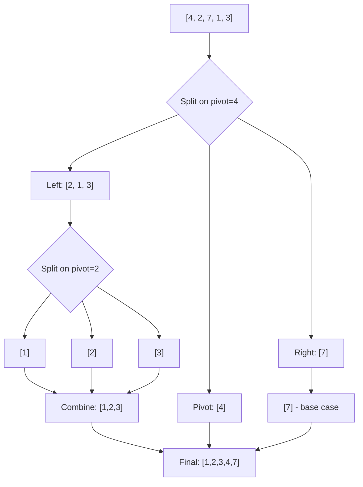
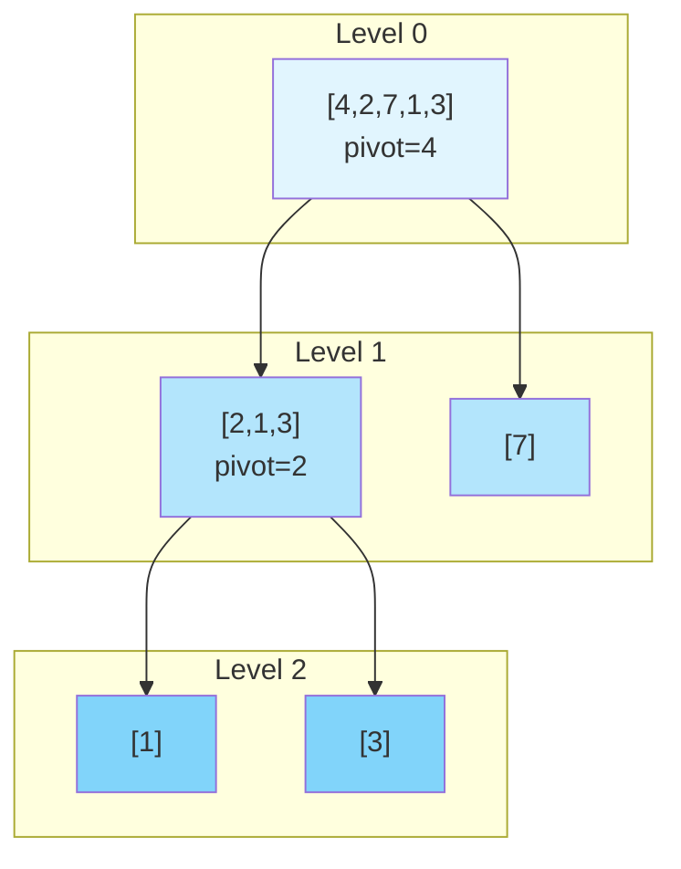

# Recursive Quick Sort

## Overview

| Property | Value |
|----------|-------|
| **Category** | Divide and Conquer |
| **Complexity (Time)** | O(n log n) average, O(n²) worst |
| **Complexity (Space)** | O(log n) to O(n) |
| **Stability** | No |
| **In-place** | No (this variant) |
| **Comparison-based** | Yes |

## Description

This is an elegant, functional-style implementation of Quick Sort using Python's list comprehensions. Unlike the traditional in-place Quick Sort that uses partitioning with index manipulation, this variant creates new lists during recursion, making the code more readable and easier to understand while demonstrating the core divide-and-conquer principle.

The algorithm selects a pivot (first element), partitions elements into "less than or equal" and "greater than" groups, recursively sorts each group, and concatenates the results.

## Mathematical Foundation

### Recurrence Relation

For an array of size $n$ with random pivot selection:

**Average Case:**
$$T(n) = 2T(n/2) + O(n)$$

Solving via Master Theorem: $T(n) = O(n \log n)$

**Worst Case (sorted array, first-element pivot):**
$$T(n) = T(n-1) + O(n)$$

$$T(n) = O(n) + O(n-1) + \cdots + O(1) = O(n^2)$$

### Partition Function

Given array $A$ and pivot $p = A[0]$:

$$L = \{a \in A[1:] : a \leq p\}$$
$$R = \{a \in A[1:] : a > p\}$$

The sorted result is:
$$\text{sort}(A) = \text{sort}(L) + [p] + \text{sort}(R)$$

### Expected Number of Comparisons

The expected number of comparisons for Quick Sort on $n$ distinct elements:

$$C(n) = 2(n+1)H_n - 4n \approx 1.39 n \log_2 n$$

Where $H_n$ is the $n$-th harmonic number.

### Space Analysis (This Variant)

Since this variant creates new lists:

$$S(n) = O(n) \text{ per level} \times O(\log n) \text{ levels} = O(n \log n)$$

In the worst case (unbalanced partitions):
$$S(n) = O(n^2)$$

## Algorithm

### Pseudocode

```
QUICK-SORT-FUNCTIONAL(A):
    if length(A) ≤ 1:
        return A
    
    pivot ← A[0]
    
    // Partition using list comprehensions
    left ← [e for e in A[1:] if e ≤ pivot]
    right ← [e for e in A[1:] if e > pivot]
    
    // Recursive calls and concatenation
    return QUICK-SORT-FUNCTIONAL(left) + [pivot] + QUICK-SORT-FUNCTIONAL(right)
```

### Step-by-Step Execution

```
Input: [4, 2, 7, 1, 3]

Level 0:
  pivot = 4
  left = [2, 1, 3] (elements ≤ 4)
  right = [7] (elements > 4)
  
  Recurse on left [2, 1, 3]:
    Level 1-L:
      pivot = 2
      left = [1] (elements ≤ 2)
      right = [3] (elements > 2)
      
      Recurse: [1] → [1], [3] → [3]
      Result: [1] + [2] + [3] = [1, 2, 3]
  
  Recurse on right [7]:
    Level 1-R:
      Base case: length ≤ 1
      Result: [7]
  
  Combine: [1, 2, 3] + [4] + [7] = [1, 2, 3, 4, 7]

Output: [1, 2, 3, 4, 7]
```

## Complexity Analysis

### Time Complexity

| Case | Complexity | When |
|------|------------|------|
| Best | O(n log n) | Pivot always median |
| Average | O(n log n) | Random data |
| Worst | O(n²) | Already sorted, first-element pivot |

### Space Complexity

| Aspect | This Variant | In-Place Variant |
|--------|--------------|------------------|
| Auxiliary Space | O(n) per call | O(1) |
| Stack Space | O(log n) avg, O(n) worst | O(log n) avg |
| Total (avg) | O(n log n) | O(log n) |
| Total (worst) | O(n²) | O(n) |

### Comparison with In-Place Quick Sort

| Aspect | Functional Style | In-Place |
|--------|-----------------|----------|
| Readability | High | Medium |
| Memory | O(n log n) | O(log n) |
| Cache Performance | Poor | Good |
| Stability | Can be stable | Unstable |
| Code Length | ~10 lines | ~30 lines |

## Visual Representation



### Recursive Tree Structure



## Implementation

### Python Implementation (Concise)

```python
def quick_sort(data: list) -> list:
    """
    Functional-style Quick Sort using list comprehensions.
    
    >>> quick_sort([2, 1, 0])
    [0, 1, 2]
    >>> quick_sort([2.2, 1.1, 0])
    [0, 1.1, 2.2]
    >>> quick_sort("quick_sort")
    ['_', 'c', 'i', 'k', 'o', 'q', 'r', 's', 't', 'u']
    """
    if len(data) <= 1:
        return data
    else:
        return [
            *quick_sort([e for e in data[1:] if e <= data[0]]),
            data[0],
            *quick_sort([e for e in data[1:] if e > data[0]]),
        ]
```

### Expanded Version with Comments

```python
def quick_sort_verbose(data: list) -> list:
    """
    Quick Sort with detailed comments.
    
    >>> quick_sort_verbose([5, 2, 9, 1, 5, 6])
    [1, 2, 5, 5, 6, 9]
    """
    # Base case: arrays of size 0 or 1 are already sorted
    if len(data) <= 1:
        return data
    
    # Choose first element as pivot
    pivot = data[0]
    rest = data[1:]
    
    # Partition: elements <= pivot go left
    left = [element for element in rest if element <= pivot]
    
    # Partition: elements > pivot go right  
    right = [element for element in rest if element > pivot]
    
    # Recursively sort and combine
    sorted_left = quick_sort_verbose(left)
    sorted_right = quick_sort_verbose(right)
    
    return sorted_left + [pivot] + sorted_right
```

### Generic Version with Key Function

```python
from typing import TypeVar, Callable

T = TypeVar('T')

def quick_sort_generic(
    data: list[T],
    key: Callable[[T], any] = lambda x: x,
    reverse: bool = False
) -> list[T]:
    """
    Generic Quick Sort with custom key and reverse options.
    
    >>> quick_sort_generic([3, 1, 4, 1, 5], reverse=True)
    [5, 4, 3, 1, 1]
    >>> quick_sort_generic(['banana', 'apple', 'cherry'], key=len)
    ['apple', 'banana', 'cherry']
    """
    if len(data) <= 1:
        return data
    
    pivot = data[0]
    pivot_key = key(pivot)
    rest = data[1:]
    
    if reverse:
        left = [e for e in rest if key(e) >= pivot_key]
        right = [e for e in rest if key(e) < pivot_key]
    else:
        left = [e for e in rest if key(e) <= pivot_key]
        right = [e for e in rest if key(e) > pivot_key]
    
    return (
        quick_sort_generic(left, key, reverse) 
        + [pivot] 
        + quick_sort_generic(right, key, reverse)
    )
```

### Three-Way Partition Version

```python
def quick_sort_3way(data: list) -> list:
    """
    Three-way partition for handling duplicates efficiently.
    
    >>> quick_sort_3way([3, 3, 1, 2, 2, 1, 3])
    [1, 1, 2, 2, 3, 3, 3]
    """
    if len(data) <= 1:
        return data
    
    pivot = data[0]
    
    less = [e for e in data if e < pivot]
    equal = [e for e in data if e == pivot]
    greater = [e for e in data if e > pivot]
    
    return quick_sort_3way(less) + equal + quick_sort_3way(greater)
```

## Real-World Applications

### 1. Sorting Configuration Priority

```python
class ConfigSorter:
    """
    Sort configuration items by priority using functional quick sort.
    Useful for settings management systems.
    """
    
    @staticmethod
    def sort_by_priority(
        configs: list[dict]
    ) -> list[dict]:
        """
        Sort configurations by priority (higher first).
        
        >>> configs = [
        ...     {'name': 'A', 'priority': 5},
        ...     {'name': 'B', 'priority': 10},
        ...     {'name': 'C', 'priority': 1}
        ... ]
        >>> sorted_configs = ConfigSorter.sort_by_priority(configs)
        >>> [c['name'] for c in sorted_configs]
        ['B', 'A', 'C']
        """
        if len(configs) <= 1:
            return configs
        
        pivot = configs[0]
        rest = configs[1:]
        
        # Higher priority first (>= pivot goes left)
        higher = [c for c in rest if c['priority'] >= pivot['priority']]
        lower = [c for c in rest if c['priority'] < pivot['priority']]
        
        return (
            ConfigSorter.sort_by_priority(higher) 
            + [pivot] 
            + ConfigSorter.sort_by_priority(lower)
        )
```

### 2. Log Entry Sorting

```python
from datetime import datetime

def sort_log_entries(logs: list[dict]) -> list[dict]:
    """
    Sort log entries by timestamp using functional quick sort.
    Immutable approach preserves original data.
    
    >>> logs = [
    ...     {'time': '2024-01-15 10:30', 'msg': 'A'},
    ...     {'time': '2024-01-15 09:00', 'msg': 'B'},
    ...     {'time': '2024-01-15 11:00', 'msg': 'C'}
    ... ]
    >>> sorted_logs = sort_log_entries(logs)
    >>> [l['msg'] for l in sorted_logs]
    ['B', 'A', 'C']
    """
    if len(logs) <= 1:
        return logs
    
    pivot = logs[0]
    rest = logs[1:]
    
    before = [log for log in rest if log['time'] <= pivot['time']]
    after = [log for log in rest if log['time'] > pivot['time']]
    
    return sort_log_entries(before) + [pivot] + sort_log_entries(after)


class LogAnalyzer:
    """Analyze logs with various sorting strategies."""
    
    def __init__(self, logs: list[dict]):
        self.original_logs = logs.copy()
    
    def get_sorted_by_severity(self) -> list[dict]:
        """
        Sort by severity level.
        
        >>> analyzer = LogAnalyzer([
        ...     {'severity': 'INFO', 'msg': 'a'},
        ...     {'severity': 'ERROR', 'msg': 'b'},
        ...     {'severity': 'DEBUG', 'msg': 'c'}
        ... ])
        >>> sorted_logs = analyzer.get_sorted_by_severity()
        >>> [l['severity'] for l in sorted_logs]
        ['ERROR', 'INFO', 'DEBUG']
        """
        severity_order = {'ERROR': 0, 'WARN': 1, 'INFO': 2, 'DEBUG': 3}
        
        def sort_by_severity(logs):
            if len(logs) <= 1:
                return logs
            
            pivot = logs[0]
            rest = logs[1:]
            pivot_val = severity_order.get(pivot['severity'], 99)
            
            higher = [l for l in rest 
                     if severity_order.get(l['severity'], 99) <= pivot_val]
            lower = [l for l in rest 
                    if severity_order.get(l['severity'], 99) > pivot_val]
            
            return sort_by_severity(higher) + [pivot] + sort_by_severity(lower)
        
        return sort_by_severity(self.original_logs.copy())
```

### 3. Expression Parser (Sort Operators by Precedence)

```python
def sort_by_operator_precedence(tokens: list[str]) -> list[str]:
    """
    Sort operators by precedence for expression parsing.
    Uses functional quick sort for immutability.
    
    >>> sort_by_operator_precedence(['+', '*', '-', '/'])
    ['*', '/', '+', '-']
    """
    precedence = {'*': 2, '/': 2, '+': 1, '-': 1, '(': 0, ')': 0}
    
    if len(tokens) <= 1:
        return tokens
    
    pivot = tokens[0]
    rest = tokens[1:]
    pivot_prec = precedence.get(pivot, 0)
    
    higher = [t for t in rest if precedence.get(t, 0) >= pivot_prec]
    lower = [t for t in rest if precedence.get(t, 0) < pivot_prec]
    
    return (
        sort_by_operator_precedence(higher) 
        + [pivot] 
        + sort_by_operator_precedence(lower)
    )
```

### 4. Sorting Game Leaderboard

```python
class Leaderboard:
    """
    Immutable leaderboard using functional quick sort.
    Each update creates new sorted state.
    """
    
    def __init__(self, scores: list[tuple[str, int]] = None):
        self.scores = scores or []
    
    def add_score(self, player: str, score: int) -> 'Leaderboard':
        """
        Add score and return new sorted leaderboard.
        
        >>> lb = Leaderboard()
        >>> lb = lb.add_score('Alice', 100)
        >>> lb = lb.add_score('Bob', 150)
        >>> lb = lb.add_score('Charlie', 75)
        >>> lb.get_rankings()
        [('Bob', 150), ('Alice', 100), ('Charlie', 75)]
        """
        new_scores = self.scores + [(player, score)]
        return Leaderboard(self._sort_scores(new_scores))
    
    def _sort_scores(
        self, 
        scores: list[tuple[str, int]]
    ) -> list[tuple[str, int]]:
        """Quick sort by score descending."""
        if len(scores) <= 1:
            return scores
        
        pivot = scores[0]
        rest = scores[1:]
        
        higher = [s for s in rest if s[1] >= pivot[1]]
        lower = [s for s in rest if s[1] < pivot[1]]
        
        return self._sort_scores(higher) + [pivot] + self._sort_scores(lower)
    
    def get_rankings(self) -> list[tuple[str, int]]:
        """Get current rankings."""
        return self.scores.copy()
```

### 5. JSON Data Sorting

```python
import json

def sort_json_array(
    json_str: str, 
    key_path: str
) -> str:
    """
    Sort JSON array by nested key using functional quick sort.
    
    >>> data = '[{"user": {"name": "Bob"}}, {"user": {"name": "Alice"}}]'
    >>> sorted_json = sort_json_array(data, 'user.name')
    >>> print(sorted_json)
    [{"user": {"name": "Alice"}}, {"user": {"name": "Bob"}}]
    """
    def get_nested(obj: dict, path: str):
        """Get nested value by dot-separated path."""
        for key in path.split('.'):
            obj = obj.get(key, '')
        return obj
    
    def sort_by_key(items: list[dict]) -> list[dict]:
        if len(items) <= 1:
            return items
        
        pivot = items[0]
        rest = items[1:]
        pivot_val = get_nested(pivot, key_path)
        
        left = [i for i in rest if get_nested(i, key_path) <= pivot_val]
        right = [i for i in rest if get_nested(i, key_path) > pivot_val]
        
        return sort_by_key(left) + [pivot] + sort_by_key(right)
    
    data = json.loads(json_str)
    sorted_data = sort_by_key(data)
    return json.dumps(sorted_data)
```

## Optimizations and Variants

### Tail Recursion Optimization

```python
def quick_sort_tail_optimized(data: list) -> list:
    """
    Tail-call optimized version (simulated).
    Reduces stack depth by processing smaller partition first.
    """
    def helper(arr, acc):
        if len(arr) <= 1:
            return acc + arr
        
        pivot = arr[0]
        left = [e for e in arr[1:] if e <= pivot]
        right = [e for e in arr[1:] if e > pivot]
        
        # Process smaller partition recursively, larger iteratively
        if len(left) < len(right):
            sorted_left = helper(left, [])
            return helper(right, sorted_left + [pivot])
        else:
            sorted_right = helper(right, [])
            return helper(left, []) + [pivot] + sorted_right
    
    return helper(data, [])
```

### Hybrid with Insertion Sort

```python
def quick_sort_hybrid(data: list, threshold: int = 10) -> list:
    """
    Switch to insertion sort for small arrays.
    
    >>> quick_sort_hybrid([5, 2, 8, 1, 9, 3, 7, 4, 6])
    [1, 2, 3, 4, 5, 6, 7, 8, 9]
    """
    if len(data) <= threshold:
        # Insertion sort for small arrays
        result = list(data)
        for i in range(1, len(result)):
            key = result[i]
            j = i - 1
            while j >= 0 and result[j] > key:
                result[j + 1] = result[j]
                j -= 1
            result[j + 1] = key
        return result
    
    pivot = data[0]
    left = [e for e in data[1:] if e <= pivot]
    right = [e for e in data[1:] if e > pivot]
    
    return quick_sort_hybrid(left) + [pivot] + quick_sort_hybrid(right)
```

## References

1. Hoare, C.A.R. (1962). "Quicksort"
2. [Quick Sort - Wikipedia](https://en.wikipedia.org/wiki/Quicksort)
3. Sedgewick, R. "Algorithms" - Analysis of Quicksort
4. [Functional Programming Paradigms](https://en.wikipedia.org/wiki/Functional_programming)

## See Also

- [Quick Sort (In-Place)](quick_sort.md) - Traditional in-place implementation
- [Quick Sort 3-Partition](quick_sort_3_partition.md) - Dutch National Flag variant
- [Merge Sort](merge_sort.md) - Another divide-and-conquer sort
- [Intro Sort](intro_sort.md) - Hybrid quicksort-heapsort
