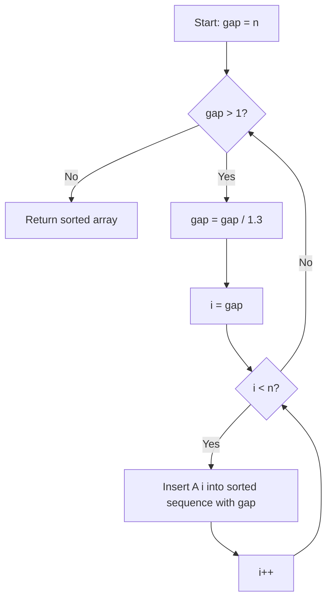

# Shrink Shell Sort

## Overview

| Property | Value |
|----------|-------|
| **Category** | Sorting Algorithm |
| **Type** | Comparison-Based (Diminishing Increment) |
| **Data Structure** | Array |
| **Space Complexity** | O(1) |
| **Stable** | No |
| **In-Place** | Yes |
| **Shrink Factor** | 1.3 |

---

## Mathematical Foundation

### Definition

**Shrink Shell Sort** is an optimized variant of Shell Sort that uses a **shrink factor of 1.3** to determine the gap sequence. This specific shrink factor has been empirically determined to provide good performance.

### Algorithm Principle

Shell Sort works by:
1. Start with a large gap
2. Sort elements that are `gap` positions apart using insertion sort
3. Shrink the gap by a factor
4. Repeat until gap = 1 (final insertion sort pass)

### Gap Sequence

**Standard Shell Sort** uses various gap sequences (Shell's, Hibbard's, etc.)

**Shrink Shell Sort** uses:
$$gap_{i+1} = \lfloor gap_i / 1.3 \rfloor$$

Starting with $gap_0 = n$

### Mathematical Analysis

**Gap Sequence:**
$$gap_0 = n, \quad gap_{i+1} = \lfloor gap_i / 1.3 \rfloor$$

The sequence terminates when $gap = 1$.

**Number of Gap Values:**
$$k = \lceil \log_{1.3} n \rceil \approx 3.8 \log n$$

**Why 1.3?**
- Empirically optimal for many datasets
- Known as the "Ciura shrink factor"
- Balances between too few gaps (like 2.0) and too many (like 1.1)

### Comparison of Shrink Factors

| Factor | Number of Passes | Performance |
|--------|-----------------|-------------|
| 2.0 | $\log_2 n$ | Slower |
| 1.5 | $\log_{1.5} n$ | Medium |
| **1.3** | $\log_{1.3} n$ | **Optimal** |
| 1.1 | $\log_{1.1} n$ | Too many passes |

---

## Pseudocode

```
SHRINK-SHELL-SORT(A):
    Input: Array A of n elements
    Output: Sorted array A
    
    n ← length(A)
    gap ← n
    shrink ← 1.3
    
    while gap > 1:
        // Shrink the gap
        gap ← floor(gap / shrink)
        
        // Insertion sort with current gap
        for i ← gap to n-1:
            temp ← A[i]
            j ← i
            
            while j ≥ gap AND A[j - gap] > temp:
                A[j] ← A[j - gap]
                j ← j - gap
            
            A[j] ← temp
    
    return A
```

---

## Complexity Analysis

### Time Complexity

| Case | Complexity | Notes |
|------|------------|-------|
| **Best** | $O(n \log n)$ | Nearly sorted |
| **Average** | $O(n^{1.25})$ | Empirical |
| **Worst** | $O(n^{3/2})$ | Gap sequence dependent |

**With shrink factor 1.3:**
- Empirically performs close to $O(n^{4/3})$
- Better than standard Shell sequences in practice

### Space Complexity

| Component | Space |
|-----------|-------|
| Gap variable | $O(1)$ |
| Temp for swap | $O(1)$ |
| **Total** | $O(1)$ |

### Comparison with Standard Shell Sort Gaps

| Gap Sequence | Time Complexity |
|--------------|-----------------|
| Shell's (n/2) | $O(n^2)$ |
| Hibbard's | $O(n^{3/2})$ |
| Sedgewick's | $O(n^{4/3})$ |
| **Shrink 1.3** | $O(n^{4/3})$ empirical |
| Ciura's | $O(n^{4/3})$ optimal known |

---

## Visual Representation

### Gap Sequence Progression

```
Array size n = 10

gap = 10
gap = 10 / 1.3 = 7
gap = 7 / 1.3 = 5
gap = 5 / 1.3 = 3
gap = 3 / 1.3 = 2
gap = 2 / 1.3 = 1

Gap sequence: [10, 7, 5, 3, 2, 1]
```

### Algorithm Flow



### Step-by-Step Example

```
Input: [8, 5, 2, 9, 5, 6, 3]
n = 7

Gap = 7 (initial):
  gap = 7/1.3 = 5
  
Gap = 5:
  Compare pairs (0,5), (1,6)
  i=5: A[5]=6, A[0]=8 → 6<8, swap → [6, 5, 2, 9, 5, 8, 3]
  i=6: A[6]=3, A[1]=5 → 3<5, swap → [6, 3, 2, 9, 5, 8, 5]

Gap = 3 (5/1.3):
  i=3: 9 vs 6: no swap
  i=4: 5 vs 3: no swap  
  i=5: 8 vs 2: swap → [6, 3, 2, 8, 5, 9, 5]
       continue: 2 vs 6: swap → [2, 3, 6, 8, 5, 9, 5]
  i=6: 5 vs 8: swap → [2, 3, 6, 5, 5, 9, 8]

Gap = 2 (3/1.3):
  Gap-2 insertion sort...
  → [2, 3, 5, 5, 6, 8, 9]

Gap = 1 (2/1.3):
  Final insertion sort pass
  → [2, 3, 5, 5, 6, 8, 9]

Result: [2, 3, 5, 5, 6, 8, 9]
```

---

## Implementation Details

### Python Implementation

```python
def shell_sort(collection: list) -> list:
    """
    Implementation of shell sort algorithm with shrink factor 1.3
    
    :param collection: Mutable ordered collection with comparable items
    :return: The same collection ordered by ascending

    >>> shell_sort([3, 2, 1])
    [1, 2, 3]
    >>> shell_sort([])
    []
    >>> shell_sort([1])
    [1]
    """
    # Choose initial gap value
    gap = len(collection)

    # Set the gap shrink factor
    shrink = 1.3

    # Continue sorting until gap is 1
    while gap > 1:
        # Decrease the gap value
        gap = int(gap / shrink)

        # Sort elements using insertion sort with current gap
        for i in range(gap, len(collection)):
            temp = collection[i]
            j = i
            while j >= gap and collection[j - gap] > temp:
                collection[j] = collection[j - gap]
                j -= gap
            collection[j] = temp

    return collection
```

### Optimized Version with Minimum Gap

```python
def shrink_shell_sort_optimized(arr: list) -> list:
    """
    Optimized shrink shell sort ensuring gap >= 1.
    
    >>> shrink_shell_sort_optimized([5, 4, 3, 2, 1])
    [1, 2, 3, 4, 5]
    >>> shrink_shell_sort_optimized([1])
    [1]
    """
    n = len(arr)
    gap = n
    shrink = 1.3
    
    while True:
        # Calculate new gap
        gap = max(1, int(gap / shrink))
        
        # Gapped insertion sort
        for i in range(gap, n):
            temp = arr[i]
            j = i
            while j >= gap and arr[j - gap] > temp:
                arr[j] = arr[j - gap]
                j -= gap
            arr[j] = temp
        
        # Stop when gap reaches 1
        if gap == 1:
            break
    
    return arr
```

### Version with Gap Sequence Tracking

```python
def shrink_shell_sort_traced(arr: list) -> tuple[list, list]:
    """
    Shell sort with gap sequence tracking.
    
    >>> sorted_arr, gaps = shrink_shell_sort_traced([5, 3, 8, 1])
    >>> sorted_arr
    [1, 3, 5, 8]
    >>> 1 in gaps
    True
    """
    n = len(arr)
    gap = n
    shrink = 1.3
    gap_sequence = []
    
    while gap > 1:
        gap = max(1, int(gap / shrink))
        gap_sequence.append(gap)
        
        for i in range(gap, n):
            temp = arr[i]
            j = i
            while j >= gap and arr[j - gap] > temp:
                arr[j] = arr[j - gap]
                j -= gap
            arr[j] = temp
    
    return arr, gap_sequence
```

---

## Real-World Applications

### 1. **Embedded Systems Sorting**

**Use Case**: In-place sorting with minimal memory.

```python
def sort_sensor_array(readings: list[float]) -> list[float]:
    """
    Sort sensor readings using O(1) extra space.
    
    >>> sort_sensor_array([23.5, 21.2, 24.1, 22.0])
    [21.2, 22.0, 23.5, 24.1]
    """
    return shell_sort(readings.copy())
```

### 2. **Database Record Sorting**

**Use Case**: Efficient medium-sized dataset sorting.

```python
def sort_records(records: list[dict], key: str) -> list[dict]:
    """
    Sort records by a key using shell sort.
    
    >>> records = [{'id': 3}, {'id': 1}, {'id': 2}]
    >>> sorted_recs = sort_records(records, 'id')
    >>> [r['id'] for r in sorted_recs]
    [1, 2, 3]
    """
    n = len(records)
    gap = n
    shrink = 1.3
    
    while gap > 1:
        gap = max(1, int(gap / shrink))
        
        for i in range(gap, n):
            temp = records[i]
            j = i
            while j >= gap and records[j - gap][key] > temp[key]:
                records[j] = records[j - gap]
                j -= gap
            records[j] = temp
    
    return records
```

### 3. **Nearly Sorted Data**

**Use Case**: Excellent for data that's almost sorted.

```python
def sort_nearly_sorted(arr: list, max_displacement: int = None) -> list:
    """
    Sort array where elements are at most k positions away.
    Shell sort excels at this.
    
    >>> sort_nearly_sorted([2, 1, 4, 3, 6, 5])
    [1, 2, 3, 4, 5, 6]
    """
    # Shell sort naturally handles nearly sorted arrays
    return shell_sort(arr.copy())
```

### 4. **Gaming Leaderboard Updates**

**Use Case**: Maintaining sorted leaderboards with frequent updates.

```python
class Leaderboard:
    """Leaderboard using shell sort for updates."""
    
    def __init__(self):
        self.scores = []
    
    def add_scores(self, new_scores: list[tuple[str, int]]):
        """Add multiple scores and re-sort."""
        self.scores.extend(new_scores)
        self._shell_sort_by_score()
    
    def _shell_sort_by_score(self):
        """Sort by score descending."""
        n = len(self.scores)
        gap = n
        shrink = 1.3
        
        while gap > 1:
            gap = max(1, int(gap / shrink))
            
            for i in range(gap, n):
                temp = self.scores[i]
                j = i
                # Sort descending by score
                while j >= gap and self.scores[j - gap][1] < temp[1]:
                    self.scores[j] = self.scores[j - gap]
                    j -= gap
                self.scores[j] = temp
    
    def get_top(self, k: int) -> list:
        """Get top k scores."""
        return self.scores[:k]
```

---

## Advantages and Disadvantages

### ✅ Advantages

1. **In-place** - O(1) extra space
2. **Simple implementation**
3. **Good for medium datasets** (1000-100000 elements)
4. **Excellent for nearly sorted** data
5. **Adaptive** - benefits from existing order

### ❌ Disadvantages

1. **Not stable** - relative order not preserved
2. **Slower than O(n log n)** algorithms for large n
3. **Gap sequence affects** performance significantly
4. **Not parallelizable** easily

---

## Comparison with Other Shell Sequences

| Sequence | Formula | Complexity |
|----------|---------|------------|
| Shell's | $n/2^k$ | $O(n^2)$ |
| Hibbard's | $2^k - 1$ | $O(n^{3/2})$ |
| Sedgewick's | Complex | $O(n^{4/3})$ |
| **Shrink 1.3** | $n/1.3^k$ | $O(n^{4/3})$ empirical |

---

## References

1. [Wikipedia: Shellsort](https://en.wikipedia.org/wiki/Shellsort)
2. Ciura, M. "Best Increments for the Average Case of Shellsort"
3. Sedgewick, R. "Analysis of Shellsort"

---

## See Also

- [Shell Sort](shell_sort.md) - Original algorithm
- [Insertion Sort](insertion_sort.md) - Base algorithm
- [Comb Sort](comb_sort.md) - Similar shrink concept

