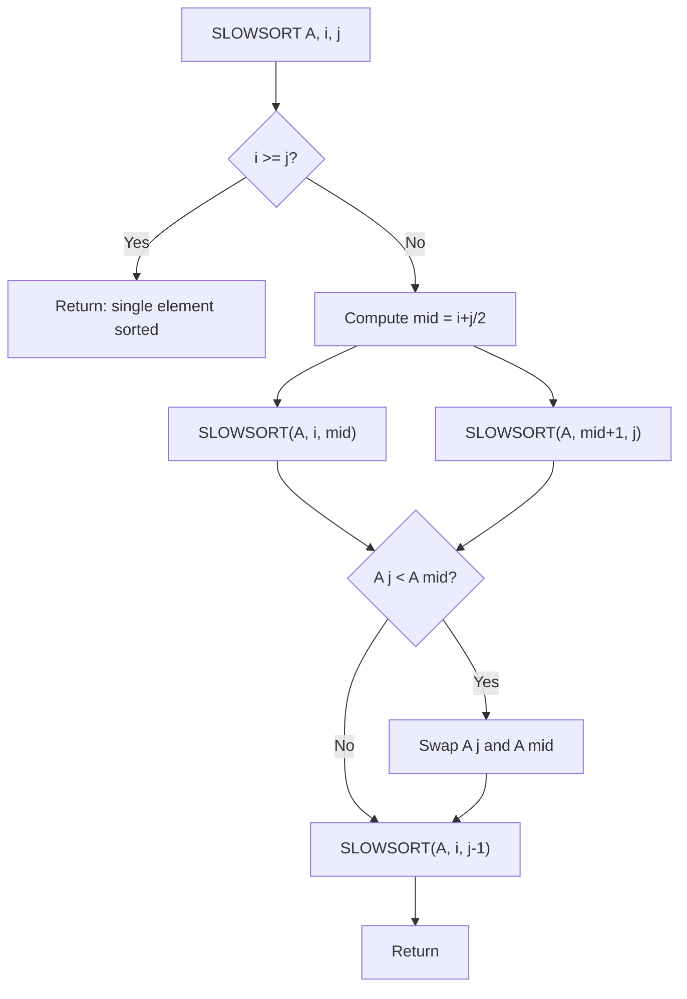

# Slowsort

## Overview

| Property | Value |
|----------|-------|
| **Category** | Sorting Algorithm |
| **Type** | Comparison-Based (Humorous/Pessimal) |
| **Data Structure** | Array |
| **Space Complexity** | O(n) (recursion stack) |
| **Stable** | No |
| **In-Place** | Yes |
| **Practical Use** | None (educational/humor only) |

---

## Mathematical Foundation

### Definition

**Slowsort** is a sorting algorithm that demonstrates the "multiply and surrender" paradigm — a humorous parody of the "divide and conquer" approach. It was published in 1986 by **Andrei Broder** and **Jorge Stolfi** in their paper "Pessimal Algorithms and Simplexity Analysis."

### Algorithm Principle

The algorithm works as follows:

1. **Multiply**: Recursively sort first half and second half separately
2. **Find maximum**: Compare midpoint and endpoint, swap if needed
3. **Surrender**: Recursively sort everything except the last element

### Mathematical Recurrence

The algorithm can be described mathematically:

$$\text{SLOWSORT}(A, i, j) = \begin{cases}
\text{return} & \text{if } i \geq j \\
\text{recurse} & \text{otherwise}
\end{cases}$$

The recursive case:
1. $m = \lfloor (i + j) / 2 \rfloor$
2. $\text{SLOWSORT}(A, i, m)$ — sort first half
3. $\text{SLOWSORT}(A, m+1, j)$ — sort second half
4. If $A[j] < A[m]$: swap $A[j]$ and $A[m]$
5. $\text{SLOWSORT}(A, i, j-1)$ — sort everything except last

### Time Complexity Recurrence

The recurrence relation is:

$$T(n) = 2T\left(\frac{n}{2}\right) + T(n-1) + O(1)$$

This expands to the **absurdly slow** complexity of:

$$T(n) = \Omega\left(n^{\frac{\log n}{2}}\right)$$

Or more precisely: $T(n) \in \Omega\left(n^{\log_2 n / 2}\right)$

### Why It's So Slow

Unlike divide and conquer which reduces the problem size:
- Quicksort: $T(n) = 2T(n/2) + O(n) \rightarrow O(n \log n)$
- Slowsort: $T(n) = 2T(n/2) + T(n-1) \rightarrow$ **worse than polynomial!**

The $T(n-1)$ term means we never truly conquer — we surrender by re-sorting almost everything again.

---

## Pseudocode

```
SLOWSORT(A, start, end):
    Input: Array A, start index, end index
    Output: A[start..end] sorted in ascending order
    
    // Base case
    if start >= end:
        return
    
    // Step 1: Find midpoint (MULTIPLY)
    mid ← (start + end) / 2
    
    // Step 2: Recursively sort both halves
    SLOWSORT(A, start, mid)
    SLOWSORT(A, mid + 1, end)
    
    // Step 3: Move maximum to end position
    if A[end] < A[mid]:
        swap A[end] and A[mid]
    
    // Step 4: Recursively sort everything except end (SURRENDER)
    SLOWSORT(A, start, end - 1)
```

---

## Complexity Analysis

### Time Complexity

| Case | Complexity | Notes |
|------|------------|-------|
| **Best** | $\Omega(n^{\log_2 n / 2})$ | Same as worst! |
| **Average** | $\Omega(n^{\log_2 n / 2})$ | Always pessimal |
| **Worst** | $\Omega(n^{\log_2 n / 2})$ | Designed to be slow |

**Comparison of Growth Rates:**

| n | Bubble O(n²) | Merge O(n log n) | Slowsort Ω(n^(log n / 2)) |
|---|--------------|------------------|---------------------------|
| 10 | 100 | ~33 | ~178 |
| 100 | 10,000 | ~665 | ~10,000,000 |
| 1000 | 1,000,000 | ~10,000 | ~10^15 |

### Space Complexity

| Component | Space |
|-----------|-------|
| Recursion Stack | $O(n)$ |
| Extra Storage | $O(1)$ |
| **Total** | $O(n)$ |

### Closed-Form Analysis

Using the recurrence:
$$T(n) = 2T(n/2) + T(n-1)$$

The closed-form solution is approximately:
$$T(n) = n^{\Theta(\log n)}$$

This grows faster than any polynomial but slower than $n!$ or $2^n$.

---

## Visual Representation

### Algorithm Flow



### Example Trace

```
Initial: [4, 3, 2, 1]

SLOWSORT([4, 3, 2, 1], 0, 3):
  mid = 1
  
  SLOWSORT([4, 3, 2, 1], 0, 1):  // Sort [4, 3]
    mid = 0
    SLOWSORT(0, 0) → return     // [4]
    SLOWSORT(1, 1) → return     // [3]
    A[1]=3 < A[0]=4 → swap      // [3, 4, 2, 1]
    SLOWSORT([3, 4, 2, 1], 0, 0) → return
  
  SLOWSORT([3, 4, 2, 1], 2, 3):  // Sort [2, 1]
    mid = 2
    SLOWSORT(2, 2) → return     // [2]
    SLOWSORT(3, 3) → return     // [1]
    A[3]=1 < A[2]=2 → swap      // [3, 4, 1, 2]
    SLOWSORT([3, 4, 1, 2], 2, 2) → return
  
  A[3]=2 < A[1]=4 → swap        // [3, 2, 1, 4]
  
  SLOWSORT([3, 2, 1, 4], 0, 2):  // Sort [3, 2, 1] - SURRENDER!
    ... (continues recursively)
    
Final: [1, 2, 3, 4]
```

### Recursion Tree Explosion

```
                    SLOWSORT(0,3)
                   /      |      \
          SLOWSORT(0,1) SLOWSORT(2,3) SLOWSORT(0,2)
         /    |    \   /    |    \    /    |    \
        ... more recursive calls ...
        
Note: The rightmost branch (SLOWSORT(0, n-1)) 
creates ANOTHER full recursion tree!
```

---

## Implementation Details

### Python Implementation

```python
from __future__ import annotations


def slowsort(
    sequence: list, start: int | None = None, end: int | None = None
) -> None:
    """
    Sorts sequence[start..end] (both inclusive) in-place.
    start defaults to 0 if not given.
    end defaults to len(sequence) - 1 if not given.
    It returns None.
    
    >>> seq = [1, 6, 2, 5, 3, 4, 4, 5]; slowsort(seq); seq
    [1, 2, 3, 4, 4, 5, 5, 6]
    >>> seq = []; slowsort(seq); seq
    []
    >>> seq = [2]; slowsort(seq); seq
    [2]
    >>> seq = [4, 3, 2, 1]; slowsort(seq); seq
    [1, 2, 3, 4]
    """
    if start is None:
        start = 0

    if end is None:
        end = len(sequence) - 1

    if start >= end:
        return

    mid = (start + end) // 2

    # Multiply: recursively sort both halves
    slowsort(sequence, start, mid)
    slowsort(sequence, mid + 1, end)

    # Move maximum to end
    if sequence[end] < sequence[mid]:
        sequence[end], sequence[mid] = sequence[mid], sequence[end]

    # Surrender: re-sort everything except the maximum
    slowsort(sequence, start, end - 1)
```

### Instrumented Version (for Analysis)

```python
call_count = 0

def slowsort_instrumented(seq: list, start: int = 0, end: int = None) -> None:
    """
    Slowsort with call counting.
    
    >>> arr = [4, 3, 2, 1]
    >>> global call_count; call_count = 0
    >>> slowsort_instrumented(arr)
    >>> print(f"Sorted: {arr}, Calls: {call_count}")
    Sorted: [1, 2, 3, 4], Calls: 40
    """
    global call_count
    call_count += 1
    
    if end is None:
        end = len(seq) - 1
    
    if start >= end:
        return
    
    mid = (start + end) // 2
    
    slowsort_instrumented(seq, start, mid)
    slowsort_instrumented(seq, mid + 1, end)
    
    if seq[end] < seq[mid]:
        seq[end], seq[mid] = seq[mid], seq[end]
    
    slowsort_instrumented(seq, start, end - 1)
```

---

## Real-World Applications

### ⚠️ **Important Disclaimer**

**Slowsort has NO practical real-world applications.** It was intentionally designed to be as slow as possible while still being correct. However, it has educational value:

### 1. **Teaching Algorithm Analysis**

**Use Case**: Demonstrating how recurrence relations affect complexity.

```python
def demonstrate_complexity_analysis():
    """
    Show students how the recurrence T(n) = 2T(n/2) + T(n-1)
    leads to super-polynomial complexity.
    """
    import time
    
    sizes = [5, 6, 7, 8, 9, 10]
    
    print("Size | Time (ms) | Growth")
    print("-" * 30)
    
    prev_time = None
    for n in sizes:
        arr = list(range(n, 0, -1))  # Worst case
        
        start = time.time()
        slowsort(arr)
        elapsed = (time.time() - start) * 1000
        
        growth = f"{elapsed / prev_time:.2f}x" if prev_time else "-"
        print(f"{n:4} | {elapsed:9.2f} | {growth}")
        prev_time = elapsed
```

### 2. **Pessimal Algorithm Study**

**Use Case**: Understanding deliberately inefficient algorithms.

```python
def compare_pessimal_algorithms(n: int = 6):
    """
    Compare Slowsort with other intentionally slow algorithms.
    
    >>> compare_pessimal_algorithms(4)
    Testing with n=4...
    """
    import time
    
    # Slowsort
    arr1 = list(range(n, 0, -1))
    start = time.time()
    slowsort(arr1)
    slowsort_time = time.time() - start
    
    # Bogosort (for comparison)
    import random
    def is_sorted(a):
        return all(a[i] <= a[i+1] for i in range(len(a)-1))
    
    arr2 = list(range(n, 0, -1))
    start = time.time()
    iterations = 0
    while not is_sorted(arr2):
        random.shuffle(arr2)
        iterations += 1
        if iterations > 1000000:
            break
    bogosort_time = time.time() - start
    
    print(f"n = {n}")
    print(f"Slowsort: {slowsort_time:.6f}s")
    print(f"Bogosort: {bogosort_time:.6f}s ({iterations} shuffles)")
```

### 3. **Stress Testing Systems**

**Use Case**: Creating intentionally slow computations for testing.

```python
def stress_test_timeout_handler(timeout_seconds: float = 5.0):
    """
    Test whether a timeout mechanism works correctly.
    Slowsort is guaranteed to be slow!
    
    >>> import signal
    >>> # This would be used in actual timeout testing
    """
    import signal
    
    def timeout_handler(signum, frame):
        raise TimeoutError("Operation timed out")
    
    signal.signal(signal.SIGALRM, timeout_handler)
    signal.alarm(int(timeout_seconds))
    
    try:
        arr = list(range(15, 0, -1))  # This will take forever
        slowsort(arr)
        print("Completed (shouldn't happen for n=15)")
    except TimeoutError:
        print("Timeout correctly triggered!")
    finally:
        signal.alarm(0)
```

### 4. **Humor in Computer Science Education**

**Use Case**: Making learning fun and memorable.

```python
def fun_algorithm_quiz():
    """
    Quiz: Which sort is faster?
    
    A) Slowsort
    B) Bogosort (expected O(n × n!))  
    C) Stooge Sort (O(n^2.71))
    
    Answer: For large n, Bogosort is actually faster on average
    than Slowsort because Slowsort's complexity grows faster!
    
    Slowsort: n^(log n) vs Bogosort: n × n!
    For small n, Slowsort wins (is slower).
    For n ≈ 5-6, they're comparable.
    For larger n, Bogosort might terminate faster (being random).
    """
    pass
```

---

## Advantages and Disadvantages

### ✅ Advantages (Humor)

1. **Always terminates** (unlike Bogosort in worst case)
2. **Deterministic** - same input, same execution path
3. **Educational** - demonstrates multiply and surrender
4. **Makes other sorts look amazing**

### ❌ Disadvantages

1. **Incredibly slow** - worse than polynomial
2. **No practical use** whatsoever
3. **Deep recursion** - can cause stack overflow
4. **Cannot be parallelized effectively**

---

## Comparison with Other "Bad" Algorithms

| Algorithm | Average Time | Worst Time | Terminates? |
|-----------|--------------|------------|-------------|
| Slowsort | $\Omega(n^{\log n})$ | Same | Yes ✓ |
| Bogosort | $O((n+1)!)$ | $\infty$ | Maybe |
| Stooge Sort | $O(n^{2.71})$ | Same | Yes ✓ |
| Sleep Sort | $O(max(arr))$ | Same | Yes ✓ |

---

## References

1. [Wikipedia: Slowsort](https://en.wikipedia.org/wiki/Slowsort)
2. Broder, A. and Stolfi, J. (1986) "Pessimal Algorithms and Simplexity Analysis"
3. [Analysis of Pessimal Algorithms](https://www.cs.dartmouth.edu/~ac/Teach/CS105-Winter05/Notes/nanda-notes.pdf)

---

## See Also

- [Bogo Sort](bogo_sort.md) - Another intentionally bad algorithm
- [Stooge Sort](stooge_sort.md) - O(n^2.71) complexity
- [Bubble Sort](bubble_sort.md) - What Slowsort parodies

