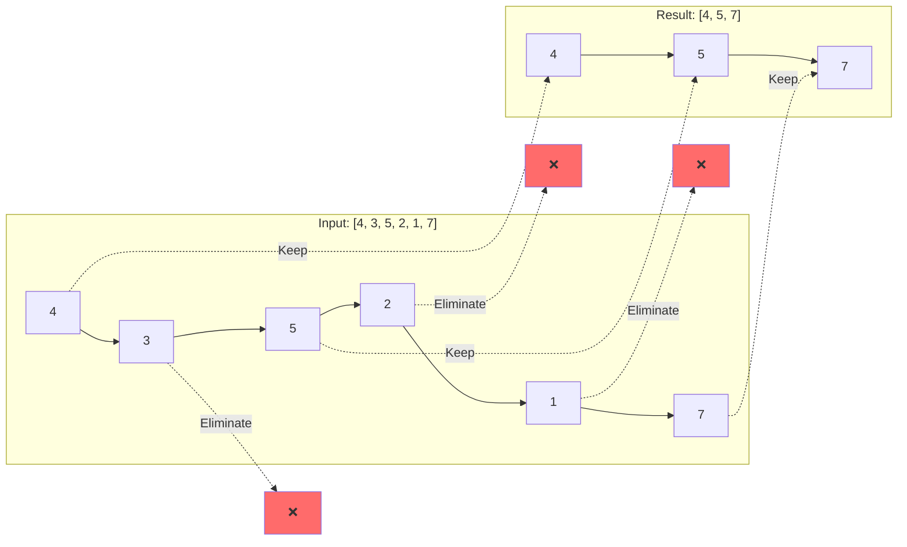

# Stalin Sort

## Overview

| Property | Value |
|----------|-------|
| **Category** | Unconventional/Humorous Sorting |
| **Complexity (Time)** | O(n) |
| **Complexity (Space)** | O(n) |
| **Stability** | N/A (Destructive) |
| **In-place** | No |
| **Comparison-based** | Yes |

## Description

Stalin Sort is a humorous "sorting" algorithm that achieves O(n) time complexity by simply removing elements that are out of order, rather than rearranging them. Named after Joseph Stalin, the algorithm "eliminates" any element that doesn't conform to the sorted order, resulting in a sorted but potentially much smaller output array.

While obviously not a practical sorting algorithm (since it loses data), Stalin Sort serves as an interesting educational tool for discussing algorithm design trade-offs and the theoretical minimum complexity for comparison-based sorting.

## Mathematical Foundation

### Formal Definition

Given an input sequence $A = [a_1, a_2, \ldots, a_n]$, Stalin Sort produces an output sequence $B = [b_1, b_2, \ldots, b_m]$ where $m \leq n$ such that:

$$B = \{a_i \in A : a_i \geq \max(a_1, a_2, \ldots, a_{i-1}) \text{ for all } i\}$$

### Selection Invariant

The algorithm maintains the invariant that for the output sequence $B$:

$$b_i \leq b_{i+1} \quad \forall i \in [1, m-1]$$

### Expected Output Size

For a uniformly random permutation of $n$ distinct elements, the expected size of the output is:

$$E[|B|] = H_n = \sum_{k=1}^{n} \frac{1}{k} \approx \ln(n) + \gamma$$

Where $H_n$ is the $n$-th harmonic number and $\gamma \approx 0.5772$ is the Euler-Mascheroni constant.

### Longest Non-Decreasing Subsequence

Stalin Sort effectively returns a prefix-constrained longest non-decreasing subsequence starting from the first element. For any output of length $m$:

$$a_1 \leq a_{i_2} \leq a_{i_3} \leq \cdots \leq a_{i_m}$$

Where $1 < i_2 < i_3 < \cdots < i_m$ are the original indices.

## Algorithm

### Pseudocode

```
STALIN-SORT(A):
    if A is empty:
        return A
    
    result ← [A[0]]          // Start with first element
    
    for i ← 1 to length(A) - 1:
        if A[i] ≥ result[last]:     // Element is in order
            result.append(A[i])
        // else: element is "eliminated"
    
    return result
```

### Step-by-Step Execution

```
Input: [4, 3, 5, 2, 1, 7]

Step 1: Start with result = [4]
Step 2: 3 < 4, eliminate 3
Step 3: 5 ≥ 4, keep 5, result = [4, 5]
Step 4: 2 < 5, eliminate 2
Step 5: 1 < 5, eliminate 1
Step 6: 7 ≥ 5, keep 7, result = [4, 5, 7]

Output: [4, 5, 7]
```

## Complexity Analysis

### Time Complexity

| Case | Complexity | Condition |
|------|------------|-----------|
| Best | O(n) | All elements in order |
| Average | O(n) | Random permutation |
| Worst | O(n) | All elements eliminated except first |

### Space Complexity

| Aspect | Complexity |
|--------|------------|
| Auxiliary Space | O(k) where k = output size |
| Total Space | O(n) |

### Comparison with Real Sorting

| Algorithm | Time | Data Preserved |
|-----------|------|----------------|
| Stalin Sort | O(n) | No (lossy) |
| Quick Sort | O(n log n) avg | Yes |
| Merge Sort | O(n log n) | Yes |
| Counting Sort | O(n + k) | Yes |

## Visual Representation

```mermaid
flowchart TD
    A[Start] --> B[Initialize result with first element]
    B --> C[i = 1]
    C --> D{i < n?}
    D -->|Yes| E{A[i] >= result[last]?}
    E -->|Yes| F[Append A[i] to result]
    E -->|No| G[Skip A[i] - eliminated]
    F --> H[i++]
    G --> H
    H --> D
    D -->|No| I[Return result]
    I --> J[End]
    
    style G fill:#ff6b6b,color:white
    style F fill:#51cf66,color:white
```

### Elimination Visualization



## Implementation

### Python Implementation

```python
def stalin_sort(sequence: list[int]) -> list[int]:
    """
    Sorts a list using the Stalin sort algorithm.
    
    Elements that are not >= the previous element are discarded.
    
    >>> stalin_sort([4, 3, 5, 2, 1, 7])
    [4, 5, 7]
    >>> stalin_sort([1, 2, 3, 4, 5])
    [1, 2, 3, 4, 5]
    >>> stalin_sort([5, 4, 3, 2, 1])
    [5]
    """
    if not sequence:
        return sequence
    
    result = [sequence[0]]
    for element in sequence[1:]:
        if element >= result[-1]:
            result.append(element)
    
    return result
```

### Generic Implementation

```python
from typing import TypeVar
from collections.abc import Callable

T = TypeVar('T')

def stalin_sort_generic(
    sequence: list[T],
    key: Callable[[T], any] = lambda x: x
) -> list[T]:
    """
    Generic Stalin sort with custom key function.
    
    >>> stalin_sort_generic(['apple', 'cat', 'dog', 'ant'], key=len)
    ['apple']
    >>> stalin_sort_generic(['a', 'bb', 'ccc', 'dd', 'eeeee'], key=len)
    ['a', 'bb', 'ccc', 'eeeee']
    """
    if not sequence:
        return sequence
    
    result = [sequence[0]]
    for element in sequence[1:]:
        if key(element) >= key(result[-1]):
            result.append(element)
    
    return result
```

### Strict Stalin Sort (Strictly Increasing)

```python
def stalin_sort_strict(sequence: list[int]) -> list[int]:
    """
    Strict Stalin sort - keeps only strictly increasing elements.
    
    >>> stalin_sort_strict([4, 4, 5, 5, 6])
    [4, 5, 6]
    >>> stalin_sort_strict([1, 2, 2, 3, 3, 3, 4])
    [1, 2, 3, 4]
    """
    if not sequence:
        return sequence
    
    result = [sequence[0]]
    for element in sequence[1:]:
        if element > result[-1]:
            result.append(element)
    
    return result
```

## Real-World Applications

While Stalin Sort is not used for actual sorting, its concept has legitimate applications:

### 1. Stream Filtering

```python
class MonotonicStreamFilter:
    """
    Filter a data stream to keep only monotonically increasing values.
    Useful for sensor data cleaning or trend detection.
    """
    
    def __init__(self):
        self.last_value = float('-inf')
        self.filtered_values = []
    
    def process(self, value: float) -> bool:
        """
        Process a new value from the stream.
        
        >>> filter = MonotonicStreamFilter()
        >>> [filter.process(v) for v in [1, 0.5, 2, 1.5, 3]]
        [True, False, True, False, True]
        >>> filter.filtered_values
        [1, 2, 3]
        """
        if value >= self.last_value:
            self.filtered_values.append(value)
            self.last_value = value
            return True
        return False
```

### 2. Longest Increasing Prefix

```python
def longest_increasing_prefix(prices: list[float]) -> list[float]:
    """
    Find the longest prefix of non-decreasing stock prices.
    Useful for identifying bull market streaks.
    
    >>> prices = [100, 102, 101, 105, 103, 110]
    >>> longest_increasing_prefix(prices)
    [100, 102, 105, 110]
    """
    if not prices:
        return []
    
    result = [prices[0]]
    for price in prices[1:]:
        if price >= result[-1]:
            result.append(price)
    
    return result


def analyze_market_streak(prices: list[float]) -> dict:
    """
    Analyze market data for consistent growth patterns.
    
    >>> data = [100, 105, 103, 108, 107, 112, 115]
    >>> result = analyze_market_streak(data)
    >>> result['kept_ratio']  # What portion was consistent
    0.5714285714285714
    """
    filtered = longest_increasing_prefix(prices)
    return {
        'original_length': len(prices),
        'filtered_length': len(filtered),
        'kept_ratio': len(filtered) / len(prices),
        'filtered_prices': filtered,
        'eliminated_count': len(prices) - len(filtered)
    }
```

### 3. Data Quality Assessment

```python
def assess_data_monotonicity(data: list[float]) -> dict:
    """
    Assess how monotonic a dataset is.
    
    >>> data = [1, 2, 3, 2, 4, 5, 4, 6]
    >>> result = assess_data_monotonicity(data)
    >>> result['monotonicity_score']
    0.625
    """
    if not data:
        return {'monotonicity_score': 1.0, 'violations': 0}
    
    # Count violations
    violations = 0
    result = [data[0]]
    
    for value in data[1:]:
        if value >= result[-1]:
            result.append(value)
        else:
            violations += 1
    
    return {
        'monotonicity_score': len(result) / len(data),
        'violations': violations,
        'longest_monotonic_prefix': result,
        'total_elements': len(data),
        'monotonic_elements': len(result)
    }
```

### 4. Time Series Anomaly Detection

```python
def detect_regression_anomalies(
    measurements: list[tuple[str, float]]
) -> list[tuple[str, float, str]]:
    """
    Detect measurements that regress from previous values.
    
    >>> data = [('t1', 10), ('t2', 15), ('t3', 12), ('t4', 20)]
    >>> anomalies = detect_regression_anomalies(data)
    >>> anomalies
    [('t3', 12, 'Regression from 15')]
    """
    if not measurements:
        return []
    
    anomalies = []
    last_valid = measurements[0][1]
    
    for timestamp, value in measurements[1:]:
        if value >= last_valid:
            last_valid = value
        else:
            anomalies.append((
                timestamp, 
                value, 
                f'Regression from {last_valid}'
            ))
    
    return anomalies
```

### 5. Progressive Achievement System

```python
class ProgressTracker:
    """
    Track progressive achievements (only count improvements).
    Like a high score system that only records new records.
    """
    
    def __init__(self):
        self.records: list[tuple[str, float]] = []
        self.current_best = float('-inf')
    
    def submit_score(
        self, 
        player: str, 
        score: float
    ) -> tuple[bool, str]:
        """
        Submit a score, only recorded if it's a new record.
        
        >>> tracker = ProgressTracker()
        >>> tracker.submit_score('Alice', 100)
        (True, 'New record!')
        >>> tracker.submit_score('Bob', 90)
        (False, 'Score 90 does not beat record 100')
        >>> tracker.submit_score('Charlie', 150)
        (True, 'New record!')
        """
        if score > self.current_best:
            self.records.append((player, score))
            self.current_best = score
            return True, 'New record!'
        else:
            return False, f'Score {score} does not beat record {self.current_best}'
    
    def get_record_history(self) -> list[tuple[str, float]]:
        """Get all record-breaking scores."""
        return self.records.copy()
```

## Variants and Related Concepts

### Bidirectional Stalin Sort

```python
def bidirectional_stalin_sort(sequence: list[int]) -> list[int]:
    """
    Run Stalin sort from both ends, return larger result.
    
    >>> bidirectional_stalin_sort([3, 1, 4, 1, 5, 9, 2, 6])
    [3, 4, 5, 9]
    """
    if not sequence:
        return sequence
    
    # Forward pass
    forward = [sequence[0]]
    for elem in sequence[1:]:
        if elem >= forward[-1]:
            forward.append(elem)
    
    # Backward pass (for decreasing, then reverse)
    backward = [sequence[-1]]
    for elem in reversed(sequence[:-1]):
        if elem <= backward[-1]:
            backward.append(elem)
    backward.reverse()
    
    return forward if len(forward) >= len(backward) else backward
```

### Probabilistic Stalin Sort

```python
import random

def merciful_stalin_sort(
    sequence: list[int], 
    mercy_probability: float = 0.3
) -> list[int]:
    """
    Stalin sort with mercy - sometimes spare out-of-order elements.
    
    >>> random.seed(42)
    >>> merciful_stalin_sort([5, 3, 4, 2, 6], mercy_probability=0.5)
    [5, 6]
    """
    if not sequence:
        return sequence
    
    result = [sequence[0]]
    for elem in sequence[1:]:
        if elem >= result[-1]:
            result.append(elem)
        elif random.random() < mercy_probability:
            # Spare this element but don't add to result
            pass
    
    return result
```

## Comparison with Related Algorithms

| Algorithm | Preserves Data | Time | Use Case |
|-----------|---------------|------|----------|
| Stalin Sort | No | O(n) | Humorous/Educational |
| Patience Sort | Yes | O(n log n) | LIS finding |
| Filter | No | O(n) | Stream processing |
| Selection Sort | Yes | O(n²) | Small datasets |

## References

1. [Stalin Sort - Medium Article](https://medium.com/@kaweendra/the-ultimate-sorting-algorithm-6513d6968420)
2. [Harmonic Numbers](https://en.wikipedia.org/wiki/Harmonic_number)
3. [Longest Increasing Subsequence](https://en.wikipedia.org/wiki/Longest_increasing_subsequence)
4. [Monotonic Functions](https://en.wikipedia.org/wiki/Monotonic_function)

## See Also

- [Bogo Sort](bogo_sort.md) - Another humorous sorting algorithm
- [Patience Sort](patience_sort.md) - Actually finds longest increasing subsequences
- [Stream Processing](../data_structures/streaming.md) - Real-world filtering applications
