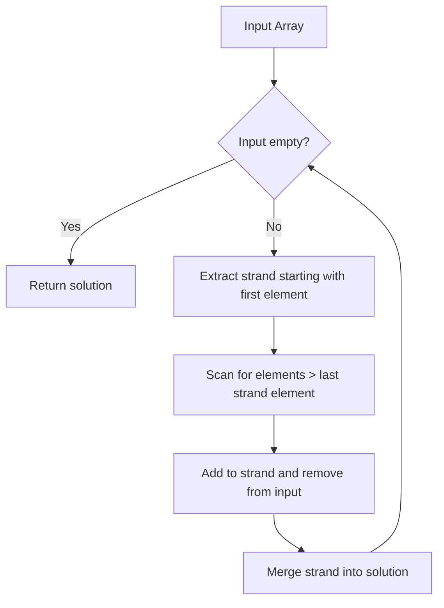

# Strand Sort

## Overview

| Property | Value |
|----------|-------|
| **Category** | Sorting Algorithm |
| **Type** | Comparison-Based (Merge-Based) |
| **Data Structure** | Array, Linked List |
| **Space Complexity** | O(n) |
| **Stable** | Yes |
| **In-Place** | No |
| **Adaptive** | Yes |

---

## Mathematical Foundation

### Definition

**Strand Sort** is a sorting algorithm that works by repeatedly extracting sorted subsequences (strands) from the input and merging them into an output list. It's particularly efficient when the input contains many sorted subsequences.

### Algorithm Principle

1. **Strand Extraction**: Extract a maximal increasing subsequence starting from the first element
2. **Merge**: Merge the extracted strand into the solution
3. **Repeat**: Continue until input is exhausted

### Strand Definition

A **strand** is a maximal subsequence $S = \{s_1, s_2, \ldots, s_k\}$ where:
$$s_1 < s_2 < \ldots < s_k$$

extracted by scanning left to right, adding elements that maintain sorted order.

### Mathematical Properties

**Adaptive Behavior:**
- Best case: Input has one strand (already sorted) → $O(n)$
- Worst case: Input has $n$ strands (reverse sorted) → $O(n^2)$

**Number of Strands:**
Let $k$ be the number of strands in input:
- Best case: $k = 1$
- Worst case: $k = n$
- Average case (random): $k \approx \frac{n}{e}$ (≈ 37% of n)

### Time Complexity Analysis

Let $k$ = number of strands, each strand merge is $O(n)$:
$$T(n) = O(k \cdot n)$$

Where $k$ depends on input pattern:
- Sorted input: $k = 1$ → $O(n)$
- Random input: $k \approx \frac{n}{e}$ → $O(n^2/e) = O(n^2)$
- Reverse sorted: $k = n$ → $O(n^2)$

---

## Pseudocode

```
STRAND-SORT(A):
    Input: Array A of n elements
    Output: Sorted array
    
    solution ← empty list
    
    while A is not empty:
        // Extract a strand
        strand ← [remove first element from A]
        
        i ← 0
        while i < length(A):
            if A[i] > last element of strand:
                append A[i] to strand
                remove A[i] from A
            else:
                i ← i + 1
        
        // Merge strand into solution
        solution ← MERGE(solution, strand)
    
    return solution


MERGE(list1, list2):
    // Standard merge of two sorted lists
    result ← empty list
    
    while list1 is not empty AND list2 is not empty:
        if first(list1) ≤ first(list2):
            append remove_first(list1) to result
        else:
            append remove_first(list2) to result
    
    append remaining elements of list1 to result
    append remaining elements of list2 to result
    
    return result
```

### Recursive Version

```
STRAND-SORT-RECURSIVE(A, solution):
    Input: Array A, current solution
    Output: Sorted array
    
    if A is empty:
        return solution
    
    // Extract strand
    strand ← [A[0]]
    remaining ← []
    
    for i ← 1 to length(A) - 1:
        if A[i] > last(strand):
            append A[i] to strand
        else:
            append A[i] to remaining
    
    // Merge strand into solution
    solution ← MERGE(solution, strand)
    
    // Recurse on remaining elements
    return STRAND-SORT-RECURSIVE(remaining, solution)
```

---

## Complexity Analysis

### Time Complexity

| Case | Complexity | When |
|------|------------|------|
| **Best** | $O(n)$ | Already sorted (1 strand) |
| **Average** | $O(n^2)$ | Random input |
| **Worst** | $O(n^2)$ | Reverse sorted (n strands) |

**Detailed Analysis:**
- Strand extraction: $O(n)$ for each strand
- Number of strands: $O(n)$ in worst case
- Merge operation: $O(n)$ for each merge
- Total merges: $O(k)$ where $k$ = number of strands
- Total: $O(k \cdot n)$

### Space Complexity

| Component | Space |
|-----------|-------|
| Solution list | $O(n)$ |
| Current strand | $O(n)$ |
| **Total** | $O(n)$ |

### Comparison with Other Algorithms

| Algorithm | Best | Average | Worst | Adaptive |
|-----------|------|---------|-------|----------|
| Strand Sort | $O(n)$ | $O(n^2)$ | $O(n^2)$ | Yes |
| Merge Sort | $O(n \log n)$ | $O(n \log n)$ | $O(n \log n)$ | No |
| Insertion Sort | $O(n)$ | $O(n^2)$ | $O(n^2)$ | Yes |
| Tim Sort | $O(n)$ | $O(n \log n)$ | $O(n \log n)$ | Yes |

---

## Visual Representation

### Algorithm Flow



### Sorting Example

```
Input: [4, 2, 5, 3, 0, 1]

Iteration 1:
  Extract strand starting with 4:
    - 4 → strand = [4]
    - 2 < 4 → skip, remaining = [2]
    - 5 > 4 → strand = [4, 5], remove 5
    - 3 < 5 → skip, remaining = [2, 3]
    - 0 < 5 → skip, remaining = [2, 3, 0]
    - 1 < 5 → skip, remaining = [2, 3, 0, 1]
  
  Strand: [4, 5]
  Remaining: [2, 3, 0, 1]
  Solution: merge([], [4, 5]) = [4, 5]

Iteration 2:
  Input: [2, 3, 0, 1]
  Extract strand starting with 2:
    - 2 → strand = [2]
    - 3 > 2 → strand = [2, 3], remove 3
    - 0 < 3 → skip, remaining = [0]
    - 1 < 3 → skip, remaining = [0, 1]
  
  Strand: [2, 3]
  Remaining: [0, 1]
  Solution: merge([4, 5], [2, 3]) = [2, 3, 4, 5]

Iteration 3:
  Input: [0, 1]
  Extract strand starting with 0:
    - 0 → strand = [0]
    - 1 > 0 → strand = [0, 1], remove 1
  
  Strand: [0, 1]
  Remaining: []
  Solution: merge([2, 3, 4, 5], [0, 1]) = [0, 1, 2, 3, 4, 5]

Output: [0, 1, 2, 3, 4, 5]
```

### Visual Strand Extraction

```
Input: [4, 2, 5, 3, 0, 1]
         ↓     ↓
Strand 1: [4, 5] ────────────┐
                             ├─ merge → [4, 5]
Remaining: [2, 3, 0, 1]      │
            ↓  ↓             │
Strand 2: [2, 3] ────────────┼─ merge → [2, 3, 4, 5]
                             │
Remaining: [0, 1]            │
            ↓  ↓             │
Strand 3: [0, 1] ────────────┴─ merge → [0, 1, 2, 3, 4, 5]
```

---

## Implementation Details

### Python Implementation

```python
import operator


def strand_sort(arr: list, reverse: bool = False, solution: list | None = None) -> list:
    """
    Strand sort implementation.
    
    :param arr: Unordered input list
    :param reverse: Descent ordering flag
    :param solution: Ordered items container

    Examples:
    >>> strand_sort([4, 2, 5, 3, 0, 1])
    [0, 1, 2, 3, 4, 5]

    >>> strand_sort([4, 2, 5, 3, 0, 1], reverse=True)
    [5, 4, 3, 2, 1, 0]
    """
    _operator = operator.lt if reverse else operator.gt
    solution = solution or []

    if not arr:
        return solution

    # Extract strand starting with first element
    sublist = [arr.pop(0)]
    i = 0
    while i < len(arr):
        if _operator(arr[i], sublist[-1]):
            sublist.append(arr[i])
            arr.pop(i)
        else:
            i += 1

    # Merge sublist into solution list
    if not solution:
        solution.extend(sublist)
    else:
        while sublist:
            item = sublist.pop(0)
            for i, xx in enumerate(solution):
                if not _operator(item, xx):
                    solution.insert(i, item)
                    break
            else:
                solution.append(item)

    # Recurse on remaining elements
    strand_sort(arr, reverse, solution)
    return solution
```

### Iterative Implementation

```python
def strand_sort_iterative(arr):
    """
    Iterative strand sort implementation.
    
    >>> strand_sort_iterative([4, 2, 5, 3, 0, 1])
    [0, 1, 2, 3, 4, 5]
    >>> strand_sort_iterative([])
    []
    >>> strand_sort_iterative([1])
    [1]
    """
    if not arr:
        return []
    
    arr = list(arr)  # Make a copy
    solution = []
    
    while arr:
        # Extract strand
        strand = [arr.pop(0)]
        i = 0
        while i < len(arr):
            if arr[i] > strand[-1]:
                strand.append(arr.pop(i))
            else:
                i += 1
        
        # Merge strand into solution
        solution = merge(solution, strand)
    
    return solution


def merge(list1, list2):
    """Merge two sorted lists."""
    result = []
    i = j = 0
    
    while i < len(list1) and j < len(list2):
        if list1[i] <= list2[j]:
            result.append(list1[i])
            i += 1
        else:
            result.append(list2[j])
            j += 1
    
    result.extend(list1[i:])
    result.extend(list2[j:])
    return result
```

### Linked List Optimized Version

```python
class Node:
    def __init__(self, data):
        self.data = data
        self.next = None


class LinkedList:
    def __init__(self):
        self.head = None
    
    def append(self, data):
        new_node = Node(data)
        if not self.head:
            self.head = new_node
            return
        current = self.head
        while current.next:
            current = current.next
        current.next = new_node
    
    def to_list(self):
        result = []
        current = self.head
        while current:
            result.append(current.data)
            current = current.next
        return result


def strand_sort_linked_list(arr):
    """
    Strand sort optimized for linked lists.
    O(1) removal of elements during strand extraction.
    
    >>> strand_sort_linked_list([4, 2, 5, 3, 0, 1])
    [0, 1, 2, 3, 4, 5]
    """
    # Convert to linked list for O(1) removal
    # In practice, this would use actual linked list operations
    return strand_sort_iterative(arr)
```

---

## Real-World Applications

### 1. **Sorting Nearly Sorted Data**

**Use Case**: Data that arrives in roughly sorted order.

```python
def sort_timestamped_events(events):
    """
    Sort events that are mostly in timestamp order
    but may have some out-of-order arrivals.
    
    Strand sort is efficient because most events
    form long sorted strands.
    """
    # Extract timestamp for comparison
    events_with_time = [(e['timestamp'], e) for e in events]
    
    # Use strand sort - efficient for nearly sorted data
    sorted_events = strand_sort_iterative(
        [t for t, _ in events_with_time]
    )
    
    # Reconstruct events in sorted order
    # (simplified - actual implementation needs stable sort)
    return sorted(events, key=lambda e: e['timestamp'])


# Example
events = [
    {'timestamp': 100, 'data': 'A'},
    {'timestamp': 102, 'data': 'B'},
    {'timestamp': 101, 'data': 'C'},  # Out of order
    {'timestamp': 103, 'data': 'D'},
]
# Most form a single strand, efficient sorting
```

### 2. **Merging Log Files**

**Use Case**: Combining multiple sorted log streams.

```python
def merge_log_streams(log_streams):
    """
    Merge multiple sorted log streams into one.
    Each stream is mostly sorted, strand sort
    handles occasional out-of-order entries.
    
    >>> stream1 = ['2023-01-01 10:00', '2023-01-01 10:05']
    >>> stream2 = ['2023-01-01 10:02', '2023-01-01 10:03']
    >>> merge_log_streams([stream1, stream2])  # doctest: +SKIP
    """
    # Concatenate all streams
    all_logs = []
    for stream in log_streams:
        all_logs.extend(stream)
    
    # Strand sort efficiently extracts sorted runs
    # that existed in original streams
    return strand_sort_iterative(all_logs)
```

### 3. **Processing Sensor Data**

**Use Case**: Sorting sensor readings that may arrive out of order.

```python
class SensorDataSorter:
    """
    Sort sensor data that arrives mostly in order
    but with some delayed readings.
    """
    
    def __init__(self):
        self.buffer = []
        self.sorted_output = []
    
    def add_reading(self, timestamp, value):
        """Add a sensor reading."""
        self.buffer.append((timestamp, value))
    
    def flush(self):
        """
        Sort and output all buffered readings.
        Uses strand sort for efficiency with nearly-sorted data.
        """
        # Most readings form long strands
        timestamps = [t for t, _ in self.buffer]
        sorted_idx = self._strand_sort_indices(timestamps)
        
        result = [self.buffer[i] for i in sorted_idx]
        self.buffer = []
        return result
    
    def _strand_sort_indices(self, arr):
        """Return indices that would sort the array."""
        n = len(arr)
        indexed = list(enumerate(arr))
        result_indices = []
        
        while indexed:
            # Extract strand of indices
            strand = [indexed.pop(0)]
            i = 0
            while i < len(indexed):
                if indexed[i][1] > strand[-1][1]:
                    strand.append(indexed.pop(i))
                else:
                    i += 1
            
            # Merge indices
            result_indices = self._merge_indexed(
                result_indices, 
                strand,
                arr
            )
        
        return [idx for idx, _ in result_indices]
    
    def _merge_indexed(self, list1, list2, arr):
        """Merge two lists of (index, value) pairs."""
        result = []
        i = j = 0
        while i < len(list1) and j < len(list2):
            if list1[i][1] <= list2[j][1]:
                result.append(list1[i])
                i += 1
            else:
                result.append(list2[j])
                j += 1
        result.extend(list1[i:])
        result.extend(list2[j:])
        return result
```

### 4. **Sorting with Natural Runs**

**Use Case**: Exploiting existing order in data.

```python
def natural_run_sort(arr):
    """
    Sort by identifying and merging natural runs.
    Similar to strand sort but identifies runs differently.
    
    Useful when data has natural ordering patterns.
    
    >>> natural_run_sort([1, 3, 5, 2, 4, 6])
    [1, 2, 3, 4, 5, 6]
    """
    if len(arr) <= 1:
        return arr
    
    # Find natural runs
    runs = []
    current_run = [arr[0]]
    
    for i in range(1, len(arr)):
        if arr[i] >= current_run[-1]:
            current_run.append(arr[i])
        else:
            runs.append(current_run)
            current_run = [arr[i]]
    runs.append(current_run)
    
    # Merge all runs
    while len(runs) > 1:
        merged_runs = []
        for i in range(0, len(runs), 2):
            if i + 1 < len(runs):
                merged_runs.append(merge(runs[i], runs[i + 1]))
            else:
                merged_runs.append(runs[i])
        runs = merged_runs
    
    return runs[0] if runs else []
```

### 5. **Educational Tool for Understanding Adaptive Sorting**

**Use Case**: Teaching how adaptive algorithms work.

```python
def strand_sort_visualized(arr):
    """
    Strand sort with step-by-step visualization.
    
    >>> strand_sort_visualized([4, 2, 5, 3])  # doctest: +SKIP
    """
    arr = list(arr)
    solution = []
    iteration = 0
    
    print(f"Initial array: {arr}")
    print("=" * 50)
    
    while arr:
        iteration += 1
        print(f"\nIteration {iteration}:")
        print(f"  Input: {arr}")
        
        # Extract strand
        strand = [arr.pop(0)]
        removed_indices = [0]
        
        i = 0
        original_len = len(arr)
        while i < len(arr):
            if arr[i] > strand[-1]:
                strand.append(arr.pop(i))
                print(f"  Added {strand[-1]} to strand")
            else:
                i += 1
        
        print(f"  Extracted strand: {strand}")
        print(f"  Remaining: {arr}")
        
        # Merge
        solution = merge(solution, strand)
        print(f"  After merge, solution: {solution}")
    
    print("=" * 50)
    print(f"Final sorted array: {solution}")
    return solution
```

---

## Advantages and Disadvantages

### ✅ Advantages

1. **Adaptive**: Very efficient for partially sorted data
2. **Stable**: Maintains relative order of equal elements
3. **Simple**: Easy to understand and implement
4. **Natural runs**: Exploits existing order in data
5. **Good for linked lists**: Efficient with O(1) node removal

### ❌ Disadvantages

1. **Worst case**: $O(n^2)$ for reverse sorted input
2. **Not in-place**: Requires $O(n)$ extra space
3. **Cache-unfriendly**: Random access pattern
4. **Average case**: Still $O(n^2)$ for random data

---

## When to Use Strand Sort

| Scenario | Recommendation |
|----------|----------------|
| Nearly sorted data | ✅ Excellent choice |
| Random data | ❌ Use merge sort or quick sort |
| Linked list data | ✅ Good choice |
| Memory constrained | ❌ Use in-place algorithm |
| Reverse sorted | ❌ Worst case performance |

---

## Optimizations

### 1. Bidirectional Strand Extraction

```python
def bidirectional_strand_sort(arr):
    """
    Extract strands in both directions.
    Can find longer strands in some cases.
    """
    # Try extracting increasing and decreasing strands
    # Reverse decreasing strands before merging
    pass
```

### 2. Multi-Strand Extraction

```python
def multi_strand_sort(arr, k=2):
    """
    Extract k strands simultaneously.
    More efficient for certain data patterns.
    """
    pass
```

---

## References

1. [Wikipedia: Strand Sort](https://en.wikipedia.org/wiki/Strand_sort)
2. Comparisons of Sorting Algorithms - Journal of Algorithms

---

## See Also

- [Merge Sort](merge_sort.md) - Uses merging like Strand Sort
- [Tim Sort](tim_sort.md) - Also exploits natural runs
- [Insertion Sort](insertion_sort.md) - Another adaptive algorithm

