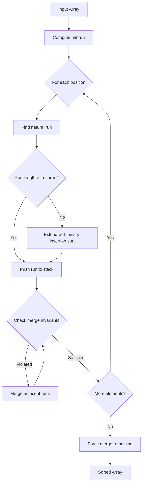

# Tim Sort

## Overview

| Property | Value |
|----------|-------|
| **Category** | Sorting Algorithm |
| **Type** | Hybrid (Merge Sort + Insertion Sort) |
| **Data Structure** | Array |
| **Space Complexity** | O(n) |
| **Stable** | Yes |
| **In-Place** | No |
| **Adaptive** | Yes (exploits existing order) |

---

## Mathematical Foundation

### Definition

Tim Sort is a **hybrid stable sorting algorithm** derived from merge sort and insertion sort. It was designed to perform well on many kinds of real-world data by taking advantage of existing order (natural runs) in the input.

### Historical Context

Invented by **Tim Peters** in 2002 for use in Python. It became Python's standard sorting algorithm and was later adopted by Java (Arrays.sort for objects) and Android.

### Core Concepts

#### 1. Natural Runs

A **run** is a sequence of consecutive elements that is either:
- **Ascending**: $a_0 \leq a_1 \leq ... \leq a_{k-1}$
- **Strictly descending**: $a_0 > a_1 > ... > a_{k-1}$ (reversed to ascending)

**Formal Definition:**
$$run = \{a_i, a_{i+1}, ..., a_j\} \text{ where } a_k \leq a_{k+1} \text{ or } a_k > a_{k+1} \forall k \in [i, j)$$

#### 2. Minimum Run Length (minrun)

The **minrun** is computed to ensure efficient merging:

$$minrun = \begin{cases} 
n & \text{if } n < 64 \\
32 \leq minrun \leq 64 & \text{such that } \frac{n}{minrun} \text{ is a power of 2 or close}
\end{cases}$$

**Computation:**
```
r = 0
while n >= 64:
    r |= n & 1  # Keep track of shifted out bits
    n >>= 1     # n = n // 2
minrun = n + r  # Ensures minrun is in range [32, 64]
```

#### 3. Merge Invariants

Tim Sort maintains a stack of runs with invariants to ensure balanced merging:

**Invariant 1:** $|run_{i-2}| > |run_{i-1}| + |run_i|$
**Invariant 2:** $|run_{i-1}| > |run_i|$

These ensure the stack size is at most $O(\log n)$.

### Galloping Mode

When merging runs A and B, if many consecutive elements come from the same run, **galloping mode** activates:

**Galloping Search (Exponential Search):**
1. Start with step = 1
2. Compare at positions 1, 3, 7, 15, ... ($2^k - 1$)
3. Binary search in the identified range

$$\text{Galloping cost} = O(\log k) \text{ for } k \text{ consecutive elements}$$

---

## Pseudocode

### Main Algorithm

```
TIM-SORT(A):
    Input: Array A of n elements
    Output: Sorted array
    
    n ← length(A)
    
    // Compute minimum run length
    minrun ← compute_minrun(n)
    
    // Find runs and extend short ones
    runs ← []
    i ← 0
    while i < n:
        // Find next run
        run_start ← i
        run_end ← find_run(A, i)
        run_length ← run_end - run_start
        
        // If run is too short, extend using insertion sort
        if run_length < minrun:
            extend_end ← min(run_start + minrun, n)
            binary_insertion_sort(A, run_start, extend_end, run_end)
            run_end ← extend_end
        
        push(runs, (run_start, run_end - run_start))
        
        // Merge to maintain invariants
        merge_collapse(A, runs)
        
        i ← run_end
    
    // Final merges
    merge_force_collapse(A, runs)
    
    return A
```

### Binary Insertion Sort

```
BINARY-INSERTION-SORT(A, start, end, sorted_end):
    // A[start:sorted_end] is already sorted
    // Sort A[start:end] using binary insertion
    
    for i ← sorted_end to end - 1:
        value ← A[i]
        pos ← binary_search_position(A, start, i, value)
        
        // Shift elements right
        for j ← i downto pos + 1:
            A[j] ← A[j-1]
        
        A[pos] ← value
```

### Merge with Galloping

```
MERGE(A, run1, run2):
    // Merge two adjacent runs
    // Uses galloping for efficiency
    
    temp ← copy(A[run1.start : run1.end])
    
    i ← 0           // Index in temp (run1)
    j ← run2.start  // Index in run2
    k ← run1.start  // Output index
    
    while i < len(temp) AND j < run2.end:
        if temp[i] <= A[j]:
            A[k] ← temp[i]
            i ← i + 1
            consecutive_from_temp ← consecutive_from_temp + 1
        else:
            A[k] ← A[j]
            j ← j + 1
            consecutive_from_A ← consecutive_from_A + 1
        k ← k + 1
        
        // Enter galloping mode if one run is "winning"
        if consecutive_from_temp >= MIN_GALLOP:
            gallop_merge(...)
    
    // Copy remaining elements
    copy_remaining(...)
```

---

## Complexity Analysis

### Time Complexity

| Case | Complexity | Condition |
|------|------------|-----------|
| **Best** | $O(n)$ | Already sorted (single run) |
| **Average** | $O(n \log n)$ | Random data |
| **Worst** | $O(n \log n)$ | No natural runs |

### Detailed Analysis

**Best Case $O(n)$:**
- Input is already sorted (ascending or descending)
- Single run identified
- Only $n-1$ comparisons needed

**Worst Case $O(n \log n)$:**
- No natural runs longer than minrun
- Full merge sort behavior
- $\frac{n}{minrun}$ runs to merge

**Adaptive Performance:**

For data with $k$ natural runs:
$$T(n, k) = O(n \log k)$$

When runs are nearly sorted:
$$T(n) = O(n)$$

### Space Complexity

| Component | Space |
|-----------|-------|
| Temporary merge buffer | $O(n)$ |
| Run stack | $O(\log n)$ |
| **Total** | $O(n)$ |

### Comparison with Other Sorts

| Algorithm | Best | Average | Worst | Space | Stable | Adaptive |
|-----------|------|---------|-------|-------|--------|----------|
| Tim Sort | $O(n)$ | $O(n \log n)$ | $O(n \log n)$ | $O(n)$ | Yes | Yes |
| Merge Sort | $O(n \log n)$ | $O(n \log n)$ | $O(n \log n)$ | $O(n)$ | Yes | No |
| Quick Sort | $O(n \log n)$ | $O(n \log n)$ | $O(n^2)$ | $O(\log n)$ | No | No |
| Heap Sort | $O(n \log n)$ | $O(n \log n)$ | $O(n \log n)$ | $O(1)$ | No | No |

---

## Visual Representation

### Algorithm Flow



### Run Detection Example

```
Input: [1, 2, 5, 3, 1, 4, 6, 8, 7, 2]

Step 1: Detect runs
Run 1: [1, 2, 5]     (ascending)
Run 2: [3, 1]        (descending, reversed to [1, 3])
Run 3: [4, 6, 8]     (ascending)
Run 4: [7, 2]        (descending, reversed to [2, 7])

If minrun = 4:
Run 1: [1, 2, 5] extended to [1, 2, 3, 5] using insertion sort

After merging:
[1, 1, 2, 2, 3, 4, 5, 6, 7, 8]
```

### Merge Stack Invariants

```
Stack state must satisfy:
  |Z| > |Y| + |X|
  |Y| > |X|

Example stack:
  ┌─────────────────┐
  │ X: len = 5      │ ← top
  ├─────────────────┤
  │ Y: len = 8      │
  ├─────────────────┤
  │ Z: len = 15     │
  └─────────────────┘

Check: 15 > 8 + 5 ✓
Check: 8 > 5 ✓

If violated, merge Y and X (or Y and Z) to restore invariants.
```

---

## Implementation Details

### Key Components

1. **Run Detection**: Identify ascending/descending sequences
2. **Binary Insertion Sort**: For extending short runs
3. **Galloping Merge**: Efficient merging with exponential search
4. **Stack Management**: Maintain merge invariants

### Python Implementation

```python
def binary_search(lst, item, start, end):
    """Find insertion position using binary search."""
    if start == end:
        return start if lst[start] > item else start + 1
    if start > end:
        return start
    
    mid = (start + end) // 2
    if lst[mid] < item:
        return binary_search(lst, item, mid + 1, end)
    elif lst[mid] > item:
        return binary_search(lst, item, start, mid - 1)
    else:
        return mid


def insertion_sort(lst):
    """Binary insertion sort for small runs."""
    length = len(lst)
    for index in range(1, length):
        value = lst[index]
        pos = binary_search(lst, value, 0, index - 1)
        lst = [*lst[:pos], value, *lst[pos:index], *lst[index + 1:]]
    return lst


def merge(left, right):
    """Merge two sorted lists."""
    if not left:
        return right
    if not right:
        return left
    if left[0] < right[0]:
        return [left[0], *merge(left[1:], right)]
    return [right[0], *merge(left, right[1:])]


def tim_sort(lst):
    """Simplified Tim Sort implementation."""
    length = len(lst)
    runs, sorted_runs = [], []
    new_run = [lst[0]]
    
    # Identify natural runs
    i = 1
    while i < length:
        if lst[i] < lst[i - 1]:
            runs.append(new_run)
            new_run = [lst[i]]
        else:
            new_run.append(lst[i])
        i += 1
    runs.append(new_run)
    
    # Sort each run using insertion sort
    for run in runs:
        sorted_runs.append(insertion_sort(run))
    
    # Merge all runs
    sorted_array = []
    for run in sorted_runs:
        sorted_array = merge(sorted_array, run)
    
    return sorted_array
```

---

## Real-World Applications

### 1. **Programming Language Standard Libraries**

**Use Case**: Default sorting in Python, Java, Android.

```python
# Python's built-in sort uses Tim Sort
data = [3, 1, 4, 1, 5, 9, 2, 6, 5, 3, 5]
sorted_data = sorted(data)  # Tim Sort under the hood

# Java (for objects)
# Arrays.sort(Object[] a) uses Tim Sort
```

### 2. **Database Query Results**

**Use Case**: Sorting query results that often have natural ordering (timestamps, sequential IDs).

```python
# Database records often have partial ordering
class QuerySorter:
    """
    Sort database query results exploiting
    natural time-based ordering.
    """
    
    def sort_by_timestamp(self, records):
        """
        Tim Sort is optimal here because:
        - Records often arrive in mostly time-order
        - Natural runs exist in the data
        - Stability preserves insertion order ties
        """
        return sorted(records, key=lambda r: r.timestamp)
    
    def sort_with_secondary_key(self, records, primary, secondary):
        """
        Stable sort enables multi-key sorting:
        Sort by secondary first, then by primary.
        """
        records = sorted(records, key=lambda r: getattr(r, secondary))
        records = sorted(records, key=lambda r: getattr(r, primary))
        return records
```

### 3. **User Interface Data Tables**

**Use Case**: Sorting data tables in GUI applications where user expects stability.

```python
# GUI table sorting
class DataTable:
    """
    Sortable data table using Tim Sort for
    stable, efficient sorting.
    """
    
    def __init__(self, rows):
        self.rows = rows
        self.sort_history = []
    
    def sort_by_column(self, column, reverse=False):
        """
        Sort by column while preserving previous sort order
        for equal elements (stability).
        """
        self.rows.sort(key=lambda row: row[column], reverse=reverse)
        self.sort_history.append(column)
    
    def multi_column_sort(self, columns):
        """
        Sort by multiple columns (stable sort cascade).
        """
        # Sort in reverse priority order
        for column in reversed(columns):
            self.rows.sort(key=lambda row: row[column])
```

### 4. **Log File Processing**

**Use Case**: Merging and sorting log files that are individually sorted.

```python
# Log file merging
class LogProcessor:
    """
    Process multiple log files that are individually
    sorted by timestamp.
    """
    
    def merge_log_files(self, log_files):
        """
        Tim Sort excels when input is composed of
        sorted subsequences (from different log files).
        """
        all_entries = []
        for log_file in log_files:
            all_entries.extend(log_file.entries)
        
        # Tim Sort will detect the sorted runs
        # from each individual log file
        return sorted(all_entries, key=lambda e: e.timestamp)
```

### 5. **E-commerce Product Listings**

**Use Case**: Sorting products that may already be partially sorted by relevance.

```python
# Product sorting with relevance scores
class ProductSorter:
    """
    Sort products where data often arrives
    pre-sorted by some criteria.
    """
    
    def sort_by_relevance_and_price(self, products):
        """
        Multi-criteria sort using Tim Sort stability:
        1. Sort by price (secondary)
        2. Sort by relevance (primary)
        """
        # Stable sort allows this pattern
        sorted_by_price = sorted(products, key=lambda p: p.price)
        sorted_by_relevance = sorted(sorted_by_price, 
                                     key=lambda p: p.relevance, 
                                     reverse=True)
        return sorted_by_relevance
    
    def sort_with_categories(self, products):
        """
        Products within categories are often pre-sorted.
        Tim Sort exploits this natural ordering.
        """
        return sorted(products, key=lambda p: (p.category, p.relevance))
```

---

## When to Use Tim Sort

### ✅ Ideal Scenarios

1. **Real-world data** - Often has natural runs
2. **Stability required** - Preserves original order of equal elements
3. **Multi-key sorting** - Cascade sorts work correctly
4. **Partially sorted input** - Best case $O(n)$
5. **Unknown data distribution** - Robust across patterns

### ❌ Consider Alternatives When

1. **Memory constraints** - Needs $O(n)$ extra space
2. **Integer/string keys with known range** - Radix sort faster
3. **Simple primitives** - Quick sort may be faster
4. **Parallel processing needed** - Merge sort parallelizes better

---

## Performance Characteristics

### Best-Case Input Types

| Input Pattern | Performance | Reason |
|---------------|-------------|--------|
| Sorted | $O(n)$ | Single run detected |
| Reverse sorted | $O(n)$ | Run detected and reversed |
| Sorted chunks | $O(n \log k)$ | $k$ natural runs |
| Random | $O(n \log n)$ | Full merging needed |

### Memory Usage

```
For n = 1,000,000 elements:
- Merge buffer: ~4-8 MB (for 32/64-bit elements)
- Run stack: ~30 entries × 16 bytes = 480 bytes
- Total overhead: ~4-8 MB
```

---

## References

1. Peters, T. (2002). "Timsort" - Python Library Reference
2. [Wikipedia: Timsort](https://en.wikipedia.org/wiki/Timsort)
3. McIlroy, P. (1993). "Optimistic Sorting and Information Theoretic Complexity"
4. Cook, S. & Kim, D.J. (2011). "Formal Verification of Timsort"

---

## See Also

- [Merge Sort](merge_sort.md) - Base algorithm for Tim Sort merging
- [Insertion Sort](insertion_sort.md) - Used for small runs
- [Quick Sort](quick_sort.md) - Alternative for primitive types

