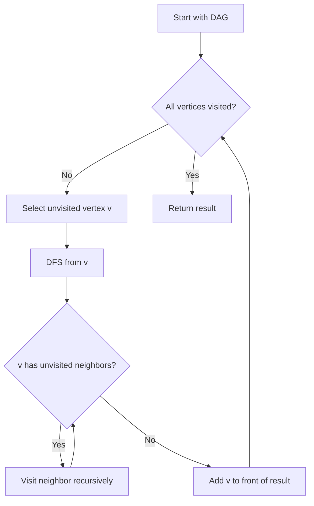

# Topological Sort

## Overview

| Property | Value |
|----------|-------|
| **Category** | Graph Algorithm / Sorting |
| **Type** | Non-Comparison Sort |
| **Data Structure** | Directed Acyclic Graph (DAG) |
| **Time Complexity** | O(V + E) |
| **Space Complexity** | O(V) |
| **Stable** | N/A |
| **Paradigm** | Depth-First Search |

---

## Mathematical Foundation

### Definition

**Topological Sort** produces a linear ordering of vertices in a directed acyclic graph (DAG) such that for every directed edge $(u, v)$, vertex $u$ comes before vertex $v$ in the ordering.

### Formal Definition

Given a DAG $G = (V, E)$:
$$\text{TopSort}(G) = [v_1, v_2, ..., v_n]$$

Such that:
$$\forall (u, v) \in E: \text{index}(u) < \text{index}(v)$$

### Existence and Uniqueness

**Existence Theorem**: A topological ordering exists if and only if the graph is a DAG (has no cycles).

**Uniqueness**: Topological ordering is unique if and only if there exists a Hamiltonian path in the DAG.

### Mathematical Properties

**Partial Order**: Topological sort linearizes a partial order defined by the DAG.

For vertices $u$, $v$:
- If there's a path from $u$ to $v$: $u$ must come before $v$
- If neither can reach the other: either order is valid

**Number of Orderings**: For a DAG with $n$ vertices:
$$1 \leq |\text{TopSorts}(G)| \leq n!$$

### In-Degree Based Formulation

Define in-degree for vertex $v$:
$$\text{in-degree}(v) = |\{u : (u, v) \in E\}|$$

A vertex can be added to the ordering when its in-degree becomes 0.

---

## Pseudocode

### DFS-Based Approach

```
TOPOLOGICAL-SORT-DFS(G):
    Input: Directed acyclic graph G = (V, E)
    Output: Topologically sorted list of vertices
    
    visited ← empty set
    result ← empty list
    
    for each vertex v in V:
        if v not in visited:
            DFS-VISIT(v, visited, result)
    
    return reverse(result)


DFS-VISIT(v, visited, result):
    visited.add(v)
    
    for each neighbor u of v:
        if u not in visited:
            DFS-VISIT(u, visited, result)
    
    // Add vertex after all descendants processed
    result.append(v)
```

### Kahn's Algorithm (BFS-Based)

```
TOPOLOGICAL-SORT-KAHN(G):
    Input: Directed acyclic graph G = (V, E)
    Output: Topologically sorted list of vertices
    
    // Calculate in-degrees
    in_degree ← array of size |V| initialized to 0
    for each edge (u, v) in E:
        in_degree[v] ← in_degree[v] + 1
    
    // Initialize queue with zero in-degree vertices
    queue ← empty queue
    for each vertex v in V:
        if in_degree[v] = 0:
            queue.enqueue(v)
    
    result ← empty list
    
    while queue not empty:
        v ← queue.dequeue()
        result.append(v)
        
        for each neighbor u of v:
            in_degree[u] ← in_degree[u] - 1
            if in_degree[u] = 0:
                queue.enqueue(u)
    
    if |result| ≠ |V|:
        error "Graph has a cycle"
    
    return result
```

---

## Complexity Analysis

### Time Complexity

| Algorithm | Complexity | Breakdown |
|-----------|------------|-----------|
| **DFS-based** | $O(V + E)$ | Visit each vertex and edge once |
| **Kahn's** | $O(V + E)$ | Process each vertex and edge once |

### Space Complexity

| Component | Space |
|-----------|-------|
| Visited set | O(V) |
| Result list | O(V) |
| Recursion stack (DFS) | O(V) |
| Queue (Kahn's) | O(V) |
| **Total** | O(V) |

### Comparison of Approaches

| Aspect | DFS-based | Kahn's Algorithm |
|--------|-----------|------------------|
| Detection of cycle | Post-check | Natural (|result| ≠ |V|) |
| Memory pattern | Stack | Queue |
| Implementation | Recursive | Iterative |
| Parallelization | Harder | Easier |

---

## Visual Representation

### Example DAG

```
       a
      / \
     b   c
    / \
   d   e

Edges: a→b, a→c, b→d, b→e
```

### DFS Traversal Order

```
DFS from 'a':
  Visit a
    Visit b (neighbor of a)
      Visit d (neighbor of b)
        d has no neighbors → add 'd' to result
      Visit e (neighbor of b)
        e has no neighbors → add 'e' to result
      b's neighbors done → add 'b' to result
    Visit c (neighbor of a)
      c has no neighbors → add 'c' to result
    a's neighbors done → add 'a' to result

Result (before reverse): [d, e, b, c, a]
Final result: [a, c, b, e, d] or [a, b, d, e, c]

Note: Multiple valid orderings exist
```

### Kahn's Algorithm Visualization

```
Initial in-degrees:
  a: 0, b: 1, c: 1, d: 1, e: 1

Step 1: Queue = [a], Result = []
  Process 'a': reduce in-degree of b, c
  in-degrees: b: 0, c: 0, d: 1, e: 1
  Queue = [b, c], Result = [a]

Step 2: Queue = [b, c]
  Process 'b': reduce in-degree of d, e
  in-degrees: c: 0, d: 0, e: 0
  Queue = [c, d, e], Result = [a, b]

Step 3: Process remaining
  Result = [a, b, c, d, e]
```

### Algorithm Flow



---

## Implementation Details

### Python Implementation (DFS-Based)

```python
"""Topological Sort using DFS."""

edges: dict[str, list[str]] = {
    "a": ["c", "b"],
    "b": ["d", "e"],
    "c": [],
    "d": [],
    "e": [],
}
vertices: list[str] = ["a", "b", "c", "d", "e"]


def topological_sort(start: str, visited: list[str], sort: list[str]) -> list[str]:
    """
    Perform topological sort on a directed acyclic graph.
    
    >>> edges = {"a": ["b"], "b": ["c"], "c": []}
    >>> topological_sort("a", [], [])
    ['c', 'b', 'a']
    """
    current = start
    visited.append(current)
    neighbors = edges[current]
    
    for neighbor in neighbors:
        if neighbor not in visited:
            sort = topological_sort(neighbor, visited, sort)
    
    sort.append(current)
    
    # Visit remaining vertices
    if len(visited) != len(vertices):
        for vertice in vertices:
            if vertice not in visited:
                sort = topological_sort(vertice, visited, sort)
    
    return sort
```

### Kahn's Algorithm Implementation

```python
from collections import deque


def topological_sort_kahn(graph: dict[str, list[str]]) -> list[str]:
    """
    Topological sort using Kahn's algorithm (BFS-based).
    
    >>> graph = {"a": ["b", "c"], "b": ["d"], "c": ["d"], "d": []}
    >>> topological_sort_kahn(graph)
    ['a', 'b', 'c', 'd']
    >>> graph_cycle = {"a": ["b"], "b": ["a"]}
    >>> topological_sort_kahn(graph_cycle)
    Traceback (most recent call last):
        ...
    ValueError: Graph has a cycle
    """
    # Calculate in-degrees
    in_degree = {v: 0 for v in graph}
    for vertex in graph:
        for neighbor in graph[vertex]:
            in_degree[neighbor] = in_degree.get(neighbor, 0) + 1
    
    # Initialize queue with zero in-degree vertices
    queue = deque([v for v in graph if in_degree[v] == 0])
    result = []
    
    while queue:
        vertex = queue.popleft()
        result.append(vertex)
        
        for neighbor in graph[vertex]:
            in_degree[neighbor] -= 1
            if in_degree[neighbor] == 0:
                queue.append(neighbor)
    
    if len(result) != len(graph):
        raise ValueError("Graph has a cycle")
    
    return result
```

### Generic Implementation with Cycle Detection

```python
from enum import Enum
from typing import TypeVar

T = TypeVar('T')


class Color(Enum):
    WHITE = 0  # Unvisited
    GRAY = 1   # In progress
    BLACK = 2  # Finished


def topological_sort_with_cycle_detection(
    graph: dict[T, list[T]]
) -> list[T]:
    """
    DFS-based topological sort with cycle detection.
    
    >>> graph = {"a": ["b"], "b": ["c"], "c": []}
    >>> topological_sort_with_cycle_detection(graph)
    ['a', 'b', 'c']
    >>> cyclic = {"a": ["b"], "b": ["c"], "c": ["a"]}
    >>> topological_sort_with_cycle_detection(cyclic)
    Traceback (most recent call last):
        ...
    ValueError: Graph contains a cycle
    """
    color = {v: Color.WHITE for v in graph}
    result = []
    
    def dfs(vertex: T) -> None:
        if color[vertex] == Color.GRAY:
            raise ValueError("Graph contains a cycle")
        if color[vertex] == Color.BLACK:
            return
        
        color[vertex] = Color.GRAY
        
        for neighbor in graph.get(vertex, []):
            dfs(neighbor)
        
        color[vertex] = Color.BLACK
        result.append(vertex)
    
    for vertex in graph:
        if color[vertex] == Color.WHITE:
            dfs(vertex)
    
    return result[::-1]
```

---

## Real-World Applications

### 1. **Build Systems (Make, Gradle)**

**Use Case**: Determining compilation order of dependencies.

```python
class BuildSystem:
    """
    Build system that compiles files in dependency order.
    """
    
    def __init__(self):
        self.dependencies: dict[str, list[str]] = {}
    
    def add_dependency(self, target: str, dependency: str) -> None:
        """Add a dependency: target depends on dependency."""
        if target not in self.dependencies:
            self.dependencies[target] = []
        if dependency not in self.dependencies:
            self.dependencies[dependency] = []
        self.dependencies[target].append(dependency)
    
    def get_build_order(self) -> list[str]:
        """
        Get the order in which files should be built.
        
        >>> build = BuildSystem()
        >>> build.add_dependency("app.exe", "main.o")
        >>> build.add_dependency("main.o", "main.c")
        >>> build.add_dependency("main.o", "utils.h")
        >>> build.add_dependency("app.exe", "utils.o")
        >>> build.add_dependency("utils.o", "utils.c")
        >>> build.add_dependency("utils.o", "utils.h")
        >>> order = build.get_build_order()
        >>> order.index("main.c") < order.index("main.o")
        True
        >>> order.index("main.o") < order.index("app.exe")
        True
        """
        # Reverse edges for topological sort
        reverse_graph = {v: [] for v in self.dependencies}
        for target, deps in self.dependencies.items():
            for dep in deps:
                reverse_graph[dep].append(target)
        
        return topological_sort_kahn(reverse_graph)
```

### 2. **Course Prerequisites**

**Use Case**: Determining valid course enrollment order.

```python
def find_course_order(
    num_courses: int,
    prerequisites: list[tuple[int, int]]
) -> list[int]:
    """
    Find a valid order to take courses given prerequisites.
    
    Args:
        num_courses: Total number of courses
        prerequisites: List of (course, prereq) pairs
    
    Returns:
        Valid course order, or empty list if impossible
    
    >>> find_course_order(4, [(1, 0), (2, 0), (3, 1), (3, 2)])
    [0, 1, 2, 3]
    >>> find_course_order(2, [(0, 1), (1, 0)])  # Cycle
    []
    """
    # Build adjacency list
    graph = {i: [] for i in range(num_courses)}
    in_degree = [0] * num_courses
    
    for course, prereq in prerequisites:
        graph[prereq].append(course)
        in_degree[course] += 1
    
    # Kahn's algorithm
    queue = [i for i in range(num_courses) if in_degree[i] == 0]
    result = []
    
    while queue:
        course = queue.pop(0)
        result.append(course)
        
        for next_course in graph[course]:
            in_degree[next_course] -= 1
            if in_degree[next_course] == 0:
                queue.append(next_course)
    
    return result if len(result) == num_courses else []
```

### 3. **Package Dependency Resolution**

**Use Case**: Installing packages in correct order.

```python
class PackageManager:
    """
    Package manager that resolves dependencies.
    """
    
    def __init__(self):
        self.packages: dict[str, list[str]] = {}
    
    def add_package(self, name: str, dependencies: list[str]) -> None:
        """Register a package with its dependencies."""
        self.packages[name] = dependencies
        for dep in dependencies:
            if dep not in self.packages:
                self.packages[dep] = []
    
    def get_install_order(self, package: str) -> list[str]:
        """
        Get installation order for a package and its dependencies.
        
        >>> pm = PackageManager()
        >>> pm.add_package("numpy", [])
        >>> pm.add_package("scipy", ["numpy"])
        >>> pm.add_package("pandas", ["numpy"])
        >>> pm.add_package("sklearn", ["numpy", "scipy"])
        >>> order = pm.get_install_order("sklearn")
        >>> order.index("numpy") < order.index("scipy")
        True
        >>> order.index("scipy") < order.index("sklearn")
        True
        """
        # Find all required packages
        required = self._get_all_dependencies(package)
        required.add(package)
        
        # Build subgraph
        subgraph = {p: [d for d in self.packages[p] if d in required] 
                    for p in required}
        
        # Topological sort (reversed for install order)
        return topological_sort_kahn({p: [] for p in subgraph} | 
                                     {d: [p] for p, deps in subgraph.items() 
                                      for d in deps})
    
    def _get_all_dependencies(self, package: str) -> set[str]:
        """Recursively get all dependencies."""
        result = set()
        stack = [package]
        
        while stack:
            pkg = stack.pop()
            for dep in self.packages.get(pkg, []):
                if dep not in result:
                    result.add(dep)
                    stack.append(dep)
        
        return result
```

### 4. **Task Scheduling in CI/CD**

**Use Case**: Scheduling pipeline stages.

```python
from dataclasses import dataclass
from typing import Optional


@dataclass
class Task:
    name: str
    duration: int
    dependencies: list[str]


class PipelineScheduler:
    """
    Schedule CI/CD pipeline tasks respecting dependencies.
    """
    
    def __init__(self):
        self.tasks: dict[str, Task] = {}
    
    def add_task(self, name: str, duration: int, dependencies: list[str] = None):
        """Add a task to the pipeline."""
        self.tasks[name] = Task(name, duration, dependencies or [])
    
    def get_execution_plan(self) -> list[list[str]]:
        """
        Get execution plan with parallel stages.
        
        Returns list of stages, each containing tasks that can run in parallel.
        """
        # Calculate in-degrees
        in_degree = {t: 0 for t in self.tasks}
        for task in self.tasks.values():
            for dep in task.dependencies:
                in_degree[task.name] += 1
        
        stages = []
        remaining = set(self.tasks.keys())
        
        while remaining:
            # Find all tasks with no pending dependencies
            ready = [t for t in remaining if in_degree[t] == 0]
            
            if not ready:
                raise ValueError("Circular dependency detected")
            
            stages.append(ready)
            
            for task_name in ready:
                remaining.remove(task_name)
                # Update in-degrees
                for t in remaining:
                    if task_name in self.tasks[t].dependencies:
                        in_degree[t] -= 1
        
        return stages


# Example: CI/CD Pipeline
pipeline = PipelineScheduler()
pipeline.add_task("checkout", 10)
pipeline.add_task("install", 30, ["checkout"])
pipeline.add_task("lint", 20, ["install"])
pipeline.add_task("test", 60, ["install"])
pipeline.add_task("build", 45, ["lint", "test"])
pipeline.add_task("deploy", 30, ["build"])
```

---

## Advantages and Disadvantages

### ✅ Advantages

1. **O(V + E) efficiency** - linear time
2. **Detects cycles** - identifies invalid DAGs
3. **Multiple orderings** - flexibility in scheduling
4. **Parallelization** - identifies independent tasks
5. **Well-understood** - classic algorithm

### ❌ Disadvantages

1. **Only works on DAGs** - no cycles allowed
2. **Not deterministic** - multiple valid orderings
3. **No optimization** - doesn't minimize makespan
4. **Memory overhead** - stores entire graph

---

## References

1. [Wikipedia: Topological Sorting](https://en.wikipedia.org/wiki/Topological_sorting)
2. Cormen et al., "Introduction to Algorithms" (CLRS)
3. Kahn, A.B. (1962) - "Topological sorting of large networks"

---

## See Also

- [Depth-First Search](../04_graphs/dfs.md) - Foundation algorithm
- [Breadth-First Search](../04_graphs/bfs.md) - Kahn's basis
- [Directed Acyclic Graph](../04_graphs/dag.md) - Data structure
