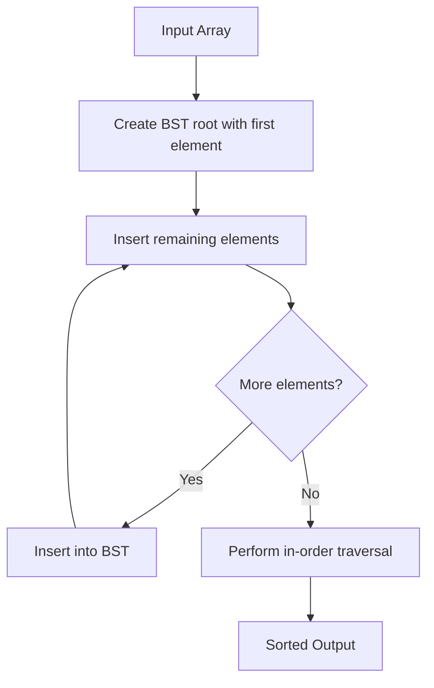

# Tree Sort

## Overview

| Property | Value |
|----------|-------|
| **Category** | Sorting Algorithm |
| **Type** | Comparison-Based (Tree-Based) |
| **Data Structure** | Binary Search Tree |
| **Space Complexity** | O(n) |
| **Stable** | No (standard BST) |
| **In-Place** | No |
| **Adaptive** | No |

---

## Mathematical Foundation

### Definition

**Tree Sort** is a sorting algorithm that builds a Binary Search Tree (BST) from the input elements and then performs an in-order traversal to retrieve elements in sorted order.

### Binary Search Tree Property

For every node $x$ in a BST:
- All nodes in the left subtree have values < $x$
- All nodes in the right subtree have values > $x$ (or ≥ for duplicates)

### Algorithm Principle

1. **Build BST**: Insert all elements into a BST
2. **In-order Traversal**: Visit nodes in order (Left → Root → Right)
3. **Result**: Elements are retrieved in sorted order

### In-Order Traversal Correctness

For a BST with in-order traversal $T$:
$$T(node) = T(node.left) \oplus [node.val] \oplus T(node.right)$$

This produces sorted output because:
- Left subtree values < current < right subtree values
- Recursively applying this yields sorted sequence

### Mathematical Properties

**BST Insertion:**
- Average case: $O(\log n)$ per insertion
- Worst case: $O(n)$ per insertion (skewed tree)

**Tree Height:**
- Balanced tree: $h = O(\log n)$
- Skewed tree: $h = O(n)$

**Total Time:**
$$T(n) = \sum_{i=1}^{n} O(h_i) + O(n)$$

Where $h_i$ is tree height at insertion $i$.

---

## Pseudocode

```
TREE-SORT(A):
    Input: Array A of n elements
    Output: Sorted array
    
    if A is empty:
        return empty array
    
    // Build BST
    root ← new Node(A[0])
    
    for i ← 1 to n - 1:
        INSERT(root, A[i])
    
    // In-order traversal to extract sorted elements
    result ← IN-ORDER-TRAVERSAL(root)
    
    return result


INSERT(node, value):
    if value < node.val:
        if node.left is null:
            node.left ← new Node(value)
        else:
            INSERT(node.left, value)
    else:  // value >= node.val
        if node.right is null:
            node.right ← new Node(value)
        else:
            INSERT(node.right, value)


IN-ORDER-TRAVERSAL(node):
    if node is null:
        return empty list
    
    result ← []
    result.extend(IN-ORDER-TRAVERSAL(node.left))
    result.append(node.val)
    result.extend(IN-ORDER-TRAVERSAL(node.right))
    
    return result
```

### Iterative In-Order Traversal

```
IN-ORDER-ITERATIVE(root):
    result ← []
    stack ← empty stack
    current ← root
    
    while current is not null OR stack is not empty:
        // Go to leftmost node
        while current is not null:
            stack.push(current)
            current ← current.left
        
        // Process node
        current ← stack.pop()
        result.append(current.val)
        
        // Move to right subtree
        current ← current.right
    
    return result
```

---

## Complexity Analysis

### Time Complexity

| Case | Complexity | When |
|------|------------|------|
| **Best** | $O(n \log n)$ | Balanced insertions |
| **Average** | $O(n \log n)$ | Random input |
| **Worst** | $O(n^2)$ | Sorted/reverse sorted input |

**Breakdown:**

| Operation | Best/Average | Worst |
|-----------|--------------|-------|
| n insertions | $O(n \log n)$ | $O(n^2)$ |
| In-order traversal | $O(n)$ | $O(n)$ |
| **Total** | $O(n \log n)$ | $O(n^2)$ |

### Space Complexity

| Component | Space |
|-----------|-------|
| BST nodes | $O(n)$ |
| Recursion stack | $O(h)$ where $h$ = height |
| Output array | $O(n)$ |
| **Total** | $O(n)$ |

### Why O(n²) Worst Case?

For sorted input $[1, 2, 3, 4, 5]$:

```
Insert 1: Tree = 1
Insert 2: Tree = 1 → 2        (1 comparison)
Insert 3: Tree = 1 → 2 → 3    (2 comparisons)
Insert 4: Tree = 1 → 2 → 3 → 4  (3 comparisons)
Insert 5: Tree = 1 → 2 → 3 → 4 → 5  (4 comparisons)

Total: 1 + 2 + 3 + 4 = n(n-1)/2 = O(n²)
```

---

## Visual Representation

### Algorithm Flow



### BST Construction Example

```
Input: [5, 2, 7, 1, 6, 8, 3]

Step 1: Insert 5
        5

Step 2: Insert 2
        5
       /
      2

Step 3: Insert 7
        5
       / \
      2   7

Step 4: Insert 1
        5
       / \
      2   7
     /
    1

Step 5: Insert 6
        5
       / \
      2   7
     /   /
    1   6

Step 6: Insert 8
        5
       / \
      2   7
     /   / \
    1   6   8

Step 7: Insert 3
        5
       / \
      2   7
     / \ / \
    1  3 6  8

In-order traversal: 1, 2, 3, 5, 6, 7, 8
```

### Worst Case (Skewed Tree)

```
Input: [1, 2, 3, 4, 5] (sorted)

Tree becomes:
    1
     \
      2
       \
        3
         \
          4
           \
            5

Height = n - 1 = 4 (instead of log₂(5) ≈ 2)
```

---

## Implementation Details

### Python Implementation

```python
from __future__ import annotations
from collections.abc import Iterator
from dataclasses import dataclass


@dataclass
class Node:
    val: int
    left: Node | None = None
    right: Node | None = None

    def __iter__(self) -> Iterator[int]:
        """In-order traversal using generator."""
        if self.left:
            yield from self.left
        yield self.val
        if self.right:
            yield from self.right

    def __len__(self) -> int:
        """Count nodes in tree."""
        return sum(1 for _ in self)

    def insert(self, val: int) -> None:
        """Insert value into BST."""
        if val < self.val:
            if self.left is None:
                self.left = Node(val)
            else:
                self.left.insert(val)
        elif val > self.val:
            if self.right is None:
                self.right = Node(val)
            else:
                self.right.insert(val)
        # Note: This implementation skips duplicates


def tree_sort(arr: list[int]) -> tuple[int, ...]:
    """
    Sort array using Tree Sort algorithm.
    
    >>> tree_sort([])
    ()
    >>> tree_sort([1])
    (1,)
    >>> tree_sort([5, 2, 7])
    (2, 5, 7)
    >>> tree_sort([5, -4, 9, 2, 7])
    (-4, 2, 5, 7, 9)
    >>> tree_sort([5, 6, 1, -1, 4, 37, 2, 7])
    (-1, 1, 2, 4, 5, 6, 7, 37)
    """
    if len(arr) == 0:
        return tuple(arr)
    
    root = Node(arr[0])
    for item in arr[1:]:
        root.insert(item)
    
    return tuple(root)
```

### With Duplicate Handling

```python
@dataclass
class NodeWithDuplicates:
    val: int
    count: int = 1
    left: 'NodeWithDuplicates | None' = None
    right: 'NodeWithDuplicates | None' = None

    def __iter__(self):
        if self.left:
            yield from self.left
        for _ in range(self.count):
            yield self.val
        if self.right:
            yield from self.right

    def insert(self, val: int) -> None:
        if val < self.val:
            if self.left is None:
                self.left = NodeWithDuplicates(val)
            else:
                self.left.insert(val)
        elif val > self.val:
            if self.right is None:
                self.right = NodeWithDuplicates(val)
            else:
                self.right.insert(val)
        else:
            self.count += 1


def tree_sort_with_duplicates(arr: list[int]) -> list[int]:
    """
    Tree sort that handles duplicates.
    
    >>> tree_sort_with_duplicates([3, 1, 2, 3, 1])
    [1, 1, 2, 3, 3]
    """
    if not arr:
        return []
    
    root = NodeWithDuplicates(arr[0])
    for item in arr[1:]:
        root.insert(item)
    
    return list(root)
```

### Iterative In-Order Traversal

```python
def tree_sort_iterative(arr: list[int]) -> list[int]:
    """
    Tree sort with iterative traversal (no recursion).
    
    >>> tree_sort_iterative([5, 2, 7, 1, 6])
    [1, 2, 5, 6, 7]
    """
    if not arr:
        return []
    
    # Build BST
    root = Node(arr[0])
    for item in arr[1:]:
        root.insert(item)
    
    # Iterative in-order traversal
    result = []
    stack = []
    current = root
    
    while current or stack:
        while current:
            stack.append(current)
            current = current.left
        
        current = stack.pop()
        result.append(current.val)
        current = current.right
    
    return result
```

---

## Real-World Applications

### 1. **Database Indexing**

**Use Case**: Building sorted indices for database queries.

```python
class DatabaseIndex:
    """
    Simple database index using BST.
    Provides sorted iteration over keys.
    """
    
    def __init__(self):
        self.root = None
    
    def insert(self, key, record_id):
        """Insert key-record mapping."""
        node = IndexNode(key, record_id)
        if not self.root:
            self.root = node
        else:
            self._insert(self.root, node)
    
    def _insert(self, current, node):
        if node.key < current.key:
            if current.left:
                self._insert(current.left, node)
            else:
                current.left = node
        else:
            if current.right:
                self._insert(current.right, node)
            else:
                current.right = node
    
    def range_query(self, min_key, max_key):
        """
        Find all records with keys in [min_key, max_key].
        Uses in-order traversal property.
        """
        results = []
        self._range_query(self.root, min_key, max_key, results)
        return results
    
    def _range_query(self, node, min_k, max_k, results):
        if not node:
            return
        if min_k < node.key:
            self._range_query(node.left, min_k, max_k, results)
        if min_k <= node.key <= max_k:
            results.append(node.record_id)
        if node.key < max_k:
            self._range_query(node.right, min_k, max_k, results)


@dataclass
class IndexNode:
    key: int
    record_id: int
    left: 'IndexNode | None' = None
    right: 'IndexNode | None' = None
```

### 2. **Priority Queue Implementation**

**Use Case**: Maintaining sorted priority queue.

```python
class BSTQueue:
    """
    Priority queue using BST.
    Always retrieve minimum element efficiently.
    """
    
    def __init__(self):
        self.root = None
        self._size = 0
    
    def insert(self, priority, item):
        """Insert item with priority."""
        node = PriorityNode(priority, item)
        if not self.root:
            self.root = node
        else:
            self._insert(self.root, node)
        self._size += 1
    
    def _insert(self, current, node):
        if node.priority < current.priority:
            if current.left:
                self._insert(current.left, node)
            else:
                current.left = node
                node.parent = current
        else:
            if current.right:
                self._insert(current.right, node)
            else:
                current.right = node
                node.parent = current
    
    def extract_min(self):
        """Remove and return item with minimum priority."""
        if not self.root:
            raise IndexError("Queue is empty")
        
        # Find minimum (leftmost node)
        current = self.root
        while current.left:
            current = current.left
        
        # Remove node
        self._delete_node(current)
        self._size -= 1
        
        return current.item
    
    def _delete_node(self, node):
        """Delete node from BST."""
        # Simplified deletion logic
        if node.right:
            if node.parent:
                if node == node.parent.left:
                    node.parent.left = node.right
                else:
                    node.parent.right = node.right
            else:
                self.root = node.right
            node.right.parent = node.parent
        else:
            if node.parent:
                if node == node.parent.left:
                    node.parent.left = None
                else:
                    node.parent.right = None
            else:
                self.root = None
    
    def get_sorted(self):
        """Get all items in priority order."""
        result = []
        self._inorder(self.root, result)
        return result
    
    def _inorder(self, node, result):
        if node:
            self._inorder(node.left, result)
            result.append(node.item)
            self._inorder(node.right, result)


@dataclass
class PriorityNode:
    priority: int
    item: any
    left: 'PriorityNode | None' = None
    right: 'PriorityNode | None' = None
    parent: 'PriorityNode | None' = None
```

### 3. **Autocomplete / Dictionary**

**Use Case**: Building sorted word dictionary for autocomplete.

```python
class Dictionary:
    """
    Sorted dictionary using BST.
    Efficient for prefix-based queries.
    """
    
    def __init__(self):
        self.root = None
    
    def add_word(self, word):
        """Add word to dictionary."""
        if not self.root:
            self.root = WordNode(word)
        else:
            self._insert(self.root, word)
    
    def _insert(self, node, word):
        if word < node.word:
            if node.left:
                self._insert(node.left, word)
            else:
                node.left = WordNode(word)
        elif word > node.word:
            if node.right:
                self._insert(node.right, word)
            else:
                node.right = WordNode(word)
        # Duplicates ignored
    
    def get_words_starting_with(self, prefix):
        """
        Get all words starting with prefix in sorted order.
        """
        results = []
        self._find_prefix(self.root, prefix, results)
        return results
    
    def _find_prefix(self, node, prefix, results):
        if not node:
            return
        
        if node.word.startswith(prefix):
            self._inorder_collect(node.left, prefix, results)
            results.append(node.word)
            self._inorder_collect(node.right, prefix, results)
        elif prefix < node.word:
            self._find_prefix(node.left, prefix, results)
        else:
            self._find_prefix(node.right, prefix, results)
    
    def _inorder_collect(self, node, prefix, results):
        if not node:
            return
        self._inorder_collect(node.left, prefix, results)
        if node.word.startswith(prefix):
            results.append(node.word)
        self._inorder_collect(node.right, prefix, results)
    
    def get_all_sorted(self):
        """Get all words in sorted order."""
        result = []
        self._inorder(self.root, result)
        return result
    
    def _inorder(self, node, result):
        if node:
            self._inorder(node.left, result)
            result.append(node.word)
            self._inorder(node.right, result)


@dataclass
class WordNode:
    word: str
    left: 'WordNode | None' = None
    right: 'WordNode | None' = None
```

### 4. **Event Scheduling**

**Use Case**: Maintaining sorted event queue.

```python
class EventScheduler:
    """
    Schedule events using BST for sorted order by time.
    """
    
    def __init__(self):
        self.root = None
    
    def schedule(self, time, event_handler):
        """Schedule event at given time."""
        node = EventNode(time, event_handler)
        if not self.root:
            self.root = node
        else:
            self._insert(self.root, node)
    
    def _insert(self, current, node):
        if node.time < current.time:
            if current.left:
                self._insert(current.left, node)
            else:
                current.left = node
        else:
            if current.right:
                self._insert(current.right, node)
            else:
                current.right = node
    
    def get_events_in_range(self, start_time, end_time):
        """Get events in time range, sorted by time."""
        events = []
        self._range_collect(self.root, start_time, end_time, events)
        return events
    
    def _range_collect(self, node, start, end, events):
        if not node:
            return
        if start < node.time:
            self._range_collect(node.left, start, end, events)
        if start <= node.time <= end:
            events.append((node.time, node.handler))
        if node.time < end:
            self._range_collect(node.right, start, end, events)
    
    def process_all(self):
        """Process all events in chronological order."""
        events = []
        self._inorder(self.root, events)
        for time, handler in events:
            handler()


@dataclass
class EventNode:
    time: float
    handler: callable
    left: 'EventNode | None' = None
    right: 'EventNode | None' = None
```

### 5. **Educational Tool for BST**

**Use Case**: Teaching binary search tree concepts.

```python
def visualize_tree_sort(arr):
    """
    Visualize tree sort step by step.
    
    >>> visualize_tree_sort([5, 3, 7, 1, 4])  # doctest: +SKIP
    """
    if not arr:
        print("Empty array")
        return []
    
    print(f"Input: {arr}")
    print("=" * 40)
    
    # Build BST with visualization
    root = VisualNode(arr[0])
    print(f"Insert {arr[0]}:")
    print_tree(root)
    print()
    
    for item in arr[1:]:
        root.insert(item)
        print(f"Insert {item}:")
        print_tree(root)
        print()
    
    # Traverse
    print("=" * 40)
    print("In-order traversal:")
    result = list(root)
    print(f"Result: {result}")
    
    return result


def print_tree(node, level=0, prefix="Root: "):
    """Print tree structure."""
    if node is not None:
        print(" " * (level * 4) + prefix + str(node.val))
        if node.left or node.right:
            if node.left:
                print_tree(node.left, level + 1, "L--- ")
            else:
                print(" " * ((level + 1) * 4) + "L--- (empty)")
            if node.right:
                print_tree(node.right, level + 1, "R--- ")
            else:
                print(" " * ((level + 1) * 4) + "R--- (empty)")


@dataclass
class VisualNode:
    val: int
    left: 'VisualNode | None' = None
    right: 'VisualNode | None' = None
    
    def __iter__(self):
        if self.left:
            yield from self.left
        yield self.val
        if self.right:
            yield from self.right
    
    def insert(self, val):
        if val < self.val:
            if self.left is None:
                self.left = VisualNode(val)
            else:
                self.left.insert(val)
        else:
            if self.right is None:
                self.right = VisualNode(val)
            else:
                self.right.insert(val)
```

---

## Balanced Tree Variants

### Using Self-Balancing Trees

For guaranteed $O(n \log n)$ performance, use balanced trees:

| Tree Type | Insert | Traversal | Total | Complexity Guarantee |
|-----------|--------|-----------|-------|----------------------|
| BST | $O(h)$ | $O(n)$ | $O(n \cdot h)$ | No |
| AVL Tree | $O(\log n)$ | $O(n)$ | $O(n \log n)$ | Yes |
| Red-Black | $O(\log n)$ | $O(n)$ | $O(n \log n)$ | Yes |

```python
# Using Python's standard library
from sortedcontainers import SortedList

def balanced_tree_sort(arr):
    """
    Tree sort with balanced tree (SortedList).
    Guaranteed O(n log n).
    
    >>> balanced_tree_sort([5, 2, 8, 1, 9])
    [1, 2, 5, 8, 9]
    """
    sorted_list = SortedList()
    for item in arr:
        sorted_list.add(item)  # O(log n) insertion
    return list(sorted_list)
```

---

## Comparison with Other Algorithms

| Algorithm | Average | Worst | Space | In-Place |
|-----------|---------|-------|-------|----------|
| Tree Sort (BST) | $O(n \log n)$ | $O(n^2)$ | $O(n)$ | No |
| Tree Sort (Balanced) | $O(n \log n)$ | $O(n \log n)$ | $O(n)$ | No |
| Heap Sort | $O(n \log n)$ | $O(n \log n)$ | $O(1)$ | Yes |
| Merge Sort | $O(n \log n)$ | $O(n \log n)$ | $O(n)$ | No |
| Quick Sort | $O(n \log n)$ | $O(n^2)$ | $O(\log n)$ | Yes |

---

## References

1. [Wikipedia: Tree Sort](https://en.wikipedia.org/wiki/Tree_sort)
2. Cormen, T.H. et al. "Introduction to Algorithms" - Chapter 12
3. [Binary Search Trees](https://en.wikipedia.org/wiki/Binary_search_tree)

---

## See Also

- [Heap Sort](heap_sort.md) - Another tree-based sort
- [Merge Sort](merge_sort.md) - Similar O(n log n) comparison sort
- [Quick Sort](quick_sort.md) - Another comparison sort with O(n²) worst case

