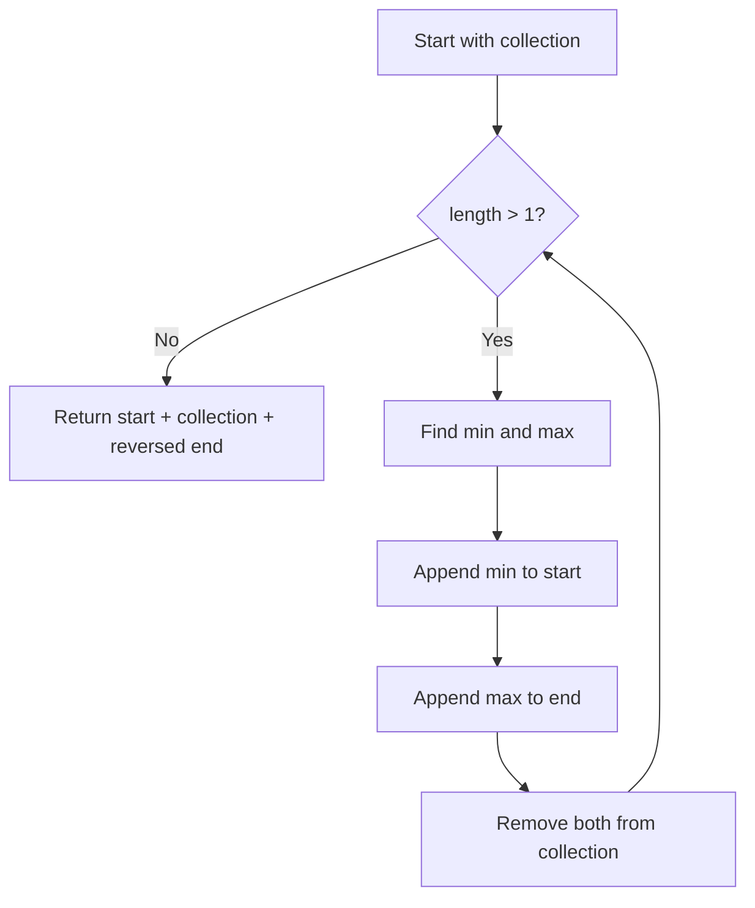

# Unknown Sort (Selection-Based Sort)

## Overview

| Property | Value |
|----------|-------|
| **Category** | Sorting Algorithm |
| **Type** | Selection-Based |
| **Data Structure** | Array |
| **Time Complexity** | O(n²) |
| **Space Complexity** | O(n) |
| **Stable** | Yes |
| **In-Place** | No |

---

## Mathematical Foundation

### Definition

This algorithm sorts by repeatedly finding and removing both the minimum and maximum elements from the input, building the sorted result from both ends simultaneously.

### Algorithm Principle

Each iteration:
1. Find minimum element in remaining collection
2. Find maximum element in remaining collection
3. Append minimum to start of result
4. Append maximum to end of result
5. Remove both from collection

### Mathematical Description

After $k$ iterations:
- First $k$ elements of result: $k$ smallest elements in sorted order
- Last $k$ elements of result: $k$ largest elements in sorted order

For collection of size $n$:
- Number of iterations: $\lfloor n/2 \rfloor$
- Each iteration removes 2 elements

### Invariant

After iteration $i$:
$$\text{result}[0..i-1] \leq \text{collection} \leq \text{result}[n-i..n-1]$$

---

## Pseudocode

```
UNKNOWN-SORT(collection):
    Input: Array of n elements
    Output: Sorted array
    
    start ← []  // Growing from left (minimums)
    end ← []    // Growing from right (maximums)
    
    while |collection| > 1:
        // Find minimum and maximum
        min_val ← MIN(collection)
        max_val ← MAX(collection)
        
        // Add to result ends
        start.append(min_val)
        end.append(max_val)
        
        // Remove from collection
        collection.remove(min_val)
        collection.remove(max_val)
    
    // Handle odd-length case
    // Reverse end to get descending order
    end.reverse()
    
    return start + collection + end
```

---

## Complexity Analysis

### Time Complexity

| Operation | Per Iteration | Total |
|-----------|---------------|-------|
| MIN() | O(n) | O(n²/2) |
| MAX() | O(n) | O(n²/2) |
| remove() | O(n) | O(n²/2) |
| **Total** | O(n) | **O(n²)** |

### Detailed Analysis

For $n$ elements:
- Iteration 1: 3 × n operations
- Iteration 2: 3 × (n-2) operations
- ...
- Iteration k: 3 × (n-2k+2) operations

Total:
$$T(n) = 3 \sum_{k=1}^{n/2} (n - 2k + 2) = O(n^2)$$

### Space Complexity

| Component | Space |
|-----------|-------|
| start list | O(n/2) |
| end list | O(n/2) |
| **Total** | O(n) |

### Best Case

Even when array is sorted:
- $O(n^2)$ - still scans for min/max

### Comparison with Other O(n²) Sorts

| Algorithm | Best | Average | Worst | Space |
|-----------|------|---------|-------|-------|
| This Sort | O(n²) | O(n²) | O(n²) | O(n) |
| Selection Sort | O(n²) | O(n²) | O(n²) | O(1) |
| Bubble Sort | O(n) | O(n²) | O(n²) | O(1) |
| Insertion Sort | O(n) | O(n²) | O(n²) | O(1) |

---

## Visual Representation

### Algorithm Walkthrough

```
Input: [0, 5, 3, 2, 2]

Iteration 1:
  collection = [0, 5, 3, 2, 2]
  min = 0, max = 5
  start = [0], end = [5]
  collection = [3, 2, 2]

Iteration 2:
  collection = [3, 2, 2]
  min = 2, max = 3
  start = [0, 2], end = [5, 3]
  collection = [2]

Final:
  end.reverse() → [3, 5]
  result = [0, 2] + [2] + [3, 5]
         = [0, 2, 2, 3, 5]
```

### Building Result from Both Ends

```
Start: [                          ]
         ↑                      ↑
       start                   end

After removing 0 (min) and 5 (max):
       [0,                      5]
           ↑                  ↑

After removing 2 (min) and 3 (max):
       [0, 2,              3,  5]
              ↑          ↑

After removing remaining 2:
       [0, 2, 2,           3,  5]
                  ↑
           Final result
```

### Algorithm Flow



---

## Implementation Details

### Python Implementation

```python
"""
Python implementation of a sort algorithm.
Best Case Scenario: O(n²)
Worst Case Scenario: O(n²) because native Python functions
min, max, and remove are already O(n)
"""


def merge_sort(collection):
    """
    Implementation that finds min/max simultaneously.
    
    Note: Despite the name, this is NOT merge sort.
    It's a selection-based algorithm.

    :param collection: some mutable ordered collection with heterogeneous
    comparable items inside
    :return: a collection ordered by ascending

    Examples:
    >>> merge_sort([0, 5, 3, 2, 2])
    [0, 2, 2, 3, 5]

    >>> merge_sort([])
    []

    >>> merge_sort([-2, -5, -45])
    [-45, -5, -2]
    """
    start, end = [], []
    
    while len(collection) > 1:
        min_one, max_one = min(collection), max(collection)
        start.append(min_one)
        end.append(max_one)
        collection.remove(min_one)
        collection.remove(max_one)
    
    end.reverse()
    return start + collection + end
```

### Optimized Single-Pass Min-Max

```python
def minmax_sort(collection: list) -> list:
    """
    Optimized version finding min and max in single pass.
    
    >>> minmax_sort([5, 2, 8, 1, 9])
    [1, 2, 5, 8, 9]
    >>> minmax_sort([1])
    [1]
    >>> minmax_sort([])
    []
    """
    if len(collection) <= 1:
        return list(collection)
    
    collection = list(collection)
    start, end = [], []
    
    while len(collection) > 1:
        # Single pass to find both min and max
        min_val = max_val = collection[0]
        min_idx = max_idx = 0
        
        for i, val in enumerate(collection[1:], 1):
            if val < min_val:
                min_val, min_idx = val, i
            elif val > max_val:
                max_val, max_idx = val, i
        
        start.append(min_val)
        end.append(max_val)
        
        # Remove in correct order to maintain indices
        if min_idx > max_idx:
            collection.pop(min_idx)
            collection.pop(max_idx)
        else:
            collection.pop(max_idx)
            collection.pop(min_idx)
    
    end.reverse()
    return start + collection + end
```

### In-Place Variant

```python
def minmax_sort_inplace(arr: list) -> list:
    """
    In-place version using swaps.
    
    >>> arr = [5, 2, 8, 1, 9]
    >>> minmax_sort_inplace(arr)
    [1, 2, 5, 8, 9]
    """
    n = len(arr)
    left, right = 0, n - 1
    
    while left < right:
        min_idx = max_idx = left
        
        # Find min and max in unsorted region
        for i in range(left, right + 1):
            if arr[i] < arr[min_idx]:
                min_idx = i
            if arr[i] > arr[max_idx]:
                max_idx = i
        
        # Swap minimum to left
        arr[left], arr[min_idx] = arr[min_idx], arr[left]
        
        # Handle case where max was at left position
        if max_idx == left:
            max_idx = min_idx
        
        # Swap maximum to right
        arr[right], arr[max_idx] = arr[max_idx], arr[right]
        
        left += 1
        right -= 1
    
    return arr
```

---

## Real-World Applications

### 1. **Simultaneous Extreme Selection**

**Use Case**: Finding top and bottom performers simultaneously.

```python
def rank_performers(scores: list[tuple[str, float]]) -> dict:
    """
    Rank performers by score, identifying top and bottom.
    
    >>> scores = [("Alice", 85), ("Bob", 92), ("Carol", 78), ("Dave", 95)]
    >>> result = rank_performers(scores)
    >>> result["top"][0][0]  # Top performer
    'Dave'
    >>> result["bottom"][0][0]  # Bottom performer
    'Carol'
    """
    data = list(scores)
    top, bottom = [], []
    
    while len(data) > 1:
        min_score = min(data, key=lambda x: x[1])
        max_score = max(data, key=lambda x: x[1])
        
        bottom.append(min_score)
        top.append(max_score)
        
        data.remove(min_score)
        if min_score != max_score:
            data.remove(max_score)
    
    # Middle performer(s)
    middle = data
    
    return {
        "top": list(reversed(top)),
        "bottom": bottom,
        "middle": middle
    }
```

### 2. **Balanced Team Assignment**

**Use Case**: Creating balanced teams from ranked players.

```python
def create_balanced_teams(
    players: list[tuple[str, int]],
    num_teams: int
) -> list[list[tuple[str, int]]]:
    """
    Distribute players to teams balancing skill levels.
    
    Uses min-max selection to alternate between teams.
    
    >>> players = [("A", 90), ("B", 80), ("C", 70), ("D", 60)]
    >>> teams = create_balanced_teams(players, 2)
    >>> len(teams)
    2
    """
    data = list(players)
    teams = [[] for _ in range(num_teams)]
    team_idx = 0
    
    while len(data) > 1:
        # Best player to current team
        max_player = max(data, key=lambda x: x[1])
        teams[team_idx].append(max_player)
        data.remove(max_player)
        
        # Worst player to next team
        min_player = min(data, key=lambda x: x[1])
        teams[(team_idx + 1) % num_teams].append(min_player)
        data.remove(min_player)
        
        team_idx = (team_idx + 2) % num_teams
    
    # Handle remaining player
    if data:
        teams[team_idx].append(data[0])
    
    return teams
```

### 3. **Range-Based Data Analysis**

**Use Case**: Analyzing data extremes during processing.

```python
def analyze_with_extremes(
    data: list[float]
) -> dict:
    """
    Analyze data while tracking extremes at each step.
    
    >>> result = analyze_with_extremes([5, 2, 8, 1, 9, 3])
    >>> result["ranges"]
    [(1, 9), (2, 8), (3, 5)]
    """
    values = list(data)
    ranges = []
    extremes_removed = []
    
    while len(values) > 1:
        min_val = min(values)
        max_val = max(values)
        
        ranges.append((min_val, max_val))
        extremes_removed.append({
            "min": min_val,
            "max": max_val,
            "range": max_val - min_val
        })
        
        values.remove(min_val)
        values.remove(max_val)
    
    return {
        "ranges": ranges,
        "extremes": extremes_removed,
        "middle": values[0] if values else None
    }
```

---

## Advantages and Disadvantages

### ✅ Advantages

1. **Simple concept** - easy to understand
2. **Stable** - preserves order of equal elements
3. **Simultaneous selection** - finds both extremes
4. **Good for analysis** - tracks ranges during sort

### ❌ Disadvantages

1. **O(n²) always** - no best-case improvement
2. **O(n) space** - not in-place
3. **Slow** - three O(n) operations per iteration
4. **Inefficient** - worse than standard selection sort

### When to Use

- Educational purposes
- When you need min and max information during sorting
- Small datasets where simplicity matters
- Analysis tasks requiring extreme tracking

---

## References

1. Educational algorithm analysis
2. Comparison with classic sorting algorithms

---

## See Also

- [Selection Sort](selection_sort.md) - Related selection-based sort
- [Double Sort](double_sort.md) - Similar bidirectional approach
- [Bubble Sort](bubble_sort.md) - Another O(n²) comparison
