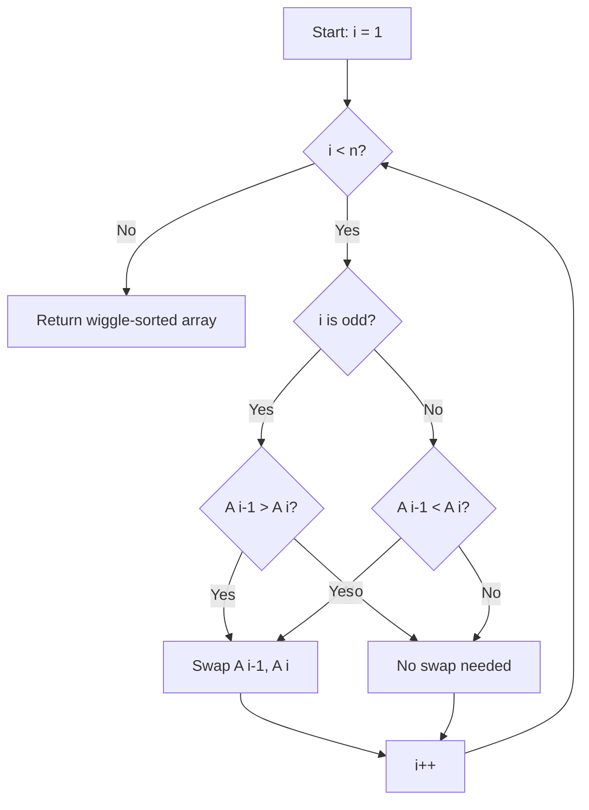

# Wiggle Sort

## Overview

| Property | Value |
|----------|-------|
| **Category** | Sorting Algorithm |
| **Type** | Rearrangement Algorithm |
| **Data Structure** | Array |
| **Space Complexity** | O(1) |
| **Stable** | No |
| **In-Place** | Yes |
| **Output** | Zigzag pattern |

---

## Mathematical Foundation

### Definition

**Wiggle Sort** (also called **Zigzag Sort**) rearranges an array into a "wiggle" pattern where elements alternately satisfy greater-than and less-than relationships:

$$A[0] < A[1] > A[2] < A[3] > A[4] < \ldots$$

Or equivalently:
$$A[i-1] < A[i] \text{ when } i \text{ is odd}$$
$$A[i-1] > A[i] \text{ when } i \text{ is even}$$

### Problem Variants

**Wiggle Sort I** (this algorithm):
- $A[0] \leq A[1] \geq A[2] \leq A[3] \geq \ldots$
- Allows equal adjacent elements
- O(n) time, O(1) space

**Wiggle Sort II**:
- $A[0] < A[1] > A[2] < A[3] > \ldots$
- Strictly alternating (no equality)
- More complex, typically O(n log n)

### Mathematical Property

For a wiggle sequence, if we define:
$$\text{local\_max}(i) = A[i] \geq A[i-1] \land A[i] \geq A[i+1]$$
$$\text{local\_min}(i) = A[i] \leq A[i-1] \land A[i] \leq A[i+1]$$

Then odd indices are local maxima, even indices are local minima:
- $\text{local\_max}(i) \text{ for all odd } i$
- $\text{local\_min}(i) \text{ for all even } i$

### Key Insight

At each position $i$, we only need to ensure the relationship with $A[i-1]$ is correct:
- If $i$ is odd: ensure $A[i-1] \leq A[i]$
- If $i$ is even: ensure $A[i-1] \geq A[i]$

If the condition is violated, swap $A[i-1]$ and $A[i]$.

**Why this works**: Swapping doesn't break the previous relationship because:
- If swapping at odd $i$, we had $A[i-1] > A[i]$, after swap: $A[i-1] < A[i]$
- The swap makes $A[i-1]$ smaller, which can't violate $A[i-2] \geq A[i-1]$

---

## Pseudocode

```
WIGGLE-SORT(A):
    Input: Array A of n elements
    Output: Array A rearranged in wiggle pattern
    
    for i ← 1 to n-1:
        // Check if current relationship is wrong
        shouldBeGreater ← (i mod 2 = 1)
        isWrongRelation ← shouldBeGreater XOR (A[i-1] < A[i])
        
        if isWrongRelation:
            swap A[i-1] and A[i]
    
    return A


// Alternative (cleaner) version:
WIGGLE-SORT-ALT(A):
    for i ← 1 to n-1:
        if (i is odd) = (A[i-1] > A[i]):
            swap A[i-1] and A[i]
    
    return A
```

**Condition Explanation:**
- `(i % 2 == 1)` returns True when position should be a peak (greater than neighbors)
- `(A[i-1] > A[i])` returns True when current element is less than previous
- XOR: If both are same (both True or both False), swap is needed

---

## Complexity Analysis

### Time Complexity

| Case | Complexity | Notes |
|------|------------|-------|
| **Best** | $O(n)$ | Single pass |
| **Average** | $O(n)$ | Single pass |
| **Worst** | $O(n)$ | Single pass |

**Analysis:**
- Single loop from 1 to n-1
- Each iteration does O(1) work (comparison + possible swap)
- Total: $O(n)$

### Space Complexity

| Component | Space |
|-----------|-------|
| Loop variable | $O(1)$ |
| Swaps (in-place) | $O(1)$ |
| **Total** | $O(1)$ |

---

## Visual Representation

### Wiggle Pattern

```
Value
  ^
  |     *           *
  |    / \         / \
  |   /   \   *   /   \   *
  |  *     \ / \ /     \ /
  |         *   *       *
  +-------------------------> Index
     0   1   2   3   4   5   6
     
Pattern: A[0] < A[1] > A[2] < A[3] > A[4] < A[5] > A[6]
```

### Algorithm Flow



### Step-by-Step Example

```
Input: [3, 5, 2, 1, 6, 4]

Goal: A[0] < A[1] > A[2] < A[3] > A[4] < A[5]

i=1 (odd, should be peak): A[0]=3, A[1]=5
    3 < 5? Yes, correct. No swap.
    Array: [3, 5, 2, 1, 6, 4]

i=2 (even, should be valley): A[1]=5, A[2]=2
    5 > 2? Yes, correct. No swap.
    Array: [3, 5, 2, 1, 6, 4]

i=3 (odd, should be peak): A[2]=2, A[3]=1
    2 < 1? No, wrong! Swap!
    Array: [3, 5, 1, 2, 6, 4]

i=4 (even, should be valley): A[3]=2, A[4]=6
    2 < 6? Yes, wrong for valley! Swap!
    Array: [3, 5, 1, 6, 2, 4]

i=5 (odd, should be peak): A[4]=2, A[5]=4
    2 < 4? Yes, correct. No swap.
    Array: [3, 5, 1, 6, 2, 4]

Final: [3, 5, 1, 6, 2, 4]
Check: 3 < 5 > 1 < 6 > 2 < 4 ✓
```

---

## Implementation Details

### Python Implementation

```python
def wiggle_sort(nums: list) -> list:
    """
    Python implementation of wiggle sort.
    Rearranges array so that nums[0] < nums[1] > nums[2] < nums[3]...
    
    Example:
    >>> wiggle_sort([0, 5, 3, 2, 2])
    [0, 5, 2, 3, 2]
    >>> wiggle_sort([])
    []
    >>> wiggle_sort([-2, -5, -45])
    [-45, -2, -5]
    >>> wiggle_sort([-2.1, -5.68, -45.11])
    [-45.11, -2.1, -5.68]
    """
    for i, _ in enumerate(nums):
        if (i % 2 == 1) == (nums[i - 1] > nums[i]):
            nums[i - 1], nums[i] = nums[i], nums[i - 1]

    return nums
```

### Wiggle Sort II (Strict Inequality)

```python
def wiggle_sort_ii(nums: list[int]) -> list[int]:
    """
    Wiggle Sort II: Strict inequalities.
    nums[0] < nums[1] > nums[2] < nums[3]...
    
    This version handles duplicates by using median-based approach.
    
    >>> result = wiggle_sort_ii([1, 5, 1, 1, 6, 4])
    >>> all(result[i] < result[i+1] if i % 2 == 0 else result[i] > result[i+1] 
    ...     for i in range(len(result)-1))
    True
    """
    # Sort to get median easily
    sorted_nums = sorted(nums)
    n = len(nums)
    
    # Split around median
    mid = (n + 1) // 2
    small = sorted_nums[:mid][::-1]  # Smaller half, reversed
    large = sorted_nums[mid:][::-1]  # Larger half, reversed
    
    # Interleave: small at even, large at odd positions
    result = []
    for i in range(n):
        if i % 2 == 0:
            result.append(small[i // 2])
        else:
            result.append(large[i // 2])
    
    nums[:] = result
    return nums
```

### Verification Function

```python
def is_wiggle_sorted(arr: list) -> bool:
    """
    Verify if array is wiggle sorted.
    
    >>> is_wiggle_sorted([1, 3, 2, 4, 3])
    True
    >>> is_wiggle_sorted([1, 2, 3, 4, 5])
    False
    >>> is_wiggle_sorted([])
    True
    >>> is_wiggle_sorted([1])
    True
    """
    for i in range(1, len(arr)):
        if i % 2 == 1:  # Should be: arr[i-1] < arr[i]
            if arr[i - 1] > arr[i]:
                return False
        else:  # Should be: arr[i-1] > arr[i]
            if arr[i - 1] < arr[i]:
                return False
    return True
```

---

## Real-World Applications

### 1. **Audio Waveform Visualization**

**Use Case**: Creating oscillating visual patterns from audio data.

```python
def create_waveform_display(samples: list[float], height: int = 20) -> str:
    """
    Create ASCII waveform from audio samples using wiggle pattern.
    
    >>> waveform = create_waveform_display([0.2, 0.8, 0.3, 0.9, 0.1])
    >>> len(waveform.split('\\n')) > 0
    True
    """
    # Normalize samples
    max_val = max(abs(s) for s in samples) or 1
    normalized = [int((s / max_val + 1) * height / 2) for s in samples]
    
    # Apply wiggle sort for alternating peaks/valleys
    wiggle_sort(normalized)
    
    # Create display
    lines = []
    for row in range(height, -1, -1):
        line = ""
        for val in normalized:
            line += "*" if val == row else " "
        lines.append(line)
    
    return "\n".join(lines)
```

### 2. **Load Balancing**

**Use Case**: Distributing tasks to balance high/low priority alternately.

```python
def balance_task_queue(tasks: list[dict]) -> list[dict]:
    """
    Arrange tasks so heavy and light tasks alternate.
    This prevents resource spikes.
    
    >>> tasks = [{'id': 1, 'load': 10}, {'id': 2, 'load': 2}, 
    ...          {'id': 3, 'load': 8}, {'id': 4, 'load': 1}]
    >>> balanced = balance_task_queue(tasks)
    >>> loads = [t['load'] for t in balanced]
    >>> all(loads[i] < loads[i+1] if i % 2 == 0 else loads[i] > loads[i+1]
    ...     for i in range(len(loads)-1))
    True
    """
    # Sort by load
    sorted_tasks = sorted(tasks, key=lambda t: t['load'])
    
    # Apply wiggle pattern
    for i in range(1, len(sorted_tasks)):
        if (i % 2 == 1) == (sorted_tasks[i-1]['load'] > sorted_tasks[i]['load']):
            sorted_tasks[i-1], sorted_tasks[i] = sorted_tasks[i], sorted_tasks[i-1]
    
    return sorted_tasks
```

### 3. **Stock Chart Peak Detection**

**Use Case**: Finding alternating high/low points for technical analysis.

```python
def find_zigzag_pattern(prices: list[float], threshold: float = 0.05) -> list[tuple]:
    """
    Find zigzag pattern in stock prices for technical analysis.
    Returns list of (index, price, 'peak'/'valley').
    
    >>> points = find_zigzag_pattern([100, 110, 105, 115, 108, 120])
    >>> len(points) > 0
    True
    """
    if len(prices) < 2:
        return [(0, prices[0], 'peak')] if prices else []
    
    # First, apply wiggle sort concept to identify natural peaks/valleys
    points = []
    
    for i in range(1, len(prices) - 1):
        prev, curr, next_p = prices[i-1], prices[i], prices[i+1]
        
        # Check for significant peak
        if curr > prev and curr > next_p:
            if curr > prev * (1 + threshold):
                points.append((i, curr, 'peak'))
        
        # Check for significant valley
        elif curr < prev and curr < next_p:
            if curr < prev * (1 - threshold):
                points.append((i, curr, 'valley'))
    
    return points


def create_wiggle_from_prices(prices: list[float]) -> list[float]:
    """
    Create wiggle pattern from price data for visualization.
    
    >>> wiggled = create_wiggle_from_prices([100, 102, 98, 105, 97])
    >>> is_wiggle_sorted(wiggled)
    True
    """
    result = prices.copy()
    wiggle_sort(result)
    return result
```

### 4. **UI Element Layout**

**Use Case**: Creating visually appealing alternating heights.

```python
def layout_bar_chart(values: list[float]) -> list[dict]:
    """
    Layout bar chart with wiggle pattern for visual appeal.
    
    >>> bars = layout_bar_chart([10, 20, 15, 25, 18])
    >>> heights = [b['height'] for b in bars]
    >>> is_wiggle_sorted(heights)
    True
    """
    # Apply wiggle sort
    sorted_values = values.copy()
    wiggle_sort(sorted_values)
    
    bars = []
    for i, height in enumerate(sorted_values):
        bars.append({
            'x': i * 50,
            'height': height,
            'color': 'blue' if i % 2 == 0 else 'red'
        })
    
    return bars
```

### 5. **Music Playlist Shuffling**

**Use Case**: Arranging songs to alternate between genres/tempos.

```python
def wiggle_playlist(songs: list[dict]) -> list[dict]:
    """
    Arrange playlist to alternate high/low energy songs.
    
    >>> songs = [
    ...     {'title': 'A', 'energy': 0.9},
    ...     {'title': 'B', 'energy': 0.3},
    ...     {'title': 'C', 'energy': 0.7},
    ...     {'title': 'D', 'energy': 0.2}
    ... ]
    >>> playlist = wiggle_playlist(songs)
    >>> energies = [s['energy'] for s in playlist]
    >>> is_wiggle_sorted(energies)
    True
    """
    # Sort by energy
    sorted_songs = sorted(songs, key=lambda s: s['energy'])
    
    # Apply wiggle pattern
    for i in range(1, len(sorted_songs)):
        e1 = sorted_songs[i-1]['energy']
        e2 = sorted_songs[i]['energy']
        if (i % 2 == 1) == (e1 > e2):
            sorted_songs[i-1], sorted_songs[i] = sorted_songs[i], sorted_songs[i-1]
    
    return sorted_songs
```

---

## Advantages and Disadvantages

### ✅ Advantages

1. **O(n) time** - single pass
2. **O(1) space** - truly in-place
3. **Simple implementation** - few lines of code
4. **No sorting required** - works directly on input

### ❌ Disadvantages

1. **Not a full sort** - only achieves wiggle property
2. **Not stable** - relative order not preserved
3. **Not unique** - multiple valid outputs possible
4. **Variant II harder** - strict inequality more complex

---

## Variations

### Variant 1: Wiggle Sort with Minimum Swaps

```python
def wiggle_sort_min_swaps(nums: list) -> tuple[list, int]:
    """
    Wiggle sort tracking number of swaps.
    
    >>> arr, swaps = wiggle_sort_min_swaps([3, 5, 2, 1, 6, 4])
    >>> is_wiggle_sorted(arr)
    True
    """
    swaps = 0
    for i in range(1, len(nums)):
        if (i % 2 == 1) == (nums[i-1] > nums[i]):
            nums[i-1], nums[i] = nums[i], nums[i-1]
            swaps += 1
    return nums, swaps
```

### Variant 2: Reverse Wiggle (Start with Peak)

```python
def reverse_wiggle_sort(nums: list) -> list:
    """
    Reverse wiggle: nums[0] > nums[1] < nums[2] > ...
    
    >>> result = reverse_wiggle_sort([1, 2, 3, 4, 5])
    >>> all(result[i] > result[i+1] if i % 2 == 0 else result[i] < result[i+1]
    ...     for i in range(len(result)-1))
    True
    """
    for i in range(1, len(nums)):
        # Opposite condition: even indices are peaks
        if (i % 2 == 0) == (nums[i-1] > nums[i]):
            nums[i-1], nums[i] = nums[i], nums[i-1]
    return nums
```

---

## References

1. [LeetCode: Wiggle Sort](https://leetcode.com/problems/wiggle-sort/)
2. [LeetCode: Wiggle Sort II](https://leetcode.com/problems/wiggle-sort-ii/)
3. [Wikipedia: Zigzag](https://en.wikipedia.org/wiki/Zigzag)

---

## See Also

- [Dutch National Flag Sort](dutch_national_flag_sort.md) - Another rearrangement algorithm
- [Quick Sort](quick_sort.md) - Used in optimal Wiggle Sort II
- [Selection Sort](selection_sort.md) - Finding kth element for median

