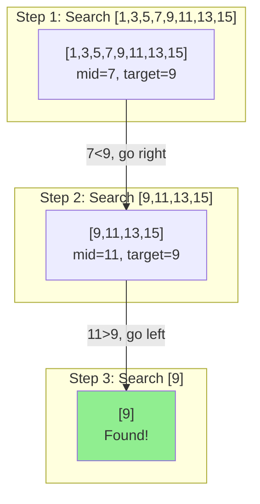

# Binary Search

## Overview

| Property | Value |
|----------|-------|
| **Category** | Divide and Conquer Search |
| **Complexity (Time)** | O(log n) |
| **Complexity (Space)** | O(1) iterative, O(log n) recursive |
| **Requires Sorted** | Yes |
| **Comparison-based** | Yes |

## Description

Binary Search is one of the most efficient searching algorithms for sorted arrays. It works by repeatedly dividing the search interval in half. If the target value is less than the middle element, the search continues in the lower half; otherwise, it continues in the upper half. This process repeats until the target is found or the search space is exhausted.

The algorithm achieves O(log n) time complexity by eliminating half of the remaining elements with each comparison, making it exponentially faster than linear search for large datasets.

## Mathematical Foundation

### Recurrence Relation

The time complexity follows the recurrence:

$$T(n) = T(n/2) + O(1)$$

Solving by the Master Theorem or unrolling:

$$T(n) = O(\log_2 n)$$

### Number of Comparisons

For an array of $n$ elements:

- **Minimum comparisons:** 1 (target at midpoint)
- **Maximum comparisons:** $\lfloor \log_2 n \rfloor + 1$
- **Average comparisons:** $\log_2 n - 1$ (for successful search)

### Search Space Reduction

After $k$ comparisons, the remaining search space is:

$$\text{remaining elements} \leq \frac{n}{2^k}$$

The search terminates when:

$$\frac{n}{2^k} < 1 \implies k > \log_2 n$$

### Midpoint Calculation

To avoid integer overflow, use:

$$\text{mid} = \text{left} + \frac{\text{right} - \text{left}}{2}$$

Instead of:

$$\text{mid} = \frac{\text{left} + \text{right}}{2}$$

### Bisection Properties

For `bisect_left(A, x)`: Returns index $i$ such that:
- All elements in $A[0:i]$ are $< x$
- All elements in $A[i:]$ are $\geq x$

For `bisect_right(A, x)`: Returns index $i$ such that:
- All elements in $A[0:i]$ are $\leq x$
- All elements in $A[i:]$ are $> x$

## Algorithm

### Pseudocode (Iterative)

```
BINARY-SEARCH(A, target):
    left ← 0
    right ← length(A) - 1
    
    while left ≤ right:
        mid ← left + (right - left) / 2
        
        if A[mid] = target:
            return mid
        else if A[mid] < target:
            left ← mid + 1
        else:
            right ← mid - 1
    
    return -1    // Not found
```

### Pseudocode (Recursive)

```
BINARY-SEARCH-RECURSIVE(A, target, left, right):
    if right < left:
        return -1
    
    mid ← left + (right - left) / 2
    
    if A[mid] = target:
        return mid
    else if A[mid] > target:
        return BINARY-SEARCH-RECURSIVE(A, target, left, mid - 1)
    else:
        return BINARY-SEARCH-RECURSIVE(A, target, mid + 1, right)
```

### Step-by-Step Execution

```
Input: A = [1, 3, 5, 7, 9, 11, 13, 15], target = 9

Step 1: left=0, right=7, mid=3
        A[3]=7 < 9, search right half
        left=4

Step 2: left=4, right=7, mid=5
        A[5]=11 > 9, search left half
        right=4

Step 3: left=4, right=4, mid=4
        A[4]=9 == 9, found!

Return: index 4
```

## Complexity Analysis

### Time Complexity

| Case | Complexity | Condition |
|------|------------|-----------|
| Best | O(1) | Target at midpoint |
| Average | O(log n) | Random target location |
| Worst | O(log n) | Target at boundary or not found |

### Space Complexity

| Implementation | Space | Notes |
|----------------|-------|-------|
| Iterative | O(1) | Constant extra space |
| Recursive | O(log n) | Call stack depth |

### Comparison with Linear Search

| Array Size | Linear Search | Binary Search |
|------------|---------------|---------------|
| 10 | 10 | 4 |
| 100 | 100 | 7 |
| 1,000 | 1,000 | 10 |
| 1,000,000 | 1,000,000 | 20 |

## Visual Representation

```mermaid
flowchart TD
    A[Start] --> B[left = 0, right = n-1]
    B --> C{left ≤ right?}
    C -->|Yes| D[mid = left + right-left/2]
    D --> E{A[mid] == target?}
    E -->|Yes| F[Return mid]
    E -->|No| G{A[mid] < target?}
    G -->|Yes| H[left = mid + 1]
    G -->|No| I[right = mid - 1]
    H --> C
    I --> C
    C -->|No| J[Return -1]
    F --> K[End]
    J --> K
```

### Search Space Reduction



## Implementation

### Python Implementation (Iterative)

```python
def binary_search(sorted_collection: list[int], item: int) -> int:
    """
    Pure implementation of a binary search algorithm.
    
    :param sorted_collection: ascending sorted collection
    :param item: item value to search
    :return: index of found item or -1 if not found
    
    >>> binary_search([0, 5, 7, 10, 15], 0)
    0
    >>> binary_search([0, 5, 7, 10, 15], 15)
    4
    >>> binary_search([0, 5, 7, 10, 15], 5)
    1
    >>> binary_search([0, 5, 7, 10, 15], 6)
    -1
    """
    left = 0
    right = len(sorted_collection) - 1
    
    while left <= right:
        midpoint = left + (right - left) // 2
        current_item = sorted_collection[midpoint]
        
        if current_item == item:
            return midpoint
        elif item < current_item:
            right = midpoint - 1
        else:
            left = midpoint + 1
    
    return -1
```

### Python Implementation (Recursive)

```python
def binary_search_by_recursion(
    sorted_collection: list[int], 
    item: int, 
    left: int = 0, 
    right: int = -1
) -> int:
    """
    Pure implementation of binary search by recursion.
    
    >>> binary_search_by_recursion([0, 5, 7, 10, 15], 0, 0, 4)
    0
    >>> binary_search_by_recursion([0, 5, 7, 10, 15], 15, 0, 4)
    4
    >>> binary_search_by_recursion([0, 5, 7, 10, 15], 6, 0, 4)
    -1
    """
    if right < 0:
        right = len(sorted_collection) - 1
    
    if right < left:
        return -1
    
    midpoint = left + (right - left) // 2
    
    if sorted_collection[midpoint] == item:
        return midpoint
    elif sorted_collection[midpoint] > item:
        return binary_search_by_recursion(
            sorted_collection, item, left, midpoint - 1
        )
    else:
        return binary_search_by_recursion(
            sorted_collection, item, midpoint + 1, right
        )
```

### Bisect Functions

```python
def bisect_left(
    sorted_collection: list[int], 
    item: int, 
    lo: int = 0, 
    hi: int = -1
) -> int:
    """
    Find insertion point for item in sorted array (left side).
    All elements to the left are < item.
    
    >>> bisect_left([0, 5, 7, 10, 15], 0)
    0
    >>> bisect_left([0, 5, 7, 10, 15], 6)
    2
    >>> bisect_left([0, 5, 7, 10, 15], 20)
    5
    """
    if hi < 0:
        hi = len(sorted_collection)
    
    while lo < hi:
        mid = lo + (hi - lo) // 2
        if sorted_collection[mid] < item:
            lo = mid + 1
        else:
            hi = mid
    
    return lo


def bisect_right(
    sorted_collection: list[int], 
    item: int, 
    lo: int = 0, 
    hi: int = -1
) -> int:
    """
    Find insertion point for item in sorted array (right side).
    All elements to the left are <= item.
    
    >>> bisect_right([0, 5, 7, 10, 15], 0)
    1
    >>> bisect_right([0, 5, 7, 10, 15], 15)
    5
    """
    if hi < 0:
        hi = len(sorted_collection)
    
    while lo < hi:
        mid = lo + (hi - lo) // 2
        if sorted_collection[mid] <= item:
            lo = mid + 1
        else:
            hi = mid
    
    return lo
```

### Binary Search with Duplicates

```python
def binary_search_with_duplicates(
    sorted_collection: list[int], 
    item: int
) -> list[int]:
    """
    Binary search that returns all indices of duplicates.
    
    >>> binary_search_with_duplicates([1, 2, 2, 2, 3], 2)
    [1, 2, 3]
    >>> binary_search_with_duplicates([1, 2, 2, 2, 3], 4)
    []
    """
    left = bisect_left(sorted_collection, item)
    right = bisect_right(sorted_collection, item)
    
    if left == len(sorted_collection) or sorted_collection[left] != item:
        return []
    
    return list(range(left, right))
```

## Real-World Applications

### 1. Dictionary/Phonebook Lookup

```python
class Phonebook:
    """
    Phonebook using binary search for efficient lookups.
    """
    
    def __init__(self):
        self.entries: list[tuple[str, str]] = []  # (name, phone)
    
    def add(self, name: str, phone: str) -> None:
        """
        Add entry maintaining sorted order.
        
        >>> pb = Phonebook()
        >>> pb.add('Alice', '123')
        >>> pb.add('Bob', '456')
        >>> pb.add('Charlie', '789')
        """
        import bisect
        # Find insertion point
        idx = bisect.bisect_left(
            [e[0] for e in self.entries], name
        )
        self.entries.insert(idx, (name, phone))
    
    def lookup(self, name: str) -> str | None:
        """
        Look up phone number using binary search.
        
        >>> pb = Phonebook()
        >>> pb.add('Alice', '123')
        >>> pb.add('Bob', '456')
        >>> pb.lookup('Alice')
        '123'
        >>> pb.lookup('Eve') is None
        True
        """
        names = [e[0] for e in self.entries]
        left, right = 0, len(names) - 1
        
        while left <= right:
            mid = (left + right) // 2
            if names[mid] == name:
                return self.entries[mid][1]
            elif names[mid] < name:
                left = mid + 1
            else:
                right = mid - 1
        
        return None
```

### 2. Finding Square Root

```python
def sqrt_binary_search(n: float, precision: float = 1e-10) -> float:
    """
    Find square root using binary search.
    
    >>> abs(sqrt_binary_search(4) - 2.0) < 1e-9
    True
    >>> abs(sqrt_binary_search(2) - 1.41421356) < 1e-6
    True
    """
    if n < 0:
        raise ValueError("Cannot compute sqrt of negative number")
    if n == 0:
        return 0
    
    left, right = 0, max(1, n)
    
    while right - left > precision:
        mid = (left + right) / 2
        if mid * mid < n:
            left = mid
        else:
            right = mid
    
    return (left + right) / 2


def nth_root(n: float, k: int, precision: float = 1e-10) -> float:
    """
    Find kth root of n using binary search.
    
    >>> abs(nth_root(27, 3) - 3.0) < 1e-6
    True
    """
    if k % 2 == 0 and n < 0:
        raise ValueError("Even root of negative number")
    
    sign = 1 if n >= 0 else -1
    n = abs(n)
    
    left, right = 0, max(1, n)
    
    while right - left > precision:
        mid = (left + right) / 2
        if mid ** k < n:
            left = mid
        else:
            right = mid
    
    return sign * (left + right) / 2
```

### 3. Finding Peak Element

```python
def find_peak_element(nums: list[int]) -> int:
    """
    Find a peak element using binary search.
    A peak is greater than its neighbors.
    
    >>> find_peak_element([1, 2, 3, 1])
    2
    >>> find_peak_element([1, 2, 1, 3, 5, 6, 4])
    5
    """
    left, right = 0, len(nums) - 1
    
    while left < right:
        mid = (left + right) // 2
        if nums[mid] > nums[mid + 1]:
            right = mid
        else:
            left = mid + 1
    
    return left


def find_minimum_rotated(nums: list[int]) -> int:
    """
    Find minimum in rotated sorted array.
    
    >>> find_minimum_rotated([3, 4, 5, 1, 2])
    3
    >>> find_minimum_rotated([4, 5, 6, 7, 0, 1, 2])
    4
    """
    left, right = 0, len(nums) - 1
    
    while left < right:
        mid = (left + right) // 2
        if nums[mid] > nums[right]:
            left = mid + 1
        else:
            right = mid
    
    return left
```

### 4. IP Address Range Lookup

```python
class IPRangeLookup:
    """
    Efficient IP range lookup using binary search.
    Used in firewalls, geo-location services.
    """
    
    def __init__(self):
        self.ranges: list[tuple[int, int, str]] = []  # (start, end, region)
    
    @staticmethod
    def ip_to_int(ip: str) -> int:
        """Convert IP address to integer."""
        parts = [int(p) for p in ip.split('.')]
        return (parts[0] << 24) + (parts[1] << 16) + (parts[2] << 8) + parts[3]
    
    def add_range(self, start_ip: str, end_ip: str, region: str) -> None:
        """Add IP range for a region."""
        import bisect
        start = self.ip_to_int(start_ip)
        end = self.ip_to_int(end_ip)
        
        # Insert maintaining sorted order by start
        idx = bisect.bisect_left([r[0] for r in self.ranges], start)
        self.ranges.insert(idx, (start, end, region))
    
    def lookup(self, ip: str) -> str | None:
        """
        Find region for IP using binary search.
        
        >>> lookup = IPRangeLookup()
        >>> lookup.add_range('192.168.0.0', '192.168.255.255', 'Private')
        >>> lookup.add_range('10.0.0.0', '10.255.255.255', 'Private-10')
        >>> lookup.lookup('192.168.1.100')
        'Private'
        """
        ip_int = self.ip_to_int(ip)
        
        left, right = 0, len(self.ranges) - 1
        
        while left <= right:
            mid = (left + right) // 2
            start, end, region = self.ranges[mid]
            
            if start <= ip_int <= end:
                return region
            elif ip_int < start:
                right = mid - 1
            else:
                left = mid + 1
        
        return None
```

### 5. Version Finder

```python
def find_first_bad_version(
    n: int, 
    is_bad: callable
) -> int:
    """
    Find first bad version in software releases.
    Classic binary search application.
    
    >>> is_bad = lambda v: v >= 4
    >>> find_first_bad_version(10, is_bad)
    4
    """
    left, right = 1, n
    
    while left < right:
        mid = left + (right - left) // 2
        if is_bad(mid):
            right = mid
        else:
            left = mid + 1
    
    return left


class VersionControl:
    """
    Find problematic commits using binary search (git bisect).
    """
    
    def __init__(self, commits: list[str]):
        self.commits = commits
        self.test_cache: dict[str, bool] = {}
    
    def test_commit(self, commit: str) -> bool:
        """Test if commit passes (simulated)."""
        # In reality, this would run tests
        if commit in self.test_cache:
            return self.test_cache[commit]
        return True
    
    def bisect(
        self, 
        is_bad: callable
    ) -> str | None:
        """
        Find first bad commit using binary search.
        
        >>> vc = VersionControl(['a', 'b', 'c', 'd', 'e'])
        >>> vc.bisect(lambda c: c in ['d', 'e'])
        'd'
        """
        left, right = 0, len(self.commits) - 1
        
        if not is_bad(self.commits[right]):
            return None  # No bad commit
        
        while left < right:
            mid = (left + right) // 2
            if is_bad(self.commits[mid]):
                right = mid
            else:
                left = mid + 1
        
        return self.commits[left]
```

## Common Variants

### Lower and Upper Bound

```python
def lower_bound(arr: list[int], target: int) -> int:
    """First element >= target."""
    left, right = 0, len(arr)
    while left < right:
        mid = (left + right) // 2
        if arr[mid] < target:
            left = mid + 1
        else:
            right = mid
    return left


def upper_bound(arr: list[int], target: int) -> int:
    """First element > target."""
    left, right = 0, len(arr)
    while left < right:
        mid = (left + right) // 2
        if arr[mid] <= target:
            left = mid + 1
        else:
            right = mid
    return left
```

## References

1. [Binary Search - Wikipedia](https://en.wikipedia.org/wiki/Binary_search_algorithm)
2. Knuth, D.E. "The Art of Computer Programming, Vol. 3: Sorting and Searching"
3. [Python bisect module](https://docs.python.org/3/library/bisect.html)
4. Bentley, J. "Programming Pearls" - Binary Search bugs

## See Also

- [Linear Search](linear_search.md) - Simpler but slower alternative
- [Interpolation Search](interpolation_search.md) - Faster for uniform data
- [Exponential Search](exponential_search.md) - For unbounded arrays
- [Jump Search](jump_search.md) - Block-based search
