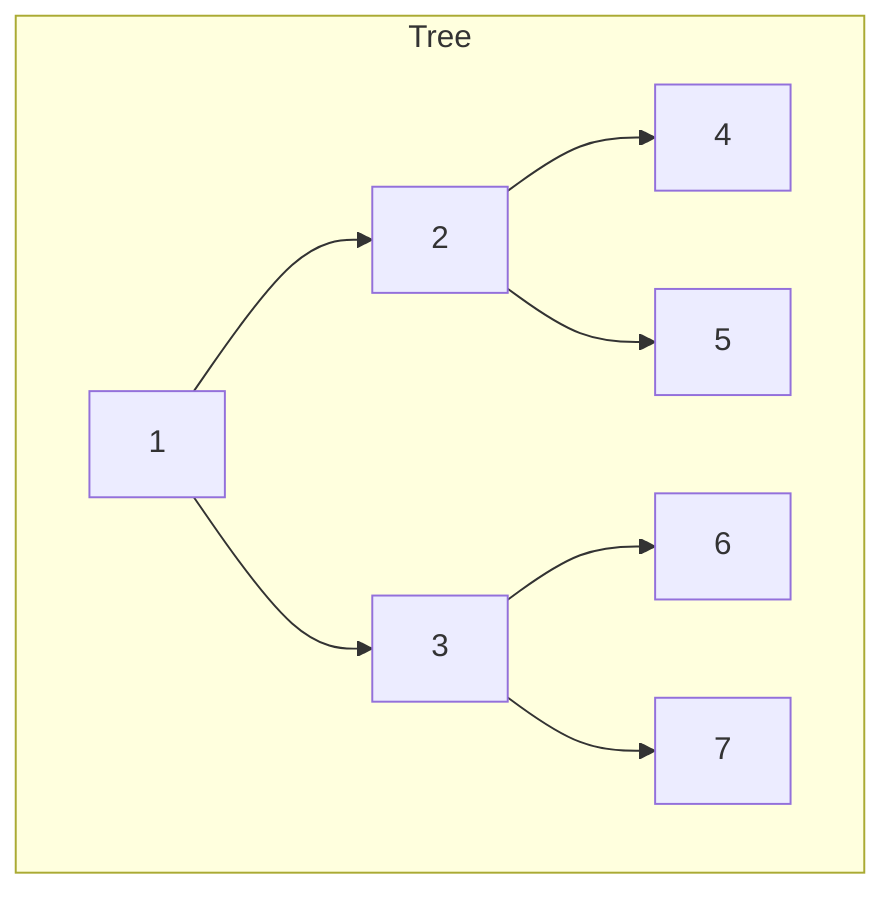
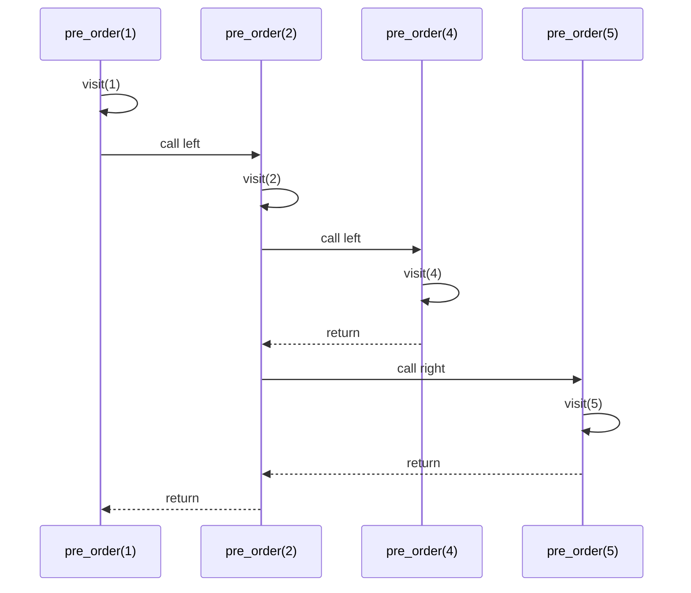

# Binary Tree Traversal

## Overview

| Property | Value |
|----------|-------|
| **Category** | Tree Traversal / Search |
| **Complexity (Time)** | O(n) |
| **Complexity (Space)** | O(h) recursive, O(n) iterative with queue |
| **Type** | Systematic node visitation |
| **Variants** | Pre-order, In-order, Post-order, Level-order |

## Description

Binary Tree Traversal refers to algorithms that systematically visit every node in a binary tree exactly once. The four primary traversal methods differ in the order nodes are visited relative to their children:

- **Pre-order (NLR):** Node → Left → Right
- **In-order (LNR):** Left → Node → Right
- **Post-order (LRN):** Left → Right → Node
- **Level-order (BFS):** Level by level, left to right

## Mathematical Foundation

### Tree Structure

A binary tree node:
$$\text{Node} = \langle \text{data}, \text{left}, \text{right} \rangle$$

### Traversal Sequences

For a binary tree with root $r$, left subtree $L$, and right subtree $R$:

**Pre-order:**
$$\text{PreOrder}(T) = \{r\} \cup \text{PreOrder}(L) \cup \text{PreOrder}(R)$$

**In-order:**
$$\text{InOrder}(T) = \text{InOrder}(L) \cup \{r\} \cup \text{InOrder}(R)$$

**Post-order:**
$$\text{PostOrder}(T) = \text{PostOrder}(L) \cup \text{PostOrder}(R) \cup \{r\}$$

**Level-order:**
$$\text{LevelOrder}(T) = \text{BFS starting from } r$$

### Properties

For a **Binary Search Tree (BST)**:
- In-order traversal yields sorted sequence
- Pre-order can be used to serialize/deserialize tree
- Post-order evaluates expression trees

### Recurrence for Height-Balanced Tree

$$T(n) = 2T(n/2) + O(1) = O(n)$$

All traversals visit each node once: $\Theta(n)$

## Algorithm

### Pre-order Traversal

```
PRE-ORDER(node):
    if node is null:
        return
    
    visit(node)              // Process current node
    PRE-ORDER(node.left)     // Traverse left subtree
    PRE-ORDER(node.right)    // Traverse right subtree
```

### In-order Traversal

```
IN-ORDER(node):
    if node is null:
        return
    
    IN-ORDER(node.left)      // Traverse left subtree
    visit(node)              // Process current node
    IN-ORDER(node.right)     // Traverse right subtree
```

### Post-order Traversal

```
POST-ORDER(node):
    if node is null:
        return
    
    POST-ORDER(node.left)    // Traverse left subtree
    POST-ORDER(node.right)   // Traverse right subtree
    visit(node)              // Process current node
```

### Level-order Traversal

```
LEVEL-ORDER(root):
    if root is null:
        return
    
    queue ← new Queue()
    queue.enqueue(root)
    
    while queue is not empty:
        node ← queue.dequeue()
        visit(node)
        
        if node.left is not null:
            queue.enqueue(node.left)
        if node.right is not null:
            queue.enqueue(node.right)
```

### Step-by-Step Execution

```
Tree Structure:
        1
       / \
      2   3
     / \ / \
    4  5 6  7

Pre-order (NLR): 1 → 2 → 4 → 5 → 3 → 6 → 7
  Visit 1, recurse left
  Visit 2, recurse left
  Visit 4 (leaf), backtrack
  Visit 5 (leaf), backtrack to 1
  Recurse right
  Visit 3, recurse left
  Visit 6 (leaf), backtrack
  Visit 7 (leaf), done

In-order (LNR): 4 → 2 → 5 → 1 → 6 → 3 → 7
  Recurse left to 4
  Visit 4, backtrack
  Visit 2, recurse right
  Visit 5, backtrack to 1
  Visit 1, recurse right
  Recurse left to 6
  Visit 6, backtrack
  Visit 3, recurse right
  Visit 7, done

Post-order (LRN): 4 → 5 → 2 → 6 → 7 → 3 → 1
  Recurse all the way left to 4
  Visit 4, backtrack
  Recurse right to 5
  Visit 5, backtrack
  Visit 2, backtrack to 1
  Recurse right, then left to 6
  Visit 6, recurse right to 7
  Visit 7, backtrack
  Visit 3, backtrack
  Visit 1, done

Level-order (BFS): 1 → 2 → 3 → 4 → 5 → 6 → 7
  Level 0: 1
  Level 1: 2, 3
  Level 2: 4, 5, 6, 7
```

## Complexity Analysis

### Time Complexity

| Traversal | Time | Nodes Visited |
|-----------|------|---------------|
| Pre-order | O(n) | Each node once |
| In-order | O(n) | Each node once |
| Post-order | O(n) | Each node once |
| Level-order | O(n) | Each node once |

### Space Complexity

| Traversal | Recursive | Iterative |
|-----------|-----------|-----------|
| Pre-order | O(h) stack | O(h) stack |
| In-order | O(h) stack | O(h) stack |
| Post-order | O(h) stack | O(h) two stacks |
| Level-order | N/A | O(w) queue |

Where:
- $h$ = tree height (worst case $n$, balanced $\log n$)
- $w$ = maximum width (up to $n/2$ at widest level)

## Visual Representation



### Traversal Order Visualization

```mermaid
flowchart LR
    subgraph Pre["Pre-order"]
        P1["1"] --> P2["2"] --> P3["4"] --> P4["5"] --> P5["3"] --> P6["6"] --> P7["7"]
    end
    
    subgraph In["In-order"]
        I1["4"] --> I2["2"] --> I3["5"] --> I4["1"] --> I5["6"] --> I6["3"] --> I7["7"]
    end
    
    subgraph Post["Post-order"]
        O1["4"] --> O2["5"] --> O3["2"] --> O4["6"] --> O5["7"] --> O6["3"] --> O7["1"]
    end
    
    subgraph Level["Level-order"]
        L1["1"] --> L2["2"] --> L3["3"] --> L4["4"] --> L5["5"] --> L6["6"] --> L7["7"]
    end
```



### Recursive Call Stack



## Implementation

### Python Implementation

```python
from __future__ import annotations
import queue


class TreeNode:
    """Binary tree node."""
    
    def __init__(self, data):
        self.data = data
        self.left = None
        self.right = None


def pre_order(node: TreeNode) -> None:
    """
    Pre-order traversal (NLR): Node, Left, Right.
    
    Examples:
        >>> root = TreeNode(1)
        >>> root.left, root.right = TreeNode(2), TreeNode(3)
        >>> root.left.left, root.left.right = TreeNode(4), TreeNode(5)
        >>> root.right.left, root.right.right = TreeNode(6), TreeNode(7)
        >>> pre_order(root)
        1,2,4,5,3,6,7,
    """
    if not isinstance(node, TreeNode) or not node:
        return
    print(node.data, end=",")
    pre_order(node.left)
    pre_order(node.right)


def in_order(node: TreeNode) -> None:
    """
    In-order traversal (LNR): Left, Node, Right.
    For BST, produces sorted output.
    
    Examples:
        >>> root = TreeNode(1)
        >>> root.left, root.right = TreeNode(2), TreeNode(3)
        >>> root.left.left, root.left.right = TreeNode(4), TreeNode(5)
        >>> root.right.left, root.right.right = TreeNode(6), TreeNode(7)
        >>> in_order(root)
        4,2,5,1,6,3,7,
    """
    if not isinstance(node, TreeNode) or not node:
        return
    in_order(node.left)
    print(node.data, end=",")
    in_order(node.right)


def post_order(node: TreeNode) -> None:
    """
    Post-order traversal (LRN): Left, Right, Node.
    Useful for deletion and expression evaluation.
    
    Examples:
        >>> root = TreeNode(1)
        >>> root.left, root.right = TreeNode(2), TreeNode(3)
        >>> root.left.left, root.left.right = TreeNode(4), TreeNode(5)
        >>> root.right.left, root.right.right = TreeNode(6), TreeNode(7)
        >>> post_order(root)
        4,5,2,6,7,3,1,
    """
    if not isinstance(node, TreeNode) or not node:
        return
    post_order(node.left)
    post_order(node.right)
    print(node.data, end=",")


def level_order(node: TreeNode) -> None:
    """
    Level-order traversal (BFS): Level by level.
    
    Examples:
        >>> root = TreeNode(1)
        >>> root.left, root.right = TreeNode(2), TreeNode(3)
        >>> root.left.left, root.left.right = TreeNode(4), TreeNode(5)
        >>> root.right.left, root.right.right = TreeNode(6), TreeNode(7)
        >>> level_order(root)
        1,2,3,4,5,6,7,
    """
    if not isinstance(node, TreeNode) or not node:
        return
    
    q: queue.Queue = queue.Queue()
    q.put(node)
    
    while not q.empty():
        current = q.get()
        print(current.data, end=",")
        
        if current.left:
            q.put(current.left)
        if current.right:
            q.put(current.right)


def level_order_actual(node: TreeNode) -> None:
    """
    Level-order with line breaks between levels.
    
    Examples:
        >>> root = TreeNode(1)
        >>> root.left, root.right = TreeNode(2), TreeNode(3)
        >>> root.left.left, root.left.right = TreeNode(4), TreeNode(5)
        >>> root.right.left, root.right.right = TreeNode(6), TreeNode(7)
        >>> level_order_actual(root)
        1,
        2,3,
        4,5,6,7,
    """
    if not isinstance(node, TreeNode) or not node:
        return
    
    q: queue.Queue = queue.Queue()
    q.put(node)
    
    while not q.empty():
        next_level = []
        
        while not q.empty():
            current = q.get()
            print(current.data, end=",")
            
            if current.left:
                next_level.append(current.left)
            if current.right:
                next_level.append(current.right)
        
        print()  # New line for next level
        
        for child in next_level:
            q.put(child)
```

### Iterative Implementations

```python
def pre_order_iter(node: TreeNode) -> None:
    """
    Iterative pre-order traversal using explicit stack.
    
    Examples:
        >>> root = TreeNode(1)
        >>> root.left, root.right = TreeNode(2), TreeNode(3)
        >>> root.left.left, root.left.right = TreeNode(4), TreeNode(5)
        >>> pre_order_iter(root)
        1,2,4,5,3,6,7,
    """
    if not isinstance(node, TreeNode) or not node:
        return
    
    stack: list[TreeNode] = []
    current = node
    
    while current or stack:
        while current:
            print(current.data, end=",")
            stack.append(current)
            current = current.left
        
        current = stack.pop()
        current = current.right


def in_order_iter(node: TreeNode) -> None:
    """
    Iterative in-order traversal using explicit stack.
    
    Examples:
        >>> root = TreeNode(1)
        >>> root.left, root.right = TreeNode(2), TreeNode(3)
        >>> root.left.left, root.left.right = TreeNode(4), TreeNode(5)
        >>> in_order_iter(root)
        4,2,5,1,6,3,7,
    """
    if not isinstance(node, TreeNode) or not node:
        return
    
    stack: list[TreeNode] = []
    current = node
    
    while current or stack:
        while current:
            stack.append(current)
            current = current.left
        
        current = stack.pop()
        print(current.data, end=",")
        current = current.right


def post_order_iter(node: TreeNode) -> None:
    """
    Iterative post-order using two stacks.
    
    Examples:
        >>> root = TreeNode(1)
        >>> root.left, root.right = TreeNode(2), TreeNode(3)
        >>> root.left.left, root.left.right = TreeNode(4), TreeNode(5)
        >>> post_order_iter(root)
        4,5,2,6,7,3,1,
    """
    if not isinstance(node, TreeNode) or not node:
        return
    
    stack1: list[TreeNode] = []
    stack2: list[TreeNode] = []
    
    stack1.append(node)
    
    while stack1:
        current = stack1.pop()
        
        if current.left:
            stack1.append(current.left)
        if current.right:
            stack1.append(current.right)
        
        stack2.append(current)
    
    while stack2:
        print(stack2.pop().data, end=",")
```

### Generator-Based Traversals

```python
from typing import Iterator, Generator


def pre_order_generator(node: TreeNode) -> Generator[int, None, None]:
    """
    Pre-order traversal as generator.
    
    Examples:
        >>> root = TreeNode(1)
        >>> root.left, root.right = TreeNode(2), TreeNode(3)
        >>> list(pre_order_generator(root))
        [1, 2, 3]
    """
    if node:
        yield node.data
        yield from pre_order_generator(node.left)
        yield from pre_order_generator(node.right)


def in_order_generator(node: TreeNode) -> Generator[int, None, None]:
    """
    In-order traversal as generator.
    
    Examples:
        >>> root = TreeNode(2)
        >>> root.left, root.right = TreeNode(1), TreeNode(3)
        >>> list(in_order_generator(root))
        [1, 2, 3]
    """
    if node:
        yield from in_order_generator(node.left)
        yield node.data
        yield from in_order_generator(node.right)


def post_order_generator(node: TreeNode) -> Generator[int, None, None]:
    """
    Post-order traversal as generator.
    
    Examples:
        >>> root = TreeNode(1)
        >>> root.left, root.right = TreeNode(2), TreeNode(3)
        >>> list(post_order_generator(root))
        [2, 3, 1]
    """
    if node:
        yield from post_order_generator(node.left)
        yield from post_order_generator(node.right)
        yield node.data


def level_order_generator(root: TreeNode) -> Generator[list[int], None, None]:
    """
    Level-order traversal yielding each level.
    
    Examples:
        >>> root = TreeNode(1)
        >>> root.left, root.right = TreeNode(2), TreeNode(3)
        >>> list(level_order_generator(root))
        [[1], [2, 3]]
    """
    if not root:
        return
    
    current_level = [root]
    
    while current_level:
        yield [node.data for node in current_level]
        
        next_level = []
        for node in current_level:
            if node.left:
                next_level.append(node.left)
            if node.right:
                next_level.append(node.right)
        
        current_level = next_level
```

## Real-World Applications

### 1. Expression Tree Evaluation

```python
class ExpressionNode:
    """Node for expression tree."""
    
    def __init__(self, value: str):
        self.value = value
        self.left = None
        self.right = None
    
    def is_operator(self) -> bool:
        return self.value in "+-*/"


def evaluate_expression(node: ExpressionNode) -> float:
    """
    Evaluate expression tree using post-order traversal.
    
    Examples:
        >>> # Expression: (3 + 4) * 2
        >>> mul = ExpressionNode('*')
        >>> add = ExpressionNode('+')
        >>> mul.left, mul.right = add, ExpressionNode('2')
        >>> add.left, add.right = ExpressionNode('3'), ExpressionNode('4')
        >>> evaluate_expression(mul)
        14.0
    """
    if not node:
        return 0
    
    # Leaf node (operand)
    if not node.is_operator():
        return float(node.value)
    
    # Post-order: evaluate children first
    left_val = evaluate_expression(node.left)
    right_val = evaluate_expression(node.right)
    
    # Then apply operator
    if node.value == '+':
        return left_val + right_val
    elif node.value == '-':
        return left_val - right_val
    elif node.value == '*':
        return left_val * right_val
    elif node.value == '/':
        return left_val / right_val


def infix_expression(node: ExpressionNode) -> str:
    """
    Generate infix expression using in-order traversal.
    
    Examples:
        >>> mul = ExpressionNode('*')
        >>> add = ExpressionNode('+')
        >>> mul.left, mul.right = add, ExpressionNode('2')
        >>> add.left, add.right = ExpressionNode('3'), ExpressionNode('4')
        >>> infix_expression(mul)
        '((3 + 4) * 2)'
    """
    if not node:
        return ""
    
    if not node.is_operator():
        return node.value
    
    left = infix_expression(node.left)
    right = infix_expression(node.right)
    
    return f"({left} {node.value} {right})"
```

### 2. File System Traversal

```python
from dataclasses import dataclass, field
from typing import Optional


@dataclass
class FileNode:
    """File system node."""
    name: str
    is_directory: bool
    size: int = 0
    children: list['FileNode'] = field(default_factory=list)


def calculate_directory_size(node: FileNode) -> int:
    """
    Calculate total size using post-order traversal.
    Must calculate children sizes before parent.
    
    Examples:
        >>> root = FileNode("root", True)
        >>> root.children = [FileNode("a.txt", False, 100), FileNode("b.txt", False, 200)]
        >>> calculate_directory_size(root)
        300
    """
    if not node.is_directory:
        return node.size
    
    # Post-order: calculate children first
    total = 0
    for child in node.children:
        total += calculate_directory_size(child)
    
    return total


def list_files_bfs(root: FileNode) -> list[str]:
    """
    List all files level by level using BFS.
    
    Examples:
        >>> root = FileNode("root", True)
        >>> root.children = [FileNode("dir1", True), FileNode("file1.txt", False)]
        >>> list_files_bfs(root)
        ['root', 'dir1', 'file1.txt']
    """
    result = []
    queue = [root]
    
    while queue:
        node = queue.pop(0)
        result.append(node.name)
        queue.extend(node.children)
    
    return result


def find_path_dfs(root: FileNode, target: str) -> Optional[list[str]]:
    """
    Find path to target file using DFS (pre-order).
    
    Examples:
        >>> root = FileNode("root", True)
        >>> dir1 = FileNode("dir1", True)
        >>> file1 = FileNode("target.txt", False)
        >>> root.children = [dir1]
        >>> dir1.children = [file1]
        >>> find_path_dfs(root, "target.txt")
        ['root', 'dir1', 'target.txt']
    """
    def dfs(node: FileNode, path: list[str]) -> Optional[list[str]]:
        path.append(node.name)
        
        if node.name == target:
            return path.copy()
        
        for child in node.children:
            result = dfs(child, path)
            if result:
                return result
        
        path.pop()
        return None
    
    return dfs(root, [])
```

### 3. DOM Tree Processing

```python
@dataclass
class DOMNode:
    """Simplified DOM node."""
    tag: str
    attrs: dict = field(default_factory=dict)
    text: str = ""
    children: list['DOMNode'] = field(default_factory=list)


def find_elements_by_class(root: DOMNode, class_name: str) -> list[DOMNode]:
    """
    Find all elements with given class using DFS.
    
    Examples:
        >>> div = DOMNode("div", {"class": "container"})
        >>> span = DOMNode("span", {"class": "highlight"})
        >>> div.children = [span]
        >>> results = find_elements_by_class(div, "highlight")
        >>> len(results)
        1
    """
    results = []
    
    def dfs(node: DOMNode):
        if class_name in node.attrs.get("class", ""):
            results.append(node)
        
        for child in node.children:
            dfs(child)
    
    dfs(root)
    return results


def render_html(node: DOMNode, indent: int = 0) -> str:
    """
    Render DOM tree as HTML using pre-order traversal.
    """
    spaces = "  " * indent
    attrs_str = " ".join(f'{k}="{v}"' for k, v in node.attrs.items())
    
    if attrs_str:
        open_tag = f"{spaces}<{node.tag} {attrs_str}>"
    else:
        open_tag = f"{spaces}<{node.tag}>"
    
    if not node.children and not node.text:
        return f"{open_tag}</{node.tag}>"
    
    lines = [open_tag]
    
    if node.text:
        lines.append(f"{spaces}  {node.text}")
    
    for child in node.children:
        lines.append(render_html(child, indent + 1))
    
    lines.append(f"{spaces}</{node.tag}>")
    return "\n".join(lines)
```

### 4. Tree Serialization/Deserialization

```python
def serialize_preorder(root: TreeNode) -> str:
    """
    Serialize tree using pre-order traversal.
    
    Examples:
        >>> root = TreeNode(1)
        >>> root.left, root.right = TreeNode(2), TreeNode(3)
        >>> serialize_preorder(root)
        '1,2,#,#,3,#,#'
    """
    result = []
    
    def preorder(node):
        if not node:
            result.append("#")
            return
        
        result.append(str(node.data))
        preorder(node.left)
        preorder(node.right)
    
    preorder(root)
    return ",".join(result)


def deserialize_preorder(data: str) -> Optional[TreeNode]:
    """
    Deserialize tree from pre-order string.
    
    Examples:
        >>> root = deserialize_preorder('1,2,#,#,3,#,#')
        >>> root.data
        1
        >>> root.left.data
        2
    """
    if not data:
        return None
    
    values = iter(data.split(","))
    
    def build():
        val = next(values)
        if val == "#":
            return None
        
        node = TreeNode(int(val))
        node.left = build()
        node.right = build()
        return node
    
    return build()
```

## Traversal Selection Guide

| Use Case | Traversal | Reason |
|----------|-----------|--------|
| Copy tree | Pre-order | Creates root before children |
| Delete tree | Post-order | Deletes children before parent |
| Sorted output (BST) | In-order | Left < Root < Right |
| Level-by-level print | Level-order | BFS natural ordering |
| Expression evaluation | Post-order | Operands before operator |
| Tree depth | Level-order | Count levels |
| Serialize/Clone | Pre-order | Preserves structure |

## References

1. [Tree Traversal - Wikipedia](https://en.wikipedia.org/wiki/Tree_traversal)
2. Cormen, T.H. "Introduction to Algorithms" - Binary Trees
3. Knuth, D.E. "The Art of Computer Programming, Vol. 1"

## See Also

- [Binary Search Tree](../data_structures/binary_search_tree.md) - BST operations
- [Depth-First Search](../graphs/dfs.md) - Graph DFS
- [Breadth-First Search](../graphs/bfs.md) - Graph BFS
