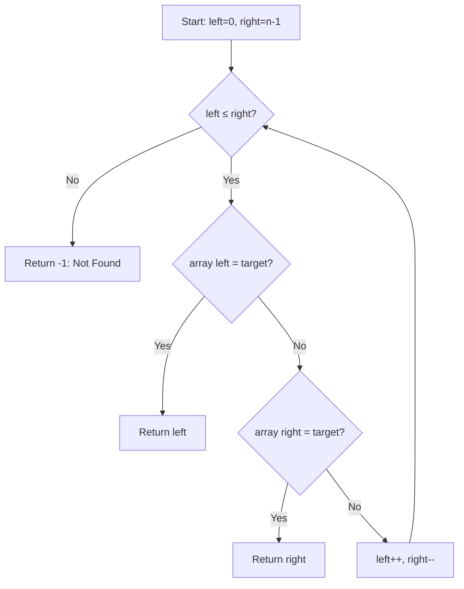
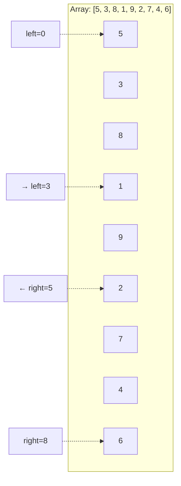

# Double Linear Search

## Overview

| Property | Value |
|----------|-------|
| **Category** | Sequential Search |
| **Complexity (Time)** | O(n) |
| **Complexity (Space)** | O(1) |
| **Type** | Two-pointer iterative |
| **Best Case** | O(1) - target at either end |

## Description

Double Linear Search is an optimized variant of linear search that uses two pointers—one starting from the beginning and one from the end of the array. The search proceeds from both ends simultaneously, potentially finding the target in half the iterations compared to standard linear search.

This approach is particularly effective when the target is likely to be near either end of the array.

## Mathematical Foundation

### Expected Comparisons

For standard linear search, expected comparisons for uniformly distributed target:

$$E[\text{comparisons}] = \frac{n + 1}{2}$$

For double linear search with target at position $k$:

$$\text{comparisons} = \min(k + 1, n - k)$$

Expected value for uniform distribution:

$$E[\text{comparisons}] = \frac{n + 2}{4}$$

This is approximately half of standard linear search.

### Probability Analysis

If target is at position $i$:
- Found by left pointer: $i < n/2$
- Found by right pointer: $i \geq n/2$

Iterations needed: $\min(i, n - 1 - i) + 1$

### Worst Case

Occurs when target is in the middle:
$$\text{iterations} = \frac{n}{2} + 1$$

Still O(n), but with better constant factor.

## Algorithm

### Pseudocode

```
DOUBLE-LINEAR-SEARCH(array, target):
    if array is empty:
        return -1
    
    left ← 0
    right ← n - 1
    
    while left ≤ right:
        // Check left pointer
        if array[left] = target:
            return left
        
        // Check right pointer
        if array[right] = target:
            return right
        
        // Move pointers inward
        left ← left + 1
        right ← right - 1
    
    return -1  // Not found
```

### Step-by-Step Execution

```
Array: [5, 3, 8, 1, 9, 2, 7, 4, 6]
Target: 2

Iteration 1:
  left = 0, right = 8
  array[0] = 5 ≠ 2
  array[8] = 6 ≠ 2
  left = 1, right = 7

Iteration 2:
  left = 1, right = 7
  array[1] = 3 ≠ 2
  array[7] = 4 ≠ 2
  left = 2, right = 6

Iteration 3:
  left = 2, right = 6
  array[2] = 8 ≠ 2
  array[6] = 7 ≠ 2
  left = 3, right = 5

Iteration 4:
  left = 3, right = 5
  array[3] = 1 ≠ 2
  array[5] = 2 = 2 ✓

Found at index 5 in 4 iterations
(Standard linear search: 6 iterations)
```

### Best Case Example

```
Array: [2, 3, 8, 1, 9, 5, 7, 4, 6]
Target: 2

Iteration 1:
  left = 0
  array[0] = 2 = 2 ✓

Found at index 0 in 1 iteration
```

## Complexity Analysis

### Time Complexity

| Case | Complexity | Scenario |
|------|------------|----------|
| Best | O(1) | Target at start or end |
| Average | O(n/2) | Uniform distribution |
| Worst | O(n/2) | Target in middle |

### Space Complexity

| Component | Space |
|-----------|-------|
| Pointers | O(1) |
| Total | O(1) |

### Comparison with Standard Linear Search

| Metric | Standard | Double |
|--------|----------|--------|
| Best case | O(1) | O(1) |
| Average | n/2 comparisons | n/4 iterations |
| Worst case | n comparisons | n/2 iterations |
| Comparisons per iteration | 1 | 2 |

## Visual Representation



### Pointer Movement



## Implementation

### Python Implementation

```python
def double_linear_search(array: list, key: int) -> int:
    """
    Search for key using two pointers from both ends.
    
    Args:
        array: List to search
        key: Value to find
    
    Returns:
        Index of key if found, -1 otherwise
    
    Examples:
        >>> double_linear_search([1, 2, 3, 4, 5], 3)
        2
        >>> double_linear_search([1, 2, 3, 4, 5], 1)
        0
        >>> double_linear_search([1, 2, 3, 4, 5], 5)
        4
        >>> double_linear_search([1, 2, 3, 4, 5], 6)
        -1
        >>> double_linear_search([], 1)
        -1
    """
    if not array:
        return -1
    
    start_ind = 0
    end_ind = len(array) - 1
    
    while start_ind <= end_ind:
        # Check from start
        if array[start_ind] == key:
            return start_ind
        
        # Check from end
        if array[end_ind] == key:
            return end_ind
        
        # Move pointers
        start_ind += 1
        end_ind -= 1
    
    return -1
```

### Generic Type Version

```python
from typing import TypeVar, Optional, Sequence

T = TypeVar('T')


def double_linear_search_generic(
    sequence: Sequence[T], 
    target: T
) -> Optional[int]:
    """
    Generic double linear search for any sequence type.
    
    Examples:
        >>> double_linear_search_generic(['a', 'b', 'c'], 'b')
        1
        >>> double_linear_search_generic([1.5, 2.5, 3.5], 2.5)
        1
    """
    if not sequence:
        return None
    
    left = 0
    right = len(sequence) - 1
    
    while left <= right:
        if sequence[left] == target:
            return left
        if sequence[right] == target:
            return right
        left += 1
        right -= 1
    
    return None
```

### Find All Occurrences

```python
def double_linear_find_all(array: list, key: int) -> list[int]:
    """
    Find all occurrences of key using double linear search.
    
    Returns indices in ascending order.
    
    Examples:
        >>> double_linear_find_all([1, 2, 3, 2, 1], 2)
        [1, 3]
        >>> double_linear_find_all([1, 1, 1, 1, 1], 1)
        [0, 1, 2, 3, 4]
    """
    if not array:
        return []
    
    results_left = []
    results_right = []
    
    left = 0
    right = len(array) - 1
    
    while left < right:
        if array[left] == key:
            results_left.append(left)
        if array[right] == key:
            results_right.append(right)
        left += 1
        right -= 1
    
    # Handle middle element if pointers met
    if left == right and array[left] == key:
        results_left.append(left)
    
    # Combine and sort
    return sorted(results_left + results_right)
```

### Predicate-Based Search

```python
from typing import Callable


def double_linear_search_predicate(
    array: list[T],
    predicate: Callable[[T], bool]
) -> Optional[int]:
    """
    Find first element satisfying predicate using double search.
    
    Examples:
        >>> double_linear_search_predicate([1, 4, 9, 16], lambda x: x > 5)
        2
        >>> double_linear_search_predicate([1, 2, 3], lambda x: x > 10)
    """
    if not array:
        return None
    
    left = 0
    right = len(array) - 1
    
    while left <= right:
        if predicate(array[left]):
            return left
        if predicate(array[right]):
            return right
        left += 1
        right -= 1
    
    return None
```

## Real-World Applications

### 1. Log File Search

```python
import re
from datetime import datetime


class LogSearcher:
    """
    Search log entries from both ends.
    Useful when errors tend to occur at start or end of sessions.
    """
    
    def __init__(self, log_lines: list[str]):
        self.lines = log_lines
    
    def find_error(self, error_pattern: str) -> tuple[int, str] | None:
        """
        Find first line matching error pattern.
        Searches from both ends simultaneously.
        
        Examples:
            >>> searcher = LogSearcher(['INFO: Start', 'ERROR: Failed', 'INFO: End'])
            >>> searcher.find_error('ERROR')
            (1, 'ERROR: Failed')
        """
        if not self.lines:
            return None
        
        pattern = re.compile(error_pattern, re.IGNORECASE)
        left = 0
        right = len(self.lines) - 1
        
        while left <= right:
            if pattern.search(self.lines[left]):
                return (left, self.lines[left])
            if pattern.search(self.lines[right]):
                return (right, self.lines[right])
            left += 1
            right -= 1
        
        return None
    
    def find_by_timestamp(
        self, 
        timestamp: datetime
    ) -> tuple[int, str] | None:
        """Find log entry closest to given timestamp."""
        pass  # Implementation with timestamp parsing
```

### 2. Buffer Boundary Detection

```python
class BufferSearcher:
    """
    Search for patterns in network buffers.
    Protocols often have markers at start/end.
    """
    
    def __init__(self, buffer: bytes):
        self.buffer = buffer
    
    def find_marker(self, marker: bytes) -> int:
        """
        Find position of marker byte sequence.
        Searches from both ends for efficiency.
        
        Examples:
            >>> buf = BufferSearcher(b'START...data...END')
            >>> buf.find_marker(b'START')
            0
            >>> buf.find_marker(b'END')
            15
        """
        marker_len = len(marker)
        left = 0
        right = len(self.buffer) - marker_len
        
        while left <= right:
            # Check left position
            if self.buffer[left:left + marker_len] == marker:
                return left
            
            # Check right position
            if self.buffer[right:right + marker_len] == marker:
                return right
            
            left += 1
            right -= 1
        
        return -1
    
    def find_frame_bounds(
        self, 
        start_marker: bytes, 
        end_marker: bytes
    ) -> tuple[int, int] | None:
        """Find start and end of a data frame."""
        start = self.find_marker(start_marker)
        if start == -1:
            return None
        
        # Search for end marker from the end
        end_search = BufferSearcher(self.buffer[start:])
        end = end_search.find_marker(end_marker)
        
        if end == -1:
            return None
        
        return (start, start + end + len(end_marker))
```

### 3. Playlist Item Finder

```python
from dataclasses import dataclass


@dataclass
class Song:
    title: str
    artist: str
    duration: int  # seconds


class PlaylistSearcher:
    """
    Search playlist from both ends.
    Recently added songs often at start or end.
    """
    
    def __init__(self, songs: list[Song]):
        self.songs = songs
    
    def find_by_title(self, title: str) -> Song | None:
        """
        Find song by title using double search.
        
        Examples:
            >>> songs = [Song('A', 'X', 180), Song('B', 'Y', 200)]
            >>> searcher = PlaylistSearcher(songs)
            >>> searcher.find_by_title('A').artist
            'X'
        """
        if not self.songs:
            return None
        
        left = 0
        right = len(self.songs) - 1
        title_lower = title.lower()
        
        while left <= right:
            if self.songs[left].title.lower() == title_lower:
                return self.songs[left]
            if self.songs[right].title.lower() == title_lower:
                return self.songs[right]
            left += 1
            right -= 1
        
        return None
    
    def find_by_artist(self, artist: str) -> list[Song]:
        """Find all songs by artist."""
        results_left = []
        results_right = []
        
        left = 0
        right = len(self.songs) - 1
        artist_lower = artist.lower()
        
        while left < right:
            if self.songs[left].artist.lower() == artist_lower:
                results_left.append(self.songs[left])
            if self.songs[right].artist.lower() == artist_lower:
                results_right.append(self.songs[right])
            left += 1
            right -= 1
        
        if left == right:
            if self.songs[left].artist.lower() == artist_lower:
                results_left.append(self.songs[left])
        
        return results_left + results_right[::-1]
```

### 4. Symmetric Array Verification

```python
def is_palindrome_efficient(array: list) -> bool:
    """
    Check if array is palindrome using double pointers.
    Natural application of double search concept.
    
    Examples:
        >>> is_palindrome_efficient([1, 2, 3, 2, 1])
        True
        >>> is_palindrome_efficient([1, 2, 3, 4, 5])
        False
        >>> is_palindrome_efficient([1])
        True
    """
    if len(array) <= 1:
        return True
    
    left = 0
    right = len(array) - 1
    
    while left < right:
        if array[left] != array[right]:
            return False
        left += 1
        right -= 1
    
    return True


def find_palindrome_center(array: list) -> tuple[int, int] | None:
    """
    Find the center of a palindrome if array is palindromic.
    Returns (left_center, right_center) indices.
    
    Examples:
        >>> find_palindrome_center([1, 2, 3, 2, 1])  # Odd length
        (2, 2)
        >>> find_palindrome_center([1, 2, 2, 1])  # Even length
        (1, 2)
    """
    if not is_palindrome_efficient(array):
        return None
    
    n = len(array)
    if n % 2 == 1:
        return (n // 2, n // 2)
    else:
        return (n // 2 - 1, n // 2)
```

## Comparison with Other Search Methods

| Method | Best | Average | Worst | Space | Sorted? |
|--------|------|---------|-------|-------|---------|
| Linear | O(1) | O(n/2) | O(n) | O(1) | No |
| Double Linear | O(1) | O(n/4) | O(n/2) | O(1) | No |
| Binary | O(1) | O(log n) | O(log n) | O(1) | Yes |
| Jump | O(1) | O(√n) | O(√n) | O(1) | Yes |

## When to Use Double Linear Search

**Best for:**
- Unsorted arrays where target may be near ends
- Short arrays where binary search overhead is wasteful
- When distribution favors extremes
- Symmetric/palindrome-related problems

**Avoid when:**
- Array is sorted (use binary search)
- Target is likely in middle
- Very large arrays (still O(n))

## References

1. [Linear Search - Wikipedia](https://en.wikipedia.org/wiki/Linear_search)
2. Sedgewick, R. & Wayne, K. "Algorithms" - Search algorithms chapter

## See Also

- [Linear Search](linear_search.md) - Standard sequential search
- [Double Linear Search Recursion](double_linear_search_recursion.md) - Recursive variant
- [Sentinel Linear Search](sentinel_linear_search.md) - Optimized with sentinel
