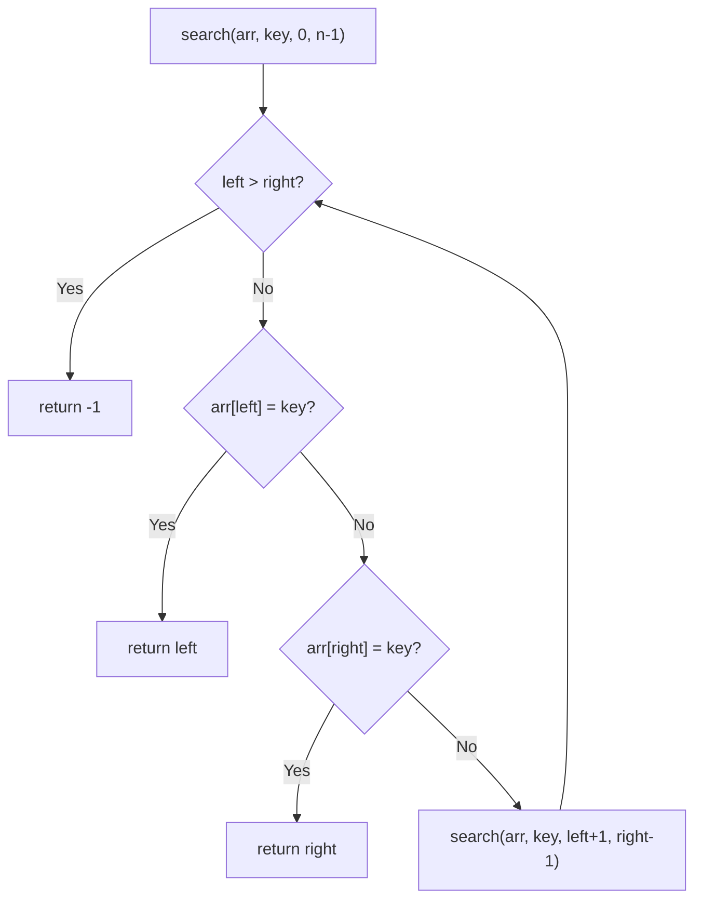
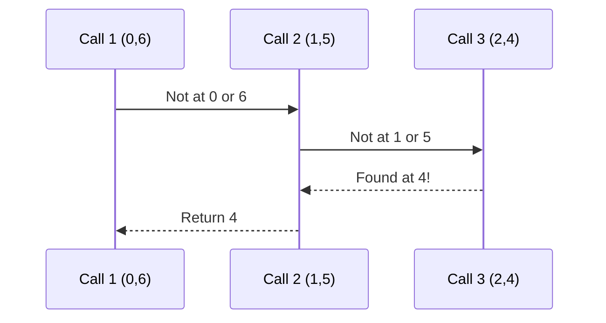

# Double Linear Search (Recursive)

## Overview

| Property | Value |
|----------|-------|
| **Category** | Sequential Search |
| **Complexity (Time)** | O(n) |
| **Complexity (Space)** | O(n) recursive stack |
| **Type** | Two-pointer recursive |
| **Variant** | Recursive double linear search |

## Description

Double Linear Search Recursion is the recursive implementation of double linear search. It uses two pointers that converge from both ends of the array, checking elements at both positions in each recursive call.

While this approach demonstrates elegant recursive thinking, the iterative version is preferred for production code due to lower space complexity.

## Mathematical Foundation

### Recurrence Relation

For array of size $n$ with pointers at positions $l$ (left) and $r$ (right):

$$T(l, r) = \begin{cases}
O(1) & \text{if found or } l > r \\
T(l+1, r-1) + O(1) & \text{otherwise}
\end{cases}$$

### Recursion Depth

Maximum recursion depth:
$$d_{max} = \left\lceil \frac{n}{2} \right\rceil$$

### Search Space Reduction

After $k$ recursive calls:
- Left pointer: $l_k = k$
- Right pointer: $r_k = n - 1 - k$
- Remaining elements: $n - 2k$

Termination when $l_k > r_k$:
$$k > \frac{n - 1}{2}$$

## Algorithm

### Pseudocode

```
DOUBLE-LINEAR-SEARCH-RECURSIVE(array, key):
    return SEARCH-HELPER(array, key, 0, |array| - 1)

SEARCH-HELPER(array, key, left, right):
    // Base case: search space exhausted
    if left > right:
        return -1
    
    // Check left pointer
    if array[left] = key:
        return left
    
    // Check right pointer
    if array[right] = key:
        return right
    
    // Recursive case: narrow search space
    return SEARCH-HELPER(array, key, left + 1, right - 1)
```

### Step-by-Step Execution

```
Array: [5, 3, 8, 1, 9, 2, 7]
Key: 9

Call 1: SEARCH-HELPER([5,3,8,1,9,2,7], 9, 0, 6)
  array[0] = 5 ≠ 9
  array[6] = 7 ≠ 9
  Recursive call with (1, 5)

Call 2: SEARCH-HELPER([5,3,8,1,9,2,7], 9, 1, 5)
  array[1] = 3 ≠ 9
  array[5] = 2 ≠ 9
  Recursive call with (2, 4)

Call 3: SEARCH-HELPER([5,3,8,1,9,2,7], 9, 2, 4)
  array[2] = 8 ≠ 9
  array[4] = 9 = 9 ✓
  Return 4

Result: 4 (found at index 4)
```

### Call Stack Visualization

```
SEARCH(arr, 9, 0, 6)
├── Check arr[0]=5, arr[6]=7 (not found)
└── SEARCH(arr, 9, 1, 5)
    ├── Check arr[1]=3, arr[5]=2 (not found)
    └── SEARCH(arr, 9, 2, 4)
        ├── Check arr[2]=8, arr[4]=9 (FOUND!)
        └── return 4
```

## Complexity Analysis

### Time Complexity

| Case | Complexity | Scenario |
|------|------------|----------|
| Best | O(1) | Target at first or last position |
| Average | O(n/2) | Target in middle region |
| Worst | O(n/2) | Target at center |

### Space Complexity

| Component | Space |
|-----------|-------|
| Recursion stack | O(n/2) |
| Parameters per call | O(1) |
| Total | O(n) |

### Comparison: Recursive vs Iterative

| Aspect | Recursive | Iterative |
|--------|-----------|-----------|
| Time | O(n) | O(n) |
| Space | O(n/2) | O(1) |
| Code clarity | Higher | Moderate |
| Tail-call optimizable | Yes | N/A |

## Visual Representation



### Recursion Unwinding



## Implementation

### Python Implementation

```python
def double_linear_search_recursion(
    array: list, 
    key: int
) -> int:
    """
    Recursive double linear search from both ends.
    
    Args:
        array: List to search
        key: Value to find
    
    Returns:
        Index of key if found, -1 otherwise
    
    Examples:
        >>> double_linear_search_recursion([1, 2, 3, 4, 5], 3)
        2
        >>> double_linear_search_recursion([1, 2, 3, 4, 5], 1)
        0
        >>> double_linear_search_recursion([1, 2, 3, 4, 5], 5)
        4
        >>> double_linear_search_recursion([1, 2, 3, 4, 5], 6)
        -1
        >>> double_linear_search_recursion([], 1)
        -1
    """
    def recursive_search(left: int, right: int) -> int:
        # Base case: search space exhausted
        if left > right:
            return -1
        
        # Check left boundary
        if array[left] == key:
            return left
        
        # Check right boundary
        if array[right] == key:
            return right
        
        # Recursive case
        return recursive_search(left + 1, right - 1)
    
    if not array:
        return -1
    
    return recursive_search(0, len(array) - 1)
```

### Tail-Recursive Optimization

```python
def double_linear_search_tail_recursive(
    array: list,
    key: int,
    left: int = None,
    right: int = None
) -> int:
    """
    Tail-recursive double linear search.
    Can be optimized by interpreters that support tail-call optimization.
    
    Examples:
        >>> double_linear_search_tail_recursive([1, 2, 3, 4, 5], 3)
        2
        >>> double_linear_search_tail_recursive([1, 2, 3, 4, 5], 6)
        -1
    """
    # Initialize on first call
    if left is None:
        left = 0
    if right is None:
        right = len(array) - 1
    
    # Base case
    if left > right:
        return -1
    
    # Check boundaries
    if array[left] == key:
        return left
    if array[right] == key:
        return right
    
    # Tail recursive call
    return double_linear_search_tail_recursive(array, key, left + 1, right - 1)
```

### Generic Type Version

```python
from typing import TypeVar, Sequence, Optional

T = TypeVar('T')


def double_search_generic(
    sequence: Sequence[T],
    target: T
) -> Optional[int]:
    """
    Generic recursive double linear search.
    
    Examples:
        >>> double_search_generic(['a', 'b', 'c', 'd', 'e'], 'c')
        2
        >>> double_search_generic([1.5, 2.5, 3.5], 2.5)
        1
    """
    def search(left: int, right: int) -> Optional[int]:
        if left > right:
            return None
        
        if sequence[left] == target:
            return left
        if sequence[right] == target:
            return right
        
        return search(left + 1, right - 1)
    
    if not sequence:
        return None
    
    return search(0, len(sequence) - 1)
```

### Find All Occurrences (Recursive)

```python
def double_search_find_all_recursive(
    array: list,
    key: int
) -> list[int]:
    """
    Find all occurrences recursively.
    
    Examples:
        >>> double_search_find_all_recursive([1, 2, 3, 2, 1], 2)
        [1, 3]
        >>> double_search_find_all_recursive([1, 1, 1], 1)
        [0, 1, 2]
    """
    def search(left: int, right: int, results: list[int]) -> None:
        if left > right:
            return
        
        if left == right:
            if array[left] == key:
                results.append(left)
            return
        
        if array[left] == key:
            results.append(left)
        if array[right] == key:
            results.append(right)
        
        search(left + 1, right - 1, results)
    
    results = []
    if array:
        search(0, len(array) - 1, results)
    return sorted(results)
```

### With Predicate

```python
from typing import Callable


def double_search_predicate_recursive(
    array: list[T],
    predicate: Callable[[T], bool]
) -> Optional[int]:
    """
    Recursive search with custom predicate.
    
    Examples:
        >>> double_search_predicate_recursive([1, 4, 9, 16], lambda x: x > 5)
        2
        >>> double_search_predicate_recursive([2, 4, 6], lambda x: x % 2 == 1)
    """
    def search(left: int, right: int) -> Optional[int]:
        if left > right:
            return None
        
        if predicate(array[left]):
            return left
        if predicate(array[right]):
            return right
        
        return search(left + 1, right - 1)
    
    if not array:
        return None
    
    return search(0, len(array) - 1)
```

## Real-World Applications

### 1. Tree Leaf Search

```python
class BinaryTree:
    """
    Binary tree with recursive dual-direction search.
    """
    
    def __init__(self, value, left=None, right=None):
        self.value = value
        self.left = left
        self.right = right
    
    def find_in_subtrees(self, target) -> bool:
        """
        Search in both left and right subtrees recursively.
        Conceptually similar to double linear search.
        
        Examples:
            >>> tree = BinaryTree(5, BinaryTree(3), BinaryTree(7))
            >>> tree.find_in_subtrees(3)
            True
            >>> tree.find_in_subtrees(10)
            False
        """
        # Check current node
        if self.value == target:
            return True
        
        # Search both directions
        found_left = self.left.find_in_subtrees(target) if self.left else False
        found_right = self.right.find_in_subtrees(target) if self.right else False
        
        return found_left or found_right
    
    def parallel_search(self, target) -> tuple[bool, str]:
        """
        Search both subtrees and report which branch found it.
        """
        def search(node, path: str) -> tuple[bool, str]:
            if node is None:
                return (False, "")
            
            if node.value == target:
                return (True, path)
            
            # Check left and right
            left_result = search(node.left, path + "L")
            if left_result[0]:
                return left_result
            
            right_result = search(node.right, path + "R")
            return right_result
        
        return search(self, "")
```

### 2. Recursive Text Pattern Matching

```python
def find_pattern_bidirectional(
    text: str,
    pattern: str
) -> int:
    """
    Find pattern searching from both ends recursively.
    
    Examples:
        >>> find_pattern_bidirectional("hello world", "world")
        6
        >>> find_pattern_bidirectional("hello world", "xyz")
        -1
    """
    plen = len(pattern)
    
    def search(left: int, right: int) -> int:
        if left > right - plen + 1:
            return -1
        
        # Check from left
        if text[left:left + plen] == pattern:
            return left
        
        # Check from right
        if text[right - plen + 1:right + 1] == pattern:
            return right - plen + 1
        
        return search(left + 1, right - 1)
    
    if len(text) < plen:
        return -1
    
    return search(0, len(text) - 1)
```

### 3. Balanced Parentheses Verification

```python
def verify_balanced_recursive(expression: str) -> bool:
    """
    Verify balanced parentheses using bidirectional recursion.
    
    Examples:
        >>> verify_balanced_recursive("((()))")
        True
        >>> verify_balanced_recursive("((())")
        False
        >>> verify_balanced_recursive("()()()")
        True
    """
    def check(left: int, right: int, open_count: int) -> tuple[bool, int]:
        if left > right:
            return (open_count == 0, open_count)
        
        # Check left character
        if expression[left] == '(':
            open_count += 1
        elif expression[left] == ')':
            if open_count == 0:
                return (False, open_count)
            open_count -= 1
        
        if left == right:
            return (open_count == 0, open_count)
        
        # Check right character
        if expression[right] == ')':
            # We're checking from outside in, so ')' on right is "opening"
            # This is a simplified approach; full solution needs more care
            pass
        
        return check(left + 1, right - 1, open_count)
    
    if not expression:
        return True
    
    result, _ = check(0, len(expression) - 1, 0)
    return result


def verify_balanced_stack(expression: str) -> bool:
    """
    Standard stack-based balanced check for comparison.
    
    Examples:
        >>> verify_balanced_stack("((()))")
        True
        >>> verify_balanced_stack("((())")
        False
    """
    stack = []
    for char in expression:
        if char == '(':
            stack.append(char)
        elif char == ')':
            if not stack:
                return False
            stack.pop()
    return len(stack) == 0
```

### 4. Recursive Array Reversal

```python
def reverse_array_recursive(array: list) -> list:
    """
    Reverse array using bidirectional recursion.
    Natural application of double-pointer concept.
    
    Examples:
        >>> reverse_array_recursive([1, 2, 3, 4, 5])
        [5, 4, 3, 2, 1]
        >>> reverse_array_recursive([1])
        [1]
        >>> reverse_array_recursive([])
        []
    """
    result = array.copy()
    
    def reverse(left: int, right: int) -> None:
        if left >= right:
            return
        
        # Swap elements
        result[left], result[right] = result[right], result[left]
        
        # Recurse inward
        reverse(left + 1, right - 1)
    
    if result:
        reverse(0, len(result) - 1)
    
    return result


def is_palindrome_recursive(array: list) -> bool:
    """
    Check palindrome using recursive bidirectional comparison.
    
    Examples:
        >>> is_palindrome_recursive([1, 2, 3, 2, 1])
        True
        >>> is_palindrome_recursive([1, 2, 3, 4])
        False
    """
    def check(left: int, right: int) -> bool:
        if left >= right:
            return True
        
        if array[left] != array[right]:
            return False
        
        return check(left + 1, right - 1)
    
    return check(0, len(array) - 1)
```

## Complexity Comparison

### Recursive Implementations

| Variant | Time | Space | Tail-Recursive |
|---------|------|-------|----------------|
| Standard recursive | O(n) | O(n/2) | Yes |
| With accumulator | O(n) | O(n/2) | Yes |
| Find all | O(n) | O(n/2 + k) | No |

### Language Support for Tail-Call Optimization

| Language | TCO Support |
|----------|-------------|
| Python | No (without trampolines) |
| JavaScript (ES6+) | Partial |
| Scheme | Yes |
| Scala | Yes (@tailrec) |
| Haskell | Yes |

## Converting to Iterative

```python
# Recursive version
def search_recursive(arr, key, left, right):
    if left > right:
        return -1
    if arr[left] == key:
        return left
    if arr[right] == key:
        return right
    return search_recursive(arr, key, left + 1, right - 1)

# Equivalent iterative version
def search_iterative(arr, key):
    left, right = 0, len(arr) - 1
    while left <= right:
        if arr[left] == key:
            return left
        if arr[right] == key:
            return right
        left += 1
        right -= 1
    return -1
```

## References

1. [Linear Search - Wikipedia](https://en.wikipedia.org/wiki/Linear_search)
2. [Tail Call - Wikipedia](https://en.wikipedia.org/wiki/Tail_call)
3. Abelson, H. & Sussman, G.J. "Structure and Interpretation of Computer Programs"

## See Also

- [Double Linear Search](double_linear_search.md) - Iterative version
- [Linear Search](linear_search.md) - Standard sequential search
- [Binary Search](binary_search.md) - Logarithmic divide and conquer
