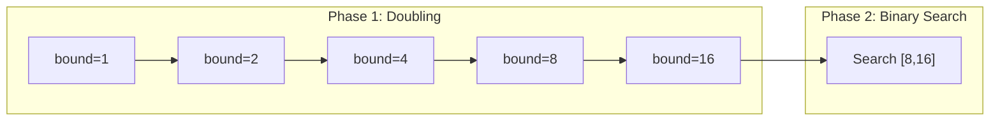

# Exponential Search

## Overview

| Property | Value |
|----------|-------|
| **Category** | Adaptive/Unbounded Search |
| **Complexity (Time)** | O(log i) where i is target index |
| **Complexity (Space)** | O(1) |
| **Requires Sorted** | Yes |
| **Best For** | Unbounded arrays, target near beginning |

## Description

Exponential Search (also known as Doubling Search or Galloping Search) is an algorithm for searching sorted, unbounded/infinite lists. It works by first finding a range where the target element might exist by repeatedly doubling the bound, then performing binary search within that range.

The algorithm is particularly useful when:
1. The array is unbounded (infinite or unknown size)
2. The target element is likely near the beginning
3. Random access is expensive (linked lists, disk I/O)

## Mathematical Foundation

### Algorithm Principle

The search proceeds in two phases:

**Phase 1: Find bounds**
Find $i$ such that $A[2^{i-1}] \leq x \leq A[2^i]$

**Phase 2: Binary search**
Search in range $[2^{i-1}, 2^i]$

### Complexity Analysis

If the target is at index $i$:

**Phase 1 (Finding bounds):**
- Number of iterations: $\lceil \log_2(i+1) \rceil$
- Each iteration is O(1)
- Total: $O(\log i)$

**Phase 2 (Binary search):**
- Search space size: $2^k - 2^{k-1} = 2^{k-1}$ where $2^{k-1} < i \leq 2^k$
- Binary search complexity: $O(\log(2^{k-1})) = O(k-1) = O(\log i)$

**Total complexity:**
$$T(i) = O(\log i) + O(\log i) = O(\log i)$$

### Comparison with Binary Search

| Target Position | Binary Search | Exponential Search |
|----------------|---------------|-------------------|
| i = 1 | O(log n) | O(1) |
| i = 10 | O(log n) | O(log 10) ≈ 3 |
| i = n/2 | O(log n) | O(log n) |
| i = n | O(log n) | O(log n) |

For targets near the beginning, exponential search is significantly faster.

### Recurrence Relation

The bound-finding phase satisfies:
$$B(n) = B(n/2) + O(1)$$

Solution: $B(n) = O(\log n)$

## Algorithm

### Pseudocode

```
EXPONENTIAL-SEARCH(A, n, target):
    // Handle edge cases
    if n = 0:
        return -1
    if A[0] = target:
        return 0
    
    // Phase 1: Find the range for binary search
    bound ← 1
    while bound < n and A[bound] < target:
        bound ← bound × 2
    
    // Phase 2: Binary search in range [bound/2, min(bound, n-1)]
    left ← bound / 2
    right ← min(bound, n - 1)
    
    return BINARY-SEARCH(A, target, left, right)
```

### Step-by-Step Execution

```
Input: A = [2, 3, 4, 10, 40, 50, 60, 70, 80, 90], target = 10

Phase 1 - Finding bounds:
  Iteration 1: bound=1, A[1]=3 < 10, continue
  Iteration 2: bound=2, A[2]=4 < 10, continue
  Iteration 3: bound=4, A[4]=40 > 10, stop!
  
  Range found: [bound/2, bound] = [2, 4]

Phase 2 - Binary search in [2, 4]:
  mid = (2+4)/2 = 3
  A[3] = 10 = target ✓

Return: 3

Comparisons: 3 (doubling) + 1 (binary) = 4 total
Binary search alone would need log₂(10) ≈ 4 comparisons
For larger arrays with early targets, savings are significant
```

## Complexity Analysis

### Time Complexity

| Case | Complexity | Scenario |
|------|------------|----------|
| Best | O(1) | Target at index 0 |
| Average | O(log i) | i = position of target |
| Worst | O(log n) | Target at end or not found |

### Space Complexity

| Implementation | Space |
|----------------|-------|
| Iterative | O(1) |
| Recursive binary search | O(log n) for call stack |

### When Exponential Beats Binary

For an array of size $n$ with target at position $i$:
- Exponential: $2 \log i$ comparisons
- Binary: $\log n$ comparisons

Exponential is faster when: $2 \log i < \log n$, i.e., $i < \sqrt{n}$

## Visual Representation

```mermaid
flowchart TD
    A[Start] --> B{A[0] == target?}
    B -->|Yes| C[Return 0]
    B -->|No| D[bound = 1]
    D --> E{bound < n AND A[bound] < target?}
    E -->|Yes| F[bound = bound × 2]
    F --> E
    E -->|No| G[left = bound/2]
    G --> H[right = min bound, n-1]
    H --> I[Binary Search in left, right]
    I --> J[Return result]
```

### Bound Doubling Visualization



## Implementation

### Python Implementation

```python
def exponential_search(arr: list[int], target: int) -> int:
    """
    Perform exponential search on a sorted array.
    
    First finds a range where target may exist by doubling the bound,
    then performs binary search within that range.
    
    Args:
        arr: A sorted list of integers
        target: The element to search for
    
    Returns:
        Index of target if found, -1 otherwise
    
    Examples:
        >>> exponential_search([2, 3, 4, 10, 40], 10)
        3
        >>> exponential_search([2, 3, 4, 10, 40], 3)
        1
        >>> exponential_search([2, 3, 4, 10, 40], 5)
        -1
        >>> exponential_search([], 10)
        -1
    """
    if not arr:
        return -1
    
    # Check first element
    if arr[0] == target:
        return 0
    
    n = len(arr)
    bound = 1
    
    # Find range by doubling
    while bound < n and arr[bound] < target:
        bound *= 2
    
    # Binary search in found range
    left = bound // 2
    right = min(bound, n - 1)
    
    return binary_search(arr, target, left, right)


def binary_search(arr: list[int], target: int, left: int, right: int) -> int:
    """Binary search helper for exponential search."""
    while left <= right:
        mid = (left + right) // 2
        if arr[mid] == target:
            return mid
        elif arr[mid] < target:
            left = mid + 1
        else:
            right = mid - 1
    return -1
```

### Recursive Implementation

```python
def exponential_search_recursive(
    arr: list[int], 
    target: int,
    bound: int = 1
) -> int:
    """
    Recursive implementation of exponential search.
    
    >>> exponential_search_recursive([1, 2, 3, 4, 5, 6, 7], 4)
    3
    >>> exponential_search_recursive([1, 2, 3, 4, 5, 6, 7], 10)
    -1
    """
    if not arr:
        return -1
    
    if arr[0] == target:
        return 0
    
    n = len(arr)
    
    # Find bound
    while bound < n and arr[bound] < target:
        bound *= 2
    
    # Recursive binary search
    return binary_search_recursive(
        arr, target, bound // 2, min(bound, n - 1)
    )


def binary_search_recursive(
    arr: list[int], 
    target: int, 
    left: int, 
    right: int
) -> int:
    """Recursive binary search helper."""
    if left > right:
        return -1
    
    mid = (left + right) // 2
    
    if arr[mid] == target:
        return mid
    elif arr[mid] < target:
        return binary_search_recursive(arr, target, mid + 1, right)
    else:
        return binary_search_recursive(arr, target, left, mid - 1)
```

### Generic Implementation

```python
from typing import TypeVar, Callable, Protocol

class Comparable(Protocol):
    def __lt__(self, other: "Comparable") -> bool: ...
    def __eq__(self, other: object) -> bool: ...

T = TypeVar('T', bound=Comparable)


def exponential_search_generic(
    arr: list[T],
    target: T,
    key: Callable[[T], Comparable] = lambda x: x
) -> int:
    """
    Generic exponential search with custom key function.
    
    >>> data = [(1, 'a'), (2, 'b'), (3, 'c'), (4, 'd')]
    >>> exponential_search_generic(data, (3, 'c'), key=lambda x: x[0])
    2
    """
    if not arr:
        return -1
    
    target_key = key(target)
    
    if key(arr[0]) == target_key:
        return 0
    
    n = len(arr)
    bound = 1
    
    while bound < n and key(arr[bound]) < target_key:
        bound *= 2
    
    # Binary search with key
    left = bound // 2
    right = min(bound, n - 1)
    
    while left <= right:
        mid = (left + right) // 2
        mid_key = key(arr[mid])
        if mid_key == target_key:
            return mid
        elif mid_key < target_key:
            left = mid + 1
        else:
            right = mid - 1
    
    return -1
```

## Real-World Applications

### 1. Unbounded Binary Search in Data Streams

```python
class StreamSearcher:
    """
    Search in potentially infinite data stream.
    Uses exponential search when size is unknown.
    """
    
    def __init__(self, data_generator):
        """Initialize with a generator that produces sorted values."""
        self.generator = data_generator
        self.cache: list = []
    
    def _ensure_cached(self, index: int) -> bool:
        """Ensure we have data up to index, return False if stream ends."""
        while len(self.cache) <= index:
            try:
                value = next(self.generator)
                self.cache.append(value)
            except StopIteration:
                return False
        return True
    
    def search(self, target: int) -> int:
        """
        Search for target in stream using exponential search.
        
        >>> def gen(): yield from [1, 2, 4, 8, 16, 32, 64, 128]
        >>> searcher = StreamSearcher(gen())
        >>> searcher.search(16)
        4
        >>> searcher.search(100)
        -1
        """
        # Check first element
        if not self._ensure_cached(0):
            return -1
        if self.cache[0] == target:
            return 0
        
        # Find bound exponentially
        bound = 1
        while self._ensure_cached(bound) and self.cache[bound] < target:
            bound *= 2
        
        # Binary search in [bound/2, bound]
        left = bound // 2
        right = min(bound, len(self.cache) - 1)
        
        while left <= right:
            mid = (left + right) // 2
            if not self._ensure_cached(mid):
                return -1
            if self.cache[mid] == target:
                return mid
            elif self.cache[mid] < target:
                left = mid + 1
            else:
                right = mid - 1
        
        return -1
```

### 2. Merge-Sort Style Array Merging

```python
def galloping_merge(left: list[int], right: list[int]) -> list[int]:
    """
    Merge two sorted arrays using galloping (exponential) search.
    Efficient when one array's elements cluster together.
    
    This is used in TimSort for Python's built-in sort.
    
    >>> galloping_merge([1, 3, 5], [2, 4, 6])
    [1, 2, 3, 4, 5, 6]
    >>> galloping_merge([1, 2, 3], [100, 200, 300])
    [1, 2, 3, 100, 200, 300]
    """
    result = []
    i = j = 0
    MIN_GALLOP = 7  # Threshold for galloping mode
    
    while i < len(left) and j < len(right):
        if left[i] <= right[j]:
            # Count consecutive wins
            wins = 0
            while i < len(left) and left[i] <= right[j]:
                result.append(left[i])
                i += 1
                wins += 1
            
            # Switch to galloping if many wins
            if wins >= MIN_GALLOP and j < len(right):
                # Gallop in left to find where right[j] fits
                bound = 1
                start = i
                while i + bound < len(left) and left[i + bound] < right[j]:
                    bound *= 2
                # Binary search for insertion point
                lo, hi = i + bound // 2, min(i + bound, len(left) - 1)
                while lo <= hi:
                    mid = (lo + hi) // 2
                    if left[mid] < right[j]:
                        lo = mid + 1
                    else:
                        hi = mid - 1
                # Copy all elements up to insertion point
                result.extend(left[i:lo])
                i = lo
        else:
            result.append(right[j])
            j += 1
    
    # Append remaining
    result.extend(left[i:])
    result.extend(right[j:])
    
    return result
```

### 3. File System Search with Sparse Data

```python
from pathlib import Path
import os

class SparseDirectorySearch:
    """
    Search sorted directory entries efficiently.
    Uses exponential search for directories with many entries.
    """
    
    def __init__(self, directory: Path):
        self.directory = directory
        self._entries: list[str] | None = None
    
    @property
    def entries(self) -> list[str]:
        """Lazily load and sort directory entries."""
        if self._entries is None:
            self._entries = sorted(os.listdir(self.directory))
        return self._entries
    
    def find_file(self, filename: str) -> Path | None:
        """
        Find file in directory using exponential search.
        
        >>> import tempfile
        >>> with tempfile.TemporaryDirectory() as td:
        ...     for name in ['aaa', 'bbb', 'ccc', 'ddd']:
        ...         (Path(td) / name).touch()
        ...     searcher = SparseDirectorySearch(Path(td))
        ...     result = searcher.find_file('ccc')
        ...     result is not None
        True
        """
        entries = self.entries
        if not entries:
            return None
        
        # Check first entry
        if entries[0] == filename:
            return self.directory / filename
        
        # Find bound
        bound = 1
        n = len(entries)
        while bound < n and entries[bound] < filename:
            bound *= 2
        
        # Binary search in range
        left = bound // 2
        right = min(bound, n - 1)
        
        while left <= right:
            mid = (left + right) // 2
            if entries[mid] == filename:
                return self.directory / filename
            elif entries[mid] < filename:
                left = mid + 1
            else:
                right = mid - 1
        
        return None
    
    def find_prefix(self, prefix: str) -> list[Path]:
        """Find all files starting with prefix."""
        # Use exponential search to find first match
        entries = self.entries
        if not entries:
            return []
        
        # Find lower bound
        bound = 1
        n = len(entries)
        while bound < n and not entries[bound].startswith(prefix):
            if entries[bound] < prefix:
                bound *= 2
            else:
                break
        
        left = bound // 2
        right = min(bound, n - 1)
        
        # Binary search for first prefix match
        start = -1
        while left <= right:
            mid = (left + right) // 2
            if entries[mid].startswith(prefix):
                start = mid
                right = mid - 1
            elif entries[mid] < prefix:
                left = mid + 1
            else:
                right = mid - 1
        
        if start == -1:
            return []
        
        # Collect all matching entries
        results = []
        for i in range(start, n):
            if entries[i].startswith(prefix):
                results.append(self.directory / entries[i])
            else:
                break
        
        return results
```

### 4. Database Index Scanning

```python
class BTreeIndexSearch:
    """
    Simulates B-tree index search with exponential skip.
    Useful when data is clustered and sequential reads are expensive.
    """
    
    def __init__(self, index_values: list[tuple[int, int]]):
        """
        Initialize with (key, row_id) pairs sorted by key.
        """
        self.index = sorted(index_values, key=lambda x: x[0])
    
    def range_search(
        self, 
        low: int, 
        high: int
    ) -> list[tuple[int, int]]:
        """
        Find all entries with keys in [low, high].
        
        >>> idx = BTreeIndexSearch([(i, i*10) for i in range(1000)])
        >>> results = idx.range_search(50, 55)
        >>> len(results)
        6
        """
        if not self.index:
            return []
        
        # Find start using exponential search
        start_idx = self._find_lower_bound(low)
        if start_idx == -1:
            return []
        
        # Collect results
        results = []
        for i in range(start_idx, len(self.index)):
            key, row_id = self.index[i]
            if key > high:
                break
            if key >= low:
                results.append((key, row_id))
        
        return results
    
    def _find_lower_bound(self, target: int) -> int:
        """Find first index with key >= target."""
        if not self.index or self.index[-1][0] < target:
            return -1
        
        if self.index[0][0] >= target:
            return 0
        
        # Exponential search for bound
        bound = 1
        n = len(self.index)
        while bound < n and self.index[bound][0] < target:
            bound *= 2
        
        # Binary search for exact position
        left = bound // 2
        right = min(bound, n - 1)
        result = right + 1
        
        while left <= right:
            mid = (left + right) // 2
            if self.index[mid][0] >= target:
                result = mid
                right = mid - 1
            else:
                left = mid + 1
        
        return result if result < n else -1
```

### 5. Network Packet Sequence Search

```python
from dataclasses import dataclass
from datetime import datetime

@dataclass
class Packet:
    sequence_num: int
    timestamp: datetime
    data: bytes

class PacketBuffer:
    """
    Network packet buffer with sequence-based search.
    Uses exponential search since packets typically arrive in order.
    """
    
    def __init__(self, max_size: int = 10000):
        self.buffer: list[Packet] = []
        self.max_size = max_size
    
    def add_packet(self, packet: Packet) -> None:
        """Add packet maintaining sequence order."""
        import bisect
        idx = bisect.bisect_left(
            [p.sequence_num for p in self.buffer], 
            packet.sequence_num
        )
        self.buffer.insert(idx, packet)
        
        # Trim if too large
        if len(self.buffer) > self.max_size:
            self.buffer = self.buffer[-self.max_size:]
    
    def find_by_sequence(self, seq_num: int) -> Packet | None:
        """
        Find packet by sequence number.
        Optimized for finding recent packets (near end).
        
        >>> buf = PacketBuffer()
        >>> from datetime import datetime
        >>> for i in range(100):
        ...     buf.add_packet(Packet(i, datetime.now(), b'data'))
        >>> result = buf.find_by_sequence(95)
        >>> result.sequence_num
        95
        """
        if not self.buffer:
            return None
        
        # Check if it's the most recent packet
        if self.buffer[-1].sequence_num == seq_num:
            return self.buffer[-1]
        
        # Check first packet
        if self.buffer[0].sequence_num == seq_num:
            return self.buffer[0]
        
        # Exponential search from end (most common case)
        n = len(self.buffer)
        if seq_num > self.buffer[n // 2].sequence_num:
            # Search from end
            return self._search_from_end(seq_num)
        else:
            # Standard exponential search from start
            return self._search_from_start(seq_num)
    
    def _search_from_start(self, seq_num: int) -> Packet | None:
        """Standard exponential search from beginning."""
        n = len(self.buffer)
        bound = 1
        
        while bound < n and self.buffer[bound].sequence_num < seq_num:
            bound *= 2
        
        left = bound // 2
        right = min(bound, n - 1)
        
        while left <= right:
            mid = (left + right) // 2
            mid_seq = self.buffer[mid].sequence_num
            if mid_seq == seq_num:
                return self.buffer[mid]
            elif mid_seq < seq_num:
                left = mid + 1
            else:
                right = mid - 1
        
        return None
    
    def _search_from_end(self, seq_num: int) -> Packet | None:
        """Exponential search from end for recent packets."""
        n = len(self.buffer)
        bound = 1
        
        while n - 1 - bound >= 0 and \
              self.buffer[n - 1 - bound].sequence_num > seq_num:
            bound *= 2
        
        left = max(0, n - 1 - bound)
        right = n - 1 - bound // 2
        
        while left <= right:
            mid = (left + right) // 2
            mid_seq = self.buffer[mid].sequence_num
            if mid_seq == seq_num:
                return self.buffer[mid]
            elif mid_seq < seq_num:
                left = mid + 1
            else:
                right = mid - 1
        
        return None
```

## Advantages and Disadvantages

### Advantages
- O(log i) when target is at position i
- Works on unbounded arrays
- Simple to implement
- Cache-friendly access pattern

### Disadvantages
- Not better than binary search when target at middle/end
- Requires random access capability
- Two-phase approach has higher constant factor

## References

1. [Exponential Search - Wikipedia](https://en.wikipedia.org/wiki/Exponential_search)
2. Bentley, J. L., Yao, A. C. "An Almost Optimal Algorithm for Unbounded Searching" (1976)
3. [Galloping Search in TimSort](https://en.wikipedia.org/wiki/Timsort)
4. Knuth, D. E. "The Art of Computer Programming, Vol. 3: Sorting and Searching"

## See Also

- [Binary Search](binary_search.md) - Used in second phase
- [Interpolation Search](interpolation_search.md) - For uniform distributions
- [Jump Search](jump_search.md) - Fixed-step alternative
- [Fibonacci Search](fibonacci_search.md) - Division-free alternative
