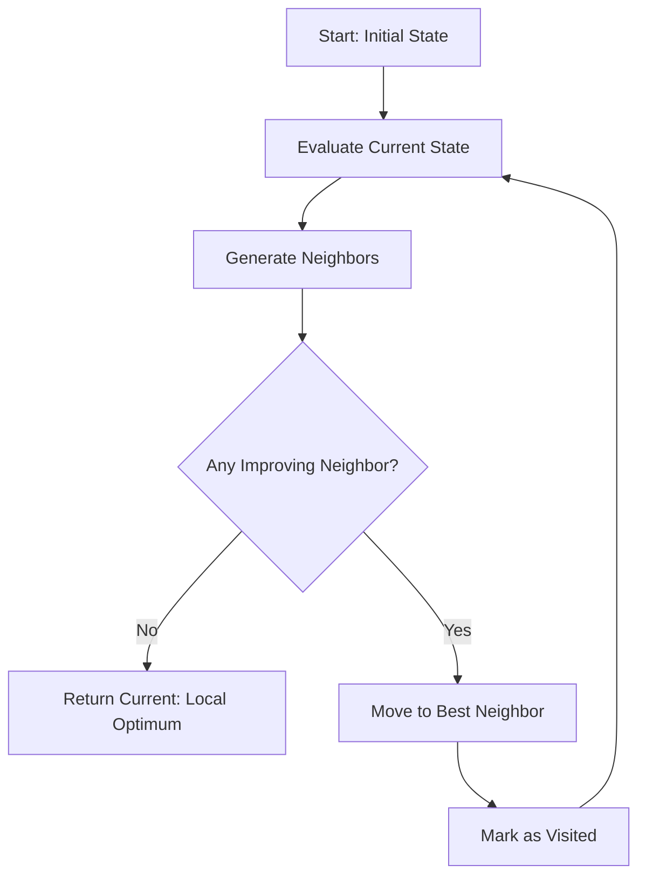
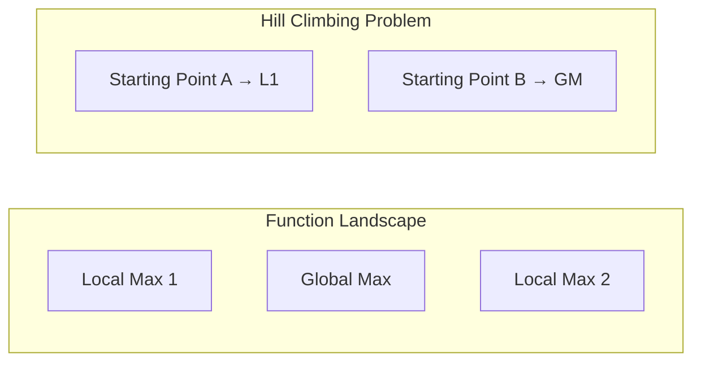

# Hill Climbing

## Overview

| Property | Value |
|----------|-------|
| **Category** | Local Search / Optimization |
| **Complexity (Time)** | O(iterations × neighbors) |
| **Complexity (Space)** | O(states) |
| **Type** | Greedy local search |
| **Guarantees** | Local optimum only |

## Description

Hill Climbing is a local search algorithm that continuously moves in the direction of increasing value (for maximization) or decreasing value (for minimization). Starting from an arbitrary solution, it examines neighboring states and moves to the neighbor with the best improvement.

The algorithm gets its name from the analogy of climbing a hill in fog—you can only see the immediate surroundings and take steps uphill until you reach a peak where no neighbor is higher.

## Mathematical Foundation

### State Space Model

Define the search space as:
- **State space** $S$: Set of all possible solutions
- **Objective function** $f: S \rightarrow \mathbb{R}$: Function to optimize
- **Neighborhood** $N(s) \subseteq S$: Set of states reachable from $s$

### Hill Climbing Rule

At state $s$, move to state $s'$ where:

**For maximization:**
$$s' = \arg\max_{n \in N(s)} f(n) \text{ if } f(s') > f(s)$$

**For minimization:**
$$s' = \arg\min_{n \in N(s)} f(n) \text{ if } f(s') < f(s)$$

### Convergence

Hill climbing terminates when:
$$\forall n \in N(s): f(n) \leq f(s) \text{ (for maximization)}$$

This is the **local optimum** condition.

### Gradient Analogy

For continuous functions, hill climbing approximates gradient descent/ascent:
$$x_{t+1} = x_t + \alpha \nabla f(x_t)$$

The discrete neighborhood search mimics gradient direction.

## Algorithm

### Pseudocode

```
HILL-CLIMBING(initial_state, objective_function):
    current ← initial_state
    visited ← {current}
    
    loop:
        neighbors ← GET-NEIGHBORS(current)
        
        // Find best unvisited neighbor
        best_neighbor ← None
        best_value ← objective_function(current)
        
        for each neighbor in neighbors:
            if neighbor not in visited:
                value ← objective_function(neighbor)
                if value > best_value:  // or < for minimization
                    best_value ← value
                    best_neighbor ← neighbor
        
        if best_neighbor is None:
            return current  // Local optimum reached
        
        visited.add(best_neighbor)
        current ← best_neighbor
```

### Variants

**Steepest Ascent (Standard):**
Evaluate all neighbors, choose the best.

**First-Choice:**
Accept first neighbor that improves solution.

**Random Restart:**
Run multiple times from random starting points.

**Stochastic:**
Randomly choose among uphill moves.

### Step-by-Step Execution

```
Minimize f(x, y) = x² + y²
Starting point: (3, 4), step_size = 1

Iteration 1:
  Current: (3, 4), f = 9 + 16 = 25
  Neighbors: (2,3), (2,4), (2,5), (3,3), (3,5), (4,3), (4,4), (4,5)
  Values:   13,     20,    29,    18,    34,    25,    32,    41
  Best neighbor: (2, 3) with f = 13
  Move to (2, 3)

Iteration 2:
  Current: (2, 3), f = 4 + 9 = 13
  Best neighbor: (1, 2) with f = 1 + 4 = 5
  Move to (1, 2)

Iteration 3:
  Current: (1, 2), f = 1 + 4 = 5
  Best neighbor: (0, 1) with f = 0 + 1 = 1
  Move to (0, 1)

Iteration 4:
  Current: (0, 1), f = 0 + 1 = 1
  Best neighbor: (0, 0) with f = 0
  Move to (0, 0)

Iteration 5:
  Current: (0, 0), f = 0
  No improving neighbor exists
  
Return: (0, 0) - Global minimum found!
```

## Complexity Analysis

### Time Complexity

| Factor | Value |
|--------|-------|
| Per iteration | O(|N(s)|) |
| Total iterations | O(max_iter) or until convergence |
| Worst case | O(max_iter × |N(s)|) |

### Space Complexity

| Component | Space |
|-----------|-------|
| Current state | O(state_size) |
| Visited set | O(visited_states) |
| Neighbors | O(|N(s)|) |

## Visual Representation



### Local Optima Problem



## Implementation

### Python Implementation

```python
import math
from typing import Callable, Any


class SearchProblem:
    """
    An interface to define search problems for hill climbing.
    """
    
    def __init__(
        self, 
        x: int, 
        y: int, 
        step_size: int, 
        function_to_optimize: Callable[[int, int], float]
    ):
        """
        Initialize search problem.
        
        Args:
            x: Current x coordinate
            y: Current y coordinate
            step_size: Size of step when generating neighbors
            function_to_optimize: Function f(x, y) to optimize
        """
        self.x = x
        self.y = y
        self.step_size = step_size
        self.function = function_to_optimize
    
    def score(self) -> float:
        """
        Returns the objective function value at current position.
        
        >>> SearchProblem(0, 0, 1, lambda x, y: x + y).score()
        0
        >>> SearchProblem(5, 7, 1, lambda x, y: x + y).score()
        12
        """
        return self.function(self.x, self.y)
    
    def get_neighbors(self) -> list["SearchProblem"]:
        """
        Returns list of neighboring states (8-directional).
        
        Neighbors:
        | 0 | 1 | 2 |
        | 3 | _ | 4 |
        | 5 | 6 | 7 |
        """
        step = self.step_size
        directions = [
            (-step, -step), (-step, 0), (-step, step),
            (0, -step),                 (0, step),
            (step, -step),  (step, 0),  (step, step)
        ]
        
        return [
            SearchProblem(self.x + dx, self.y + dy, step, self.function)
            for dx, dy in directions
        ]
    
    def __hash__(self):
        return hash((self.x, self.y))
    
    def __eq__(self, other):
        if isinstance(other, SearchProblem):
            return self.x == other.x and self.y == other.y
        return False
    
    def __str__(self):
        return f"x: {self.x} y: {self.y}"


def hill_climbing(
    search_prob: SearchProblem,
    find_max: bool = True,
    max_x: float = math.inf,
    min_x: float = -math.inf,
    max_y: float = math.inf,
    min_y: float = -math.inf,
    max_iter: int = 10000,
    visualization: bool = False
) -> SearchProblem:
    """
    Hill climbing algorithm for optimization.
    
    Args:
        search_prob: Initial search state
        find_max: If True, maximize; if False, minimize
        max_x, min_x, max_y, min_y: Boundary constraints
        max_iter: Maximum iterations
        visualization: If True, plot progress
    
    Returns:
        Search state at local optimum
    
    Examples:
        >>> def f(x, y): return -(x**2 + y**2)  # Bowl with max at (0,0)
        >>> prob = SearchProblem(3, 4, 1, f)
        >>> result = hill_climbing(prob, find_max=True)
        >>> result.x, result.y
        (0, 0)
    """
    current_state = search_prob
    visited = set()
    scores = []
    iterations = 0
    
    while iterations < max_iter:
        visited.add(current_state)
        iterations += 1
        current_score = current_state.score()
        scores.append(current_score)
        
        # Find best improving neighbor
        neighbors = current_state.get_neighbors()
        next_state = None
        best_change = 0
        
        for neighbor in neighbors:
            # Skip visited and out-of-bounds
            if neighbor in visited:
                continue
            if not (min_x <= neighbor.x <= max_x and 
                    min_y <= neighbor.y <= max_y):
                continue
            
            change = neighbor.score() - current_score
            
            if find_max:
                if change > best_change:
                    best_change = change
                    next_state = neighbor
            else:
                if change < best_change:
                    best_change = change
                    next_state = neighbor
        
        if next_state is None:
            break  # Local optimum reached
        
        current_state = next_state
    
    if visualization:
        import matplotlib.pyplot as plt
        plt.plot(range(iterations), scores)
        plt.xlabel("Iterations")
        plt.ylabel("Function values")
        plt.show()
    
    return current_state
```

### Random Restart Hill Climbing

```python
import random


def random_restart_hill_climbing(
    objective: Callable[[float, float], float],
    x_range: tuple[float, float],
    y_range: tuple[float, float],
    find_max: bool = True,
    restarts: int = 10,
    step_size: int = 1,
    max_iter: int = 1000
) -> tuple[float, float, float]:
    """
    Hill climbing with random restarts to escape local optima.
    
    Args:
        objective: Function to optimize
        x_range: (min_x, max_x) bounds
        y_range: (min_y, max_y) bounds
        find_max: Maximize if True, minimize if False
        restarts: Number of random starting points
        step_size: Step size for neighbors
        max_iter: Max iterations per restart
    
    Returns:
        (x, y, score) of best solution found
    
    >>> def rastrigin(x, y):
    ...     return -(x**2 + y**2)  # Simple bowl
    >>> x, y, score = random_restart_hill_climbing(
    ...     rastrigin, (-5, 5), (-5, 5), find_max=True, restarts=5)
    >>> abs(x) < 2 and abs(y) < 2
    True
    """
    best_solution = None
    best_score = float('-inf') if find_max else float('inf')
    
    for _ in range(restarts):
        # Random starting point
        start_x = random.uniform(x_range[0], x_range[1])
        start_y = random.uniform(y_range[0], y_range[1])
        
        prob = SearchProblem(
            int(start_x), int(start_y), 
            step_size, objective
        )
        
        result = hill_climbing(
            prob, 
            find_max=find_max,
            max_x=x_range[1],
            min_x=x_range[0],
            max_y=y_range[1],
            min_y=y_range[0],
            max_iter=max_iter
        )
        
        score = result.score()
        
        if find_max and score > best_score:
            best_score = score
            best_solution = (result.x, result.y)
        elif not find_max and score < best_score:
            best_score = score
            best_solution = (result.x, result.y)
    
    return best_solution[0], best_solution[1], best_score
```

### Stochastic Hill Climbing

```python
def stochastic_hill_climbing(
    search_prob: SearchProblem,
    find_max: bool = True,
    max_iter: int = 10000,
    temperature: float = 1.0
) -> SearchProblem:
    """
    Stochastic variant that randomly selects among improving moves.
    
    Higher temperature = more randomness in selection.
    
    >>> def f(x, y): return -(x**2 + y**2)
    >>> prob = SearchProblem(5, 5, 1, f)
    >>> result = stochastic_hill_climbing(prob, find_max=True)
    >>> result.score() > prob.score()
    True
    """
    current = search_prob
    
    for _ in range(max_iter):
        neighbors = current.get_neighbors()
        current_score = current.score()
        
        # Filter to improving neighbors
        if find_max:
            improving = [n for n in neighbors if n.score() > current_score]
        else:
            improving = [n for n in neighbors if n.score() < current_score]
        
        if not improving:
            break  # Local optimum
        
        # Probabilistic selection based on improvement magnitude
        if temperature > 0:
            weights = []
            for n in improving:
                delta = abs(n.score() - current_score)
                weights.append(math.exp(delta / temperature))
            
            total = sum(weights)
            r = random.random() * total
            cumsum = 0
            for i, w in enumerate(weights):
                cumsum += w
                if cumsum >= r:
                    current = improving[i]
                    break
        else:
            current = random.choice(improving)
    
    return current
```

## Real-World Applications

### 1. Neural Network Weight Initialization

```python
class SimpleNeuralNetOptimizer:
    """
    Optimize neural network weights using hill climbing.
    Useful for small networks or fine-tuning.
    """
    
    def __init__(
        self, 
        network, 
        loss_fn: Callable,
        train_data: list
    ):
        self.network = network
        self.loss_fn = loss_fn
        self.train_data = train_data
    
    def optimize_weights(
        self, 
        layer_idx: int,
        weight_idx: tuple[int, int],
        step_size: float = 0.01,
        max_iter: int = 100
    ) -> float:
        """
        Optimize a single weight using hill climbing.
        
        Returns:
            Final loss value
        """
        current_loss = self._compute_loss()
        
        for _ in range(max_iter):
            original_weight = self.network.layers[layer_idx].weights[weight_idx]
            
            # Try neighbors: increase and decrease
            improvements = []
            
            for delta in [-step_size, step_size]:
                self.network.layers[layer_idx].weights[weight_idx] = (
                    original_weight + delta
                )
                new_loss = self._compute_loss()
                if new_loss < current_loss:
                    improvements.append((delta, new_loss))
                
                # Restore
                self.network.layers[layer_idx].weights[weight_idx] = original_weight
            
            if not improvements:
                break  # Local minimum
            
            # Apply best improvement
            best_delta, best_loss = min(improvements, key=lambda x: x[1])
            self.network.layers[layer_idx].weights[weight_idx] = (
                original_weight + best_delta
            )
            current_loss = best_loss
        
        return current_loss
    
    def _compute_loss(self) -> float:
        total_loss = 0
        for x, y in self.train_data:
            pred = self.network.forward(x)
            total_loss += self.loss_fn(pred, y)
        return total_loss / len(self.train_data)
```

### 2. Traveling Salesman Problem (TSP)

```python
import random
import math

class TSPHillClimbing:
    """
    Solve TSP using hill climbing with 2-opt neighborhood.
    """
    
    def __init__(self, cities: list[tuple[float, float]]):
        self.cities = cities
        self.n = len(cities)
    
    def distance(self, i: int, j: int) -> float:
        """Euclidean distance between cities."""
        x1, y1 = self.cities[i]
        x2, y2 = self.cities[j]
        return math.sqrt((x2 - x1)**2 + (y2 - y1)**2)
    
    def tour_length(self, tour: list[int]) -> float:
        """Calculate total tour length."""
        total = 0
        for i in range(self.n):
            total += self.distance(tour[i], tour[(i + 1) % self.n])
        return total
    
    def two_opt_swap(self, tour: list[int], i: int, j: int) -> list[int]:
        """Perform 2-opt swap: reverse segment between i and j."""
        new_tour = tour[:i] + tour[i:j+1][::-1] + tour[j+1:]
        return new_tour
    
    def solve(self, max_iter: int = 10000) -> tuple[list[int], float]:
        """
        Find good tour using hill climbing.
        
        >>> cities = [(0,0), (1,0), (1,1), (0,1)]  # Square
        >>> tsp = TSPHillClimbing(cities)
        >>> tour, length = tsp.solve()
        >>> len(tour) == 4
        True
        """
        # Start with random tour
        current_tour = list(range(self.n))
        random.shuffle(current_tour)
        current_length = self.tour_length(current_tour)
        
        improved = True
        iterations = 0
        
        while improved and iterations < max_iter:
            improved = False
            iterations += 1
            
            # Try all 2-opt swaps
            for i in range(self.n - 1):
                for j in range(i + 2, self.n):
                    new_tour = self.two_opt_swap(current_tour, i, j)
                    new_length = self.tour_length(new_tour)
                    
                    if new_length < current_length:
                        current_tour = new_tour
                        current_length = new_length
                        improved = True
                        break
                
                if improved:
                    break
        
        return current_tour, current_length
```

### 3. Game AI: Board Evaluation

```python
class GameAIHillClimber:
    """
    Hill climbing for game board position evaluation.
    Useful for games like checkers, chess endgames.
    """
    
    def __init__(self, game, evaluate_fn: Callable):
        self.game = game
        self.evaluate = evaluate_fn
    
    def find_best_move(self, state, player: str, depth: int = 3) -> tuple:
        """
        Find best move using hill climbing with lookahead.
        
        Returns:
            (best_move, evaluation)
        """
        best_move = None
        best_value = float('-inf')
        
        for move in self.game.get_legal_moves(state, player):
            new_state = self.game.apply_move(state, move)
            value = self._climb(new_state, player, depth - 1)
            
            if value > best_value:
                best_value = value
                best_move = move
        
        return best_move, best_value
    
    def _climb(self, state, player: str, depth: int) -> float:
        """Recursively evaluate position."""
        if depth == 0 or self.game.is_terminal(state):
            return self.evaluate(state, player)
        
        # Get neighbor states
        moves = self.game.get_legal_moves(state, player)
        if not moves:
            return self.evaluate(state, player)
        
        # Evaluate each and take best
        best = float('-inf')
        for move in moves:
            new_state = self.game.apply_move(state, move)
            value = self._climb(
                new_state, 
                self.game.opponent(player), 
                depth - 1
            )
            best = max(best, -value)  # Negamax
        
        return best
```

### 4. Feature Selection

```python
from typing import Set

class FeatureSelector:
    """
    Select features for ML model using hill climbing.
    """
    
    def __init__(
        self, 
        X: list[list[float]], 
        y: list[int],
        model_class,
        score_fn: Callable
    ):
        self.X = X
        self.y = y
        self.model_class = model_class
        self.score_fn = score_fn
        self.n_features = len(X[0])
    
    def evaluate_features(self, features: Set[int]) -> float:
        """Evaluate model performance with given features."""
        if not features:
            return 0.0
        
        # Select features
        X_selected = [[row[i] for i in features] for row in self.X]
        
        # Train and evaluate
        model = self.model_class()
        model.fit(X_selected, self.y)
        predictions = model.predict(X_selected)
        
        return self.score_fn(self.y, predictions)
    
    def select_features(
        self, 
        max_features: int | None = None,
        max_iter: int = 100
    ) -> Set[int]:
        """
        Select best feature subset using hill climbing.
        
        >>> selector = FeatureSelector(
        ...     [[1,2,3], [4,5,6]], [0, 1],
        ...     MockModel, lambda y, p: 1.0)
        >>> features = selector.select_features(max_features=2)
        >>> len(features) <= 2
        True
        """
        if max_features is None:
            max_features = self.n_features
        
        # Start with random feature
        current = {random.randint(0, self.n_features - 1)}
        current_score = self.evaluate_features(current)
        
        for _ in range(max_iter):
            best_neighbor = None
            best_score = current_score
            
            # Neighbors: add or remove one feature
            for f in range(self.n_features):
                if f in current:
                    # Try removing
                    if len(current) > 1:
                        neighbor = current - {f}
                        score = self.evaluate_features(neighbor)
                        if score > best_score:
                            best_score = score
                            best_neighbor = neighbor
                else:
                    # Try adding
                    if len(current) < max_features:
                        neighbor = current | {f}
                        score = self.evaluate_features(neighbor)
                        if score > best_score:
                            best_score = score
                            best_neighbor = neighbor
            
            if best_neighbor is None:
                break  # Local optimum
            
            current = best_neighbor
            current_score = best_score
        
        return current
```

### 5. Parameter Tuning

```python
class HyperparameterTuner:
    """
    Tune model hyperparameters using hill climbing.
    """
    
    def __init__(
        self,
        model_fn: Callable,
        param_space: dict,
        evaluate_fn: Callable
    ):
        """
        Args:
            model_fn: Function that creates model with params
            param_space: Dict of param_name -> (min, max, step)
            evaluate_fn: Function to evaluate model performance
        """
        self.model_fn = model_fn
        self.param_space = param_space
        self.evaluate = evaluate_fn
    
    def tune(
        self, 
        initial_params: dict,
        max_iter: int = 100
    ) -> tuple[dict, float]:
        """
        Tune parameters using hill climbing.
        
        Returns:
            (best_params, best_score)
        """
        current_params = initial_params.copy()
        current_score = self._evaluate_params(current_params)
        
        for _ in range(max_iter):
            best_neighbor = None
            best_score = current_score
            
            # Try adjusting each parameter
            for param_name, (min_val, max_val, step) in self.param_space.items():
                for direction in [-1, 1]:
                    neighbor = current_params.copy()
                    neighbor[param_name] = current_params[param_name] + direction * step
                    
                    # Bounds check
                    if not (min_val <= neighbor[param_name] <= max_val):
                        continue
                    
                    score = self._evaluate_params(neighbor)
                    if score > best_score:
                        best_score = score
                        best_neighbor = neighbor
            
            if best_neighbor is None:
                break
            
            current_params = best_neighbor
            current_score = best_score
        
        return current_params, current_score
    
    def _evaluate_params(self, params: dict) -> float:
        model = self.model_fn(**params)
        return self.evaluate(model)
```

## Limitations and Solutions

| Problem | Description | Solution |
|---------|-------------|----------|
| Local optima | Gets stuck in suboptimal peaks | Random restart |
| Plateaus | Flat regions with no gradient | Random moves |
| Ridges | Diagonal ascent needed | Larger neighborhoods |
| Slow convergence | Many small steps | Adaptive step size |

## References

1. [Hill Climbing - Wikipedia](https://en.wikipedia.org/wiki/Hill_climbing)
2. Russell, S. & Norvig, P. "Artificial Intelligence: A Modern Approach"
3. Michalewicz, Z. "Genetic Algorithms + Data Structures = Evolution Programs"
4. [Local Search Algorithms](https://en.wikipedia.org/wiki/Local_search_(optimization))

## See Also

- [Simulated Annealing](simulated_annealing.md) - Allows worse moves probabilistically
- [Tabu Search](tabu_search.md) - Memory-based local search
- [Genetic Algorithms](../genetic_algorithm/) - Population-based optimization
- [Gradient Descent](../machine_learning/) - Continuous optimization
