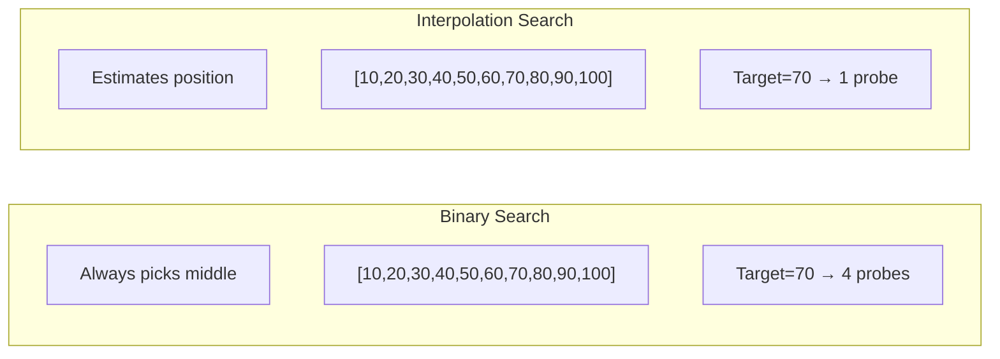

# Interpolation Search

## Overview

| Property | Value |
|----------|-------|
| **Category** | Adaptive Search |
| **Complexity (Time)** | O(log log n) avg, O(n) worst |
| **Complexity (Space)** | O(1) iterative, O(log n) recursive |
| **Requires Sorted** | Yes |
| **Distribution** | Works best with uniform distribution |

## Description

Interpolation Search is an improved variant of binary search that estimates the position of the target value based on the distribution of values in the array. Instead of always checking the middle element like binary search, interpolation search uses a formula to calculate a more likely position based on the target value's relationship to the boundary values.

The algorithm works exceptionally well when data is uniformly distributed, achieving O(log log n) average time complexity. However, it can degrade to O(n) for non-uniform distributions.

## Mathematical Foundation

### Position Estimation Formula

Given a sorted array $A[left..right]$ and target value $x$:

$$\text{pos} = left + \left\lfloor \frac{(x - A[left]) \times (right - left)}{A[right] - A[left]} \right\rfloor$$

This formula applies linear interpolation to estimate where the target might be located.

### Derivation

The formula assumes linear relationship between indices and values:

$$\frac{\text{pos} - left}{right - left} = \frac{x - A[left]}{A[right] - A[left]}$$

Solving for pos:

$$\text{pos} = left + \frac{(x - A[left]) \times (right - left)}{A[right] - A[left]}$$

### Time Complexity Analysis

**For uniformly distributed data:**

The algorithm eliminates a constant fraction of remaining elements each iteration. If elements are uniformly distributed:

$$T(n) = T\left(\sqrt{n}\right) + O(1)$$

Solving: $T(n) = O(\log \log n)$

**For non-uniform data:**

Worst case occurs when values are exponentially distributed:

$$T(n) = T(n-1) + O(1) = O(n)$$

### Probability Analysis

For uniform distribution $U(0, n-1)$, after one probe:
- Expected remaining search space: $O(\sqrt{n})$
- After $k$ probes: $O(n^{1/2^k})$
- Probes needed: $O(\log \log n)$

## Algorithm

### Pseudocode

```
INTERPOLATION-SEARCH(A, target):
    left ← 0
    right ← length(A) - 1
    
    while left ≤ right:
        // Handle equal boundary values
        if A[left] = A[right]:
            if A[left] = target:
                return left
            return -1
        
        // Calculate interpolated position
        pos ← left + ((target - A[left]) × (right - left)) / (A[right] - A[left])
        
        // Bounds check
        if pos < 0 or pos ≥ length(A):
            return -1
        
        if A[pos] = target:
            return pos
        else if A[pos] < target:
            left ← pos + 1
        else:
            right ← pos - 1
    
    return -1
```

### Step-by-Step Execution

```
Input: A = [10, 20, 30, 40, 50, 60, 70, 80, 90, 100], target = 70

Iteration 1:
  left=0, right=9
  A[left]=10, A[right]=100
  pos = 0 + ((70-10) × (9-0)) / (100-10)
      = 0 + (60 × 9) / 90
      = 0 + 6 = 6
  A[6] = 70 = target ✓

Return: 6 (found in 1 iteration!)

Compare with Binary Search:
  Iteration 1: mid=4, A[4]=50 < 70
  Iteration 2: mid=7, A[7]=80 > 70
  Iteration 3: mid=5, A[5]=60 < 70
  Iteration 4: mid=6, A[6]=70 ✓
  (4 iterations)
```

## Complexity Analysis

### Time Complexity

| Case | Complexity | Condition |
|------|------------|-----------|
| Best | O(1) | Target at estimated position |
| Average (uniform) | O(log log n) | Uniformly distributed data |
| Average (general) | O(log n) | Reasonably distributed |
| Worst | O(n) | Exponentially distributed data |

### Space Complexity

| Implementation | Space |
|----------------|-------|
| Iterative | O(1) |
| Recursive | O(log n) average, O(n) worst |

### Comparison with Binary Search

| Distribution | Binary Search | Interpolation Search |
|--------------|---------------|----------------------|
| Uniform | O(log n) | O(log log n) |
| Normal | O(log n) | O(log n) |
| Exponential | O(log n) | O(n) |

## Visual Representation

```mermaid
flowchart TD
    A[Start] --> B[left = 0, right = n-1]
    B --> C{left ≤ right?}
    C -->|No| D[Return -1]
    C -->|Yes| E{A[left] == A[right]?}
    E -->|Yes| F{A[left] == target?}
    F -->|Yes| G[Return left]
    F -->|No| D
    E -->|No| H[Calculate interpolated position]
    H --> I{pos valid?}
    I -->|No| D
    I -->|Yes| J{A[pos] == target?}
    J -->|Yes| K[Return pos]
    J -->|No| L{A[pos] < target?}
    L -->|Yes| M[left = pos + 1]
    L -->|No| N[right = pos - 1]
    M --> C
    N --> C
```

### Interpolation vs Binary



## Implementation

### Python Implementation (Iterative)

```python
def interpolation_search(sorted_collection: list[int], item: int) -> int | None:
    """
    Searches for an item in a sorted collection by interpolation search.
    
    Args:
        sorted_collection: sorted list of integers
        item: item value to search
    
    Returns:
        The index of the found item, or None if not found.
    
    >>> interpolation_search([1, 2, 3, 4, 5], 2)
    1
    >>> interpolation_search([1, 2, 3, 4, 5], 4)
    3
    >>> interpolation_search([1, 2, 3, 4, 5], 6) is None
    True
    >>> interpolation_search([5, 5, 5, 5, 5], 3) is None
    True
    """
    left = 0
    right = len(sorted_collection) - 1
    
    while left <= right:
        # Avoid division by zero
        if sorted_collection[left] == sorted_collection[right]:
            if sorted_collection[left] == item:
                return left
            return None
        
        # Calculate interpolated position
        pos = left + ((item - sorted_collection[left]) * (right - left)) // (
            sorted_collection[right] - sorted_collection[left]
        )
        
        # Bounds check
        if pos < 0 or pos >= len(sorted_collection):
            return None
        
        current_item = sorted_collection[pos]
        if current_item == item:
            return pos
        elif item < current_item:
            right = pos - 1
        else:
            left = pos + 1
    
    return None
```

### Python Implementation (Recursive)

```python
def interpolation_search_recursive(
    sorted_collection: list[int],
    item: int,
    left: int = 0,
    right: int | None = None
) -> int | None:
    """
    Recursive implementation of interpolation search.
    
    >>> interpolation_search_recursive([0, 5, 7, 10, 15], 0)
    0
    >>> interpolation_search_recursive([0, 5, 7, 10, 15], 15)
    4
    >>> interpolation_search_recursive([0, 5, 7, 10, 15], 100) is None
    True
    """
    if right is None:
        right = len(sorted_collection) - 1
    
    if left > right:
        return None
    
    # Handle equal boundaries
    if sorted_collection[left] == sorted_collection[right]:
        if sorted_collection[left] == item:
            return left
        return None
    
    # Calculate position
    pos = left + ((item - sorted_collection[left]) * (right - left)) // (
        sorted_collection[right] - sorted_collection[left]
    )
    
    if pos < 0 or pos >= len(sorted_collection):
        return None
    
    if sorted_collection[pos] == item:
        return pos
    elif sorted_collection[pos] > item:
        return interpolation_search_recursive(
            sorted_collection, item, left, pos - 1
        )
    else:
        return interpolation_search_recursive(
            sorted_collection, item, pos + 1, right
        )
```

### Generic Implementation with Key Function

```python
from typing import TypeVar, Callable

T = TypeVar('T')

def interpolation_search_generic(
    arr: list[T],
    target: float,
    key: Callable[[T], float]
) -> int | None:
    """
    Generic interpolation search with custom key extractor.
    
    >>> data = [{'price': 10}, {'price': 20}, {'price': 30}]
    >>> interpolation_search_generic(data, 20, key=lambda x: x['price'])
    1
    """
    left, right = 0, len(arr) - 1
    
    while left <= right:
        left_val = key(arr[left])
        right_val = key(arr[right])
        
        if left_val == right_val:
            if left_val == target:
                return left
            return None
        
        # Linear interpolation
        fraction = (target - left_val) / (right_val - left_val)
        pos = left + int(fraction * (right - left))
        
        if pos < left or pos > right:
            return None
        
        current = key(arr[pos])
        if current == target:
            return pos
        elif current < target:
            left = pos + 1
        else:
            right = pos - 1
    
    return None
```

## Real-World Applications

### 1. Dictionary/Encyclopedia Lookup

```python
class AlphabeticalIndex:
    """
    Alphabetical lookup using interpolation search.
    Works well because letters are roughly uniformly distributed.
    """
    
    def __init__(self):
        self.entries: list[tuple[str, str]] = []  # (word, definition)
    
    def add(self, word: str, definition: str) -> None:
        """Add entry maintaining alphabetical order."""
        import bisect
        idx = bisect.bisect_left([e[0] for e in self.entries], word)
        self.entries.insert(idx, (word, definition))
    
    def _word_to_number(self, word: str) -> float:
        """Convert word to numeric value for interpolation."""
        if not word:
            return 0
        # Use first few characters for estimation
        value = 0
        for i, char in enumerate(word[:3].lower()):
            if 'a' <= char <= 'z':
                value += (ord(char) - ord('a')) / (26 ** (i + 1))
        return value
    
    def search(self, word: str) -> str | None:
        """
        Search for word using interpolation search.
        
        >>> idx = AlphabeticalIndex()
        >>> idx.add('apple', 'a fruit')
        >>> idx.add('banana', 'yellow fruit')
        >>> idx.add('cherry', 'red fruit')
        >>> idx.search('banana')
        'yellow fruit'
        """
        if not self.entries:
            return None
        
        left, right = 0, len(self.entries) - 1
        target_val = self._word_to_number(word)
        
        while left <= right:
            left_val = self._word_to_number(self.entries[left][0])
            right_val = self._word_to_number(self.entries[right][0])
            
            if right_val == left_val:
                if self.entries[left][0] == word:
                    return self.entries[left][1]
                return None
            
            fraction = (target_val - left_val) / (right_val - left_val)
            pos = left + int(fraction * (right - left))
            pos = max(left, min(right, pos))
            
            current_word = self.entries[pos][0]
            if current_word == word:
                return self.entries[pos][1]
            elif current_word < word:
                left = pos + 1
            else:
                right = pos - 1
        
        return None
```

### 2. Numerical Data Lookup

```python
class UniformDataSearch:
    """
    Efficient search for uniformly distributed numerical data.
    Common in sensor readings, measurements, etc.
    """
    
    def __init__(self, data: list[tuple[float, any]]):
        """Initialize with sorted (key, value) pairs."""
        self.data = sorted(data, key=lambda x: x[0])
    
    def search_exact(self, key: float) -> any | None:
        """
        Find exact match using interpolation search.
        
        >>> search = UniformDataSearch([(1.0, 'a'), (2.0, 'b'), (3.0, 'c')])
        >>> search.search_exact(2.0)
        'b'
        """
        if not self.data:
            return None
        
        left, right = 0, len(self.data) - 1
        
        while left <= right:
            left_key = self.data[left][0]
            right_key = self.data[right][0]
            
            if left_key == right_key:
                if left_key == key:
                    return self.data[left][1]
                return None
            
            fraction = (key - left_key) / (right_key - left_key)
            pos = left + int(fraction * (right - left))
            pos = max(left, min(right, pos))
            
            current_key = self.data[pos][0]
            if abs(current_key - key) < 1e-10:
                return self.data[pos][1]
            elif current_key < key:
                left = pos + 1
            else:
                right = pos - 1
        
        return None
    
    def search_nearest(self, key: float) -> tuple[float, any] | None:
        """Find nearest value to key."""
        if not self.data:
            return None
        
        left, right = 0, len(self.data) - 1
        best = None
        best_dist = float('inf')
        
        while left <= right:
            left_key = self.data[left][0]
            right_key = self.data[right][0]
            
            # Check boundaries
            for idx in [left, right]:
                dist = abs(self.data[idx][0] - key)
                if dist < best_dist:
                    best_dist = dist
                    best = self.data[idx]
            
            if left_key == right_key:
                break
            
            fraction = (key - left_key) / (right_key - left_key)
            pos = left + int(fraction * (right - left))
            pos = max(left, min(right, pos))
            
            current_key = self.data[pos][0]
            dist = abs(current_key - key)
            if dist < best_dist:
                best_dist = dist
                best = self.data[pos]
            
            if current_key < key:
                left = pos + 1
            else:
                right = pos - 1
        
        return best
```

### 3. Temperature/Pressure Lookup Table

```python
class ThermodynamicTable:
    """
    Lookup table for thermodynamic properties.
    Temperature values are typically uniformly spaced.
    """
    
    def __init__(self):
        # (temperature, pressure, density)
        self.data: list[tuple[float, float, float]] = []
    
    def add_data_point(
        self, 
        temp: float, 
        pressure: float, 
        density: float
    ) -> None:
        """Add data point maintaining temperature order."""
        import bisect
        idx = bisect.bisect_left([d[0] for d in self.data], temp)
        self.data.insert(idx, (temp, pressure, density))
    
    def lookup(self, temp: float) -> dict | None:
        """
        Look up properties at given temperature.
        
        >>> table = ThermodynamicTable()
        >>> for t in range(0, 101, 10):
        ...     table.add_data_point(float(t), t*2, t/10)
        >>> result = table.lookup(50.0)
        >>> result['pressure']
        100.0
        """
        if not self.data:
            return None
        
        left, right = 0, len(self.data) - 1
        
        while left <= right:
            left_temp = self.data[left][0]
            right_temp = self.data[right][0]
            
            if left_temp == right_temp:
                if abs(left_temp - temp) < 0.001:
                    t, p, d = self.data[left]
                    return {'temperature': t, 'pressure': p, 'density': d}
                return None
            
            fraction = (temp - left_temp) / (right_temp - left_temp)
            pos = left + int(fraction * (right - left))
            pos = max(left, min(right, pos))
            
            current_temp = self.data[pos][0]
            if abs(current_temp - temp) < 0.001:
                t, p, d = self.data[pos]
                return {'temperature': t, 'pressure': p, 'density': d}
            elif current_temp < temp:
                left = pos + 1
            else:
                right = pos - 1
        
        return None
```

### 4. Geographic Coordinate Search

```python
from dataclasses import dataclass

@dataclass
class Location:
    latitude: float
    longitude: float
    name: str

class LatitudeLookup:
    """
    Geographic location lookup by latitude.
    Latitudes are uniformly distributed (-90 to 90).
    """
    
    def __init__(self):
        self.locations: list[Location] = []
    
    def add_location(self, loc: Location) -> None:
        """Add location maintaining latitude order."""
        import bisect
        idx = bisect.bisect_left(
            [l.latitude for l in self.locations], 
            loc.latitude
        )
        self.locations.insert(idx, loc)
    
    def find_by_latitude(
        self, 
        target_lat: float, 
        tolerance: float = 0.1
    ) -> list[Location]:
        """
        Find locations near target latitude.
        
        >>> lookup = LatitudeLookup()
        >>> lookup.add_location(Location(40.7, -74.0, 'NYC'))
        >>> lookup.add_location(Location(34.0, -118.2, 'LA'))
        >>> lookup.add_location(Location(51.5, -0.1, 'London'))
        >>> results = lookup.find_by_latitude(40.0, tolerance=1.0)
        >>> len(results)
        1
        """
        if not self.locations:
            return []
        
        # Find approximate starting position
        left, right = 0, len(self.locations) - 1
        start_pos = None
        
        while left <= right:
            left_lat = self.locations[left].latitude
            right_lat = self.locations[right].latitude
            
            if right_lat == left_lat:
                start_pos = left
                break
            
            # Map latitude range to index range
            fraction = (target_lat - left_lat) / (right_lat - left_lat)
            pos = left + int(fraction * (right - left))
            pos = max(left, min(right, pos))
            
            current_lat = self.locations[pos].latitude
            if abs(current_lat - target_lat) <= tolerance:
                start_pos = pos
                break
            elif current_lat < target_lat:
                left = pos + 1
            else:
                right = pos - 1
        
        if start_pos is None:
            return []
        
        # Expand to find all within tolerance
        results = []
        for i in range(max(0, start_pos - 10), 
                       min(len(self.locations), start_pos + 10)):
            if abs(self.locations[i].latitude - target_lat) <= tolerance:
                results.append(self.locations[i])
        
        return results
```

### 5. Log File Timestamp Search

```python
from datetime import datetime

class TimestampedLogSearch:
    """
    Search log entries by timestamp.
    Timestamps in log files are often uniformly distributed over time.
    """
    
    def __init__(self):
        self.entries: list[tuple[datetime, str]] = []
    
    def add_entry(self, timestamp: datetime, message: str) -> None:
        """Add log entry (assumes chronological insertion)."""
        self.entries.append((timestamp, message))
    
    def _timestamp_to_float(self, ts: datetime) -> float:
        """Convert timestamp to float for interpolation."""
        return ts.timestamp()
    
    def search_at_time(self, target: datetime) -> tuple[datetime, str] | None:
        """
        Find log entry closest to target time.
        
        >>> from datetime import datetime, timedelta
        >>> search = TimestampedLogSearch()
        >>> base = datetime(2024, 1, 1)
        >>> for i in range(100):
        ...     search.add_entry(base + timedelta(seconds=i), f'msg_{i}')
        >>> result = search.search_at_time(base + timedelta(seconds=50))
        >>> 'msg_50' in result[1]
        True
        """
        if not self.entries:
            return None
        
        left, right = 0, len(self.entries) - 1
        target_val = self._timestamp_to_float(target)
        
        while left <= right:
            left_val = self._timestamp_to_float(self.entries[left][0])
            right_val = self._timestamp_to_float(self.entries[right][0])
            
            if right_val == left_val:
                return self.entries[left]
            
            fraction = (target_val - left_val) / (right_val - left_val)
            pos = left + int(fraction * (right - left))
            pos = max(left, min(right, pos))
            
            current_val = self._timestamp_to_float(self.entries[pos][0])
            
            if abs(current_val - target_val) < 1:  # Within 1 second
                return self.entries[pos]
            elif current_val < target_val:
                left = pos + 1
            else:
                right = pos - 1
        
        return None
```

## When to Use Interpolation Search

| Data Characteristic | Recommendation |
|--------------------|----------------|
| Uniformly distributed | ✓ Excellent choice |
| Known distribution | ✓ Adapt formula |
| Unknown distribution | ? Use binary search |
| Exponential distribution | ✗ Use binary search |
| Small dataset (<100) | ✗ Use linear/binary |

## References

1. [Interpolation Search - Wikipedia](https://en.wikipedia.org/wiki/Interpolation_search)
2. Perl, Y., et al. "Interpolation Search—A Log Log N Search" (1978)
3. Gonnet, G.H. "Handbook of Algorithms and Data Structures"
4. [Distribution-Aware Search](https://en.wikipedia.org/wiki/Interpolation)

## See Also

- [Binary Search](binary_search.md) - More robust alternative
- [Exponential Search](exponential_search.md) - For unbounded arrays
- [Jump Search](jump_search.md) - Block-based search
- [Fibonacci Search](fibonacci_search.md) - Division-free alternative
