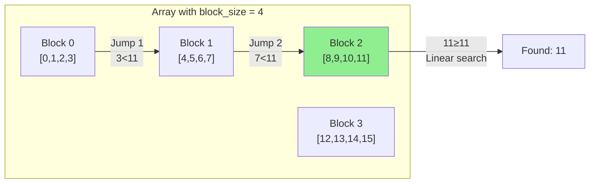

# Jump Search

## Overview

| Property | Value |
|----------|-------|
| **Category** | Block-Based Search |
| **Complexity (Time)** | O(√n) |
| **Complexity (Space)** | O(1) |
| **Requires Sorted** | Yes |
| **Comparison-based** | Yes |

## Description

Jump Search is a searching algorithm for sorted arrays that works by jumping ahead by fixed steps (block size) and then performing a linear search within the identified block. It's particularly useful when jumping back is costly compared to jumping forward, making it a good choice for disk-based data structures.

The optimal block size is $\sqrt{n}$, which balances the number of jumps with the linear search within a block, resulting in O(√n) time complexity.

## Mathematical Foundation

### Optimal Block Size

For an array of $n$ elements, let $m$ be the block size. The algorithm makes:
- At most $\frac{n}{m}$ jumps
- At most $m - 1$ comparisons in linear search

Total comparisons: $\frac{n}{m} + m - 1$

To minimize, take derivative and set to zero:

$$\frac{d}{dm}\left(\frac{n}{m} + m\right) = -\frac{n}{m^2} + 1 = 0$$

Solving: $m^2 = n \implies m = \sqrt{n}$

### Time Complexity with Optimal Block Size

$$T(n) = \frac{n}{\sqrt{n}} + \sqrt{n} = 2\sqrt{n} = O(\sqrt{n})$$

### Number of Comparisons

| Phase | Maximum Comparisons |
|-------|---------------------|
| Jump Phase | $\frac{n}{\sqrt{n}} = \sqrt{n}$ |
| Linear Phase | $\sqrt{n} - 1$ |
| Total | $2\sqrt{n} - 1$ |

### Position After k Jumps

After $k$ jumps, position is:

$$\text{position} = \min(k \cdot \sqrt{n}, n - 1)$$

### Comparison with Binary Search

| n | Jump Search | Binary Search |
|---|-------------|---------------|
| 100 | ~20 | ~7 |
| 10,000 | ~200 | ~14 |
| 1,000,000 | ~2,000 | ~20 |

Binary Search is generally faster, but Jump Search has advantages in certain I/O scenarios.

## Algorithm

### Pseudocode

```
JUMP-SEARCH(A, target):
    n ← length(A)
    block_size ← floor(√n)
    
    // Jump phase: find the block containing target
    prev ← 0
    step ← block_size
    
    while A[min(step, n) - 1] < target:
        prev ← step
        step ← step + block_size
        if prev ≥ n:
            return -1
    
    // Linear search within the block
    while A[prev] < target:
        prev ← prev + 1
        if prev = min(step, n):
            return -1
    
    if A[prev] = target:
        return prev
    
    return -1
```

### Step-by-Step Execution

```
Input: A = [0, 1, 2, 3, 4, 5, 6, 7, 8, 9, 10, 11, 12, 13, 14, 15]
       target = 11, n = 16, block_size = 4

Jump Phase:
  Step 1: prev=0, step=4, A[3]=3 < 11 → jump
  Step 2: prev=4, step=8, A[7]=7 < 11 → jump
  Step 3: prev=8, step=12, A[11]=11 ≥ 11 → stop jumping

Linear Search Phase (block [8, 11]):
  prev=8: A[8]=8 < 11 → continue
  prev=9: A[9]=9 < 11 → continue
  prev=10: A[10]=10 < 11 → continue
  prev=11: A[11]=11 = 11 → found!

Return: 11
```

## Complexity Analysis

### Time Complexity

| Case | Complexity | Condition |
|------|------------|-----------|
| Best | O(1) | Target at first position |
| Average | O(√n) | Target at random position |
| Worst | O(√n) | Target at boundary or not found |

### Space Complexity

| Aspect | Complexity |
|--------|------------|
| Auxiliary Space | O(1) |
| Total Space | O(n) |

### Comparison with Other Searches

| Algorithm | Time | Best Use Case |
|-----------|------|---------------|
| Linear | O(n) | Unsorted, small data |
| Binary | O(log n) | Sorted, random access |
| Jump | O(√n) | Sorted, sequential access preferred |
| Interpolation | O(log log n) avg | Uniform distribution |

## Visual Representation

```mermaid
flowchart TD
    A[Start] --> B[block_size = √n]
    B --> C[prev = 0, step = block_size]
    C --> D{A[step-1] < target?}
    D -->|Yes| E[prev = step]
    E --> F[step += block_size]
    F --> G{prev >= n?}
    G -->|Yes| H[Return -1]
    G -->|No| D
    D -->|No| I[Linear search from prev to step]
    I --> J{Found target?}
    J -->|Yes| K[Return index]
    J -->|No| H
```

### Jump Visualization



## Implementation

### Python Implementation

```python
import math
from collections.abc import Sequence
from typing import TypeVar, Protocol, Any

class Comparable(Protocol):
    def __lt__(self, other: Any, /) -> bool: ...

T = TypeVar("T", bound=Comparable)

def jump_search(arr: Sequence[T], item: T) -> int:
    """
    Python implementation of the jump search algorithm.
    Return the index if the item is found, otherwise return -1.
    
    >>> jump_search([0, 1, 2, 3, 4, 5], 3)
    3
    >>> jump_search([-5, -2, -1], -1)
    2
    >>> jump_search([0, 5, 10, 20], 8)
    -1
    >>> jump_search([0, 1, 1, 2, 3, 5, 8, 13, 21, 34, 55, 89, 144, 233, 377, 610], 55)
    10
    >>> jump_search(["aa", "bb", "cc", "dd", "ee", "ff"], "ee")
    4
    """
    arr_size = len(arr)
    block_size = int(math.sqrt(arr_size))
    
    prev = 0
    step = block_size
    
    # Jump phase
    while arr[min(step, arr_size) - 1] < item:
        prev = step
        step += block_size
        if prev >= arr_size:
            return -1
    
    # Linear search phase
    while arr[prev] < item:
        prev += 1
        if prev == min(step, arr_size):
            return -1
    
    if arr[prev] == item:
        return prev
    
    return -1
```

### Optimized with Custom Block Size

```python
def jump_search_custom_block(
    arr: list[int], 
    target: int, 
    block_size: int = None
) -> int:
    """
    Jump search with custom block size.
    
    >>> jump_search_custom_block([0, 1, 2, 3, 4, 5, 6, 7, 8, 9], 7, block_size=2)
    7
    """
    n = len(arr)
    if block_size is None:
        block_size = int(math.sqrt(n))
    
    if n == 0:
        return -1
    
    prev = 0
    step = block_size
    
    while step < n and arr[step] < target:
        prev = step
        step += block_size
    
    # Linear search in block [prev, min(step, n)]
    for i in range(prev, min(step + 1, n)):
        if arr[i] == target:
            return i
    
    return -1
```

### Generic Implementation

```python
from typing import TypeVar, Callable

T = TypeVar('T')

def jump_search_generic(
    arr: list[T],
    target: T,
    key: Callable[[T], any] = lambda x: x
) -> int:
    """
    Generic jump search with custom key function.
    
    >>> data = [{'id': 1}, {'id': 3}, {'id': 5}, {'id': 7}]
    >>> jump_search_generic(data, 5, key=lambda x: x['id'])
    2
    """
    n = len(arr)
    if n == 0:
        return -1
    
    block_size = int(math.sqrt(n))
    prev = 0
    step = block_size
    
    while step < n and key(arr[step]) < target:
        prev = step
        step += block_size
    
    for i in range(prev, min(step + 1, n)):
        if key(arr[i]) == target:
            return i
    
    return -1
```

## Real-World Applications

### 1. Database Index Lookup

```python
class BlockBasedIndex:
    """
    Database-style index using jump search.
    Efficient for disk-based storage where sequential reads are fast.
    """
    
    def __init__(self, block_size: int = 100):
        self.block_size = block_size
        self.data: list[tuple[int, any]] = []  # (key, value)
    
    def insert(self, key: int, value: any) -> None:
        """Insert key-value pair maintaining sorted order."""
        import bisect
        idx = bisect.bisect_left([k for k, _ in self.data], key)
        self.data.insert(idx, (key, value))
    
    def search(self, key: int) -> any | None:
        """
        Search using jump search strategy.
        
        >>> idx = BlockBasedIndex(block_size=3)
        >>> for i in range(10):
        ...     idx.insert(i * 10, f'value_{i}')
        >>> idx.search(50)
        'value_5'
        """
        n = len(self.data)
        if n == 0:
            return None
        
        block_size = min(self.block_size, int(math.sqrt(n)))
        prev = 0
        step = block_size
        
        # Jump to appropriate block
        while step < n and self.data[step][0] < key:
            prev = step
            step += block_size
        
        # Linear search within block (simulates sequential disk read)
        for i in range(prev, min(step + 1, n)):
            if self.data[i][0] == key:
                return self.data[i][1]
            if self.data[i][0] > key:
                break
        
        return None
```

### 2. Log File Search

```python
import os
from datetime import datetime

class LogFileSearcher:
    """
    Search sorted log files using jump search.
    Efficient when seeking is expensive relative to sequential reading.
    """
    
    def __init__(self, log_file: str):
        self.log_file = log_file
        self.line_count = self._count_lines()
        self.block_size = int(math.sqrt(self.line_count))
    
    def _count_lines(self) -> int:
        """Count total lines in log file."""
        with open(self.log_file, 'r') as f:
            return sum(1 for _ in f)
    
    def _read_line(self, line_num: int) -> str:
        """Read specific line from file."""
        with open(self.log_file, 'r') as f:
            for i, line in enumerate(f):
                if i == line_num:
                    return line.strip()
        return ""
    
    def _extract_timestamp(self, line: str) -> datetime:
        """Extract timestamp from log line."""
        # Format: "2024-01-15 10:30:45 - message"
        timestamp_str = line[:19]
        return datetime.strptime(timestamp_str, '%Y-%m-%d %H:%M:%S')
    
    def search_by_timestamp(
        self, 
        target: datetime
    ) -> tuple[int, str] | None:
        """
        Find log entry closest to target timestamp.
        Uses jump search for efficient disk access pattern.
        """
        n = self.line_count
        if n == 0:
            return None
        
        prev = 0
        step = self.block_size
        
        # Jump phase
        while step < n:
            line = self._read_line(step)
            try:
                ts = self._extract_timestamp(line)
                if ts >= target:
                    break
            except ValueError:
                pass
            prev = step
            step += self.block_size
        
        # Linear search in block
        for i in range(prev, min(step + 1, n)):
            line = self._read_line(i)
            try:
                ts = self._extract_timestamp(line)
                if ts >= target:
                    return (i, line)
            except ValueError:
                continue
        
        return None
```

### 3. Sorted Array Range Query

```python
def find_range(arr: list[int], low: int, high: int) -> tuple[int, int]:
    """
    Find range of elements between low and high using jump search.
    
    >>> find_range([1, 3, 5, 7, 9, 11, 13, 15], 4, 12)
    (2, 5)
    """
    n = len(arr)
    block_size = int(math.sqrt(n))
    
    # Find start of range
    prev = 0
    step = block_size
    while step < n and arr[step] < low:
        prev = step
        step += block_size
    
    start = -1
    for i in range(prev, min(step + 1, n)):
        if arr[i] >= low:
            start = i
            break
    
    if start == -1:
        return (-1, -1)
    
    # Find end of range
    prev = start
    step = prev + block_size
    while step < n and arr[step] <= high:
        prev = step
        step += block_size
    
    end = start
    for i in range(prev, min(step + 1, n)):
        if arr[i] <= high:
            end = i
        else:
            break
    
    return (start, end)
```

### 4. Memory Page Lookup

```python
class PageTable:
    """
    Page table simulation using jump search.
    Models how OS might search page tables.
    """
    
    def __init__(self, page_size: int = 4096):
        self.page_size = page_size
        self.pages: list[tuple[int, int, str]] = []  # (start, end, permissions)
    
    def map_page(
        self, 
        virtual_addr: int, 
        physical_addr: int, 
        permissions: str = 'rw'
    ) -> None:
        """Map a virtual page to physical address."""
        import bisect
        start = (virtual_addr // self.page_size) * self.page_size
        end = start + self.page_size - 1
        idx = bisect.bisect_left(
            [p[0] for p in self.pages], start
        )
        self.pages.insert(idx, (start, physical_addr, permissions))
    
    def lookup(self, virtual_addr: int) -> tuple[int, str] | None:
        """
        Look up physical address using jump search.
        
        >>> pt = PageTable(page_size=1000)
        >>> pt.map_page(0, 10000)
        >>> pt.map_page(1000, 20000)
        >>> pt.map_page(2000, 30000)
        >>> pt.lookup(1500)
        (20500, 'rw')
        """
        n = len(self.pages)
        if n == 0:
            return None
        
        page_start = (virtual_addr // self.page_size) * self.page_size
        block_size = int(math.sqrt(n))
        
        prev = 0
        step = block_size
        
        while step < n and self.pages[step][0] < page_start:
            prev = step
            step += block_size
        
        for i in range(prev, min(step + 1, n)):
            start, phys, perm = self.pages[i]
            if start == page_start:
                offset = virtual_addr - page_start
                return (phys + offset, perm)
            if start > page_start:
                break
        
        return None
```

### 5. Time Series Data Search

```python
from dataclasses import dataclass
from datetime import datetime, timedelta

@dataclass
class DataPoint:
    timestamp: datetime
    value: float

class TimeSeriesDB:
    """
    Time series database using jump search for temporal queries.
    """
    
    def __init__(self):
        self.data: list[DataPoint] = []
    
    def insert(self, timestamp: datetime, value: float) -> None:
        """Insert data point (assumes chronological order)."""
        self.data.append(DataPoint(timestamp, value))
    
    def query_at(self, target_time: datetime) -> DataPoint | None:
        """
        Find data point at or just before target time.
        
        >>> db = TimeSeriesDB()
        >>> base = datetime(2024, 1, 1, 0, 0, 0)
        >>> for i in range(100):
        ...     db.insert(base + timedelta(minutes=i), float(i))
        >>> result = db.query_at(base + timedelta(minutes=50))
        >>> result.value
        50.0
        """
        n = len(self.data)
        if n == 0:
            return None
        
        block_size = int(math.sqrt(n))
        prev = 0
        step = block_size
        
        while step < n and self.data[step].timestamp < target_time:
            prev = step
            step += block_size
        
        result = None
        for i in range(prev, min(step + 1, n)):
            if self.data[i].timestamp <= target_time:
                result = self.data[i]
            else:
                break
        
        return result
    
    def query_range(
        self, 
        start: datetime, 
        end: datetime
    ) -> list[DataPoint]:
        """Query data points in time range."""
        start_idx = self._find_start_index(start)
        if start_idx == -1:
            return []
        
        result = []
        for i in range(start_idx, len(self.data)):
            if self.data[i].timestamp > end:
                break
            result.append(self.data[i])
        
        return result
    
    def _find_start_index(self, target: datetime) -> int:
        """Find index of first point >= target."""
        n = len(self.data)
        block_size = int(math.sqrt(n))
        
        prev = 0
        step = block_size
        
        while step < n and self.data[step].timestamp < target:
            prev = step
            step += block_size
        
        for i in range(prev, min(step + 1, n)):
            if self.data[i].timestamp >= target:
                return i
        
        return -1
```

## When to Use Jump Search

| Scenario | Recommendation |
|----------|----------------|
| Random access is expensive | ✓ Use Jump Search |
| Sequential reads are fast | ✓ Use Jump Search |
| Small dataset (<100 elements) | ✗ Use Linear Search |
| Random access is cheap | ✗ Use Binary Search |
| Data is unsorted | ✗ Use Linear Search |

## References

1. [Jump Search - Wikipedia](https://en.wikipedia.org/wiki/Jump_search)
2. [Block Search Algorithms](https://en.wikipedia.org/wiki/Block_search)
3. Knuth, D.E. "The Art of Computer Programming, Vol. 3: Sorting and Searching"
4. [Disk-Based Data Structures](https://en.wikipedia.org/wiki/B-tree)

## See Also

- [Binary Search](binary_search.md) - Faster for random access
- [Linear Search](linear_search.md) - Simpler alternative
- [Exponential Search](exponential_search.md) - For unbounded arrays
- [Interpolation Search](interpolation_search.md) - For uniform distributions
