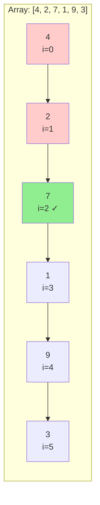

# Linear Search

## Overview

| Property | Value |
|----------|-------|
| **Category** | Sequential Search |
| **Complexity (Time)** | O(n) |
| **Complexity (Space)** | O(1) iterative, O(n) recursive |
| **Requires Sorted** | No |
| **Comparison-based** | Yes |

## Description

Linear Search (also known as Sequential Search) is the simplest searching algorithm. It sequentially checks each element of a collection until it finds an element that matches the target value or until all elements have been checked. Linear Search is applicable to any data structure that supports sequential access, and it works on both sorted and unsorted data.

Despite its simplicity and O(n) time complexity, Linear Search remains useful when:
- The data is unsorted and sorting would be expensive
- The data set is small
- Only a single search is needed
- Elements near the beginning are more likely to be searched

## Mathematical Foundation

### Average Case Analysis

For a collection of $n$ elements where each element has equal probability of being the target:

$$E[\text{comparisons}] = \frac{1}{n} \sum_{i=1}^{n} i = \frac{1}{n} \cdot \frac{n(n+1)}{2} = \frac{n+1}{2}$$

### Probability of Finding Target

If target exists in the array with probability $p$ at each position:

$$P(\text{found at position } i) = (1-p)^{i-1} \cdot p$$

### Unsuccessful Search

For an unsuccessful search (element not present):
- All $n$ elements must be compared
- Time: $\Theta(n)$

### Worst Case

The worst case occurs when:
1. The target is at the last position: $n$ comparisons
2. The target is not in the array: $n$ comparisons

$$T_{\text{worst}}(n) = n = O(n)$$

## Algorithm

### Pseudocode (Iterative)

```
LINEAR-SEARCH(A, target):
    for i ← 0 to length(A) - 1:
        if A[i] = target:
            return i
    return -1    // Not found
```

### Pseudocode (Recursive)

```
REC-LINEAR-SEARCH(A, low, high, target):
    if high < low:
        return -1
    if A[low] = target:
        return low
    if A[high] = target:
        return high
    return REC-LINEAR-SEARCH(A, low + 1, high - 1, target)
```

### Step-by-Step Execution

```
Input: A = [4, 2, 7, 1, 9, 3], target = 7

Step 1: Compare A[0]=4 with 7 → No match
Step 2: Compare A[1]=2 with 7 → No match
Step 3: Compare A[2]=7 with 7 → Match found!

Return: index 2
```

## Complexity Analysis

### Time Complexity

| Case | Complexity | Condition |
|------|------------|-----------|
| Best | O(1) | Target at first position |
| Average | O(n/2) = O(n) | Target at random position |
| Worst | O(n) | Target at last position or not present |

### Space Complexity

| Implementation | Space | Notes |
|----------------|-------|-------|
| Iterative | O(1) | Only loop variables |
| Recursive | O(n) | Call stack depth |
| Recursive (tail) | O(1) | With tail call optimization |

### Comparison Counts

| Scenario | Comparisons |
|----------|-------------|
| Target at position 1 | 1 |
| Target at position k | k |
| Target at last position | n |
| Target not found | n |

## Visual Representation

```mermaid
flowchart TD
    A[Start] --> B[i = 0]
    B --> C{i < n?}
    C -->|Yes| D{A[i] == target?}
    D -->|Yes| E[Return i]
    D -->|No| F[i++]
    F --> C
    C -->|No| G[Return -1]
    E --> H[End]
    G --> H
```

### Search Visualization



## Implementation

### Python Implementation (Iterative)

```python
def linear_search(sequence: list, target: int) -> int:
    """
    A pure Python implementation of a linear search algorithm.
    
    :param sequence: a collection with comparable items
    :param target: item value to search
    :return: index of found item or -1 if item is not found
    
    >>> linear_search([0, 5, 7, 10, 15], 0)
    0
    >>> linear_search([0, 5, 7, 10, 15], 15)
    4
    >>> linear_search([0, 5, 7, 10, 15], 5)
    1
    >>> linear_search([0, 5, 7, 10, 15], 6)
    -1
    """
    for index, item in enumerate(sequence):
        if item == target:
            return index
    return -1
```

### Python Implementation (Recursive)

```python
def rec_linear_search(
    sequence: list, 
    low: int, 
    high: int, 
    target: int
) -> int:
    """
    A pure Python implementation of a recursive linear search.
    
    Searches from both ends toward the middle.
    
    :param sequence: a collection with comparable items
    :param low: lower bound of search range
    :param high: upper bound of search range
    :param target: element to find
    :return: index of target or -1 if not found
    
    >>> rec_linear_search([0, 30, 500, 100, 700], 0, 4, 0)
    0
    >>> rec_linear_search([0, 30, 500, 100, 700], 0, 4, 700)
    4
    >>> rec_linear_search([0, 30, 500, 100, 700], 0, 4, 30)
    1
    >>> rec_linear_search([0, 30, 500, 100, 700], 0, 4, -6)
    -1
    """
    if not (0 <= high < len(sequence) and 0 <= low < len(sequence)):
        raise Exception("Invalid upper or lower bound!")
    if high < low:
        return -1
    if sequence[low] == target:
        return low
    if sequence[high] == target:
        return high
    return rec_linear_search(sequence, low + 1, high - 1, target)
```

### Generic Implementation

```python
from typing import TypeVar, Sequence, Optional

T = TypeVar('T')

def linear_search_generic(
    collection: Sequence[T],
    target: T,
    key=lambda x: x
) -> int:
    """
    Generic linear search with custom key function.
    
    >>> data = [{'id': 1}, {'id': 3}, {'id': 2}]
    >>> linear_search_generic(data, 3, key=lambda x: x['id'])
    1
    """
    for index, item in enumerate(collection):
        if key(item) == target:
            return index
    return -1
```

## Real-World Applications

### 1. Finding in Unsorted Lists

```python
def find_user_by_email(users: list[dict], email: str) -> dict | None:
    """
    Find user by email in an unsorted user list.
    
    >>> users = [
    ...     {'id': 1, 'email': 'alice@example.com'},
    ...     {'id': 2, 'email': 'bob@example.com'},
    ...     {'id': 3, 'email': 'charlie@example.com'}
    ... ]
    >>> find_user_by_email(users, 'bob@example.com')
    {'id': 2, 'email': 'bob@example.com'}
    >>> find_user_by_email(users, 'nobody@example.com') is None
    True
    """
    for user in users:
        if user['email'] == email:
            return user
    return None


class UserDirectory:
    """
    User directory with linear search capabilities.
    Suitable for small collections or when data changes frequently.
    """
    
    def __init__(self):
        self.users: list[dict] = []
    
    def add_user(self, name: str, email: str) -> int:
        """Add user and return their ID."""
        user_id = len(self.users) + 1
        self.users.append({
            'id': user_id,
            'name': name,
            'email': email
        })
        return user_id
    
    def find_by_name(self, name: str) -> list[dict]:
        """Find all users with matching name."""
        return [u for u in self.users if u['name'] == name]
    
    def find_by_partial_email(self, domain: str) -> list[dict]:
        """Find users with email containing domain."""
        return [u for u in self.users if domain in u['email']]
```

### 2. Configuration Lookup

```python
class ConfigManager:
    """
    Configuration manager using linear search for key lookup.
    Appropriate when config changes are rare and lookup is infrequent.
    """
    
    def __init__(self):
        self.configs: list[tuple[str, any]] = []
    
    def set(self, key: str, value: any) -> None:
        """
        Set configuration value.
        
        >>> config = ConfigManager()
        >>> config.set('debug', True)
        >>> config.get('debug')
        True
        """
        # Search for existing key
        for i, (k, _) in enumerate(self.configs):
            if k == key:
                self.configs[i] = (key, value)
                return
        # Not found, add new
        self.configs.append((key, value))
    
    def get(self, key: str, default: any = None) -> any:
        """Get configuration value."""
        for k, v in self.configs:
            if k == key:
                return v
        return default
    
    def has(self, key: str) -> bool:
        """Check if key exists."""
        for k, _ in self.configs:
            if k == key:
                return True
        return False
```

### 3. Event Handler Registration

```python
from typing import Callable

class EventEmitter:
    """
    Simple event emitter using linear search for handler lookup.
    """
    
    def __init__(self):
        self.handlers: list[tuple[str, Callable]] = []
    
    def on(self, event: str, handler: Callable) -> None:
        """
        Register event handler.
        
        >>> emitter = EventEmitter()
        >>> emitter.on('click', lambda: print('clicked'))
        >>> len(emitter.handlers)
        1
        """
        self.handlers.append((event, handler))
    
    def emit(self, event: str, *args, **kwargs) -> int:
        """
        Emit event and call all matching handlers.
        Returns number of handlers called.
        """
        count = 0
        for evt, handler in self.handlers:
            if evt == event:
                handler(*args, **kwargs)
                count += 1
        return count
    
    def off(self, event: str, handler: Callable = None) -> int:
        """Remove handlers for event."""
        removed = 0
        new_handlers = []
        for evt, h in self.handlers:
            if evt == event and (handler is None or h == handler):
                removed += 1
            else:
                new_handlers.append((evt, h))
        self.handlers = new_handlers
        return removed
```

### 4. Text Pattern Search

```python
def find_all_occurrences(text: str, pattern: str) -> list[int]:
    """
    Find all occurrences of pattern in text using linear search.
    
    >>> find_all_occurrences("abcabc", "abc")
    [0, 3]
    >>> find_all_occurrences("hello world", "o")
    [4, 7]
    """
    positions = []
    for i in range(len(text) - len(pattern) + 1):
        match = True
        for j in range(len(pattern)):
            if text[i + j] != pattern[j]:
                match = False
                break
        if match:
            positions.append(i)
    return positions


def find_first_occurrence(text: str, pattern: str) -> int:
    """
    Find first occurrence of pattern.
    
    >>> find_first_occurrence("hello world", "world")
    6
    >>> find_first_occurrence("hello world", "python")
    -1
    """
    for i in range(len(text) - len(pattern) + 1):
        found = True
        for j in range(len(pattern)):
            if text[i + j] != pattern[j]:
                found = False
                break
        if found:
            return i
    return -1
```

### 5. Small Database Query

```python
from dataclasses import dataclass
from typing import Callable

@dataclass
class Record:
    id: int
    name: str
    value: float

class SimpleDB:
    """
    Simple in-memory database using linear search.
    Efficient for small datasets or prototyping.
    """
    
    def __init__(self):
        self.records: list[Record] = []
    
    def insert(self, name: str, value: float) -> int:
        """Insert record and return ID."""
        new_id = len(self.records) + 1
        self.records.append(Record(new_id, name, value))
        return new_id
    
    def find_by_id(self, record_id: int) -> Record | None:
        """
        Find record by ID using linear search.
        
        >>> db = SimpleDB()
        >>> db.insert('A', 1.0)
        1
        >>> db.insert('B', 2.0)
        2
        >>> db.find_by_id(1).name
        'A'
        """
        for record in self.records:
            if record.id == record_id:
                return record
        return None
    
    def find_where(
        self, 
        predicate: Callable[[Record], bool]
    ) -> list[Record]:
        """
        Find all records matching predicate.
        
        >>> db = SimpleDB()
        >>> db.insert('A', 1.0)
        1
        >>> db.insert('B', 2.0)
        2
        >>> results = db.find_where(lambda r: r.value > 1.5)
        >>> len(results)
        1
        """
        return [r for r in self.records if predicate(r)]
    
    def update_where(
        self, 
        predicate: Callable[[Record], bool],
        updater: Callable[[Record], None]
    ) -> int:
        """Update records matching predicate."""
        count = 0
        for record in self.records:
            if predicate(record):
                updater(record)
                count += 1
        return count
```

## Optimizations and Variants

### Move-to-Front Heuristic

```python
def linear_search_mtf(
    sequence: list, 
    target: int
) -> tuple[int, list]:
    """
    Linear search with move-to-front optimization.
    Found element is moved to front for faster future lookups.
    
    >>> arr = [1, 2, 3, 4, 5]
    >>> idx, new_arr = linear_search_mtf(arr, 4)
    >>> idx
    3
    >>> new_arr[0]
    4
    """
    for i, item in enumerate(sequence):
        if item == target:
            # Move to front
            sequence = [sequence[i]] + sequence[:i] + sequence[i+1:]
            return i, sequence
    return -1, sequence
```

### Transposition Heuristic

```python
def linear_search_transpose(
    sequence: list, 
    target: int
) -> tuple[int, list]:
    """
    Linear search with transposition optimization.
    Found element is swapped with its predecessor.
    
    >>> arr = [1, 2, 3, 4, 5]
    >>> idx, new_arr = linear_search_transpose(arr, 4)
    >>> new_arr[2]
    4
    """
    for i, item in enumerate(sequence):
        if item == target:
            if i > 0:
                sequence[i], sequence[i-1] = sequence[i-1], sequence[i]
            return i, sequence
    return -1, sequence
```

## Comparison with Other Searches

| Algorithm | Time | Space | Requires Sorted |
|-----------|------|-------|-----------------|
| Linear Search | O(n) | O(1) | No |
| Binary Search | O(log n) | O(1) | Yes |
| Hash Lookup | O(1) avg | O(n) | No |
| Interpolation | O(log log n) | O(1) | Yes, uniform |

## References

1. [Linear Search - Wikipedia](https://en.wikipedia.org/wiki/Linear_search)
2. Knuth, D.E. "The Art of Computer Programming, Vol. 3: Sorting and Searching"
3. [Self-organizing Lists](https://en.wikipedia.org/wiki/Self-organizing_list)
4. Sedgewick, R. "Algorithms" - Sequential Search

## See Also

- [Sentinel Linear Search](sentinel_linear_search.md) - Optimized variant
- [Binary Search](binary_search.md) - Faster for sorted data
- [Jump Search](jump_search.md) - Block-based alternative
