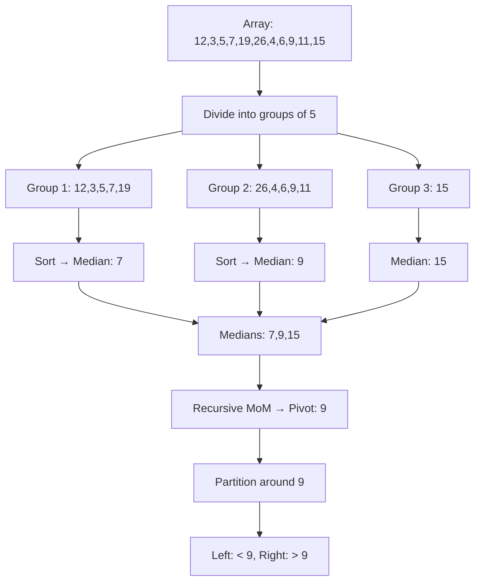
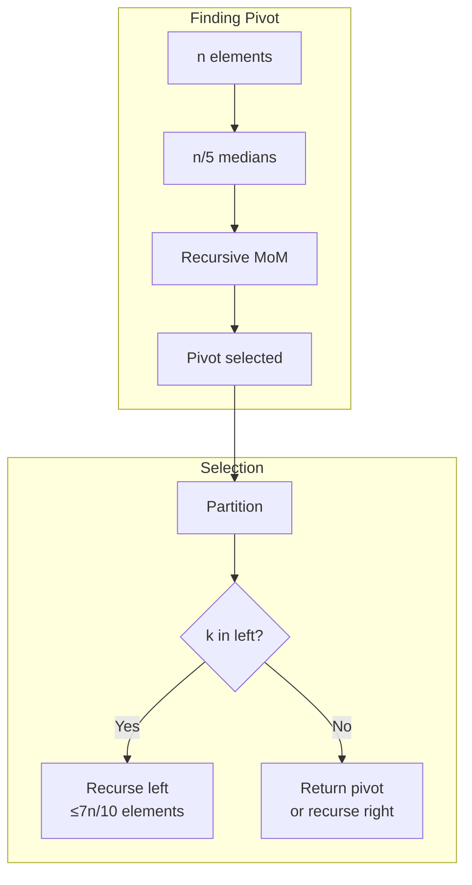

# Median of Medians

## Overview

| Property | Value |
|----------|-------|
| **Category** | Selection Algorithm |
| **Complexity (Time)** | O(n) worst case |
| **Complexity (Space)** | O(log n) recursive stack |
| **Type** | Deterministic selection |
| **Guarantees** | Linear time regardless of input |

## Description

The Median of Medians algorithm (also known as BFPRT after its inventors Blum, Floyd, Pratt, Rivest, and Tarjan) is a deterministic pivot selection strategy that guarantees O(n) worst-case time complexity for selection algorithms like QuickSelect.

Unlike standard QuickSelect that uses random or first-element pivot selection (O(n²) worst case), Median of Medians ensures a "good enough" pivot that eliminates at least 30% of elements with each partition.

## Mathematical Foundation

### Pivot Quality Guarantee

When we divide the array into groups of 5 and find the median of medians:
- At least half the medians are ≤ pivot
- Each of those medians has at least 3 elements ≤ it

Therefore, at least:
$$\text{elements } \leq \text{pivot} \geq \frac{3n}{10}$$

Similarly, at least $\frac{3n}{10}$ elements are ≥ pivot.

### Recurrence Relation

$$T(n) = T\left(\frac{n}{5}\right) + T\left(\frac{7n}{10}\right) + O(n)$$

Where:
- $T(n/5)$: Finding median of medians
- $T(7n/10)$: Recursing on remaining elements (worst case)
- $O(n)$: Partitioning

### Solving the Recurrence

By substitution method, assuming $T(n) \leq cn$:

$$T(n) \leq c\frac{n}{5} + c\frac{7n}{10} + an = cn\left(\frac{1}{5} + \frac{7}{10}\right) + an = \frac{9cn}{10} + an$$

For $c \geq 10a$, we get $T(n) \leq cn$.

**Therefore:** $T(n) = O(n)$

### Why Groups of 5?

| Group Size | Elements Eliminated | Recurrence | Complexity |
|------------|---------------------|------------|------------|
| 3 | 25% | T(n/3) + T(3n/4) | Diverges! |
| 5 | 30% | T(n/5) + T(7n/10) | O(n) |
| 7 | 35% | T(n/7) + T(5n/7) | O(n) |

Groups of 5 is the smallest odd number that provides O(n) guarantee.

## Algorithm

### Pseudocode

```
MEDIAN-OF-MEDIANS(array):
    // Base case: small array
    if |array| ≤ 5:
        return MEDIAN-OF-FIVE(array)
    
    // Divide into groups of 5
    medians ← []
    for i ← 0 to |array| by 5:
        group ← array[i : min(i+5, |array|)]
        medians.append(MEDIAN-OF-FIVE(group))
    
    // Recursively find median of medians
    return MEDIAN-OF-MEDIANS(medians)

MEDIAN-OF-FIVE(array):
    sort(array)
    return array[|array| / 2]

QUICK-SELECT-MOM(array, k):
    // Find k-th smallest element (1-indexed)
    
    // Get pivot using median of medians
    pivot ← MEDIAN-OF-MEDIANS(array)
    
    // Partition around pivot
    left ← [x for x in array if x < pivot]
    right ← [x for x in array if x > pivot]
    pivot_count ← |array| - |left| - |right|
    
    // Determine which partition contains k-th element
    if k ≤ |left|:
        return QUICK-SELECT-MOM(left, k)
    else if k ≤ |left| + pivot_count:
        return pivot
    else:
        return QUICK-SELECT-MOM(right, k - |left| - pivot_count)
```

### Step-by-Step Execution

```
Array: [12, 3, 5, 7, 19, 26, 4, 6, 9, 11, 15]
Find: 5th smallest element (k=5)

Step 1: Compute Median of Medians
  Groups of 5:
    Group 1: [12, 3, 5, 7, 19] → sorted: [3, 5, 7, 12, 19] → median: 7
    Group 2: [26, 4, 6, 9, 11] → sorted: [4, 6, 9, 11, 26] → median: 9
    Group 3: [15] → median: 15
  
  Medians: [7, 9, 15]
  Median of medians: 9 (middle of sorted [7, 9, 15])
  
  pivot = 9

Step 2: Partition around pivot=9
  left = [3, 5, 7, 4, 6] (elements < 9)  → |left| = 5
  middle = [9]                           → |middle| = 1  
  right = [12, 19, 26, 11, 15] (elements > 9) → |right| = 5

Step 3: Determine position
  k = 5, |left| = 5
  k ≤ |left|, so recurse on left

Step 4: QUICK-SELECT-MOM([3, 5, 7, 4, 6], 5)
  Group: [3, 5, 7, 4, 6] → sorted: [3, 4, 5, 6, 7] → median: 5
  pivot = 5
  
  left = [3, 4]  → |left| = 2
  middle = [5]   → |middle| = 1
  right = [7, 6] → |right| = 2
  
  k = 5, |left| = 2
  |left| < k ≤ |left| + |middle| = 3? No
  Recurse on right with k' = 5 - 2 - 1 = 2

Step 5: QUICK-SELECT-MOM([7, 6], 2)
  Group: [7, 6] → sorted: [6, 7] → median: 7
  pivot = 7
  
  left = [6]  → |left| = 1
  middle = [7]
  right = []
  
  k = 2, |left| = 1
  |left| < k ≤ |left| + |middle| = 2? Yes!
  
  Return pivot = 7

Result: 5th smallest element = 7
Verification: sorted array = [3, 4, 5, 6, 7, 9, 11, 12, 15, 19, 26]
              5th element = 7 ✓
```

## Complexity Analysis

### Time Complexity

| Case | Complexity | Notes |
|------|------------|-------|
| Best | O(n) | Good pivot leads to fast partition |
| Average | O(n) | Deterministic linear |
| Worst | O(n) | **Guaranteed** by algorithm design |

### Space Complexity

| Component | Space |
|-----------|-------|
| Median groups | O(n/5) = O(n) |
| Recursion for pivot | O(log n) |
| Partition arrays | O(n) |
| Total | O(n) |

### Comparison with QuickSelect Variants

| Algorithm | Average | Worst Case | Deterministic |
|-----------|---------|------------|---------------|
| QuickSelect (random) | O(n) | O(n²) | No |
| QuickSelect (first) | O(n) | O(n²) | Yes |
| Median of Medians | O(n) | O(n) | Yes |
| Introselect | O(n) | O(n) | Hybrid |

## Visual Representation



### Recursive Structure



## Implementation

### Python Implementation

```python
def median_of_five(arr: list) -> int:
    """
    Return the median of the input list.
    
    Args:
        arr: Array of up to 5 elements
    
    Returns:
        Median value
    
    Examples:
        >>> median_of_five([2, 4, 5, 7, 899])
        5
        >>> median_of_five([5, 7, 899, 54, 32])
        32
        >>> median_of_five([5, 4, 3, 2])
        4
        >>> median_of_five([3, 5, 7, 10, 2])
        5
    """
    arr = sorted(arr)
    return arr[len(arr) // 2]


def median_of_medians(arr: list) -> int:
    """
    Return pivot for partitioning using Median of Medians algorithm.
    
    Args:
        arr: Input array
    
    Returns:
        Median of medians as pivot
    
    Examples:
        >>> median_of_medians([2, 4, 5, 7, 899, 54, 32])
        54
        >>> median_of_medians([5, 7, 899, 54, 32])
        32
        >>> median_of_medians([5, 4, 3, 2])
        4
    """
    if len(arr) <= 5:
        return median_of_five(arr)
    
    medians = []
    i = 0
    while i < len(arr):
        if (i + 4) <= len(arr):
            medians.append(median_of_five(arr[i:].copy()))
        else:
            medians.append(median_of_five(arr[i:i + 5].copy()))
        i += 5
    
    return median_of_medians(medians)


def quick_select(arr: list, target: int) -> int:
    """
    Find the k-th smallest element using Median of Medians pivot.
    
    Args:
        arr: Input array
        target: Rank (1-indexed) of element to find
    
    Returns:
        Element at target rank, or -1 if invalid
    
    Examples:
        >>> quick_select([2, 4, 5, 7, 899, 54, 32], 5)
        32
        >>> quick_select([2, 4, 5, 7, 899, 54, 32], 1)
        2
        >>> quick_select([5, 4, 3, 2], 2)
        3
        >>> quick_select([3, 5, 7, 10, 2, 12], 3)
        5
    """
    # Invalid input
    if target > len(arr):
        return -1
    
    # Get pivot using median of medians
    pivot = median_of_medians(arr)
    
    # Partition
    left = []
    right = []
    pivot_found = False
    
    for element in arr:
        if element < pivot:
            left.append(element)
        elif element > pivot:
            right.append(element)
        elif element == pivot and not pivot_found:
            pivot_found = True
        else:
            right.append(element)
    
    # Determine rank of pivot
    rank_pivot = len(left) + 1
    
    if rank_pivot == target:
        return pivot
    elif rank_pivot > target:
        return quick_select(left, target)
    else:
        return quick_select(right, target - rank_pivot)
```

### Optimized In-Place Implementation

```python
def partition_around_pivot(
    arr: list, 
    left: int, 
    right: int, 
    pivot_value: int
) -> int:
    """
    Partition array around pivot and return pivot's final position.
    """
    # Find pivot and move to end
    pivot_idx = left
    for i in range(left, right + 1):
        if arr[i] == pivot_value:
            pivot_idx = i
            break
    arr[pivot_idx], arr[right] = arr[right], arr[pivot_idx]
    
    # Partition
    store_idx = left
    for i in range(left, right):
        if arr[i] < pivot_value:
            arr[store_idx], arr[i] = arr[i], arr[store_idx]
            store_idx += 1
    
    arr[store_idx], arr[right] = arr[right], arr[store_idx]
    return store_idx


def select_inplace(arr: list, left: int, right: int, k: int) -> int:
    """
    In-place selection using median of medians.
    
    Args:
        arr: Array to search (modified in place)
        left: Left boundary
        right: Right boundary
        k: Index (0-based) of element to find
    
    Returns:
        k-th smallest element
    """
    while True:
        if left == right:
            return arr[left]
        
        # Find pivot using median of medians
        pivot_value = median_of_medians_inplace(arr, left, right)
        
        # Partition and get pivot position
        pivot_idx = partition_around_pivot(arr, left, right, pivot_value)
        
        if k == pivot_idx:
            return arr[k]
        elif k < pivot_idx:
            right = pivot_idx - 1
        else:
            left = pivot_idx + 1


def median_of_medians_inplace(arr: list, left: int, right: int) -> int:
    """
    Find median of medians for subarray arr[left:right+1].
    """
    n = right - left + 1
    
    if n <= 5:
        return sorted(arr[left:right + 1])[n // 2]
    
    # Find medians of groups
    medians = []
    for i in range(left, right + 1, 5):
        group_right = min(i + 4, right)
        group = sorted(arr[i:group_right + 1])
        medians.append(group[len(group) // 2])
    
    # Recursively find median of medians
    return median_of_medians(medians)
```

### Generic Type Version

```python
from typing import TypeVar, Protocol, Callable

class Comparable(Protocol):
    def __lt__(self, other) -> bool: ...

T = TypeVar('T', bound=Comparable)


def select_kth_generic(
    arr: list[T],
    k: int,
    key: Callable[[T], Comparable] = lambda x: x
) -> T:
    """
    Generic k-th element selection.
    
    Examples:
        >>> select_kth_generic([3, 1, 4, 1, 5], 3)
        3
        >>> select_kth_generic(['banana', 'apple', 'cherry'], 2)
        'banana'
        >>> select_kth_generic([(3, 'c'), (1, 'a'), (2, 'b')], 2, key=lambda x: x[0])
        (2, 'b')
    """
    if k < 1 or k > len(arr):
        raise ValueError(f"k={k} out of range [1, {len(arr)}]")
    
    def get_median(items: list[T]) -> T:
        sorted_items = sorted(items, key=key)
        return sorted_items[len(sorted_items) // 2]
    
    def mom(items: list[T]) -> T:
        if len(items) <= 5:
            return get_median(items)
        
        medians = []
        for i in range(0, len(items), 5):
            group = items[i:i + 5]
            medians.append(get_median(group))
        
        return mom(medians)
    
    def select(items: list[T], rank: int) -> T:
        if len(items) == 1:
            return items[0]
        
        pivot = mom(items)
        pivot_key = key(pivot)
        
        left = [x for x in items if key(x) < pivot_key]
        middle = [x for x in items if key(x) == pivot_key]
        right = [x for x in items if key(x) > pivot_key]
        
        if rank <= len(left):
            return select(left, rank)
        elif rank <= len(left) + len(middle):
            return middle[0]
        else:
            return select(right, rank - len(left) - len(middle))
    
    return select(arr.copy(), k)
```

## Real-World Applications

### 1. Percentile Calculation

```python
class PercentileCalculator:
    """
    Calculate percentiles in O(n) time.
    """
    
    def __init__(self, data: list[float]):
        self.data = data
    
    def percentile(self, p: float) -> float:
        """
        Calculate p-th percentile (0-100).
        
        Examples:
            >>> calc = PercentileCalculator([15, 20, 35, 40, 50])
            >>> calc.percentile(50)  # Median
            35
            >>> calc.percentile(25)  # Q1
            20
        """
        if not 0 <= p <= 100:
            raise ValueError("Percentile must be between 0 and 100")
        
        n = len(self.data)
        k = max(1, min(n, int((p / 100) * n + 0.5)))
        
        return quick_select(self.data.copy(), k)
    
    def quartiles(self) -> tuple[float, float, float]:
        """Return Q1, Q2 (median), Q3."""
        return (
            self.percentile(25),
            self.percentile(50),
            self.percentile(75)
        )
    
    def interquartile_range(self) -> float:
        """Return IQR = Q3 - Q1."""
        q1, _, q3 = self.quartiles()
        return q3 - q1
```

### 2. Streaming Median Approximation

```python
class ApproximateMedian:
    """
    Maintain approximate median of streaming data.
    Uses sampling + median of medians.
    """
    
    def __init__(self, sample_size: int = 1000):
        self.sample_size = sample_size
        self.samples: list[float] = []
        self.count = 0
    
    def add(self, value: float) -> None:
        """Add value to stream."""
        self.count += 1
        
        if len(self.samples) < self.sample_size:
            self.samples.append(value)
        else:
            # Reservoir sampling
            import random
            j = random.randint(0, self.count - 1)
            if j < self.sample_size:
                self.samples[j] = value
    
    def median(self) -> float:
        """
        Get approximate median.
        O(n) where n = sample_size.
        """
        if not self.samples:
            raise ValueError("No data")
        
        k = (len(self.samples) + 1) // 2
        return quick_select(self.samples.copy(), k)
```

### 3. Outlier Detection

```python
class OutlierDetector:
    """
    Detect outliers using IQR method with O(n) median.
    """
    
    def __init__(self, data: list[float], multiplier: float = 1.5):
        self.data = data
        self.multiplier = multiplier
        self._compute_bounds()
    
    def _compute_bounds(self) -> None:
        """Compute outlier bounds using median of medians."""
        n = len(self.data)
        
        # Find Q1 (25th percentile)
        k1 = max(1, n // 4)
        self.q1 = quick_select(self.data.copy(), k1)
        
        # Find Q3 (75th percentile)
        k3 = max(1, (3 * n) // 4)
        self.q3 = quick_select(self.data.copy(), k3)
        
        # IQR and bounds
        iqr = self.q3 - self.q1
        self.lower_bound = self.q1 - self.multiplier * iqr
        self.upper_bound = self.q3 + self.multiplier * iqr
    
    def is_outlier(self, value: float) -> bool:
        """Check if value is an outlier."""
        return value < self.lower_bound or value > self.upper_bound
    
    def get_outliers(self) -> list[float]:
        """Return all outliers in data."""
        return [x for x in self.data if self.is_outlier(x)]
    
    def get_bounds(self) -> tuple[float, float]:
        """Return (lower_bound, upper_bound)."""
        return (self.lower_bound, self.upper_bound)
```

### 4. Database Query Optimization

```python
class QueryOptimizer:
    """
    Select optimal pivot for database partitioning.
    """
    
    def __init__(self, column_values: list):
        self.values = column_values
    
    def find_partition_points(self, num_partitions: int) -> list:
        """
        Find partition points for range partitioning.
        Uses median of medians for balanced partitions.
        
        Examples:
            >>> opt = QueryOptimizer(list(range(100)))
            >>> points = opt.find_partition_points(4)
            >>> len(points)
            3
        """
        if num_partitions <= 1:
            return []
        
        n = len(self.values)
        partition_points = []
        
        for i in range(1, num_partitions):
            k = (i * n) // num_partitions
            point = quick_select(self.values.copy(), k)
            partition_points.append(point)
        
        return partition_points
    
    def estimate_selectivity(self, low: int, high: int) -> float:
        """
        Estimate selectivity of range query.
        Uses sampling with median of medians.
        """
        # Sample and find approximate percentiles
        pass
```

## Comparison: Selection Algorithms

| Algorithm | Average | Worst | Space | Notes |
|-----------|---------|-------|-------|-------|
| Sort + Index | O(n log n) | O(n log n) | O(n) | Simple but slow |
| QuickSelect | O(n) | O(n²) | O(log n) | Fast avg, bad worst |
| Median of Medians | O(n) | O(n) | O(n) | Guaranteed linear |
| Introselect | O(n) | O(n) | O(log n) | Best practical |

## References

1. [Median of Medians - Wikipedia](https://en.wikipedia.org/wiki/Median_of_medians)
2. Blum, M., et al. "Time Bounds for Selection" (1973)
3. Cormen, T.H. "Introduction to Algorithms" - Chapter 9

## See Also

- [Quick Select](quick_select.md) - Basic selection algorithm
- [Binary Search](binary_search.md) - O(log n) search in sorted arrays
- [Heap-based Selection](../data_structures/heap.md) - Priority queue approach
