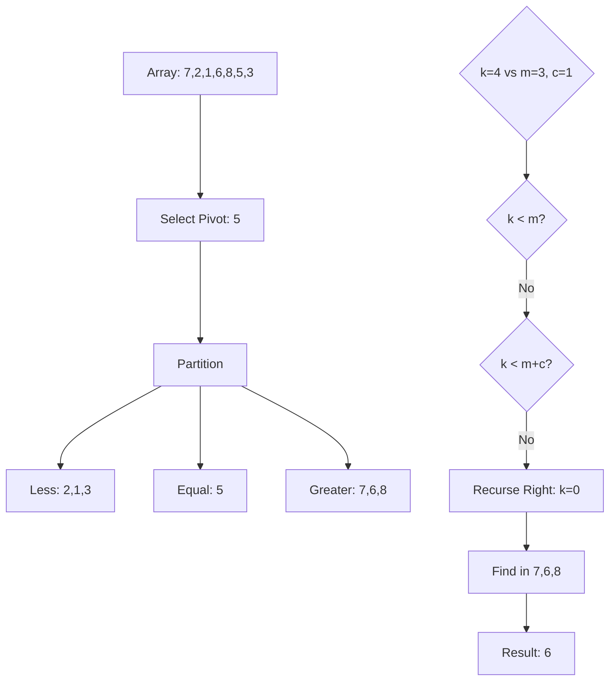

# Quick Select

## Overview

| Property | Value |
|----------|-------|
| **Category** | Selection Algorithm |
| **Complexity (Time)** | O(n) avg, O(n²) worst |
| **Complexity (Space)** | O(n) |
| **Purpose** | Find k-th smallest/largest element |
| **Related To** | QuickSort partitioning |

## Description

Quick Select (also called Hoare's selection algorithm) is a selection algorithm to find the k-th smallest element in an unordered list. It is related to QuickSort, but instead of recursing into both sides, it only recurses into the side containing the desired element.

This algorithm is particularly efficient because it achieves linear average time complexity without needing to fully sort the array. It's commonly used to find medians and percentiles.

## Mathematical Foundation

### Partitioning Principle

Given array $A$ and pivot value $p$:
- Partition into three groups: $L$ (less than $p$), $E$ (equal to $p$), $G$ (greater than $p$)
- Let $m = |L|$ and $c = |E|$

For finding element at index $k$:
- If $k < m$: recurse on $L$
- If $m \leq k < m + c$: return $p$
- If $k \geq m + c$: recurse on $G$ with adjusted index $k - m - c$

### Expected Time Complexity

**Average Case:**
With random pivot selection, expected comparisons:
$$E[C(n)] = n + E[C(n/2)] \approx 2n$$

Thus: $T(n) = O(n)$

**Worst Case:**
When pivot is always extreme (min or max):
$$T(n) = n + T(n-1) = O(n^2)$$

### Median of Medians

To guarantee O(n) worst case, use median-of-medians pivot selection:
- Divide into groups of 5
- Find median of each group
- Recursively find median of these medians
- Use as pivot

This ensures pivot is within 30%-70% of array, giving:
$$T(n) = T(n/5) + T(7n/10) + O(n) = O(n)$$

## Algorithm

### Pseudocode

```
QUICK-SELECT(A, k):
    if length(A) = 1:
        return A[0]
    
    // Select random pivot
    pivot ← A[random(0, length(A)-1)]
    
    // Three-way partition
    L ← {x ∈ A : x < pivot}
    E ← {x ∈ A : x = pivot}
    G ← {x ∈ A : x > pivot}
    
    m ← |L|
    c ← |E|
    
    if k < m:
        return QUICK-SELECT(L, k)
    else if k < m + c:
        return pivot
    else:
        return QUICK-SELECT(G, k - m - c)
```

### Step-by-Step Execution

```
Input: A = [7, 2, 1, 6, 8, 5, 3], k = 4 (find 5th smallest, 0-indexed)

Iteration 1:
  Random pivot = 5 (index 5)
  Partition:
    L = [2, 1, 3] (less than 5)
    E = [5]       (equal to 5)
    G = [7, 6, 8] (greater than 5)
  m = 3, c = 1
  k = 4 >= 3 and k < 3 + 1 = 4? No
  k >= 4, so recurse on G with k' = 4 - 3 - 1 = 0

Iteration 2: QUICK-SELECT([7, 6, 8], 0)
  Random pivot = 7 (index 0)
  Partition:
    L = [6]    (less than 7)
    E = [7]    (equal to 7)
    G = [8]    (greater than 7)
  m = 1, c = 1
  k = 0 < 1, so recurse on L

Iteration 3: QUICK-SELECT([6], 0)
  Length = 1, return A[0] = 6

Result: 6 (the 5th smallest element in sorted order: [1,2,3,5,6,7,8])
```

## Complexity Analysis

### Time Complexity

| Case | Complexity | Condition |
|------|------------|-----------|
| Best | O(n) | Pivot is exact k-th element |
| Average | O(n) | Random pivot |
| Worst | O(n²) | Consistently bad pivots |
| Worst (MoM) | O(n) | Median-of-medians pivot |

### Space Complexity

| Implementation | Space |
|----------------|-------|
| Recursive (partition copy) | O(n) |
| In-place | O(log n) average, O(n) worst |

### Expected Comparisons

$$E[C] = 2n + 2k\ln\left(\frac{n}{n-k+1}\right) + 2(n-k)\ln\left(\frac{n}{k}\right)$$

For median ($k = n/2$): approximately $2.75n$ comparisons.

## Visual Representation



## Implementation

### Python Implementation

```python
import random


def quick_select(items: list, index: int) -> any:
    """
    Find the element that would be at given index if the list were sorted.
    
    Uses the QuickSelect algorithm with three-way partitioning.
    
    Args:
        items: List of comparable elements
        index: The 0-based index of the element to find in sorted order
    
    Returns:
        The element at the specified index in sorted order, or None if invalid
    
    Examples:
        >>> quick_select([2, 4, 5, 7, 899, 54, 32], 5)
        54
        >>> quick_select([2, 4, 5, 7, 899, 54, 32], 1)
        4
        >>> quick_select([5, 4, 3, 2], 2)
        4
        >>> quick_select([3, 5, 7, 10, 2, 12], 3)
        7
    """
    # Invalid index
    if index >= len(items) or index < 0:
        return None
    
    # Select random pivot
    pivot = items[random.randint(0, len(items) - 1)]
    
    # Three-way partition
    smaller, equal, larger = [], [], []
    for element in items:
        if element < pivot:
            smaller.append(element)
        elif element > pivot:
            larger.append(element)
        else:
            equal.append(element)
    
    m = len(smaller)
    c = len(equal)
    
    # Determine which partition to recurse into
    if m <= index < m + c:
        return pivot
    elif m > index:
        return quick_select(smaller, index)
    else:
        return quick_select(larger, index - m - c)


def median(items: list) -> float:
    """
    Find the median of a list using Quick Select.
    
    The median is the middle element (or average of two middle elements)
    in a sorted dataset.
    
    >>> median([3, 2, 2, 9, 9])
    3
    >>> median([2, 2, 9, 9, 9, 3])
    6.0
    """
    n = len(items)
    mid = n // 2
    
    if n % 2 == 1:
        # Odd length: return middle element
        return quick_select(items, mid)
    else:
        # Even length: average of two middle elements
        low_mid = quick_select(items, mid - 1)
        high_mid = quick_select(items, mid)
        return (low_mid + high_mid) / 2
```

### In-Place Implementation

```python
def quick_select_inplace(
    arr: list, 
    k: int, 
    left: int = 0, 
    right: int | None = None
) -> any:
    """
    In-place quick select with Lomuto partition scheme.
    
    Modifies the array in place for better space efficiency.
    
    >>> arr = [3, 2, 1, 5, 6, 4]
    >>> quick_select_inplace(arr.copy(), 2)  # 3rd smallest
    3
    >>> quick_select_inplace(arr.copy(), 4)  # 5th smallest
    5
    """
    if right is None:
        right = len(arr) - 1
    
    if left == right:
        return arr[left]
    
    # Random pivot selection
    pivot_idx = random.randint(left, right)
    arr[pivot_idx], arr[right] = arr[right], arr[pivot_idx]
    
    # Lomuto partition
    pivot = arr[right]
    store_idx = left
    for i in range(left, right):
        if arr[i] < pivot:
            arr[store_idx], arr[i] = arr[i], arr[store_idx]
            store_idx += 1
    
    arr[store_idx], arr[right] = arr[right], arr[store_idx]
    
    # Recurse
    if k == store_idx:
        return arr[k]
    elif k < store_idx:
        return quick_select_inplace(arr, k, left, store_idx - 1)
    else:
        return quick_select_inplace(arr, k, store_idx + 1, right)
```

### Deterministic Linear-Time Selection

```python
def median_of_medians(arr: list, k: int) -> any:
    """
    Quick Select with median-of-medians pivot selection.
    Guarantees O(n) worst-case time complexity.
    
    >>> median_of_medians([3, 1, 4, 1, 5, 9, 2, 6, 5, 3, 5], 5)
    4
    """
    if len(arr) <= 5:
        return sorted(arr)[k]
    
    # Divide into groups of 5
    groups = [arr[i:i+5] for i in range(0, len(arr), 5)]
    
    # Find median of each group
    medians = [sorted(g)[len(g)//2] for g in groups]
    
    # Recursively find median of medians
    if len(medians) <= 5:
        pivot = sorted(medians)[len(medians)//2]
    else:
        pivot = median_of_medians(medians, len(medians)//2)
    
    # Three-way partition around pivot
    smaller = [x for x in arr if x < pivot]
    equal = [x for x in arr if x == pivot]
    larger = [x for x in arr if x > pivot]
    
    m, c = len(smaller), len(equal)
    
    if k < m:
        return median_of_medians(smaller, k)
    elif k < m + c:
        return pivot
    else:
        return median_of_medians(larger, k - m - c)
```

## Real-World Applications

### 1. Statistical Analysis

```python
class StatisticalAnalyzer:
    """
    Compute statistical measures using Quick Select.
    More efficient than sorting for single statistics.
    """
    
    def __init__(self, data: list[float]):
        self.data = data.copy()
    
    def percentile(self, p: float) -> float:
        """
        Calculate the p-th percentile of the data.
        
        >>> analyzer = StatisticalAnalyzer([15, 20, 35, 40, 50])
        >>> analyzer.percentile(50)  # Median
        35
        >>> analyzer.percentile(25)  # Q1
        20
        """
        if not 0 <= p <= 100:
            raise ValueError("Percentile must be between 0 and 100")
        
        n = len(self.data)
        k = int((p / 100) * (n - 1))
        return quick_select(self.data.copy(), k)
    
    def median(self) -> float:
        """
        Calculate the median.
        
        >>> StatisticalAnalyzer([1, 3, 5, 7, 9]).median()
        5
        >>> StatisticalAnalyzer([1, 2, 3, 4]).median()
        2.5
        """
        n = len(self.data)
        data_copy = self.data.copy()
        
        if n % 2 == 1:
            return quick_select(data_copy, n // 2)
        else:
            lower = quick_select(data_copy, n // 2 - 1)
            upper = quick_select(data_copy, n // 2)
            return (lower + upper) / 2
    
    def quartiles(self) -> tuple[float, float, float]:
        """
        Calculate Q1, Q2 (median), and Q3.
        
        >>> q1, q2, q3 = StatisticalAnalyzer(list(range(1, 101))).quartiles()
        >>> q1, q2, q3
        (25, 50, 75)
        """
        return (
            self.percentile(25),
            self.percentile(50),
            self.percentile(75)
        )
    
    def interquartile_range(self) -> float:
        """Calculate IQR = Q3 - Q1."""
        q1, _, q3 = self.quartiles()
        return q3 - q1
```

### 2. Image Processing: Median Filter

```python
class MedianFilter:
    """
    Apply median filtering to images for noise reduction.
    Quick Select is more efficient than sorting for each pixel.
    """
    
    def __init__(self, kernel_size: int = 3):
        if kernel_size % 2 == 0:
            raise ValueError("Kernel size must be odd")
        self.kernel_size = kernel_size
        self.half = kernel_size // 2
    
    def apply(self, image: list[list[int]]) -> list[list[int]]:
        """
        Apply median filter to a grayscale image.
        
        >>> img = [[1, 2, 3], [4, 100, 6], [7, 8, 9]]  # 100 is noise
        >>> filtered = MedianFilter(3).apply(img)
        >>> filtered[1][1]  # Noise replaced by median
        6
        """
        height = len(image)
        width = len(image[0])
        result = [[0] * width for _ in range(height)]
        
        for i in range(height):
            for j in range(width):
                # Extract neighborhood
                neighbors = []
                for di in range(-self.half, self.half + 1):
                    for dj in range(-self.half, self.half + 1):
                        ni, nj = i + di, j + dj
                        if 0 <= ni < height and 0 <= nj < width:
                            neighbors.append(image[ni][nj])
                
                # Use quick select to find median
                k = len(neighbors) // 2
                result[i][j] = quick_select(neighbors, k)
        
        return result
```

### 3. Load Balancing

```python
class LoadBalancer:
    """
    Balance workload distribution using Quick Select for threshold determination.
    """
    
    def __init__(self, server_loads: list[float]):
        self.loads = server_loads
    
    def find_overloaded_servers(
        self, 
        percentile_threshold: float = 90
    ) -> list[int]:
        """
        Find servers above a given load percentile.
        
        >>> lb = LoadBalancer([10, 20, 30, 40, 50, 60, 70, 80, 90, 100])
        >>> lb.find_overloaded_servers(80)  # Above 80th percentile
        [8, 9]
        """
        n = len(self.loads)
        k = int((percentile_threshold / 100) * n)
        threshold = quick_select(self.loads.copy(), k)
        
        return [i for i, load in enumerate(self.loads) if load > threshold]
    
    def find_median_load(self) -> float:
        """Find the median server load."""
        n = len(self.loads)
        if n % 2 == 1:
            return quick_select(self.loads.copy(), n // 2)
        else:
            lower = quick_select(self.loads.copy(), n // 2 - 1)
            upper = quick_select(self.loads.copy(), n // 2)
            return (lower + upper) / 2
    
    def partition_by_median(self) -> tuple[list[int], list[int]]:
        """
        Partition servers into below and above median load.
        
        >>> lb = LoadBalancer([50, 10, 30, 40, 20])
        >>> below, above = lb.partition_by_median()
        >>> len(below), len(above)
        (2, 2)
        """
        median_load = self.find_median_load()
        below = [i for i, load in enumerate(self.loads) if load < median_load]
        above = [i for i, load in enumerate(self.loads) if load > median_load]
        return below, above
```

### 4. K-Nearest Neighbors Optimization

```python
from dataclasses import dataclass
import math

@dataclass
class Point:
    x: float
    y: float
    label: str = ""
    
    def distance_to(self, other: "Point") -> float:
        return math.sqrt((self.x - other.x)**2 + (self.y - other.y)**2)


class KNNClassifier:
    """
    K-Nearest Neighbors classifier using Quick Select.
    More efficient than sorting all distances.
    """
    
    def __init__(self, k: int = 3):
        self.k = k
        self.points: list[Point] = []
    
    def fit(self, points: list[Point]) -> None:
        """Store training points."""
        self.points = points
    
    def predict(self, query: Point) -> str:
        """
        Predict label for query point using k nearest neighbors.
        
        >>> classifier = KNNClassifier(k=3)
        >>> points = [
        ...     Point(0, 0, 'A'), Point(1, 1, 'A'), Point(2, 2, 'A'),
        ...     Point(10, 10, 'B'), Point(11, 11, 'B'), Point(12, 12, 'B')
        ... ]
        >>> classifier.fit(points)
        >>> classifier.predict(Point(1, 0))  # Closer to A's
        'A'
        """
        if len(self.points) < self.k:
            raise ValueError("Not enough training points")
        
        # Calculate distances
        distances = [(p.distance_to(query), p.label) for p in self.points]
        
        # Use Quick Select to find k-th smallest distance
        k_distances = [d[0] for d in distances]
        threshold = quick_select(k_distances, self.k - 1)
        
        # Get labels of k nearest neighbors
        k_nearest_labels = [
            d[1] for d in distances if d[0] <= threshold
        ][:self.k]
        
        # Vote for most common label
        from collections import Counter
        votes = Counter(k_nearest_labels)
        return votes.most_common(1)[0][0]
```

### 5. Database Query Optimization

```python
class DatabaseQueryOptimizer:
    """
    Optimize database queries using Quick Select for sampling and estimation.
    """
    
    def __init__(self, data: list[dict]):
        self.data = data
    
    def sample_percentile(
        self, 
        column: str, 
        percentile: float
    ) -> any:
        """
        Find percentile value for a column without sorting.
        
        >>> data = [{'id': i, 'value': i*10} for i in range(100)]
        >>> opt = DatabaseQueryOptimizer(data)
        >>> opt.sample_percentile('value', 50)
        490
        """
        values = [row[column] for row in self.data]
        k = int((percentile / 100) * len(values))
        return quick_select(values, k)
    
    def top_k(self, column: str, k: int) -> list[dict]:
        """
        Get top k records by column value efficiently.
        
        >>> data = [{'id': i, 'score': i} for i in range(100)]
        >>> opt = DatabaseQueryOptimizer(data)
        >>> len(opt.top_k('score', 5))
        5
        """
        n = len(self.data)
        values = [row[column] for row in self.data]
        
        # Find (n-k)-th smallest = k-th largest threshold
        threshold = quick_select(values, n - k)
        
        return [row for row in self.data if row[column] >= threshold][:k]
    
    def partition_by_median(self, column: str) -> tuple[list[dict], list[dict]]:
        """
        Partition data into two halves based on column median.
        Useful for parallel query processing.
        """
        values = [row[column] for row in self.data]
        median_val = median(values)
        
        lower = [row for row in self.data if row[column] < median_val]
        upper = [row for row in self.data if row[column] >= median_val]
        
        return lower, upper
```

## Comparison with Alternatives

| Method | Time Complexity | When to Use |
|--------|-----------------|-------------|
| Sort + Index | O(n log n) | Multiple queries |
| Quick Select | O(n) avg | Single query |
| Heap-based | O(n log k) | Finding top-k |
| Median of Medians | O(n) worst | Guaranteed linear |

## References

1. [Quickselect - Wikipedia](https://en.wikipedia.org/wiki/Quickselect)
2. Hoare, C.A.R. "Algorithm 65: Find" (1961)
3. Blum, M., et al. "Time Bounds for Selection" (1973)
4. [Median of Medians - Wikipedia](https://en.wikipedia.org/wiki/Median_of_medians)

## See Also

- [Binary Search](binary_search.md) - Search in sorted arrays
- [Median of Medians](median_of_medians.md) - Deterministic selection
- [QuickSort](../01_sorting/quick_sort.md) - Related sorting algorithm
- [Heap Sort](../01_sorting/heap_sort.md) - Alternative for top-k
