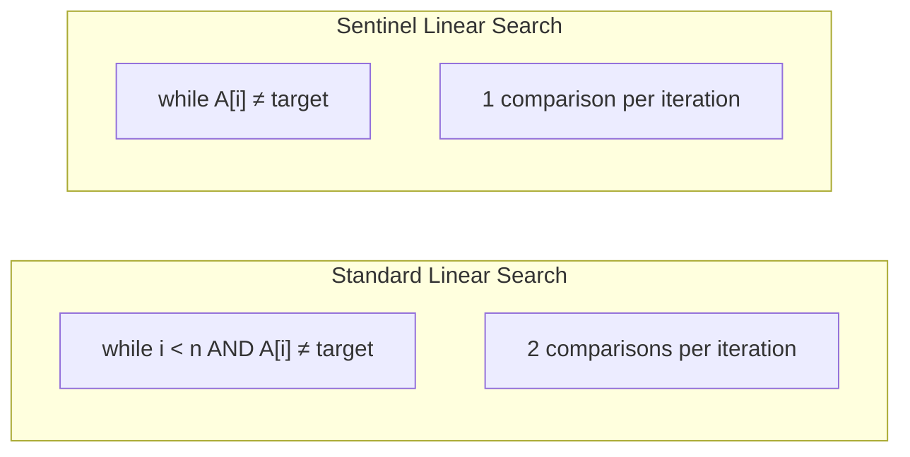

# Sentinel Linear Search

## Overview

| Property | Value |
|----------|-------|
| **Category** | Sequential Search |
| **Complexity (Time)** | O(n) |
| **Complexity (Space)** | O(1) |
| **Requires Sorted** | No |
| **Key Feature** | Reduces comparisons per iteration |

## Description

Sentinel Linear Search is an optimization of the standard linear search algorithm that reduces the number of comparisons in each iteration of the loop. Instead of checking both the array index bounds and element equality at each step, it temporarily appends the target element to the end of the array, guaranteeing that the target will always be found.

This eliminates the bounds check from the main loop, reducing the loop overhead by approximately half.

## Mathematical Foundation

### Comparison Analysis

**Standard Linear Search:**
Each iteration performs two comparisons:
1. Index bounds check: $i < n$
2. Element equality: $A[i] = target$

Total comparisons for unsuccessful search: $2n$

**Sentinel Linear Search:**
Each iteration performs one comparison:
1. Element equality: $A[i] = target$

After loop: one additional bounds check.

Total comparisons for unsuccessful search: $n + 1$

### Speedup Factor

The speedup factor is:
$$S = \frac{2n}{n + 1} \approx 2 \text{ for large } n$$

In practice, the improvement is around 1.5-2x due to other factors.

### Expected Comparisons

For a uniformly distributed target:
- **Standard**: $E[C] = \frac{n+1}{2} \times 2 = n + 1$ (unsuccessful: $2n$)
- **Sentinel**: $E[C] = \frac{n+1}{2} + 1$ (unsuccessful: $n + 1$)

## Algorithm

### Pseudocode

```
SENTINEL-LINEAR-SEARCH(A, n, target):
    // Append sentinel
    last ← A[n-1]           // Save last element
    A[n-1] ← target         // Or append: A[n] ← target
    
    i ← 0
    
    // No bounds check needed
    while A[i] ≠ target:
        i ← i + 1
    
    // Restore array
    A[n-1] ← last           // Or remove: pop A
    
    // Check if found within original bounds
    if i < n - 1 or A[n-1] = target:
        return i
    else:
        return -1
```

### Alternative: Append Sentinel

```
SENTINEL-LINEAR-SEARCH-APPEND(A, target):
    // Append target as sentinel
    A.append(target)
    
    i ← 0
    while A[i] ≠ target:
        i ← i + 1
    
    // Remove sentinel
    A.pop()
    
    // Check if found
    if i < length(A):
        return i
    else:
        return None
```

### Step-by-Step Execution

```
Input: A = [5, 7, 3, 9, 2], target = 9

Step 1: Append sentinel
  A = [5, 7, 3, 9, 2, 9]

Step 2: Search loop
  i=0: A[0]=5 ≠ 9, continue
  i=1: A[1]=7 ≠ 9, continue
  i=2: A[2]=3 ≠ 9, continue
  i=3: A[3]=9 = 9, stop!

Step 3: Remove sentinel
  A = [5, 7, 3, 9, 2]

Step 4: Check bounds
  i=3 < 5 (original length) ✓

Return: 3
```

### Not Found Case

```
Input: A = [5, 7, 3, 9, 2], target = 6

Step 1: Append sentinel
  A = [5, 7, 3, 9, 2, 6]

Step 2: Search loop
  i=0: A[0]=5 ≠ 6, continue
  i=1: A[1]=7 ≠ 6, continue
  i=2: A[2]=3 ≠ 6, continue
  i=3: A[3]=9 ≠ 6, continue
  i=4: A[4]=2 ≠ 6, continue
  i=5: A[5]=6 = 6, stop!

Step 3: Remove sentinel
  A = [5, 7, 3, 9, 2]

Step 4: Check bounds
  i=5 ≥ 5 (original length) ✗

Return: None
```

## Complexity Analysis

### Time Complexity

| Case | Standard | Sentinel |
|------|----------|----------|
| Best | O(1) | O(1) |
| Average | O(n) | O(n) |
| Worst | O(n) | O(n) |

The big-O complexity is the same, but sentinel has lower constant factors.

### Space Complexity

| Aspect | Space |
|--------|-------|
| Extra | O(1) |
| Note | Modifies array temporarily |

### Comparison Count

| Scenario | Standard | Sentinel | Savings |
|----------|----------|----------|---------|
| Found at start | 2 | 2 | 0% |
| Found at middle | n+1 | n/2+1 | ~50% |
| Found at end | 2n-1 | n | ~50% |
| Not found | 2n | n+1 | ~50% |

## Visual Representation

```mermaid
flowchart TD
    A[Start] --> B[Append target as sentinel]
    B --> C[i = 0]
    C --> D{A[i] == target?}
    D -->|No| E[i = i + 1]
    E --> D
    D -->|Yes| F[Remove sentinel]
    F --> G{i < original length?}
    G -->|Yes| H[Return i]
    G -->|No| I[Return None/Not Found]
```

### Loop Comparison



## Implementation

### Python Implementation

```python
def sentinel_linear_search(sequence: list, target) -> int | None:
    """
    Search for target in sequence using sentinel technique.
    
    Appends target to end as sentinel, eliminating bounds check from loop.
    
    Args:
        sequence: List to search in
        target: Element to find
    
    Returns:
        Index of target if found, None otherwise
    
    Warning:
        Temporarily modifies the sequence (appends and removes element)
    
    Examples:
        >>> sentinel_linear_search([0, 5, 7, 10, 15], 0)
        0
        >>> sentinel_linear_search([0, 5, 7, 10, 15], 15)
        4
        >>> sentinel_linear_search([0, 5, 7, 10, 15], 5)
        1
        >>> sentinel_linear_search([0, 5, 7, 10, 15], 6) is None
        True
    """
    # Append sentinel
    sequence.append(target)
    
    # Search without bounds check
    index = 0
    while sequence[index] != target:
        index += 1
    
    # Remove sentinel
    sequence.pop()
    
    # Check if found within original bounds
    if index == len(sequence):
        return None
    
    return index
```

### In-Place Implementation (No Append)

```python
def sentinel_linear_search_inplace(arr: list, target) -> int | None:
    """
    Sentinel search without modifying array length.
    
    Temporarily replaces last element with target.
    
    >>> sentinel_linear_search_inplace([1, 2, 3, 4, 5], 3)
    2
    >>> sentinel_linear_search_inplace([1, 2, 3, 4, 5], 5)
    4
    >>> sentinel_linear_search_inplace([1, 2, 3, 4, 5], 6) is None
    True
    """
    if not arr:
        return None
    
    n = len(arr)
    last = arr[n - 1]  # Save last element
    
    # Check if target is the last element
    if last == target:
        return n - 1
    
    # Set sentinel
    arr[n - 1] = target
    
    # Search
    index = 0
    while arr[index] != target:
        index += 1
    
    # Restore last element
    arr[n - 1] = last
    
    # Check if found before sentinel position
    if index < n - 1:
        return index
    
    return None
```

### Generic Implementation

```python
from typing import TypeVar, Sequence

T = TypeVar('T')


def sentinel_search_generic(
    sequence: list[T], 
    target: T,
    key: callable = lambda x: x
) -> int | None:
    """
    Generic sentinel linear search with key function.
    
    >>> data = [{'id': 1}, {'id': 5}, {'id': 3}]
    >>> sentinel_search_generic(data, 5, key=lambda x: x['id'])
    1
    """
    # Extract values using key
    target_key = key(target) if not isinstance(target, (int, float, str)) else target
    
    # Create sentinel
    if isinstance(sequence[0], dict):
        sentinel = {k: target if k == list(sequence[0].keys())[0] else v 
                   for k, v in sequence[0].items()}
    else:
        sentinel = target
    
    sequence.append(sentinel)
    
    index = 0
    while key(sequence[index]) != target_key:
        index += 1
    
    sequence.pop()
    
    if index == len(sequence):
        return None
    return index
```

## Real-World Applications

### 1. Cache Lookup with Fallback

```python
class CacheWithSentinel:
    """
    Simple cache using sentinel search for lookups.
    Efficient for small cache sizes where O(n) is acceptable.
    """
    
    def __init__(self, max_size: int = 100):
        self.cache: list[tuple[str, any]] = []
        self.max_size = max_size
    
    def get(self, key: str) -> any | None:
        """
        Get value from cache using sentinel search.
        
        >>> cache = CacheWithSentinel()
        >>> cache.put('a', 1)
        >>> cache.get('a')
        1
        >>> cache.get('b') is None
        True
        """
        if not self.cache:
            return None
        
        # Add sentinel
        self.cache.append((key, None))
        
        index = 0
        while self.cache[index][0] != key:
            index += 1
        
        # Remove sentinel
        self.cache.pop()
        
        if index < len(self.cache):
            # Move to front (LRU style)
            item = self.cache.pop(index)
            self.cache.insert(0, item)
            return item[1]
        
        return None
    
    def put(self, key: str, value: any) -> None:
        """Add or update cache entry."""
        # Check if exists
        if self.cache:
            self.cache.append((key, None))
            index = 0
            while self.cache[index][0] != key:
                index += 1
            self.cache.pop()
            
            if index < len(self.cache):
                self.cache.pop(index)
        
        # Add to front
        self.cache.insert(0, (key, value))
        
        # Evict if over capacity
        if len(self.cache) > self.max_size:
            self.cache.pop()
```

### 2. Hardware Interrupt Handler Lookup

```python
class InterruptHandlerTable:
    """
    Interrupt handler lookup table using sentinel search.
    Designed for real-time systems where predictable timing matters.
    """
    
    def __init__(self):
        self.handlers: list[tuple[int, callable]] = []
        self._sentinel_irq = -1  # Invalid IRQ number
    
    def register_handler(self, irq: int, handler: callable) -> None:
        """Register interrupt handler."""
        self.handlers.append((irq, handler))
    
    def find_handler(self, irq: int) -> callable | None:
        """
        Find handler for given IRQ using sentinel search.
        Predictable worst-case timing for real-time guarantees.
        
        >>> table = InterruptHandlerTable()
        >>> table.register_handler(1, lambda: print("IRQ 1"))
        >>> table.find_handler(1) is not None
        True
        """
        if not self.handlers:
            return None
        
        # Add sentinel
        self.handlers.append((irq, None))
        
        index = 0
        while self.handlers[index][0] != irq:
            index += 1
        
        # Remove sentinel
        self.handlers.pop()
        
        if index < len(self.handlers):
            return self.handlers[index][1]
        
        return None
    
    def dispatch(self, irq: int) -> bool:
        """
        Dispatch interrupt to appropriate handler.
        Returns True if handler found and executed.
        """
        handler = self.find_handler(irq)
        if handler:
            handler()
            return True
        return False
```

### 3. Event Subscriber Lookup

```python
from dataclasses import dataclass
from typing import Callable

@dataclass
class Subscriber:
    event_type: str
    callback: Callable
    priority: int = 0


class EventDispatcher:
    """
    Event dispatcher using sentinel search for subscriber lookup.
    """
    
    def __init__(self):
        self.subscribers: list[Subscriber] = []
    
    def subscribe(
        self, 
        event_type: str, 
        callback: Callable,
        priority: int = 0
    ) -> None:
        """Add subscriber for event type."""
        self.subscribers.append(Subscriber(event_type, callback, priority))
    
    def find_subscribers(self, event_type: str) -> list[Subscriber]:
        """
        Find all subscribers for given event type.
        
        >>> dispatcher = EventDispatcher()
        >>> dispatcher.subscribe('click', lambda: None)
        >>> dispatcher.subscribe('click', lambda: None)
        >>> len(dispatcher.find_subscribers('click'))
        2
        """
        results = []
        
        # Use sentinel to find each occurrence
        search_list = self.subscribers.copy()
        
        while search_list:
            # Add sentinel
            search_list.append(Subscriber(event_type, None))
            
            index = 0
            while search_list[index].event_type != event_type:
                index += 1
            
            # Remove sentinel
            search_list.pop()
            
            if index < len(search_list):
                results.append(search_list[index])
                search_list = search_list[index + 1:]
            else:
                break
        
        # Sort by priority
        results.sort(key=lambda s: s.priority, reverse=True)
        return results
    
    def dispatch(self, event_type: str, *args, **kwargs) -> int:
        """
        Dispatch event to all subscribers.
        Returns number of subscribers notified.
        """
        subscribers = self.find_subscribers(event_type)
        for sub in subscribers:
            sub.callback(*args, **kwargs)
        return len(subscribers)
```

### 4. Symbol Table Lookup (Compiler/Interpreter)

```python
class SymbolTable:
    """
    Simple symbol table using sentinel search.
    Useful for small scopes or interpreted languages.
    """
    
    def __init__(self):
        self.symbols: list[tuple[str, any, str]] = []  # (name, value, type)
    
    def define(self, name: str, value: any, var_type: str = "var") -> None:
        """Define a new symbol."""
        self.symbols.append((name, value, var_type))
    
    def lookup(self, name: str) -> tuple[any, str] | None:
        """
        Look up symbol by name using sentinel search.
        
        >>> table = SymbolTable()
        >>> table.define('x', 10, 'int')
        >>> table.lookup('x')
        (10, 'int')
        >>> table.lookup('y') is None
        True
        """
        if not self.symbols:
            return None
        
        # Add sentinel
        self.symbols.append((name, None, None))
        
        index = 0
        while self.symbols[index][0] != name:
            index += 1
        
        # Remove sentinel
        self.symbols.pop()
        
        if index < len(self.symbols):
            return (self.symbols[index][1], self.symbols[index][2])
        
        return None
    
    def update(self, name: str, value: any) -> bool:
        """
        Update existing symbol's value.
        
        >>> table = SymbolTable()
        >>> table.define('x', 10, 'int')
        >>> table.update('x', 20)
        True
        >>> table.lookup('x')[0]
        20
        """
        if not self.symbols:
            return False
        
        # Add sentinel
        self.symbols.append((name, None, None))
        
        index = 0
        while self.symbols[index][0] != name:
            index += 1
        
        # Remove sentinel
        self.symbols.pop()
        
        if index < len(self.symbols):
            old = self.symbols[index]
            self.symbols[index] = (old[0], value, old[2])
            return True
        
        return False
```

### 5. Linear Probing Hash Table

```python
class LinearProbingHashTable:
    """
    Hash table with linear probing using sentinel-style search.
    """
    
    def __init__(self, capacity: int = 16):
        self.capacity = capacity
        self.size = 0
        self.keys: list[str | None] = [None] * capacity
        self.values: list[any] = [None] * capacity
        self.DELETED = object()  # Sentinel for deleted slots
    
    def _hash(self, key: str) -> int:
        return hash(key) % self.capacity
    
    def get(self, key: str) -> any | None:
        """
        Get value using sentinel-style linear probing.
        
        >>> ht = LinearProbingHashTable()
        >>> ht.put('a', 1)
        >>> ht.get('a')
        1
        >>> ht.get('b') is None
        True
        """
        start = self._hash(key)
        index = start
        
        # Linear probe until empty slot (sentinel condition)
        while self.keys[index] is not None:
            if self.keys[index] == key:
                return self.values[index]
            index = (index + 1) % self.capacity
            if index == start:  # Full circle
                break
        
        return None
    
    def put(self, key: str, value: any) -> None:
        """Insert or update key-value pair."""
        if self.size >= self.capacity * 0.7:
            self._resize()
        
        start = self._hash(key)
        index = start
        
        while self.keys[index] is not None and self.keys[index] != self.DELETED:
            if self.keys[index] == key:
                self.values[index] = value
                return
            index = (index + 1) % self.capacity
        
        self.keys[index] = key
        self.values[index] = value
        self.size += 1
    
    def _resize(self) -> None:
        """Double capacity and rehash."""
        old_keys = self.keys
        old_values = self.values
        self.capacity *= 2
        self.keys = [None] * self.capacity
        self.values = [None] * self.capacity
        self.size = 0
        
        for k, v in zip(old_keys, old_values):
            if k is not None and k is not self.DELETED:
                self.put(k, v)
```

## Advantages and Limitations

### Advantages
- Reduces loop overhead by ~50%
- Simple implementation
- No extra space (O(1))
- Works on any comparable elements

### Limitations
- Temporarily modifies the array
- Not thread-safe without synchronization
- Only beneficial for linear search (not binary)
- Negligible gain for small arrays

## When to Use

| Scenario | Recommendation |
|----------|----------------|
| Small unsorted data | ✓ Good choice |
| Performance-critical loops | ✓ Good choice |
| Immutable data | ✗ Cannot modify |
| Thread-shared data | ✗ Needs synchronization |
| Sorted data | ✗ Use binary search |

## References

1. [Sentinel Linear Search - GeeksforGeeks](https://www.geeksforgeeks.org/sentinel-linear-search/)
2. Knuth, D. E. "The Art of Computer Programming, Vol. 3"
3. [Linear Search Optimization Techniques](https://en.wikipedia.org/wiki/Linear_search)

## See Also

- [Linear Search](linear_search.md) - Basic sequential search
- [Binary Search](binary_search.md) - For sorted data
- [Double Linear Search](double_linear_search.md) - Two-pointer variant
- [Jump Search](jump_search.md) - Block-based search
